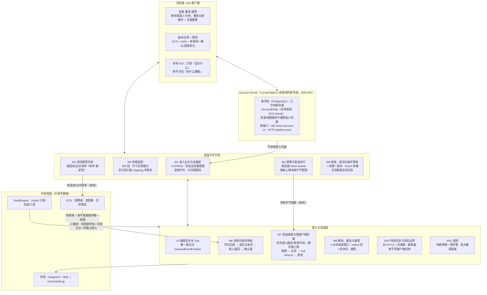
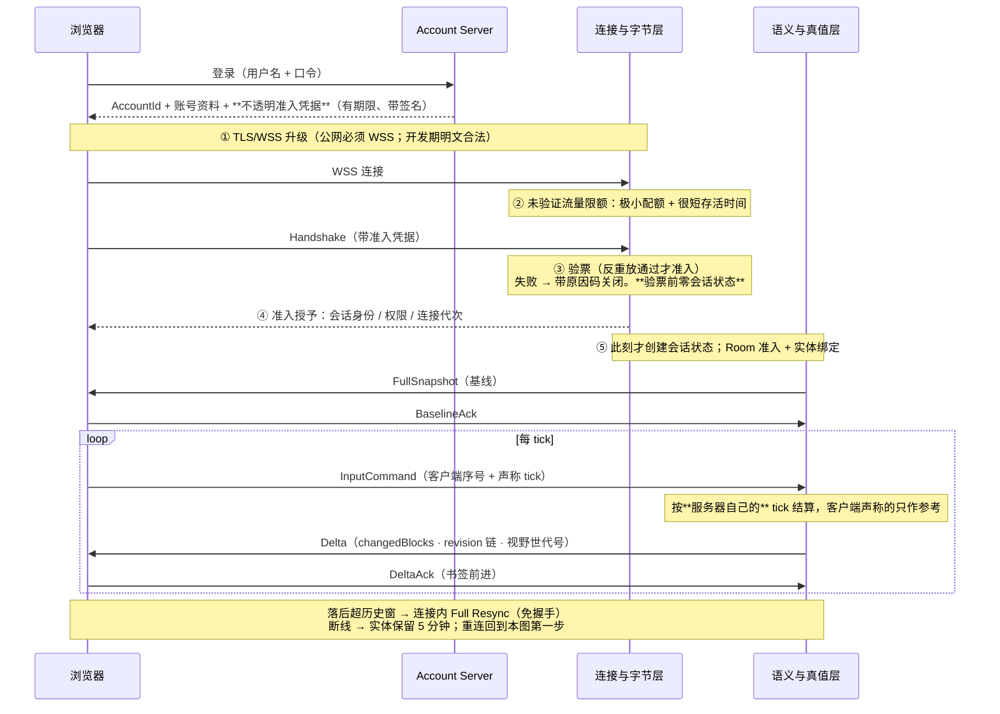
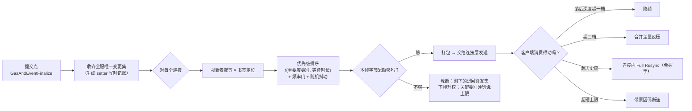

# Lumio DS 设计概要

> 怎么吵出来的、每一板的理由、和外部调研的对账，全在[裁决流水](../../reviews/2026-08-29-ds-server-architecture-decisions.md)与[接缝裁决流水](../../reviews/2026-09-01-seam-closure-decisions.md)里，本文不背这些包袱——本文只回答五个问题：**这是什么、长什么样、每块干什么、按什么顺序做、什么不许做。**
> 配套：[ECS 设计概要](ecs.md)（视野表、变更集、实体绑定的真值方）、[存档设计概要](save-load.md)、[GAS 设计概要](gas.md)。

---

## 1. TLDR

**浏览器发一条带序号的命令上来 → 门卫先验票，验不过连会话都不给建 → 固定步长的 tick 在一帧里唯一那个提交点上结算，顺手记下「哪儿变了」，全服只记一份 → 按每个人的视野表和他的书签各自打包 → 按每个人的本帧字节配额发出去；发不完的不丢，退回队列下一帧优先级升高。**

四条底线，将来砍任何功能都不能碰：

1. **验票前零会话状态**。没验过票的连接只给极小配额和很短的存活时间，一个字节的会话内存都不分配——否则光是握手洪泛就能打死服务器。
2. **diff 一次、分发多次**。变更集全服每帧只算一份；每个连接只存一个书签（收到哪儿了）+ 视野裁剪，**绝不每连接存一份世界副本**。50 个人在线就是「算一次，发 50 份」，不是「算 50 次」。
3. **任何队列截断不丢弃**。带宽不够就少发，剩下的退回待发集、下一帧优先级升高；关键类别有硬饥饿上限（最多欠 N 帧必发）。**没有任何队列可以偷偷扔东西。**
4. **关连接必带已注册原因码**。禁止裸断连，关闭永远走同一条路径。查线上问题时「他为什么掉线」必须有答案。

---

## 2. 概要

### 这是什么

一个**自研 Dedicated Server 框架**。它只做最底层的核心模块并暴露接口——连接、会话、准入、每连接预算、调度原语、传输适配、计算内核、进程与维护。**上层业务（复制语义、体素同步、玩法）是接口的调用方，DS 不负责它们怎么用**，只负责接口本身的开发、管理和性能。

### 两层，不是两种语言

框架分**「连接与字节」层**和**「语义与真值」层**：

| 层 | 拥有什么 |
|---|---|
| **连接与字节** | TLS 终结、握手、限流、每连接 token bucket、传输适配、无语义的计算内核（空间粗筛） |
| **语义与真值** | 固定步长 tick、视野表、变更集打包、发送调度、信任边界策略 |

**公共契约与宿主无关。** 当前切片两层都跑在 C# 宿主上（保里程碑日期）；切片级最小 Rust 宿主并行起建，等它重跑同一套验收通过后接替「连接与字节」层，**契约一个字不改**。

### 一条命令的完整旅程

```text
浏览器
  → Account Server 登录（用户名/口令）→ 拿到不透明的准入凭据
  → DS 五步准入（TLS → 未验证限额 → 握手验票 → 准入授予 → 才建会话）
  → Room 准入，绑定 (账号, 房间, 实体号, 实体类型, 连接代次)
  → FullSnapshot 建基线
  → 之后：InputCommand 上行 / Delta 下行 / Ack 前进书签
```

### 和别人的接缝（引用，不重做）

- **ECS**：视野表、变更集、实体绑定与属性查询面的真值在 ECS，DS 只消费。DS **不画第二套 AOI**。
- **体素**：体素同步是独立自治的子系统，DS 图上只画引用箭头。三条接缝共享：① 同一条连接、带宽统筹（体素大件有配额，不挤死实体实时更新）；② 同一个提交点；③ 同一个确认/回滚单元（防「钻石进包了方块还在」的鬼状态）。
- **存档**：回放 = 输入流 + 快照重放，**不录网络流量**。
- **Timer**：宿主 Timer 服务（单调钟）管重连期限这类真实时间的事；Native Tick/Frame Timer 管节拍任务。两层都是一等公民。

---

## 3. 设计图

### 3.1 总图



### 3.2 主线：老王从打开网页到看见别人挖方块



### 3.3 副线：水管挤破了怎么办



---

## 4. 功能模块（每块可以直接开需求单）

### M1 准入五步与连接层

- **干什么**：当门卫。决定谁能进来、进来算谁、以及怎么把人请出去。
- **能干什么**：① **准入五步冻结**：TLS/WSS 升级 → 未验证流量限额 → 握手 + 验票 → 准入授予（会话身份 / 权限 / 连接代次）→ 才创建会话状态。② **未验证流量限额**：没验票的连接只给极小配额和很短存活时间（浏览器层的握手洪泛防护）。③ **握手契约**：携带 Account Server 签发的**不透明**准入凭据 + 反重放窗口语义；凭据的签发、轮换、密钥管理归 Account Server，**不进 wire 契约**。④ **连接代次**：每次新连接代次 +1，迟到的旧代次消息直接丢弃。⑤ **关闭原因码词表**：现有 `session_closed` / `queue_full` 等之上增列 `connection_timeout`、`protocol_violation`（畸形/解码失败/握手顺序违规）、`input_rate_exceeded`、`send_buffer_overflow`（出站积压，与入站的 `queue_full` 是两个方向）、`normal_logout`。
- **不干什么**：**不自研密码学**（公网必须 WSS，用现成 TLS 终结；开发期本地/内网明文合法）；不做管理员白名单（那是运维策略）；**不允许裸断连**，关闭永远走同一条路径。**两端对畸形输入的策略允许不同**：服务器收到畸形一律断连；客户端收到服务器的畸形按致命级处理（重同步或断开），不要求对称。
- **做完的标准**：不带凭据狂开 1000 条连接，服务器分配的会话内存为零且全部在存活时间内被回收；重放一条已用过的握手报文被拒且带明确原因码；抓包确认每一次连接关闭都带一个词表内的原因码，零裸断；用旧连接代次的消息在新连接上零生效。

### M2 Account Server 与凭据交接

- **干什么**：把「你是谁」和「你能进哪个游戏服」这两件事从游戏服里拿出来，做成独立服务。归属：`LumioPlatform`（ADR-061）——账号域 + `/account` WS 端口 + HTTP 端口同住一个 Kestrel 进程，持久库 PostgreSQL；Game Server 只验票。
- **能干什么**：① 独立进程，自带一份**低频 ECS World**，账号数据建模成组件；`AccountEntity` 按稳定 `AccountId` 加载或创建，登录加载、登出只结束会话不换账号对象。② **登录即注册**（idempotent login-or-register）：用户名不存在就建号连带建 `AccountEntity`；已存在但口令错**直接拒绝、永不覆盖**；同一用户名的并发首次请求收敛到同一个 `AccountEntity` 和同一个 `AccountId`。③ **口令哈希存储**，明文不落盘（测试口令也一样）；口令材料永不返回给游戏服或客户端。④ 签发**有期限的、带签名的、不透明的**准入凭据。⑤ **持久账号库**：服务重启后同一个 `AccountId` 还在。⑥ **Bot 命名空间受控**：`Bot` + 十进制数字这类登录名只有携带已认证的 Bot 工具注册上下文才能创建或认领，普通客户端注册拿不到。
- **不干什么**：不把 `AccountEntity` 作为对象引用交给游戏服（只交 `AccountId` 值）；凭据材料不进普通 ECS 组件（留在凭据库里，或声明成只存档、永不复制）；游戏服**不接受用户名/口令**作为准入替代品。
- **做完的标准**：同一用户名并发发 100 个首次登录请求，最终只有一个 `AccountEntity` 和一个 `AccountId`；错口令登录被拒且账号数据零变化；服务重启后同一用户名拿到同一个 `AccountId`；普通客户端尝试注册 `Bot01` 被拒；抓包和日志里零口令明文。

### M3 传输适配

- **干什么**：把「这条数据怎么送」和「这条数据是什么」彻底分开——换邮局不返工。
- **能干什么**：① V1 传输面 = WebSocket（WSS）档全套：信封 + 传输策略（最大消息字节、最大分片字节、反重放窗口、认证绑定、错误分类）+ 消息类型词表 + 错误码词表。② **所有尺寸上限走配置字段**，不做编译期常量。③ **交付语义（可靠/不可靠）是数据的属性，不是传输的属性**：跟着 mapping 声明走，由传输档负责兑现。V1 WSS 全按可靠兑现、声明照写；将来 WebTransport 落地时不可靠声明自动映射到数据报，**接口不改**。
- **不干什么**：不发明 WebSocket 专属字段（换传输，永不绕过协议）；KCP 不进 V1；不在传输层做加密（那是传输档自己的事，QUIC 内建 TLS，KCP 必须配成熟加密库）。
- **做完的标准**：把最大消息字节从配置里改小一半，两端行为按新值变化且无需重编译；一条声明为「可丢」的数据在 WSS 档上仍然可靠送达且声明保持不变；换一个 WebSocket 库，上层零改动。

### M4 预算与发送执行

- **干什么**：给每条连接发多少字节做限流，并且**每帧告诉语义层「这个人本帧还能吃多少」**。
- **能干什么**：① 每连接 token bucket，**突发上限显式配置**（不做隐式魔法数）。② **每帧字节配额接缝**——本模块最关键的一条：
  - **单位是字节**。token 是桶的内部实现，不出现在接缝上。
  - **语义是「本帧配额」，不是「瞬时余量」**。在 `ProcessorPlan` 相前置读一次并锁定，`ReplicationProjection` 相消费。
  - 为什么必须是配额：如果是瞬时余量，打包过程中数值会变，**同一帧同一状态可能打出不同的包**——确定性义务当场作废。
  ③ 执行实际发送。
- **不干什么**：不决定发什么、不决定谁先谁后（那是 M7）；不在打包中途改配额。
- **做完的标准**：同一帧同一世界状态跑两遍，打出的包逐字节相同；把某条连接的配额调到极小，它只是变慢而不掉数据（退回队列可观测）；突发上限是配置项，改了立刻生效。

### M5 空间粗筛内核

- **干什么**：在千级实体同时移动的场景下，快速算出「谁可能进了谁的视野」，把量级降下来交给上层做真正的裁决。
- **能干什么**：① 空间网格 + 双半径粗筛，每帧产出**候选进/出对清单**。② 清单形状 = `(viewer, target, enter|leave)` 三元组的**有序数组**，序按 `(viewer 创建序, target 创建序)` 排死（复用 ECS「顺序稳定」义务，不造第二套排序规则）。③ 在 `NativeJobBarrier` 相收回。④ **负确定性义务**：同样的输入必须产出逐字节相同的清单。⑤ 双端可复用（客户端拿它做表现剔除和本地查询）。
- **不干什么**：**不做规则过滤**（隐身、队伍、遮挡是 gameplay 状态，留在语义层）；不产出视野表本身（那是 ECS 的真值）；不处理体素（体素是另一本账）。
- **做完的标准**：同一份实体位置快照跑两遍，清单逐字节相同；1000 实体同时移动时该模块的耗时占 tick 预算的比例可测且在阈值内；清单里出现的对，在语义层过滤后一个不漏地进入视野表裁决。

### M6 复制内核四步链

- **干什么**：把「服务器状态变了」变成「每个该知道的人都收到了」，且全服只算一次。
- **能干什么**：**四步链冻结**——
  1. **写时记账**：生成的 setter 自动标脏（生成器打标，结构性消灭「漏标」这类病）；
  2. **提交点收齐**：在唯一提交点之后收齐全服唯一变更集；
  3. **按人裁剪**：视野表 × 书签（未确认区间）；
  4. **确认链**：Ack 前进书签；落后走「合并 → Full Resync」阶梯。

  **变更集历史窗口**：超窗直接 Full Resync（兼任合并反压的地基）；窗口深度归实现仓。

- **不干什么**：**绝不每连接存世界副本或影子状态**（每连接只有一个书签）；**复制字段的值不得依赖观察者**——因人而异的信息（你是谁、你管哪个角色）在准入时告知一次、存连接侧，「只给某些人看」用可见性声明控制发不发，绝不同一字段两副面孔；不展开容器差量编码和可见性枚举（那是 ECS 的地盘）。
- **做完的标准**：50 个连接在线时，变更集计算次数为每帧 1 次（用计数器断言，不靠推理）；每连接的常驻内存与世界实体数无关，只与书签大小相关；把某个连接的书签人为退回到超窗位置，它收到的是 Full Resync 而不是一串补发的 Delta。

### M7 发送调度与慢客户端阶梯

- **干什么**：水管挤破的时候，决定谁先走、谁等着、以及一个跟不上的客户端怎么一级一级降级——而不是一刀踢掉。
- **能干什么**：

  ① **优先级 = f(重要度类别, 等待时长)**：类别由内容层声明；等的越久权重越高。**关键类别有硬饥饿上限**（最多欠 N 帧必发）。

  ② **频率门 + 随机抖动**：对象级发送频率与模拟节拍解耦，抖动防同帧齐发。

  ③ **全图三处回流队列**（实体变更待发集 / 体素差量队列 / 进视野排队）**统一守同一条纪律**：截断不丢弃、回流升权、关键类别硬上限。

  ④ **进视野排队的分工**：队列的键与顺序语义归 ECS（重要度类别声明、饥饿上限的存在性）；**预算、曲线、与另两处队列的统一纪律归本模块**。

  ⑤ **慢客户端四级阶梯**，切换信号统一用**未确认 Delta 的 revision 落后深度**（不用 RTT、不用队列字节数——第三级本来就是这个量，前两级复用它就不必造第二套仪表，且双端都算得出）：

  | 级 | 动作 | 触发 |
  |---|---|---|
  | 1 | 降频 | 落后深度超一档 |
  | 2 | 合并差量反压（上限即一个 Delta，不造追帧机制） | 超二档 |
  | 3 | 连接内 Full Resync（同连接免握手） | 超变更集历史窗 |
  | 4 | 带原因码断连 | 积压超硬上限或连接已死 |

  第 4 级的硬上限**兼任内存与 DoS 保护，不可去**。阈值数值归实现仓。

- **不干什么**：**任何队列不许偷偷扔东西**；**事件类消息不得搭状态通道**——合并反压只对状态成立，事件面必须有独立的有界队列 + 明确的满载策略。
- **做完的标准**：让一个客户端从正常逐步降到断连，四级依次触发且每级都能在日志里看到切换原因和当时的落后深度；关键类别在极端拥塞下的实际欠帧数不超过声明的硬上限；把浏览器标签页切后台 5 分钟再切回，走的是阶梯而不是误踢。

### M8 断线、重连与接管

- **干什么**：网断了、页面刷新了、同一个账号又登进来了——这三件事各自怎么办。
- **能干什么**：① **断线保留 5 分钟**：服务器实体保留，房间照常模拟，实体带**显式 disconnected 状态**且仍对房间可见；只有该账号自己的输入被拒。② **重连 = 全新握手 + 全量快照 + rebind 同一实体号**：只重建客户端副本世界，**服务器不回滚、不重建**；客户端清空本地聊天窗口。③ 窗口用**宿主单调钟**，**不跨进程重启**（重启后恢复的客户端必须重新登录）。④ 超时销毁实体，之后再登录建新实体——账号身份不变，绑定从 A 换到 B。⑤ **接管**：同账号新的已认证准入 → 踢掉旧连接（**带显式终止通知**）→ 走同一条 rebind 路径接上同一个实体。
- **不干什么**：不做 resume token（触发条件：重连全量实测太贵，或需要免重鉴权）；不做无缝不停服迁移；重连不复用旧连接代次。
- **做完的标准**：断线 4 分 59 秒重连拿回同一实体号，5 分 01 秒重连拿到新实体且账号身份不变；重连期间其他玩家看到的房间模拟无中断、无回滚；接管时旧连接收到显式终止原因而不是裸断连；进程重启后残留的客户端被要求重新登录而不是静默失败。

### M9 进程、房间与维护更新

- **干什么**：一个进程装几个版本、几个房间，以及怎么在不炸的前提下换版本。
- **能干什么**：① **一进程一版本**：多个进程池分别服务不同版本。② **Room 多槽**：进程内可以有多个互相隔离的房间世界，每槽独立故障域。③ **无进程级全局状态**——这条今天就写死，是多槽的前提。④ **滚动更新**：新池接新客，旧池 Draining → Empty → Retired。⑤ 大世界形态下的「清空」= 优雅维护窗口：倒计时广播 → 快照落盘 → 维护踢出 → 新进程装快照接管 → 客户端重连强制更新（精确版本匹配，无兼容窗口）。
- **不干什么**：不做进程内多版本共存；不做无缝不停服迁移（触发条件：产品明确要求不停服）；不做跨服务器的角色转移。
- **做完的标准**：用静态检查证明零进程级可变全局状态；杀掉一个房间槽，同进程其他槽继续正常服务；滚动更新窗口期新旧进程并存，客户端按版本正确配对，零错配连接。

### M10 时间同步与信任边界

- **干什么**：让客户端的表现层知道「现在大概是服务器的什么时候」，同时保证服务器一秒钟都不相信客户端说的话。
- **能干什么**：① **对表必须扣往返时间的一半 + 丢弃异常样本**（只做均值不做 RTT 补偿是典型错误做法）；报文捎带即可，不加新协议件；参数数值归实现仓。② **服务器绝不用客户端的钟**：操作一律按服务器自己的 tick 结算，客户端声称的 tick 只作参考；迟到的输入按既有分类处理。③ **异常行为记账升级**：输入超速、序号乱跳、时间漂移过大分别计数，超阈值先限速、再踢（带原因码）。④ **信任边界收成一张集中策略表**（准入 + 校验 + 限速三层），不散在各处。
- **不干什么**：**不允许客户端合法拒收权威纠正**（由客户端权威更新的单一事务结构性堵死）；不把时间同步的结果用于任何逻辑判定（只给表现层用）。
- **做完的标准**：把客户端本地时钟改快一小时，服务器结算结果零变化；输入速率打到阈值以上，先观察到限速再观察到断连，且两步都有记录；集中策略表是一个可以打开看的东西，不是散落的 if。

### M11 观测

- **干什么**：出事的时候能知道出了什么事，同时不让「查问题」本身变成攻击面。
- **能干什么**：① **双端状态哈希漂移 = 一等告警指标**。信号源是 ECS 的每帧轻量哈希（覆盖位置 + Attribute 当前值）；定位用按需全量快照哈希。② **一切按请求放大输出的路径（日志、错误消息、调试导出）必须限速**——这是攻击面。③ 结构化审计事件词表。
- **不干什么**：不做免带宽调试通道（预留位，触发条件：首次线上排障需要）；不把内部状态细节放进给客户端的错误消息里。
- **做完的标准**：人为让一端的浮点结果差一位，下一帧就出现漂移告警；用一条构造的坏请求反复触发错误日志，观察到限速生效而不是日志无限膨胀；日志开销实测不超过 tick 预算的 1%（超了就降耐久档）。

---

## 5. TODO（按这个顺序开卡）

> 交付按 **Living Architecture**（口径见 `.spec/knowledge/standards/repository-architecture.md`「变更顺序」）：
> 托管↔Native 二进制边界改 `engine/abi/native-abi.json`；**其余公共语义（玩法、绑定、账号、定时）各落一份独立的 `engine/wire/<name>-v1.json`——不得扩展 `hello-wire-v1.json`**，由 `node eng/verify-wire.mjs` 跑契约内嵌的正反例。开发态不跑 Baseline / Fixture 门 / 七仓镜像。ADR 编号落笔时现查最高号（编号无机器占号，会被并发抢）。

**阶段 0：先立规矩**

| 卡 | 内容 | 对应模块 |
|---|---|---|
| 0-1 | 会话与准入契约：五步准入、未验证限额语义、**握手携带不透明凭据 + 反重放窗口**、连接代次、关闭原因码词表增列五项 | M1 |
| 0-2 | Account 认证/资料端口契约：登录即注册的失败语义、Bot 工具注册声明与失败码、凭据签发/过期/撤销边界 | M2 |
| ~~0-3~~ | ~~通用玩法命令信封~~ —— **已落地（2026-09-01）**：ADR-049 转 Accepted，契约真值在 `engine/wire/gameplay-command-envelope-v1.json`，校验入口 `node eng/verify-wire.mjs` | M3 / M6 |
| 0-4 | **每帧字节配额接缝契约**：单位、本帧配额语义、读取相位与消费相位 | M4 |
| 0-5 | 空间粗筛内核 ABI：在 root ABI 增槽（照 CLR host 三槽先例 create/call/destroy），清单形状与确定性判据 | M5 |
| 0-6 | 发送调度契约：优先级形状、硬饥饿上限、突发上限显式、三处回流队列纪律、**阶梯切换信号 = revision 落后深度** | M7 |
| 0-7 | 断线/重连/接管契约：保留窗口语义、rebind 规则、接管的终止通知、跨重启边界 | M8 |
| 0-8 | Timer 契约：宿主 Timer（单调钟）与 Native Tick/Frame Timer 的分层、句柄与回调槽的生命周期与失败语义 | M8 / 宿主 |
| 0-9 | 时间同步语义：RTT/2 校正 + 离群剔除 + 报文捎带方式 | M10 |
| 0-10 | 耐久档位 profile：完整 / 异步 / 仅快照三档 + 各自的丢失边界声明 | 存档域 |

**阶段 1：垂直切片**（跑通 = 路线成立）

1. Account Server 起来：登录即注册、口令哈希、签发凭据、账号库跨重启。
2. M1 + M3：五步准入 + WSS 连接 + 关闭原因码全覆盖。
3. Room 准入 + 实体绑定；**100 个 Bot + 1 个浏览器 = 101 个实体在同一个房间**。
4. M6 + M4：FullSnapshot 建基线 → Delta 增量 → Ack 前进书签，配额接缝可观测。
5. 聊天广播：房间内可靠有序，带服务器消息号与生效 tick。
6. M8：断线 5 分钟重连 rebind；同账号重复登入走接管。
7. M7：把一个客户端压到四级阶梯全部走一遍。
8. M11：双端哈希对账通过；人为制造漂移能被告警抓到。
9. 崩溃恢复（存档域配合）。

**阶段 2：Rust 宿主接替**

10. 切片级最小 Rust 宿主**重跑同一套验收**；通过则冻结 C# 宿主退为参考实现。契约零改动是验收项之一。

**阶段 3：性能与扩展**

11. 过 benchmark 关；打包热路径若过不了，下沉 native，**边界不动**。
12. 按实测结果再做：WebTransport 档、重进视野缓存补差、免带宽调试通道、Room 多槽实际启用。

**停下来回图重议的信号（kill criteria）**：

1. 打包热路径过不了性能关 → 下沉 native，边界不动。
2. WSS 可靠流延迟实测不达标（位置流卡顿明显）→ 启 WebTransport 档。
3. 重连全量实测流量/体感超标 → 评估 resume token（保留窗口已经是正式功能，这是下一级）。
4. 日志开销实测超 1% tick 预算 → 降耐久档。
5. 双端哈希频繁不一致且单次定位超一天 → 升级对账工具。

**回图触发条件总表**（不是日期，全是信号）：多局小世界产品形态 → 实际启用 Room 多槽；原生客户端立项且延迟不达标 → WebTransport / KCP 档；产品要求不停服 → 无缝迁移；PvP 掉线逃逸成问题 → 保留窗口策略调整；重进视野流量超标 → 缓存补差；首次线上排障 → 免带宽调试通道。

---

## 6. 明确不做

| 不做 | 级别 | 什么情况回头 |
|---|---|---|
| 自研密码学 | **红线** | 永不——加密归传输档，公网必须 WSS |
| 录网络流量做回放 | **红线** | 永不——回放 = 输入流 + 快照重放 |
| 每连接存世界副本 / 影子状态 | **红线** | 永不——每连接只有一个书签 |
| 复制字段的值因观察者而异 | **红线** | 永不——身份归准入上下文，可见性归声明 |
| 裸断连（不带原因码） | **红线** | 永不——关闭只有一条路径 |
| 服务器用客户端的钟做结算 | **红线** | 永不 |
| 客户端可合法拒收权威纠正 | **红线** | 永不——由单一事务结构性堵死 |
| 事件类消息搭状态通道 | **红线** | 永不——必须独立有界队列 + 满载策略声明 |
| 任何队列偷偷丢数据 | **红线** | 永不——截断即回流 |
| 尺寸上限写成编译期常量 | **红线** | 永不——全部走配置 |
| 进程内多版本共存 | 砍 | 出现「一个进程要同时服务两个版本」的真实运营需求 |
| KCP 传输档 | 推迟 | 原生客户端立项 **且** 实测 WSS/WT 可靠流延迟不达标 |
| WebTransport 档 | 推迟 | WSS 可靠流延迟实测不达标 |
| 无缝不停服迁移 | 推迟 | 产品明确要求不停服 |
| Session Resume Token | 推迟 | 重连全量实测太贵，或需要免重鉴权 |
| 免带宽调试通道 | 推迟 | 首次线上排障需要 |
| 重进视野缓存补差 | 推迟 | 重进视野流量实测超标 |
| 跨服务器角色转移 | 不做 | 产品出现跨服玩法 |

---

## 7. 黑话对照表

| 黑话 | 大白话 |
|---|---|
| 五步准入 | 加密 → 限流 → 验票 → 发身份 → 才建会话，顺序不许乱 |
| 验票前零会话状态 | 没验过票的连接，服务器一个字节的会话内存都不给它花 |
| 连接代次 | 这是你第几次连上来；防迟到的旧消息在新连接上生效 |
| 准入凭据 | 账号服务器发的一张不透明的票，游戏服只验票不认人 |
| 书签（游标） | 每条连接收到哪儿了；服务器只存这个，不存他那份世界 |
| diff 一次分发多次 | 变更全服每帧只算一份，然后按每个人的视野各裁一刀 |
| 变更集历史窗口 | 变更记录只留最近一段；落后超出这段就直接重发全量 |
| 回流 | 这帧没发完的退回队列，下帧优先级更高——不是丢掉 |
| 硬饥饿上限 | 重要的东西最多欠几帧，到了必须发 |
| 频率门 + 抖动 | 每个对象隔多久才发一次，加点随机防止大家同一帧齐发 |
| token bucket | 每条连接的水龙头，按字节限流，允许一定突发 |
| 本帧配额 | 这个人本帧还能吃多少字节——帧初定死，打包中途不变 |
| 慢客户端阶梯 | 跟不上的人分四级降级，最后才断连，不是一刀踢 |
| 落后深度 | 他有多少个 Delta 还没确认——阶梯就看这个数 |
| Full Resync | 在同一条连接上重发全量，免了重新握手那道税 |
| 接管 | 同一个账号又登进来：踢掉旧的，新的接上同一个实体 |
| 保留窗口 | 断线后实体在服务器上留 5 分钟等你回来 |
| 优雅维护 | 倒计时广播 → 存档 → 请出去 → 新进程装存档接管 |
| Draining | 旧进程池不接新客了，等现有的人走完 |
| 粗筛 | 先用格子快速圈出「可能能看见」的对，再让上层做真正的判断 |
| 哈希漂移 | 服务器和客户端算出来的状态对不上了 |
| 放大路径 | 一个请求能让服务器输出很多东西的路径——必须限速，不然是攻击面 |
