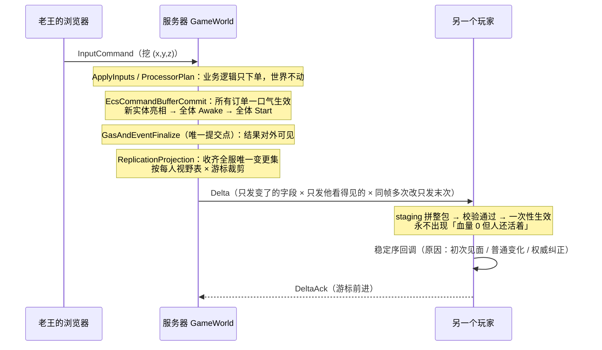
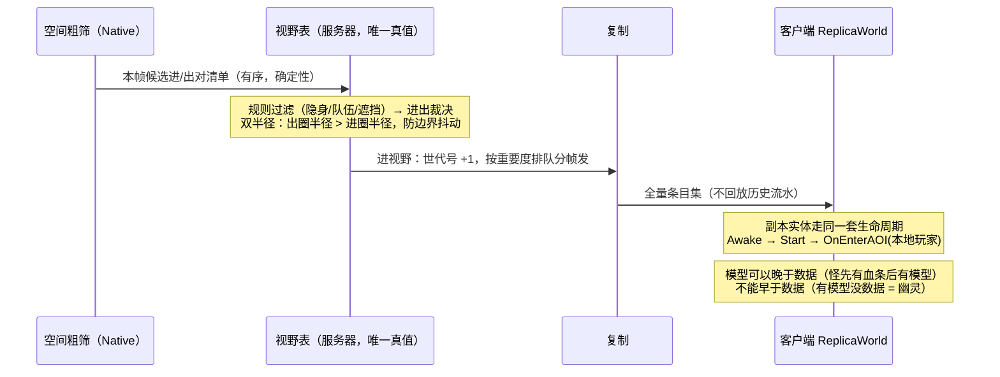

# Lumio ECS 设计概要

> 怎么吵出来的、每一板的理由、和外部调研的对账，全在[审计过账附录](../../reviews/2026-08-29-ecs-architecture-audit.md)与[接缝裁决流水](../../reviews/2026-09-01-seam-closure-decisions.md)里，本文不背这些包袱——本文只回答五个问题：**这是什么、长什么样、每块干什么、按什么顺序做、什么不许做。**
> 学名：**Active-Component ECS Hybrid**——对象组合、组件可带逻辑，ECS 机制（身份、存储、查询、结构事务、同步）做底座。

---

## 1. TLDR

**游戏世界里所有「东西」都是实体。服务器每个房间一份权威世界，客户端一份投影世界，同一套玩法代码两边都跑。程序员在组件字段上打个标记，这个字段就自动同步给该看见它的人——不写一行网络代码。改世界（生个怪、加个组件）不当场生效：一帧里所有改动先攒着，帧内固定一格统一结算，结算完新东西才「亮相」，别人才查得到它。**

四条底线，将来砍任何功能都不能碰：

1. **一帧只有一个提交点**。复制取样、快照切点、确认边界、体素提交全锚在它后面。丢了它，复制/快照/回放/预测四件事要各造一台机器。
2. **同样的输入必须算出同样的结果**。顺序排死、不许读墙上的钟、不许自己造随机数。丢了它，崩溃恢复后 AI 换个点数，线上 bug 永远复现不出来。
3. **没打标记的字段绝不上网**。掉率、仇恨表、服务器内部缓存，默认一个字节都不发。
4. **号码永不复用**。实体死了它的号就陪葬；再问这个号，答「他死了」，不答「查无此人」——对尸体可以放复活术，查无此人才是真错误。

---

## 2. 概要

### 这是什么

一个**自研 ECS 框架**，范围锁死在**五大件 + 实体两模式 + 对宿主三义务**，其他不管。五大件整体是最低标准，一件不可砍；任何裁剪必须重开架构会议。

**五大件**：① 一套代码双端跑；② 完整生命周期（结构事务是它的内脏）；③ 完整属性同步（引用规则是它的内脏）；④ AOI 视野；⑤ Transform 组件。

**实体两模式**：**CS 实体**（双端都有，默认，占网络身份）/ **Local 实体**（纯本端——斧头上的特效载体、UI 假人：无网络身份、不同步、不进视野表、不存档）。

**对宿主的三条义务**（不是三个机制，是三条推论，砍掉任何一条都会砸到某个大件）：

| 义务 | 怎么做到 | 砍了会怎样 |
|---|---|---|
| **可被快照** | 字段上的存档维标记即答案 | 服务器一重启，全服存档没了 |
| **顺序稳定** | 结算按（系统 ID + 相位 + 单号），遍历按创建序；**查询只有一种模式**（按创建序，天然稳定） | 同一场战斗算两遍结果不同，预测纠正永远对不上 |
| **不抓墙钟不自建随机** | 时间用 Tick 号，随机从框架领；禁 `DateTime.Now`、禁自建 `Random` | 恢复后 AI 骰子换点数，线上 bug 无法复现 |

### 一帧怎么走

**记单 → 结算 → 亮相 → 发货。**

一帧内所有逻辑（移动、战斗、AI）改世界只「**下单**」——世界暂时不动。帧内固定一格「**结算**」：所有订单先归一化再一口气生效。生效后新实体「**亮相**」：别人才查得到它，它的钩子才跑。全部完成后这一帧的结果才「**发货**」——对快照和复制可见。

四步落在宿主 13 相的哪一格，见 M3。

### 世界怎么分

- **服务器**：一个 **Room** 一份权威 `GameWorld`，房间之间完全隔离。一个连接同时只在一个 Room 里。
- **客户端**：一份投影 `ReplicaWorld`，经网络身份跟服务器那份对应。
- **Account Server**：自己一份低频 ECS World，装 `AccountEntity`。凭据材料不进普通组件。
- 服务器地图数据的加载是已冻结的 voxel chunk streaming，不存在「整图加载」。

### 谁拥有什么（三线分界）

- **框架层**拥有机制契约（身份、生命周期、同步、视野、Transform 的语义）。
- **内容层**拥有具体组件类型、Attribute 数值、表现资源。
- **实现仓**拥有布局与参数——双半径数值、脏位掩码位宽、池大小、量化精度**一律是实现仓自由度**，不进本文。

依赖单向：内容层 → 框架层 → 实现仓。`Storage` 只对结构事务暴露，对外全走句柄。

### 和宿主的分工

ECS 的结构事务是宿主跨 World 事务的**参与者**，不是协调者：同一 tick 内固定次序 `VoxelCommit` → `EcsCommandBufferCommit`，框架不自设协调逻辑。13 相 Tick、fail-stop、快照/日志/恢复、canonical 编码全是宿主的地盘，ECS 引用不重做。

### 全框架规范词只有 10 个

新增词汇必须先回答「能不能不加」。

| 词 | 一句话定义 |
|---|---|
| **World** | 实体的容器与边界。服务器每 Room 一个（权威），客户端一个（投影，叫 ReplicaWorld） |
| **Entity** | 一个身份。网络身份不透明、永不复用；本地句柄只在本 World 有效 |
| **EntityType** | 实体类型：创建时按类型一次绑定整组组件 |
| **Component** | 能力单元，可带数据与逻辑 |
| **System** | 批处理与跨实体规则的容器 |
| **Tick** | 固定步长逻辑帧，13 相推进，出错整帧作废 |
| **结构事务** | 创建/销毁/增删组件：业务逻辑只「下单」，帧内固定位置统一「上菜」，之后新实体才「亮相」 |
| **复制** | 服务器状态自动同步到客户端——声明即同步 |
| **视野 (AOI)** | 服务器上「哪个玩家看得见哪个实体」的关系表；半径/遮挡/队伍是算出它的输入 |
| **表现 (Presentation)** | 客户端的模型/特效/音频资源，不进模拟、不进哈希 |

`Scene`、`Space`、「兴趣」不是规范词。术语采 **AOI**，不采 ROI。

### 判断口诀

**服务器需要知道它吗？** 需要 → 实体；不需要（刀光特效、模型、音效）→ 不是实体，是表现资源，客户端 Start 后异步加载。

---

## 3. 设计图

### 3.1 总图

```mermaid
flowchart TB
  subgraph CONTENT["内容层：具体组件类型 · Attribute 数值 · 表现资源 · GAS 挂载"]
    GAME["玩法代码——同一套代码双端跑"]
  end
  subgraph ECS["ECS 框架层"]
    M1["M1 World 与身份<br/>Room=一个权威 GameWorld · 客户端 ReplicaWorld<br/>NetEntityId 不透明永不复用 · 句柄=下标+世代号<br/>CS / Local 两模式"]
    M2["M2 EntityType 与创建<br/>组件集+逻辑子实体+约束<br/>编译期校验 · 模板拷贝批量创建"]
    M3["M3 结构事务与生命周期<br/>一帧四步 · 八回调 · 两道闸门<br/>亮相屏障 · 撞单裁决 · 墓碑"]
    M4["M4 属性同步<br/>字段标记三维度 · 类型阶梯<br/>容器条目差量 · 拼好再生效"]
    M5["M5 跨实体引用<br/>网络 ID · 欠条表 · 墓碑查询"]
    M6["M6 AOI 视野<br/>视野表真值 · 双半径 · 两种离开<br/>世代号 · 成套进视野 · 进视野排队"]
    M7["M7 Transform<br/>LogicTransform 权威 / ModelTransform 表现<br/>父子 · 单写者 · 换爹不跳位"]
    M8["M8 Storage<br/>中立 API · 单模式查询 · 类型模板"]
    M9["M9 实体绑定与属性查询面<br/>连接↔实体绑定 · 受控 AttributeId 查询<br/>四种明确结果"]
    M10["M10 预测、投影与对账<br/>可预测字段 · 预表现 · 双轨状态哈希"]
  end
  subgraph HOST["宿主地盘（引用不重做）"]
    H1["13 相 Tick · 唯一提交点 GasAndEventFinalize<br/>快照/WAL/恢复 · 跨 World 事务 · canonical 编码<br/>宿主 Timer（单调钟）· Native Tick/Frame Timer"]
  end
  subgraph NET["网络与体素（各自自治，ECS 只出真值）"]
    N1["DS：复制四步链 · 发送调度 · 会话与准入"]
    N2["VoxelEngine：chunk 订阅/流送/三态状态机"]
  end
  CONTENT --> ECS
  M1 --> M2 --> M3
  M3 --> M4 --> M6
  M5 --> M4
  M7 --> M6
  M1 --> M8
  M3 --> M9
  M4 --> M10
  ECS -- "三义务：可被快照 · 顺序稳定 · 不抓墙钟/随机" --> HOST
  M6 -- "视野表 = 发不发数据的唯一真值" --> NET
  M4 -- "变更集（全服算一次）" --> NET
```

### 3.2 主线：老王挖一下方块，另一个玩家怎么看见

### 3.3 副线：一只怪走进你的视野

---

## 4. 功能模块（每块可以直接开需求单）

### M1 World 与身份

- **干什么**：装实体、划边界、发身份证。
- **能干什么**：① 服务器每 Room 一份权威 `GameWorld`，房间互相隔离；客户端一份 `ReplicaWorld`；各存各的，两边靠网络身份对应。② **网络身份 `NetEntityId`**：128 位不透明值，永不复用，只有 CS 实体持有。③ **本地句柄 = 下标 + 世代号**：`World.Get(句柄)` 是数组直访不是查字典（全 World 只有一张字典：网络 ID → 本地句柄）；世代号防「旧引用指到坑位复用后的新实体」。④ 实体两模式 CS / Local。
- **不干什么**：不跨 World 传裸对象引用（跨 World 只传网络 ID，经 World 解析）；Local 实体不占网络身份、不同步、不进视野表、不存档；一个连接同时只在一个 Room。
- **做完的标准**：销毁再创建一万次，任何旧句柄都解析不到新实体；网络 ID 在全生命周期零复用（含跨 Room、跨重启）；拿 A Room 的句柄去 B Room 解析，返回明确失败而不是错误实体。

### M2 EntityType 与创建

- **干什么**：声明「这类实体由哪些组件构成」，并按类型一次建好。
- **能干什么**：① 声明组件集合、组件间依赖与互斥、**出生自带的逻辑子实体**（武器有耐久、宠物有 AI——创建时一单全建）、实体模式。② **编译期校验**：缺必需组件、依赖成环、类型阶梯外的同步字段——全部在创建或编译时报错，不留到运行时。③ **模板拷贝批量创建是一等公民 API**：类型模板 = 预填好默认值的内存块；建 1000 只怪 = 整块内存拷贝 + 发 1000 个号，拷完改个体差异，各跑自己的 Awake。这是海量创建的主干道。
- **不干什么**：不支持运行时拼装任意组件组合；表现资源（刀光、模型、音效）不是实体，不进 EntityType。
- **做完的标准**：挂了移动组件没挂 Transform 的类型声明编译不过；依赖成环编译不过；批量建 1000 实体的耗时随数量线性增长，且用采样确认走的是整块拷贝而不是逐个初始化。

### M3 结构事务与生命周期

- **干什么**：管实体和组件的生老病死，保证任何人拿不到「建了一半的怪」。
- **能干什么**：

  ① **一帧四步落在 13 相的确定位置**（本模块最硬的一条约束）：

  | 四步 | 落在哪一相 | 为什么只能是这一相 |
  |---|---|---|
  | 记单 | `ApplyInputs` / `ProcessorPlan` | 业务相只写自己的 CommandBuffer，不碰世界 |
  | 结算 + 亮相 + 全体 Awake + 全体 Start | **`EcsCommandBufferCommit`** | 13 相里**只有这一相的可写域是 `GameWorld`**。Awake 要写 Attribute 初值 = 写 GameWorld，所以它跑不到别的相去 |
  | 发货（对外可见） | `GasAndEventFinalize`（唯一提交点） | 提交点之后的相才是 `AfterCommit` 可见性 |
  | 取样打包 | `ReplicationProjection` | 提交点之后，可写域是 `ReplicationView` |

  ② **同帧撞单裁决表**（冻结）：同帧加又删同一组件 = 抵消（钩子不跑）；创建又销毁 = 从没亮相、不占网络身份；同帧两次换爹 = 后单赢 + 查环拒绝；先后顺序按（系统 ID + 相位 + 单号）。

  ③ **亮相屏障**：没亮相的实体，查询查不到、组件读不到。

  ④ **八回调**（钩子长在 Component 上，两端跑同一套）：

  | 回调 | 时机 | 准做 | 禁做 |
  |---|---|---|---|
  | `Awake` | 亮相后、同批全体先跑完 | 初始化自己（Attribute 初值、内部缓存） | 创建/销毁实体、访问其他实体 |
  | `Start` | 全体 Awake 后，按声明序 + 依赖序 | 连接他人、存引用、订阅 | 下结构单；指望别的实体 Start 已跑完 |
  | `OnEnable` / `OnDisable` | Enable 轴切换 | 清 tick 订阅等 | 与视野/网络无关，互不牵扯 |
  | `OnDestroy` | 销毁结算后 | 清非状态资源；读只读终态 | 下结构单（掉落由击杀系统同帧下单，不写在尸体上） |
  | `OnHydrate` | 快照恢复 | 重建缓存（可重跑、纯） | 任何副作用（发奖励、播表现） |
  | `OnEnterAOI(viewer)` / `OnLeaveAOI(viewer, reason)` | 视野表变更；服务器 per-viewer，客户端 viewer = 本地玩家 | 按观察者做业务 | 当作全局状态用 |

  ⑤ **两道闸门跨实体生效**：同一帧一起亮相的所有新实体，所有组件先全部 Awake，再开始 Start——骑手的 Start 找马时，马的所有组件至少 Awake 完了。跨实体只保证 Awake 闸门；要等对方 Start 完，放自己第一次 tick。

  ⑥ **Start 顺序 = 声明顺序 + 可选依赖声明**；依赖成环创建时报错。Awake 顺序按声明序排死（Awake 只动自己，排死只为回放一致）。

  ⑦ **墓碑**：销毁后进墓碑，保留窗口后回收，号码永不复用。

- **不干什么**：钩子里一律不许创建/销毁实体、增删组件（出生自带的写进 EntityType；运行中途出现的附属物在 tick 业务逻辑里下单，晚一帧出现可接受）；钩子里不许写 `GasEvents` 域（那是提交点的可写域，写了会跨相违约）；**钩子里不许做不可回滚的动作**——发网络消息、写文件、播表现一律记 outbox，帧成功收尾后统一执行（钩子抛异常要整帧作废，已经发出去的收不回来）；不做字段级 undo（沿用整帧快照 + 日志）。
- **做完的标准**：同帧加又删同组件，钩子零次触发；同帧建又销毁，网络身份零消耗；用探针确认 Awake/Start 全部在 `EcsCommandBufferCommit` 相内完成，相外写 `GameWorld` 直接失败；钩子抛异常时整帧作废并从上一帧快照重建，且不留半生效状态；快照恢复只跑 `OnHydrate`，同一份快照恢复两遍字节一致。

### M4 属性同步

- **干什么**：让服务器状态自动流到客户端——声明即同步，玩法代码不写网络。
- **能干什么**：

  ① **字段标记，三个互不相干的维度**，各带默认值，90% 字段零声明：

  | 维度 | 取值 | 默认 |
  |---|---|---|
  | **同步** | Server 专属（不上网）/ 双端同步（可见范围：全体｜仅自己｜仅队友…）/ 客户端本地 | `[同步]` = 双端、看得见实体的人都收到；**未打标记绝不上网** |
  | **存档** | 进快照存档 / 不存档（= 可重建，`OnHydrate` 义务，lint 可查） | 权威字段默认进 |
  | **可预测** | 开 / 关 | 关；开了才有权威/预测双份值 |

  四种同步×存档组合都合法：同步+存档（背包）、只存档（AI 仇恨表）、只同步（装备算出的移速终值，恢复时重算）、都不标（受击闪白）。敏感字段泄露面由 lint 扫敏感词兜底。

  ② **类型阶梯**：标量（int/float/bool/枚举/向量）变了发新值；string 当标量整体重发，**长文本（聊天）不走属性同步走消息通道**；List/Dict 必须用框架容器 `SyncList<T>` / `SyncDict<K,V>`（**裸容器编译报错**），按条目差量；嵌套结构体整体当一个值，超两层编译警告；实体引用存网络 ID；**阶梯外类型编译报错**。

  ③ **容器条目差量六条**：写时记账同帧折叠（加了又删 = 抵消）；帧末只发变更条目（没动的 95 格一个字节不发）；与标量同一事务生效 + 条目级回调；**初次/重进视野/重连发当前全量条目集，不回放历史流水**；没人看不记账；每容器声明尺寸上限。

  ④ **发送是帧末统一打包**，三道闸控量：只发变化字段 × 只发视野内 × 同帧多次改只发末次。**diff 一次、分发多次**：变更集全服每帧只算一份，每连接只有一个游标（书签），绝不每连接存世界副本。

  ⑤ **接收拼好再生效**：staging 拼整包 → 校验通过 → 一次性生效。`血量=0` 和 `状态=死亡` 同一权威帧产生，UI 回调绝不会看到「血量 0 但人还活着」。回调带原因三种：**初次见面 / 普通变化 / 权威纠正**——进视野收到全量不该播受伤动画。

  ⑥ **写权限**：只有服务器权威侧写才标脏；客户端应用服务器数据**不回声**；客户端预测写走可预测维的独立通道。

  ⑦ **Attribute**：同步权威结果（当前值 + 修订号），不同步计算过程；Modifier 内部表默认不同步（GAS 边界）；必须同帧到达的字段（血量 + 死亡态）声明成一致性组。

- **不干什么**：不做运行时反射式同步（编辑器反射除外）；不发明字节格式（信封与编码用已冻结的复制契约）；复制字段的值**不得依赖观察者**——因人而异的信息在登录准入时告知一次、存连接侧，「只给某些人看」用可见性声明控制发不发，绝不同一字段两副面孔。
- **做完的标准**：未打标记的字段在抓包里零出现；改一个 100 格背包的第 5 格，线上字节只包含那一格；血量与死亡态在客户端同一次回调里到达，中间态零观测；同一实体同帧改三次，只发最后一次的值；客户端应用服务器数据后不产生任何上行。

### M5 跨实体引用

- **干什么**：让「目标 / 主人 / 爹」这类指向别的实体的字段永远指对人。
- **能干什么**：① **存身份证号**：组件里存网络 ID，不存对象引用（对象会被销毁、坑位会被池化复用，旧引用悄悄指到新怪且没有任何报错）；用时经 World 解析。② **欠条表**：引用目标还没进视野 → 框架记欠条「宠物欠一个主人，号码 1001」，到货自动接上并通知。业务三选一策略：等待 / 默认值 / 不关心。③ **墓碑**：目标已死 → 查询返回「**他死了**」而不是「查无此人」。
- **不干什么**：不跨 World 传裸对象引用；不自动重定向到「替代实体」。
- **做完的标准**：宠物先于主人进视野时，主人到货那一刻宠物收到接上通知，且中间期间不读到错误的主人；对已销毁引用的查询返回墓碑态，与「号码从未存在」是两种可区分的结果。

### M6 AOI 视野

- **干什么**：算出「哪个玩家看得见哪个实体」这张关系表——同步、RPC、客户端加载全由它驱动。
- **能干什么**：

  ① **三层各管各**：服务器视野表管「发不发数据」；客户端副本管「实体在不在」；表现管「模型加载没」。可共用距离信号、各自换挡；**模型可以晚于数据，不能早于数据**。

  ② **视野表是发数据的唯一真值**。客户端本地 AOI 只管「显示什么」，**绝不决定「收到什么数据」**——否则改半径就是透视挂。

  ③ **粗筛与真值分离**：空间粗筛（网格、双半径候选对）下沉 Native 内核，每帧交回**候选进/出对清单**；规则过滤（隐身、队伍、遮挡）、进出裁决、钩子留在 C#。清单形状 = `(viewer, target, enter|leave)` 三元组的有序数组，序按 `(viewer 创建序, target 创建序)` 排死（承「顺序稳定」义务），在 `NativeJobBarrier` 相收回。

  ④ **进/出圈双半径**：出圈半径必须大于进圈半径（防站在 30 米整的怪每帧进-出-进-出，每次进都发全量）；数值归实现仓。

  ⑤ **两种离开**：性能型（走远）可走缓冲防反复横跳；**安全型（隐身/进迷雾）立即从视野表删除、不走任何缓冲**——服务器多发一帧，透视挂就多看一帧。每条离开带原因。

  ⑥ **视野世代号**：同一玩家对同一实体每次重新进视野世代 +1；迟到的旧世代包直接丢弃。重连同理（新连接世代、全新握手）。

  ⑦ **成套进视野**：默认随 Transform 父子——发骑手前保证马已发；无挂接的跟随（宠物随主人）走显式声明例外通道。

  ⑧ **进视野排队**：传送落地 500 个实体不一帧全发；按重要度排队分帧，**关键实体有饥饿上限**。**本模块只定队列的键与顺序语义**（重要度类别由内容层声明、饥饿上限的存在性）；**预算、曲线、与另两处回流队列的统一纪律归 DS**。

- **不干什么**：不处理体素——AOI 只管 ECS 实体，体素订阅是另一本账；不做休眠/LOD 复制（V1 预留不实现）；V1 出视野即销毁客户端副本（`OnLeaveAOI` → `OnDestroy` 连发），不做「出视野缓存不销毁」（预留位：将来加上时 `OnLeaveAOI` 照常触发而 `OnDestroy` 不触发，内容层代码不用改）。
- **做完的标准**：让一个实体在进出圈半径之间来回横跳 1000 帧，进视野全量发送次数为个位数；隐身生效的那一帧，视野表里该条目立即消失（零缓冲帧）；重进视野收到的是当前全量条目集而不是历史流水回放；粗筛清单对同一输入两次运行逐字节相同。

### M7 Transform

- **干什么**：管位置。逻辑位置和表现位置是两个组件，分得干干净净。
- **能干什么**：① **LogicTransform**——逻辑坐标：服务器权威、同步、存档、固定步长推进。② **ModelTransform**——表现坐标：客户端 Local 域，不同步不存档，表现帧率自由（两个逻辑帧之间插值、跑动画曲线）。③ 数据流**单向**：插值/动画系统读 Logic 写 Model，永不写回。④ **父子记账归 LogicTransform**（父指针 + 子列表）；解绑在结构事务结算时统一做、顺序排死（不许在析构里各干各的——遍历中改列表是崩溃根源）。⑤ `SetParent` 带「随父销毁」选项，**默认不随**：父销毁子解绑、保留世界坐标站在原地，不陪葬、不瞬移回原点。⑥ **换爹不跳位**：框架自动重算局部坐标，世界位置不变；瞬移必须显式 `Teleport`（本质是逻辑层喊给表现层「这次别插值，直接闪」）。⑦ **网络同步局部坐标 + 父引用**：马跑，马背上的人零流量；父不可见时兜底发世界坐标。
- **不干什么**：**任何逻辑判定（碰撞、射程、AOI）只准看 LogicTransform**；同帧一个实体的逻辑坐标只有一只手写（物理接管归物理相，其余归逻辑相），**同帧双写者 = 启动时报错**，不是运行时看运气。
- **做完的标准**：马跑一分钟，马背上的人产生的位置字节为零；`SetParent` 前后世界坐标零漂移；同帧两个系统写同一实体的 LogicTransform，启动即失败并指出是哪两个系统；父销毁后子留在原地而不是回到原点。

### M8 Storage

- **干什么**：把实体和组件真正存起来，同时不让布局泄漏到玩法代码里。
- **能干什么**：① **API 手感不变、永不泄漏布局**：`entity.Get<Transform>().Position`；句柄 = 下标 + 世代号。② **参考布局**：实体表（创建序）+ 热数据 SoA 大数组（LogicTransform / Attribute）+ 带逻辑组件对象池 + EntityType 预编译模板。③ **查询只有一种模式**（按创建序，天然稳定）——顺序稳定义务的落点。④ **冻 API 不冻布局**：实现仓可换布局而不动内容层代码。
- **不干什么**：不做第二种查询模式；不暴露 Storage 给结构事务以外的调用方；不承诺「任意组件对象图自动获得 DOD 性能」（性能承诺由 benchmark 关承载，不由名字承载）。
- **做完的标准**：换一次内部布局，内容层代码零改动且测试全绿；同一份世界连续遍历两次，顺序完全一致；`Get` 走数组直访，用采样确认热路径无字典查找。

### M9 实体绑定与属性查询面

- **干什么**：把「这条连接是哪个实体」和「怎么读一个实体的属性」做成全框架共用的能力——不是聊天专用逻辑。
- **能干什么**：① **连接↔实体绑定**：准入后服务器维护 `AccountId + RoomId + NetEntityId + EntityType + 连接代次`。客户端能解析自己绑定的 `NetEntityId`；服务器能从已准入连接或 `NetEntityId` 解析到本 Room 的权威实体。② **受控属性查询面**：按组件 schema 声明的稳定 `AttributeId` 查询——**不是 SQL、不是数据库 API、不允许直接访问 Storage、不支持任意属性名查找**。③ **两侧各有边界**：服务器查询是权威读，限定在请求的 Room/World 与服务器权限内，且只在模拟所有者线程上进行（**不许从网络线程伸手进 Storage**）；客户端查询限定在自己的 `ReplicaWorld`、已同步字段、视野与权限内。④ **结果带 revision/Tick**，消费方能识别读到的是不是过期数据。⑤ **`AccountId` 是持久业务身份，不自动作为公开客户端属性披露**。
- **不干什么**：不把 `AccountEntity` 作为对象引用带进 Game World（只带 `AccountId` 值）；不做任意表达式查询；不让客户端查到 server-only 或 persist-only 字段。
- **做完的标准**：查一个已销毁的 `NetEntityId`，返回明确的「不存在/墓碑/过期」而不是解析到替代实体；查一个不可见实体，返回明确的「不可见」而不是空数据（两者可区分）；从网络线程调用服务器查询直接失败；客户端查 server-only 字段返回权限拒绝。

### M10 预测、投影与对账

- **干什么**：让客户端能抢跑，同时保证抢错了能干净地被拉回来；并且提供双端是否算歪了的信号。
- **能干什么**：

  ① **可预测字段**（基本是位置、朝向）在客户端有权威/预测双份：服务器纠正时从确认值重算，抢跑的数不许覆盖确认的数。普通字段只有一份。渲染平滑走 ModelTransform。

  ② **预表现（最小化，不做改号）**：客户端预表现 = 创建 **Local 实体**做特效载体；服务器确认的正式实体走**正常进视野流程**到达（零特例）；把特效搬到正式实体、销毁本地实体——「对上号」由玩法按上下文自认（「我最近一次开枪」），框架不管。

  ③ **重连与接管**：断线后服务器实体保留 **5 分钟**，房间照常模拟，实体带**显式 disconnected 状态**且仍对房间可见；只有该账号的输入被拒。重连做全新握手 + 全量快照，**rebind 同一 `NetEntityId`**，只重建客户端 `ReplicaWorld`，服务器不回滚不重建；客户端清空本地聊天窗口。窗口用宿主单调钟、**不跨进程重启**。超时销毁，再登录建新实体（账号身份不变，绑定从 A 换到 B）。同账号新的已认证准入 = **接管**：踢掉旧连接（带显式终止通知）并走同一条 rebind 路径。

  ④ **双轨状态哈希**：
  - **每帧轻量哈希**——只覆盖 `LogicTransform` + `Attribute` 当前值（SoA 连续内存，成本可控），在 `SnapshotHashMetrics` 相跑，作为双端漂移告警的信号源；
  - **按需全量快照哈希**——走恢复/排查路径，用于把漂移定位到具体实体。

  两者不是一件事：告警要的是「有没有歪」，定位要的是「歪在哪」。

- **不干什么**：不做「联网的预测实体」及其临时号改号协议（协议保持冻结但 V1 闲置；触发条件见 §5）；不做字段级 undo；表现层的插值/动画不进模拟、不进哈希。
- **做完的标准**：客户端预测位置与服务器权威值分歧时，纠正后位置收敛且不出现回弹震荡；断线 4 分 59 秒重连拿回同一 `NetEntityId`，5 分 01 秒重连拿到新实体且账号身份不变；接管场景下旧连接收到显式终止原因而不是裸断连；把一台机器的浮点结果人为改一位，每帧轻量哈希在下一帧就报漂移。

---

## 5. TODO（按这个顺序开卡）

> 交付按 **Living Architecture**（口径见 `.spec/knowledge/standards/repository-architecture.md`「变更顺序」）：
> 托管↔Native 二进制边界改 `engine/abi/native-abi.json`；**其余公共语义（玩法、绑定、账号、定时）各落一份独立的 `engine/wire/<name>-v1.json`——不得扩展 `hello-wire-v1.json`**，由 `node eng/verify-wire.mjs` 跑契约内嵌的正反例。开发态不跑 Baseline / Fixture 门 / 七仓镜像。ADR 编号落笔时现查最高号（编号无机器占号，会被并发抢）。

**阶段 0：先立规矩**（架构仓落 ADR，与契约文件同批交付）

| 卡 | 内容 | 对应模块 |
|---|---|---|
| 0-1 | 生命周期与结构事务契约：八回调语义、两道闸门、钩子禁令、撞单裁决表、**四步 → 13 相映射表**（含「只有 `EcsCommandBufferCommit` 可写 `GameWorld`」这条约束的现行落点） | M3 |
| 0-2 | 字段标记规范：同步枚举全集 × 存档 × 可预测 × 类型阶梯 × 可见范围 × 一致性组 × 容器上限 | M4 |
| 0-3 | 组件/字段 ID 命名空间：永久编号与退役封存规则 | M4 |
| 0-4 | 容器条目差量的线上编码：`SyncList`/`SyncDict` 差量在状态载荷内的布局 | M4 |
| 0-5 | 视野关系契约：视野表键、世代号、双半径、安全/性能离开、成套进视野、排队接口、**粗筛清单形状与确定性判据** | M6 |
| 0-6 | 引用与欠条契约：网络引用解析状态机、欠条表、墓碑查询语义 | M5 |
| 0-7 | 双 Transform 契约：LogicTransform 网络表示、父子结构单、单写者 | M7 |
| 0-8 | 实体绑定与属性查询面契约：绑定字段集、`AttributeId` 查询、四种结果（存在/可见/权限/过期）的失败语义 | M9 |
| 0-9 | EntityType 声明契约：组件集、逻辑子实体、依赖/互斥校验、CS/Local 模式 | M2 |
| 0-10 | Storage 中立 API 契约：句柄、单模式查询、模板拷贝批量创建（**布局不冻**） | M8 |

**阶段 1：垂直切片**（跑通 = 路线成立）

1. M1 + M2 + M8 最小版：模板拷贝创建 1000 实体。
2. M3：一帧四步跑在正确的相位上，八回调全通。
3. M4：进视野收全量 → 属性增量 → 容器条目差量 → 血量+死亡同帧回调。
4. M6：视野边界反复抖动不炸（双半径）+ 进视野排队。
5. M7：马驮人（父子 + 成套视野）。
6. M9 + M10：连接绑定、断线 5 分钟重连 rebind、接管。
7. 崩溃恢复（宿主配合）+ 双端同段逻辑同结果（轻量哈希对账）。

**阶段 2：规模与工具**

8. 休眠/LOD 复制、全链路 trace 工具（规模测试前补）。
9. 容器深层差量（条目级差量带宽实测超标才做）。
10. 副本离开视野缓存（重进视野全量成本实测超标才做）。

**阶段 3：性能定型**

11. 过 benchmark 关，拿数据回图**冻 Storage 布局**（该关挡布局冻结，不挡本设计）。

**停下来回图重议的信号（kill criteria）**：

1. 模板拷贝创建路径过不了性能关且无实现层修复方向 → **热路径下沉 native / 纯 DOD lane，API 不动**（冻 API 不冻布局正是为此留的门）。
2. 「组件带逻辑 + 一套代码双端跑」导致双端结果收敛不了（顺序义务做不到）→ **逻辑收拢进 System、组件退化为数据 + 局部方法**。
3. 目标并发下带宽/CPU 超预算数量级 → **降同步粒度、砍视野特性（排队/成套降级），不动架构**。
4. 双端哈希频繁不一致且单次定位超一天 → 升级对账工具（每帧轻量哈希的覆盖面加宽）。
5. 战斗手感实测「粘滞」→ 启用联网预测实体与改号协议。

---

## 6. 明确不做

| 不做 | 级别 | 什么情况回头 |
|---|---|---|
| 运行时反射式同步 | **红线** | 永不——编辑器反射除外，运行时一律走生成代码 |
| 字段级 undo | **红线** | 永不——整帧快照 + 日志是唯一回滚手段 |
| 跨 World 裸对象引用 | **红线** | 永不——跨 World 只传网络 ID |
| 钩子里下结构单 | **红线** | 永不——出生自带写进 EntityType，中途出现的在业务逻辑里下单 |
| 网络线程直接访问 Storage | **红线** | 永不——权威读只在模拟所有者线程 |
| 客户端 AOI 决定收哪些数据 | **红线** | 永不——那等于把透视挂做成功能 |
| 长文本走属性同步 | **红线** | 永不——聊天走消息通道 |
| 第二种查询模式（除创建序外） | 砍 | 单模式性能过不了 benchmark 关且证明是查询模式的锅 |
| 联网的预测实体 + 临时号改号 | 推迟 | 战斗手感实测「粘滞」（协议已冻结，现成不返工） |
| 出视野缓存副本不销毁 | 推迟 | 重进视野全量流量实测超标 |
| 容器深层差量 | 推迟 | 条目级差量带宽实测超标 |
| 休眠 / LOD 复制 | 推迟 | 规模测试前 |
| 全链路 trace 工具 | 推迟 | 规模测试前 |
| 组件目录治理（谁能加组件类型） | 不做 | 团队规模到了再说，属治理不属框架 |

---

## 7. 黑话对照表

| 黑话 | 大白话 |
|---|---|
| 结构事务 | 生怪/删怪/加组件这类改结构的动作，攒到帧内固定一格统一办 |
| 下单 / 结算 / 亮相 / 发货 | 一帧四步：先记账 → 一口气生效 → 新东西开始被查到 → 结果对外可见 |
| 亮相屏障 | 没走完结算的实体，谁都查不到——拿不到「建了一半的怪」 |
| 提交点 | 一帧里唯一那个「从此刻起结果算数」的时刻 |
| 撞单 | 同一帧里对同一个东西下了互相矛盾的单（加了又删） |
| 墓碑 | 死掉的实体留个碑，问它答「他死了」而不是「查无此人」 |
| 欠条 | 引用的目标还没到，先记一笔，到货自动接上并通知 |
| 视野表 | 服务器上「谁看得见谁」的那张表，是发不发数据的唯一依据 |
| 双半径 | 进圈半径小、出圈半径大，防止站在边界上每帧进进出出 |
| 世代号 | 同一个东西第几次重新进你的视野；防迟到的旧包污染新副本 |
| 成套进视野 | 发骑手之前先保证马已经发过去了 |
| 标脏 | 字段被改过的记号，帧末只发标了脏的 |
| 游标 | 每个连接的书签：他收到哪儿了 |
| 拼好再生效 | 一整包数据先在旁边拼完整、校验过，再一次性装进世界 |
| 权威纠正 | 服务器说「你猜错了，实际是这个值」 |
| 预表现 | 按下按键立刻放个纯本地特效，正式实体随后正常到达 |
| ReplicaWorld | 客户端那份投影世界 |
| Room | 一个互相隔离的房间，一个房间一份权威世界 |
| CS 实体 / Local 实体 | 双端都有、占号的 / 纯本端、不上网不存档的 |
| 接管 | 同一个账号又登进来了：踢掉旧连接，新连接接上同一个实体 |
| 轻量哈希 / 全量哈希 | 每帧算一小撮字段看有没有歪 / 需要时算全部，用来定位歪在哪 |
