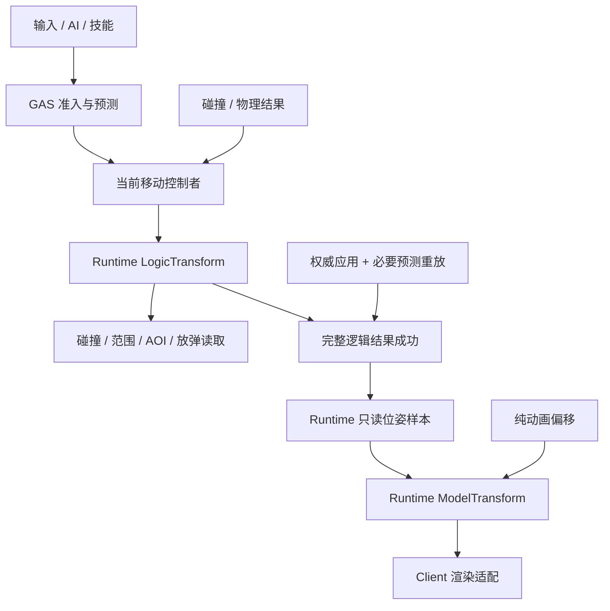

# Lumio 移动与双 Transform 设计框架

> 本文沿用 [ECS](ecs.md) 的 Active-Component Hybrid：组件可带数据与逻辑，系统处理批量推进和依赖排序，身份、生命周期、结构结算、同步均复用 ECS。
> 已确认原则和取舍来源是 [ADR-065](../../decisions/ADR-065-dual-transform-discussion.md) D01-D29。本文将其组织成可实施、可验收的**设计审阅稿**；方法签名、数值约定和验收参数是工程建议，整体尚未冻结。本文完成不代表代码交付、场景已测或获准开工。
> [ADR-064](../../decisions/ADR-064-gas-slice-contracts.md) 仍是 Draft。完整预测 World 的恢复方式由 GAS 合同确定；本文要求完整预测结果与 Model 连续性，不借双 Transform 决定整套预测引擎。

## 1. 一句话

**GAS 接受移动意图，当前移动控制者结合碰撞算出 LogicTransform；Runtime 在完整逻辑结果成功后更新客户端 ModelTransform，Client 把它交给渲染器。**

角色可以在 1 米的体素格内移动 0.1 米或更小距离。服务器碰撞看逻辑坐标，玩家眼睛看到表现坐标。普通误差逐渐消除，显式 Teleport 立即跳变。

五条边界：

1. `LogicTransform`、`ModelTransform` **都定义在 LumioGameRuntime**，是 ECS 基础组件。代码仓归属与服务器 / 客户端运行归属分开。
2. 已有角色的客户端部分承载 Model，不增加表现 World、模型替身 Entity、独立表现保管表。
3. 逻辑到表现单向；碰撞、射线、范围、AOI、放弹位置只用 Logic。渲染、镜头跟随和纯动画偏移用 Model。
4. 一个实体当前只有一个位姿控制者；每次写入前检查，允许合法连续更新。框架同步应用和初始化走受限内部入口。
5. Transform 的生命周期跟随 Entity。它维护自己的位姿、关系和平滑缓存，不决定连接、实体或资源的生死。

## 2. 概要

### 2.1 三种运行情况

| 情况 | 逻辑在哪算 | Model 在哪 | 约束 |
| --- | --- | --- | --- |
| Server | 权威实体的 Logic 与必要运动状态 | 不创建活跃 Model，不推进表现 | 服务器引用 Runtime 基础包，不依赖渲染器 |
| 联网客户端 | 收权威 Logic；本地可预测移动经 GAS 得到当前预测结果 | 接收权威同步的原角色的客户端组件 | Model 的存放位置不决定目标来源；本地目标可来自预测结果 |
| 本地运行 CS | 同一进程内按 ECS M1a 使用两端 Manager，内存环回传输 | 客户端那一端的原角色 | 与联网使用相同代码、权限和提交规则；不是额外的实体模式 |

纯客户端对象仍使用既有 Local Entity，没有服务器身份。它可以使用 Runtime 的 ModelTransform，生命周期由 ECS 管理；不因此让已有 CS 角色拆成两个实体。

### 2.2 组件与所有权

| 名称 | 代码所有者 | 实例与数据所有者 | 负责什么 | 不负责什么 |
| --- | --- | --- | --- | --- |
| `LogicTransform` | Runtime / ECS | 权威实体；GAS 预测副本含所需逻辑字段 | 逻辑局部位姿、父引用、受控写入、世界位姿派生、TP 标记 | 输入历史、速度求解、模型资源 |
| `ModelTransform` | Runtime / ECS 的客户端能力 | 原角色客户端部分；不复制成第二个活跃 Model | 显示位姿、有限样本历史、纠偏误差、参考组合 | 同步、存档、逻辑 Hash、碰撞 |
| `MovementComponent`（建议名称） | Runtime 提供通用状态和控制入口 | 同一角色的逻辑组件 | 当前控制者、运动模式、必要速度 / 着地 / 支撑状态 | 另一套位置真值、另一套预测队列 |
| 移动 Ability 与策略 | Game，接入 Runtime GAS | 已有 AbilityComponent 与对应角色 | 输入解释、准入、速度参数、走跑跳 / 载具规则、控制切换意图 | 直接越过控制者写 Transform |
| 物理组件 / 求解器 | 已有物理提供方，Runtime 对接 | 当前物理状态 | 碰撞解算；接管时提供唯一速度与位姿结果 | 通过 Model 反推碰撞、偷偷覆盖普通移动 |
| 动画组件 / 系统 | 现有表现实现与 Game 内容 | 原角色客户端部分 | 动画播放进度、骨骼、纯表现偏移 | 恢复逻辑状态、因普通纠偏重播动画 |
| 宿主与渲染适配 | Client | 会话、渲染循环、资源机制 | 驱动 Runtime 客户端表现入口，将最终位姿交给渲染器 | 重复定义两个 Transform 或另存权威位置 |

`MovementComponent` 是 D20 的运动状态落点建议，不是给每个实体强制添加的第三个基础组件。静止炸弹可只有 Logic 与客户端 Model；无移动逻辑的纯表现对象可只有 Model。通用平滑计算建议随 Runtime 的客户端能力提供，便于 C# 与 WASM 使用同一行为；渲染器类型和资源引用留在 Client。

### 2.3 ECS 接入

- 基础组件沿用 `Component`、`Get<T>()` / `Get<T>(NetEntityId)` 与生成注册表；不建 Transform 专用 Entity 容器。
- EntityType 依赖声明：需要主动移动的类型必须包含 Logic；可渲染 CS 类型在客户端构建中包含 Model；物理接管能力声明控制互斥。按 ECS M2 的依赖 / 端别生成，不手写反射注册。
- 共享逻辑、服务器权威应用、客户端表现按 ECS M4 的端别约定拆分。两个 Transform 的源码仍在 Runtime；Server 构建不因 Model 引入 GPU、浏览器或模型加载依赖。
- 生成器必须区分**只在客户端运行**与**纯表现状态**。客户端特有的必要预测逻辑状态不能因文件后缀被一并排除。
- 查询、存储、字段脏账、创建序、错误分类复用既有 ECS。内存布局与缓存策略不暴露给 Game。

## 3. 数据流



权威应用与必要重放之间的候选结果留在既有协调过程内部。只有整次协调成功，才替换公开样本。图中的样本是值，不是一个新 World，也不携带可变组件对象。

## 4. 功能模块

### M1 位置、旋转、缩放与数学

**已确认**：位置和表现计算使用 Float32；1 世界单位 = 1 米；Y 向上、XZ 水平；逻辑缩放首期为 `(1,1,1)`。物理尺寸通过碰撞形状参数表达。

**工程约定建议**：

| 项目 | 设计 |
| --- | --- |
| 位置 | `Vector3` 语义，分量顺序 X / Y / Z；连续数值，不按格吸附 |
| 朝向轴 | Right = +X，Up = +Y，Forward = +Z；渲染 / 物理后端的轴向差异在适配边界转换 |
| 旋转 | 单位四元数 `(x,y,z,w)`，Hamilton 乘法；世界旋转 `parentRotation * localRotation`，向量按 `q * v * inverse(q)` 旋转 |
| 角度便捷面 | 显式 `Degrees` 命名；Yaw 绕 +Y、Pitch 绕 +X、Roll 绕 +Z，组合 `qYaw * qPitch * qRoll`；不独立存欧拉角 |
| 正方向探针 | +Y 轴旋转 90 度将 +Z 变成 +X；不同数学后端都跑同一探针，避免仅用“左右手系”文字猜接口 |
| TRS / 矩阵 | 推荐复用 .NET `System.Numerics` 的值类型与数学能力；行向量约定下局部矩阵 `S * R * T`，世界矩阵 `Local * ParentWorld`；Native / GPU 边界显式转置 / 转换 |
| 时间与速度 | 逻辑使用 Tick 和固定 Tick 配置；配表的米 / 秒转成每 Tick 位移，求解所需步长由 Tick 频率派生，业务不读墙钟；表现使用宿主单调时间 |
| 无效输入 | NaN / Infinity、近零四元数、不可逆变换明确拒绝；组合写入全部校验成功后才修改 |
| 浮点规范化 | 正常写入口规范化旋转、将数值零统一为 +0；四元数符号按 W、X、Y、Z 首个非零分量为正固定；下行读取保留已规范编码，避免重复归一化改变 Hash |

旋转归一化建议拒绝模长平方小于 `1e-12` 的输入。各公开入口使用同一数学帮助函数；不能一条路径用欧拉累加、另一条路径用不同乘法顺序。

非均匀 Model 缩放与子旋转可能产生剪切。世界矩阵保留完整仿射结果，`LossyWorldScale` 只作近似读数；不保证任意世界矩阵能无损拆成 TRS。普通逻辑父子链因逻辑缩放为 1，不承担这类剪切。Model 的美术缩放不改变碰撞或平台的逻辑偏移。

Float32 不保证无限世界精度，也不保证不同 CPU / WASM / 物理库逐位重放一致。逻辑 Hash 对照使用同一权威编码状态；预测误差另测。本期验收数值范围明确在世界原点附近 ±1,000 米，超出范围需另测精度，不把该测试范围变成产品世界大小限制。

### M2 LogicTransform 的位置真值

| 数据 | 可写来源 | 其他表示 |
| --- | --- | --- |
| `LocalPosition` / `LocalRotation` | 当前控制者的受控入口；权威应用为框架内部入口 | 无父时等于世界位姿；有父时为父逻辑坐标系内的位姿 |
| `Parent`、随父销毁选项 | 结构单提交 | 子列表 / Root / 世界矩阵由框架派生 |
| 最近 TP 标记 | 显式 Teleport；普通移动保留 | 表现用它判断是否进入新的不连续段 |
| 世界位姿与矩阵 | 从以上有效状态派生 | 可缓存，不是第二组可独立赋值的同步真值 |

`SetWorldPose` 与 `SetLocalPose` 都可用。前者有父时先反算局部位姿，再写同一份状态；读写 API 的名字始终表达固定坐标空间。

父移动后，框架使后代的派生缓存失效，或直接按有效父链计算。后续同 Tick 读取子世界位姿必须是新值；此派生不算第二个业务写者。缓存不得把可见性推迟到渲染帧或下个 Tick。

碰撞求解器接收和输出 Logic 世界位姿，Transform 只做坐标转换和受控存储。`SetWorldPosition` 不等于碰撞移动，也不因距离很大就自动变成 Teleport。

### M3 移动控制与单写者

**入口链**：Game / GAS 提交意图 → 当前控制者解释意图与解算 → 受控更新 Logic。框架不公开可绕过此路径的位姿 `Sync.Value` 写口。

| 发起方 | 入口责任 | 写入身份 |
| --- | --- | --- |
| 玩家移动 Ability | 传方向、模拟输入强度、跳跃等意图；客户端走 GAS 预测通道 | 当前普通移动控制者 |
| AI / 路径跟随 / 脚本轨迹 | 向同一个控制入口给目标或已规划位移 | 当前策略所属控制者 |
| 击退 / 冲刺技能 | 请求当前控制者执行，或请求显式接管 | 未接管时技能本身不是另一个位姿写者 |
| 物理接管 | 物理完成求解后提交结果 | 当前物理控制者 |
| 服务器下行 / 预测基准恢复 | 框架内部批应用；不记本地上行脏账、不回声 | 既有同步 / 恢复上下文，不能由 Game 伪造 |
| 初始化 / 换父 / 父销毁 | ECS 初始化与结构结算内部入口 | ECS 框架权限；不开放任意业务绕过 |

建议控制身份复用生成的控制类型标识和现有 World 执行上下文。调用者不能只传一个可任意填写的 `Physics` 枚举就获得权限；由框架验证本实体当前控制者、端别、所属线程和执行阶段。控制者身份跨业务相保持一致，相位不是另一名控制者。

启动检查验证类型是否配置了多个竞争控制策略及明确互斥 / 默认控制者。运行时每次写入再次检查当前控制者，越权先拒绝再报错，错误信息至少包含实体、Tick、当前与实际调用控制者、操作名。错误分类接既有 ECS Rejected / Fatal 体系，不另造 Transform fail-stop。

同一控制者可在同 Tick 多次更新位置、旋转或碰撞修正。**重复写入不等于可以重复积分整段时间**：每实体每逻辑 Tick 的推进预算只有一个固定步，普通移动和物理不能各走一遍完整步长。建议控制切换在下一 Tick 首次推进前生效；当前 Tick 已写过的实体不允许通过临时换身份实现两个控制者争写。

`MovementComponent` 建议保存当前控制模式、控制类型、必要速度、着地状态、支撑引用，以及当前运动算法必需的持续状态。上次推进 Tick 等执行缓存按 GAS 重放上下文重建；速度、着地不能用“本地缓存”名义漏掉预测基准恢复。

建议的最小运动接口数据如下，不另外创建输入组件或状态管理器：

| 数据 | 来源与约束 |
| --- | --- |
| 移动意图 | 沿用 GAS 输入序号；方向与模拟强度分开解释，水平输入长度上限 1，保留 0.4 等小数强度，斜向不额外加速；客户端不能指定可信位移距离或 Tick 步长 |
| 当前运动状态 | 控制模式、必要速度、着地与支撑引用；速度为世界米 / 秒，平台相对样本中的速度另作显式转换；需要角速度时为弧度 / 秒并标明坐标系 |
| 固定步上下文 | 框架给定的 Tick、固定步长、所属 World 查询能力、控制身份；提前推进依赖平台后才能推进乘客 |
| 求解输入 / 输出 | 读当前 Logic 世界 Pose、形状和运动状态；输出碰撞处理后的世界 Pose、速度及接触结果，由同一控制者统一应用 |

连续摇杆输入更新保持中的意图，每个逻辑 Tick 使用确定顺序下生效的意图推进。若本 Tick 已提前推进完整步，后到的意图更新可供后续 Tick 使用，不能因一个 Tick 多收几条输入就多走路。起跳、冲刺等离散意图按已有 GAS 输入语义执行，不由 Render 重新触发。

物理控制时，速度以物理状态为源，Movement 通过只读视图取得，不能再维护一份独立的可写物理速度。完整角色控制器、台阶、斜坡、导航算法使用现有或经选定的求解器；本文只要求其输入输出和所有权接口。

### M4 Tick 内移动与玩法次序

| 既有阶段 | 移动接入 | 能看见什么 |
| --- | --- | --- |
| `IngressCapture` / `DecodeAndCanonicalize` | 收输入、校验身份和序号；不改 Model | 本帧规范输入 |
| `ApplyInputs` | GAS 准入；意图可交当前控制者当场处理 | 已完成的位姿写入立刻对后续业务可见 |
| `ProcessorPlan` | 推进尚未推进的移动；先平台后依赖平台的角色；碰撞 / 物理接管在业务允许的入口完成 | 后续范围 / AOI 准备等逻辑读取新 Logic |
| `CrossWorldPrepare` 至 `VoxelCommit` | 沿用现有地形 / Native 合同；不新增移动专属相位 | 地形读取仍遵守帧初规则 |
| `EcsCommandBufferCommit` | 换父、解绑、销毁归一化；维护子索引；得到最终父子位姿并准备派生同步字段组 | 新关系从结算后生效 |
| `GasAndEventFinalize` | 唯一逻辑提交点，取得完整位姿与运动结果 | 取样成功后才可进入外部表现消费 |
| `ReplicationProjection` / `SnapshotHashMetrics` / `EgressPublish` | ECS 按现有同步、存档、Hash 与发送流程消费 | Model 不进入这些逻辑载荷 |

业务系统注册、声明序和依赖表沿用 [Tick §4](tick.md)。物理接管不意味着新增第 14 相；若某物理作业必须到屏障后才得到结果，须由 Runtime 提供符合相契约的应用路径，不能在 Game 里越相写位姿。

**移动后放弹**：如果移动已在 ApplyInputs 执行，随后技能读取就是新位置。如果移动计划在 ProcessorPlan 才执行，较早的 ApplyInputs 不可能读到未来位置。Game 应把相关动作排在移动之后；必须同一输入处理链完成时，先调用当前控制者的本 Tick 推进入口，再读取放弹位置。该入口消费本 Tick 的剩余推进预算，后面的常规移动系统不再积分同一时段。不为放弹引入一个落后的 Position 副本。

逻辑依赖平台时先取得平台有效逻辑状态，再推进乘客。动态依赖通过 Runtime 的派生排序处理，独立实体仍按 ECS 创建序。挂接成环在结构结算拒绝；支撑求解产生循环依赖时本次支撑候选失败，不能让遍历顺序决定结果。

### M5 父子挂接与查询

**关系**：B 的 Parent 指向 A，B 保存局部位姿。A 的直接子列表由框架从子侧关系维护，按创建序枚举，不同步第二份子表。

- `SetParent` / `Detach` 是结构请求，业务相下单，第 9 相生效。请求返回已受理不表示 Parent 已改变；同 Tick 两次换父沿 ECS M3 后单赢规则，归一化后查环。
- `KeepWorld` 默认：结算时从最终有效旧关系计算世界位姿，再转换到新父坐标系。普通换父不产生跳变。
- `KeepLocal` 明确保留局部值；`SnapToTarget` 明确指定目标偏移。会引起瞬间世界位移的请求必须同时表达 Teleport 意图，不能悄悄绕过跳变标记。
- 先验证最终关系图、目标有效性与数学可逆性，再生效关系和位姿；失败不留下只更新父指针的半关系。
- 明确挂接时，普通移动控制是否停用、人物是否允许相对移动由 Game 的控制模式决定。服务器挂点使用配置的逻辑偏移，不读取客户端骨骼。
- 父销毁前在统一结构结算中取得存活子最终世界位姿，默认解绑保存；`OnDestroy` 只清缓存，不在析构里追加解绑单。

A 背 B 时，读 B.WorldPosition 得到 A 的当前逻辑位姿组合 B.LocalPosition；写 B.WorldPosition 会反算 B.LocalPosition。查询 A.ChildCount / 子列表可以知道背着谁。车挂两个角色和一个货箱，子数为 3、按乘员组件筛选人数为 2；容量和座位规则归 Game。

### M6 移动平台与自由移动

明确挂接和支撑关系分开：Parent 归 LogicTransform；脚下平台身份与接触状态归 Movement。**站在平台上不调用 SetParent**，不自动占车座，也不改变 ChildCount。

建议首期保持 Logic 的 Local / World 语义不变：未挂接的站立角色，其逻辑位置仍以世界空间为真值。移动控制者在一个固定步内计算平台位移 / 转动、角色输入和碰撞，写一次或数次合法结果；同步所需的平台相对位姿从这份结果派生，不成为第二份可写位置。

```text
相对位置 = inverse(平台逻辑旋转) * (角色逻辑位置 - 平台逻辑位置)
相对旋转 = inverse(平台逻辑旋转) * 角色逻辑旋转
显示位置 = 平台本渲染帧 Model 位置 + 平台 Model 旋转 * 平滑后的相对位置
显示旋转 = 平台本渲染帧 Model 旋转 * 平滑后的相对旋转
```

这里用平台的刚性位置 / 旋转组合，不把平台美术缩放乘进逻辑支撑距离。平台与人物模型内部的装饰缩放另在各自渲染局部 TRS 中处理。

每个客户端同一渲染帧中，平台只有一份 Model 位姿。远端乘客插值相对样本；本地乘客的相对目标来自当前预测结果。接受平台显示延迟也影响本地乘客显示世界位置；不宣称这些数据自然对应同一逻辑 Tick。

支撑建立和解除由求解结果决定。离地时解除支撑，继承接触点速度 `平台线速度 + 角速度 × 接触点相对平台原点的向量`，再加角色自身速度；物理已计入该速度时不能加第二遍。着陆重新评估支撑。换平台、离地和落地先保住当前世界显示，再转换平滑参考，不能直接 Lerp 两个平台的局部值。

预测支撑需要对应重放步骤的平台 Logic 和必要碰撞状态，由 GAS / Runtime 的预测依赖输入供给；不能拿当前平台 Model 或渲染历史代替。没有这些依赖时不得声称平台移动已支持逻辑预测，首期对该动作使用既有纯权威档，直到对应依赖验收通过。已确认的本地平台预测体验仍是完整闭环的验收项。

首期不允许角色同时由一个 Parent 和另一个支撑平台重复驱动。进入座位 / 背负模式时控制者结束自由支撑，站回平台时解除挂接后重新求解支撑；复杂嵌套载具交给后续控制策略。

### M7 完整样本与 Render 交接

样本分为两层，均为 Runtime 定义的普通值，**不是新网络包种类**：

| 层 | 建议内容 | 所有权 |
| --- | --- | --- |
| 批头 | 既有会话 / World 有效代次、来源类别、逻辑 Tick、权威 revision、本地发布序号 | 发布者生成并封存；元数据能放批头就不在每实体重复 |
| 实体位姿样本 | ECS 实例身份、位姿、参考种类与参考实体、可选且明确坐标系的速度、最近 TP 标记 | 与批头属于同一次完整结果，不持有 ECS 对象或 Native 裸指针 |

参考种类建议为 World / ParentRelative / SupportRelative / WorldFallback。一个样本中的位置与旋转只有一个明确参考；不存在“收到父 ID 前先猜这是世界位置”的读法。Model 根据实体身份定位自身；已有 CS 实例使用 NetEntityId，Local 实例使用所属 World 的代次与有效本地句柄。

权威 revision 与逻辑 Tick 不能代替本地发布顺序：同一 Tick 可能经过多次校正。建议 Runtime 在每次对外成功发布时递增本地序号，按该序号拒绝旧批；源 Tick 用于时间轴，网络 revision 用于权威顺序。重连沿既有会话代次失效规则，不能让旧批写入新实例。

同一 NetEntityId 在客户端离开 AOI 后重进，也要复用 ECS 的当前实例有效性检查。新 Model 以本次创建 / 全量应用的批次为最早可消费边界，不能先接收上一个可见周期残留的旧批；已有身份和批序足以表达此检查，不再生成一个 Transform 专用生命周期 ID。

**发布规则**：服务器在唯一提交点取样；客户端正常预测得到一次完整结果才发布。纠偏时，权威应用、必要恢复及全部未确认输入重放共同成功后，一次发布最终候选。内部重放步的结束不触发渲染可见提交，也不重新发送网络 / VFX。

首期建议同 owner thread 依次执行逻辑与 Runtime 客户端表现入口。渲染适配只拿最终值；即使同线程也不长期保存可变组件引用作为跨阶段结果。跨线程时在同一边界交付拥有内存所有权的不可变批，批未释放前生产方不得覆写；`ReadOnlyMemory` 包装可变池数组本身不算满足此要求。无需首期新增工作线程或通用消息总线。

`UpdatePresentation` 更新的是客户端组件的非 Sync 表现字段，可在两次固定 Tick 之间运行；它不是新增逻辑相位，不修改确认世界的权威逻辑字段，也不产生另一个世界提交点。

表现队列可以合并已经解码成功的稳定样本，保留最新状态和最新跳变语义；不能因此跳过复制协议必需的增量包、创建记录或依赖基线。

### M8 本地响应、远端插值与纠偏

**本地角色**：目标读取完整 GAS 预测结果。正常移动跟随当前预测时间线；权威重算产生新的目标时，只消除显示误差，继续响应正在发生的移动。

**远端角色**：使用与权威 Tick 对应的显示时间轴。Client 提供单调时间和网络时钟映射，Runtime 按 `映射的权威时间 - 插值延迟` 选择相邻样本；不以数据包到达间隔当作逻辑步长，也不每包重置显示时钟。时钟校准不能倒着播放旧样本。

建议的基本算法：

- 同实例、同参考、同运动连续段内，位置按样本时刻线性插值，旋转按最短弧 Slerp；先处理四元数同半球，避免等价符号导致绕远路。
- 远端超过最新样本时刻，有适用速度则有限外推；上限从**最新样本的逻辑时刻**计算。没有速度即等待，重复包不刷新外推额度。
- 支撑参考下，线速度必须是相对平台的速度：从角色世界速度扣除平台接触点速度，再旋入平台坐标系；角速度也扣除参考转动并转换坐标系。不能把世界速度直接当相对速度再次叠加平台运动。
- 本地固定步之间可用最近完整预测结果和有效速度做最多一逻辑步的表现推进；不在 Render 里消费新 GAS 输入、求碰撞或另跑逻辑预测。20Hz 时新输入至逻辑处理仍可能等待最多 50ms；更低延迟应评估提高游戏 Tick 频率。
- 纠偏使用“正常运动目标 + 逐渐衰减的误差”。新目标到来时先以当前显示建立剩余误差，再按时间衰减；不会每帧把全部正常移动重新拖慢一次。
- 建议误差衰减 `e(dt) = e(0) * 2^(-dt / halfLife)`；旋转误差使用同等时间尺度的 Slerp。60 / 120Hz 使用真实表现时间差，不能固定每渲染帧 `Lerp(..., 0.1)`。
- 平台乘客在相对坐标里插值 / 纠偏，再与本帧平台 Model 组合；不叠加一次世界坐标追赶。父 / 支撑参考变化时重新表达误差，TP 时全部清除。

Model 建议内部区分已平滑基础位姿与纯动画偏移，由一次最终组合写出显示 TRS；它们是计算状态，不是第三个 Transform 组件。动画系统不与插值系统分别覆盖最终世界位置。Root Motion 若影响逻辑位移，须作为控制者的可预测逻辑输入；客户端骨骼结果不能反写 Logic。

公开 Model 的 Local / World 仍按明确挂接的父链解释。站立角色的 SupportRelative 是内部样本与平滑参考，不悄悄变更 `Parent` 或 `LocalPosition` 的含义；组合得到世界显示后再换算到公开局部表达。父 / 子矩阵组合和平台的刚性参考组合由对应路径各做一次。

**有界测试配置建议**：远端延迟 2 Tick，表现样本环最多 8 个样本 / 实体，外推最多 2 Tick 且不超过 100ms，纠偏半衰期 50ms。缓冲只存表现所需历史，GAS 的未确认输入窗口由 GAS 自己管理。参数可配置、记录进测试报告，不冻结为所有玩法的常量。

### M9 Teleport

`TeleportWorld` / `TeleportLocal` 由当前控制者发起；Game 技能请求控制者传送，服务器管理逻辑也使用受限框架入口。调用同时更新位姿和最近跳变标记，普通移动保留该标记。

TP 位姿变更本身不偷偷决定速度：移动控制调用点必须明确 `Stop` 或 `PreserveMotion`，角色传送建议默认 Stop；清 / 留速度由运动状态所有者执行，与位姿形成同一完成结果。物理提供方处理物理体迁移；UE 的物理 Teleport 参数不能替代这里的网络跳变语义。

**标记建议**：复用已有逻辑操作身份。输入导致的 TP 使用该输入的发行者 / 连接代次、sequence 与确定性调用序号；服务器自主 TP 使用世界身份、Tick、生成系统标识与调用序号。同一次预测、重放与服务器执行对应同一操作身份；不发明全局 TP 发号服务，也不在每个普通移动 Tick 自增 TP 号。

- 新 TP：清该实体旧插值、外推、纠偏历史，显示本次最新完整结果。先 TP 到 B、再走 0.2 米才收包时，直接显示 B+0.2 米。
- 同操作重复 / 重放：不重复清历史。Model 的消费记录只保留既有 GAS 未确认窗口所需的跳变身份；已确认且不可能被合法重放引用的记录可收敛到最新权威标记。
- 预测 TP 被拒：撤销的操作不当作一个新 TP；从重算后目标走普通纠偏。服务器另行发起的 TP 才重新跳变。若同操作被服务器调整目标，按同操作纠偏处理。
- 迟到：先按会话有效性和批发布顺序拒绝旧结果，再判断跳变；不能只比较 TP 标记是否不同就拉回旧位姿。
- 明确挂接的后代在本次完整结果中继承父 TP 的不连续性。父驱动造成的继承标记由框架派生，父自己的标记随状态保留；父不可见兜底必须保留同等跳变信息。
- 支撑平台 TP 不自动继承父子语义。Game / 运动策略明确“携带乘客”或“解除支撑”；首期默认重新求解支撑，不能因父子 TP 的实现顺手把所有站立者一起传送。

稳定操作身份和重放分类由 GAS 供给；发布的是最终结果及是否有尚未消费的新跳变，不把一次性通知寄希望于每个中间帧都被渲染。消费记录受 GAS 窗口 / 调用预算约束，超限使用既有预算错误，不能静默遗忘仍可能重放的记录。

### M10 Entity 生命周期与父不可见

| 情况 | Transform 行为 | 主责 |
| --- | --- | --- |
| 新实体第一次出现 | ECS 初始化组件；首份完整有效样本直接定位，不从世界原点插过去 | ECS 创建流程 + Runtime 表现入口 |
| 普通预测重算 / 预测副本更换 | Model 留在原客户端实体；按身份接收最终新逻辑结果，缓存不持旧预测句柄 | GAS / Runtime |
| 父真正销毁，子存活 | 结构结算时解绑，保留子世界位姿与有效实例 | ECS 结构结算 |
| 子真正销毁，父存活 | 从派生子索引移除；组件缓存随 Entity 释放 | ECS |
| 父子同批销毁 | 统一清理，不发布“解绑后复活的子” | ECS |
| 断线但服务器 Entity 仍在 | Transform 不自行解绑或销毁 | DS / ECS 会话规则 |
| 客户端 AOI 离开或重连 | 遵循现有 Entity 移除 / 重建流程；旧身份 / 代次样本不再可用 | ECS / Client 会话 |
| 父模型没加载，但父位姿可用 | 正常用父 Model 位姿组合，不建占位 Entity | Runtime；资源归 Client |
| 父数据不可用，子仍获准显示 | 消费服务器派生的子世界兜底，保留逻辑关系语义；无有效兜底时保留最后有效显示并遵守外推上限 | ECS 投影 + Runtime |
| 父数据恢复 | 等兼容关系 / 位姿到齐后转换参考，保当前世界显示并平滑消除误差；遇 TP 直接跳变 | Runtime |
| 两个相同类型、位置与参数的实例 | 按 ECS 实例身份各自更新，不能按表现键合并 | ECS 身份 + Runtime |
| 资源异步结果迟到 | 由现有资源拥有者检查有效性；不增加 Transform 资源取消协议 | Client 资源机制 |

没有 adoption、ID remap、额外资源生命周期管理器。父查询暂不可解析不等于服务器已经解绑；客户端只能依据服务器允许的数据和 ECS 既有不可解析引用规则处理。

尤其是 `left_aoi` 导致客户端父副本移除时，只清理本地可达缓存，保留服务器同步的父身份及兜底语义；不能套用服务器真正销毁时的默认解绑来改写确认逻辑状态。`terminated` 的关系变更与存活子位姿按服务器完整结果应用。

## 5. 最小 API 草案

以下为公共语义面，名称便于评审，不是已生成或可直接编译的 SDK。基础数学使用普通值；身份使用 ECS 既有类型；组件查询不返回可修改的关系容器。

| 面 | 建议成员 / 操作 | 调用约束 |
| --- | --- | --- |
| 位姿读取 | `WorldPosition`、`LocalPosition`、`WorldRotation`、`LocalRotation`、`LocalScale`、`LossyWorldScale` | Logic / Model 同名但分别表示逻辑与显示；Logic Scale 恒 1 |
| 成组读取 | `WorldPose`、`LocalPose`、`LocalTRS` | Pose 为位置 + 旋转；TRS 加缩放，不带 Entity 生命周期 |
| 矩阵 | `LocalMatrix`、`LocalToWorldMatrix`、`WorldToLocalMatrix` | 派生；逆矩阵失败明确返回失败，不伪造 Identity |
| 坐标转换 | `TransformPoint` / `InverseTransformPoint`、`TransformVector` / `InverseTransformVector`、`TransformDirection` / `InverseTransformDirection` | 点含平移 / 旋转 / 缩放；向量不含平移；方向仅旋转且保持长度 |
| 便捷操作 | `Forward` / `Up` / `Right`、显式度数欧拉接口、`Translate`、`Rotate`、`RotateAround`、`LookAt` | 明确 World / Local；零 LookAt 方向 / 共线 Up 等无效输入拒绝；不代替碰撞求解 |
| Logic 写入 | `SetWorldPosition`、`SetLocalPosition`、旋转对应入口、`SetWorldPose`、`SetLocalPose`、`SetLocalTRS` | 经当前控制上下文；组合操作一次校验，非单位逻辑缩放拒绝 |
| 关系 | `Parent`、`Root`、`ChildCount`、`GetChild` / 直接子枚举、`IsChildOf`、`SetParent`、`Detach` | 查询已生效关系；修改下结构单；`GetChild` 顺序不是座位号 |
| 移动 | `SubmitIntent`、本 Tick 推进、读取运动状态、请求控制切换 | 受 GAS / Game 调度；固定步不重复积分，名字不代表引入新输入信封 |
| TP | `TeleportWorld`、`TeleportLocal` | 当前控制者；带稳定操作上下文，移动层明确 Stop / PreserveMotion |
| 框架应用 | 初始化、应用权威基准、恢复必要运动字段、提交完整位姿批 | 内部受限；Game 不可调用；不从 Sync 单字段 Changed 回调直接驱动画面 |
| Runtime 客户端入口 | `UpdatePresentation(renderContext)`，消费完整样本并推进 Model | owner thread；renderContext 带单调显示时间与帧时差；具体所在门面复用 WorldManager 客户端能力 |
| 渲染适配 | 读取本帧最终 Model 位姿批 | Client 消费值，不直接操纵预测 World 或再做一次同步纠偏 |

Model 的数学读接口完整；CS 角色的基础位姿更新由 Runtime 的表现流程拥有，动画提交独立偏移，不能因 API 完整就让任意 Game 系统覆盖最终显示位姿。纯 Local 对象可由其本地控制逻辑使用同一基础写入语义。

## 6. 同步、存档、Hash 与生成器

### 6.1 字段边界

| 数据 | 同步 | 存档 | 预测恢复 | 逻辑 Hash |
| --- | --- | --- | --- | --- |
| Logic 局部位置 / 旋转、父引用与关系选项 | 服务器权威，按既有 Scope | 需要持久化的 CS 逻辑状态按 Persist 声明 | 必需 | 纳入适用的逻辑字段集 |
| 最近逻辑 TP 标记 | 随状态保留 | 随可恢复的位姿基准保存 | 必需，重放同操作不造新身份 | 权威同步字段按既有对账集处理 |
| 必需运动状态 | Owner 至少取得可预测所需状态；远端按显示需求取速度等 | 算法恢复必需状态显式 Persist | 与位姿同一基准；不能只恢复位置 | 按 Sync / 对账字段声明，不把私有求解缓存混入 |
| 父子列表、矩阵缓存、推进缓存 | 不同步派生索引 | 不存 | 从有效逻辑状态重建 | 不进 |
| 平台相对显示数据、世界兜底 | 框架生成的只读派生同步字段 / 投影 | 不存派生值 | 不替代逻辑恢复状态 | 若作为可见 Sync 字段，按该观察者实际字段集对账；排除客户端临时样本 |
| Model、插值缓冲、误差、动画进度 | 不同步 | 不存 | 不复制成活跃表现 | 不进 |

字段编码继续由 ECS 声明和生成器产生，不另写 Transform 自有网络协议。向量 / 四元数可展开为受控字段组或既有支持的复合值；必须保证父引用、坐标表示、位姿与 TP 在同一完整应用中解释。框架 setter 对外受控，底层 Sync 写面不可绕过检查。

### 6.2 相对数据与兜底的最小实现

**首期工程建议**：明确挂接沿用局部坐标 + 父引用。自由支撑角色保留 Logic 世界真值；框架在第 9 相的结构结算后计算平台 ID + 相对 Pose，写入声明为同步、仅框架可更新的派生字段组。第 10 相只取完整结果，第 11 相只做投影，不能在这些阶段补写 Logic 字段。这样先接通用户要求的相对插值，不把运动支撑改造成第二棵父子树。

此建议的明确成本：自由支撑场景可能同时发送逻辑世界位姿和相对显示组；相比把相对坐标作为唯一 wire 表示，多占位姿载荷。建议首期接受这项有界冗余以保持逻辑字段与恢复路径直接，后续量化 / 稀疏发送 / 压缩先测数据再做。它不是两个可写位置真值；正常明确挂接的静止乘员仍应达到父动时子局部位置零增量。

父不可见兜底使用**单独、标识明确的派生世界字段组**，不能把同一个 LocalPosition 字段对 A 发局部值、对 B 发世界值。每个字段的值对所有获准接收者一致；观察者差异仅决定字段是否发出。接入 ECS 现有 Scope / 投影语义，不能借此绕过父实体可见性规则。

明确挂接的常态不发额外世界兜底；需要兜底时父移动要使派生世界组更新，阶段顺序仍是第 9 相准备、提交后投影。若本 Tick 的接收范围到第 11 相才算出，第 9 相须先准备可供投影的派生值，不能因事先没有兜底消费者就漏算本 Tick 必需数据。恢复父引用和退出兜底字段的可见性变更必须同批解释。派生字段生成与条件投影是需要补齐的接口能力，不能把现有字节 sink 当作已经支持它。

### 6.3 生成职责

- 为 Runtime 基础组件和 Game 组件共同生成注册、端别模板、依赖表；校验 Movement 缺 Logic、控制策略不互斥、声明关系环。
- 为位姿字段组生成 Sync / Persist 编码、引用解析、读写守卫接线；覆盖普通属性、组合写入、便捷变换、TP 和结构内部应用，不留公共裸 setter。
- 为服务器权威状态、必要预测状态、纯表现状态生成明确包含 / 排除集合；不凭 `.Client.cs` 后缀一刀切。
- 生成器负责元数据与胶水；插值、碰撞、重放执行、父子图算法由 Runtime 实现，不生成一套玩法移动引擎。
- 公共值类型 / wire 字节序按 SDK 既有约定，优先复用现有 Float 编码；无已支持的复合值时先扩展唯一类型合同，再生成。本文不擅自分配字段 ID 或修改已有 wire 文件。

Hash 对比必须同 Tick、同可见实体集、同字段集，确认结果对该观察者服务器投影。对同一份规范权威字节要求 Hash 一致；对独立物理预测用误差指标，不能拿 Float 的选择承诺跨后端所有求值逐位一致。

## 7. 失败处理

| 触发 | 处理 | 对表现的影响 |
| --- | --- | --- |
| 缺 Logic / 竞争控制声明无互斥 | 生成期或启动期报错，明确类型与控制者 | 不启动不完整类型 |
| 越权写 / 错线程 / 错阶段 | 修改前拒绝；错误类别复用已有框架规则 | 不出现被拒的新位姿 |
| 无效数值 / 不可逆 / 非单位 Logic Scale | 本次组合调用无部分修改 | 保持此前有效结果 |
| 换父成环 / 已失效父引用 | 按 ECS 结构校验拒绝该非法结果 | 不展示半挂接状态 |
| 权威成功但重放失败或结果不确定 | 协调方沿现有失败 / 重同步流程处理；不发布候选样本 | 保留上次完整显示，遵守已有外推上限 |
| 暂时断样 | 有适用速度才有界外推，额度不被迟到包重启 | 上限后等待；恢复正常纠偏 |
| 样本引用或参考无法解释 | 不把局部值猜成世界值；等待兼容数据 / 世界兜底 | 保留最后有效结果；初次未有位姿则不显示错误位置 |
| 表现缓冲积压 | 处理协议必须的数据后合并稳定表现结果，保留跳变 | 队列有界，旧结果不倒放 |
| 实体 / 会话已失效 | 既有身份检查拒绝投递 | 不误写另一个同外观实例 |

## 8. 场景推演与验收

### 8.1 六条主路径

1. **20Hz / 60 或 120Hz**：5 米 / 秒、输入强度 0.4，每 Tick 前进 0.1 米；渲染在固定步之间平滑。固定输入序列下，改变渲染频率不改变 Logic 终点。
2. **移动后放弹**：本 Tick 控制者完成 0.1 米移动，后续读取放弹位置等于新 Logic；Model 尚未追到也不影响业务。再调用正常推进入口不能多走一个 Tick。
3. **权威纠偏**：服务器确认到输入 N，客户端有 N+1 之后的输入。先从同一逻辑基准恢复位姿、速度、模式与支撑，再重放；公开样本只出现最终结果，Model 保留播放中的动画并衰减位置误差。
4. **Teleport**：A → B → 普通移动 0.2 米合并到一个包。首个有效消费帧直接到最新完整结果，重复同操作不清两次历史；父 TP 的明确挂接子同时接上新位置。
5. **平台与挂接**：电梯升降、船转动、乘客相对走动；先平台后人，共用平台 Model。起跳继承接触点速度。A 背 B 后 A 真正销毁，B 在结算后的世界位置不跳回原点。
6. **预测副本更换**：保持原客户端 Entity 和 Model，替换仅逻辑预测副本；相同类型、位置、参数的两个已有实体仍各有身份，销毁一个不影响另一个。

### 8.2 建议验收参数

以下是**待审的可重复测试配置**，不是已测结论或所有产品的手感承诺。距离误差以世界原点附近 ±1,000 米内的米制坐标测量，角度以最短旋转角测量。

| 验收 | 输入 / 注入 | 应观察的结果 |
| --- | --- | --- |
| 数学与坐标 | +Y 90 度、父转动、点 / 向量 / 方向变换与逆变换 | 轴向探针正确；往返位置误差 ≤ 0.001 米、旋转误差 ≤ 0.01 度；奇异逆变换明确失败 |
| 小数移动与帧率 | 20Hz，60 / 120Hz 各跑 10 秒，固定输入强度 0.4、速度 5 米 / 秒 | Logic 终点距理论 20 米 ≤ 0.001 米；同宿主同输入的逻辑记录一致；表现缓冲始终 ≤ 8 样本 / 实体 |
| 同 Tick 可见与时间预算 | 同一控制者位姿连续更新，随后读范围 / 放弹，重复推进 | 后续读新值；整 Tick 时间积分不超过一次；越权者写入前被拒 |
| 普通纠偏 | 静止基准注入 0.5 米误差，半衰期 50ms | 300ms 后残余 ≤ 0.01 米；60 / 120Hz 在共同时间点误差差值 ≤ 0.002 米；普通运动无动画重启 |
| 联网移动纠偏 | 单向延迟 75ms、抖动 ±20ms；权威与预测位置 / 速度有差 | 不展示只应用权威尚未重放的结果；持续输入仍推进；记录按同 Tick 算的预测误差 |
| 断样与重复 | 远端 5 米 / 秒，断样 300ms，重复旧包与迟到包 | 相对最新有效时刻最多外推 100ms / 0.5 米，其后等待；无速度不外推 |
| TP 合并 / 去重 | 同 TP 重复 3 次；重放 10 次；TP 后移动合包；预测 TP 拒绝 | 新跳变只消费一次；最新结果直接定位；拒绝 / 重放不伪造新 TP；旧包不回拉 |
| 结构与查询 | 两次换父、成环、KeepWorld、父 / 子 / 同批销毁，车载人和货 | 复用 ECS 撞单规则；保世界误差 ≤ 0.001 米；人数与名单同源；不按表现键合并 |
| 挂接带宽 | 父连续移动 60 秒，子相对位置 / 旋转不变，无 TP 或可见性切换 | 创建后的子局部位置 / 旋转增量字节为 0；统计与父包、子其他字段分开 |
| 平台 | 升降、绕 Y 旋转、相对移动、起跳；混合本地与远端乘客 | 同帧共用平台位姿；在无输入固定偏移段相对漂移 ≤ 0.005 米；起跳速度不重复加平台量 |
| 兜底 | 父模型晚到；父位姿不可用、子仍可见；随后父数据恢复 | 模型晚到不误解绑；兜底随父逻辑运动更新；恢复平滑，TP 优先；不突破 AOI 权限 |
| 失败发布 | 权威阶段通过，重放失败；池数组在消费结束前尝试复用 | 公共发布序号不推进到失败候选；先前消费值保持稳定；无 ECS 引用泄漏 |
| 预测与身份 | 两个相同外观已有实体，普通预测对象替换、句柄复用、单个销毁 | 原 Model 连续；旧句柄解析失败；无交叉更新、误合并或资源重建要求 |
| 浏览器恢复 | 页签暂停 2 秒后恢复；注入旧代次结果 | 不重播积压的表现帧，不无限外推；沿会话 / Runtime 流程取最新有效结果；旧代次拒绝 |

C# Host 首先验证真实 Runtime 组件、Tick、受控入口、GAS 协调和样本消费。数学单元用例、假网络或受控碰撞输入可用于局部验证，但不能替代完整纠偏或真实物理接入证明。核心闭环完成后，浏览器必须实际运行 Runtime 的 WASM 路径、消费同一套样本、用 Model 驱动可见角色；纯 JS 插值演示不算通过。

## 9. 跨仓边界与实施顺序

这是依赖与交付顺序设计，不是已启动的任务清单。

| 顺序 | 所有者 | 交付边界 | 验收依赖 |
| --- | --- | --- | --- |
| 1 | GameEngine / 公共合同 | Transform 值与端别、控制入口、参考表示、TP、稳定样本、字段生成规则 | R-00460 先交 Transform 合同组，不等九项能力全部完成 |
| 2 | Runtime | 两个基础组件、数学 API、单写者、结构关系、查询、声明与编码支持 | ECS 基础能力与现有业务相接线；数学 / 结构 / 拒写局部验收 |
| 3 | Runtime + Game | 通用 Movement 状态与控制入口、Game 移动 Ability / 碰撞适配、Cell 迁移 | 唯一位姿源、同 Tick 业务读取；不附带选定整个新物理引擎 |
| 4 | Runtime 的客户端能力 | Model 样本消费、插值 / 有界外推 / 纠偏、参考组合、TP 消费 | 使用完整样本可独立验证；完整本地纠偏依赖 R-00466 / R-00467 的真实协调结果 |
| 5 | Client + Runtime | C# Host 驱动与渲染接入，联合纠偏成功后发布 | 两组件和算法归 Runtime；Client 不复制类型或算法形成另一实现 |
| 6 | Client | 实际浏览器 / WASM 加载、时钟、渲染消费与暂停恢复 | 同一 Runtime 语义、相同场景证据 |

Server 继续承担权威宿主与输入传输；NativeCore / 物理提供方只补实际需要的数值、查询或求解边界。纯托管数学 API 不因“跨仓”自动增加 Native ABI；只有穿过 Native / WASM 边界的内容才进入相应唯一 ABI / wire 定义。

### 9.1 Game 位置迁移

当前 `BomberPlayerState` 同时声明可写且 Persist 的 CellXYZ 和 PosMilliXYZ，并使用 XY 平面、Z=0。迁移建议：

1. 新游戏状态由 LogicTransform 唯一保存位置；删除 Game 的可写位置镜像前先修改全部移动、放弹、碰撞、AOI 和显示读取方。
2. 旧 milli-cell 值除以 1000 转成米。旧水平 `(X,Y)` 映射新 `(X,Z)`，旧 Z 若确为高度再映射 Y；地形层索引与场景原点由 Game 配套转换，不能对所有旧数据盲目交换轴。
3. Cell 按玩法格子原点和边界规则从逻辑位置推导，使用数学 floor 处理负坐标；占格 / 放弹中心规则归 Game，不在 Transform 中吸附。
4. 旧档兼容在存档版本边界一次转换；新档只保留新的逻辑真值。旧格式若暂不支持，必须明确拒绝，不按新字段静默解读。
5. 同一条输入与逻辑结果在 C# 和 WASM 消费中对齐，渲染端不再读旧 PosMilli，也不改写 Logic。

### 9.2 两张需求的修订清单（本地建议，未修改 Workflow）

| 单据 | 建议正文调整 | 建议验收调整 |
| --- | --- | --- |
| R-00461 | 改为 Runtime 双 Transform 基础组件：纳入 Model 的类型 / 状态 / 数学与客户端运行边界；Logic 加控制入口、TP、父子结构、查询和同步恢复面 | 覆盖两个组件均来自 Runtime、服务器不推进 Model、完整基础 API、启动冲突检查 + 每次写前拒绝、父子 / TP、生成端别与字段边界 |
| R-00470 | 改为 Client 双 Transform 宿主与渲染接入：消费 Runtime 提供的 Model 与平滑能力；删除“Model 必须另挂 Local Entity”的限制 | 验证同一角色组件归属、完整协调后消费、20Hz 与 60 / 120Hz、平台相对组合、TP、原实例连续、C# 后实际浏览器 / WASM |

Model 平滑、缓冲和 TP 消费的 Runtime 实现验收纳入 Runtime 交付范围，Client 负责端到端集成证据，避免两仓各自实现一套。R-00470 的通用 VFX、重放副作用和模型资源系统扩展独立分期，不以它们阻塞双 Transform 最小闭环。

相关依赖说明同步到修订稿：R-00460 只先闭合 Transform 所需合同；R-00463 复用受控写入底座；R-00462 复用业务相接线；R-00466 / R-00467 提供完整重放与协调结果。普通组件生命周期仍由 ECS 负责。以上不表示线上单据状态、指派或依赖已经修改。

## 10. 现有能力与设计边界

2026-09-05 的只读代码核对，源路径相对 `/Users/cui/LumioGames/`：

| 代码证据 | 能证明什么 | 不能证明什么 |
| --- | --- | --- |
| `LumioGameRuntime/modules/ecs/src/Lumio.GameRuntime.Ecs/Component.cs` | 现有 Component、Get 查询、生命周期和生成接口可接入 | Persist 写接口当前展示 String / UInt64 / Boolean，不是已经具备 Vector3 / Quaternion 编码 |
| 同目录 `World/WorldManager.cs` | 现有 Manager、创建 / 快照恢复、普通同步更新已有实体组件 | 公开面仍只有一个 World，不证明完整确认 / 预测协调已交付 |
| 同目录 `World/EcsWorld.cs` 的 `WriteExistingField` | 底层字段写入有线程 / 上下文检查路径 | 不证明所有 Transform 便捷 setter 都有控制者守卫 |
| `LumioClient/modules/session/src/Internal/Orchestration/AuthorityUpdateOrchestrator.cs` | 有权威与预测 staging，调用 Runtime 事务后再调表现 sink | 当前没有把生成的完整 reconcile 计划接入该 Runtime 事务，不能直接拿这一出口通过联合成功验收 |
| `LumioClient/modules/session/src/Public/IClientPresentationSink.cs` | 有字节型表现接收接口 | 不是本文类型化 Transform 样本或所有权合同 |
| `LumioGame/modules/server-gameplay/src/Lumio.Game.ServerGameplay/Bomber/Contracts/Components/BomberPlayerState.cs` | 旧位置有 Cell / milli-cell 双可写字段及 XY 平面约定 | 不能证明新 Float / 米制 / XZ 消费已迁移 |

定向检索未找到完整 LogicTransform / ModelTransform 类型实现；上述模块的数值类型检索也未证明已有统一 Quaternion / Matrix 后端。本文的 System.Numerics 选择、方法命名、派生同步组和参数均须在合同审阅与实现验证中落定。

完整预测恢复实现、物理提供方的求解路径、浏览器 Runtime 加载是已有模块需要交付的依赖。本文给出其输入输出与验收条件，不宣称它们已经具备，也不以设计文档替代验证。

## 11. 首期边界与相关设计

首期覆盖基础 TRS、唯一写者、明确挂接、平台相对表达、普通平滑 / 纠偏、TP 和两种 Host 消费。大型世界原点漂移、逻辑动态缩放、任意仿射矩阵写回、逐分量父继承开关、物理焊接、复杂角色控制器、通用 VFX 与资源回收框架后置；保留各自所有者，不要求先搭空管理器。

正式整体审阅集中看三个工程建议组：数学与公开 API、完整样本 / 参考表示及 TP 操作身份、同步冗余与验收参数。已确认原则不因这些建议尚待审阅而重新打开，尤其是两个 Transform 均在 Runtime。

- 项目基础：[ECS](ecs.md) M2-M4 / M7-M10、[Tick](tick.md)、[GAS](gas.md)、[体素](voxel.md)、[仓库边界](../standards/repository-architecture.md)。
- 持续决策：[ADR-065](../../decisions/ADR-065-dual-transform-discussion.md)；预测关联草案：[ADR-064](../../decisions/ADR-064-gas-slice-contracts.md)。
- 成熟引擎参考：[Unity Transform](https://docs.unity3d.com/6000.0/Documentation/ScriptReference/Transform.html)、[UE TTransform](https://dev.epicgames.com/documentation/en-us/unreal-engine/API/Runtime/Core/TTransform)、[UE USceneComponent](https://dev.epicgames.com/documentation/en-us/unreal-engine/API/Runtime/Engine/USceneComponent)、[Godot Node3D](https://github.com/godotengine/godot/blob/4.5/doc/classes/Node3D.xml)。参考数学和接口语义，不移植它们的对象 / 生命周期模型。
