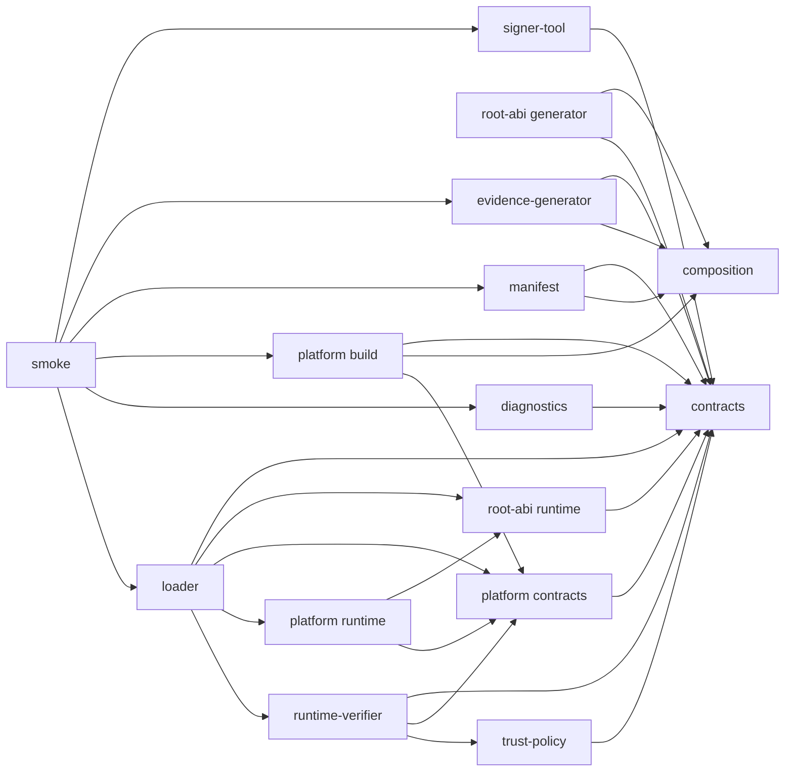
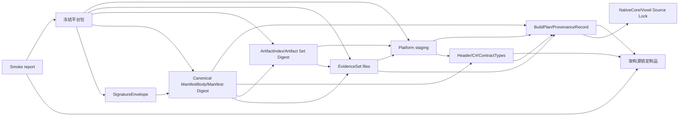
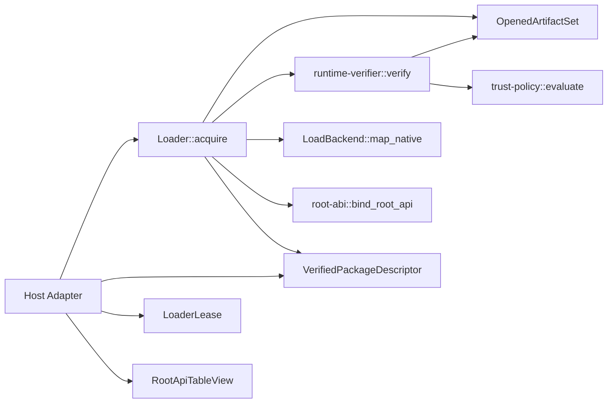
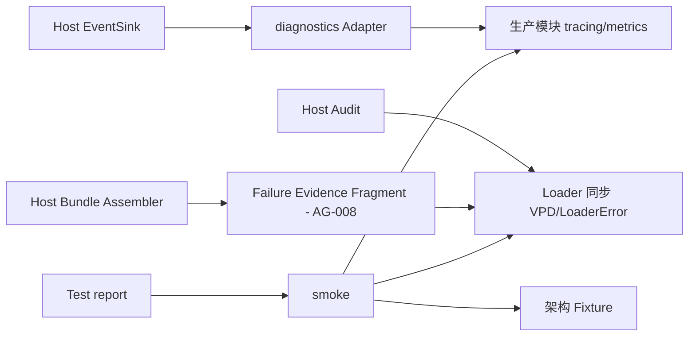

# LumioCoreEngine 框架设架说明书

> 文档版本：1.0  
> 设计日期：2026-08-27  
> 目标仓库：`LumioGames/LumioCoreEngine`  
> 仓库审查快照：`a4c61b853af6d9e285abe8a8f64baa4faa52baf2`  
> 公共契约基线：`LGE-V1.2-2026-08-27`  
> 架构源对照提交：`LumioGameEngineArchitecture@2d7980d95b163404e33cc6212db13ac948d30d40`  
> 文档性质：实现级设架与可验收任务；不是生产代码，不是新的公共架构源。

---

## 0. 使用规则与绝对边界

本说明书把当前已挂红的八个模块下沉为可建目录、crate、接口、命令、状态、Fixture 和任务卡。冲突解释顺序固定为：

1. `LumioGameEngineArchitecture@2d7980d95b163404e33cc6212db13ac948d30d40` 的 ADR、Schema、ID Registry、Fixture 和发布生成制品；
2. 本仓已生效 ADR 0001、0002、0003；
3. 本仓根 README 与八个模块 README；
4. 本说明书中的仓内实现建议。

标记含义：

- **Current Fact**：已经冻结，不得改义。
- **Design Requirement**：边界已确定但尚未实现，可直接按本文设架。
- **Blocked on Architecture Gate**：缺公共 ADR/Schema/Fixture/生成制品，本仓不得代定。
- **Local Implementation Decision**：只影响本仓内部实现，不改变跨仓公共语义。

绝对边界：

- 本仓只做 Native 聚合、适配、发布、校验；不拥有 Runtime、VoxelWorld、Chunk、ECS、GAS、Gameplay、Session、Connection、WorldSlot、Release Pool、CoreCLR Host 或 Hot Gameplay。
- 只设计既有八个单元：`composition`、`root-abi`、`loader`、`manifest`、`signing`、`platform`、`smoke`、`diagnostics`。
- `signing` 内保持四个独立安全域：`evidence-generator`、`signer-tool`、`runtime-verifier`、`trust-policy`。
- `signing` 在运行时发布闭包中的内容只允许 `runtime-verifier` 与只读 trust metadata；Signer、私钥 Provider、测试密钥和 evidence generator 绝不进入运行时。
- `PureHeadless` / `NoNative` 不走本仓 Loader。
- V1 Loader 采用 **No-Physical-Unload**；只做逻辑释放。
- 生产模块不得依赖 `smoke` 或 `diagnostics` 实现。
- `loader` 不得编译依赖 Manifest 生成器、`signer-tool` 或 `evidence-generator`。
- Header、C# Binding、ContractTypes、ManifestBody 和平台目录只从锁定输入生成，禁止手改。
- `.spec/rules/`、调度关系、公共文档体系与公共协议字段不在本次改动范围。

### 0.1 术语索引

本文只使用以下供应链与 Loader 术语：

| 术语 | 精确定义 |
| --- | --- |
| Artifact Hash | ArtifactIndex 单个 entry 所指实际文件的 SHA-256。 |
| ArtifactIndex | 平台包逐文件索引，字段来自架构源。 |
| Artifact Set Digest | 平台 Artifact 集合身份摘要；规范投影必须由架构源冻结。 |
| Manifest Digest | Canonical `CoreEngineManifestBody` 精确字节的 SHA-256。 |
| EvidenceSet | ManifestBody 中对 SBOM、License、Provenance 的 Digest 引用集合。 |
| SignatureEnvelope | 与 ManifestBody 分离的签名信封。 |
| PackageIdentity | `Manifest Digest + Artifact Set Digest + ABI Identity + targetProfileDigest + capabilitySetDigest`。 |
| VerifiedPackageDescriptor | runtime-verifier 对实际打开 Artifact 完成验证后产生的同步信任描述。 |
| LoaderLease | Loader 对已锁定 PackageIdentity 的逻辑租约；不是裸动态库句柄。 |

---

## 1. 仓库事实对照表

### 1.1 已冻结：Current Fact

| ID | 已冻结事实 | 对实现的约束 |
| --- | --- | --- |
| CF-01 | 本仓是 Native 发布层，不是新的运行时或领域引擎。 | 所有 crate 的非职责必须排除领域状态和 Host 生命周期。 |
| CF-02 | 当前仓库只有文档、`.spec/` 和架构镜像，没有 workspace、crate、构建脚本或 Loader 实现。 | 本文列出的源码和构建文件全部是“将创建”，不得假装已有实现。 |
| CF-03 | 公共契约唯一来源是 LumioGameEngineArchitecture；本仓镜像只读。 | 不得手写第二套 Schema、P/Invoke 布局、ErrorCode、Capability 或 Fixture。 |
| CF-04 | ADR 0001：`composition` 只产不可变 BuildPlan；`platform` 是唯一构建执行入口。 | composition 不调用编译器；platform 不回写计划。 |
| CF-05 | ADR 0002：signing 四域分拆；Loader 只消费 runtime-verifier 的 VPD。 | 运行时依赖图必须机器证明不含 signer/私钥/evidence 代码。 |
| CF-06 | ADR 0003：diagnostics 不拥有队列/批处理/落盘/Bundle；smoke 不生产最终 Failure Bundle。 | 两者均不得成为生产生命周期 owner。 |
| CF-07 | Root ABI 由架构源 ABI Schema 生成，V1 只有一个版本化 Root API Table 入口。 | slot、布局、调用约定和 Handle/Buffer/Error 语义不可本仓补写。 |
| CF-08 | ManifestBody 与 SignatureEnvelope 分离；签名覆盖 Canonical ManifestBody 精确字节。 | 时间戳、证书链、签名不进入 ManifestBody。 |
| CF-09 | PackageIdentity 为五元组；首次成功 Acquire 锁定进程唯一身份。 | 不同身份稳定返回 `PackageIdentityConflict`，不做“看起来兼容”。 |
| CF-09A | 根 README 的一处说明性括号省略了 `capabilitySetDigest`，但 ADR-019、VPD Schema 与本任务术语表都冻结为五元组。 | 实现一律使用五元组；该文档差异不授权本仓发明四元组，也不阻塞代码设架。 |
| CF-10 | Loader 主状态：`Uninitialized -> Preflighting -> Verified -> Binding -> ApiReady -> Leased -> Released`，失败进入回滚状态。 | 每个转换必须有资源不变量和负向测试。 |
| CF-11 | P0 唯一 TargetProfile：Linux Server、x86_64、glibc、DynamicLibrary。 | P0 必须是一条垂直切片，不是八模块平均铺壳。 |
| CF-12 | 验证与映射必须基于同一实际打开对象，避免 TOCTOU。 | P0 Linux Backend 需保留句柄或创建不可变快照后再摘要和映射。 |
| CF-13 | ErrorCode、Capability、LoggingEvent、FailureBundle 都由架构源拥有。 | 仓内工具错误不得占用公共 ErrorCode；diagnostics 只做 Adapter。 |
| CF-14 | 生成物必须记录 Compiler/Input/Output Hash，并只读发布。 | CI 必须重生成并要求零差异。 |

### 1.2 设计要求但尚未实现：Design Requirement

| ID | 设计要求 | 主要验收证据 |
| --- | --- | --- |
| DR-01 | 建立单 Rust workspace，把运行时 crate、构建工具 crate、验证 crate 分区。 | `cargo metadata`、`cargo tree` 与 allowlist 报告。 |
| DR-02 | BuildPlan 可重复、不可变、可验证。 | 同输入两次精确字节一致；平台拒绝篡改计划。 |
| DR-03 | ABI Header/C# Binding/ContractTypes 从锁定源生成。 | 生成记录 + 三语言布局 Golden + 手改门禁。 |
| DR-04 | platform 唯一执行构建、链接、布局与 ArtifactIndex。 | 不存在第二条构建入口；失败不发布半成品。 |
| DR-05 | ManifestBody 的生成、Canonical bytes、Manifest Digest 与 Schema 校验可重复。 | 重建 Digest 一致；篡改被稳定拒绝。 |
| DR-06 | Test Signer、runtime-verifier、Test trust metadata 物理隔离。 | runtime 闭包和发布目录不含私钥或 signer。 |
| DR-07 | Loader 单飞 Acquire、身份锁定、同对象验证/映射、回滚和 No-Physical-Unload 可测试。 | 并发、冲突、超时、取消、篡改和回滚 Fixture。 |
| DR-08 | 事件使用成熟 facade；diagnostics 只做非阻塞 Adapter。 | Sink 失败不改变同步 Loader 结果。 |
| DR-09 | smoke 串起完整 P0 E2E。 | Source Lock 到 LoaderLease 的审计链和测试报告。 |
| DR-10 | SBOM、License、Provenance 由成熟工具产生并绑定到 EvidenceSet。 | 任一证据替换均被 verifier 拒绝。 |

### 1.3 Blocked on Architecture Gate

| Gate | 公共缺口 | 受阻范围 | 本仓禁止动作 | 关闭条件 |
| --- | --- | --- | --- | --- |
| AG-001 | ABI Schema 已发布，但 V1.2 未给出可消费的 Header/C# Binding/ContractTypes 生成器坐标和完整布局 Golden。 | P0 root-abi、真实跨语言 Smoke。 | 不得手写 slot、类型映射或私有模板。 | 架构源发布 compiler 名称/版本/摘要、生成制品和 C/Rust/C# Golden。 |
| AG-002 | ArtifactIndex 必填 `artifactSetDigest`，ADR 又把 Artifact Set Digest 定义为规范化 ArtifactIndex 的摘要，未冻结自引用投影。 | P0 ArtifactIndex、ManifestBody、PackageIdentity、Verifier。 | 不得本仓选择“排除该字段”“置空”“两阶段”等算法。 | ADR/Schema 修订 + canonical bytes + Artifact Set Digest Golden。 |
| AG-003 | ADR-020/正文与 `target-profile.schema.json` 在 `StaticLink`/`StaticLinked`、`NoNative` 和 PackagingProfile 结构上不一致。 | P1 Static/移动端/完整矩阵。 | 不得定义兼容别名或双枚举。 | 架构源统一 ADR、正文、Schema、Fixture。 |
| AG-004 | SignatureEnvelope 缺密码学 Profile：签名输入、签名编码、公钥容器、域分隔、证书链编码和拒绝优先级未冻结；现有 Fixture 不是可验向量。 | P0 Test Signer/runtime-verifier，P1 生产签名。 | 不得自行选择 raw/DER、prehash 或 key 文件格式。 | 密码学 ADR、有效/无效/撤销 Golden vectors。 |
| AG-005 | CanonicalSerializer 的可消费发布物和各 Digest Golden 不完整。 | Manifest Digest、`targetProfileDigest`、`capabilitySetDigest`、`artifactIndexDigest`。 | 不得把某个通用 JSON 库默认输出提升为公共语义。 | 发布 CanonicalSerializer 制品、版本、Input/Output Hash 和 Golden。 |
| AG-006 | `capabilitySetDigest` 的排序、编码与域分隔未冻结。 | P0 PackageIdentity 与冲突测试。 | 不得自行拼接 Capability ID。 | Digest 投影 ADR + 正负 Fixture。 |
| AG-007 | 运行时只读 trust metadata 没有公共 Schema/Fixture。 | P0 Test trust domain，P1 Rotation/Revocation。 | 不得本仓发布跨仓 TrustStore 格式。 | trust metadata Schema、key encoding、时间/撤销规则和 Fixture。 |
| AG-008 | README 使用 `VerificationResult` 和 Failure Evidence Fragment，但架构源没有同名独立公共 Schema。 | Loader 对外同步结果、diagnostics/Host 适配。 | 不得创建第二个序列化契约。P0 只使用 VPD + 本地错误。 | 架构源明确 VPD/Fragment 的公共形态。 |
| AG-009 | `FailedRolledBack` 后重试、`Released` 后再次 Acquire 的可观察转换未完全冻结。 | Loader 恢复性/并发属性测试。 | 不得把仓内策略宣称为公共状态语义。 | ADR-019 补充转换表和 Fixture。 |
| AG-010 | Windows/iOS 等平台“同一对象验证与加载”的平台规则未冻结。 | P1 完整矩阵。 | 不得照搬 Linux fd 策略。 | 每平台 LoadBackend 安全不变量和 TOCTOU Fixture。 |
| AG-011 | Evidence descriptor 的 `format` 目前只受通用字符串约束，Fixture 虽使用 `CycloneDX`、`SPDX`、`SLSA-v1`，但未冻结具体规范版本、媒体类型、规范化方式、subject 覆盖和 verifier 必须执行的语义检查。 | P0 EvidenceSet、runtime-verifier 的 evidence 检查；P1 完整 SBOM/License/Provenance。 | 不得把某个工具默认输出版本或本仓自选 profile 提升为公共互操作语义。 | 架构源发布 Evidence Profile ADR/Schema：接受的规范版本与媒体类型、路径/摘要覆盖、subject 规则、有效/无效 Fixture 和跨工具 Golden。 |

**P0 完成前置**：AG-001、AG-002、AG-004、AG-005、AG-006、AG-007、AG-009、AG-011 必须关闭。可先实现 Adapter、目录、状态机与“缺契约即失败”门禁，但不得把临时格式包装成完成态。

### 1.4 本仓可定的实现决策

| 决策 | 建议 | 是否新增 ADR |
| --- | --- | --- |
| Workspace 与运行时闭包 | 单 workspace、多 crate、显式 member、runtime allowlist。 | ADR-0004，建议立即写。 |
| P0 Linux 同对象加载 | 安全打开 → 不可变 sealed snapshot → 对 snapshot 摘要与 `dlopen` → 永久 resident。 | ADR-0005，建议立即写。 |
| BuildPlan 内部格式/冻结协议 | 仓内版本化 JSON、确定性编码、sidecar digest、原子 publish。 | ADR-0006，建议立即写。 |
| 命令 facade | `just` 只转发到 crate CLI，不承载契约语义。 | 不需 ADR。 |
| 事件 facade | `tracing` + `metrics`；diagnostics 提供 Layer/Recorder。 | Host API 稳定后再写。 |
| 生产 KMS/远程签名 | 架构 Gate 关闭后以 Provider Adapter 接入。 | P1 前必须单独 ADR，含候选/许可证/维护/退出。 |

---

## 2. 已读清单与一句话结论

已对 `LumioCoreEngine@a4c61b853af6d9e285abe8a8f64baa4faa52baf2` 提交树做全量文件路径清点；下表逐项列出本任务要求的规范性输入和对设计产生约束的非规范历史材料。其他编辑器/代理辅助文件只用于确认仓库边界，不被提升为架构依据。

| 顺序 | 已读材料 | 一句话结论 |
| --- | --- | --- |
| 1 | `.spec/AGENTS.md` | 本仓只能消费架构源，公共契约变化必须回 Architecture Gate。 |
| 2 | `.spec/knowledge/standards/repository-architecture.md` | Schema/Fixture/生成物必须锁源、只读、可追溯，包身份来源唯一。 |
| 3 | 根 `README.md` | 六个生产模块、两个横切平面、P0/P1、PackageIdentity、同对象验证和 No-Physical-Unload 已挂红。 |
| 4 | `modules/README.md` 与八个模块 README | 八模块所有权和非职责已冻结，本文只能操作化，不得扩边界。 |
| 5 | ADR 0001/0002/0003 | BuildPlan/执行权、signing 四域、diagnostics/smoke 去所有权均已生效，不重开辩论。 |
| 6 | 架构镜像 §1.1、§2、§8、§10、§11.2、§12、§14.1、§16、§16.1、§17 | 唯一架构源、Root ABI、TargetProfile、供应链决策阶梯、模块边界与 Gate/Fixture 规则构成本仓上限。 |
| 7 | `.spec/knowledge/standards/testing.md` | 测试必须覆盖正向、失败、边界、并发、资源、跨语言与稳定错误码。 |
| 8 | `.spec/knowledge/standards/code-style.md` | 模块要小、依赖显式、错误结构化，不以隐藏副作用绕过边界。 |
| 9 | `.spec/tasks/README.md` | 任务卡必须可独立执行、依赖明确、产物和验收具体。 |
| 10 | `.spec/skills/task-breakdown/SKILL.md` | 按依赖拆任务，列精确文件、输入、输出、验证和阻塞项。 |
| 11 | `.spec/skills/writing-plans/SKILL.md` | 接口和路径必须精确、无悬空占位符；本阶段不写逐步生产实现。 |
| 12 | 架构源 ADR-017/018/019/020/023、Schema registry、ID registry、相关 Fixture 和 `lumio_contract.py` | ABI/Manifest/VPD 结构已相当明确，但生成器、Digest 投影、密码学 Profile、trust metadata 和 TargetProfile 一致性仍有 Gate。 |
| 13 | `docs/LumioCoreEngine_Architecture_Review_caec3da.md` | 历史意见中 BuildPlan、signing、diagnostics/smoke 所有权问题已被 ADR 消化；剩余只作为缺口核对，不推翻当前基线。 |
| 补充 | 随任务提供的 `LumioGameEngine_Architecture_v0.3.md` | 该文件仅是指向旧 V1.0 的 Deprecated Compatibility Pointer，不能覆盖指定 V1.2 基线。 |

---

## 3. 仓级工程骨架

### 3.1 精确目录与 crate

```text
LumioCoreEngine/
├── Cargo.toml
├── Cargo.lock
├── rust-toolchain.toml
├── rustfmt.toml
├── clippy.toml
├── deny.toml
├── about.toml
├── about.hbs
├── nextest.toml
├── justfile
├── architecture.lock.json
├── .cargo/config.toml
├── config/p0/
│   ├── linux-server-x86_64-glibc.compose.toml
│   └── linux-server-x86_64-glibc.target-profile.json
├── tools/
│   ├── tools.lock.toml
│   ├── checksums.sha256
│   └── verify-tool-lock.sh
├── generated/architecture/LGE-V1.2-2026-08-27/
│   ├── schemas/
│   ├── ids/
│   ├── fixtures/
│   ├── contracts/
│   └── generated-contract-artifact.json
├── build/
│   ├── plans/
│   ├── platform/
│   ├── evidence/
│   └── reports/
├── dist/coreengine-linux-server-x86_64-glibc/
└── modules/
    ├── composition/
    ├── root-abi/{contracts,runtime,generator,generated,tests}/
    ├── platform/{contracts,runtime,build,tests}/
    ├── manifest/
    ├── signing/{evidence-generator,signer-tool,runtime-verifier,trust-policy,fixtures}/
    ├── loader/
    ├── diagnostics/
    └── smoke/
```

Workspace 固定 15 个 package：

| package | 类型 | 进入运行时闭包 |
| --- | --- | --- |
| `lumio-core-composition` | BuildPlan library + `lumio-core-compose` bin | 否 |
| `lumio-core-contracts` | 架构源生成 ContractTypes 包装 | 是 |
| `lumio-core-root-abi` | Root API runtime view/binder | 是 |
| `lumio-core-root-abi-generator` | ABI 生成 Adapter | 否 |
| `lumio-core-platform-contracts` | LoadBackend/OpenedArtifact 契约 | 是 |
| `lumio-core-platform-runtime` | OS LoadBackend | 是 |
| `lumio-core-platform-build` | 唯一 build/link/layout/index 执行器 | 否 |
| `lumio-core-manifest` | ManifestBody 生成/验证 CLI | 否 |
| `lumio-core-evidence-generator` | SBOM/License/Provenance 生成 | 否 |
| `lumio-core-signer-tool` | 离线/CI Signer | **绝对否** |
| `lumio-core-runtime-verifier` | 运行时包验证 | 是 |
| `lumio-core-trust-policy` | 只读信任策略 | 是 |
| `lumio-core-loader` | Loader 状态机/Lease | 是 |
| `lumio-core-diagnostics` | Host 可选观测 Adapter | Loader 不依赖 |
| `lumio-core-smoke` | E2E 验证 bin/test | 否 |

`lumio-core-contracts` 只允许一个手写 `modules/root-abi/contracts/src/lib.rs` 做 re-export；其余公共类型必须来自架构源 generated artifact。
这些 package 是八个既有模块内部的编译/安全域切分，不是新增第九个模块；模块所有权仍只按 `modules/README.md` 的八个单元计算。`root-abi` 对 `lumio-core-contracts` 只有打包与完整性校验责任，公共语义 owner 始终是架构源。

### 3.2 根 workspace 规则

- 根 `Cargo.toml` 显式列出 15 个 member，不使用 glob。
- `[workspace.dependencies]` 固定直接依赖；crate 不自行漂移版本。
- `Cargo.lock` 提交；外部 binary 用 `tools/tools.lock.toml` 固定版本、来源、许可证、SHA-256、支持主机与替代路径。
- Git 依赖必须固定 40 位 commit；禁止 branch/tag 浮动引用。
- 运行时 crate 默认 feature 最小，禁止 KMS、Signer、测试密钥、网络 client 和 build-tool feature。
- `cargo-deny` 拒绝未知 registry/source、未批准许可证、关键密码学 crate 多大版本并存。

### 3.3 手写源、生成物、Fixture

| 分区 | 路径 | 规则 |
| --- | --- | --- |
| 手写实现 | `modules/*/src/`，不含 generated 子树 | 只表达仓内 Adapter、执行和状态机。 |
| 架构源镜像 | `generated/architecture/LGE-V1.2-2026-08-27/` | sync 后只读，记录逐文件 SHA-256。 |
| ABI 生成物 | `modules/root-abi/generated/LGE-V1.2-2026-08-27/` | Header/C#/Rust/layout report 全只读。 |
| 架构 Fixture | `generated/architecture/LGE-V1.2-2026-08-27/fixtures/` | 原样复制，不允许测试修改。 |
| 仓内 Fixture | `modules/*/tests/fixtures/local/` | 只能验证本仓内部行为，文件名明确 `local`。 |
| 构建中间物 | `build/` | 不提交；按阶段分目录；失败不被后续发现。 |
| 发布目录 | `dist/` | 流水线原子生成，禁止人工复制。 |

### 3.4 统一命令

| 命令 | 唯一入口 | 成功输出 |
| --- | --- | --- |
| `just sync-contracts` | 架构源锁定工具 + 本仓摘要校验 | 只读 Schema/ID/Fixture/Generated Contract 镜像。 |
| `just compose p0-linux` | `cargo run --locked -p lumio-core-composition --bin lumio-core-compose -- compose --config config/p0/linux-server-x86_64-glibc.compose.toml --out build/plans/p0-linux-server-x86_64-glibc/build-plan.json` | BuildPlan、sidecar digest、ProvenanceRecord。 |
| `just generate-abi p0-linux` | `cargo run --locked -p lumio-core-root-abi-generator -- generate --plan build/plans/p0-linux-server-x86_64-glibc/build-plan.json --architecture-lock architecture.lock.json --out modules/root-abi/generated/LGE-V1.2-2026-08-27` | Header、C# Binding、ContractTypes、layout report、生成记录。 |
| `just build-platform p0-linux` | `cargo run --locked -p lumio-core-platform-build -- build-staging --plan build/plans/p0-linux-server-x86_64-glibc/build-plan.json --plan-digest-file build/plans/p0-linux-server-x86_64-glibc/build-plan.sha256 --abi modules/root-abi/generated/LGE-V1.2-2026-08-27 --out build/platform/linux-server-x86_64-glibc/staging` | Native staging tree、执行记录、内部 inventory。 |
| `just evidence p0-linux` | `cargo run --locked -p lumio-core-evidence-generator -- generate --plan build/plans/p0-linux-server-x86_64-glibc/build-plan.json --staging build/platform/linux-server-x86_64-glibc/staging --out build/evidence/linux-server-x86_64-glibc` | SBOM、License、Provenance。 |
| `just finalize-platform p0-linux` | `cargo run --locked -p lumio-core-platform-build -- finalize --plan build/plans/p0-linux-server-x86_64-glibc/build-plan.json --staging build/platform/linux-server-x86_64-glibc/staging --evidence build/evidence/linux-server-x86_64-glibc --out build/platform/linux-server-x86_64-glibc/finalized` | 冻结平台 Artifact、ArtifactIndex。 |
| `just manifest p0-linux` | `cargo run --locked -p lumio-core-manifest -- generate --plan build/plans/p0-linux-server-x86_64-glibc/build-plan.json --abi-descriptor modules/root-abi/generated/LGE-V1.2-2026-08-27/generated-contract-artifact.json --target-profile config/p0/linux-server-x86_64-glibc.target-profile.json --artifact-index build/platform/linux-server-x86_64-glibc/finalized/metadata/artifact-index.json --evidence build/evidence/linux-server-x86_64-glibc --out build/platform/linux-server-x86_64-glibc/finalized/metadata/core-engine-manifest.json` | Canonical ManifestBody、Manifest Digest、校验报告。 |
| `just sign-test p0-linux` | `cargo run --locked -p lumio-core-signer-tool --features test-provider -- sign --manifest build/platform/linux-server-x86_64-glibc/finalized/metadata/core-engine-manifest.json --manifest-digest-file build/platform/linux-server-x86_64-glibc/finalized/metadata/core-engine-manifest.sha256 --trust-domain Test --provider test-file --key-file modules/smoke/fixtures/test-keys/p0-ed25519-private.key --out build/platform/linux-server-x86_64-glibc/finalized/metadata/signature-envelope.json` | Detached SignatureEnvelope。 |
| `just verify p0-linux` | `cargo run --locked -p lumio-core-smoke -- verify-package --package-root build/platform/linux-server-x86_64-glibc/finalized --target-profile config/p0/linux-server-x86_64-glibc.target-profile.json --trust-metadata modules/smoke/fixtures/test-keys/p0-ed25519-public.json --report build/reports/verify-package.json` | VPD、验证报告。 |
| `just load-smoke p0-linux` | `cargo run --locked -p lumio-core-smoke -- load --package-root build/platform/linux-server-x86_64-glibc/finalized --target-profile config/p0/linux-server-x86_64-glibc.target-profile.json --trust-metadata modules/smoke/fixtures/test-keys/p0-ed25519-public.json --report build/reports/load-smoke.json` | LoaderLease、RootApiTableView、事件、测试报告。 |
| `just check-generated` | 各 generator verify 子命令 | 重新生成零差异。 |
| `just runtime-deps` | `cargo tree` + allowlist 检查 | runtime 依赖闭包报告。 |
| `just check` | fmt/clippy/schema/deny/about/nextest/smoke | 合并门禁报告。 |

Gate 输入缺失时必须以结构化 `BlockedOnArchitectureGate` 仓内工具错误终止，不能回退到“临时格式”。

### 3.5 锁文件

`rust-toolchain.toml`：

```toml
[toolchain]
channel = "1.89.0"
profile = "minimal"
components = ["rustfmt", "clippy"]
targets = ["x86_64-unknown-linux-gnu"]
```

`architecture.lock.json` 固定字段：

```text
schemaVersion
repository
commit
architectureBaselineId
requiredPaths[]
requiredPathSha256{}
generatedArtifactDescriptorPath
generatedArtifactDescriptorSha256
```

固定 commit：`2d7980d95b163404e33cc6212db13ac948d30d40`。`requiredPaths` 必须列全 ABI、Manifest、ArtifactIndex、SignatureEnvelope、TargetProfile、VPD、LoggingEvent、FailureBundle、common Schema、ID Registry、相关 Fixture、ADR-017—020/023 和 Canonical 工具。

`tools/tools.lock.toml` 每项必须有：

```text
name, version, source_url, source_commit, license_spdx,
artifact_sha256, supported_hosts, invocation, owner, exit_tool
```

### 3.6 只读生成协议

每次生成必须记录：Compiler 名称/精确版本/可执行摘要、架构源 commit、输入逐文件摘要、Input Hash、输出逐文件摘要、Output Hash、argv、目标平台。生成时间只进入执行记录，不进入 ManifestBody。流程固定为：临时目录 → 全量验证 → 只读权限 → 原子 rename。CI 重新生成并要求工作树零差异。

### 3.7 运行时发布闭包

允许闭包：

```text
lumio-core-loader
  -> lumio-core-runtime-verifier
  -> lumio-core-trust-policy
  -> lumio-core-platform-runtime
  -> lumio-core-platform-contracts
  -> lumio-core-root-abi
  -> lumio-core-contracts
```

下列 package 在 `cargo tree -p lumio-core-loader --edges normal` 中出现即失败：

```text
lumio-core-composition
lumio-core-root-abi-generator
lumio-core-platform-build
lumio-core-manifest
lumio-core-evidence-generator
lumio-core-signer-tool
lumio-core-smoke
任何 KMS/私钥 SDK
任何 test-provider/test-key package
```

`lumio-core-diagnostics` 由 Host 显式装配，Loader 不依赖它。

### 3.8 P0 发布目录

```text
dist/coreengine-linux-server-x86_64-glibc/
├── native/liblumio_core.so
├── symbols/liblumio_core.so.debug
├── include/lumio_core.h
├── managed/Lumio.CoreEngine.Native.g.cs
├── metadata/
│   ├── core-engine-manifest.json
│   ├── core-engine-manifest.sha256
│   ├── artifact-index.json
│   ├── signature-envelope.json
│   └── trust-metadata.json
├── evidence/
│   ├── sbom.cdx.json
│   ├── licenses.spdx.json
│   └── provenance.intoto.json
└── records/
    ├── build-plan.json
    ├── build-plan.sha256
    ├── platform-execution-record.json
    ├── generated-contract-artifact.json
    └── verification-report.json
```

`trust-metadata.json` 的公共结构受 AG-007 阻塞；Gate 关闭前，Test 数据只能存在于 `modules/signing/fixtures/test/`，不得以正式 metadata 发布。

---
## 4. 方案选型表

版本是建议的初始锁；首次 scaffold PR 必须在 Rust 1.89.0、许可证和 MSRV 门禁下验证后写入 `Cargo.lock`/`tools.lock.toml`。被 Gate 阻塞的行表示 Gate 关闭后的 Adapter 方向，不授权本仓先定义公共语义。

| 问题 | 候选（至少 2 个，含自研） | 选定 | 成熟度/维护/许可证 | 为什么不自研 | Adapter 边界 | 锁定方式 | 退出路径 |
| --- | --- | --- | --- | --- | --- | --- | --- |
| 构建编排 | Cargo/rustc + `cargo_metadata`/`duct`；Bazel；自研编排器 | Cargo/rustc + `cargo_metadata 0.23.1` + `duct 1.1.1`；`just 1.58.0` 仅命令 facade | Cargo 标准工具链；相关 crate MIT 或 MIT/Apache-2.0；活跃 | 自研会复制依赖解析、退出语义、环境隔离和命令转义 | `platform/build::executor` 只把 FrozenBuildPlan 转为锁定命令 | Rust 1.89.0、crate 精确版本、Cargo.lock；just binary SHA-256 | 内部 `BuildExecutor` 可换 Bazel，不改 BuildPlan 消费边界 |
| Target 三元组/交叉编译 | `target-lexicon` + Cargo；cross-rs/xwin；cargo-zigbuild；自研 parser/downloader | P0 `target-lexicon 0.13.5` + 原生 GNU target；P1 平台 ToolchainDriver 接 cross/xwin/官方 SDK | MIT/Apache-2.0，成熟 | 自研 triple/SDK 规则易产生隐式不可复现状态 | `platform/build::toolchain` 只选择锁定 driver | crate/工具版本、容器 digest、SDK version 入 lock | 可换容器或原生 CI，TargetProfile 不变 |
| C Header/C# P/Invoke | 架构源 LanguageBinding；cbindgen+ClangSharp；SWIG；自研模板 | **只消费架构源生成制品**；上游候选 cbindgen + ClangSharp | ClangSharp MIT；cbindgen MPL-2.0，作为构建工具需许可证评审；SWIG GPL 工具需法务审核 | 私有模板会制造第二 ABI | `root-abi/generator` 只调用锁定上游 compiler 并验 hash | AG-001；compiler commit/version/binary digest/output digest | 上游换 compiler，本仓只更新 lock/Adapter |
| Canonical Serialization | 架构源 CanonicalSerializer；受限 serde_json；RFC8785/JCS；自研 | **架构源 CanonicalSerializer**；serde_json 仅 parser/DOM | 架构契约是唯一互操作源；serde_json MIT/Apache-2.0 | Unicode、数字、转义、键排序极易漂移 | `manifest::canonical` 只包装上游精确 bytes API | AG-005；artifact version/commit/hash + Golden | 上游换实现，Golden 与调用面不变 |
| Digest | RustCrypto `sha2`；ring；OpenSSL；自研 | `sha2 0.11.0` | RustCrypto 成熟、MIT/Apache-2.0 | 密码学原语无产品差异化价值 | build/runtime 各有薄 `DigestEngine`，不拥有投影规则 | `=0.11.0` + Cargo.lock + KAT | 可换 ring/OpenSSL，Digest256 不变 |
| Detached SignatureEnvelope | RustCrypto ed25519/p256；ring；libsodium；自研 | Gate 后 `ed25519-dalek 3.0.0`、`p256 0.14.0`、`signature 3.0.0` | 成熟、MIT/Apache-2.0 | 算法和编码不可自研 | signer Provider 只签架构源定义 payload | AG-004/007；crate 版本、向量和 provider version | Provider 可换 KMS/HSM/ring，Envelope 不变 |
| Runtime verification | RustCrypto + trust policy；ring；Sigstore stack；自研 | RustCrypto verifier + 只读 `trust-policy` Adapter | 成熟；runtime 可离线 | 自研会私定证书、撤销和优先级 | verifier 对实际打开 Artifact 校验，唯一成功输出 VPD | AG-004/007 + runtime feature allowlist | 算法 Adapter 可替换，VPD 不变 |
| SBOM/License/Provenance | Syft+cargo-deny+cargo-about+in-toto；cargo-cyclonedx+ORT；自研扫描器 | Syft 1.51.0、cargo-deny 0.20.2、cargo-about 0.9.2、in-toto/GitHub attestations | Apache-2.0 或 MIT/Apache-2.0；成熟 | 自研依赖扫描和证明格式易漏项 | evidence-generator 运行锁定工具并绑定 EvidenceSet | AG-011 关闭后锁定 evidence profile；binary/version/SHA-256、Action 完整 commit | 可换 ORT/cargo-cyclonedx；Manifest 仅依赖 format+digest |
| 动态库加载 | libloading+rustix；dlopen2；原生 API；自研 loader | P0 `libloading 0.9.0` + `rustix 1.1.4` | libloading ISC；rustix MIT/Apache-2.0；成熟 | 自研增加 unsafe、句柄寿命和跨平台风险 | platform runtime 隔离 OS handle/unsafe；Loader 只见不透明对象 | 精确 crate 版本 + ADR-0005 | 可按平台替换实现，不改 LoadBackend |
| 静态链接符号导出 | rustc `staticlib`+生成 export list；cargo-c；CMake；自研扫描器 | P1 rustc/Cargo 原生 staticlib + 架构源 symbol list | 标准工具链；cargo-c MIT | 自研符号发现会漏导出或泄漏私有符号 | platform build 只传生成 export list/link args | AG-001/003；rustc/linker/export hash | 可换 cargo-c/CMake，Root ABI 不变 |
| Event/Metrics/Trace | tracing+metrics+可选 OTel；log；自研队列/后端 | `tracing 0.1.41`、`tracing-subscriber 0.3.20`、`metrics 0.24.6` | MIT；成熟、活跃 | 自研队列/后端违反 ADR 0003 | 生产 crate 发 facade；diagnostics Layer/Recorder 映射到 Host Sink | 精确版本 + Cargo.lock | Host 可替换 Subscriber/Recorder，生产模块不变 |
| JSON Schema 校验 | Rust `jsonschema` + 架构参考工具差分；Python jsonschema；自研 | `jsonschema 0.47.0` + 锁定 `lumio_contract.py` CI 差分 | MIT；Draft 2020-12 支持成熟 | 自研 `$ref`/语义验证风险高 | contracts 提供 schema registry accessor | crate 版本 + 架构脚本/Schema SHA-256 | 可换 validator，Fixture 和 schema ID 不变 |
| 测试/Fixture/Golden/属性测试 | libtest+nextest+proptest；quickcheck+insta；自研 runner | cargo-nextest 0.9.114、proptest 1.11.0；公共 bytes 用 raw Golden | MIT/Apache-2.0；成熟 | 自研 runner/缩减器无价值 | 各 crate 单元/属性测试；smoke 组织 E2E | 工具/crate 精确版本 | 可回退 cargo test，测试面不变 |
| 归档/压缩 | bsdtar+zstd；Rust tar/zstd；zip；自研 writer | 按 TargetProfile 选择锁定 libarchive/zstd；P0 `TarZst` | BSD；成熟 | 路径、权限、时间戳安全已有成熟实现 | platform finalize 规范化 staging 后归档 | binary version/SHA-256，uid/gid/mtime 规则入 ADR-0006 | 可换 Rust crate，解包后 Artifact 不变 |
| 许可证/供应链门禁 | cargo-deny+about；cargo-audit+ORT；人工/自研 | cargo-deny + cargo-about，叠加 cargo-audit | 宽松许可证、活跃 | 人工清单不能覆盖依赖闭包 | 根配置声明政策；evidence-generator 消费报告 | 配置提交 + 工具版本 | 可迁移 ORT，保留 SPDX 和策略 Fixture |

**结论**：本仓无须从零自研基础设施。自有代码应限定为不可变计划模型、薄 Adapter、Loader 状态机、安全路径/句柄组合和契约门禁。

---

## 5. 四张关系图

统一箭头语义：`A -> B` 表示 **A 消费 B 的公开契约或产物**。

### 5.1 源码编译依赖



禁止边：`Loader -> Manifest`、`Loader -> Signer`、`Loader -> Evidence`、生产模块 `-> Smoke`、生产模块 `-> Diagnostics`。

### 5.2 构建产物流



### 5.3 运行时调用



实际顺序固定：安全打开 → 对同一不可变对象验证 → Trusted VPD → 映射同一对象 → Root ABI 绑定 → PackageIdentity 锁定 → 返回 LoaderLease。

### 5.4 验证/观测消费



生产模块不消费 diagnostics/smoke；Sink 故障不改变同步结果；smoke 不组装最终 Failure Bundle。

---

## 6. 跨模块契约消费规则

### 6.1 架构源类型唯一入口

`lumio-core-contracts` 只 re-export 架构源生成类型：

```text
Digest256
ErrorCode
CapabilityId
TargetProfile
CoreEngineManifestBody
ArtifactIndex
EvidenceSet
SignatureEnvelope
PackageIdentity
VerifiedPackageDescriptor
LoggingEvent
LoggingCorrelation
TrustDomain
```

这些名字是 `lumio-core-contracts` 的本地稳定 re-export 名，不允许借此复制 wire 字段；实际底层类型必须来自架构源 Generated Contract。AG-004/AG-007/AG-008 关闭后，`ArchitectureSigningPayload`、`SignatureAlgorithm`、`SignatureBytes`、`TrustMetadata`、`TrustedVerificationKey`、`ArchitectureFailureEvidenceFragment` 也按同一规则增加 re-export，在 Gate 前不得创建同名临时 struct。

本仓不得手写上述 wire 字段。`PackageIdentity` 的概念字段固定为：

```text
manifest_digest
artifact_set_digest
abi_identity
target_profile_digest
capability_set_digest
```

VPD 的字段、检查项、trust decision 和 reject reason 必须由生成 ContractTypes 决定；本仓不得假设 `rejectReason` 一定等同某个 Rust enum，直到架构源生成器明确映射。

### 6.2 公共错误与仓内错误

运行时稳定映射只使用架构源已登记值：

| ErrorCode | 数值 | 触发面 |
| --- | ---: | --- |
| `NativeAbiMismatch` | 1004 | ABI、布局、版本、指针宽度等不匹配。 |
| `ManifestMalformed` | 1007 | ManifestBody 结构/语义无效。 |
| `ManifestUnsupportedVersion` | 1008 | 不支持的版本。 |
| `ManifestDigestMismatch` | 1009 | Canonical bytes 与 Manifest Digest 不一致。 |
| `ArtifactMissing` | 1010 | Artifact 缺失/无法安全打开。 |
| `ArtifactDigestMismatch` | 1011 | Artifact Hash 不一致。 |
| `SignatureMissing` | 1012 | SignatureEnvelope 缺失。 |
| `SignatureInvalid` | 1013 | 签名失败。 |
| `TrustRootUnknown` | 1014 | key/trust root 未知。 |
| `TrustPolicyRejected` | 1015 | 策略拒绝。 |
| `KeyRevoked` | 1016 | key 撤销。 |
| `EvidenceMissing` | 1017 | Evidence 缺失。 |
| `EvidenceDigestMismatch` | 1018 | EvidenceSet 引用不一致。 |
| `TargetProfileMismatch` | 1019 | Host/包 TargetProfile 不匹配。 |
| `CapabilityMissing` | 1020 | 能力缺失。 |
| `SymbolMissing` | 1021 | Root entry/必需符号缺失。 |
| `SymbolCollision` | 1022 | 禁止的符号冲突。 |
| `PackageIdentityConflict` | 1023 | 进程已锁定不同身份。 |
| `LoaderTimeout` | 1025 | 超过 deadline。 |
| `LoaderCancelled` | 1026 | 取消。 |
| `LoaderOutOfMemory` | 1027 | 分配/映射不足。 |
| `PartialLoadRolledBack` | 1028 | 部分加载失败且逻辑回滚完成。 |
| `InvalidHandle` | 1029 | Handle 无效。 |
| `HandleDoubleRelease` | 1030 | Handle 重复释放。 |

构建期的配置、工具、路径、原子发布失败使用模块自己的 `*ToolError`，不得占用公共 ErrorCode。

### 6.3 路径安全

所有包内路径先转为仓内 `PackagePath`，其不变量：UTF-8、相对、正斜杠、非空、无盘符/NUL/`.`/`..`/重复分隔符，规范化后仍在 package root。P0 Linux 优先 `openat2(RESOLVE_BENEATH|RESOLVE_NO_SYMLINKS)`，回退为逐段 `openat` + `O_NOFOLLOW`。摘要和映射不允许在验证后重新按可变路径打开。

---
## 7. 模块设架：`composition`

### 7.1 职责 / 非职责

**职责**：把锁定 Source、Feature、TargetProfile 引用、ABI 输入和工具链约束解析为不可变 BuildPlan 与 ProvenanceRecord。  
**非职责**：不 clone 浮动分支、不编译、不链接、不布局平台包、不生成 ArtifactIndex、不定义公共 ABI/Capability/ErrorCode。

### 7.2 精确文件

| 路径 | 分类 | 职责 |
| --- | --- | --- |
| `modules/composition/Cargo.toml` | 手写 | package `lumio-core-composition`，含 library 和 bin `lumio-core-compose`。 |
| `modules/composition/src/lib.rs` | 公开入口 | 只 re-export 模型、`compose`、`verify_frozen_plan`、错误。 |
| `modules/composition/src/model.rs` | 手写 | BuildPlan、SourceLock、FeatureSet、ToolchainLock、BuildInvocation。 |
| `modules/composition/src/source.rs` | 手写 | `SourceInspector` Adapter；验证 repository/commit/tree，不实现 VCS。 |
| `modules/composition/src/features.rs` | 手写 | Feature 排序、去重、冲突检查。 |
| `modules/composition/src/toolchain.rs` | 手写 | rustc/cargo/linker/SDK 锁校验，不下载 SDK。 |
| `modules/composition/src/validate.rs` | 手写 | 跨字段不变量和 ArchitectureBaselineId/TargetProfile/ABI 输入检查。 |
| `modules/composition/src/encode.rs` | 手写 | ADR-0006 的内部确定性编码，仅限 BuildPlan。 |
| `modules/composition/src/freeze.rs` | 手写 | temp-write/fsync/rename/sidecar digest；已有目标不可覆盖。 |
| `modules/composition/src/provenance.rs` | 手写 | 来源、recipe、plan 摘要链。 |
| `modules/composition/src/error.rs` | 手写 | `CompositionError`，非公共 ErrorCode。 |
| `modules/composition/src/bin/lumio-core-compose.rs` | CLI | `compose`、`verify`、`print`。 |
| `modules/composition/tests/reproducible_plan.rs` | 测试 | 同语义输入顺序置换仍得到同 bytes/digest。 |
| `modules/composition/tests/source_lock.rs` | 测试 | commit/tree/dirty checkout 漂移拒绝。 |
| `modules/composition/tests/feature_resolution.rs` | 测试 | 未知、冲突、重复 Feature。 |
| `modules/composition/tests/freeze_atomicity.rs` | 测试 | 中断不留下可消费半计划。 |
| `modules/composition/tests/fixtures/local/p0-compose.toml` | 本地 Fixture | P0 配置，明确非公共 Schema。 |

### 7.3 公开接口

以下均为仓内接口，不是跨仓 wire contract：

```rust
pub enum SourceComponent { LumioNativeCore, LumioVoxelEngine }

/// UTF-8、正斜杠、无 `.`/`..`、相对 workspace root；可序列化到 BuildPlan。
pub struct WorkspaceRelativePath(String);

/// 完整 Git object id；V1 内部编码固定为 40 位小写十六进制 SHA-1，
/// 升级 object format 必须由 ADR-0006 迁移 plan_format_version。
pub struct GitObjectId(String);

pub struct ArchitectureInputLock {
    pub architecture_baseline_id: String,
    pub architecture_source_repository: String,
    pub architecture_source_commit: GitObjectId,
    pub lock_file: WorkspaceRelativePath,
    pub lock_file_digest: Digest256,
}

pub struct SourceCheckoutRequest {
    pub component: SourceComponent,
    pub repository: String,
    pub expected_commit: GitObjectId,
    pub checkout_root: PathBuf,
    pub expected_tree_id: GitObjectId,
}

pub struct SourceRepository {
    pub component: SourceComponent,
    pub repository: String,
    pub checkout_root: WorkspaceRelativePath,
    pub commit: GitObjectId,
    pub tree_id: GitObjectId,
}

pub struct SourceLock {
    pub repositories: [SourceRepository; 2],
    pub source_tree_digest: Digest256,
}

pub struct FeatureSet {
    pub enabled: Vec<String>,
    pub disabled: Vec<String>,
}

pub struct ToolReference {
    pub tool_id: String,
    pub version: String,
    pub executable_sha256: Digest256,
}

pub struct ToolchainLock {
    pub rustc: ToolReference,
    pub cargo: ToolReference,
    pub linker: ToolReference,
    pub target_triple: String,
    pub sdk: Option<ToolReference>,
}

pub struct BuildProfile {
    pub cargo_profile: String,
    pub panic_strategy: String,
    pub lto: bool,
    pub codegen_units: u32,
    pub debug_symbols: bool,
}

pub struct BuildInvocation {
    pub source_component: SourceComponent,
    pub manifest_path: WorkspaceRelativePath,
    pub package: String,
    pub target: String,
    pub profile: String,
    pub features: Vec<String>,
    pub no_default_features: bool,
    pub rustflags: Vec<String>,
    pub environment: BTreeMap<String, String>,
}

pub struct ArchitectureDocumentRef {
    pub source_path: String,
    pub source_sha256: Digest256,
}

pub struct RootAbiContractRef {
    pub abi_schema: ArchitectureDocumentRef,
    pub generated_artifact_descriptor: ArchitectureDocumentRef,
}

pub struct PackageLayout {
    pub staging_root: WorkspaceRelativePath,
    pub native_root: WorkspaceRelativePath,
    pub include_root: WorkspaceRelativePath,
    pub managed_root: WorkspaceRelativePath,
    pub metadata_root: WorkspaceRelativePath,
    pub evidence_root: WorkspaceRelativePath,
    pub symbols_root: WorkspaceRelativePath,
}

pub struct BuildPlan {
    pub plan_format_version: u32,
    pub architecture: ArchitectureInputLock,
    pub source_lock: SourceLock,
    pub feature_set: FeatureSet,
    pub target_profile_document: ArchitectureDocumentRef,
    pub toolchain: ToolchainLock,
    pub build_profile: BuildProfile,
    pub root_abi_contract: RootAbiContractRef,
    pub build_invocations: Vec<BuildInvocation>,
    pub package_layout: PackageLayout,
    pub inputs_digest: Digest256,
}

pub struct ProvenanceRecord {
    pub architecture_baseline_id: String,
    pub architecture_source_commit: GitObjectId,
    pub source_tree_ids: [GitObjectId; 2],
    pub source_tree_digest: Digest256,
    pub build_recipe_digest: Digest256,
    pub build_plan_digest: Digest256,
}

pub struct ComposeRequest {
    pub workspace_root: PathBuf,
    pub architecture_lock_path: PathBuf,
    pub sources: [SourceCheckoutRequest; 2],
    pub requested_features: BTreeSet<String>,
    pub target_profile_document_path: PathBuf,
    pub tools_lock_path: PathBuf,
    pub output_plan_path: PathBuf,
}

pub struct FrozenBuildPlan {
    pub plan: Arc<BuildPlan>,
    pub plan_path: PathBuf,
    pub plan_digest_path: PathBuf,
    pub plan_digest: Digest256,
    pub provenance_path: PathBuf,
}

pub fn compose(request: ComposeRequest) -> Result<FrozenBuildPlan, CompositionError>;
pub fn verify_frozen_plan(plan: &Path, digest: &Path) -> Result<FrozenBuildPlan, CompositionError>;
```

```rust
pub enum CompositionErrorKind {
    InvalidConfiguration,
    ArchitectureLockMismatch,
    SourceCommitMismatch,
    SourceTreeDigestMismatch,
    DirtySourceTree,
    UnknownFeature,
    FeatureConflict,
    ToolchainMismatch,
    TargetProfileReferenceMismatch,
    TargetNotApplicable,
    RootAbiContractUnavailable,
    NonDeterministicPlan,
    OutputAlreadyExists,
    AtomicPublishFailed,
    BlockedOnArchitectureGate,
}
```

### 7.4 生命周期、不变量、命令

```text
ResolveSources -> ResolveFeatures -> ValidateToolchain -> ValidateInputs
-> EncodeDeterministically -> FreezeBuildPlan -> RecordProvenance -> Publish
```

- Feature、rustflags、环境白名单按字节序排序去重；`cargo_invocations` 顺序由 component/package 固定。
- 计划不含时间戳、绝对用户目录、随机数、CI run ID；所有序列化路径都是 `WorkspaceRelativePath`。
- `ToolReference` 只记录 `tool_id`、版本和可执行摘要；platform 在执行时从 `tools/tools.lock.toml` 解析主机实际路径并复核 SHA-256，绝不把主机绝对工具路径写回 BuildPlan。
- platform 专属参数缺失时重新 compose；platform 不得补写。
- 失败只留下不可发现的临时目录；不得发布 `build-plan.json`。

CLI：

```text
lumio-core-compose compose --config config/p0/linux-server-x86_64-glibc.compose.toml --out build/plans/p0-linux-server-x86_64-glibc/build-plan.json
lumio-core-compose verify --plan build/plans/p0-linux-server-x86_64-glibc/build-plan.json --digest build/plans/p0-linux-server-x86_64-glibc/build-plan.sha256
lumio-core-compose print --plan build/plans/p0-linux-server-x86_64-glibc/build-plan.json
```

退出码：0 成功；2 配置；3 Source/Feature/Toolchain 漂移；4 冻结失败；5 Architecture Gate。它们不是公共 ErrorCode。

### 7.5 测试与完成条件

- 属性测试覆盖 map/set/feature 输入顺序置换。
- 负向 Fixture：错误 commit、错误 tree、dirty checkout、未知/冲突 Feature、rustc 漂移、ABI 制品缺失。
- 完成条件：platform 只能获得 `FrozenBuildPlan`；没有接收普通 `BuildPlan` 的执行 API；runtime dependency report 中无 composition。

---

## 8. 模块设架：`root-abi`

### 8.1 职责 / 非职责

**职责**：消费架构源 ABI Schema/Compiler/Generated Contract，发布唯一 C Header、C# P/Invoke、Rust ContractTypes、RootApiTableView 和布局报告。  
**非职责**：不手写 slot、结构布局、calling convention、Handle/Buffer/Error 语义，不拥有领域 API。

### 8.2 crate 与文件

#### `lumio-core-contracts`

| 路径 | 分类 | 职责 |
| --- | --- | --- |
| `modules/root-abi/contracts/Cargo.toml` | 手写 | 运行时最小依赖；不得有动态生成 `build.rs`。 |
| `modules/root-abi/contracts/src/lib.rs` | 唯一手写入口 | `mod generated; pub use generated::*;`，只读 schema registry accessor。 |
| `modules/root-abi/contracts/src/generated/mod.rs` | 生成物 | 模块索引。 |
| `modules/root-abi/contracts/src/generated/contracts.rs` | 生成物 | 架构源 ContractTypes。 |
| `modules/root-abi/contracts/src/generated/error_codes.rs` | 生成物 | ErrorCode/Capability 映射。 |
| `modules/root-abi/contracts/src/generated/schema_registry.rs` | 生成物 | Schema ID/摘要表。 |
| `modules/root-abi/contracts/generated-contract-artifact.json` | 生成物 | 上游生成记录。 |

#### `lumio-core-root-abi`

| 路径 | 分类 | 职责 |
| --- | --- | --- |
| `modules/root-abi/runtime/Cargo.toml` | 手写 | 只依赖 contracts 与最小 FFI 支持。 |
| `modules/root-abi/runtime/src/lib.rs` | 公开入口 | `AbiExpectation`、`SymbolResolver`、`RootApiTableView`、`bind_root_api`。 |
| `modules/root-abi/runtime/src/expectation.rs` | 手写 | 从已验证契约构造加载期望。 |
| `modules/root-abi/runtime/src/symbol.rs` | 手写 | 唯一 entry symbol 解析接口。 |
| `modules/root-abi/runtime/src/bind.rs` | unsafe 隔离 | 调用 entry、检查 null/version/size/capability/layout。 |
| `modules/root-abi/runtime/src/table_view.rs` | 手写 + 生成引用 | 不透明只读 API table view。 |
| `modules/root-abi/runtime/src/handle_guard.rs` | 手写 | 只包装架构源 Handle model，不定义新编码。 |
| `modules/root-abi/runtime/src/error.rs` | 手写 | 失败到稳定 ErrorCode 映射。 |
| `modules/root-abi/runtime/tests/bind_valid.rs` | 测试 | 有效 entry/table 绑定。 |
| `modules/root-abi/runtime/tests/bind_invalid.rs` | 测试 | symbol、版本、大小、能力、布局负向。 |
| `modules/root-abi/runtime/tests/handle_lifecycle.rs` | 测试 | InvalidHandle 与 HandleDoubleRelease。 |

#### `lumio-core-root-abi-generator`

| 路径 | 分类 | 职责 |
| --- | --- | --- |
| `modules/root-abi/generator/Cargo.toml` | 手写 | 构建期 package，禁止 runtime 引用。 |
| `modules/root-abi/generator/src/lib.rs` | 工具入口 | generate/verify API。 |
| `modules/root-abi/generator/src/compiler.rs` | Adapter | 调用锁定架构源 compiler；无模板/slot map。 |
| `modules/root-abi/generator/src/input_set.rs` | 手写 | 收集并排序 ABI/ID/BuildPlan 输入，计算 Input Hash。 |
| `modules/root-abi/generator/src/output_set.rs` | 手写 | 校验输出集合和 Output Hash。 |
| `modules/root-abi/generator/src/layout_verify.rs` | 手写 | C/Rust/C# layout 与 symbol 探针。 |
| `modules/root-abi/generator/src/publish.rs` | 手写 | temp → 验证 → readonly → rename。 |
| `modules/root-abi/generator/src/error.rs` | 手写 | `AbiGenerationError`。 |
| `modules/root-abi/generator/src/bin/lumio-core-root-abi-generator.rs` | CLI | `generate`、`verify-generated`、`layout-report`。 |
| `modules/root-abi/generator/tests/compiler_lock.rs` | 测试 | compiler 名称、版本与摘要漂移。 |
| `modules/root-abi/generator/tests/no_private_schema.rs` | 测试 | 仓内私有 slot/type map/schema 扫描。 |

#### 生成物/跨语言测试

```text
modules/root-abi/generated/LGE-V1.2-2026-08-27/
├── include/lumio_core.h
├── csharp/Lumio.CoreEngine.Native.g.cs
├── rust/contracts.rs
├── metadata/native-managed-abi.json
├── reports/layout-report.json
└── generated-contract-artifact.json

modules/root-abi/tests/
├── c/header_layout.c
├── csharp/Lumio.CoreEngine.AbiSmoke/Lumio.CoreEngine.AbiSmoke.csproj
├── csharp/Lumio.CoreEngine.AbiSmoke/Program.cs
└── golden/layout/linux-x86_64-glibc.json
```

Golden 必须来自 AG-001；本仓不得自造公共布局。

### 8.3 公开接口

```rust
pub struct GenerateAbiRequest {
    pub build_plan: FrozenBuildPlan,
    pub architecture_lock_path: PathBuf,
    pub compiler_path: PathBuf,
    pub compiler_digest: Digest256,
    pub output_directory: PathBuf,
}

pub struct GeneratedAbiArtifacts {
    pub header_path: PathBuf,
    pub csharp_binding_path: PathBuf,
    pub rust_contracts_path: PathBuf,
    pub abi_document_path: PathBuf,
    pub layout_report_path: PathBuf,
    pub generated_artifact_descriptor_path: PathBuf,
    pub input_hash: Digest256,
    pub output_hash: Digest256,
}

pub struct AbiCompatibilityReport {
    pub abi_identity: String,
    pub schema_valid: bool,
    pub semantic_rules_valid: bool,
    pub c_layout_valid: bool,
    pub rust_layout_valid: bool,
    pub csharp_layout_valid: bool,
    pub symbols_valid: bool,
    pub input_hash_matches: bool,
    pub output_hash_matches: bool,
}

pub fn generate(request: GenerateAbiRequest) -> Result<GeneratedAbiArtifacts, AbiGenerationError>;
pub fn verify_generated(root: &Path, lock: &Path) -> Result<AbiCompatibilityReport, AbiGenerationError>;
```

AG-001 缺失时只返回 `AbiGenerationErrorKind::BlockedOnArchitectureGate`，不得回退本仓模板。

运行时：

```rust
pub struct AbiExpectation {
    pub abi_identity: String,
    pub abi_version: u32,
    pub minimum_struct_size: usize,
    pub required_capability_bits: u64,
    pub pointer_width: u8,
    pub endianness: Endianness,
    pub entry_symbol: &'static CStr,
}

pub trait SymbolResolver: Send + Sync + 'static {
    /// 实现对象必须同时拥有并保持对应 MappedNativeImage 的进程内生命周期。
    unsafe fn resolve(&self, symbol: &CStr)
        -> Result<NonNull<std::ffi::c_void>, SymbolLookupError>;
}

pub struct RootApiTableView {
    raw: NonNull<GeneratedRootApiTable>,
    expectation: Arc<AbiExpectation>,
    image_guard: Arc<dyn SymbolResolver>,
}

impl RootApiTableView {
    pub fn abi_version(&self) -> u32;
    pub fn struct_size(&self) -> usize;
    pub fn capability_bits(&self) -> u64;
    pub fn supports(&self, capability: CapabilityId) -> bool;
    pub fn generated_tables(&self) -> GeneratedApiTablesView<'_>;
}

pub unsafe fn bind_root_api(
    resolver: Arc<dyn SymbolResolver>,
    expected: &AbiExpectation,
) -> Result<RootApiTableView, RootAbiError>;
```

`GeneratedRootApiTable`/`GeneratedApiTablesView` 必须由架构源生成。View 不提供裸指针、library handle 或 `image_guard` 访问器；其私有 `Arc<dyn SymbolResolver>` 把 API 表寿命绑定到常驻映像。

错误映射：entry 缺失 → `SymbolMissing`；冲突 → `SymbolCollision`；版本/大小/布局/指针宽度/endianness → `NativeAbiMismatch`；Handle 无效/重复释放 → `InvalidHandle`/`HandleDoubleRelease`。

### 8.4 状态、命令、验收

生成状态：

```text
LockedInputs -> CompilerVerified -> GeneratedInTemp -> LayoutChecked
-> CrossLanguageCompiled -> HashesRecorded -> ReadOnlyPublished
```

命令：

```text
lumio-core-root-abi-generator generate --plan build/plans/p0-linux-server-x86_64-glibc/build-plan.json --architecture-lock architecture.lock.json --out modules/root-abi/generated/LGE-V1.2-2026-08-27
lumio-core-root-abi-generator verify-generated --architecture-lock architecture.lock.json --generated modules/root-abi/generated/LGE-V1.2-2026-08-27
lumio-core-root-abi-generator layout-report --generated modules/root-abi/generated/LGE-V1.2-2026-08-27 --target x86_64-unknown-linux-gnu
```

完成条件：Header/C#/Rust 来自同一 generated artifact descriptor；C/Rust/C# size/align/offset/slot/calling convention 全一致；`llvm-nm`/`readelf` 导出集合与生成 allowlist 精确相等；手改、compiler 漂移、output 差异均失败。

---
## 9. 模块设架：`platform`

### 9.1 职责 / 非职责

**职责**：规范消费 TargetProfile，作为唯一 build/link/layout/ArtifactIndex 执行入口，并提供各平台 LoadBackend。  
**非职责**：不修改 BuildPlan/Source Lock/Feature，不定义 TargetProfile 公共语义，不实现 Host/领域生命周期；PureHeadless/NoNative 不调用。

### 9.2 crate 与文件

#### `lumio-core-platform-contracts`

| 路径 | 职责 |
| --- | --- |
| `modules/platform/contracts/Cargo.toml` | 运行时安全契约，依赖 `lumio-core-contracts`。 |
| `modules/platform/contracts/src/lib.rs` | re-export `PackagePath`、`OpenedArtifactSet`、`LoadBackend`、错误。 |
| `modules/platform/contracts/src/package_path.rs` | 规范相对路径与 traversal 防护。 |
| `modules/platform/contracts/src/package_layout.rs` | 本仓平台包控制文件路径约定；非公共 Schema。 |
| `modules/platform/contracts/src/artifact_view.rs` | 只读随机访问、长度、平台文件身份接口。 |
| `modules/platform/contracts/src/opened_set.rs` | 不透明、不可变、实际打开 Artifact 集合。 |
| `modules/platform/contracts/src/backend.rs` | `LoadBackend` trait。 |
| `modules/platform/contracts/src/error.rs` | 平台 runtime 错误。 |
| `modules/platform/contracts/src/test_support.rs` | 仅 `test-support` feature 编译的 in-memory `OpenedArtifactSetFixtureBuilder`；normal/runtime 依赖不可见。 |
| `modules/platform/contracts/tests/package_path.rs` | 绝对路径、NUL、`.`/`..`、symlink escape 等负面。 |
| `modules/platform/contracts/tests/test_support.rs` | 证明 test builder 只在 feature 下可用且不进入 normal dependency。 |

#### `lumio-core-platform-runtime`

| 路径 | 职责 |
| --- | --- |
| `modules/platform/runtime/Cargo.toml` | P0 Linux 依赖 libloading/rustix/platform-contracts/root-abi。 |
| `modules/platform/runtime/src/lib.rs` | 公开 `LinuxDynamicLibraryBackend`。 |
| `modules/platform/runtime/src/linux/mod.rs` | Linux Backend 组合。 |
| `modules/platform/runtime/src/linux/open_root.rs` | 安全打开 package root dirfd。 |
| `modules/platform/runtime/src/linux/open_artifact.rs` | `openat2`/逐段 `openat` 安全打开、fstat、类型/大小限制。 |
| `modules/platform/runtime/src/linux/sealed_snapshot.rs` | Native Artifact 复制到 sealed memfd；摘要与映射用同一 snapshot。 |
| `modules/platform/runtime/src/linux/immutable_bytes.rs` | metadata/evidence 读取为有上限 `Arc<[u8]>`。 |
| `modules/platform/runtime/src/linux/dynamic_map.rs` | 通过 `/proc/self/fd` 下由 sealed fd 十进制编号确定的条目，以 `RTLD_NOW` 与 `RTLD_LOCAL` 加载。 |
| `modules/platform/runtime/src/linux/symbol_resolver.rs` | 为 `MappedNativeImage` 实现 root-abi `SymbolResolver`。 |
| `modules/platform/runtime/src/linux/resident_images.rs` | 进程级永久 resident registry，确保 No-Physical-Unload。 |
| `modules/platform/runtime/src/linux/error.rs` | Linux OS 错误归一。 |
| `modules/platform/runtime/tests/same_object.rs` | 验证和映射消费同一 sealed snapshot。 |
| `modules/platform/runtime/tests/symlink_swap.rs` | symlink/rebind 替换攻击。 |
| `modules/platform/runtime/tests/in_place_mutation.rs` | source 文件原地修改攻击。 |
| `modules/platform/runtime/tests/no_unload.rs` | 逻辑释放后映像仍 resident，未物理卸载。 |
| `modules/platform/runtime/tests/fd_leak.rs` | 成功/失败循环后的 fd 数量不增长。 |
| `modules/platform/runtime/tests/missing_procfs.rs` | `/proc/self/fd` 不可用时安全失败。 |

#### `lumio-core-platform-build`

| 路径 | 职责 |
| --- | --- |
| `modules/platform/build/Cargo.toml` | build-time package + bin `lumio-core-platform-build`。 |
| `modules/platform/build/src/lib.rs` | `execute_build`、`finalize_platform`、`archive_platform`。 |
| `modules/platform/build/src/executor.rs` | FrozenBuildPlan → Cargo/rustc invocation；不改计划。 |
| `modules/platform/build/src/toolchain.rs` | TargetProfile → 锁定 ToolchainDriver。 |
| `modules/platform/build/src/cargo_driver.rs` | 调用 Cargo，捕获 argv/env/status。 |
| `modules/platform/build/src/layout.rs` | 组装 staging 目录，不手改生成物。 |
| `modules/platform/build/src/inventory.rs` | 内部 DraftArtifactInventory；不是公共 ArtifactIndex。 |
| `modules/platform/build/src/artifact_hash.rs` | 从冻结 tree 文件句柄流式计算 Artifact Hash。 |
| `modules/platform/build/src/artifact_index.rs` | Gate 关闭后从冻结 tree 生成公共 ArtifactIndex。 |
| `modules/platform/build/src/finalize.rs` | 合并 evidence、生成 index、只读/原子冻结。 |
| `modules/platform/build/src/archive.rs` | 规范 uid/gid/mtime/order 后归档。 |
| `modules/platform/build/src/execution_record.rs` | 编译器、linker、argv、输入/输出摘要。 |
| `modules/platform/build/src/error.rs` | `PlatformBuildError`，构建期错误。 |
| `modules/platform/build/src/bin/lumio-core-platform-build.rs` | `build-staging`、`finalize`、`archive`、`verify-layout`。 |
| `modules/platform/build/tests/plan_immutability.rs` | 计划 Digest/只读与篡改拒绝。 |
| `modules/platform/build/tests/layout.rs` | P0 平台目录布局。 |
| `modules/platform/build/tests/index.rs` | ArtifactIndex/Artifact Hash/集合完整性。 |
| `modules/platform/build/tests/archive.rs` | 归档规范化与可重复性。 |
| `modules/platform/tests/fixtures/local/p0-layout.json` | P0 本地布局 Fixture。 |

### 9.3 公开运行时接口

```rust
pub struct PackagePath(String);
impl PackagePath {
    pub fn parse(value: &str) -> Result<Self, PackagePathError>;
    pub fn as_str(&self) -> &str;
}

pub enum ControlFileKind {
    ManifestBody,
    ArtifactIndex,
    SignatureEnvelope,
}

pub trait ArtifactBytes: Send + Sync {
    fn len(&self) -> u64;
    fn read_at(&self, offset: u64, dst: &mut [u8]) -> io::Result<usize>;
    fn platform_identity(&self) -> PlatformFileIdentity;
}

pub struct OpenPackageRequest {
    pub package_root: PathBuf,
    pub maximum_control_file_bytes: u64,
    pub maximum_artifact_bytes: u64,
}

pub struct OpenedArtifactSet { /* private */ }
impl OpenedArtifactSet {
    pub fn control(&self, kind: ControlFileKind) -> &dyn ArtifactBytes;
    pub fn artifact(&self, path: &PackagePath) -> Option<&dyn ArtifactBytes>;
    pub fn artifact_paths(&self) -> impl ExactSizeIterator<Item=&PackagePath>;
}

#[cfg(feature = "test-support")]
pub struct OpenedArtifactSetFixtureBuilder { /* in-memory, verifier tests only */ }

#[cfg(feature = "test-support")]
impl OpenedArtifactSetFixtureBuilder {
    pub fn new() -> Self;
    pub fn control(self, kind: ControlFileKind, bytes: Arc<[u8]>) -> Self;
    pub fn artifact(self, path: PackagePath, bytes: Arc<[u8]>) -> Self;
    pub fn build(self) -> Result<OpenedArtifactSet, TestFixtureBuildError>;
}

pub struct MappedNativeImage { /* private, resident registry owns one Arc forever */ }
impl SymbolResolver for MappedNativeImage { /* platform implementation */ }

pub trait LoadBackend: Send + Sync {
    fn open_package(&self, request: OpenPackageRequest)
        -> Result<OpenedArtifactSet, PlatformRuntimeError>;

    fn map_native(
        &self,
        opened: &OpenedArtifactSet,
        native_artifact: &PackagePath,
    ) -> Result<Arc<MappedNativeImage>, PlatformRuntimeError>;
}
```

`OpenedArtifactSet` 生产构造器不公开；Verifier/Loader 只能读取。`test-support` feature 只供 runtime-verifier 的 dev-dependency 构造架构 Fixture bytes，默认关闭，且必须由 runtime dependency gate 证明未进入发布闭包。P0 `open_package` 固定步骤：

1. 安全打开 package root；
2. 打开 ManifestBody、ArtifactIndex、SignatureEnvelope 控制文件并一次性读入不可变 bytes；
3. 仅做“足以安全枚举路径和上限”的最小 ArtifactIndex 解析后，按 `PackagePath` 安全打开全部 entry；该解析不产生 trust decision，不设置 VPD checks，完整 Schema/语义/摘要验证仍只由 runtime-verifier 完成；
4. NativeLibrary entry 复制到 sealed memfd；其他 entry 读取不可变 bytes 或保留只读稳定句柄；
5. 返回不可变集合。任何一步失败，集合不可见。

### 9.4 构建接口

```rust
pub struct BuildExecutionRequest {
    pub plan: FrozenBuildPlan,
    pub generated_abi_directory: PathBuf,
    pub staging_directory: PathBuf,
}

pub struct PlatformStagingOutput {
    pub staging_directory: PathBuf,
    pub execution_record_path: PathBuf,
    pub draft_inventory_path: PathBuf,
    pub native_library_path: PathBuf,
}

pub struct FinalizePlatformRequest {
    pub plan: FrozenBuildPlan,
    pub staging: PlatformStagingOutput,
    pub evidence_directory: PathBuf,
    pub output_directory: PathBuf,
}

pub struct FinalizedPlatformArtifacts {
    pub package_directory: PathBuf,
    pub artifact_index_path: PathBuf,
    pub artifact_set_digest: Digest256,
    pub artifact_count: usize,
}

pub fn execute_build(request: BuildExecutionRequest)
    -> Result<PlatformStagingOutput, PlatformBuildError>;

pub fn finalize_platform(request: FinalizePlatformRequest)
    -> Result<FinalizedPlatformArtifacts, PlatformBuildError>;
```

ArtifactIndex 生成因 AG-002 阻塞时，`finalize_platform` 必须在写公共 index 前失败；内部 inventory 不得被重命名为 ArtifactIndex。

### 9.5 P0 Linux 同对象策略

本地 ADR-0005 应冻结：

- source file 通过 dirfd 安全打开并 fstat；
- 精确字节复制到匿名 memfd；复制前后校验长度和 source identity；
- memfd 添加 `F_SEAL_WRITE|F_SEAL_GROW|F_SEAL_SHRINK|F_SEAL_SEAL`；
- Artifact Hash 对 sealed memfd 计算；
- `dlopen` 路径指向同一 sealed fd；
- `MappedNativeImage` 注册到进程级 resident registry；Drop 不调用 `dlclose`；
- 若映射后 ABI 绑定失败，状态逻辑回滚，映像仍 resident 但永不暴露 API view；返回 `PartialLoadRolledBack`。

若目标系统无 `/proc/self/fd` 或 memfd/seal，不允许静默降级；Backend 构造阶段返回仓内 `PlatformRuntimeErrorKind::RequiredKernelFacilityUnavailable`，使 `Loader::new` 失败。它不是公共包拒绝，也不得伪装成 `TargetProfileMismatch`；明确 Fixture 必须覆盖。

### 9.6 TargetProfile/BuildBackend 规则

- P0 只接受架构源 P0 Fixture 所代表的 Linux/x86_64/glibc/DynamicLibrary 文档和 Digest。
- `target-lexicon` 只解析 triple，不决定公共 profile 兼容。
- Host TargetProfile 必须与包声明精确相等；不做“兼容 glibc 版本猜测”。
- P1 Static/NoNative、PackagingProfile 差异在 AG-003 关闭前不建实现分支。
- `platform-build` 的工具链选择只来自 BuildPlan；禁止读取主机全局默认后写回结果。

### 9.7 错误、命令、测试、完成条件

运行时映射：安全打开失败/缺失 → `ArtifactMissing`；Host/包 profile 不匹配 → `TargetProfileMismatch`；映射内存不足 → `LoaderOutOfMemory`；映射后绑定失败的逻辑回滚由 Loader 返回 `PartialLoadRolledBack`。Artifact Hash 不一致由 verifier 返回 `ArtifactDigestMismatch`。

CLI：

```text
lumio-core-platform-build build-staging --plan build/plans/p0-linux-server-x86_64-glibc/build-plan.json --plan-digest-file build/plans/p0-linux-server-x86_64-glibc/build-plan.sha256 --abi modules/root-abi/generated/LGE-V1.2-2026-08-27 --out build/platform/linux-server-x86_64-glibc/staging
lumio-core-platform-build finalize --plan build/plans/p0-linux-server-x86_64-glibc/build-plan.json --staging build/platform/linux-server-x86_64-glibc/staging --evidence build/evidence/linux-server-x86_64-glibc --out build/platform/linux-server-x86_64-glibc/finalized
lumio-core-platform-build archive --package build/platform/linux-server-x86_64-glibc/finalized --target-profile config/p0/linux-server-x86_64-glibc.target-profile.json --out build/platform/linux-server-x86_64-glibc/coreengine-linux-server-x86_64-glibc.tar.zst
lumio-core-platform-build verify-layout --package build/platform/linux-server-x86_64-glibc/finalized --target-profile config/p0/linux-server-x86_64-glibc.target-profile.json
```

测试面：计划篡改、重复/缺失 Artifact、路径 traversal、symlink 替换、原地写入竞态、同 sealed fd 摘要与映射、`RTLD_LOCAL` 符号隔离、逻辑释放后不卸载、归档可重复。完成条件：全仓只有本 package 调用 cargo/rustc/linker/layout/index/archive；ArtifactIndex 与平台目录无人工入口。

---
## 10. 模块设架：`manifest`

### 10.1 职责 / 非职责

**职责**：从 FrozenBuildPlan、ABI 生成记录、TargetProfile、ArtifactIndex 和 EvidenceSet 构造架构源 `CoreEngineManifestBody`，产生 Canonical bytes、Manifest Digest 与校验报告。  
**非职责**：不签名、不持有 key、不生成 ArtifactIndex、不决定 TargetProfile、不被 Loader 编译依赖。

### 10.2 精确文件

| 路径 | 职责 |
| --- | --- |
| `modules/manifest/Cargo.toml` | build-time package + bin `lumio-core-manifest`。 |
| `modules/manifest/src/lib.rs` | re-export generation/validation API。 |
| `modules/manifest/src/collect.rs` | 从已冻结输入收集字段；不从环境猜测。 |
| `modules/manifest/src/builder.rs` | 使用 generated ContractTypes 构造 ManifestBody。 |
| `modules/manifest/src/canonical.rs` | 架构源 CanonicalSerializer Adapter；无私有算法。 |
| `modules/manifest/src/digest.rs` | SHA-256 流式摘要；不定义投影。 |
| `modules/manifest/src/schema_validate.rs` | Rust validator + 架构参考工具差分。 |
| `modules/manifest/src/semantic_validate.rs` | 调用架构源发布 semantic rules；不得增加公共规则。 |
| `modules/manifest/src/report.rs` | `ManifestValidationReport`。 |
| `modules/manifest/src/publish.rs` | canonical file/sidecar/report 原子发布。 |
| `modules/manifest/src/error.rs` | `ManifestToolError`。 |
| `modules/manifest/src/bin/lumio-core-manifest.rs` | `generate`、`validate`、`print-digest`。 |
| `modules/manifest/tests/reproducible.rs` | 同输入 ManifestBody 精确字节一致。 |
| `modules/manifest/tests/malformed.rs` | Schema/version/semantic 负向。 |
| `modules/manifest/tests/digest_chain.rs` | BuildPlan、ABI、TargetProfile、ArtifactIndex、Evidence 摘要链。 |
| `modules/manifest/tests/golden/` | 架构源 canonical bytes/Digest；AG-005 前为空且测试 blocked。 |

### 10.3 公开接口

```rust
pub struct ManifestGenerationRequest {
    pub plan: FrozenBuildPlan,
    pub generated_abi_descriptor_path: PathBuf,
    pub target_profile_path: PathBuf,
    pub artifact_index_path: PathBuf,
    pub evidence_directory: PathBuf,
    pub generator_name: String,
    pub generator_version: String,
    pub generator_binary_digest: Digest256,
    pub output_path: PathBuf,
}

pub struct CanonicalManifestBody {
    pub body: CoreEngineManifestBody,
    pub canonical_bytes: Arc<[u8]>,
    pub manifest_digest: Digest256,
}

pub struct ManifestValidationReport {
    pub schema_valid: bool,
    pub semantic_rules_valid: bool,
    pub canonical_bytes_valid: bool,
    pub manifest_digest_valid: bool,
    pub artifact_index_digest_valid: bool,
    pub artifact_set_digest_reference_valid: bool,
    pub evidence_references_valid: bool,
    pub architecture_baseline_valid: bool,
}

pub fn generate_manifest(
    request: ManifestGenerationRequest,
) -> Result<CanonicalManifestBody, ManifestToolError>;

pub fn validate_manifest_file(
    manifest_path: &Path,
    declared_digest: Digest256,
) -> Result<ManifestValidationReport, ManifestToolError>;
```

`CoreEngineManifestBody` 字段只能来自 generated ContractTypes。Builder 不提供任意扩展字段 API；Schema 未允许的 key 必须失败。

### 10.4 生成状态与不变量

```text
InputsOpened -> InputDigestsVerified -> ContractBuilt -> SchemaValidated
-> Canonicalized -> ManifestDigestComputed -> ReparsedAndCompared -> Published
```

- 所有输入先验证 sidecar/descriptor 摘要；不从 staging 文件名推断公共字段。
- ManifestBody 不含签名、证书、生成时间、CI run、绝对路径。
- Canonical bytes 写入 `core-engine-manifest.json`，不得先 pretty-print 再摘要。
- publish 后重新从文件读取、计算 Manifest Digest、解析并结构等价比较。
- AG-002/005/006 未关闭时，不能生成“完成”的 ManifestBody；必须明确 Gate。

### 10.5 错误、命令、测试、完成条件

构建期错误使用 `ManifestToolErrorKind`：`InputDigestMismatch`、`SchemaInvalid`、`SemanticInvalid`、`CanonicalSerializerUnavailable`、`CanonicalizationMismatch`、`AtomicPublishFailed`、`BlockedOnArchitectureGate`。运行时对同类包问题分别映射 `ManifestMalformed`、`ManifestUnsupportedVersion`、`ManifestDigestMismatch`。

```text
lumio-core-manifest generate --plan build/plans/p0-linux-server-x86_64-glibc/build-plan.json --abi-descriptor modules/root-abi/generated/LGE-V1.2-2026-08-27/generated-contract-artifact.json --target-profile config/p0/linux-server-x86_64-glibc.target-profile.json --artifact-index build/platform/linux-server-x86_64-glibc/finalized/metadata/artifact-index.json --evidence build/evidence/linux-server-x86_64-glibc --out build/platform/linux-server-x86_64-glibc/finalized/metadata/core-engine-manifest.json
lumio-core-manifest validate --manifest build/platform/linux-server-x86_64-glibc/finalized/metadata/core-engine-manifest.json --digest-file build/platform/linux-server-x86_64-glibc/finalized/metadata/core-engine-manifest.sha256
lumio-core-manifest print-digest --manifest build/platform/linux-server-x86_64-glibc/finalized/metadata/core-engine-manifest.json
```

测试：字段顺序/输入枚举顺序置换、非 ASCII/转义边界、未知字段、版本、Evidence 替换、ArtifactIndex 引用替换、重复构建。完成条件：架构源 CanonicalSerializer 与本命令的精确 bytes/Digest Golden 一致；Loader dependency tree 不含此 crate。

---

## 11. 模块设架：`signing`

四域必须是独立 package、独立 feature 集、独立发布目标。不存在 umbrella runtime crate。

### 11.1 `evidence-generator`

#### 职责 / 非职责

**职责**：调用锁定成熟工具生成 SBOM、License、Provenance，验证输出并计算 EvidenceSet 引用。  
**非职责**：不签名、不持有 key、不定义证据公共 Schema、不进入运行时。

#### 文件

| 路径 | 职责 |
| --- | --- |
| `modules/signing/evidence-generator/Cargo.toml` | build/CI package + bin。 |
| `modules/signing/evidence-generator/src/lib.rs` | 生成/验证 API。 |
| `modules/signing/evidence-generator/src/request.rs` | `GenerateEvidenceRequest` 与输入上限。 |
| `modules/signing/evidence-generator/src/tool_runner.rs` | 锁定 binary 校验和、argv、退出状态。 |
| `modules/signing/evidence-generator/src/sbom.rs` | Syft Adapter。 |
| `modules/signing/evidence-generator/src/license.rs` | cargo-deny/cargo-about Adapter。 |
| `modules/signing/evidence-generator/src/provenance.rs` | in-toto/SLSA statement Adapter。 |
| `modules/signing/evidence-generator/src/evidence_set.rs` | 使用 generated EvidenceSet 类型绑定 format/path/digest。 |
| `modules/signing/evidence-generator/src/report.rs` | 工具版本、输入/输出摘要、策略结果。 |
| `modules/signing/evidence-generator/src/publish.rs` | 临时目录校验和原子发布。 |
| `modules/signing/evidence-generator/src/error.rs` | `EvidenceToolError`。 |
| `modules/signing/evidence-generator/src/bin/lumio-core-evidence-generator.rs` | `generate`、`verify`。 |
| `modules/signing/evidence-generator/tests/tool_lock.rs` | 工具版本、来源和摘要漂移。 |
| `modules/signing/evidence-generator/tests/reproducible.rs` | 同输入证据规范输出一致。 |
| `modules/signing/evidence-generator/tests/license_policy.rs` | 许可证允许/拒绝政策。 |
| `modules/signing/evidence-generator/tests/tamper.rs` | 证据替换与 Digest 检测。 |
| `modules/signing/evidence-generator/tests/missing_input.rs` | 缺 SourceLock/BuildPlan/工具输出时失败。 |

#### 接口

```rust
pub struct EvidenceGenerationRequest {
    pub plan: FrozenBuildPlan,
    pub platform_staging_directory: PathBuf,
    pub cargo_metadata_path: PathBuf,
    pub tool_lock_path: PathBuf,
    pub output_directory: PathBuf,
}

pub struct GeneratedEvidence {
    pub sbom_path: PathBuf,
    pub sbom_digest: Digest256,
    pub license_path: PathBuf,
    pub license_digest: Digest256,
    pub provenance_path: PathBuf,
    pub provenance_digest: Digest256,
    pub evidence_set: EvidenceSet,
    pub report_path: PathBuf,
}

pub fn generate_evidence(
    request: EvidenceGenerationRequest,
) -> Result<GeneratedEvidence, EvidenceToolError>;

pub fn verify_evidence(
    evidence: &GeneratedEvidence,
) -> Result<(), EvidenceToolError>;
```

证据输出必须覆盖最终 Native、Header、Binding 和 Rust 依赖；P0 最低证据仍要三项齐全，不允许用空文件占位。强传染许可证默认阻塞并标“需法务审核”。运行时缺失/篡改分别映射 `EvidenceMissing`/`EvidenceDigestMismatch`。

### 11.2 `signer-tool`

#### 职责 / 非职责

**职责**：在离线/CI 安全域中让 Provider 对架构源定义的 signing payload 签名并构造 Detached SignatureEnvelope。  
**非职责**：不进入运行时、不加载包、不拥有 trust decision、不将私钥复制进输出。

#### 文件

| 路径 | 职责 |
| --- | --- |
| `modules/signing/signer-tool/Cargo.toml` | 默认无 Provider；`test-provider` 仅 P0 smoke；P1 Provider feature 独立。 |
| `modules/signing/signer-tool/src/lib.rs` | Sign API。 |
| `modules/signing/signer-tool/src/payload.rs` | 架构源 SigningPayload Adapter；AG-004 前不可实现私有规则。 |
| `modules/signing/signer-tool/src/provider.rs` | `SigningProvider` trait。 |
| `modules/signing/signer-tool/src/providers/mod.rs` | Provider feature/注册表入口。 |
| `modules/signing/signer-tool/src/providers/test_file.rs` | Test-only Ed25519 Provider；feature 隔离。 |
| `modules/signing/signer-tool/src/providers/pkcs11.rs` | P1，经 ADR 选定后创建。 |
| `modules/signing/signer-tool/src/providers/remote.rs` | P1 KMS/remote Adapter，经 ADR 后创建。 |
| `modules/signing/signer-tool/src/envelope.rs` | 用 generated SignatureEnvelope 构造器写 Envelope。 |
| `modules/signing/signer-tool/src/validate.rs` | 对生成 Envelope 运行架构源 Schema/semantic/vector 校验。 |
| `modules/signing/signer-tool/src/secret_hygiene.rs` | key material zeroize、权限、日志 redaction。 |
| `modules/signing/signer-tool/src/publish.rs` | Envelope 临时写、验证、原子发布。 |
| `modules/signing/signer-tool/src/error.rs` | `SignerToolError`。 |
| `modules/signing/signer-tool/src/bin/lumio-core-signer-tool.rs` | `sign`、`inspect-key`（只显示非秘密元数据）。 |
| `modules/signing/signer-tool/tests/vectors.rs` | 架构源 Known Answer vectors。 |
| `modules/signing/signer-tool/tests/no_secret_output.rs` | stdout/stderr/report/package 中无 key material。 |
| `modules/signing/signer-tool/tests/provider_failure.rs` | Provider 超时/权限/失败时无半 Envelope。 |
| `modules/signing/signer-tool/tests/no_manifest_mutation.rs` | Signer 前后 ManifestBody 精确字节不变。 |
| `modules/signing/signer-tool/tests/test_domain_only.rs` | Test Provider 不得生成 Production/Staging 域 Envelope。 |

#### 接口

```rust
pub struct CanonicalManifestInput {
    pub path: PathBuf,
    pub manifest_digest: Digest256,
}

pub struct KeyReference {
    pub provider_id: String,
    pub key_handle: String,
}

pub trait SigningProvider: Send + Sync {
    fn provider_id(&self) -> &str;
    fn key_id(&self) -> Result<String, SignerToolError>;
    fn algorithm(&self) -> Result<SignatureAlgorithm, SignerToolError>;
    fn sign(&self, payload: &ArchitectureSigningPayload)
        -> Result<SignatureBytes, SignerToolError>;
}

pub struct SignRequest<'a> {
    pub manifest: CanonicalManifestInput,
    pub trust_domain: TrustDomain,
    pub key: KeyReference,
    pub provider: &'a dyn SigningProvider,
    pub output_path: PathBuf,
}

pub fn sign(request: SignRequest<'_>)
    -> Result<SignatureEnvelope, SignerToolError>;
```

`ArchitectureSigningPayload`、`SignatureAlgorithm`、`SignatureBytes` 必须由 AG-004 生成制品决定。Test 私钥精确路径：`modules/smoke/fixtures/test-keys/p0-ed25519-private.key`，只在测试 checkout/CI secret sandbox 使用，文件头明确 `TEST ONLY`；runtime package、SBOM 发布包和 logs 中不得出现其内容或路径。

命令：

```text
lumio-core-signer-tool sign --manifest build/platform/linux-server-x86_64-glibc/finalized/metadata/core-engine-manifest.json --manifest-digest-file build/platform/linux-server-x86_64-glibc/finalized/metadata/core-engine-manifest.sha256 --trust-domain Test --provider test-file --key-file modules/smoke/fixtures/test-keys/p0-ed25519-private.key --out build/platform/linux-server-x86_64-glibc/finalized/metadata/signature-envelope.json
```

成功只输出 Envelope 和非秘密执行记录。失败不产生部分 Envelope；Provider、签名、权限、Gate 错误均是构建期错误。运行时分别映射 `SignatureMissing`、`SignatureInvalid`、`TrustRootUnknown`、`TrustPolicyRejected`、`KeyRevoked`。

### 11.3 `trust-policy`

#### 职责 / 非职责

**职责**：从受信安装位置装载架构源只读 trust metadata，解析 key/trust domain/rotation/revocation，并给 runtime-verifier 做纯只读判定。  
**非职责**：不网络获取 key、不签名、不更新 trust store、不从待验证包自举信任。

#### 文件

| 路径 | 职责 |
| --- | --- |
| `modules/signing/trust-policy/Cargo.toml` | runtime package，仅 contracts/crypto public-key 支持。 |
| `modules/signing/trust-policy/src/lib.rs` | `TrustPolicyEngine`、加载/评估 API。 |
| `modules/signing/trust-policy/src/metadata.rs` | generated trust metadata Adapter；AG-007。 |
| `modules/signing/trust-policy/src/key_index.rs` | immutable key-id index。 |
| `modules/signing/trust-policy/src/time.rs` | 注入 Clock，处理有效期/撤销时刻。 |
| `modules/signing/trust-policy/src/evaluate.rs` | policy evaluation，无 I/O。 |
| `modules/signing/trust-policy/src/error.rs` | `TrustPolicyError`。 |
| `modules/signing/trust-policy/tests/unknown.rs` | 未知 key/trust root。 |
| `modules/signing/trust-policy/tests/revoked.rs` | 撤销 key。 |
| `modules/signing/trust-policy/tests/domain.rs` | Test/Staging/Production 域隔离。 |
| `modules/signing/trust-policy/tests/time_boundary.rs` | 生效、过期、撤销时刻边界。 |

#### 接口

```rust
pub struct TrustPolicyLoadRequest {
    pub trusted_metadata_path: PathBuf,
    pub expected_metadata_digest: Digest256,
    pub expected_trust_domain: TrustDomain,
}

pub struct TrustPolicyEngine { /* immutable */ }

pub struct TrustEvaluationRequest<'a> {
    pub envelope: &'a SignatureEnvelope,
    pub manifest_digest: Digest256,
    pub verification_time: SystemTime,
}

pub enum TrustEvaluation {
    Accepted(TrustedVerificationKey),
    Rejected(TrustRejection),
}

pub fn load_trust_policy(
    request: TrustPolicyLoadRequest,
) -> Result<Arc<TrustPolicyEngine>, TrustPolicyError>;

impl TrustPolicyEngine {
    pub fn evaluate(&self, request: TrustEvaluationRequest<'_>)
        -> Result<TrustEvaluation, TrustPolicyError>;
}
```

`TrustRejection` 只能映射架构源已登记的 `TrustRootUnknown`、`TrustPolicyRejected`、`KeyRevoked`。P0 metadata 必须由 smoke 从受信 Fixture 路径显式传入；不能使用被验证包内的同名文件作为根信任。

### 11.4 `runtime-verifier`

#### 职责 / 非职责

**职责**：对 Loader 实际打开的不可变 Artifact 集合执行 Manifest、Artifact、Evidence、TargetProfile、Capability、Signature、trust policy 验证，产生 VPD。  
**非职责**：不签名、不持有私钥、不重新打开路径、不加载符号、不锁定进程 PackageIdentity。

#### 文件

| 路径 | 职责 |
| --- | --- |
| `modules/signing/runtime-verifier/Cargo.toml` | runtime package；只依赖 contracts、platform-contracts、trust-policy、hash/verify libs。 |
| `modules/signing/runtime-verifier/src/lib.rs` | `verify_package`。 |
| `modules/signing/runtime-verifier/src/read.rs` | 从 `ArtifactBytes::read_at` 读取，不按路径重开。 |
| `modules/signing/runtime-verifier/src/manifest.rs` | Manifest Schema/version/canonical/Digest。 |
| `modules/signing/runtime-verifier/src/artifact_index.rs` | ArtifactIndex Schema/语义/Digest。 |
| `modules/signing/runtime-verifier/src/artifacts.rs` | 逐 entry size/type/Artifact Hash。 |
| `modules/signing/runtime-verifier/src/evidence.rs` | EvidenceSet 文件/摘要。 |
| `modules/signing/runtime-verifier/src/target.rs` | TargetProfile 精确比较与 Digest。 |
| `modules/signing/runtime-verifier/src/capabilities.rs` | required Capability 与 `capabilitySetDigest`。 |
| `modules/signing/runtime-verifier/src/signature.rs` | Envelope、签名、trust policy。 |
| `modules/signing/runtime-verifier/src/package_identity.rs` | 从验证结果构造 generated PackageIdentity。 |
| `modules/signing/runtime-verifier/src/vpd.rs` | 构造 Trusted/Rejected VPD；不创建第二结果类型。 |
| `modules/signing/runtime-verifier/src/error.rs` | 仅不可表达为 Rejected VPD 的运行时操作错误。 |
| `modules/signing/runtime-verifier/tests/valid.rs` | 全链 Trusted VPD。 |
| `modules/signing/runtime-verifier/tests/tamper.rs` | Manifest/Artifact/Evidence/Signature 单点篡改。 |
| `modules/signing/runtime-verifier/tests/priority.rs` | 架构源拒绝优先级 Fixture。 |
| `modules/signing/runtime-verifier/tests/same_object.rs` | read-at 对象与映射输入身份关联。 |

#### 接口

```rust
pub struct VerifyPackageRequest<'a> {
    pub opened: &'a OpenedArtifactSet,
    pub expected_target_profile: &'a TargetProfile,
    pub required_capabilities: &'a BTreeSet<CapabilityId>,
    pub trust_policy: &'a TrustPolicyEngine,
    pub verification_time: SystemTime,
    pub verifier_version: String,
}

pub struct VerifierOperationalError {
    pub kind: VerifierOperationalErrorKind,
    pub source: Option<Box<dyn Error + Send + Sync>>,
}

pub fn verify_package(
    request: VerifyPackageRequest<'_>,
) -> Result<VerifiedPackageDescriptor, VerifierOperationalError>;
```

包内容/策略拒绝必须返回 `Ok(VerifiedPackageDescriptor { trustDecision = Rejected, rejectReason = 已登记拒绝原因, checks = 实际检查结果 })`；只有进程级不可恢复操作问题（例如无法分配验证缓冲且应映射 `LoaderOutOfMemory`）才返回 `Err`。Loader 不从异步日志推断结果。

#### 验证阶段

```text
ControlFilesRead
-> ManifestSchema/Version
-> CanonicalBytes/Manifest Digest
-> ArtifactIndexSchema/Digest/Artifact Set Digest
-> Artifact Hashes
-> EvidenceSet
-> TargetProfile/Capability Set
-> SignatureEnvelope/Crypto/TrustPolicy
-> PackageIdentity
-> VPD
```

每项 `checks.*` 必须反映实际完成；未执行不得填 true。拒绝优先级受 AG-004/005/007 约束，Gate 关闭前不得本仓私定。

#### 运行时闭包门禁

`cargo tree -p lumio-core-runtime-verifier` 不得出现 signer-tool、evidence-generator、KMS SDK、test-provider、private-key parser feature 或网络 client。Fixture test key 只能是 dev-dependency 路径，发布时 `cargo package --list` 不得包含。

### 11.5 signing 模块共同验收

- 四个 package 可独立 `cargo build`/`cargo test`；不存在 signer/verifier 互相 feature 开启。
- runtime-verifier + trust-policy 可在无网络、无私钥、无 Python、无构建工具环境运行。
- 正向/负向密码学向量来自架构源；Test key 不能作为 Production/Staging 信任根。
- 替换 Evidence、ManifestBody、Envelope、key metadata 任一字节均得到稳定 Rejected VPD。
- 运行时包内容扫描和依赖扫描证明不存在 Signer、Provider、私钥路径或 secret 字符串。

---
## 12. 模块设架：`loader`

### 12.1 一句话职责与非职责

**职责**：在单进程内协调安全预检、VPD 消费、PackageIdentity 锁定、LoadBackend 映射、Root API 绑定和 LoaderLease 生命周期。  
**非职责**：不生成 ManifestBody、不签名、不生产 Evidence、不实现动态库底层 API、不拥有 Host/Session/Connection/WorldSlot，不物理卸载 Native 映像。

### 12.2 目录与文件清单

| 精确路径 | 分类 | 职责 |
| --- | --- | --- |
| `modules/loader/Cargo.toml` | 手写 | 定义 `lumio-core-loader`；normal dependency 只允许 runtime 白名单。 |
| `modules/loader/src/lib.rs` | 公开入口 | re-export `Loader`、`LoaderConfig`、`AcquireRequest`、`AcquireOutcome`、`LoaderLease`、状态快照和错误。 |
| `modules/loader/src/config.rs` | 手写 | Host 注入的预期 TargetProfile、必需 Capability、Native Artifact 路径、资源上限。 |
| `modules/loader/src/state.rs` | 手写 | 架构源 LoaderState 映射、转换检查、只读状态快照。 |
| `modules/loader/src/registry.rs` | 手写 | 进程唯一 resident package、PackageIdentity latch、单飞协调和 lease counter。 |
| `modules/loader/src/acquire.rs` | 手写 | 首次 Acquire 与 resident 后候选 Acquire 的总编排。 |
| `modules/loader/src/preflight.rs` | 手写 | 调用 LoadBackend 打开、调用 runtime-verifier、处理 Trusted/Rejected VPD。 |
| `modules/loader/src/identity.rs` | 手写 | 对已验证 PackageIdentity 做原子 first-success latch / exact equality。 |
| `modules/loader/src/binding.rs` | 手写 | Trusted 后映射同一 OpenedArtifactSet，调用 `bind_root_api`。 |
| `modules/loader/src/resident.rs` | 手写 | `ResidentPackage`：映像、RootApiTableView、VPD、身份和逻辑 lease 状态。 |
| `modules/loader/src/lease.rs` | 手写 | 非 Clone LoaderLease、唯一 token、显式 release 与 Drop fallback。 |
| `modules/loader/src/deadline.rs` | 手写 | deadline/cancellation 检查点；不启线程池。 |
| `modules/loader/src/rollback.rs` | 手写 | 首次加载失败的资源清理、inert resident 记录和回滚证明。 |
| `modules/loader/src/events.rs` | 手写 | 只发 `tracing`/`metrics`；不引用 diagnostics。 |
| `modules/loader/src/error.rs` | 手写 | `LoaderError`、公共 ErrorCode 与内部 cause/phase。 |
| `modules/loader/tests/state_machine.rs` | 属性测试 | 合法/非法状态转换、资源不变量。 |
| `modules/loader/tests/first_success_latch.rs` | 并发测试 | 两个不同包竞争时，仅首次成功身份成为 resident。 |
| `modules/loader/tests/same_identity.rs` | 并发测试 | 同一身份重复 Acquire 共用 resident、独立 lease token、正确 refcount。 |
| `modules/loader/tests/identity_conflict.rs` | 负向测试 | 已锁定后不同身份稳定 `PackageIdentityConflict`。 |
| `modules/loader/tests/timeout_cancel.rs` | 负向测试 | 各可取消检查点；无半状态和无资源泄漏。 |
| `modules/loader/tests/rollback.rs` | 故障注入 | 打开、验证、映射、符号、ABI 绑定各阶段失败。 |
| `modules/loader/tests/no_physical_unload.rs` | 生命周期测试 | 最后 lease 释放后映像 registry 仍持有，未调用 unload。 |
| `modules/loader/tests/sink_independence.rs` | 观测测试 | Subscriber/Recorder 拒绝或 panic 被隔离，不改变同步结果。 |
| `modules/loader/tests/fixtures/local/` | 本地 Fixture | 故障注入 Backend/Verifier；不复制公共 JSON Schema。 |

### 12.3 公开类型与函数

所有下列类型是仓内 Rust API；wire 类型仍来自 `lumio-core-contracts`。

```rust
pub struct PreflightLimits {
    pub max_control_file_bytes: u64,
    pub max_artifact_count: usize,
    pub max_total_artifact_bytes: u64,
}

pub struct LoaderConfig {
    pub expected_target_profile: TargetProfile,
    pub required_capabilities: BTreeSet<CapabilityId>,
    pub native_artifact_path: PackagePath,
    pub preflight_limits: PreflightLimits,
}

pub trait CancellationProbe: Send + Sync {
    fn is_cancelled(&self) -> bool;
}

pub struct NeverCancelled;

impl CancellationProbe for NeverCancelled {
    fn is_cancelled(&self) -> bool;
}

pub struct AcquireRequest {
    pub package_root: PathBuf,
    pub deadline: Option<Instant>,
    pub cancellation: Arc<dyn CancellationProbe>,
    pub correlation: LoggingCorrelation,
}

pub struct Loader {
    config: Arc<LoaderConfig>,
    backend: Arc<dyn LoadBackend>,
    trust_policy: Arc<TrustPolicyEngine>,
    registry: Arc<ProcessLoaderRegistry>,
}

impl Loader {
    pub fn new(
        config: LoaderConfig,
        backend: Arc<dyn LoadBackend>,
        trust_policy: Arc<TrustPolicyEngine>,
    ) -> Result<Self, LoaderConstructionError>;

    pub fn acquire(
        &self,
        request: AcquireRequest,
    ) -> Result<AcquireOutcome, LoaderError>;

    pub fn state(&self) -> LoaderStateSnapshot;
}

pub struct AcquireOutcome {
    lease: LoaderLease,
    verified_package: Arc<VerifiedPackageDescriptor>,
}

impl AcquireOutcome {
    pub fn lease(&self) -> &LoaderLease;
    pub fn root_api(&self) -> &RootApiTableView;
    pub fn verified_package(&self) -> &VerifiedPackageDescriptor;
    pub fn release(self) -> Result<(), LoaderError>;
}

struct LeaseToken {
    slot: NonZeroU64,
    generation: NonZeroU64,
}

pub struct LoaderLease {
    token: LeaseToken,
    resident: Arc<ResidentPackage>,
    released: AtomicBool,
}

impl LoaderLease {
    pub fn package_identity(&self) -> &PackageIdentity;
    pub fn is_active(&self) -> bool;
}
```

`LoggingCorrelation` 来自架构源生成 ContractTypes，不在 Loader 内重复定义。`RootApiTableView` 私有持有实现 `SymbolResolver` 的常驻映像 guard；`AcquireOutcome` 不提供 `into_parts`、`Clone`、裸 pointer 或 guard 访问器。调用者只能在 Outcome/Lease 活跃期间借用 Root API；逻辑释放后映像仍由 `ProcessImageRegistry` 保留。

### 12.4 状态模型

#### 12.4.1 公共状态枚举

```rust
pub enum LoaderState {
    Uninitialized,
    Preflighting,
    Verified,
    Binding,
    ApiReady,
    Leased,
    Released,
    FailedRolledBack,
}

pub struct LoaderStateSnapshot {
    pub state: LoaderState,
    pub package_identity: Option<PackageIdentity>,
    pub lease_count: u32,
    pub attempt_sequence: u64,
    pub last_error_code: Option<ErrorCode>,
}
```

#### 12.4.2 首次成功加载转换表

| 当前状态 | 触发 | 进入条件 | 下一状态 | 资源不变量 | 禁止操作 |
| --- | --- | --- | --- | --- | --- |
| `Uninitialized` | 首个 leader Acquire | 没有 resident、没有 in-flight attempt | `Preflighting` | 只建立 attempt，尚未锁身份 | 不得映射、不返回 API。 |
| `Preflighting` | Trusted VPD | Manifest/Artifact/Evidence/Target/Capability/Signature/Trust 全部通过 | `Verified` | OpenedArtifactSet 仍由本 attempt 独占 | 不得仅凭 Manifest 声明进入。 |
| `Preflighting` | Rejected VPD/timeout/cancel/open failure | 已关闭临时句柄或保留可审计失败上下文 | `FailedRolledBack` | 无 resident、无 identity latch | 不得保留可调用 API。 |
| `Verified` | 开始映射 | candidate PackageIdentity 尚未与其他成功者冲突 | `Binding` | 映射必须消费同一 OpenedArtifactSet | 不得按路径重新打开。 |
| `Binding` | Root entry/table 校验成功 | MappedNativeImage 常驻 registry，ABI expectation 全部满足 | `ApiReady` | API view 绑定常驻映像 | 不得向 Host 暴露裸 image handle。 |
| `Binding` | 映射/符号/ABI 失败 | 回滚已完成或映像已标记 inert 且永不调用 | `FailedRolledBack` | 进程没有成功 latch；已映射对象即使保留也不可达 | 不得调用物理 unload。 |
| `ApiReady` | first-success CAS + 创建首个 token | registry 中尚无其他 PackageIdentity | `Leased` | identity 原子锁定，lease_count=1 | CAS 失败必须比较精确身份。 |
| `Leased` | 同身份 Acquire | 候选已经完整验证，五元组完全相等 | `Leased` | 同一 resident；lease_count 原子增加 | 不得只比较路径、版本或 Manifest Digest。 |
| `Leased` | 不同身份 Acquire | 候选已经完整验证，五元组任一不同 | `Leased` | resident 不变 | 稳定返回 `PackageIdentityConflict`，不得映射第二映像。 |
| `Leased` | 最后 token release | token 有效且 refcount 从 1 到 0 | `Released` | 逻辑 API 不再可借用；映像仍常驻 | 不得调用 dlclose/FreeLibrary。 |

`FailedRolledBack -> Preflighting` 与 `Released -> Leased/Preflighting` 的公共可观察语义受 AG-009 阻塞。P0 实现可以保留内部 reset hook 供单元测试创建新 Loader 实例，但不得把同一 Loader 对象的重试/再租约行为宣称为架构兼容能力，直到 Gate 关闭。

#### 12.4.3 并发模型

- 一个 `Loader` 进程 registry 同时最多有一个首次绑定 leader。
- 其他 Acquire 在 condition variable 上等待，不忙轮询；各自 deadline/cancellation 仍生效。
- 首个**成功进入 Leased** 的 candidate 锁定身份；最早开始或最早完成预检但最终失败的 attempt 不锁定身份。
- resident 存在后，candidate 只允许做“打开 → 完整验证 → 精确身份比较”；同身份增加逻辑 refcount，不重复映射；不同身份返回 1023。
- 不能用 package path、文件 inode、packageId 或版本字符串代替五元组比较。
- 所有 registry mutex 临界区不得执行文件 I/O、Schema 校验、密码学或动态映射；这些工作在 attempt 外完成，最终使用短 CAS/锁提交。

### 12.5 Acquire 精确步骤

```text
1. ValidateRequest
2. CheckDeadline/Cancel
3. EnterOrWaitFirstLoadSingleFlight
4. LoadBackend.open_package
5. runtime-verifier.verify_package
6. Require VPD.trustDecision == Trusted
7. CheckDeadline/Cancel
8. If resident exists:
     compare exact PackageIdentity
     same -> create lease token; discard candidate opened set
     different -> PackageIdentityConflict; discard candidate opened set
9. If no resident:
     transition Verified -> Binding
     LoadBackend.map_native on same OpenedArtifactSet
     root-abi.bind_root_api on mapped image
     construct ResidentPackage
     CAS first-success PackageIdentity
     CAS won -> create first lease and return
     CAS lost -> compare; same identity discard duplicate resident as inert/no-unload-safe,
                 different identity return PackageIdentityConflict
10. Publish synchronous AcquireOutcome and tracing metrics
```

第 9 步 CAS-lost 的重复映像必须通过单飞设计在 P0 中不可发生；描述该分支仅用于防御性证明。若未来取消全局单飞，需要 ADR-0004 更新并证明不会物理卸载一个已映射但未成为 resident 的映像。

### 12.6 deadline 与 cancellation

检查点固定在：请求校验后、打开控制文件后、VPD 完成后、映射前。`Binding` 开始后不能中途异步中断 unsafe 调用；若此时 cancellation 到达，Loader 必须完成到 `ApiReady` 或 `FailedRolledBack` 的稳定点，再返回：

- 尚未映射且取消 → `LoaderCancelled`；
- deadline 超时 → `LoaderTimeout`；
- 已映射后后续失败并完成逻辑回滚 → `PartialLoadRolledBack`，内部 `cause_code` 记录根因；
- 已成功锁定并创建 Lease 后迟到的 cancellation 不撤销成功结果。

Loader 不创建后台取消线程，不把 cancellation token 传入 Native Root API。

### 12.7 错误接口与稳定映射

```rust
pub struct LoaderError {
    pub code: ErrorCode,
    pub phase: LoaderState,
    pub cause_code: Option<ErrorCode>,
    pub package_identity: Option<PackageIdentity>,
    pub artifact_path: Option<PackagePath>,
    pub capability: Option<CapabilityId>,
    pub source: Option<Box<dyn Error + Send + Sync>>,
}

pub enum LoaderConstructionErrorKind {
    InvalidConfig,
    UnsupportedTargetProfile,
    TrustPolicyUnavailable,
    RuntimeDependencyBoundaryViolation,
}
```

| 失败 | `LoaderError.code` | 备注 |
| --- | --- | --- |
| Rejected VPD | VPD `rejectReason` 对应已登记 ErrorCode | Loader 不用日志推断原因。 |
| Host TargetProfile 不匹配 | `TargetProfileMismatch` | 映射前。 |
| 必需 Capability 缺失 | `CapabilityMissing` | 映射前。 |
| Root entry 缺失 | `PartialLoadRolledBack`，`cause_code=SymbolMissing` | 已开始 Binding；若架构源后续规定主因优先，则随 Gate 调整。 |
| 符号冲突 | `PartialLoadRolledBack`，`cause_code=SymbolCollision` | 同上。 |
| ABI 不匹配 | `PartialLoadRolledBack`，`cause_code=NativeAbiMismatch` | 同上。 |
| resident 身份冲突 | `PackageIdentityConflict` | resident 保持可用。 |
| deadline | `LoaderTimeout` | 无半发布。 |
| cancellation | `LoaderCancelled` | 无半发布。 |
| 映射/分配 OOM | `LoaderOutOfMemory` 或 `PartialLoadRolledBack` + cause | 是否已进入 Binding 决定。 |
| 无效 lease token | `InvalidHandle` | Rust 所有权通常防止；FFI/测试路径仍校验。 |
| 重复 release | `HandleDoubleRelease` | 仅显式 token registry 可观察路径。 |

Binding 阶段“根因码还是 1028 为主码”的公共优先级在架构源没有完整 Fixture；上表是本仓建议，必须在 ADR-0005 中标注并在 Architecture Gate 对照。未获确认前，测试同时断言 `code` 与 `cause_code`，不得把消息文本当契约。

### 12.8 LoaderLease 语义

- `LoaderLease` 不实现 `Clone`、`Copy`、`Serialize` 或 `Deserialize`。
- 每次成功 Acquire 从进程内 lease registry 分配唯一的 `(slot, generation)` token；它不序列化、不跨进程、也不等于 PackageIdentity。
- `AcquireOutcome::release(self)` 是可报告错误的首选路径；Drop 只做 best-effort 幂等释放并记录内部 metric，不能 panic。
- 逻辑 release 使当前 Outcome 无法继续借用 Root API；映像仍在 `ProcessImageRegistry`。
- refcount 是逻辑租约数，不是动态库系统引用计数。
- Host 不得缓存 Root API 中的裸函数指针越过 Lease；生成 C# Binding 只保存 Loader 所有的安全 Handle/Lease 封装。

### 12.9 事件与 Metrics

Loader 直接发出 `tracing` event 和 `metrics` counter/gauge；不调用 diagnostics。最低内部字段：

```text
component=loader
operation=acquire|release
attempt_sequence
state_from
state_to
error_code
cause_code
package_identity_present
lease_count
elapsed_ms
trace_id/span_id/operation_id/request_id
```

公共 LoggingEvent 的 `eventId`、scope 和 audit 要求由 diagnostics 按架构源 Schema 适配；若架构源要求固定 taxonomy，则在 Architecture Gate 增加 Registry，不在 Loader 内先冻结。

Metrics 最低集合：

```text
coreengine_loader_acquire_total{result}
coreengine_loader_acquire_duration_seconds{phase}
coreengine_loader_state{state}
coreengine_loader_lease_count
coreengine_loader_identity_conflict_total
coreengine_loader_rollback_total{cause_code}
```

这些是仓内观测名，不构成公共 ABI。

### 12.10 测试矩阵与验收

| 面 | 必测案例 |
| --- | --- |
| 正向 | P0 包 Trusted VPD → 映射 → Root API → Lease；同身份第二 Acquire refcount=2。 |
| 结构失败 | malformed/unsupported Manifest、缺 control file、路径逃逸。 |
| 摘要失败 | Manifest Digest、Artifact Hash、Artifact Set Digest、EvidenceSet、`capabilitySetDigest` 任一篡改。 |
| 签名/信任 | 缺签名、无效签名、未知 root、撤销 key、错误 trust domain。 |
| 目标/ABI | TargetProfile、pointer width、entry、table version/size/capability。 |
| 并发 | 32 个同身份并发；两身份随机调度；first-success 而非 first-start 锁定。 |
| 取消/超时 | 每个检查点；等待 single-flight 时取消；Binding 后迟到取消。 |
| 回滚 | 每个 fault injection point 后 state、resident、lease、open handle 数量满足不变量。 |
| 资源 | 10,000 次失败 Acquire 无 fd 增长；成功+release 后映像仍 resident，lease_count=0。 |
| 观测隔离 | 无 subscriber、拒绝 sink、panic subscriber 隔离后同步结果一致。 |

模块验收：

1. `cargo tree -p lumio-core-loader --edges normal` 满足白名单。
2. Loader 源码无 `dlopen`/`LoadLibrary`/Signer/Manifest generator 调用。
3. 所有映射调用的输入对象来自同一个 `OpenedArtifactSet`，静态类型或测试探针可证明没有 path reopen。
4. 不同 PackageIdentity 永远不产生第二个可调用 RootApiTableView。
5. 最后 Lease 释放后系统调用 trace 中没有物理 unload。
6. 所有同步失败有公共 ErrorCode；所有日志失败不改变该 ErrorCode。

---
## 13. 模块设架：`diagnostics`

### 13.1 一句话职责与非职责

**职责**：把生产模块已发出的结构化 `tracing`/`metrics` 记录适配为架构源 LoggingEvent、Host Metrics/Trace Sink 和可组合失败证据输入。  
**非职责**：不拥有队列、线程、批处理、重试、采样政策、落盘、Durable Audit、Failure Bundle Assembly，也不参与 Loader 成功/失败判定。

### 13.2 目录与文件清单

| 精确路径 | 分类 | 职责 |
| --- | --- | --- |
| `modules/diagnostics/Cargo.toml` | 手写 | `lumio-core-diagnostics`；依赖 contracts、tracing-subscriber、metrics；不被生产 crate 引用。 |
| `modules/diagnostics/src/lib.rs` | 公开入口 | re-export config、Host sink traits、Layer/Recorder builder、同步 audit Adapter。 |
| `modules/diagnostics/src/config.rs` | 手写 | event/metric/trace Adapter 开关和固定资源上限；无 queue/batch/retry 字段。 |
| `modules/diagnostics/src/event_fields.rs` | 手写 | 从 tracing field set 提取架构源所需字段；不伪造缺失 correlation。 |
| `modules/diagnostics/src/logging_map.rs` | 手写 | 构造生成 `LoggingEvent` 并执行 Schema 约束。 |
| `modules/diagnostics/src/layer.rs` | 手写 | `tracing_subscriber::Layer`，单次 best-effort 调用 HostEventSink。 |
| `modules/diagnostics/src/metrics.rs` | 手写 | `metrics::Recorder` Adapter；不安装全局 recorder。 |
| `modules/diagnostics/src/otel_adapter.rs` | P1 手写 | 可选 OpenTelemetry bridge；P0 不创建、不启 exporter。 |
| `modules/diagnostics/src/host_sink.rs` | 手写 | HostEventSink/HostAuditSink/HostMetricSink 进程内接口。 |
| `modules/diagnostics/src/audit.rs` | 手写 | 从同步 VPD/LoaderError 生成 LoggingEvent audit；不从异步事件重建结果。 |
| `modules/diagnostics/src/recursion_guard.rs` | 手写 | 防止 Sink 自身日志递归进入 Adapter。 |
| `modules/diagnostics/src/gates.rs` | 手写 | 暴露 AG-008 等外部 Gate 状态；不定义 Failure Fragment 类型或 JSON。 |
| `modules/diagnostics/src/error.rs` | 手写 | Adapter 配置/映射错误；绝不向 Loader 返回。 |
| `modules/diagnostics/tests/logging_schema.rs` | 测试 | 生成事件通过架构源 LoggingEvent Schema/semantic validator。 |
| `modules/diagnostics/tests/correlation.rs` | 测试 | audit 缺 correlation 时拒绝映射，不伪造 Session/World IDs。 |
| `modules/diagnostics/tests/sink_failure.rs` | 测试 | Rejected/Closed/panic/slow sink 不改变生产同步结果。 |
| `modules/diagnostics/tests/no_buffering.rs` | 架构测试 | 无 channel、queue、spawn、文件写入、retry loop。 |
| `modules/diagnostics/tests/recursion.rs` | 测试 | Sink 内日志只计 drop metric，不递归。 |
| `modules/diagnostics/tests/fixtures/local/` | 本地 Fixture | tracing field set 和 Host sink 行为；公共事件 Fixture来自架构源镜像。 |

### 13.3 公开接口

```rust
pub struct DiagnosticsConfig {
    pub emit_logging_events: bool,
    pub emit_metrics: bool,
    pub emit_traces: bool,
    pub max_message_bytes: usize,
    pub max_attribute_count: usize,
    pub max_attribute_value_bytes: usize,
}

pub enum SinkDisposition {
    Accepted,
    Rejected,
    Closed,
}

pub trait HostEventSink: Send + Sync + 'static {
    /// 必须是一次性 best-effort；Adapter 不重试、不排队。
    fn try_emit(&self, event: &LoggingEvent) -> SinkDisposition;
}

pub trait HostAuditSink: Send + Sync + 'static {
    fn write_synchronous_audit(
        &self,
        event: &LoggingEvent,
    ) -> SinkDisposition;
}

pub trait HostMetricSink: Send + Sync + 'static {
    fn record_counter(
        &self,
        name: &'static str,
        value: u64,
        labels: &[(&'static str, String)],
    );

    fn record_gauge(
        &self,
        name: &'static str,
        value: f64,
        labels: &[(&'static str, String)],
    );
}

pub struct DiagnosticsAdapter {
    config: DiagnosticsConfig,
    event_sink: Arc<dyn HostEventSink>,
    audit_sink: Arc<dyn HostAuditSink>,
    metric_sink: Arc<dyn HostMetricSink>,
}

impl DiagnosticsAdapter {
    pub fn new(
        config: DiagnosticsConfig,
        event_sink: Arc<dyn HostEventSink>,
        audit_sink: Arc<dyn HostAuditSink>,
        metric_sink: Arc<dyn HostMetricSink>,
    ) -> Result<Self, DiagnosticsConfigError>;

    pub fn tracing_layer<S>(&self) -> DiagnosticsLayer<S>
    where
        S: tracing::Subscriber;

    pub fn metrics_recorder(&self) -> DiagnosticsRecorder;

    pub fn emit_verification_audit(
        &self,
        descriptor: &VerifiedPackageDescriptor,
        correlation: &LoggingCorrelation,
    ) -> SinkDisposition;

    pub fn emit_loader_failure_audit(
        &self,
        error_code: ErrorCode,
        package_identity: Option<&PackageIdentity>,
        correlation: &LoggingCorrelation,
    ) -> SinkDisposition;
}
```

`LoggingCorrelation` 必须来自架构源 common/logging ContractTypes。若生成类型尚未发布，相关签名受 AG-001/005 影响；不得在 diagnostics 内定义第二个 JSON correlation object。

`HostEventSink`、`HostAuditSink`、`HostMetricSink` 是进程内 Adapter 端口，不是网络协议或公共 wire Schema。Host 可用现有日志/OTel/metrics 后端实现它们，本仓不提供持久化实现。

### 13.4 LoggingEvent 映射规则

1. 架构源 Schema 规定的字段名、枚举、scope、correlation 和 audit 语义由生成 ContractTypes 决定；本仓不手写副本。
2. Loader、Verifier、Platform、Root ABI 的 tracing event 必须含 `component`、`operation`、结果/错误码和 correlation。缺少必需字段时，diagnostics 只计 `mapping_rejected_total`，不得填虚假值。
3. 不得从 `operation_id` 推导 SessionId、ConnectionId、WorldSlotId；若生产模块没有这些所有权，字段保持架构源允许的缺省形态。
4. `message` 是人读文本，可截断但不参与稳定断言；ErrorCode、PackageIdentity 是否存在、state/phase 等结构字段才可用于机器处理。
5. Audit 事件必须来自同步 VPD/LoaderError 调用，不能依赖可能丢弃的异步 tracing event。
6. Sink 返回 Rejected/Closed 时，不重试、不阻塞 Loader、不写本地文件；只通过 metrics facade 记录一次 drop。
7. Sink panic 必须在 Adapter 边界捕获；若运行环境不允许 unwind，则 Host 必须提供不 panic 的实现，CoreEngine 不改变 panic strategy。

### 13.5 Failure Evidence Fragment

架构源当前只发布 FailureBundle，未发布独立 Fragment wire 类型。因而：

```rust
pub fn build_failure_evidence_fragment(
    _descriptor: Option<&VerifiedPackageDescriptor>,
    _error_code: Option<ErrorCode>,
) -> Result<ArchitectureFailureEvidenceFragment, DiagnosticsError>;
```

该函数、`ArchitectureFailureEvidenceFragment` 和 `modules/diagnostics/src/failure_fragment.rs` **均不得进入 P0 源码**，直到 AG-008 关闭并由架构源生成类型。P0 只在 `modules/diagnostics/src/gates.rs` 通过：

```rust
pub fn architecture_gate_status(gate: ArchitectureGateId) -> ArchitectureGateStatus;
```

报告 `AG-008 = Blocked`。smoke 和 diagnostics 都不得用本地 JSON、临时 struct 或 map 代替。

### 13.6 Metrics 与 Trace Adapter

P0 diagnostics 只需把 Loader/Verifier/Platform 的 facade 指标转发给 smoke 的 in-memory sink。P1 才允许 Host 选择 OpenTelemetry bridge。固定规则：

- diagnostics 不调用 `set_global_default`/`set_global_recorder`；安装时机属于 Host。
- 不启动 exporter worker，不持有 exporter queue，不读取 endpoint/token 环境变量。
- OpenTelemetry feature 默认关闭，并且不进入 `lumio-core-loader` 依赖闭包。
- label/cardinality 有上限；PackageIdentity 全量 Digest 不作为默认 metric label，可进入 LoggingEvent。
- trace sampling 属 Host；CoreEngine 只传播既有 trace/span/operation/request correlation。

### 13.7 测试与验收

| 验收项 | 通过条件 |
| --- | --- |
| Schema | 每个成功映射的 LoggingEvent 通过架构源 validator；invalid Fixture 被拒绝。 |
| Audit | VPD Trusted/Rejected 与 LoaderError 都能生成同步 audit；缺 correlation 不伪造。 |
| Sink 隔离 | 10,000 次 Rejected/Closed 不影响 Loader 返回和耗时上界，不产生线程/文件。 |
| 无队列 | 源码与依赖扫描无 channel/buffer/batcher/retry/backoff/rolling-file 实现。 |
| 无反向依赖 | `cargo tree -i lumio-core-diagnostics` 不包含任一生产 crate；只有 smoke/Host adapter 可引用。 |
| 递归防护 | Sink 内发 tracing 时不递归、不中断进程。 |
| Bundle 边界 | 仓内没有 FailureBundle serializer/assembler；AG-008 未关闭时没有 Fragment JSON。 |

---
## 14. 模块设架：`smoke`

### 14.1 一句话职责与非职责

**职责**：以架构源 Fixture 和真实 P0 构建产物验证 ABI、Manifest、Evidence、SignatureEnvelope、runtime-verifier、Loader 状态机、事件 Adapter 和发布闭包的端到端一致性。  
**非职责**：不成为生产依赖、不拥有构建/签名/加载实现、不生产最终 Failure Bundle、不把本地 Fixture 提升为公共契约。

### 14.2 目录与文件清单

| 精确路径 | 分类 | 职责 |
| --- | --- | --- |
| `modules/smoke/Cargo.toml` | 手写 | `lumio-core-smoke` binary/library；允许 dev/validation 依赖全部模块。 |
| `modules/smoke/src/lib.rs` | 公开验证入口 | re-export SmokePlan、SmokeHarness、SmokeReport、run_p0_slice。 |
| `modules/smoke/src/plan.rs` | 手写 | 固定 P0 case 顺序和前置 Gate；不是 BuildPlan。 |
| `modules/smoke/src/harness.rs` | 手写 | 创建临时 workspace、固定 Clock、执行模块 library API、收集证据。 |
| `modules/smoke/src/case.rs` | 手写 | SmokeCaseId、状态、expected outcome 和 case evidence。 |
| `modules/smoke/src/gates.rs` | 手写 | 检查 P0 必需的 AG-001、002、004、005、006、007、009、011 输入；缺失时报告 Blocked，不降级。 |
| `modules/smoke/src/build_slice.rs` | 手写 | 顺序调用 compose、ABI、platform staging、evidence、finalize、manifest、test sign。 |
| `modules/smoke/src/verify_slice.rs` | 手写 | runtime verifier 与 Loader happy path。 |
| `modules/smoke/src/tamper.rs` | 手写 | 在临时包副本上执行单点篡改；不改 Golden。 |
| `modules/smoke/src/events.rs` | 手写 | 安装 in-memory diagnostics sink 并验证 LoggingEvent Schema。 |
| `modules/smoke/src/report.rs` | 手写 | 生成 CI 可审计 SmokeReport；报告不是 FailureBundle。 |
| `modules/smoke/src/bin/lumio-core-smoke.rs` | CLI 入口 | `p0-slice`、`verify-package`、`load`、`replay-case`、`list-gates`。 |
| `modules/smoke/tests/p0_vertical_slice.rs` | E2E | P0 全链；Gate 关闭后必须在 hermetic runner 通过。 |
| `modules/smoke/tests/tamper_matrix.rs` | 负向 E2E | 每种摘要/签名/目标/能力篡改对应稳定 ErrorCode。 |
| `modules/smoke/tests/identity_concurrency.rs` | 并发 E2E | 同身份 refcount、不同身份 first-success conflict。 |
| `modules/smoke/tests/no_unload.rs` | 资源 E2E | release 后没有物理 unload。 |
| `modules/smoke/tests/event_contract.rs` | 观测 E2E | 基础 LoggingEvent/audit 结构与 correlation。 |
| `modules/smoke/tests/reproducible_package.rs` | 可重复性 | 相同输入两次 package tree 文件字节和摘要链一致。 |
| `modules/smoke/fixtures/architecture/` | 只读镜像入口 | 指向 `generated/architecture/LGE-V1.2-2026-08-27/fixtures/`，不得复制改写。 |
| `modules/smoke/fixtures/local/fault-injection/` | 本地 Fixture | 仅内部 Backend/Verifier 故障注入。 |
| `modules/smoke/fixtures/test-keys/README.md` | 手写 | 明确 test-only、禁止 runtime/package、对应 AG-004/007。 |
| `modules/smoke/fixtures/test-keys/p0-ed25519-private.key` | Gate 后 Fixture | 架构源密码学 Profile 允许的已知测试私钥；不提交生产 secret。 |
| `modules/smoke/fixtures/test-keys/p0-ed25519-public.json` | Gate 后 Fixture | 架构源 trust metadata Fixture 的只读副本/引用。 |
| `build/reports/p0-smoke-report.json` | 生成报告 | case、输入/输出摘要、ErrorCode、时序、资源统计。 |
| `build/reports/p0-smoke-junit.xml` | 生成报告 | CI 测试消费；不作为公共契约。 |

测试 key 文件在 AG-004/007 关闭前不得创建伪格式。关闭后也必须被 `cargo package --list`、runtime dist 扫描和 secret scanner 明确排除。

### 14.3 公开验证接口

```rust
pub enum SmokeCaseId {
    ArchitectureInputsLocked,
    ComposeDeterministic,
    AbiGeneratedAndCrossLanguageValid,
    PlatformStagingBuilt,
    EvidenceGenerated,
    ArtifactIndexFinalized,
    ManifestCanonicalAndValid,
    TestSignatureValid,
    RuntimeVerificationTrusted,
    LoaderAcquireSucceeded,
    RootApiContractValid,
    SameIdentityAcquireIdempotent,
    DifferentIdentityRejected,
    ReleaseWithoutPhysicalUnload,
    LoggingEventContractValid,
    TamperedManifestRejected,
    TamperedArtifactRejected,
    TamperedEvidenceRejected,
    TamperedSignatureRejected,
    UnknownTrustRootRejected,
    TargetProfileMismatchRejected,
    CapabilityMissingRejected,
}

pub struct SmokePlan {
    pub architecture_lock_path: PathBuf,
    pub compose_config_path: PathBuf,
    pub target_profile_path: PathBuf,
    pub work_directory: PathBuf,
    pub report_path: PathBuf,
    pub cases: Vec<SmokeCaseId>,
    pub fixed_verification_time: SystemTime,
}

pub enum SmokeCaseStatus {
    Passed,
    Failed,
    BlockedOnArchitectureGate,
    SkippedBecauseDependencyFailed,
}

pub struct SmokeCaseResult {
    pub id: SmokeCaseId,
    pub status: SmokeCaseStatus,
    pub expected_error_code: Option<ErrorCode>,
    pub actual_error_code: Option<ErrorCode>,
    pub input_digests: BTreeMap<String, Digest256>,
    pub output_digests: BTreeMap<String, Digest256>,
    pub evidence_paths: Vec<PathBuf>,
    pub elapsed_ms: u64,
}

pub struct SmokeReport {
    pub report_format_version: u32,
    pub architecture_baseline_id: String,
    pub architecture_source_commit: GitCommit,
    pub coreengine_source_commit: GitCommit,
    pub target_profile_digest: Digest256,
    pub cases: Vec<SmokeCaseResult>,
    pub passed: u32,
    pub failed: u32,
    pub blocked: u32,
}

pub struct SmokeHarness {
    plan: SmokePlan,
}

impl SmokeHarness {
    pub fn new(plan: SmokePlan) -> Result<Self, SmokeConfigurationError>;
    pub fn run(self) -> Result<SmokeReport, SmokeHarnessError>;
}

pub fn run_p0_slice(plan: SmokePlan) -> Result<SmokeReport, SmokeHarnessError>;
```

SmokeReport 是本仓 CI 报告，不被 Host 或其他仓库作为公共 API 消费；字段变化按本仓工具版本管理，不替代架构源 Fixture。

### 14.4 P0 垂直切片执行顺序

```text
GateCheck
-> Sync/Validate Architecture Inputs
-> Compose Frozen BuildPlan
-> Generate/Validate ABI Artifacts
-> Execute Linux Platform Staging Build
-> Generate SBOM/License/Provenance
-> Finalize Platform Layout + ArtifactIndex
-> Generate Canonical ManifestBody + Manifest Digest
-> Generate Test SignatureEnvelope
-> Open Actual Package Objects
-> Runtime Verify -> Trusted VPD
-> Loader Acquire -> RootApiTableView + LoaderLease
-> Root API Version/Size/Capability Probe
-> Same Identity Acquire/Release
-> Different Identity Conflict
-> No-Physical-Unload Probe
-> LoggingEvent/Audit Contract Validation
-> Tamper Matrix
-> Publish SmokeReport
```

任何前置 Gate 缺失：相关 case 标 `BlockedOnArchitectureGate`，后继 case 标 `SkippedBecauseDependencyFailed`；报告命令退出非零，不能把 blocked 当 passed。

### 14.5 篡改矩阵

每个负向 case 必须复制一份已验证 package tree，只改一个事实，并在 Loader/Verifier **首次可确定的边界**断言稳定 ErrorCode：

| Case | 单一修改 | 期望 |
| --- | --- | --- |
| `TamperedManifestRejected` | 改 ManifestBody 一个字节，不重签 | `ManifestDigestMismatch` 或由架构源优先级指定的 `SignatureInvalid`；Gate Fixture 必须冻结优先级。 |
| Manifest schema invalid | 删除必填字段 | `ManifestMalformed`。 |
| Unsupported manifest version | 改 schema/version | `ManifestUnsupportedVersion`。 |
| Artifact missing | 删除一个 ArtifactIndex entry 所指文件 | `ArtifactMissing`。 |
| `TamperedArtifactRejected` | 改 NativeLibrary 一个字节 | `ArtifactDigestMismatch`。 |
| `TamperedEvidenceRejected` | 改 SBOM/License/Provenance 任一字节 | `EvidenceDigestMismatch`。 |
| Evidence missing | 删除 EvidenceSet 文件 | `EvidenceMissing`。 |
| Signature missing | 删除 Envelope | `SignatureMissing`。 |
| `TamperedSignatureRejected` | 改签名字节 | `SignatureInvalid`。 |
| `UnknownTrustRootRejected` | 使用未登记 keyId | `TrustRootUnknown`。 |
| Revoked key | verification time 落在撤销后 | `KeyRevoked`。 |
| Wrong trust domain | Test envelope 用 Production policy | `TrustPolicyRejected`。 |
| `TargetProfileMismatchRejected` | Host 预期 profile 改一维 | `TargetProfileMismatch`。 |
| `CapabilityMissingRejected` | Host 请求未声明 capability | `CapabilityMissing`。 |
| Root entry missing | 构建缺 entry 的测试 image | Binding 回滚；ErrorCode 按 Loader 12.7。 |
| ABI table too small | 测试 image 返回过小 table | Binding 回滚；cause `NativeAbiMismatch`。 |
| Identity conflict | 第二个有效不同五元组包 | `PackageIdentityConflict`。 |

优先级不明确的 case 必须引用 Architecture Gate，不得由 smoke 先写死。

### 14.6 资源与系统调用探针

P0 Linux runner 记录：

- Acquire 前后 `/proc/self/fd` 计数；
- `memfd_create`/seal/dlopen 调用顺序；
- 动态映像映射身份；
- 最后 release 后无 `dlclose`；
- 失败注入后临时 fd/目录清理；
- resident image count、lease count、attempt count；
- Peak RSS 与控制文件/Artifact 上限拒绝。

系统调用 trace 只进入 SmokeReport 附件，不进入 ManifestBody 或 PackageIdentity。

### 14.7 CLI 合约

```text
lumio-core-smoke list-gates --architecture-lock architecture.lock.json
lumio-core-smoke p0-slice --architecture-lock architecture.lock.json --config config/p0/linux-server-x86_64-glibc.compose.toml --target-profile config/p0/linux-server-x86_64-glibc.target-profile.json --work build/smoke/p0 --report build/reports/p0-smoke-report.json
lumio-core-smoke p0-slice --architecture-lock architecture.lock.json --config config/p0/linux-server-x86_64-glibc.compose.toml --target-profile config/p0/linux-server-x86_64-glibc.target-profile.json --work build/smoke/p0-negative --report build/reports/p0-smoke-negative.json --case-set negative
lumio-core-smoke verify-package --package-root dist/coreengine-linux-server-x86_64-glibc --target-profile config/p0/linux-server-x86_64-glibc.target-profile.json --trust-metadata modules/smoke/fixtures/test-keys/p0-ed25519-public.json --report build/reports/verify-package.json
lumio-core-smoke load --package-root dist/coreengine-linux-server-x86_64-glibc --target-profile config/p0/linux-server-x86_64-glibc.target-profile.json --trust-metadata modules/smoke/fixtures/test-keys/p0-ed25519-public.json --report build/reports/load-smoke.json
lumio-core-smoke replay-case --report build/reports/p0-smoke-report.json --case TamperedArtifactRejected
```

### 14.8 验收

- `lumio-core-smoke` 是生产依赖图叶节点；`cargo tree -i lumio-core-smoke` 为空或只有 workspace test harness。
- P0 happy path 从锁定 source commit 开始，不使用预置假 library 代替实际聚合产物。
- 每个负向 case 只有一个修改点，保留原包和 mutation diff。
- SmokeReport 引用所有 BuildPlan、ABI、ArtifactIndex、Evidence、Manifest、Envelope、VPD 和 event report 摘要。
- smoke 不写 FailureBundle、不调用 Bundle Assembler、不持有生产密钥。
- 同一输入两次全链的规范文件字节和所有 Digest 一致；时间只存在报告和 Envelope/Trust 允许字段中。

---
## 15. 跨模块交接合同

本节只固定本仓内部的交接点和公共架构制品，不新增 wire Schema。每个消费者必须先验证生产者输出的摘要/版本，再执行业务步骤。

| 交接物 | 唯一生产者 | 精确路径 | 消费者 | 消费前必须验证 | 禁止行为 |
| --- | --- | --- | --- | --- | --- |
| Architecture input mirror | `sync-contracts` 工具流程 | `generated/architecture/LGE-V1.2-2026-08-27/` | 全部模块 | `architecture.lock.json` 的 commit/逐文件 SHA-256 | 从 `docs/architecture/` 镜像临时拷字段。 |
| Frozen BuildPlan | composition | `build/plans/p0-linux-server-x86_64-glibc/build-plan.json` | root-abi generator、platform build、manifest、evidence | sidecar Digest、内部 format version、source/toolchain/target refs | platform 回写参数；手工编辑。 |
| ProvenanceRecord | composition | `build/plans/p0-linux-server-x86_64-glibc/provenance-record.json` | evidence、manifest | BuildPlan Digest、SourceLock | 用 CI 环境变量替代锁定 source fact。 |
| Root ABI generated set | root-abi generator | `modules/root-abi/generated/LGE-V1.2-2026-08-27/` | contracts、platform build、root runtime、manifest | generated artifact descriptor、Compiler/Input/Output Hash、layout report | 手写 Header/C# Binding；loader 编译依赖 generator。 |
| Platform staging | platform build | `build/platform/linux-server-x86_64-glibc/staging/` | evidence generator、platform finalizer | execution record、source/build-plan/toolchain digest | 发布为最终包；生成 Manifest/Envelope。 |
| Evidence files | evidence-generator | `build/evidence/linux-server-x86_64-glibc/` | platform finalizer、manifest | 工具 lock、格式验证、逐文件 Digest | 在 verifier 中重新生成；Signer 修改证据。 |
| Finalized Artifact tree + ArtifactIndex | platform finalizer | `build/platform/linux-server-x86_64-glibc/finalized/` | manifest、smoke、release | ArtifactIndex Schema/semantics、Artifact Hash、Artifact Set Digest Gate | evidence 后再写 Artifact；手工增删文件。 |
| Canonical ManifestBody | manifest | `build/platform/linux-server-x86_64-glibc/finalized/metadata/core-engine-manifest.json` | signer-tool、runtime-verifier、smoke | Schema/version、canonical bytes、Manifest Digest | Signer 修改 body；包含签名/时间戳。 |
| Detached SignatureEnvelope | signer-tool | `build/platform/linux-server-x86_64-glibc/finalized/metadata/signature-envelope.json` | runtime-verifier、smoke | Envelope Schema、payload Digest、trust domain、crypto profile | 放入 ManifestBody；运行时访问私钥。 |
| OpenedArtifactSet | platform runtime | 进程内不透明对象 | runtime-verifier、loader | PackagePath、文件身份、size、sealed snapshot | 通过序列化跨进程；再次按路径打开。 |
| VerifiedPackageDescriptor | runtime-verifier | 同步返回对象；可在 smoke 报告中保存 JSON | loader、diagnostics/Host audit、smoke | Schema、trustDecision、checks、PackageIdentity | Loader用日志/Manifest声明替代。 |
| ResidentPackage | loader | 进程内私有 registry | LoaderLease、AcquireOutcome | first-success identity latch、Root API、mapped image | 序列化或暴露 library handle。 |
| LoaderLease | loader | 同步返回 | Runtime Host Adapter | token、resident identity、active flag | Clone/Serialize；物理 unload。 |
| LoggingEvent | diagnostics Adapter | Host Sink 调用 | Host/CI test sink | 架构源 Schema、correlation/audit 规则 | 本仓排队、重试、落盘、组 Bundle。 |
| SmokeReport | smoke | `build/reports/p0-smoke-report.json` | CI/Reviewer | report format、本仓/架构 commit、case evidence | 当作 FailureBundle 或公共契约。 |

### 15.1 构建阶段原子性

每个阶段使用 `tempfile::Builder` 在固定根目录 `build/.tmp/` 下创建私有临时目录；临时目录名属于进程局部实现值，不写入 BuildPlan、ManifestBody、Evidence、生成记录或 SmokeReport。阶段通过全部校验后原子 rename 到本说明书给出的固定输出路径；固定输出已存在则拒绝覆盖。重跑前必须显式 `clean-stage`，该命令只删除所选 `build/` 子目录，不删除 source checkout、generated architecture mirror 或 `dist/`。

### 15.2 发布前冻结顺序

```text
Platform Finalized
-> ArtifactIndex frozen
-> ManifestBody frozen
-> Manifest Digest frozen
-> SignatureEnvelope produced
-> Runtime verifier returns Trusted VPD
-> Smoke happy/negative/resource/event cases pass
-> Runtime dependency/package-content gates pass
-> dist tree atomically published
```

在 SignatureEnvelope 之后修改任何 ManifestBody、Artifact、Evidence 或路径都必须使验证失败并重新走生成/签名；没有“修一下包再沿用签名”的入口。

### 15.3 路径与摘要链追踪

SmokeReport 和 release record 必须能从任一 Digest 反查：

```text
Digest name
-> originating public field or internal sidecar
-> canonical/source bytes path
-> producing command and tool version
-> input lock/BuildPlan
-> validating test case
```

不得只保存最终 Digest 而丢失其输入文件清单。

---
## 16. 任务执行规则与 P0 总依赖链

### 16.1 任务卡通用规则

每张任务卡满足：

- 一个主要 owner；若需跨模块修改，必须列出每个精确文件且由同一 Agent 一次提交，避免半契约。
- 前置任务未完成或 Architecture Gate 未关闭时，只能实现 blocked guard、测试脚手架和不依赖缺失公共语义的部分。
- “完成”必须有命令、退出状态、生成文件和断言；README 更新不能替代可运行验收。
- 任务不得顺便改 `.spec/rules/`、公共 Schema、ID Registry、调度图或其他仓库。
- 任何新基础设施或密码学/加载行为都必须先有本说明书要求的 ADR。
- 任务中出现的公共 JSON/FFI 类型一律由 `lumio-core-contracts` 生成；实现 Agent 不手写字段副本。

### 16.2 P0 依赖总览

```text
Architecture Gates:
  LGE-GATE-P0-001 ABI generated contracts
  LGE-GATE-P0-002 canonical/digest projections
  LGE-GATE-P0-003 signature/trust profile
  LGE-GATE-P0-004 loader transition/error-priority fixtures
  LGE-GATE-P0-005 evidence profiles and verification fixtures

Local foundation:
  LCE-P0-001 workspace/tool locks
  -> LCE-P0-002 architecture mirror/lock
  -> LCE-ADR-004 workspace runtime boundary
  -> LCE-ADR-006 BuildPlan freeze
  -> LCE-P0-003 generated contracts wrapper

Vertical build path:
  LCE-P0-004 composition
  -> LCE-P0-005 ABI generator adapter
  -> LCE-P0-006 Root ABI runtime/cross-language validation
  -> LCE-P0-007 platform contracts/path safety
  -> LCE-P0-008 Linux platform staging build
  -> LCE-P0-009 evidence generation
  -> LCE-P0-010 platform finalization + ArtifactIndex
  -> LCE-P0-011 ManifestBody + Manifest Digest
  -> LCE-P0-012 Test signer + Test trust metadata
  -> LCE-P0-013 runtime-verifier
  -> LCE-ADR-005 Linux same-object/no-unload
  -> LCE-P0-014 Linux DynamicLibrary Backend
  -> LCE-P0-015 Loader state machine/Lease
  -> LCE-P0-016 diagnostics basic Adapter
  -> LCE-P0-017 smoke happy path
  -> LCE-P0-018 tamper/concurrency/resource matrix
  -> LCE-P0-019 runtime closure/release artifact gates
  -> LCE-P0-020 P0 sign-off
```

这是一条垂直切片：P0-020 以前，任何单模块完成率都不能被称为“P0 完成”。

---

## 17. Architecture Gate 外部前置任务

这些任务的 owner 是 `LumioGameEngineArchitecture`，不在 LumioCoreEngine 内实现。CoreEngine Agent 只可提交 blocked guard 和消费测试。

### LGE-GATE-P0-001 — 发布 Root ABI Generated Contract Bundle

| 项 | 内容 |
| --- | --- |
| Owner | LumioGameEngineArchitecture |
| 目标 | 让 LumioCoreEngine 无需私有模板即可生成/消费 Header、C# P/Invoke、Rust ContractTypes 和布局 Golden。 |
| 架构源需创建/发布 | ABI compiler artifact；LanguageBinding/ContractTypes artifact；`generated-contract-artifact.json`；Linux x86_64 glibc C/Rust/C# layout Golden；有效/无效 entry/table Fixture。 |
| 必须冻结 | compiler 名称/版本/摘要；输入集合；slot/type/calling-convention mapping；输出文件名；生成记录 Schema。 |
| CoreEngine 对照测试 | `lumio-core-root-abi-generator verify-generated` 在未安装 compiler 时明确返回 AG-001；安装后同输入零差异。 |
| 验收 | 架构源 CI 可从 `native-managed-abi.schema.json` 独立重建所有输出；CoreEngine 只使用发布制品即通过 C/C#/Rust layout test。 |
| 禁止 | 在 CoreEngine 提交手写 `lumio_core.h`、P/Invoke struct 或模板。 |

### LGE-GATE-P0-002 — 冻结 Canonical 与 Digest Profiles

| 项 | 内容 |
| --- | --- |
| Owner | LumioGameEngineArchitecture |
| 目标 | 关闭 CanonicalSerializer、Artifact Set Digest、`artifactIndexDigest`、`targetProfileDigest`、`capabilitySetDigest` 的歧义。 |
| 架构源需创建/修改 | CanonicalSerializer generated artifact；相关 ADR/Schema；每类文档的 canonical bytes + SHA-256 Golden；ArtifactIndex 自引用处理规则；排序/域分隔规则。 |
| 必须覆盖 | 空/单/多 Artifact；路径排序；Capability 顺序置换；Unicode/转义边界；未知字段拒绝；schema version。 |
| CoreEngine 对照测试 | manifest/platform/runtime-verifier 对所有 Golden 逐字节一致；不同语言实现差分测试。 |
| 验收 | 任一合法输入只有一组规范 bytes 和 Digest；ArtifactIndex 不再存在自引用未定义。 |
| 禁止 | CoreEngine 自行“排除 artifactSetDigest”或把通用 JCS 默认行为当作契约。 |

### LGE-GATE-P0-003 — 冻结 Signature/Trust Profile

| 项 | 内容 |
| --- | --- |
| Owner | LumioGameEngineArchitecture |
| 目标 | 让 Test Signer 与 runtime-verifier 对 SignatureEnvelope 和 trust metadata 完全互操作。 |
| 架构源需创建/修改 | crypto profile ADR；trust metadata Schema；Ed25519 有效/无效/错误域/撤销/时间边界向量；signed payload 定义；signature/public-key encoding；keyId 规则；拒绝优先级。 |
| P0 范围 | Test trust domain、单个测试 key、离线验证；不得顺带决定生产 KMS。 |
| CoreEngine 对照测试 | signer 输出由架构源参考 verifier 接受；CoreEngine verifier 接受架构源向量；篡改一字节稳定拒绝。 |
| 验收 | 不需要口头约定即可由两个独立实现产生相同结果。 |
| 禁止 | CoreEngine 自定 raw/DER、prehash、PEM/JWK 或 domain-separation 字节。 |

### LGE-GATE-P0-004 — 补足 Loader 重入与错误优先级 Fixture

| 项 | 内容 |
| --- | --- |
| Owner | LumioGameEngineArchitecture |
| 目标 | 明确 `FailedRolledBack` 后重试、`Released` 后再 Acquire、Binding 根因与 `PartialLoadRolledBack` 的对外优先级。 |
| 架构源需创建/修改 | ADR-019 状态转换补充；并发 first-success Fixture；same/different identity Fixture；重试/再租约 Fixture；错误优先级 Fixture。 |
| CoreEngine 对照测试 | loader state-machine/property tests 只断言发布行为。 |
| 验收 | 所有可观察转换和主 ErrorCode 唯一，无需仓内猜测。 |
| 禁止 | 把本仓 mutex/condition-variable 细节写入公共 ADR；只冻结可观察语义。 |

### LGE-GATE-P0-005 — 冻结 Evidence Profiles 与验证 Fixture

| 项 | 内容 |
| --- | --- |
| Owner | LumioGameEngineArchitecture |
| 目标 | 让 EvidenceSet 的 SBOM、License、Provenance 格式与 verifier 行为可由独立实现互操作。 |
| 架构源需创建/修改 | Evidence Profile ADR；Manifest/Evidence 相关 Schema 的枚举或 profile 引用；CycloneDX、SPDX、SLSA/in-toto 的精确版本与媒体类型；subject/文件覆盖规则；有效、缺失、摘要错误、profile 错误和不完整覆盖 Fixture。 |
| 必须冻结 | `format` 值与版本映射、规范化/原始字节摘要对象、路径约束、是否只校验 Digest 或还需语义校验、许可证拒绝与 trust decision 的边界。 |
| CoreEngine 对照测试 | evidence-generator 的输出由架构源参考 validator 接受；runtime-verifier 对每个单点变异产生架构源规定结果。 |
| 验收 | 更换 Syft/cargo-about/attestor 后，只要输出满足同一 profile，ManifestBody 与 verifier 互操作结果不变。 |
| 禁止 | CoreEngine 以工具默认版本、文件扩展名或自由字符串自行解释 evidence profile。 |

---
## 18. P0 实现任务卡

### LCE-P0-001 — 建立 workspace、工具锁与基础门禁

| 项 | 内容 |
| --- | --- |
| Priority | P0-Foundation |
| 依赖 | 无 |
| 目标 | 创建可解析但不假装已有实现的 workspace，固定 Rust/tool 版本和许可证/source 策略。 |
| 创建/修改 | `Cargo.toml`、`Cargo.lock`、`rust-toolchain.toml`、`rustfmt.toml`、`clippy.toml`、`deny.toml`、`about.toml`、`about.hbs`、`nextest.toml`、`.cargo/config.toml`、`justfile`、`tools/tools.lock.toml`、`tools/checksums.sha256`、`tools/verify-tool-lock.sh`；`modules/composition/Cargo.toml`、`modules/composition/src/lib.rs`、`modules/composition/src/bin/lumio-core-compose.rs`；`modules/root-abi/contracts/Cargo.toml`、`modules/root-abi/contracts/src/lib.rs`；`modules/root-abi/runtime/Cargo.toml`、`modules/root-abi/runtime/src/lib.rs`；`modules/root-abi/generator/Cargo.toml`、`modules/root-abi/generator/src/lib.rs`、`modules/root-abi/generator/src/bin/lumio-core-root-abi-generator.rs`；`modules/platform/contracts/Cargo.toml`、`modules/platform/contracts/src/lib.rs`；`modules/platform/runtime/Cargo.toml`、`modules/platform/runtime/src/lib.rs`；`modules/platform/build/Cargo.toml`、`modules/platform/build/src/lib.rs`、`modules/platform/build/src/bin/lumio-core-platform-build.rs`；`modules/manifest/Cargo.toml`、`modules/manifest/src/lib.rs`、`modules/manifest/src/bin/lumio-core-manifest.rs`；`modules/signing/evidence-generator/Cargo.toml`、`modules/signing/evidence-generator/src/lib.rs`、`modules/signing/evidence-generator/src/bin/lumio-core-evidence-generator.rs`；`modules/signing/signer-tool/Cargo.toml`、`modules/signing/signer-tool/src/lib.rs`、`modules/signing/signer-tool/src/bin/lumio-core-signer-tool.rs`；`modules/signing/runtime-verifier/Cargo.toml`、`modules/signing/runtime-verifier/src/lib.rs`；`modules/signing/trust-policy/Cargo.toml`、`modules/signing/trust-policy/src/lib.rs`；`modules/loader/Cargo.toml`、`modules/loader/src/lib.rs`；`modules/diagnostics/Cargo.toml`、`modules/diagnostics/src/lib.rs`；`modules/smoke/Cargo.toml`、`modules/smoke/src/lib.rs`、`modules/smoke/src/bin/lumio-core-smoke.rs`。 |
| 实现要求 | 根 workspace member 必须显式列出；crate 名与 §3.1 完全一致；运行时 crate 默认 feature 最小；尚无契约输入的 library 入口只保留 crate 文档和空模块，不声明虚假的成功 API；需要执行的 CLI 必须以非零 `BlockedOnArchitectureGate` 工具错误结束。 |
| 验收命令 | `cargo metadata --locked --format-version 1`；`cargo check --workspace --all-targets --locked`；`cargo deny check`；`tools/verify-tool-lock.sh`。 |
| 通过条件 | 15 个 package 均可被 metadata 发现；无未锁定 git/registry；许可证策略拒绝 GPL/AGPL 等强传染许可证并显示“需法务审核”；`Cargo.lock` 提交。 |
| 非目标 | 不实现任一模块行为，不生成 ABI/包，不添加 CI provider 特有 secret。 |

### LCE-P0-002 — 锁定并只读镜像 Architecture V1.2 输入

| 项 | 内容 |
| --- | --- |
| Priority | P0-Foundation |
| 依赖 | LCE-P0-001 |
| 目标 | 让所有模块只通过同一 architecture lock 和只读镜像消费公共源。 |
| 创建/修改 | `architecture.lock.json`；`generated/architecture/LGE-V1.2-2026-08-27/schemas/`、`generated/architecture/LGE-V1.2-2026-08-27/ids/`、`generated/architecture/LGE-V1.2-2026-08-27/fixtures/`、`generated/architecture/LGE-V1.2-2026-08-27/decisions/`、`generated/architecture/LGE-V1.2-2026-08-27/tools/`；`tools/sync-architecture.sh`；`tools/verify-architecture-lock.sh`；`justfile` 的 `sync-contracts`/`check-contracts` recipe。 |
| 必须锁定 | source repository、commit `2d7980d95b163404e33cc6212db13ac948d30d40`、baseline ID、required path 列表、逐文件 SHA-256。 |
| 实现要求 | sync 写临时目录、验证完整后原子替换；镜像权限只读；若架构源内容与 lock 不同，命令失败且不更新 lock。lock 更新必须显式 `--update-lock` 且单独 PR。 |
| 验收命令 | `just sync-contracts`；`just check-contracts`；手改任一镜像字节后再次 `just check-contracts`。 |
| 通过条件 | 首两命令成功；手改后稳定非零；删除 required path 明确列出缺失路径；`docs/architecture/` 不被用作生成输入。 |
| 非目标 | 不把 v0.3 compatibility pointer、当前仓镜像或 web 内容当权威源。 |

### LCE-ADR-004 — 固定 workspace 与运行时发布边界

| 项 | 内容 |
| --- | --- |
| Priority | P0-ADR |
| 依赖 | LCE-P0-001 |
| 目标 | 在实现前冻结 15 crate 的安全域和 runtime closure 检查。 |
| 创建 | `.spec/decisions/0004-workspace-runtime-boundary.md` |
| 必须包含 | Cargo 单 workspace vs 多 workspace vs 自研打包候选；依赖/许可证；运行时白名单；Signer/Generator/test-key 排除；维护 owner；将来拆多 workspace/独立 package 的退出路径。 |
| 验收 | ADR 状态 Accepted；根 package 列表、依赖图和 §3.7 一致；后续 task 引用 ADR，不各自重定边界。 |
| 非目标 | 不重开 ADR 0001—0003，不定义公共契约。 |

### LCE-ADR-006 — 固定仓内 BuildPlan 编码与冻结协议

| 项 | 内容 |
| --- | --- |
| Priority | P0-ADR |
| 依赖 | LCE-P0-001、LCE-P0-002 |
| 目标 | 将 BuildPlan 明确为仓内版本化、确定性、不可覆盖的执行输入，而不是公共架构 Schema。 |
| 创建 | `.spec/decisions/0006-internal-build-plan-freeze.md` |
| 必须包含 | Cargo/JSON/CBOR/自研候选；选定的内部 JSON 编码；键/集合顺序；绝对路径处理；环境变量白名单；sidecar Digest；temp/fsync/rename；维护 owner；迁移/退出路径。 |
| 验收 | composition/platform 测试可以引用一个唯一 `plan_format_version=1`；ADR 明确 platform 不得修改 BuildPlan。 |
| 非目标 | 不把 BuildPlan 注册到架构源，不影响 Manifest/PackageIdentity。 |

### LCE-P0-003 — 建立 `lumio-core-contracts` 生成制品包装

| 项 | 内容 |
| --- | --- |
| Priority | P0-Foundation |
| 依赖 | LCE-P0-002、LCE-ADR-004、LGE-GATE-P0-001、LGE-GATE-P0-002、LGE-GATE-P0-003 |
| 目标 | 用一个只读、可审计的运行时 crate 消费架构源 ContractTypes、ErrorCode、Capability、Schema registry。 |
| 创建/修改 | `modules/root-abi/contracts/Cargo.toml`、`modules/root-abi/contracts/src/lib.rs`、`modules/root-abi/contracts/src/generated/mod.rs`、`modules/root-abi/contracts/src/generated/contracts.rs`、`modules/root-abi/contracts/src/generated/error_codes.rs`、`modules/root-abi/contracts/src/generated/schema_registry.rs`、`modules/root-abi/contracts/generated-contract-artifact.json`、`modules/root-abi/contracts/tests/generated_integrity.rs`、`modules/root-abi/contracts/tests/schema_registry.rs`。 |
| 实现要求 | `modules/root-abi/contracts/src/lib.rs` 只 re-export；generated 文件逐字节来自上游制品；无 `build.rs`；crate package metadata 记录 baseline/commit；Schema bytes 通过摘要索引访问。 |
| blocked 行为 | Gate 未关闭时该任务保持 Blocked，不创建 `modules/root-abi/contracts/src/generated/` 或 `modules/root-abi/contracts/generated-contract-artifact.json`；`just check-contracts` 只报告缺失 Gate 并非通过。不得手写临时 `CoreEngineManifestBody`/`PackageIdentity`。 |
| 验收命令 | `cargo test -p lumio-core-contracts --locked`；`cargo package -p lumio-core-contracts --list`；`just check-generated`。 |
| 通过条件 | generated descriptor Input/Output Hash 匹配；package 中无未声明文件；ErrorCode/Capability 与上游 ID registry 集合精确一致。 |
| 非目标 | 不提供通用业务模型、Loader types 或自定义 JSON 扩展。 |

### LCE-P0-004 — 实现不可变 composition 垂直起点

| 项 | 内容 |
| --- | --- |
| Priority | P0-Vertical |
| 依赖 | LCE-P0-002、LCE-ADR-006、LCE-P0-003 |
| 目标 | 从两仓 Source Lock、Feature、TargetProfile 和 toolchain 产生唯一 FrozenBuildPlan/ProvenanceRecord。 |
| 创建/修改 | `modules/composition/Cargo.toml`；`modules/composition/src/lib.rs`、`modules/composition/src/model.rs`、`modules/composition/src/source.rs`、`modules/composition/src/features.rs`、`modules/composition/src/toolchain.rs`、`modules/composition/src/validate.rs`、`modules/composition/src/encode.rs`、`modules/composition/src/freeze.rs`、`modules/composition/src/provenance.rs`、`modules/composition/src/error.rs`；`modules/composition/src/bin/lumio-core-compose.rs`；`modules/composition/tests/reproducible_plan.rs`、`modules/composition/tests/source_lock.rs`、`modules/composition/tests/feature_resolution.rs`、`modules/composition/tests/freeze_atomicity.rs`；`config/p0/linux-server-x86_64-glibc.compose.toml`。 |
| 实现要求 | 按 §7 接口；SourceInspector 只验证本地 checkout/lock；Feature/argv/env 确定排序；不调用 cargo/rustc；冻结输出不可覆盖。 |
| 验收命令 | `just compose p0-linux`；重复执行到不同空目录并 `cmp` BuildPlan/Provenance；`cargo nextest run -p lumio-core-composition`。 |
| 通过条件 | 同输入精确字节相同；source/toolchain/feature 任一漂移明确失败；平台参数全部已在计划中；输出有 sidecar Digest。 |
| 非目标 | 不编译、链接、生成 ArtifactIndex、Manifest 或 ABI Header。 |

---
### LCE-P0-005 — 接入架构源 Root ABI 生成器并发布只读制品

| 项 | 内容 |
| --- | --- |
| Priority | P0-Vertical |
| 依赖 | LCE-P0-003、LCE-P0-004、LGE-GATE-P0-001 |
| 目标 | 从 FrozenBuildPlan 和架构源 ABI bundle 生成/验证 Header、C# Binding、Rust ContractTypes、layout report。 |
| 创建/修改 | `modules/root-abi/generator/Cargo.toml`；`modules/root-abi/generator/src/lib.rs`、`modules/root-abi/generator/src/compiler.rs`、`modules/root-abi/generator/src/input_set.rs`、`modules/root-abi/generator/src/output_set.rs`、`modules/root-abi/generator/src/layout_verify.rs`、`modules/root-abi/generator/src/publish.rs`、`modules/root-abi/generator/src/error.rs`；`modules/root-abi/generator/src/bin/lumio-core-root-abi-generator.rs`；`modules/root-abi/generator/tests/compiler_lock.rs`、`modules/root-abi/generator/tests/no_private_schema.rs`；`modules/root-abi/generated/LGE-V1.2-2026-08-27/include/lumio_core.h`、`modules/root-abi/generated/LGE-V1.2-2026-08-27/csharp/Lumio.CoreEngine.Native.g.cs`、`modules/root-abi/generated/LGE-V1.2-2026-08-27/rust/contracts.rs`、`modules/root-abi/generated/LGE-V1.2-2026-08-27/metadata/native-managed-abi.json`、`modules/root-abi/generated/LGE-V1.2-2026-08-27/reports/layout-report.json`、`modules/root-abi/generated/LGE-V1.2-2026-08-27/generated-contract-artifact.json`。 |
| 实现要求 | generator 代码不含模板/slot/type map；检查 compiler SHA-256；temp 生成后执行上游 semantic validator、layout checks、输出集合精确比对，再只读发布。 |
| 验收命令 | `just generate-abi p0-linux`；`just check-generated`；手改 Header/C# 任一字节后再次检查。 |
| 通过条件 | Compiler/Input/Output Hash 完整；手改稳定失败；同输入重建零差异；生成目录没有未登记文件。 |
| blocked 行为 | AG-001 未关闭时命令返回 `BlockedOnArchitectureGate(AG-001)`，输出目录不存在。 |
| 非目标 | 不在 CoreEngine 选择或实现 cbindgen/ClangSharp 模板，不修改 ABI Schema。 |

### LCE-P0-006 — 实现 Root ABI 运行时绑定与跨语言 ABI 验证

| 项 | 内容 |
| --- | --- |
| Priority | P0-Vertical |
| 依赖 | LCE-P0-003、LCE-P0-005 |
| 目标 | 提供只读 RootApiTableView，精确校验唯一 entry symbol、table version/size/capability/layout，并证明 C/Rust/C# 一致。 |
| 创建/修改 | `modules/root-abi/runtime/Cargo.toml`；`modules/root-abi/runtime/src/lib.rs`、`modules/root-abi/runtime/src/expectation.rs`、`modules/root-abi/runtime/src/symbol.rs`、`modules/root-abi/runtime/src/bind.rs`、`modules/root-abi/runtime/src/table_view.rs`、`modules/root-abi/runtime/src/handle_guard.rs`、`modules/root-abi/runtime/src/error.rs`；`modules/root-abi/runtime/tests/bind_valid.rs`、`modules/root-abi/runtime/tests/bind_invalid.rs`、`modules/root-abi/runtime/tests/handle_lifecycle.rs`；`modules/root-abi/tests/c/header_layout.c`；`modules/root-abi/tests/csharp/Lumio.CoreEngine.AbiSmoke/Lumio.CoreEngine.AbiSmoke.csproj`、`modules/root-abi/tests/csharp/Lumio.CoreEngine.AbiSmoke/Program.cs`。 |
| 实现要求 | 所有 unsafe 集中在 `bind.rs`/generated calls；先检查 header 前缀再读后续 slot；不暴露 raw pointer；错误映射按 §8.3。 |
| 验收命令 | `cargo nextest run -p lumio-core-root-abi`；C probe 编译运行；`dotnet run --project modules/root-abi/tests/csharp/Lumio.CoreEngine.AbiSmoke/Lumio.CoreEngine.AbiSmoke.csproj --configuration Release`。 |
| 通过条件 | 三语言 size/align/offset/slot 集合等于上游 Golden；错误 Fixture 得到稳定 1004/1021/1022/1029/1030。 |
| 非目标 | 不实现 NativeCore/Voxel 的业务 slot，不加载动态库。 |

### LCE-P0-007 — 实现 platform runtime contracts 与安全 PackagePath

| 项 | 内容 |
| --- | --- |
| Priority | P0-Vertical |
| 依赖 | LCE-P0-003、LCE-ADR-004 |
| 目标 | 定义 Loader/Verifier 可消费但不泄漏 OS handle 的 OpenedArtifactSet/LoadBackend 契约和路径安全类型。 |
| 创建/修改 | `modules/platform/contracts/Cargo.toml`；`modules/platform/contracts/src/lib.rs`、`modules/platform/contracts/src/package_path.rs`、`modules/platform/contracts/src/package_layout.rs`、`modules/platform/contracts/src/artifact_view.rs`、`modules/platform/contracts/src/opened_set.rs`、`modules/platform/contracts/src/backend.rs`、`modules/platform/contracts/src/error.rs`、`modules/platform/contracts/src/test_support.rs`；`modules/platform/contracts/tests/package_path.rs`、`modules/platform/contracts/tests/test_support.rs`。 |
| 实现要求 | 按 §9.3；PackagePath 在构造时完整规范化；OpenedArtifactSet 生产构造器 `pub(crate)`/sealed；ArtifactBytes 使用 read-at，不共享可变 cursor；`test-support` feature 默认关闭，只提供 in-memory Fixture builder。 |
| 验收命令 | `cargo nextest run -p lumio-core-platform-contracts`；`cargo fuzz` 或 proptest 对随机路径执行 100k case。 |
| 通过条件 | traversal、绝对路径、盘符、NUL、symlink escape 全拒绝；合法规范路径 round-trip；无平台 OS crate normal dependency；`cargo tree -p lumio-core-loader -e features` 中没有 `lumio-core-platform-contracts/test-support`。 |
| 非目标 | 不打开文件、不计算摘要、不定义 ArtifactIndex 字段。 |

### LCE-P0-008 — 执行 Linux P0 staging build

| 项 | 内容 |
| --- | --- |
| Priority | P0-Vertical |
| 依赖 | LCE-P0-004、LCE-P0-005、LCE-P0-007、LCE-ADR-006 |
| 目标 | 由 platform 唯一执行 FrozenBuildPlan，构建 Linux x86_64 glibc DynamicLibrary 并形成未最终索引的 staging tree。 |
| 创建/修改 | `modules/platform/build/Cargo.toml`；`modules/platform/build/src/lib.rs`、`modules/platform/build/src/executor.rs`、`modules/platform/build/src/toolchain.rs`、`modules/platform/build/src/cargo_driver.rs`、`modules/platform/build/src/layout.rs`、`modules/platform/build/src/inventory.rs`、`modules/platform/build/src/execution_record.rs`、`modules/platform/build/src/error.rs`；`modules/platform/build/src/bin/lumio-core-platform-build.rs`；`modules/platform/build/tests/plan_immutability.rs`、`modules/platform/build/tests/layout.rs`、`modules/platform/build/tests/reproducible_invocation.rs`。 |
| 实现要求 | `verify_frozen_plan` 后才执行；argv/env 完全来自 plan；使用 rustc 1.89.0 和 locked linker；输出先到临时目录；复制 ABI Header/Binding 只按生成 descriptor。 |
| CLI | `lumio-core-platform-build build-staging --plan build/plans/p0-linux-server-x86_64-glibc/build-plan.json --plan-digest-file build/plans/p0-linux-server-x86_64-glibc/build-plan.sha256 --abi modules/root-abi/generated/LGE-V1.2-2026-08-27 --out build/platform/linux-server-x86_64-glibc/staging`。 |
| 验收命令 | `just build-platform p0-linux`；重复构建比较 Native library 的可重复字段/归一化产物；篡改 plan 后执行。 |
| 通过条件 | 只有 platform 调用 cargo/rustc；篡改计划拒绝；staging 含 native/include/managed/records 基础树和 execution record；不含最终 ArtifactIndex/Manifest/Envelope。 |
| 非目标 | 不生成 Evidence、ArtifactIndex、Manifest、签名；不执行 runtime load。 |

### LCE-P0-009 — 生成 P0 EvidenceSet 输入

| 项 | 内容 |
| --- | --- |
| Priority | P0-Vertical |
| 依赖 | LCE-P0-004、LCE-P0-008、LGE-GATE-P0-005 |
| 目标 | 使用锁定成熟工具产生 CycloneDX SBOM、SPDX license report 和 P0 provenance，并记录 EvidenceSet 中每个 `digest`。 |
| 创建/修改 | `modules/signing/evidence-generator/Cargo.toml`；`modules/signing/evidence-generator/src/lib.rs`、`modules/signing/evidence-generator/src/request.rs`、`modules/signing/evidence-generator/src/tool_runner.rs`、`modules/signing/evidence-generator/src/sbom.rs`、`modules/signing/evidence-generator/src/license.rs`、`modules/signing/evidence-generator/src/provenance.rs`、`modules/signing/evidence-generator/src/evidence_set.rs`、`modules/signing/evidence-generator/src/report.rs`、`modules/signing/evidence-generator/src/publish.rs`、`modules/signing/evidence-generator/src/error.rs`；`modules/signing/evidence-generator/src/bin/lumio-core-evidence-generator.rs`；`modules/signing/evidence-generator/tests/tool_lock.rs`、`modules/signing/evidence-generator/tests/reproducible.rs`、`modules/signing/evidence-generator/tests/license_policy.rs`、`modules/signing/evidence-generator/tests/tamper.rs`、`modules/signing/evidence-generator/tests/missing_input.rs`；`about.toml`、`about.hbs`、`deny.toml` 的批准配置。 |
| 实现要求 | 运行 Syft/cargo-deny/cargo-about 的精确锁定版本；捕获 argv/version/output digest；证据格式通过成熟 validator；许可证拒绝先于发布。 |
| CLI | `lumio-core-evidence-generator generate --plan build/plans/p0-linux-server-x86_64-glibc/build-plan.json --staging build/platform/linux-server-x86_64-glibc/staging --out build/evidence/linux-server-x86_64-glibc`。 |
| 验收命令 | `just evidence p0-linux`；两次空目录生成并比较规范输出；注入 GPL/AGPL 测试依赖。 |
| 通过条件 | 三份证据及 generation record 存在；Digest 可重算；输出满足架构源 Evidence Profile；强传染许可证默认阻塞并标“需法务审核”；工具漂移拒绝。 |
| blocked 行为 | AG-011 未关闭时可实现工具锁、Runner 和本地报告，但不得生成可进入公共 EvidenceSet 的 `format` 值，也不得把默认工具输出标为 P0 合格证据。 |
| 非目标 | 不签名、不生成 ManifestBody、不决定 trust policy。 |

### LCE-P0-010 — Finalize 平台目录并生成 ArtifactIndex

| 项 | 内容 |
| --- | --- |
| Priority | P0-Vertical |
| 依赖 | LCE-P0-008、LCE-P0-009、LGE-GATE-P0-002 |
| 目标 | 由 platform 把 Evidence 纳入固定布局，冻结完整 Artifact 集合并生成唯一 ArtifactIndex/Artifact Set Digest。 |
| 创建/修改 | `modules/platform/build/src/artifact_hash.rs`、`modules/platform/build/src/artifact_index.rs`、`modules/platform/build/src/finalize.rs`、`modules/platform/build/src/archive.rs`；`modules/platform/build/tests/index.rs`、`modules/platform/build/tests/archive.rs`、`modules/platform/build/tests/artifact_index_golden.rs`、`modules/platform/build/tests/artifact_order.rs`、`modules/platform/build/tests/finalize_atomicity.rs`；`justfile` 增加 `finalize-platform`。 |
| 实现要求 | 先复制/校验证据，再关闭 staging 写权限；逐文件 size/type/Artifact Hash；严格使用上游 Artifact Set Digest 投影；任何额外/缺失文件失败；最终目录原子发布。 |
| CLI | `lumio-core-platform-build finalize --plan build/plans/p0-linux-server-x86_64-glibc/build-plan.json --staging build/platform/linux-server-x86_64-glibc/staging --evidence build/evidence/linux-server-x86_64-glibc --out build/platform/linux-server-x86_64-glibc/finalized`。 |
| 验收命令 | `just finalize-platform p0-linux`；上游 ArtifactIndex Golden；在 staging 增加未登记文件后 finalize。 |
| 通过条件 | ArtifactIndex Schema/semantic/Digest 全通过；entry 路径排序确定；未登记文件失败；finalized tree 只读且 staging 后续改动不影响它。 |
| blocked 行为 | AG-002 未关闭时不得计算临时 Artifact Set Digest，命令明确 blocked。 |
| 非目标 | 不生成 ManifestBody/Envelope，不把 ArtifactIndex 所有权交给 evidence/manifest。 |

---
### LCE-P0-011 — 生成 Canonical ManifestBody 与 Manifest Digest

| 项 | 内容 |
| --- | --- |
| Priority | P0-Vertical |
| 依赖 | LCE-P0-003、LCE-P0-004、LCE-P0-005、LCE-P0-010、LGE-GATE-P0-002 |
| 目标 | 从已冻结 BuildPlan、ABI、TargetProfile、ArtifactIndex、Evidence 生成架构源 `CoreEngineManifestBody` 精确 bytes 与 Manifest Digest。 |
| 创建/修改 | `modules/manifest/Cargo.toml`；`modules/manifest/src/lib.rs`、`modules/manifest/src/collect.rs`、`modules/manifest/src/builder.rs`、`modules/manifest/src/canonical.rs`、`modules/manifest/src/digest.rs`、`modules/manifest/src/schema_validate.rs`、`modules/manifest/src/semantic_validate.rs`、`modules/manifest/src/report.rs`、`modules/manifest/src/publish.rs`、`modules/manifest/src/error.rs`；`modules/manifest/src/bin/lumio-core-manifest.rs`；`modules/manifest/tests/reproducible.rs`、`modules/manifest/tests/malformed.rs`、`modules/manifest/tests/digest_chain.rs`、`modules/manifest/tests/canonical_golden.rs`。 |
| 实现要求 | 只构造 generated type；字段值逐项来自 producer record；调用上游 CanonicalSerializer；ManifestBody 无签名/证书/生成时间；发布前执行 Schema+semantic+Golden。 |
| CLI | `lumio-core-manifest generate --plan build/plans/p0-linux-server-x86_64-glibc/build-plan.json --abi-descriptor modules/root-abi/generated/LGE-V1.2-2026-08-27/generated-contract-artifact.json --target-profile config/p0/linux-server-x86_64-glibc.target-profile.json --artifact-index build/platform/linux-server-x86_64-glibc/finalized/metadata/artifact-index.json --evidence build/evidence/linux-server-x86_64-glibc --out build/platform/linux-server-x86_64-glibc/finalized/metadata/core-engine-manifest.json`。 |
| 验收命令 | `just manifest p0-linux`；两次生成 `cmp`；对上游 canonical/Digest Golden；改 `artifactIndexDigest` 后生成。 |
| 通过条件 | bytes 和 Manifest Digest 与上游 Golden 一致；输入摘要链任一不匹配失败；输出只读且 sidecar 存在。 |
| blocked 行为 | CanonicalSerializer 或 Digest Profile 缺失时返回 AG-005/006，不使用 serde 默认输出。 |
| 非目标 | 不生成 SignatureEnvelope、不接触 key、不布局包。 |

### LCE-P0-012 — 实现 Test Signer 与只读 Test trust policy

| 项 | 内容 |
| --- | --- |
| Priority | P0-Vertical |
| 依赖 | LCE-P0-003、LCE-P0-011、LGE-GATE-P0-003 |
| 目标 | 在测试安全域内产生架构源有效 SignatureEnvelope，并加载只读 Test trust metadata；证明 runtime 发布不含私钥。 |
| 创建/修改 | `modules/signing/signer-tool/Cargo.toml`；`modules/signing/signer-tool/src/lib.rs`、`modules/signing/signer-tool/src/payload.rs`、`modules/signing/signer-tool/src/provider.rs`、`modules/signing/signer-tool/src/providers/mod.rs`、`modules/signing/signer-tool/src/providers/test_file.rs`、`modules/signing/signer-tool/src/envelope.rs`、`modules/signing/signer-tool/src/validate.rs`、`modules/signing/signer-tool/src/secret_hygiene.rs`、`modules/signing/signer-tool/src/publish.rs`、`modules/signing/signer-tool/src/error.rs`；`modules/signing/signer-tool/src/bin/lumio-core-signer-tool.rs`；`modules/signing/signer-tool/tests/known_answer.rs`、`modules/signing/signer-tool/tests/no_secret_output.rs`、`modules/signing/signer-tool/tests/provider_failure.rs`、`modules/signing/signer-tool/tests/no_manifest_mutation.rs`、`modules/signing/signer-tool/tests/test_domain_only.rs`；`modules/signing/trust-policy/Cargo.toml`；`modules/signing/trust-policy/src/lib.rs`、`modules/signing/trust-policy/src/metadata.rs`、`modules/signing/trust-policy/src/key_index.rs`、`modules/signing/trust-policy/src/time.rs`、`modules/signing/trust-policy/src/evaluate.rs`、`modules/signing/trust-policy/src/error.rs`；`modules/signing/trust-policy/tests/unknown.rs`、`modules/signing/trust-policy/tests/revoked.rs`、`modules/signing/trust-policy/tests/domain.rs`、`modules/signing/trust-policy/tests/time_boundary.rs`；`modules/smoke/fixtures/test-keys/README.md`、`modules/smoke/fixtures/test-keys/p0-ed25519-private.key`、`modules/smoke/fixtures/test-keys/p0-ed25519-public.json`。 |
| 安全域拆分 | 这是一个父任务，但 `lumio-core-signer-tool` 与 `lumio-core-trust-policy` 必须作为两个独立 build target、独立测试报告和独立依赖审查提交；二者不得互相 normal-depend。 |
| 实现要求 | test-provider feature 默认关闭；Signer 接收精确上游 SigningPayload；`p0-ed25519-private.key` 与 `p0-ed25519-public.json` 必须逐字节复制自 LGE-GATE-P0-003 发布的 Known Answer vector 并在 `README.md` 记录上游路径/SHA-256，不得本地随机生成另一组语义；Envelope 写临时文件后验证；trust-policy immutable/offline；Test key 不能出现在 Production/Staging domain。 |
| 验收命令 | `just sign-test p0-linux`；运行架构源 Known Answer vectors；`cargo tree -p lumio-core-loader`；`cargo package -p lumio-core-trust-policy --list`。 |
| 通过条件 | 签名向量互操作；Signer 不改 ManifestBody；Test private key 只在 smoke dev path；runtime package/list/dependency 无 private key/provider。 |
| blocked 行为 | AG-004/007 未关闭时 key 文件和 Envelope 不得用自定格式创建。 |
| 非目标 | 不接生产 KMS、证书颁发、transparency log 或远程网络。 |

### LCE-P0-013 — 实现 runtime-verifier 与 Trusted/Rejected VPD

| 项 | 内容 |
| --- | --- |
| Priority | P0-Vertical |
| 依赖 | LCE-P0-003、LCE-P0-007、LCE-P0-010、LCE-P0-011、LCE-P0-012、LGE-GATE-P0-002、LGE-GATE-P0-003、LGE-GATE-P0-005 |
| 目标 | 对 OpenedArtifactSet 完成完整离线验证，唯一成功/拒绝输出为 generated VPD。 |
| 创建/修改 | `modules/signing/runtime-verifier/Cargo.toml`；`modules/signing/runtime-verifier/src/lib.rs`、`modules/signing/runtime-verifier/src/read.rs`、`modules/signing/runtime-verifier/src/manifest.rs`、`modules/signing/runtime-verifier/src/artifact_index.rs`、`modules/signing/runtime-verifier/src/artifacts.rs`、`modules/signing/runtime-verifier/src/evidence.rs`、`modules/signing/runtime-verifier/src/target.rs`、`modules/signing/runtime-verifier/src/capabilities.rs`、`modules/signing/runtime-verifier/src/signature.rs`、`modules/signing/runtime-verifier/src/package_identity.rs`、`modules/signing/runtime-verifier/src/vpd.rs`、`modules/signing/runtime-verifier/src/error.rs`；`modules/signing/runtime-verifier/tests/valid.rs`、`modules/signing/runtime-verifier/tests/tamper.rs`、`modules/signing/runtime-verifier/tests/priority.rs`、`modules/signing/runtime-verifier/tests/same_object.rs`。 |
| 实现要求 | 不按路径重开；每项 `checks.*` 只在实际通过后 true；Evidence 检查严格执行架构源 profile（包括 Digest 与其规定的最小语义/覆盖检查）；内容/策略问题返回 `Ok(Rejected VPD)`；operational error 仅进程级问题；生成五元组精确值。 |
| 验收命令 | `cargo nextest run -p lumio-core-runtime-verifier`；对架构源 valid/invalid Fixture；`cargo tree -p lumio-core-runtime-verifier --edges normal`。 |
| 通过条件 | 全链 valid 得 Trusted；每种单点篡改得稳定 rejectReason；runtime 闭包无 signer/evidence/KMS/network/test-provider；同一 ArtifactBytes 在验证期间没有 reopen；单元测试通过 `lumio-core-platform-contracts/test-support` 的 in-memory builder，不依赖 OS Backend。 |
| 非目标 | 不映射 Native image、不锁进程身份、不发 LoaderLease。 |

### LCE-ADR-005 — 固定 Linux 同对象加载与 No-Physical-Unload

| 项 | 内容 |
| --- | --- |
| Priority | P0-ADR |
| 依赖 | LCE-P0-007、LCE-P0-013 |
| 目标 | 在引入 unsafe/OS 调用前冻结 P0 Linux 文件身份、sealed snapshot、映射和常驻策略。 |
| 创建 | `.spec/decisions/0005-linux-same-object-loader.md` |
| 必须包含 | `libloading+rustix`、dlopen2、直接 libc、自研候选；许可证/维护；openat2 fallback；source fd→sealed memfd→hash/map 顺序；`/proc/self/fd` 前置；依赖库策略；unsafe owner；no-unload registry；退出到其他 Backend。 |
| 安全分析 | 源文件原地修改、symlink swap、path traversal、memfd seal 失败、`/proc` 不可用、dlopen side effects、binding fail 后 inert image。 |
| 验收 | ADR Accepted；测试矩阵和平台实现逐项对应；没有“验证路径后重新 LoadLibrary”的方案。 |
| 非目标 | 不冻结 Windows/macOS/iOS 公共行为；这些属于 AG-010/P1。 |

### LCE-P0-014 — 实现 Linux DynamicLibrary LoadBackend

| 项 | 内容 |
| --- | --- |
| Priority | P0-Vertical |
| 依赖 | LCE-P0-006、LCE-P0-007、LCE-ADR-005 |
| 目标 | 安全打开 P0 package、形成 immutable OpenedArtifactSet、从同一 sealed Native object 映射并解析 Root symbol。 |
| 创建/修改 | `modules/platform/runtime/Cargo.toml`；`modules/platform/runtime/src/lib.rs`；`modules/platform/runtime/src/linux/mod.rs`、`modules/platform/runtime/src/linux/open_root.rs`、`modules/platform/runtime/src/linux/open_artifact.rs`、`modules/platform/runtime/src/linux/sealed_snapshot.rs`、`modules/platform/runtime/src/linux/immutable_bytes.rs`、`modules/platform/runtime/src/linux/dynamic_map.rs`、`modules/platform/runtime/src/linux/symbol_resolver.rs`、`modules/platform/runtime/src/linux/resident_images.rs`、`modules/platform/runtime/src/linux/error.rs`；`modules/platform/runtime/tests/same_object.rs`、`modules/platform/runtime/tests/symlink_swap.rs`、`modules/platform/runtime/tests/in_place_mutation.rs`、`modules/platform/runtime/tests/no_unload.rs`、`modules/platform/runtime/tests/fd_leak.rs`、`modules/platform/runtime/tests/missing_procfs.rs`。 |
| 实现要求 | package root directory fd；openat2/回退；metadata/evidence immutable bytes；Native copied to sealed memfd；verifier 与 map 使用同一 snapshot；resident registry 永久持有成功/已映射对象；所有 unsafe 局部化。 |
| 验收命令 | `cargo nextest run -p lumio-core-platform-runtime --target x86_64-unknown-linux-gnu`；系统调用 trace；Miri/loom 用于可覆盖的安全部分。 |
| 通过条件 | symlink/path/in-place mutation 攻击不改变映射字节；hash probe 与 mapped file identity 相同；释放后无 dlclose；10k 失败无 fd leak。 |
| 非目标 | 不验证 Manifest/签名、不决定 PackageIdentity、不实现其他 OS。 |

### LCE-P0-015 — 实现 Loader 状态机、PackageIdentity latch 与 LoaderLease

| 项 | 内容 |
| --- | --- |
| Priority | P0-Vertical |
| 依赖 | LCE-P0-006、LCE-P0-013、LCE-P0-014、LCE-ADR-004、LCE-ADR-005、LGE-GATE-P0-004（重入完整验收） |
| 目标 | 串起打开→VPD→同对象映射→Root API→first-success identity→Lease，形成可并发验证的进程单例。 |
| 创建/修改 | `modules/loader/Cargo.toml`；`modules/loader/src/lib.rs`、`modules/loader/src/config.rs`、`modules/loader/src/state.rs`、`modules/loader/src/registry.rs`、`modules/loader/src/acquire.rs`、`modules/loader/src/preflight.rs`、`modules/loader/src/identity.rs`、`modules/loader/src/binding.rs`、`modules/loader/src/resident.rs`、`modules/loader/src/lease.rs`、`modules/loader/src/deadline.rs`、`modules/loader/src/rollback.rs`、`modules/loader/src/events.rs`、`modules/loader/src/error.rs`；`modules/loader/tests/state_machine.rs`、`modules/loader/tests/first_success_latch.rs`、`modules/loader/tests/same_identity.rs`、`modules/loader/tests/identity_conflict.rs`、`modules/loader/tests/timeout_cancel.rs`、`modules/loader/tests/rollback.rs`、`modules/loader/tests/no_physical_unload.rs`、`modules/loader/tests/sink_independence.rs`。 |
| 实现要求 | 按 §12；mutex 内无 I/O/crypto/mapping；只有 Trusted VPD 可进入 Binding；五元组 exact compare；Lease non-Clone；最后 release 仅逻辑释放；生产事件只走 facade。 |
| 验收命令 | `cargo nextest run -p lumio-core-loader`；`cargo tree -p lumio-core-loader --edges normal`；loom/proptest state machine；系统调用 no-unload probe。 |
| 通过条件 | first-success 并发确定；同身份共享 resident/refcount；不同身份 1023；所有失败无半发布；runtime closure 白名单；状态/资源属性测试通过。 |
| blocked 行为 | AG-009 未关闭时同一 Loader 的 FailedRolledBack/Released 重入 case 标 blocked，不私定。 |
| 非目标 | 不实现 Session/Connection/Host hot reload/Release Pool。 |

### LCE-P0-016 — 实现基础 diagnostics Adapter 与事件契约验证

| 项 | 内容 |
| --- | --- |
| Priority | P0-Vertical |
| 依赖 | LCE-P0-003、LCE-P0-015 |
| 目标 | 把生产 tracing/metrics 映射为架构源 LoggingEvent，并证明 Sink 故障不影响 Loader。 |
| 创建/修改 | `modules/diagnostics/Cargo.toml`；`modules/diagnostics/src/lib.rs`、`modules/diagnostics/src/config.rs`、`modules/diagnostics/src/event_fields.rs`、`modules/diagnostics/src/logging_map.rs`、`modules/diagnostics/src/layer.rs`、`modules/diagnostics/src/metrics.rs`、`modules/diagnostics/src/host_sink.rs`、`modules/diagnostics/src/audit.rs`、`modules/diagnostics/src/recursion_guard.rs`、`modules/diagnostics/src/gates.rs`、`modules/diagnostics/src/error.rs`；`modules/diagnostics/tests/logging_schema.rs`、`modules/diagnostics/tests/correlation.rs`、`modules/diagnostics/tests/sink_failure.rs`、`modules/diagnostics/tests/no_buffering.rs`、`modules/diagnostics/tests/recursion.rs`。 |
| 实现要求 | 不依赖任何生产模块实现；从 tracing fields 消费；Host sink 单次 try；无 queue/thread/retry/file；audit 从同步 VPD/LoaderError；Failure Fragment 仅 AG-008 gate status。 |
| 验收命令 | `cargo nextest run -p lumio-core-diagnostics`；`cargo tree -i lumio-core-diagnostics`；源码/依赖静态扫描禁止项。 |
| 通过条件 | 事件通过 Schema；缺 correlation 不伪造；sink reject/panic 不改变 loader tests；无生产反向依赖；无 Bundle serializer。 |
| 非目标 | 不接具体日志后端/OTel exporter，不做持久化。 |

---
### LCE-P0-017 — 跑通 Smoke happy path 垂直切片

| 项 | 内容 |
| --- | --- |
| Priority | P0-Vertical |
| 依赖 | LCE-P0-004—016；LGE-GATE-P0-001、002、003、005 |
| 目标 | 用单一 Linux Server/x86_64/glibc/DynamicLibrary TargetProfile，从锁定 source 到 LoaderLease/Root API/LoggingEvent 一次跑通。 |
| 创建/修改 | `modules/smoke/Cargo.toml`；`modules/smoke/src/lib.rs`、`modules/smoke/src/plan.rs`、`modules/smoke/src/harness.rs`、`modules/smoke/src/case.rs`、`modules/smoke/src/gates.rs`、`modules/smoke/src/build_slice.rs`、`modules/smoke/src/verify_slice.rs`、`modules/smoke/src/events.rs`、`modules/smoke/src/report.rs`；`modules/smoke/src/bin/lumio-core-smoke.rs`；`modules/smoke/tests/p0_vertical_slice.rs`、`modules/smoke/tests/event_contract.rs`、`modules/smoke/tests/reproducible_package.rs`；`build/reports/p0-smoke-report.json`、`build/reports/p0-smoke-junit.xml` 输出规则。 |
| 实现要求 | 直接调用各模块 library API或唯一 CLI；固定 verification clock；报告所有输入/输出摘要；任何 Gate 缺失标 blocked 并非 passed。 |
| 验收命令 | `just load-smoke p0-linux`；`lumio-core-smoke p0-slice --architecture-lock architecture.lock.json --config config/p0/linux-server-x86_64-glibc.compose.toml --target-profile config/p0/linux-server-x86_64-glibc.target-profile.json --work build/smoke/p0 --report build/reports/p0-smoke-report.json`；在全新 runner 重复一次。 |
| 通过条件 | Trusted VPD、Root API version/size/capability、LoaderLease、基础 LoggingEvent 全部成功；同输入两次规范产物和 Digest 一致；SmokeReport 完整。 |
| 非目标 | 不做全平台、不使用 Production trust domain、不组 FailureBundle。 |

### LCE-P0-018 — 完成篡改、并发、回滚和资源矩阵

| 项 | 内容 |
| --- | --- |
| Priority | P0-Quality |
| 依赖 | LCE-P0-017、LGE-GATE-P0-004（重入/优先级部分） |
| 目标 | 用单点 mutation 和故障注入证明所有安全边界、稳定 ErrorCode 和资源不变量。 |
| 创建/修改 | `modules/smoke/src/tamper.rs`；`modules/smoke/tests/tamper_matrix.rs`、`modules/smoke/tests/identity_concurrency.rs`、`modules/smoke/tests/no_unload.rs`；`modules/loader/tests/rollback.rs`、`modules/platform/runtime/tests/fd_leak.rs`、`modules/signing/runtime-verifier/tests/tamper.rs`、`modules/root-abi/runtime/tests/bind_invalid.rs`、`modules/diagnostics/tests/sink_failure.rs`；`build/reports/p0-smoke-negative.json`。 |
| 必测 | §14.5 全矩阵；32/128 同身份并发；两个身份随机 first-success；等待中 cancel/timeout；每个 Binding fault；10k 失败 fd/RSS；sink failure；手改生成物。 |
| 实现要求 | 每 case 复制已知 valid 包，只改一个事实；保存 mutation diff 和 expected/actual ErrorCode；属性测试 seed 写报告。 |
| 验收命令 | `cargo nextest run --workspace --profile ci`；`lumio-core-smoke p0-slice --architecture-lock architecture.lock.json --config config/p0/linux-server-x86_64-glibc.compose.toml --target-profile config/p0/linux-server-x86_64-glibc.target-profile.json --work build/smoke/p0-negative --report build/reports/p0-smoke-negative.json --case-set negative`；资源/系统调用 probe。 |
| 通过条件 | 每 case 唯一可解释；无 flaky sleep；并发由 barrier/fault hook 控制；无 handle/fd leak；无物理 unload。 |
| blocked 行为 | 架构源未冻结的错误优先级仅标 blocked，不选“测试看起来通过”的一个码。 |

### LCE-P0-019 — 建立运行时闭包、包内容和只读发布门禁

| 项 | 内容 |
| --- | --- |
| Priority | P0-Release-Gate |
| 依赖 | LCE-P0-017、LCE-P0-018 |
| 目标 | 机器证明 P0 Test 包只含允许的运行时 Verifier/Trust metadata/Loader 产物，不含 Signer、私钥、Generator 或可变生成物。 |
| 创建/修改 | `tools/check-runtime-deps.sh`；`tools/check-runtime-package.sh`；`tools/check-generated-readonly.sh`；`tools/check-no-test-secret.sh`；`justfile` 的 `runtime-deps`/`release-check`；`build/reports/runtime-deps.json`、`build/reports/package-content.json`、`build/reports/generated-integrity.json`。 |
| 检查 | `cargo tree` normal/build/dev 边；`cargo package --list`；dist 文件 allowlist；ELF NEEDED/RPATH/export symbols；secret patterns；文件权限；Compiler/Input/Output Hash；SBOM/license/provenance inclusion。 |
| 验收命令 | `just release-check p0-linux`；故意添加 signer normal dependency、复制 test private key、修改 Header 权限、增加未索引文件后分别执行。 |
| 通过条件 | 正常包全通过；四种注入分别稳定失败并指向精确文件/dependency；dist 中 Test trust metadata 有明确 Test 域且无 private key。 |
| 非目标 | P0 Test 包不宣称 Production 发布资格。 |

### LCE-P0-020 — P0 Architecture/Implementation Sign-off

| 项 | 内容 |
| --- | --- |
| Priority | P0-Milestone |
| 依赖 | LCE-P0-001—019；LGE-GATE-P0-001—005 全部关闭 |
| 目标 | 用证据而非模块完成率宣告 P0 垂直切片完成。 |
| 创建 | `build/reports/p0-signoff.md`；`build/reports/p0-signoff-index.json`；`.spec/tasks/p0/0020-p0-signoff.md` 中按仓库现有任务格式登记完成证据（不得改调度规则）。 |
| Sign-off 必须链接 | Architecture lock；Cargo/tool locks；Accepted ADR-0004/5/6；BuildPlan/Provenance；ABI generated descriptor/layout；ArtifactIndex；Evidence；ManifestBody/Manifest Digest；Envelope；Trusted VPD；SmokeReport；negative/resource report；runtime closure/package-content报告。 |
| 验收命令 | `just check`；`just release-check p0-linux`；在 clean checkout/clean tool cache 的受控 Linux runner 重建并比较。 |
| 通过条件 | 零 blocked case、零 skipped-by-gate case、零 runtime dependency violation、零生成差异；所有规范 Digest 可从输入复算。 |
| 不得签字 | 任一 Gate 仍以临时实现绕过；只有 happy path、无 negative/resource；Test key 进入 runtime；P0 拆成“八模块各完成一点”但不能从 source 跑到 Lease。 |

---
## 19. P1 任务卡

P1 只能在 P0-020 完成后开始合并平台/生产安全能力；可提前调研或写 ADR，但不得用 P1 变更破坏 P0 Golden。

### LGE-GATE-P1-001 — 统一 TargetProfile/LoadBackend/PackagingProfile

| 项 | 内容 |
| --- | --- |
| Owner | LumioGameEngineArchitecture |
| 目标 | 消除 ADR-020、架构正文和 `target-profile.schema.json` 的 `StaticLink`/`StaticLinked`、NoNative、packaging 字段差异。 |
| 输出 | 修订 ADR/Schema/Fixture/Generated Contract；各目标平台 valid/invalid profiles；`targetProfileDigest` Golden；迁移说明。 |
| 验收 | CoreEngine 不含 alias/双枚举；所有 P1 config 只通过单一生成类型。 |

### LCE-P1-001 — 锁定完整平台矩阵和官方 SDK

| 项 | 内容 |
| --- | --- |
| 依赖 | LCE-P0-020、LGE-GATE-P1-001 |
| 目标 | 为每个 Native 平台建立精确 TargetProfile config、SDK/toolchain lock 和 CI runner 约束。 |
| 创建/修改 | `config/p1/windows-client-x86_64-msvc.target-profile.json`、`config/p1/windows-client-x86-msvc.target-profile.json`、`config/p1/macos-client-x86_64.target-profile.json`、`config/p1/macos-client-aarch64.target-profile.json`、`config/p1/ios-device-aarch64.target-profile.json`、`config/p1/android-aarch64-linux-android.target-profile.json`；`tools/tools.lock.toml`；`modules/platform/build/src/toolchain/windows.rs`、`modules/platform/build/src/toolchain/apple.rs`、`modules/platform/build/src/toolchain/android.rs`；`modules/platform/build/tests/target_matrix.rs`。 |
| 要求 | Windows 用锁定 MSVC/Windows SDK 或 xwin；Apple 只在锁定 Xcode/macOS runner；Android 用官方 NDK；每个工具记录版本/摘要/许可证/退出路径。 |
| 验收 | `target_matrix` 对每个 profile 解析成功、工具缺失明确失败；PureHeadless/NoNative profile 不创建 BuildPlan，并返回仓内 `CompositionErrorKind::TargetNotApplicable`；该值不是公共 ErrorCode。 |

### LCE-P1-002 — Windows x64/x86 DynamicLibrary build/runtime Backend

| 项 | 内容 |
| --- | --- |
| 依赖 | LCE-P1-001、AG-010 的 Windows 安全不变量 |
| 创建/修改 | `modules/platform/build/src/windows/mod.rs`、`modules/platform/build/src/windows/toolchain.rs`、`modules/platform/build/src/windows/link.rs`、`modules/platform/build/src/windows/layout.rs`、`modules/platform/build/src/windows/symbols.rs`；`modules/platform/runtime/src/windows/mod.rs`、`modules/platform/runtime/src/windows/open_root.rs`、`modules/platform/runtime/src/windows/file_identity.rs`、`modules/platform/runtime/src/windows/immutable_snapshot.rs`、`modules/platform/runtime/src/windows/dynamic_map.rs`、`modules/platform/runtime/src/windows/symbol_resolver.rs`、`modules/platform/runtime/src/windows/resident_images.rs`；`modules/platform/runtime/tests/windows_x64.rs`、`modules/platform/runtime/tests/windows_x86.rs`。 |
| 要求 | 使用成熟 `windows-sys`/libloading Adapter；处理 reparse point、文件 ID、签名/ACL、SafeDllSearchMode/LoadLibrary flags；x86 calling convention 由 ABI generated artifact 冻结。 |
| 验收 | 两架构 happy/tamper/symlink/reparse/identity/no-unload；导出集合精确；不同 PackageIdentity 1023。 |
| 禁止 | 不把路径验证后重新打开当“同对象”；不在 Runtime Host 搜索 PATH。 |

### LCE-P1-003 — macOS x86_64/arm64 DynamicLibrary build/runtime Backend

| 项 | 内容 |
| --- | --- |
| 依赖 | LCE-P1-001、AG-010 的 macOS 安全不变量 |
| 创建/修改 | `modules/platform/build/src/apple/macos/mod.rs`、`modules/platform/build/src/apple/macos/toolchain.rs`、`modules/platform/build/src/apple/macos/link.rs`、`modules/platform/build/src/apple/macos/layout.rs`、`modules/platform/build/src/apple/macos/codesign.rs`；`modules/platform/runtime/src/macos/mod.rs`、`modules/platform/runtime/src/macos/open_root.rs`、`modules/platform/runtime/src/macos/file_identity.rs`、`modules/platform/runtime/src/macos/dynamic_map.rs`、`modules/platform/runtime/src/macos/symbol_resolver.rs`、`modules/platform/runtime/src/macos/resident_images.rs`；`modules/platform/runtime/tests/macos_x64.rs`、`modules/platform/runtime/tests/macos_arm64.rs`。 |
| 要求 | 使用锁定 Xcode/clang/lld/dyld API；codesign/notarization 证据属于 platform/evidence，不改 SignatureEnvelope；处理 symlink/quarantine/rpath。 |
| 验收 | 双架构包、universal 是否支持由 TargetProfile 明确；同对象、篡改、签名、导出、no-unload 全通过。 |

### LCE-P1-004 — Android arm64 DynamicLibrary Backend

| 项 | 内容 |
| --- | --- |
| 依赖 | LCE-P1-001、AG-010 Android 规则 |
| 创建/修改 | `modules/platform/build/src/android/mod.rs`、`modules/platform/build/src/android/ndk.rs`、`modules/platform/build/src/android/link.rs`、`modules/platform/build/src/android/layout.rs`；`modules/platform/runtime/src/android/mod.rs`、`modules/platform/runtime/src/android/open_asset.rs`、`modules/platform/runtime/src/android/extract_snapshot.rs`、`modules/platform/runtime/src/android/dynamic_map.rs`、`modules/platform/runtime/src/android/symbol_resolver.rs`、`modules/platform/runtime/src/android/resident_images.rs`；`modules/platform/runtime/tests/android_arm64.rs`。 |
| 要求 | NDK/version/API level 来自 TargetProfile；包内 asset 到可加载 snapshot 的安全流程由 ADR；不实现 Java/Unity Host。 |
| 验收 | arm64 device/emulator smoke；Artifact Hash、TargetProfile、ABI、identity/no-unload；错误无 Java exception 穿过 C ABI。 |

### LCE-P1-005 — iOS arm64 StaticLink Backend 与符号导出

| 项 | 内容 |
| --- | --- |
| 依赖 | LCE-P1-001、AG-001、AG-003、AG-010 iOS 规则 |
| 创建/修改 | `modules/platform/build/src/apple/ios/mod.rs`、`modules/platform/build/src/apple/ios/toolchain.rs`、`modules/platform/build/src/apple/ios/static_link.rs`、`modules/platform/build/src/apple/ios/export_list.rs`、`modules/platform/build/src/apple/ios/layout.rs`、`modules/platform/build/src/apple/ios/codesign.rs`；`modules/platform/runtime/src/ios/mod.rs`、`modules/platform/runtime/src/ios/static_symbol_table.rs`、`modules/platform/runtime/src/ios/resolver.rs`；`modules/platform/runtime/tests/ios_arm64.rs`。 |
| 要求 | 使用 Cargo/rustc `staticlib`；`export_list.rs` 只从 `modules/root-abi/generated/LGE-V1.2-2026-08-27/generated-contract-artifact.json` 定位并校验架构源发布的 export-list 输出，AG-001 未发布该输出时任务保持 Blocked；Runtime Backend 不调用 dlopen；Root API 通过静态 symbol resolver；No-Physical-Unload 天然成立。 |
| 验收 | Xcode link map 只含允许公共符号；dead-strip 后 entry/slots 仍可达；iOS device smoke；StaticLink 字面值只来自统一 Schema。 |
| 禁止 | 不在 CoreEngine 手写导出 allowlist，不实现 CoreCLR/Unity Host。 |

### LCE-P1-006 — 规范归档、安装布局和跨平台 ArtifactIndex

| 项 | 内容 |
| --- | --- |
| 依赖 | LCE-P1-002—005 |
| 创建/修改 | `modules/platform/build/src/archive.rs`、`modules/platform/build/src/layout/windows.rs`、`modules/platform/build/src/layout/macos.rs`、`modules/platform/build/src/layout/ios.rs`、`modules/platform/build/src/layout/android.rs`、`modules/platform/build/src/layout/linux.rs`；`modules/platform/build/tests/golden/windows-x86_64/layout-tree.txt`、`modules/platform/build/tests/golden/windows-x86/layout-tree.txt`、`modules/platform/build/tests/golden/macos-x86_64/layout-tree.txt`、`modules/platform/build/tests/golden/macos-aarch64/layout-tree.txt`、`modules/platform/build/tests/golden/ios-aarch64/layout-tree.txt`、`modules/platform/build/tests/golden/android-aarch64/layout-tree.txt`、`modules/platform/build/tests/golden/linux-x86_64/layout-tree.txt`。 |
| 要求 | archiveFormat/extension/layout 从 TargetProfile generated type；timestamp/uid/gid/permission 规范化；解包后 Artifact Hash/Artifact Set Digest 不变；防 zip-slip/tar traversal。 |
| 验收 | 每平台 archive 两次字节可重复或有明确规范化例外；解包 tree 与 ArtifactIndex 精确匹配；未知文件拒绝。 |

### LCE-ADR-P1-001 — 选择生产 Key Management 与远程 Signer

| 项 | 内容 |
| --- | --- |
| 依赖 | LCE-P0-020、LGE-GATE-P0-003 |
| 创建 | `.spec/decisions/0007-production-key-management-remote-signing.md` |
| 必须比较 | PKCS#11 HSM（`cryptoki`）、云 KMS Provider、Sigstore/cosign remote signing、完全自研；许可证/供应链；密钥不可导出；权限/审计；故障域；成本；维护责任；退出/轮换/灾备。 |
| 验收 | 选定一个实际 Provider 和一个退出 Provider；禁止“先做通用 HTTP signer”绕过协议选择；法务/安全 owner 签字。 |

### LCE-P1-007 — 实现生产 remote SigningProvider

| 项 | 内容 |
| --- | --- |
| 依赖 | LCE-ADR-P1-001 |
| 创建/修改 | `modules/signing/signer-tool/src/providers/mod.rs`、`modules/signing/signer-tool/src/providers/remote.rs`；`modules/signing/signer-tool/config/remote-signer.schema.json`（仓内配置，不是公共 Envelope）；`modules/signing/signer-tool/tests/remote_known_answer.rs`、`modules/signing/signer-tool/tests/permission_denied.rs`、`modules/signing/signer-tool/tests/timeout.rs`、`modules/signing/signer-tool/tests/idempotency.rs`、`modules/signing/signer-tool/tests/no_key_export.rs`。 |
| 要求 | Provider 只接收上游 SigningPayload；私钥不进入进程/磁盘；请求有 idempotency/audit correlation；远端错误不生成 Envelope；网络只在 signer-tool。 |
| 验收 | 生产 Provider 与架构源 verifier 互操作；断网/超时/权限/重复请求无半 Envelope；runtime closure 无 provider SDK。 |

### LCE-P1-008 — Key Rotation、Revocation 与多 trust domain

| 项 | 内容 |
| --- | --- |
| 依赖 | LCE-P1-007、架构源 trust metadata V2/rotation Fixture |
| 创建/修改 | `modules/signing/trust-policy/src/rotation.rs`、`modules/signing/trust-policy/src/revocation.rs`；`modules/signing/signer-tool/src/key_selection.rs`；`modules/signing/trust-policy/tests/overlap_window.rs`、`modules/signing/trust-policy/tests/revocation_boundary.rs`、`modules/signing/trust-policy/tests/expired_key.rs`、`modules/signing/trust-policy/tests/domain_separation.rs`、`modules/signing/trust-policy/tests/rollback_metadata.rs`。 |
| 要求 | metadata 只读、版本化、离线可验证；新旧 key overlap、撤销时间、签名时间/验证时间语义只按架构源；metadata rollback 检测由架构源字段决定。 |
| 验收 | 所有时间边界/域 Fixture；Test/Staging/Production 不能交叉；旧包在政策允许窗口行为明确。 |

### LCE-P1-009 — 完整 SBOM、License 与 Provenance

| 项 | 内容 |
| --- | --- |
| 依赖 | LCE-P1-002—008、AG-011 关闭 |
| 创建/修改 | `modules/signing/evidence-generator/src/native_inventory.rs`、`modules/signing/evidence-generator/src/toolchain_inventory.rs`、`modules/signing/evidence-generator/src/artifact_attestation.rs`；`ci/provenance/attestation-action.lock.json`、`.github/workflows/coreengine-provenance.yml`；`modules/signing/evidence-generator/tests/complete_inventory.rs`、`modules/signing/evidence-generator/tests/transitive_license.rs`、`modules/signing/evidence-generator/tests/provenance_subjects.rs`、`modules/signing/evidence-generator/tests/attestation_verify.rs`。 |
| 要求 | 覆盖 Rust crates、Native source、SDK/toolchain、生成器、最终平台文件；CycloneDX/SPDX/SLSA/in-toto 格式按架构源接受 profile；Action 固定完整 SHA。 |
| 验收 | Syft/许可证/attestation verifier 全通过；ArtifactIndex 中每个发布文件有 provenance subject 或明确分类；未知/禁止许可证阻塞。 |

### LCE-P1-010 — Host diagnostics Adapter 与 Failure Fragment 集成

| 项 | 内容 |
| --- | --- |
| 依赖 | LCE-P0-020、AG-008 关闭 |
| 创建/修改 | `modules/diagnostics/src/otel_adapter.rs`、`modules/diagnostics/src/host_logging_adapter.rs`、`modules/diagnostics/src/failure_fragment.rs`；`modules/diagnostics/tests/host_sink.rs`、`modules/diagnostics/tests/otel_mapping.rs`、`modules/diagnostics/tests/fragment_schema.rs`、`modules/diagnostics/tests/bundle_handoff.rs`。 |
| 要求 | Adapter 不持有 exporter queue；Host 注入 backend；Fragment 类型完全由架构源生成；最终 Bundle 仍由 Host/独立 assembler。 |
| 验收 | LoggingEvent/Fragment Schema；sink 故障隔离；CoreEngine 仓无 Bundle writer。 |

### LCE-P1-011 — Fuzz、Benchmark 与长稳态验证

| 项 | 内容 |
| --- | --- |
| 依赖 | LCE-P1-002—010 |
| 创建/修改 | `modules/manifest/fuzz/Cargo.toml`、`modules/manifest/fuzz/fuzz_targets/manifest.rs`；`modules/signing/runtime-verifier/fuzz/Cargo.toml`、`modules/signing/runtime-verifier/fuzz/fuzz_targets/artifact_index.rs`、`modules/signing/runtime-verifier/fuzz/fuzz_targets/signature_envelope.rs`；`modules/platform/contracts/fuzz/Cargo.toml`、`modules/platform/contracts/fuzz/fuzz_targets/package_path.rs`；`modules/root-abi/runtime/fuzz/Cargo.toml`、`modules/root-abi/runtime/fuzz/fuzz_targets/api_table.rs`；`modules/signing/runtime-verifier/benches/verify_package.rs`、`modules/loader/benches/loader_acquire.rs`、`modules/signing/runtime-verifier/benches/artifact_hash.rs`；`modules/smoke/tests/p1_soak.rs`。 |
| 要求 | 使用 cargo-fuzz/libFuzzer、criterion 或标准 benchmark；corpus 以架构 Fixture 为种子；不把 benchmark 阈值写进公共契约。 |
| 验收 | parser fuzz 无 panic/UB/OOM runaway；24h Acquire/reject loop 无 handle/RSS 单调增长；性能基线和回归阈值记录。 |

### LCE-P1-012 — 完整矩阵发布与 sign-off

| 项 | 内容 |
| --- | --- |
| 依赖 | LCE-P1-001—011 |
| 创建 | `build/reports/p1-matrix-signoff.md`、`build/reports/p1-windows-x86_64-release-index.json`、`build/reports/p1-windows-x86-release-index.json`、`build/reports/p1-macos-x86_64-release-index.json`、`build/reports/p1-macos-aarch64-release-index.json`、`build/reports/p1-ios-aarch64-release-index.json`、`build/reports/p1-android-aarch64-release-index.json`、`build/reports/p1-linux-x86_64-release-index.json`；各 index 精确引用对应 VPD、smoke、evidence、ABI report。 |
| 验收 | Windows x64/x86、macOS x64/arm64、iOS arm64 StaticLink、Android arm64、Linux Server x64 全通过各自 Gate；PureHeadless/NoNative 明确不进入 Loader；生产 Signature/Rotation/SBOM/License/Provenance 完整。 |
| 不得签字 | 任一平台复用错误 TargetProfile 拼法、运行时含 Signer/KMS、静态符号手写、Bundle 所有权越界。 |

---
## 20. 合并门禁与 Definition of Done

### 20.1 每个实现 PR 的统一门禁

| 门禁 | 命令/证据 | 失败条件 |
| --- | --- | --- |
| Architecture lock | `just check-contracts` | commit/路径/摘要漂移；使用本仓镜像代替源 lock。 |
| 格式/静态检查 | `cargo fmt --all --check`；`cargo clippy --workspace --all-targets --all-features -- -D warnings` | warning、未解释 unsafe、feature 边界破坏。 |
| 编译 | `cargo check --workspace --all-targets --locked` | 未锁依赖、Host 特有依赖泄入 runtime。 |
| 单元/属性/E2E | `cargo nextest run --workspace --profile ci` | failed、flaky 重跑才能通过、blocked 被标 passed。 |
| Schema/Fixture | 架构源 `lumio_contract.py validate` 与 Rust validator 差分 | 对同 Fixture 结论不同。 |
| Generated integrity | `just check-generated` | Compiler/Input/Output Hash 不匹配；手改；额外输出。 |
| 依赖/许可证 | `cargo deny check`；`cargo about generate` | 未批准 source/license；GPL/AGPL 未经法务。 |
| Runtime closure | `just runtime-deps` | Signer、Generator、KMS、test-provider、smoke、diagnostics 反向依赖。 |
| Package content | `tools/check-runtime-package.sh dist/coreengine-linux-server-x86_64-glibc` | 私钥、Signer、可写生成物、未索引文件、错误导出。 |
| 可重复性 | clean workspace 两次构建比较规范产物/Digest | BuildPlan、ABI、ArtifactIndex、ManifestBody、Evidence 正规化后不同。 |
| 安全/资源 | smoke tamper/concurrency/fd/no-unload reports | 稳定 ErrorCode 不符、资源泄漏、路径重开、物理 unload。 |
| 文档/任务 | 模块 README/ADR/task evidence 交叉引用 | 实现扩大边界但无 ADR/Gate；任务卡验收证据缺失。 |

### 20.2 模块 Definition of Done

| 模块/域 | 完成定义 |
| --- | --- |
| composition | 只能输出可复核 FrozenBuildPlan/Provenance；不执行构建；确定性和不可覆盖测试通过。 |
| root-abi | 所有语言绑定来自同一架构 generated artifact；布局、符号和 Handle/Error 语义有跨语言 Golden。 |
| platform build | 唯一执行 build/link/layout/index/archive；BuildPlan 只读；完整 Artifact tree 原子冻结。 |
| platform runtime | 实际对象安全打开；Verifier 与 Mapper 消费同一 immutable snapshot；unsafe 局部化；无物理 unload。 |
| manifest | generated type + 上游 CanonicalSerializer；Manifest Digest 可重算；不含签名/时间。 |
| evidence-generator | 成熟工具锁定、证据完整、许可证门禁、EvidenceSet 中每个 `digest` 可重算。 |
| signer-tool | 只在离线/CI 域，Provider 不导出私钥，Envelope 互操作；runtime closure 不含。 |
| trust-policy | immutable/offline；unknown/revoked/domain/time Fixture；无网络。 |
| runtime-verifier | 每项检查真实执行；唯一同步信任描述为 VPD；Rejected 与 operational error 分离。 |
| loader | first-success PackageIdentity、同身份 lease refcount、不同身份 1023、状态/回滚/取消/超时/no-unload 全证明。 |
| diagnostics | 仅 Layer/Recorder/Sink Adapter；无队列/持久化/Bundle；Sink 故障不改变同步结果。 |
| smoke | P0 source→Lease 全链、篡改/并发/资源/事件报告；不生产最终 Bundle。 |

### 20.3 P0 里程碑完成命令

在 Linux x86_64 glibc 受控 runner 的 clean checkout 中按以下精确顺序执行：

```bash
just check-contracts
just compose p0-linux
just generate-abi p0-linux
just build-platform p0-linux
just evidence p0-linux
just finalize-platform p0-linux
just manifest p0-linux
just sign-test p0-linux
just verify p0-linux
just load-smoke p0-linux
just check-generated
just runtime-deps
just release-check p0-linux
just check
```

所有命令必须在同一次受审计 run 中成功；将不同提交的单独成功截图拼接不构成 sign-off。

---

## 21. 需求—模块—任务—证据追踪矩阵

| 硬要求 | Owner | 主要任务 | 最终证据 |
| --- | --- | --- | --- |
| BuildPlan 不可变且 composition 不执行 | composition/platform | ADR-0006、P0-004、P0-008 | plan Digest、mutation rejection、cargo invocation trace。 |
| Header/C# Binding/ContractTypes 单源生成 | root-abi | Gate-001、P0-003/005/006 | generated descriptor、三语言 layout report。 |
| Canonical ManifestBody / Manifest Digest | manifest/architecture | Gate-002、P0-011 | canonical bytes/Digest Golden、重复构建 cmp。 |
| Artifact Hash / ArtifactIndex / Artifact Set Digest | platform/architecture | Gate-002、P0-010 | ArtifactIndex Golden、完整 tree audit。 |
| Detached SignatureEnvelope | signer-tool/architecture | Gate-003、P0-012 | Known Answer vector、Envelope schema report。 |
| Runtime 只读验证 | runtime-verifier/trust-policy | P0-012/013 | Trusted/Rejected VPD matrix、runtime dependency report。 |
| 同对象验证与映射 | platform runtime/loader | ADR-0005、P0-014/015 | sealed fd identity/system-call report、no reopen test。 |
| PackageIdentity 单进程锁定 | loader | Gate-004、P0-015/018 | first-success concurrency report、1023 case。 |
| LoaderLease / No-Physical-Unload | loader/platform runtime | P0-014/015/018 | lease/refcount property、无 dlclose trace。 |
| SBOM/License/Provenance | evidence-generator | P0-009、P1-009 | CycloneDX/SPDX/in-toto、tool lock、license report。 |
| diagnostics 无所有权 | diagnostics | P0-016、P1-010 | no-buffering scan、sink-failure tests、无 Bundle writer。 |
| smoke 不成为生产依赖 | smoke | P0-017/018/019 | inverse dependency report、SmokeReport。 |
| P0 是一条垂直切片 | 全部 | P0-001—020 | 单次 source→Lease sign-off index。 |
| 完整平台矩阵 | platform | P1-001—006/012 | 每平台 VPD/smoke/ABI/evidence report。 |
| 生产 KMS/Rotation/Remote Signing | signing | ADR-0007、P1-007/008 | Provider audit、rotation/revocation fixtures、无 key export。 |

---

## 22. 建议的任务卡落盘文件名

任务内容应按本仓 `.spec/tasks/README.md` 的格式写入下列文件；本说明书不修改现有调度关系，只给出稳定文件名和依赖顺序：

```text
.spec/tasks/p0/0001-workspace-tool-locks.md
.spec/tasks/p0/0002-architecture-lock-mirror.md
.spec/tasks/p0/0003-generated-contracts-wrapper.md
.spec/tasks/p0/0004-composition-frozen-build-plan.md
.spec/tasks/p0/0005-root-abi-generator-adapter.md
.spec/tasks/p0/0006-root-abi-runtime-cross-language.md
.spec/tasks/p0/0007-platform-contracts-package-path.md
.spec/tasks/p0/0008-linux-platform-staging-build.md
.spec/tasks/p0/0009-evidence-generation.md
.spec/tasks/p0/0010-platform-finalize-artifact-index.md
.spec/tasks/p0/0011-canonical-manifest-body.md
.spec/tasks/p0/0012-test-signer-trust-policy.md
.spec/tasks/p0/0013-runtime-verifier-vpd.md
.spec/tasks/p0/0014-linux-dynamic-load-backend.md
.spec/tasks/p0/0015-loader-state-identity-lease.md
.spec/tasks/p0/0016-diagnostics-basic-adapter.md
.spec/tasks/p0/0017-smoke-happy-path.md
.spec/tasks/p0/0018-smoke-negative-resource-matrix.md
.spec/tasks/p0/0019-runtime-release-gates.md
.spec/tasks/p0/0020-p0-signoff.md

.spec/tasks/p1/0001-target-platform-toolchains.md
.spec/tasks/p1/0002-windows-dynamic-backend.md
.spec/tasks/p1/0003-macos-dynamic-backend.md
.spec/tasks/p1/0004-android-dynamic-backend.md
.spec/tasks/p1/0005-ios-static-link-backend.md
.spec/tasks/p1/0006-cross-platform-packaging.md
.spec/tasks/p1/0007-production-remote-signer.md
.spec/tasks/p1/0008-key-rotation-revocation.md
.spec/tasks/p1/0009-complete-supply-chain-evidence.md
.spec/tasks/p1/0010-host-diagnostics-fragment.md
.spec/tasks/p1/0011-fuzz-benchmark-soak.md
.spec/tasks/p1/0012-p1-matrix-signoff.md
```

ADR 文件名固定：

```text
.spec/decisions/0004-workspace-runtime-boundary.md
.spec/decisions/0005-linux-same-object-loader.md
.spec/decisions/0006-internal-build-plan-freeze.md
.spec/decisions/0007-production-key-management-remote-signing.md
```

---

## 23. 风险登记与停线条件

| 风险 | 当前级别 | 触发/证据 | 应对 | 停线条件 |
| --- | --- | --- | --- | --- |
| 公共生成契约未发布 | Critical | AG-001 | 先搭 blocked guard；推动架构源发布 | 任何手写 ABI/Binding 试图合并。 |
| Artifact Set Digest 自引用 | Critical | AG-002 | Gate 修订 + Golden | 以临时排除字段算法产包。 |
| Crypto/trust 未互操作 | Critical | AG-004/007 | Profile/Schema/vector | 自定 raw/DER/key 格式或把 Test key 当 Production。 |
| TargetProfile Schema 漂移 | High | AG-003 | P0 仅 DynamicLibrary；P1 前统一 | 添加 alias/双枚举绕过。 |
| 同对象加载平台差异 | High | AG-010 | Linux ADR；各平台独立安全设计 | 验证后按路径重新打开。 |
| Loader 重入/错误优先级歧义 | High | AG-009 | 架构 Fixture；P0 标 blocked | 把仓内 mutex 行为宣传为公共语义。 |
| Evidence profile 未冻结 | Critical | AG-011 | 架构源冻结规范版本、媒体类型、覆盖和 verifier Fixture | 直接把 Syft/cargo-about 默认输出作为公共 EvidenceSet 语义。 |
| 构建工具供应链/许可证 | High | tools lock/cargo-deny | 固定版本、SHA、SBOM、法务 gate | 浮动 action/tag 或 GPL/AGPL 未审。 |
| no-unload 的常驻内存 | Medium | soak/RSS report | 单身份、资源上限、Host 进程模型 | 支持多身份/热替换导致常驻增长。 |
| diagnostics 反向控制 | High | dependency/no-buffer scan | facade + one-shot sink | 加 queue/retry/storage 或 Loader 依赖 diagnostics。 |
| P0 范围蔓延 | High | task graph | 单 TargetProfile、Test trust | 在 P0 并行做全平台/KMS/Host。 |

### 23.1 立即拒绝的实现模式

- 在 `loader` 里读取/生成 ManifestBody 或调用 Signer；
- 在 `manifest` 里生成 ArtifactIndex；
- 在 `composition` 里调用 cargo/rustc；
- 在 runtime package 内出现 `test-provider`、private key parser、KMS client；
- 根据 path/文件名/packageId 判断“同一个包”；
- 验证一个文件后按路径重新打开另一个对象进行映射；
- `LoaderLease::drop` 调用物理 unload；
- 生产 crate 引用 `lumio-core-diagnostics` 或 `lumio-core-smoke`；
- diagnostics 创建 channel、worker、retry/backoff、文件 sink；
- smoke 写 FailureBundle；
- 手改 Header、C# Binding、ContractTypes、ManifestBody 或平台目录；
- 用本仓 ADR 修补公共 Schema/ID/Fixture 缺口。

---

## 24. 实现 Agent 交接说明

### 24.1 开工顺序

1. 只领取依赖已满足的最前任务；第一个实现 Agent 从 `LCE-P0-001` 开始。
2. Gate 任务未关闭时，相关 Agent 只能实现检测、接口外壳和失败测试；不得提交成功模拟。
3. 每张任务卡完成时，把命令、报告路径、输入 commit、输出 Digest 写入对应 task 文件的验收区。
4. 修改跨 crate 公开面时，同一 PR 更新所有消费者的编译测试，但不得跨模块转移所有权。
5. 新依赖必须回填 §4 同格式的选型记录；新自研基础设施没有独立 ADR 不得合并。
6. P0-020 前不打 Production tag，不宣称正式发布包。

### 24.2 单任务实现者应阅读的最小文件集

所有 Agent 固定先读：

```text
.spec/AGENTS.md
.spec/knowledge/standards/repository-architecture.md
README.md
modules/README.md
.spec/decisions/0001-build-orchestration-boundary.md
.spec/decisions/0002-supply-chain-domain-split.md
.spec/decisions/0003-observation-validation-planes.md
architecture.lock.json
本任务对应模块 README
本任务卡
本说明书对应模块章节
```

然后按任务读取上游 Schema/Fixture；不要让实现者通过全仓 grep 猜公共字段。

### 24.3 任务完成回报模板

```text
Task ID:
Source commit:
Architecture baseline/commit:
Files created/modified:
Commands executed:
Generated artifacts and Digests:
Tests passed:
Negative tests passed:
Dependency/package-content report:
Architecture Gates still blocked:
Deviations from task card:
New dependency/ADR impact:
```

“无偏差”必须明确写出；若有偏差，先更新任务/ADR/Architecture Gate，再继续实现。

### 24.4 最终判断

按当前仓库与 V1.2 架构源，LumioCoreEngine 的**模块边界已经足够清楚，可以进入工程设架**；workspace、内部 BuildPlan、工具锁、平台 Adapter、Loader 状态机框架、测试平面都可直接开工。真正阻止 P0 被验收的不是仓内模块划分，而是架构源尚未发布或尚未消歧的生成 ABI bundle、Canonical/Digest profiles、密码学/trust metadata、Evidence profiles 和部分 Loader 可观察语义。正确做法是把这些 Gate 放在流水线入口并保持失败，而不是在 CoreEngine 内补一套以后再同步。

本说明书完成后的下一阶段应按 `LCE-P0-001` 至 `LCE-P0-020` 顺序实施；任何跳过 Gate 或越过唯一 producer 的并行实现都会重新制造本仓 ADR 已经消除的边界冲突。
