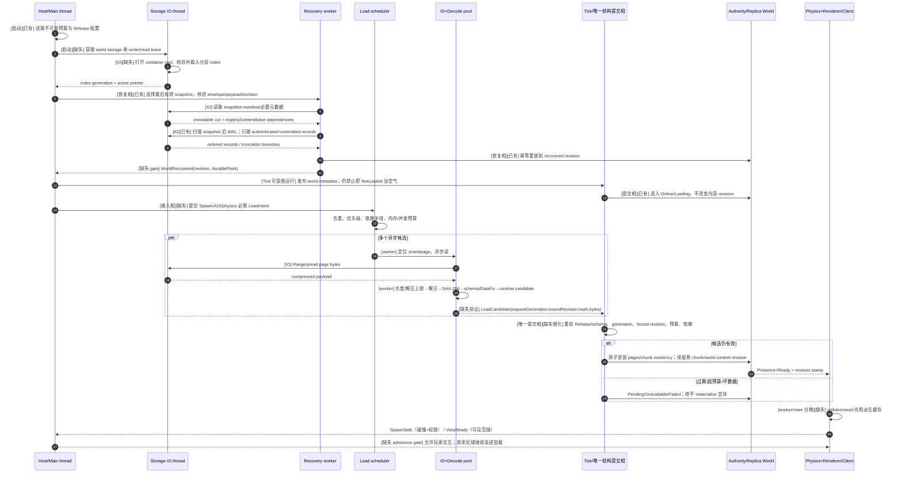
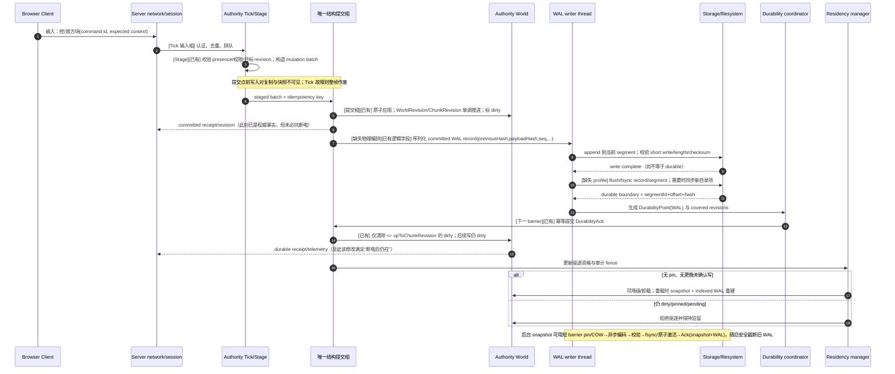

# 体素大世界地图存档：读、写、懒加载、版本演进与 Minecraft 兼容调研

- **交付日期**：2026-08-29
- **研究性质**：纯外部调研；不访问委托方代码库
- **目标环境**：Rust Authority + 浏览器 .NET WASM Replica；公共契约画像以委托方题面为准
- **正文引用**：使用 `〔Sxxx〕` 回指根目录 `sources.md`

## 信息源可达性声明

1. **联网能力**：可访问公开网页、规范、官方文档、GitHub 仓库页与大多数源码文件；本次没有 clone、没有下载整仓，也没有把第三方源码放入交付包。GitHub 部分动态页面偶发 “Uh oh” 或不展示最新提交日期，但代码正文、README 与固定 commit permalink 可读取。
2. **Minecraft 格式资料**：Mojang/Minecraft 官方更新说明、Microsoft Minecraft Creator 文档、wiki.vg 静态存档、Forge 生成文档、开源解析器源码可达。`minecraft.wiki` 正文在本环境被 robots 规则阻断，因此没有把它作为 `Verified` 的唯一依据；凡依赖社区逆向的字段均明确标注。
3. **源码检索**：按符号与路径在线定位。取得固定 commit 的核心源码包括 `Mojang/DataFixerUpper@d0f713b` 与 `Zylann/godot_voxel@32e317d`。Minutor、Luanti 等部分引用只能取得分支链接，相关源码结论降为 `Reported`，避免伪装成不可变证据。
4. **中文社区**：可读取 GitHub 上保存的中文 Minecraft Wiki 基岩版 LevelDB 摘录；知乎、Bilibili、贴吧等动态平台没有作为关键格式事实的唯一证据。中文来源可能滞后于当前 Bedrock 版本，正文按此降级。
5. **论文与长 PDF**：部分经典论文只取得公开摘要或文本化入口，未以其中的具体 benchmark 数字作为结论。性能数字不足处统一标 `Estimated`，并给出测量方案。

## 置信度图例

- **`[Verified]`**：已读到官方文档、规范正文，或有固定 commit + 文件路径/行号的源码。
- **`[Reported]`**：多个可信社区来源、工具实现或分支源码一致，但没有官方格式规范或不可变源码坐标。
- **`[Estimated]`**：基于公开机制、容量公式或工程经验的推断；必须通过目标环境 benchmark 才能定案。

> 同一段内若存在不同证据等级，以较低等级为准。Minecraft 社区格式文档不是 Mojang 官方规范，即使描述稳定，也会写明其社区属性。

## 被剖析对象与版本范围

| 对象 | 本报告覆盖范围 | 说明 |
|---|---|---|
| Minecraft Java Edition | Anvil 1.2.1 起；重点 1.13、1.15/1.16、1.17、1.18、1.20.5 附近及 24w04a | 解析器规则按 `DataVersion`/版本区间分支，不把所有时代混为一谈 |
| Minecraft Bedrock Edition | LevelDB 世界；重点 1.18.20/1.18.30 actor storage 迁移及扩展高度后的 chunk key/tag | Bedrock 内部格式公开资料少于 Java，字段以 Microsoft 官方 actor 文档和社区逆向交叉验证 |
| DataFixerUpper | `Mojang/DataFixerUpper@d0f713b` 与公开仓库当前形态 | 研究其 schema/fix 链的工程组织，不宣称开源仓库包含 Minecraft 全部具体修复规则 |
| Luanti | 2026-08 可见主分支 | 嵌入式数据库式 mapblock 存储与只读后备库 |
| Godot Voxel | Region Format v3；源码 commit `32e317d` | 三维 region forest、sector index、流式加载 |
| Unreal Engine | World Partition / OFPA 当前官方文档 | 只借鉴运行时分区、streaming source、内容拆分；不是玩家存档实现 |
| Unity Addressables | 当前官方 Content Update Build 工作流 | 只借鉴不可变内容清单与增量内容发布；不是世界事务存档 |
| Zarr v3 / COG / PMTiles v3 / 3D Tiles 1.1 | 对应当前公开规范 | 借鉴 shard、层次索引、HTTP Range、多分辨率与静态分发 |
| WebAssembly / 浏览器存储 | 2026-08 的 MDN、WHATWG、.NET 10 文档 | 配额是浏览器/设备/安装形态相关值，不当作跨浏览器保证 |

## 执行摘要

1. **规范字节与物理压缩必须拆层。** `[Verified]` Zstd 规定的是可互操作的解码格式，不是唯一编码；真实 issue 显示版本、实现或构建路径变化会改变压缩输出。只在 page 上写 `Zstd`/`Lz4`，不足以让 Rust 与 C# 在任何时候产出相同压缩字节。目标契约应把内容哈希绑定到未压缩的规范逻辑字节，物理容器再独立压缩；若坚持哈希压缩后字节，就必须冻结编码器版本、参数、线程模式、字典字节和黄金向量。〔S069–S075〕
2. **Authority 与浏览器 Replica 不宜共用同一物理容器。** Authority 需要事务写、WAL、checkpoint、compaction、精确 durability ack；浏览器更适合不可变、可 Range 读、内容寻址的 shard/cache。两端应该共享逻辑 page codec、坐标/版本语义和测试语料，而不是强制共享文件布局。Zarr sharding、COG、PMTiles 已证明“多个内块共用对象 + 索引 + Range”是成熟静态读取路线。〔S049–S055〕
3. **Minecraft Java 解析器必须按 DataVersion 分叉。** `[Verified]` 1.13 Flattening 抛弃数值 block data；1.16 起 palette index 不再跨 64-bit long；1.17 将实体移入独立 region；1.18 移除外层 `Level`，把 block states 与 biomes 都放进 section paletted container，并引入负 Y/384 高度。把这些规则揉成一个“Anvil parser”会产生静默错块，而不是整洁报错。〔S007–S014〕
4. **NBT 字符串是跨版转换的隐蔽雷。** `[Verified/Reported]` Java `DataInput/DataOutput` 使用 Modified UTF-8；Bedrock 工具链通常按标准 UTF-8。Chunker 已有真实 issue 表明错误处理会损坏文本 NBT。导入器必须在源 adapter 层把字符串解码语义显式化，不能让通用 UTF-8 库默默替代。〔S002–S004〕
5. **冷启动不是“把世界读完”，而是分级可用。** 应依次完成：release/world manifest 与 active checkpoint 校验、索引可用、认证 WAL 尾重放、世界元数据上线、关键 AOI 请求、异步 IO/解压/解码、唯一结构提交点原子安装、碰撞/网格/呈现。玩家只能在必需碰撞与权限数据 Ready 后进入；Tick 可先运行，但不能把 `NotLoaded` 当空气。完整世界后台加载对于无限/大世界既不必要也不可完成。
6. **异步加载完成必须作为“候选批次”进入唯一提交点。** IO 线程不得直接发布 chunk。提交点要重新验证 world/release、请求代次、绑定 revision、预算与邻接依赖；过期完成丢弃或重排。这样才能同时满足异步吞吐、`LatestAtBegin` 不重绑和单帧唯一结构提交。
7. **Replica 的“脏”必须拆成三类。** 服务器权威但尚未持久化的 dirty 与客户端无关；客户端缓存的权威 chunk 可以丢并按 hash/revision 补；只有尚未获服务器确认的本地预测/命令 overlay 不可丢。若沿用一个 `Dirty` 状态和 `DurableEviction` 语义，浏览器会被不必要地锁死在内存中。
8. **Minecraft 导入必须经过版本化语义 IR。** Java 与 Bedrock 的容器、字节序、字符串、block identity、biome、entity storage 都不同，无法安全做字节搬运。正确管线是：源读取器 → 版本归一化 IR → 显式映射 artifact → 目标 canonical page → 校验/报告 → staging 原子激活。映射版本、未知 block 策略、裁剪/平移和丢弃项必须成为导入证据，而不是日志里的一句 warning。〔S017–S034〕
9. **迁移 DAG 只是执行骨架，还缺版本语义和历史语料库。** 必须分开记录 container、voxel schema、snapshot/WAL、content registry、mapping set、worldgen 与 release compatibility；增加旧格式只读 adapter、迁移规划器、所有历史 fixture 的 golden corpus。改 chunk 尺寸、坐标语义或高度范围通常是全量重分区，不能假装成加字段式读时升级。
10. **当前画像最大的完整性缺口不是 WAL，而是“契约外工程面”。** 磁盘容器/索引、空间回收、索引重建、备份与修复、客户端缓存失效、block ID 语义、worldgen 版本、地图底图/玩家改动 overlay、历史迁移语料和诊断工具均未冻结。它们不补，系统会在首个大地图、首个浏览器内存压力、首个 Minecraft 非当前版本世界或首个内容更新时具体失效。

## 已知缺口

- `minecraft.wiki` 受 robots 限制，Java/Bedrock 某些标签名只能由 wiki.vg 存档、官方发布说明和开源解析器交叉验证；当前版本最细的社区页面可能比本报告更新。
- 没有获得 Mojang 游戏本体全部反混淆源码的固定 commit，因此没有把其私有 `RegionFile`、`ChunkSerializer` 全部实现细节标成 `Verified`；Forge 常量、官方 changelog 与第三方解析器覆盖了本报告需要的边界。
- Bedrock LevelDB 值格式没有一份覆盖所有当前版本的官方公开规范。除 actor storage 外，subchunk/palette 细节主要为社区逆向，统一标 `Reported`。
- 没有找到可复现、跨硬件、覆盖“几 GB Minecraft 世界全量转换耗时”的公开 benchmark。C/E/F 的绝对吞吐数字不作声称，给出目标 benchmark 矩阵。
- 没找到公开项目对“Rust 与 C# 两套独立 voxel encoder 跨版本逐字节相同”给出生产证明；本报告采用可复现构建/共用语料/差分测试方法论作推导。
- 浏览器配额由浏览器、磁盘、安装方式和用户授权决定，MDN 给的是实现政策而非应用可依赖的固定保证。


# A. 谱系与总体形态：一个大世界存档系统长什么样

**结论先行 1/3：** 没有“ universally best”的容器；事务写与静态 Range 读是两类不同优化目标。  
**结论先行 2/3：** 区域/分片的共同本质是用一个粗粒度对象承载多个细粒度块，并用内部索引保持随机读。  
**结论先行 3/3：** 生产完整性不只等于快照+WAL，还包括索引重建、空间治理、版本/内容语义、缓存失效、修复与测试。

## A.1 五类总体架构

下表的 IO 次数以“索引已热、一次随机读一个 chunk、容器无额外网络往返”为比较模型；它是结构性比较，不是设备 benchmark。

| 形态 | 为何存在 | 随机读 | 顺序扫描 | 写/空间放大与碎片 | 并发与崩溃一致性 | HTTP Range | 典型先例 |
|---|---|---|---|---|---|---|---|
| 区域文件式 | 避免每 chunk 一文件，把局部 2D/3D 邻域装入一个文件 | `[Verified]` 通常 1 次头/索引读（可缓存）+ 1 次 payload 读 | 好；局部数据相邻 | 变长覆盖需重分配 sector；空洞、尾部增长、sector padding；需重写/compact | 常用单写者锁、临时文件或同步写；头与数据更新顺序是风险点 | 中等；索引在头部或固定位置时可 Range，但频繁可写文件不宜直接发布 | Minecraft Anvil、Godot Voxel region〔S005–S007、S043–S044〕 |
| 嵌入式 KV：B-tree | 直接以 chunk key 寻址，借数据库事务/WAL | 索引树若热通常少量页读；冷时多次页读 | 按 key 序扫描较好 | page split、freelist；写放大通常低于 LSM compaction，但随机写多 | SQLite 等给原子事务、WAL、锁；多进程策略成熟 | 差；远程 Range 无法执行 B-tree/WAL 协议 | Luanti SQLite、MBTiles〔S037–S039、S060–S062〕 |
| 嵌入式 KV：LSM | 优化持续追加写；把随机改写转为 memtable+SST | 可能查 memtable 与多层 SST/Bloom；尾延迟受 compaction | 很好；SST 顺序 | compaction 带写放大/空间放大，墓碑回收延迟 | WAL+MANIFEST+不可变 SST；通常单进程独占写 | 差；SST 单体可 Range，但完整查询需引擎 | Bedrock LevelDB、RocksDB〔S017–S020、S063–S064〕 |
| 单文件+内部索引 | 易分发、易校验、减少对象数 | 1–3 次 Range：header/root dir/leaf dir/payload | 很好 | 若只读发布几乎无碎片；原地更新常需重写或追加新目录 | 适合 immutable build + 原子指针切换；不适合高频事务写 | 最好 | PMTiles、COG〔S052–S054〕 |
| 目录树+每对象一文件 | 实现简单、增量同步直观、单块损坏隔离 | 1 次 open/read，但目录与 inode 元数据可能成为瓶颈 | 差到中等；大量 open/stat | 文件系统 block 与 inode 空间放大；数百万文件操作/备份困难 | 可逐文件临时写+rename；跨多文件事务难 | 每对象 URL 容易；请求数爆炸 | 小型 voxel 工具、对象存储 chunk layouts |
| 分块数组/分片格式 | 超大 N-D 数据的局部访问、跨语言与云对象存储 | chunk 直键或 shard index+inner chunk | 很好，可按空间局部排序 | shard 内更新可能重写 shard；小文件问题由 sharding 解决 | 多用于不可变/版本化对象，不替代事务 DB | 很好，Zarr/COG 都为远程局部读设计 | Zarr v3/OME-Zarr/3D Tiles〔S049–S055〕 |

`[Verified]` Minecraft 的 4 KiB sector 不是“磁盘必须 4 KiB”的协议崇拜，而是为了让变长压缩 chunk 可以迁移到新的连续 sector、只改固定索引而不平移后续所有 chunk；代价就是内部 padding、空洞和索引/数据更新次序。Godot Voxel Region v3 使用类似 sector index，说明该取舍对三维块流仍然成立。〔S005、S043–S044〕

`[Verified]` Zarr v3 sharding 给出了更现代的同构答案：一个 shard 内含多个可独立压缩、独立寻址的 inner chunk，索引使用固定宽度 offset/length，并推荐 little-endian + CRC32C。它明确把“小 chunk 对浏览器流式读取有利”与“大量小对象/inode 不可承受”作为矛盾来源。〔S050〕

## A.2 磁盘表示与运行时表示

| 方案 | 优点 | 代价 | 适用边界 |
|---|---|---|---|
| 磁盘即内存、mmap/零拷贝 | 少一次复制；结构化数组可直接切片；冷数据由 OS page cache 管 | 磁盘 ABI 被 CPU 对齐/字节序/指针布局绑死；变长 palette、压缩、校验与版本迁移困难；page fault 尾延迟不可控；WASM 无通用文件 mmap | 只读、固定宽度、版本稳定、平台受控的数据 |
| 两套表示：canonical bytes ↔ runtime | 存档可稳定、紧凑、跨语言；运行时可按 SIMD/GC/查询优化 | 解压、校验、decode、分配成本；需要严格差分测试 | 本项目的 Rust/C# 双实现应走此路 |
| 压缩驻留中间层 | 卸载前保留 compressed page，回温时免磁盘/网络 | 两份表示切换复杂；压缩内存仍占预算；必须区分 authoritative cache 与 runtime objects | 浏览器与服务器的二级驻留 |

`[Estimated]` 本项目不宜追求全局 mmap。更合理的是：容器索引/manifest 可 memory-map（服务端平台允许时），page payload 仍经过受限解码；浏览器改用 `ArrayBuffer`/stream + pool。mmap 是实现优化，不能成为公共语义。

## A.3 生产级大世界存档能力基准表

| 能力族 | 必备语义 | 不具备时的具体失败 |
|---|---|---|
| 身份与寻址 | 世界、维度、chunk/page 的无歧义 key；负坐标 floor 规则 | `-1` 附近读错 region，坏块被写入邻区 |
| Presence | absent / not loaded / pending / unavailable / deleted 分离 | 视野洞被当空气；覆盖层无法表达挖空 |
| 版本 | container、logical schema、content、worldgen、mapping、release | 旧世界只能“试着开”，错误在深层 parser 才爆 |
| 索引 | 可持久化、校验、重建；冷热层级 | 冷启动全盘扫描；索引损坏等同世界丢失 |
| 编码 | canonical order、边界、字节序、整数宽度、palette | 双实现哈希漂移、越界或 silent corruption |
| 压缩 | 算法 profile、字典、最大解压大小、bomb 防护 | 同名算法不同字节；恶意/坏数据耗尽内存 |
| 完整性 | 页/块/manifest hash、长度、引用闭包 | 只发现“游戏异常”，无法定位损坏范围 |
| 并发读写 | 单写者/多读者、snapshot isolation、load generation | 后台加载覆盖新修改；同世界双进程互相踩 |
| 事务与 WAL | commit marker、幂等、checkpoint、截断规则 | 日志重放半条记录或重复应用 |
| 持久化确认 | 精确覆盖到 revision；清脏条件 | 过早驱逐导致断电丢块，或永远不清脏 |
| 快照 | 短 barrier、不可变 cut、pin/COW 预算 | autosave 长停顿或编码时读到撕裂状态 |
| 驻留 | 上限、候选评分、hysteresis、分级驻留 | 多玩家分散导致 OOM；边界来回抖动 |
| 加载调度 | AOI、显式查询、物理/光照/网格邻块依赖；去重/优先级 | 隐蔽级联把预取放大成风暴 |
| 唯一提交 | 异步完成在结构提交点校验并原子安装 | revision stamp 与实际块集合不一致 |
| 派生缓存 | light/mesh/heightmap 的 provenance 与可重算规则 | 把缓存误当权威，迁移体积与兼容面膨胀 |
| 空间治理 | hole accounting、compaction、tombstone GC、quota | save 只增不减；磁盘满后写入半成品 |
| 备份与修复 | 多检查点、索引重建、坏块隔离、恢复报告 | 唯一快照损坏后无退路；工具只能删世界 |
| 迁移 | read adapter、DAG、staging、resume、rollback、evidence | TB 世界迁移中断后重头来；旧格式被覆盖 |
| 内容更新 | immutable base、overlay/tombstone、content manifest | 地图更新覆盖玩家建筑或永远无法触达旧存档 |
| 跨端缓存 | cache key、ETag/hash/revision、失效协议 | 客户端展示旧块，或每次登录全量重拉 |
| 工具与观测 | inspector、热力图、IO/decode/mesh 时延、dirty age | 只能凭感觉调 chunk 大小；问题无法复现 |
| 测试 | golden corpus、round-trip、fuzz、crash/partial-write injection | 第一次真正断电/旧世界/坏块就是生产测试 |
| 安全预算 | 最大文件、tag depth、array length、decompressed bytes、并发 | 外部 Minecraft 世界可触发 OOM/栈溢出/路径穿越 |
| 运营接口 | health、backup hook、migration trigger、version query | 上线后不能安全维护，只能停机手工拷目录 |

这张表是 S 章缺口矩阵的基准。目标画像已强在 revision、canonical bytes、快照生命周期、durability ack、eviction fence 和 WAL hash chain；弱点集中在物理容器、加载调度、版本语义、内容层、客户端缓存、修复/测试/诊断。

### 本章来源

〔S005〕, 〔S037〕, 〔S043〕, 〔S049〕, 〔S050〕, 〔S052〕, 〔S053〕, 〔S060〕, 〔S061〕, 〔S063〕, 〔S064〕, 〔S085〕, 〔S086〕


# B. Minecraft 存档格式深挖

**结论先行 1/3：** Java “Anvil”不是一个静态格式名，而是一串必须由 DataVersion 驱动的格式族。  
**结论先行 2/3：** 真正会写坏解析器的节点是负坐标、MUTF-8、1.16 bit packing、1.17 entity split、1.18 root/height/biome 与现代混合压缩。  
**结论先行 3/3：** Bedrock 是 little-endian LevelDB 语义对象存储；Java↔Bedrock 必须经归一化 IR 和版本化映射，不能字节搬运。

## B.1 证据边界

Minecraft Java 没有一份由 Mojang 发布、像 RFC 一样覆盖所有存档字段的完整规范。本章把来源分为：

- **Mojang/Microsoft 官方**：版本变更、Flattening、1.16 bit packing、1.18 chunk root/biome/height、Bedrock actor storage；可标 `Verified`。
- **社区格式规范**：wiki.vg 存档、中文 Wiki 摘录；长期被工具生态采用，但仍标 `Reported`，且可能滞后。
- **源码交叉验证**：固定 commit 的 DFU/Godot 为 `Verified`；Minutor 等分支 parser 证明工具如何实现，但无 immutable ref 时为 `Reported`。

## B.2 Java NBT 二进制格式

### B.2.1 Tag 类型表

`[Reported]` 下表来自 wiki.vg 静态规范；数字类型在 Java NBT 中均为 big-endian。〔S001〕

| ID | 名称 | payload |
|---:|---|---|
| 0 | `TAG_End` | 无 payload；用于终止 `TAG_Compound`，不带名称 |
| 1 | `TAG_Byte` | 1 byte signed |
| 2 | `TAG_Short` | 2 byte signed |
| 3 | `TAG_Int` | 4 byte signed |
| 4 | `TAG_Long` | 8 byte signed |
| 5 | `TAG_Float` | IEEE-754 binary32 |
| 6 | `TAG_Double` | IEEE-754 binary64 |
| 7 | `TAG_Byte_Array` | int32 length + length bytes |
| 8 | `TAG_String` | uint16 byte length + string bytes |
| 9 | `TAG_List` | element type byte + int32 count + count 个**无名**同类型 payload |
| 10 | `TAG_Compound` | 0..N 个完整 named tag，最后 `TAG_End` |
| 11 | `TAG_Int_Array` | int32 count + count×int32 |
| 12 | `TAG_Long_Array` | int32 count + count×int64 |

一个完整 named tag（除 compound 内的 `TAG_End`）逻辑上是：

```text
u8 tagType
u16 nameByteLength (big-endian)
byte[nameByteLength] name
payload(tagType)
```

根通常是一个 named `TAG_Compound`。解析器必须限制最大嵌套深度、最大 list/array/string 长度和累计分配量；长度为负、乘法溢出、未终止 compound 都应作为格式错误，而不是空值。

### B.2.2 Modified UTF-8 陷阱

`[Verified]` Java `DataInput.readUTF`/`DataOutput.writeUTF` 定义的是 **Modified UTF-8 (MUTF-8)**，不是严格标准 UTF-8；Kaitai 的 Minecraft NBT grammar 也明确提示其通用实现用标准 UTF-8 只是近似。`[Reported]` Chunker 的真实 issue 显示 Java↔Bedrock 转换因此损坏文本。〔S002–S004〕

解析器要求：

1. Java NBT adapter 实现 MUTF-8；至少正确处理 NUL、补充平面字符的 surrogate pair 和 65,535-byte 上限。
2. Bedrock adapter 不复用 Java string decoder；Bedrock 端按其 little-endian NBT 变体和标准 UTF-8 处理。
3. 归一化 IR 内存字符串使用 Unicode scalar/宿主 string，但必须能报告源字节不可解码的位置；不能替换成 U+FFFD 后继续生成“成功”快照。

### B.2.3 压缩外壳

`[Reported]` NBT 是数据格式，不强制全局压缩。常见 Java 世界文件：`level.dat`、`playerdata/*.dat` 等为 gzip 包裹的 NBT；region 文件本身不整体压缩，每个 chunk record 由自己的 compression marker 决定；调试/网络/工具也可出现 raw NBT。解析器 API 因而应把 `Raw/Gzip/Zlib` 检测或显式 profile 与 NBT tree parser 分离。〔S001、S005〕

## B.3 Java 世界目录结构（现代世界）

| 路径 | 内容/读取者 | 丢失后事实后果 | 版本/置信度 |
|---|---|---|---|
| `level.dat` | 世界级 metadata、版本、生成/规则等 | 通常无法正常识别/打开世界；不能据此把 terrain 当空 | 现代 Java；`Reported` |
| `level.dat_old` | 上一份 level metadata 备份 | 失去一个恢复点 | 1.16 官方明确临时文件/旧文件策略；`Verified`〔S007〕 |
| `session.lock` | 单会话/单写者锁 | 忽略会允许两个进程并发写同一世界 | `Reported` |
| `region/r.<rx>.<rz>.mca` | terrain/chunk NBT | 对应 32×32 chunk terrain/方块实体等丢失；游戏可能按 worldgen 重生，但玩家修改丢失 | Anvil 1.2.1+；`Reported` |
| `entities/r.<rx>.<rz>.mca` | 实体 region | 非玩家实体丢失/重建不完整 | 1.17+；`Verified/Reported`〔S009、S012〕 |
| `poi/r.<rx>.<rz>.mca` | Point of Interest section storage | 村民工作站等行为状态需重建或异常 | 1.14+ 时代；`Reported` |
| `playerdata/<uuid>.dat` | 玩家状态 | 玩家位置/背包/能力等丢失或重置 | `Reported`；本报告不展开 schema |
| `data/*.dat` | maps、raids、scoreboard、saved data 等 | 对应全局子系统状态丢失 | `Reported` |
| `advancements/*.json`、`stats/*.json` | 玩家进度/统计 | 对应进度丢失 | `Reported`；不是 NBT |
| `DIM-1/`、`DIM1/` | Nether、End 的维度根 | 维度数据丢失 | 历史/vanilla 路径；`Reported` |
| `dimensions/<namespace>/<path>/` | datapack/custom dimensions | 自定义维度丢失 | 现代 Java；`Reported` |

工具不能通过“目录不存在”推断该维度是空世界。应返回 `SourceComponentMissing` 并让导入策略决定拒绝、只导其余维度或显式生成空目标维度。

## B.4 Anvil region 文件：可直接实现的读取算法

### B.4.1 坐标与文件名

`[Reported]` 一个 region 覆盖 X/Z 各 32 个 chunk：

```text
regionX = floorDiv(chunkX, 32)
regionZ = floorDiv(chunkZ, 32)
localX  = floorMod(chunkX, 32)  // 0..31
localZ  = floorMod(chunkZ, 32)  // 0..31
file    = r.<regionX>.<regionZ>.mca
slot    = localX + localZ * 32
```

负坐标必须使用数学 floor，不是向 0 截断；语言 `%` 若对负数返回负余数，必须使用 floor-mod。典型错误：`chunkX=-1` 被归到 `regionX=0`，实际应为 `-1`，`localX=31`。〔S005〕

### B.4.2 Header

`[Reported/Verified constants]` 文件头固定 8 KiB：

- offset `0..4095`：1024 个 4-byte location entry；
- offset `4096..8191`：1024 个 4-byte Unix timestamp（big-endian）；
- 数据从 sector 2 开始；sector 大小 4096 bytes。

location entry：高 24 bit 为 sector offset，低 8 bit 为 sector count。`offset==0` 或 `count==0` 表示该 slot 没有内嵌 chunk。Forge 1.19.3 文档确认 `SECTOR_BYTES=4096`、`SECTOR_INTS=1024`、`CHUNK_HEADER_SIZE=5`。〔S005–S006〕

### B.4.3 Chunk record

在 `sectorOffset*4096`：

```text
u32 length_be       # 后续 compression byte + compressed payload 的长度
u8  compression     # 低 7 bit 算法；高 bit 可能为 external flag
byte[length-1] data
padding to sector boundary
```

旧格式社区规范定义 1=gzip、2=zlib；24w04a 官方新增可配置 LZ4，且明确更换配置不会自动重压旧 chunk，故同一 region 可混用算法。现代 parser 必须按每条 record 解码，不能按世界级配置猜。〔S005、S011、S029、S083〕

读取前应执行：

```text
require sectorOffset >= 2
require sectorCount >= 1
require sectorOffset + sectorCount <= ceil(fileLength/4096)
require length >= 1
require 4 + length <= sectorCount*4096
require decompressedSize <= configuredLimit
```

timestamp 只能做诊断/启发，不是 revision 或真实性证据。

### B.4.4 超大 chunk 与 `.mcc`

`[Verified constants + Reported filename]` RegionFile 的 1-byte sector count 最大 255；实现常量 `EXTERNAL_CHUNK_THRESHOLD=256`、`EXTERNAL_STREAM_FLAG=128`、扩展名 `.mcc`。超过约 1 MiB sector envelope 的 chunk 会把压缩流外置；社区实测文件名为 `c.<chunkX>.<chunkZ>.mcc`，位于相应 region 目录。region record 保留长度/flag/算法提示。〔S006、S079〕

这解决了“1-byte sector count 无法表示 256+ sector”的硬上限，但引入两个原子性对象：`.mca` 索引/marker 与 `.mcc` payload。缺一个时不能把 chunk 当空气，必须报告 external payload missing。

### B.4.5 为什么 4 KiB sector、以及具体坑

- **解决的坑**：压缩后 chunk 大小会增长/缩小。sector allocator 允许变大时另找连续 extent，仅更新 location table，而不平移后面所有 chunk。
- **代价**：每个 chunk 向上取整到 4 KiB；删除/迁移留下 hole；频繁增长造成碎片；头先写而数据未 durable 会指向垃圾；数据先写而头未 durable 会泄漏孤儿 sector。
- **官方补救**：Java 1.16 将 region file 同步模式作为防 crash 数据丢失/损坏手段；24w04a 提供重建 region files 的优化路径以生成新鲜、去碎片文件。〔S007、S011〕

## B.5 Chunk NBT 结构与版本分叉

### B.5.1 pre-1.13 legacy section

`[Reported from parser]` 每个 16×16×16 section 常见：`Y`、`Blocks[4096]`、`Data[2048]`、可选 `Add[2048]`、`BlockLight[2048]`、`SkyLight[2048]`。`Data`/`Add` 是 nibble array；section 内线性顺序常按 `index = y*256 + z*16 + x`。`Blocks` 与 metadata 组合成旧 block ID/state。〔S012–S013〕

### B.5.2 1.13 Flattening

`[Verified]` 17w47a 官方明确删除 “block data/item data”，拆分并重命名几乎所有 block/item，以解除旧 ID 空间约束，并警告会破坏世界/资源包。存档从数值 ID+metadata 转为 palette entry compound：`Name` 为命名空间 ID，`Properties` 为状态属性 map。旧世界由版本修复链转换。〔S008、S012、S014–S015〕

### B.5.3 1.18 root 重构与高度

`[Verified]` 1.18：

- 外层 `Level` 被移除，原内容进入 chunk root；
- `Level.Sections[].BlockStates` / `Palette` → `sections[].block_states`；
- `Level.Biomes` → `sections[].biomes` 的同类 paletted container；
- `TileEntities` → `block_entities`，ticks/structures 等同步重命名；
- 添加 `yPos`、`below_zero_retrogen`、`blending_data`；
- 生成/建造总高度 384，向下至 y=-64，并存在负 section Y。〔S010〕

解析器不能用 unsigned section index，也不能假设 section 数为 16。应按 NBT 中的 signed `Y` 定位，验证 chunk root 的 `xPos/zPos` 与 region slot 计算是否一致；不一致属于 wrong-located chunk，可供修复工具隔离。

## B.6 Paletted container 编解码规则

### B.6.1 共同模型

一个容器含：

- `palette`：局部值表；block palette 元素通常是 `{Name, Properties?}`；biome palette 通常为命名空间字符串；
- `data`：`TAG_Long_Array`，每个条目存 palette index；palette 只有一个值时 `data` 可缺席，表示所有位置均为 index 0；
- 元素遍历序必须固定。block section 为 4096 个位置，常见顺序 `x` 最快、然后 `z`、再 `y`：`i = x + 16*z + 256*y`；1.18 biome section 为 4×4×4=64 个采样值。〔S010、S012–S013〕

### B.6.2 bits per entry

`[Reported, cross-checked by parser]` 局部 block palette 通常：

```text
bits = max(4, ceil(log2(paletteLength)))
mask = (1 << bits) - 1
```

当 palette 过大时，某些版本/协议会切到 global palette；**存档 parser 不应凭网络协议阈值硬编码**，而应由 `data.length`、`palette.length` 与 DataVersion profile 校验。biome container 的最小 bits 通常为 1。异常 palette index >= palette length 必须报坏块。

### B.6.3 1.16 前后 long 边界

`[Verified]` Java 1.16 官方说明 `BlockStates` 值不再跨 64-bit long；若 bits 不能整除 64，long 高位留空。例如 5 bits 时每 long 装 12 个，最高 4 bits 不用，long 数从 320 增到 342。〔S007〕

伪代码：

```text
# 1.16+ padded packing
valuesPerLong = floor(64 / bits)
longIndex = floor(i / valuesPerLong)
bitOffset = (i % valuesPerLong) * bits
index = (u64(data[longIndex]) >> bitOffset) & mask

# 1.13–1.15 compact packing
bitIndex = i * bits
lo = bitIndex // 64
shift = bitIndex % 64
value = u64(data[lo]) >> shift
if shift + bits > 64:
    value |= u64(data[lo+1]) << (64-shift)
index = value & mask
```

Java `long` 在 NBT 中是 signed，但位运算要转为无符号 64-bit bit pattern。不能算术右移。DataVersion 阈值应来自维护的 version profile/fixture，不要从“游戏显示版本字符串”临时猜；Minutor 当前实现以 DataVersion 分支验证了这种做法。〔S012〕

## B.7 实体、方块实体、POI、结构

- **Block entity**：依附某个 block 坐标的额外 NBT，例如容器内容；和 block state 不同，不能只转 palette。1.18 root 名改为 `block_entities`。`[Verified/Reported]`
- **Entity**：可移动、独立身份。1.17 起从 terrain chunk 移到 `entities/*.mca`；terrain 与 entity snapshot 不再天然是同一物理 record。`[Verified/Reported]`〔S009–S012〕
- **POI**：独立 `poi/*.mca`，服务村民等系统。导入时通常可丢并由目标重建，前提是目标有等价扫描规则；没有则应明确 unsupported。
- **Structures**：chunk 内的 starts/references 记录与实际已放置 blocks 不同。只要目标不继续运行 Minecraft worldgen，已存在建筑方块应转，structure metadata 可丢；若要保留结构查询/继续生成，必须另做语义转换。

**地图与 ECS 交界**：地图块、block entity、动态 entity 不应因为 Minecraft 物理上曾共存一个 NBT 就强制同文件。需要定义共同 snapshot cut/revision barrier，并规定恢复顺序：先 registry/content → terrain/presence → block entity anchoring → ECS entity（见 ECS 专项）。若 terrain 与 entity 不在同一事务，entity 可能恢复到缺失/旧版本 chunk。

## B.8 光照、高度图与生成状态

`[Reported]` `BlockLight`/`SkyLight`、heightmaps 与部分缓存通常可由方块/世界规则重算，但存储它们能降低加载尖峰；Minecraft 保留它们正是性能交换。对导入器：

- 方块与不可重建 block entity 是权威输入；
- light、mesh、目标引擎自己的 height cache 默认重算；
- biome 是否保留取决于目标玩法/渲染；
- 源 heightmap 只可作校验/加速提示，不能在目标语义不同的情况下当真值。

`[Reported]` Chunk `Status` 记录 worldgen 到了哪个阶段，因为 chunk 可能处于部分生成状态，邻块生成/结构/光照会级联。精确状态集合随版本变动，通用 importer 应把它当 DataVersion 相关 opaque identifier：只接受 `full`/已完成策略，或显式允许部分块并在报告中列出；不能把半生成块当最终空洞。

## B.9 DataVersion 与 DataFixerUpper

`[Verified]` `DataVersion` 是保存数据的版本标识。DataFixerUpper 提供按 version key 注册 schema、按版本注册 fixes、从旧 schema 到目标 schema 组合/优化 rewrite rule 的框架。固定源码中 `DataFixerBuilder` 持有目标 data version、有序 schemas 与 fixes；`addSchema` 连接父 schema，`addFixer` 忽略高于游戏版本的 fix，`build/optimize` 构造从 source 到 target 的规则。〔S014–S015〕

工程动机：一次“全局 v1→v2 转换器”会随着历史增长成为条件地狱；DFU 把变化拆为有序的小步，并用 schema/types 定位要修的数据族。实际 Minecraft 可在对象加载时升级，随后在保存或 `Optimize World/forceUpgrade` 时持久化；24w04a 明确 world optimization 也覆盖 `entities` 与 `poi`。降级没有对称保证，新版本打开后旧客户端通常不安全。〔S011、S088〕

具体坑：卸载 mod/内容定义后，修复规则可能找不到旧 type/registry，社区已有升级崩溃案例。规则链不是万能容错；必须有 unknown-content policy、原始备份与失败不覆盖。〔S016〕

## B.10 Bedrock LevelDB 解剖

### B.10.1 总体

`[Verified]` Bedrock 用 LevelDB 风格嵌入式 KV，不是 Java 的 `.mca`。Microsoft actor storage 文档表明 chunk key prefix 是 `<Chunk Position><DimensionID>`；非常旧的 key 可无 dimension ID；不同 chunk 数据类型在 prefix 后追加 tag byte。〔S017〕

`[Reported]` 社区逆向表明 key 的整数与 NBT 多为 little-endian；普通 chunk key 常由 int32 x、int32 z、可选 dimension runtime ID、tag 组成，subchunk key另有 signed section index。不同历史版本的 key 长度/字段存在变化，必须由 world version/profile 驱动，不可仅按 key 长度猜。〔S018–S020〕

### B.10.2 `LevelChunkTag`

`[Verified]` Microsoft 文档公开的 tag enum 包括 `Data3D=43`、`Version`、`Data2D`/legacy、`SubChunkPrefix`、`BlockEntity`、`Entity`、`PendingTicks`、`BiomeState`、`FinalizedState`、`ConversionData`、`CheckSums`、`GenerationSeed`、`BlendingData`、`ActorDigestVersion`、`LegacyVersion=118` 等。字段存在不等于每个世界/版本都有值；parser 应保留未知 tag。〔S017〕

### B.10.3 现代 actor storage

`[Verified]` 旧模式把一个 chunk 所有 actor 聚成 blob；改一个 actor 要重写全部，跨 chunk 转移昂贵且脆弱。1.18.20/1.18.30 迁移期后，每个 actor 用 `actorprefix<ActorUniqueID>` 独立 key；chunk 对应 digest key 为 `digp<Chunk Key>`，列出该 chunk actor keys。这个事故直接说明：高变动对象不应与大块 terrain 共写。〔S017〕

### B.10.4 Subchunk palette

`[Reported]` Bedrock subchunk 也使用 palette + bit-packed indices，但其 word packing、runtime/persistent palette、storage layer 数和版本字节不同于 Java。社区文档描述每 32-bit word 内条目不跨边界，header 的 bits-per-entry 与 network flag 决定解释。导入器应解析成 `{namespaceId, properties}` 或明确的未知 opaque state，而不是把 Bedrock runtime ID 当永久 ID。〔S018–S020〕

## B.11 Java ↔ Bedrock 互转的根本难点

| 维度 | Java | Bedrock | 转换后果 |
|---|---|---|---|
| 容器 | region sector files | LevelDB keys/values | 必须全解析，不能复制文件 |
| 字节序 | NBT big-endian | 主要 little-endian 变体 | adapter 分离 |
| 字符串 | MUTF-8 陷阱 | 标准 UTF-8 路径 | 文本需语义转码 |
| block identity | namespaced block state palette | persistent/runtime palette 与版本化 states | 需要内容映射库 |
| biome | 版本依赖，1.18 section palette | Data3D/subchunk 版本依赖 | 分辨率和高度采样重映射 |
| entity | Java 1.17+ 独立 entity region | actor key + digest | 身份/引用/跨块关系转换 |
| worldgen metadata | Java status/structures/blending | Bedrock finalized/conversion/blending tags | 多数不可一一对应 |

## B.12 破坏性变更年表

| 版本节点 | 破坏性变化 | 旧世界处理 | 典型坑 |
|---|---|---|---|
| 1.2.1 Anvil | region `.mca`、16-high sections、扩展高度 | 从更老格式转换；1.18 已拒绝直接打开 pre-Anvil 1.2 之前世界 | 工具假设只有 `.mca`；旧样本缺 DataVersion |
| 1.13 Flattening | 数值 ID+metadata → namespaced states | DFU/升级链 | mod ID、重命名、属性丢失；官方明确“会破坏一切”〔S008〕 |
| 1.15 附近 | 超大 chunk 外置 `.mcc` | 按 marker 读取 | 只备份 `.mca` 会漏 payload；双文件原子性 |
| 1.16 | block-state entries 不再跨 64-bit long | parser 依据 DataVersion 切换 | 用旧 compact 算法会从首个边界起错位〔S007〕 |
| 1.17 | entity region 独立 | 升级/保存迁移 | 只复制 `region/` 的工具漏实体 |
| 1.18 | root 去 `Level`；负 Y；384 高度；section `block_states/biomes` | blending、below-zero retrogen、DFU | unsigned Y、固定 16 sections、旧路径 parser 全失效〔S010〕 |
| 1.20.5/24w04a 路线 | region 可用 LZ4，世界可混合压缩 | 旧 chunk 不自动重压；优化工具可重写 | 只支持 zlib 的库报未知 compression 4〔S011、S029〕 |
| Bedrock 1.18.20/1.18.30 | actor blob → actor key/digest | 旧 actor 数据迁移到现代 keyspace | 只读旧 `Entity` tag 会漏现代实体〔S017〕 |

## B.13 解析器陷阱清单

1. 负坐标用 truncating division/mod。
2. 把 Java NBT string 当标准 UTF-8。
3. 数组长度乘元素宽度时 int overflow。
4. 把 NBT signed long 算术右移。
5. 不按 DataVersion 区分跨-long/不跨-long。
6. palette size 1 时误要求 `data`。
7. palette index 越界后回退 air。
8. 1.18 仍查 `Level.Sections`，或忽略负 `Y`。
9. 只读 `region/`，漏 `entities/`、`poi/`、`.mcc`。
10. 信任 header sector count/length，导致越界或解压炸弹。
11. 假设同一世界所有 chunk compression 相同。
12. region slot 坐标与 NBT `xPos/zPos` 不一致时静默接受。
13. 半生成 chunk/缺 biome 被当完整空块。
14. 两个进程同时写同一世界，忽略 `session.lock`。

## B.14 合规边界（事实，不作法律意见）

现有开源转换器通常发布自己的程序、格式映射与测试，不把 Minecraft 游戏二进制或资源材质打包进仓库。Chunker 使用 MIT，并声明由 Hive 维护、获 Mojang 资助但 Mojang/Microsoft 不对内容负责；Microsoft 文档把它作为本地转换工具介绍。读取用户提供的世界数据与再分发 Mojang 资源是两类行为。本文不作法律结论，产品落地仍需单独审查使用条款、品牌与资源许可证。〔S021–S024〕

### 本章来源

〔S001〕, 〔S002〕, 〔S003〕, 〔S004〕, 〔S005〕, 〔S006〕, 〔S007〕, 〔S008〕, 〔S009〕, 〔S010〕, 〔S011〕, 〔S012〕, 〔S013〕, 〔S014〕, 〔S015〕, 〔S016〕, 〔S017〕, 〔S018〕, 〔S019〕, 〔S020〕, 〔S029〕, 〔S079〕, 〔S083〕, 〔S088〕


# C. 从 Minecraft 到自有格式：导入 / 转换管线

**结论先行 1/3：** 可靠导入器的核心不是 NBT reader，而是版本化语义 IR、mapping artifact、预算与可验证失败报告。  
**结论先行 2/3：** 离线、分块流式、staging 的全量转换最适合首版；运行时按需转换把损坏与版本复杂度带入在线路径。  
**结论先行 3/3：** 未知方块默认变空气会形成不可逆静默数据损失；placeholder + provenance 是更可审计的基线。

## C.1 工具全景与仓库体检

访问日期均为 2026-08-29；star 是当日仓库页可见量级，不用于质量排序。未取得精确最近 commit 日期时写“活跃/待核”，不编日期。

| 工具 | 语言/形态 | 许可证 | 版本/版别 | 健康度 | 已知边界 |
|---|---|---|---|---|---|
| `HiveGamesOSS/Chunker` | Java，CLI + GUI | MIT | Java/Bedrock 多版本；README 当前列到现代版本 | 983 stars；Hive 维护；603 commits；活跃 | 官方文档：blocks/biomes/tile entities、多维度、容器/maps；不转动态 entities 与 player inventory〔S021–S023〕 |
| `Querz/mcaselector` | JavaFX GUI/CLI | MIT | Java 1.2.1–当前 DataVersion 表 | 4.8k stars；1595 commits；活跃 | 修改/删除/导出 chunk；强烈要求备份；不是跨版语义转换器〔S027、S088〕 |
| `Amulet-Team/Amulet-Core` | Python library | 许可证本轮未核准，标待核 | Java/Bedrock 多版本抽象 | 约数百 stars；2026 可见活动 | 适合统一编辑抽象；大范围 NumPy/materialization 有内存风险；遇到新压缩需及时适配〔S028–S029〕 |
| `owengage/fastnbt` | Rust library | MIT | 重点 Java 1.13+；旧版支持有限 | stars/最近提交待核 | Rust NBT/region 基础；需自行补 importer policy〔S030〕 |
| `PrismarineJS/prismarine-chunk` | JavaScript library | MIT | Java + Bedrock 多版本 adapter | stars 待核；生态活跃 | 有 fixture/版本数据；JS 数值与 BigInt/typed-array 边界要测〔S031〕 |
| `PrismarineJS/minecraft-data` | JSON/JS data corpus | MIT（仓库） | Java/Bedrock registry/version data | 约 925 stars（访问页量级）；活跃 | 适合作源 registry 输入，不应直接成为目标稳定 ID 语义〔S032〕 |
| `matcool/anvil-parser` | Python library | MIT | 主要 1.14/1.15 时代 | 107 stars；维护较弱 | 不宜承担现代 1.18+ parser |
| `anvil-parser2` | Python fork | MIT | 1.18+，社区测试到现代版本 | 43 stars；维护状态待核 | 小型实现易读，但覆盖/鲁棒性需 corpus 验证 |
| `Fenixin/Minecraft-Region-Fixer` | Python CLI | GPL-3.0 | Java region 修复 | stars/最近提交待核；成熟历史工具 | 检测坏块、错位块、entity 过多；删除或从 backup 替换，修复可能有损〔S035–S036〕 |
| Minutor | C++ viewer | 许可证/健康度本轮未完整核 | Java 多 DataVersion | 分支源码可读 | parser 分支是实现参考，不是官方规范〔S012〕 |

**生产使用证据边界**：Chunker 由 The Hive 团队维护并获 Mojang 资助，Luanti/Godot Voxel 有真实项目生态；其余库“有人使用”不等于已证明适合不可信世界输入或 TB 级批处理。工具选择必须通过目标 corpus/fuzz/资源预算验收。

## C.2 推荐的转换架构

```text
Source Discovery
  -> JavaRegionReader | BedrockLevelDbReader
  -> Version Profile + Integrity Scan
  -> Normalized World IR (streaming, bounded)
  -> Mapping Artifact(versioned, content-addressed)
  -> Target Chunk/Page Partitioner
  -> Canonical Encoder
  -> Per-page/hash verification + semantic audit
  -> Staging manifest
  -> Atomic activation
```

IR 不应是“把整个世界放内存的对象图”。它应是可流式的 immutable record：源 world/dimension/chunk/section 坐标、源 DataVersion、block state dictionary、block entities、可选 biome、provenance、diagnostics。每个目标 chunk 的输入集合要可重复枚举，允许失败后从边界断点续跑。

## C.3 必须定案的决策清单

### C.3.1 方块映射

| 决策 | 候选 | 现有工具/行业事实 | 影响 |
|---|---|---|---|
| 目标无对应 block | `Fail`；`Placeholder`；规则替代；丢弃为空气 | Chunker 维护明确 mapping；工具生态会验证 identifier/palette；动态 entity仍可能不支持 | `Fail` 保真但低成功率；空气会永久吞数据；placeholder 最利于可见/可追踪 |
| properties 降维 | 精确表；默认 state；按属性优先级；脚本 mapping | Java state 是 Name+Properties；Bedrock state 体系不同 | 朝向/含水/连接/生长阶段等可能影响结构与玩法 |
| 一对多/多对一 | 规则条件树；预处理邻域；拒绝 | 栅栏连接、双层方块、含 block entity 的功能块需上下文 | 单点 mapping 不足，需要 neighborhood pass |
| 未知 namespace/mod block | 保留 opaque source record；placeholder；拒绝整个 chunk | 内容包卸载是 DFU/registry 常见失败点 | 建议默认 placeholder + sidecar provenance；strict 模式可拒绝 |
| 空气 | 统一为目标 `Air`；区分 overlay tombstone | 覆盖层中“设为空气”不是“未修改” | 直接影响 M 章内容更新 |

导入报告必须统计：唯一源 block states、成功映射、替代、placeholder、丢弃、失败；提供每种 state 的首 N 个坐标样本和总数。不能只输出日志。

### C.3.2 坐标、chunk 尺寸与高度

设源 block 坐标为全局整数 `(bx,by,bz)`。目标 chunk/page 划分只能基于规范 `floorDiv/floorMod`：

```text
targetChunk = floorDiv(blockCoord, targetChunkExtent)
local       = floorMod(blockCoord, targetChunkExtent)
```

候选高度政策：

- **Reject**：任何非空气超出目标边界就失败；最可审计。
- **Crop**：裁掉并报告计数/包围盒；适合可视化导入，不适合生存存档。
- **Translate**：统一 Y offset；保持结构但改变海拔/世界语义。
- **Scale**：原则上不推荐；会破坏方块网格和玩法。
- **Expand target profile**：若目标尚未冻结高度，这是最保真的长期方案，但影响所有运行时预算。

源/目标 chunk 尺寸不一致时，永远从全局 block 坐标 repartition，不按源 chunk 一对一硬映射。一个源 chunk 可扇出多个目标 chunk；多个源 chunk 可合成一个目标 chunk。排序键必须是目标 `ChunkId` 的数值坐标序而非字符串字典序。

### C.3.3 转、丢、重算

| 数据 | 默认倾向 | 理由/前置条件 |
|---|---|---|
| blocks | 转 | 地图核心权威数据 |
| block entities | 有目标等价类型才转；否则 placeholder/sidecar | 容器内容、文本等不可从 block 重算 |
| dynamic entities | 第一版丢并明确报告；后续交 ECS 专项 | Chunker 官方也不保证跨版 entity；身份、AI、引用复杂〔S022〕 |
| player data/inventory | 不转；O 章边界 | 防物品复制与身份语义错配 |
| light | 重算 | 目标光照语义/通道通常不同；源光可作验证提示 |
| target mesh/collider | 重算 | 纯派生 |
| biome | 玩法/渲染需要则转；否则 sidecar/丢弃 | 1.18 3D biome 与 Bedrock分辨率需重采样 |
| heightmap | 重算；可用源值做 audit | 派生且版本语义多 |
| structures metadata | 默认丢；已生成 blocks保留 | 目标不运行 Minecraft structure continuation 时无意义 |
| POI | 默认重建/丢 | 目标 AI 系统不同 |
| scheduled ticks | 默认丢；有目标模拟等价才转 | 直接导入可造成不可预测更新风暴 |
| worldgen status | 只作完整性 gate/provenance | 目标生成器不应解释 Minecraft status |

### C.3.4 离线全量 vs 运行时按需

| 维度 | 离线全量 | 运行期按需转换 |
|---|---|---|
| 首次可用 | 转换完成后稳定 | 首块快，但玩家移动触发转换尖峰 |
| 磁盘 | 源+目标并存，峰值高 | 可渐进增长 |
| 错误发现 | 开服前完整扫描 | 错误延迟到玩家访问时 |
| 确定性 | 容易固定 input manifest 与并行归并 | 源文件若被修改、mapping更新会让不同时刻结果不同 |
| 断点续跑 | 以 source chunk/target chunk manifest checkpoint | 需同时管理 cache、版本和失败记忆 |
| 生产风险 | 可 staging + atomic activation | 运行时 source parser 进入信任边界，攻击/损坏影响在线 |
| 增量 | 可按源 hash/mtime/manifest重转 | 天然，但需冻结源 snapshot |

**事实性结论**：已有 GUI 转换器以离线全量为主；Luanti 的 read-only fallback 展示了“可写 overlay + 只读 base”模式，但不是 Minecraft 实时转换器。`[Estimated]` 本项目第一版应做离线、可恢复、分块流式转换；按需模式只适合作后续只读预览，并且源必须先冻结为内容寻址 snapshot。

### C.3.5 确定性与幂等

同一 source snapshot + source profile + mapping artifact + target schema + encoder profile 必须产生相同 target logical bytes。需要：

1. 不读取源文件 mtime 进入 canonical payload；
2. NBT compound/map 在 IR 输出时按目标规范排序；
3. palette 构造顺序由“值的 canonical serialized bytes 排序”或首出现的规范遍历顺序明确规定；
4. 并行 worker 只产生独立 target page，最终 manifest 单线程按 `CoordXYZAscending` 归并；
5. 浮点/Unicode/属性 map 归一化规则明确；
6. 压缩移到 canonical hash 之外，或冻结实现 profile；
7. mapping artifact 本身内容寻址并写入 import provenance。

### C.3.6 映射表表达与版本

推荐逻辑结构（不等于冻结公共协议）：

```text
mappingSetId
sourceEdition + sourceDataVersionRange
sourceRegistryFingerprint
 targetContentVersion
rules[]: match(namespace, properties, optional neighborhood)
         -> emit(targetBlockId/state, optional blockEntity transform)
unknownPolicy
canonicalizationVersion
```

映射规则应是外置、可签名、可测试的数据 artifact，而非散落在代码 `switch`。用户覆盖必须生成新的 mappingSetId；同一个已导入世界不会因软件升级自动重映射。要应用新 mapping，必须重跑导入或执行显式内容迁移。

## C.4 验证转换结果

至少四层：

- **结构校验**：manifest offsets/length/hash、所有 target chunk key规范、引用闭包、预算。
- **往返/一致性**：target decode 后重新 canonical encode 同字节；Rust/C# 同 fixture 同 hash。
- **语义抽样**：源 IR 与目标值按 mapping 比较；全量计数 + 按空间采样；关键 landmark 坐标清单。
- **可视化**：顶视图/切片/unknown block heatmap/高度差图；Chunker 的 world preview 是成熟 UX 先例。〔S023〕

“逐块比对”不能只比较源/目标 block 数，因为合并/裁剪/placeholder 会改变值；应比较 `ExpectedMappingOutcome`。

## C.5 失败模型与报告

错误分层：

- world-level：打不开 `level.dat`/LevelDB、版本未知、lock、预算不足；默认中止。
- region/database-level：索引损坏、SST损坏；可选择隔离后继续，但最终状态为 partial，不得激活为“完整成功”。
- chunk-level：坏 NBT、wrong-located、unsupported compression、partial generation；记录 source key、字节范围、DataVersion、诊断。
- value-level：unknown block/property/block entity；按 policy placeholder/drop/fail。

建议输出 `import-result.json`、`unmapped-blocks.csv`、`failed-chunks.csv`、可复跑 manifest。部分失败是否激活必须是显式命令模式：`strict`（任一失败不激活）或 `salvage`（以明确的 PartialImport 标记激活）；不能默认悄悄缺块。

## C.6 性能量级与 benchmark

没有找到可复现的统一公开吞吐。社区有 Chunker OOM/数 GB 世界失败报告，但机器、版本与内容不同，不能外推。〔S025〕

`[Estimated]` 总时间模型：

```text
T ≈ max(source sequential IO,
        decompress+NBT parse,
        mapping+repartition,
        canonical encode+hash,
        target write+fsync)
    + external sort/merge + verification
```

必须实测的 corpus：

- 纯自然世界（高压缩、palette小）；
- 高度复杂红石/容器/文本（NBT大）；
- modded/unknown block；
- 负坐标、`.mcc`、混合 zlib/LZ4；
- 1.12、1.13、1.16、1.17、1.18、现代样本；
- Bedrock legacy/modern actor；
- 人工损坏与 decompression bomb。

报告 throughput 用 `sourceGiB/s`、`sourceChunks/s`、`targetPages/s` 三套指标，并记录峰值 RSS/GC、临时盘、失败数；只给“GB 耗时”会被压缩率误导。

## C.7 反向导出

有人做 Java↔Bedrock 双向转换，但从自有格式回 Minecraft 的成本更高：需要选一个目标 DataVersion、重建合法 registry/state、区块 status/height/light、entity/POI/level metadata，并处理目标缺少的方块。若产品目标只是导入资产，第一阶段不应承诺可逆；应保留 source provenance 和 unknown sidecar，为未来导出提供信息，而不是把可逆性塞进首版目标格式。


## C.8 Source Inventory：转换前先证明“输入是什么”

导入器的第一阶段不是解析 blocks，而是生成不可变 `SourceInventory`。否则一边转换、一边发现世界还有别的维度、外置 chunk 或 DB 记录，会使断点与最终 coverage 不可证明。

### Java inventory

1. 以只读方式打开世界根；读取 `level.dat`，验证 NBT shell、DataVersion、维度/数据包线索，但不把目录 mtime 写入 canonical 输出。
2. 枚举 Overworld、Nether、End 与自定义 dimension 的实际路径；每个 dimension 建立独立 source context。
3. 枚举 `region/*.mca`、`entities/*.mca`、`poi/*.mca`；解析 region 文件名时使用有符号十进制，拒绝路径穿越/重复规范名。
4. 对每个 `.mca` 只扫 8 KiB header，记录 1024 个 slot 的 offset/count/timestamp；检查 extent 在文件内、相互不重叠、长度字段不越界。
5. 对 external marker，计算 `c.<chunkX>.<chunkZ>.mcc`，记录存在性、尺寸与 hash；它是 input closure 的一部分。
6. 对每条 chunk 先读取有限前缀/压缩元数据，登记 compression type 与压缩/预计解压预算；unsupported 先报告，不在深层异常。
7. terrain/entity/POI 按全局 chunk coordinate join；缺任一族不自动认为另一族为空。

### Bedrock inventory

1. 对 `db/` 获取一致只读 snapshot；不能在活跃游戏进程写同一 LevelDB 时遍历普通目录文件。
2. 枚举 keyspace，按已知 prefix/tag 分类，同时保留 unknown key count、样本与总字节。
3. 构建 `(dimension, chunkX, chunkZ)` 到 subchunk/block entity/actor digest 等 record 的索引；actor individual keys另建引用闭包。
4. 检测 legacy 与 modern actor storage 是否混合、缺 digest/actor、孤儿 actor；这些进入预检报告。
5. 记录 comparator/DB profile、world metadata/version；社区未知 key 不删除，只在策略允许时忽略并报告。

`SourceInventory` 至少保存 source snapshot id、edition、version profile、文件/DB manifest hash、dimension coverage、record计数/字节、错误清单和安全预算。转换的幂等 key是 inventory hash，而不是用户给的目录路径。

## C.9 语义 IR 的精确边界

IR 的职责是消除**源格式差异**，不是提前选择目标 chunk/page。建议 record 族：

```text
WorldDescriptorIR
DimensionDescriptorIR
VoxelSectionIR {
  sourceChunkCoord, sectionY, extent,
  sourceDataVersion,
  palette: SemanticSourceState[],
  indices: bounded packed/dense view,
  biomeContainer?, provenance
}
BlockEntityIR { globalCoord, sourceType, canonicalSourceNbt, references? }
DynamicEntityIR { sourceIdentity, globalPose, type, opaquePayload? }
DiagnosticIR { severity, sourceLocator, code, evidence }
```

- `SemanticSourceState` 保存 edition、namespaced identifier、规范化属性和原始 registry/version；不能只保存源 runtime numeric ID。
- NBT compound 在 IR 中可保留排序后的 typed tree或受控 opaque bytes；MUTF-8 已在 Java adapter 解码，Bedrock UTF-8/LE-NBT 已在 Bedrock adapter解码。
- IR 中 global block coordinates 使用足够宽的有符号整数并检查转目标 `i32 chunk` 的溢出。
- 光照/heightmap/status作为独立 optional records，不能与 voxel truth 混成一个“chunk blob”。
- IR streaming record必须有明确生命周期；writer处理后即可释放 source section，不积累全世界对象图。

## C.10 重分桶算法：源 chunk 不是目标 chunk

对每个 source section按固定 voxel遍历顺序输出 `(globalCoord, mappedState, provenance)`，目标分桶函数唯一：

```text
tcx = floorDiv(bx, targetChunkExtentX)
tcy = floorDiv(by, targetChunkExtentY)
tcz = floorDiv(bz, targetChunkExtentZ)
lx  = floorMod(bx, targetChunkExtentX)
ly  = floorMod(by, targetChunkExtentY)
lz  = floorMod(bz, targetChunkExtentZ)
pageIndex/localIndex = target layout spec
```

世界较小时可用 bounded hash partitions；世界很大时使用 deterministic external sort：worker输出按目标 region prefix分片的临时 runs，每个 run内部按 numeric `(x,y,z,page,local)` 排序；merge阶段固定run顺序并检测 duplicate assignment。临时文件名不进入规范字节，run manifest含 input hash、mappingSetId和range，可断点重用。

一个全局坐标被多个源记录赋值时，不能采用“最后完成worker获胜”。冲突可能来自 region slot错位、重叠源、dimension routing错误或双层数据；默认失败并列出两个 source locators。只有显式 source priority policy才可决胜，且写入 import evidence。

## C.11 Mapping engine 不是一个字典

映射规则至少有五类：

1. **Exact**：源 identifier+完整properties → 目标 semantic state。
2. **Property projection**：保留、rename、枚举转换、默认、明确丢弃。
3. **Contextual**：依赖邻域/成对方块/block entity，例如门、床、连接态。
4. **Composite**：一个源方块变多个目标 voxel/对象，或多个源组合一个目标对象。
5. **Fallback/Unknown**：placeholder、显式替代、拒绝。

每条规则有 `ruleId`、source edition/version range、target content range、loss class、是否需要第二遍和测试 fixture。第二遍只能读取已冻结的一阶映射结果/邻域，不直接回读活跃 source，以保持重跑一致。规则冲突由确定优先级或构建期拒绝解决，不能依赖注册顺序。

## C.12 完整失败报告的数据模型

导入报告应是机器可读 artifact，而不只是控制台文本：

```text
ImportReport {
  sourceInventoryHash, mappingSetHash, targetSchema,
  status: Succeeded | SucceededWithLoss | Failed,
  coverageByDimension,
  countersByCodeAndSourceState,
  diagnostics[] {code, severity, sourceLocator, globalCoord?, ruleId?, evidence},
  targetManifestHash?,
  deterministicRunId/toolBuild,
  resourcePeaks,
  validationSummary
}
```

错误分三级：`FatalInput`（DB/region无法形成一致snapshot、资源攻击、版本完全不支持）、`ChunkIsolated`（单块坏，可继续扫描但默认阻止整体激活）、`LossAccepted`（用户策略明确允许）。摘要要聚合，附录保留坐标清单；数百万错误不能耗尽内存，应流式写诊断并限制样本，但总数绝不静默截断。

## C.13 证明“转对了”的四层 oracle

1. **结构 oracle**：源 inventory 覆盖与目标 coverage/裁剪政策相符；每个输入 voxel恰好映射一次或有loss code。
2. **语义 oracle**：源 adapter输出 IR 与第二个独立 parser/样本期望比对；目标 decode后 state 与mapping结果一致。
3. **统计 oracle**：按 dimension/region/state 比较 voxel、air/non-air、palette、block entity、biome分布；异常突变触发 gate。
4. **空间 oracle**：固定高度切片、包围盒/结构锚点、负坐标边界和随机采样可视化；它发现数值统计看不出的轴交换/镜像。

“目标能打开”只证明语法，不证明坐标、朝向、properties或内容损失正确。导入器应允许输出 source/target chunk digest清单，用于回归和用户抽查。

## C.14 性能与内存的可推导上界

离线流式转换的峰值不应随世界总尺寸线性增长。理想上界近似：

```text
peak ≈ source read windows
     + Nworkers × maxDecodedSourceSection
     + open target partition builders
     + external-sort buffers
     + validation/hash buffers
```

open target builders必须有上限；超过时flush deterministic run，而不是把远距离目标chunk都留内存。并行度由最慢资源决定：NVMe可能CPU decode/mapping受限，HDD可能seek受限，Bedrock LevelDB可能compaction/cache污染；性能报告必须同时记录读/写bytes、峰值RSS、open files、diagnostic volume与hash CPU。

公开工具没有给可跨硬件复用的“几GB世界固定耗时”。因此产品承诺只能来自附录矩阵：同一 source snapshot用1/2/N workers，比较输出bytes完全相同，再选择吞吐与峰值内存的Pareto点。Chunker大世界OOM issue证明“全世界对象化后再写”不是可接受基线。〔S025〕

### 本章来源

〔S004〕, 〔S012〕, 〔S017〕, 〔S018〕, 〔S021〕, 〔S022〕, 〔S023〕, 〔S024〕, 〔S025〕, 〔S026〕, 〔S027〕, 〔S028〕, 〔S029〕, 〔S030〕, 〔S031〕, 〔S032〕, 〔S033〕, 〔S034〕, 〔S035〕, 〔S081〕


# D. 物理布局与容器格式

**结论先行 1/3：** 冻结 logical payload 并不等于已经选好了可生产的磁盘容器；索引、空间回收和多进程语义仍是一级设计。  
**结论先行 2/3：** Authority 适合事务 KV/region+WAL，客户端发布适合 immutable shard+层次索引；可以共享 logical hash 而不共享物理字节。  
**结论先行 3/3：** 压缩算法名不是可复现 profile；逐字节共识必须拆开 logical 与 physical hash，或冻结完整编码环境。

## D.1 容器候选的具体 IO 与规模行为

| 方案 | 随机读一 chunk | 追加/覆盖变大 | 删除/回收 | 1 亿 chunk 行为 |
|---|---|---|---|---|
| 单大文件+层次索引 | 索引热：1 payload IO；远程常 2–3 Range | append 新 blob + COW 新索引/root；旧 blob 后台 GC | tombstone + 重写/compact | 可行，但 root/leaf 目录必须分层、分页、校验；单 flat index 可能数 GB |
| region/shard 文件 | 1 index + 1 inner payload，index可缓存 | region 内 sector重分配；或 immutable shard重写 | hole bitmap/重写 region | 可行，文件数约 chunk数/每region容量；需要目录分层和 region catalog |
| SQLite/B-tree KV | B-tree页 + value页；缓存后近似点读 | 事务 update，overflow pages | freelist/vacuum/incremental vacuum | 单库可很大但维护/锁/恢复成本增长；可按世界分片 |
| LevelDB/RocksDB LSM | WAL/memtable + SST层查找 | append WAL/memtable，后台 flush/compact | tombstone 到 compaction 才释放 | key 数可扩展；compaction、space amp、长尾需治理 |
| 每 chunk 文件 | open+read | temp+rename简单 | unlink即回收 | 目录/inode/备份/对象请求崩；Zarr sharding正为此问题设计〔S050〕 |
| Zarr-like shard | shard index + inner range | 可写 store常重写 shard；immutable发布生成新 shard | 版本GC | 很适合只读投影；不适合作权威高频原地事务写 |

## D.2 推荐的三层物理模型候选

这是事实调研后的候选形态，最终定案在 S：

```text
World/Release Manifest
  -> Region/Shard Catalog (sparse, coordinate range + hash)
     -> Chunk Entry
        -> Page blobs (independent canonical logical bytes, independent physical compression)
```

Authority 可以把 `ChunkId -> canonical page set` 放进 SQLite/自研 region+WAL；客户端投影可把多个 page/chunk 聚成 immutable shard。二者引用同一 logical payload hash，但有不同 physical object hash/container version。

## D.3 索引

- **全内存 flat index**：启动快点读快，但 1 亿条即便每条 32 bytes 也是约 3.2 GB（`Estimated`，不含哈希/allocator）；浏览器不可接受。
- **分层索引**：world catalog → region index → chunk/page index；只热 AOI 所需叶子。PMTiles 层次目录和 3D Tiles subtree availability 是先例。〔S053、S055〕
- **坐标直接算 offset**：只适合固定大小 dense array。大世界稀疏、压缩变长时空间浪费巨大。

索引自身必须有 schema/version/hash，能够从 data segment 重建。若恢复只能信 index，则索引是单点世界元数据。重建工具需检测 duplicate key、overlap extent、out-of-range offset、orphan blob、hash mismatch，并生成新索引后原子切换。

## D.4 压缩层

### 整块 vs page

- 整 chunk 压缩：ratio好、元数据少；改一个方块需重压整 chunk，随机读/网络 diff粗。
- page 独立压缩：随机读、并行和小 diff好；字典/headers/padding增加，跨 page冗余。
- shard 全体压缩：ratio最好但失去 inner random access；Linear Region 提议即此取向，它牺牲细粒度更新换顺序IO/ratio。〔S080〕

### 字典

Zstd 支持 dictionary，但字典字节本身必须被版本化、内容寻址并保留到所有引用数据退役。`[Estimated]` 相似 voxel page 可能受益，尤其小 page；但收益高度依赖 palette先行是否已去冗余。必须以“自然地形、建筑、全空、随机噪声、NBT-heavy”训练/验证分离 corpus 测，不可先把 dictionary 写进公共契约。

### 确定性

`[Verified/Reported]` RFC 8878 与 LZ4 frame spec保证格式可解码，不规定唯一 encoder。Zstd issue 显示版本变化可改变输出，某些并行/构建路径也有可复现性问题。LZ4 frame 本身不提供任意随机访问，需 independent blocks/外部 index。〔S069–S075〕

因此区分：

```text
logicalPayloadHash = SHA256(canonical uncompressed payload)
physicalObjectHash = SHA256(container header + compressed bytes)
```

若冻结契约已让 page hash覆盖压缩 payload，则至少新增 `compressionProfileId`，精确定义 implementation/version/build flags/level/window/checksum/content-size/dictionary/worker count，并建立 Rust/C# golden vectors。仅有 `compression = Zstd` 不完整。

## D.5 校验与加密

逐页 SHA-256 允许局部验证、缓存 key 与损坏隔离；代价是每页 32 bytes + CPU。可先在传输/磁盘层用 CRC 快速检测，再以 SHA-256作为身份，但不能用 CRC 替代安全内容 hash。

随机读加密应采用每页独立 AEAD：nonce/key derivation必须由不可重用的 object identity/profile定义，associated data绑定 world/release/chunk/page/schema/hash。整大文件单流加密会破坏 Range；同 nonce 重用则致命。密钥轮换需要 envelope key metadata/重包，不应改变 logical canonical bytes。

## D.6 稀疏与全同质

- 未分配 chunk：索引无 entry + presence 明确 `Unallocated/NotCovered`；不能物化空气。
- 已分配且全空气：有 entry，palette length 1，logical state是“被明确覆盖的空气块”。
- 全同质非空气：palette length 1，无 index array。
- sparse edits over base：必须有 tombstone/explicit air，与 absent 区分。

canonical encoder 要规定何时选 `Dense/Sparse`，否则同一逻辑 page 可被两个编码器合法编码成不同字节。一个稳妥办法是阈值与 tie-break 固定：估算两种**规范未压缩**长度，选择更短；相等固定选 Dense 或 Sparse。

## D.7 文件锁与多进程

Minecraft `session.lock`、SQLite锁和 LevelDB单写者都说明同一存档多进程写需要硬阻止。读者若读取 active immutable version可并发；writer只写 staging/新segments，最终原子切换指针。锁文件必须包含 process identity/lease语义但不能只靠 PID判断；网络文件系统/浏览器 OPFS 的保证另需 adapter 测试。

### 本章来源

〔S005〕, 〔S006〕, 〔S011〕, 〔S043〕, 〔S044〕, 〔S049〕, 〔S050〕, 〔S052〕, 〔S053〕, 〔S055〕, 〔S060〕, 〔S061〕, 〔S063〕, 〔S064〕, 〔S069〕, 〔S070〕, 〔S071〕, 〔S072〕, 〔S073〕, 〔S074〕, 〔S075〕, 〔S080〕


# E. 读档路径与性能

**结论先行 1/3：** 冷启动应以局部 L0–L4 readiness 分级，而不是全世界加载；恢复一致性完成后才允许玩家模拟。  
**结论先行 2/3：** 并行 IO/解码与单一提交点并不冲突：worker 产候选，barrier校验 generation/revision 后原子安装。  
**结论先行 3/3：** 浏览器最适合 manifest+层次索引+Range+内容哈希的不可变投影，不适合直接打开 Authority 的可写 WAL/KV。

## E.1 冷启动的正确分层

“世界可交互”至少分四级；不应以“所有 chunk 已加载”作为启动完成条件。

| 级别 | 条件 | 玩家能做什么 | 允许的取巧 |
|---|---|---|---|
| L0 世界可识别 | release/content/world manifest、active checkpoint、schema 可验证 | 尚不可加入 | 只加载元数据与索引根 |
| L1 权威模拟可启动 | checkpoint 恢复、WAL 已重放到一致 cut、registry就绪 | Tick 可跑维护/后台任务；不接纳玩家进入未知区 | 世界中大多数 chunk 仍 `NotLoaded` |
| L2 玩家周围可通行 | spawn/登录点碰撞、权限、必要邻块 Ready；entity锚点有效 | 可移动/交互 | 远处用不可交互占位、雾、遮挡；绝不能把缺块当空气 |
| L3 视野可见 | 可见 AOI 的 voxel→mesh/light/material 已完成 | 正常视觉体验 | 低 LOD/旧缓存/渐进细化，但必须带 revision |
| L4 背景稳态 | 预取环、缓存、热点索引热身完成 | 延迟平稳 | 持续随玩家移动，不存在“全世界加载完” |

Unreal World Partition 以 streaming source（玩家/显式 source）驱动 cell；Godot Voxel 以 viewer 周围 block 请求与后台生成/加载驱动，均表明大世界启动目标是局部 readiness。〔S042、S046〕

## E.2 从 0 到 L2/L3 的步骤与线程/相

1. **Host/主线程**：加载不可变 Release descriptor、content registry、world route；拒绝 release mismatch。
2. **Storage control 线程**：获取单写者锁；读取 active-version pointer、snapshot header/manifest；验证 magic/schema/hash/引用闭包。
3. **Index 线程或 mmap（服务端可选）**：打开 region/KV catalog；只装 root/热点叶，不全盘扫描。若索引坏，进入 `RepairRequired`，不是“创建空世界”。
4. **Recovery worker**：从 checkpoint durability point 重放仅已认证且 committed 的 WAL；幂等 key/recordSeq/hash chain 校验。重放完成前不接纳玩家。
5. **Simulation thread / barrier**：安装恢复后的世界 revision；进入 L1。Tick 可运行，但查询仍返回 presence。
6. **Admission coordinator**：计算登录点 required set：碰撞/权限 chunk、必要邻接、block entity/ECS锚点；绑定 `boundWorldRevision`。
7. **IO scheduler**：按优先级去重，发起 region/KV/网络 read；每个请求带 worldId、releaseId、requestGeneration、targetRevision、chunk/page IDs、预算 token。
8. **IO workers**：寻址、读 bytes；不修改世界。
9. **Decode workers**：长度/压缩 bomb 检查 → 解压 → page SHA-256 → canonical decode → registry resolution；产出 immutable `LoadCompletion`。
10. **Simulation thread / 唯一结构提交点**：重新验证 generation/revision/budget/presence；整批原子安装，分配/确认 chunk revision；过期完成丢弃。
11. **Physics/mesh workers**：基于已提交 revision 构建 collider/light/mesh；完成物也在 presentation/physics commit point按 source revision 验证。
12. **Admission/presentation**：L2 必需集合 Ready 后允许控制角色；L3 可见集合 mesh Ready 后去掉遮挡/占位。

**Tick 是否运行**：恢复完成前不运行玩家模拟；L1 后可运行，但任何依赖未加载 chunk 的系统必须显式挂起/返回 unavailable，不能越界生成空气。玩家可在 L2 加入，无需等待 L4。

## E.3 随机读一个 chunk 的成本分解

```text
Tchunk = Tqueue + Tindex + Tio + Tdecompress + Thash + Tdecode
       + Tregistry + Tcommit_wait + Tderived + Tpresent
```

| 项 | 典型决定因素 | 优化 |
|---|---|---|
| queue | 优先级、并发上限、fairness | required/prefetch/background 多队列；每玩家配额 |
| index | B-tree/SST/region index cache | 层次索引、负缓存、批量相邻 key |
| IO | HDD seek/SSD/network Range/object request | region/shard局部性、coalesce ranges、异步批量 |
| decompress | 算法、压缩尺寸、CPU | IO与decode分池；small-page字典需实测 |
| hash | 未压缩/压缩字节大小 | 流式 hash 与解压融合；硬件加速由实现内部决定 |
| decode | palette、sparse/dense、分配 | pooled buffers、结构数组、避免 per-voxel object |
| registry | block ID/state resolution | 每页 palette 一次 resolve，不逐 voxel 字符串查表 |
| commit_wait | worker 完成到下一结构 barrier | 乱序完成队列；小批量、限定每 tick install budget |
| derived | light/collider/mesh | 分级 readiness、缓存、后台任务、revision discard |

没有统一公开数据足以给本项目写“X ms”。`[Estimated]` 机械预算应从端到端目标反推：记录 p50/p95/p99，每项同时记录 bytes、palette cardinality、compression、是否缓存命中。只报平均 chunks/s 会掩盖巨大 NBT、坏块和 compaction 尾延迟。

## E.4 并行读与唯一提交点

关键规则：**workers 只产生不可变候选，不拥有世界状态。**

```text
LoadRequest[generation G, boundRev R]
  -> parallel IO/decode completions (任意顺序)
  -> MPSC completion queue
  -> commit point:
       validate world/release/G/R/hash/budget
       resolve duplicate or already-newer chunk
       atomically install accepted set
       emit revision-stamped readiness events
```

若玩家转向、世界卸载、release 切换或 explicit read取消，generation增长；迟到完成可进入物理 cache，但不得安装到 runtime。若目标 revision已回收，应返回 `TargetRevisionUnavailable`，不能把 completion 重新绑到 latest。

**邻块一致性**：mesh/physics 请求应记录依赖 chunk revision vector；任一依赖变化，产物丢弃/重建。这样“brief visual gaps”是 presentation 策略问题，不会污染权威读取。Minecraft 1.18 的 chunk builder 提供 threaded 与 fully blocking 取舍，官方承认 threaded 可减 stutter但可能短暂视觉 gap；这正说明 runtime derived work与世界提交需分层。〔S010〕

## E.5 预取与预测

触发优先级建议作为待测策略族：

1. **Required AOI**：碰撞/交互/可见核心；不可被预取挤出。
2. **Velocity cone**：沿速度方向扩大半径；高速/传送需显式 streaming source。
3. **Neighbor halo**：mesh/light/physics需要的固定 halo；必须去重并计入放大系数。
4. **Route/intent**：导航目标、相机朝向、传送门目的地。
5. **Historical heat**：服务器热点/客户端本地缓存命中；仅低优先级。

防误预测：每个预取请求有 deadline/cost/benefit；当 required queue超阈值或内存高水位时先取消未开始预取。预取半径不能只看 chunk数，要看预计解压内存和 derived cost。

## E.6 mmap / 零拷贝

服务端可把只读固定宽度索引 mmap，但 payload仍需解压和canonical decode。风险：page fault出现在不可控线程/相；文件截断/替换与映射生命周期复杂；平台与文件系统差异；写时 mmap 很难与 staging+fsync+atomic activation 语义对齐。

浏览器 .NET WASM 没有等价的任意本地文件 mmap。`WebAssembly.Memory.grow()` 按 64 KiB page 增长并会 detach旧 JS buffer，说明长期持有跨边界 typed view 要谨慎。〔S056〕

## E.7 HTTP Range 路径

COG规范要求按所需分辨率/区域只传文件片段；PMTiles用层次目录把一次 tile read控制在少量可缓存 Range；Zarr sharding把 inner chunk offset/length写入 shard index。〔S050、S052–S053〕

适用于客户端静态 base map/projection：

```text
GET manifest (small, immutable, signed/hash)
GET region-index range
coalesce nearby page ranges
GET shard byte range
verify physical length/hash
extract inner blob -> decompress -> logical hash -> decode
```

服务器/CDN必须正确支持 `Accept-Ranges`、CORS、ETag/If-Range。若 If-Range失配返回 200全文件，客户端必须拒绝把整 shard读进内存或先检查 Content-Range/Content-Length。〔S054、S084〕

## E.8 失败处理

| 失败 | 正确行为 | 禁止行为 |
|---|---|---|
| index missing/corrupt | 尝试只读重建或 `RepairRequired` | 创建空 index 并覆盖 |
| chunk file/object missing | presence=`Unavailable/MissingArtifact`；可从可信备份/服务器补 | 返回空气 |
| hash mismatch | 隔离对象，记录 expected/actual/source | 静默零填充 |
| unsupported schema/compression | 显式 incompatible；保留原字节 | 猜 zlib/当 raw |
| truncated record | 拒绝该 entry，索引审计 | 读到 EOF 当正常结束 |
| budget exceeded | 队列/拒绝并带 retry semantics | 部分 decode 后假成功 |
| derived build fail | terrain仍Ready，mesh/physics Failed/重试 | 把 terrain标空 |

Minecraft修复生态常通过删除坏 chunk让游戏重生，但这会丢玩家修改；它是 salvage policy，不应成为默认读语义。〔S035–S036〕


## E.9 服务器与浏览器的冷启动不是同一条关键路径

### Authority 服务器关键路径

`lease → active pointer → manifest/registry/content closure → snapshot元数据 → WAL认证重放 → world revision上线 → 首批玩家spawn required set`。服务器可以在无玩家时后台热索引，但不能在恢复未完成时接受会产生Authority mutation的请求。多世界host应限制同时恢复数，避免所有world并发解压/hash造成启动风暴。

### 浏览器 Replica关键路径

`handshake/release match → replica manifest/baseline → 本地cache索引（可缺） → server AOI manifest/revision → cache/network pages → hash/decode → commit → collider/mesh`。本地 cache扫描不能阻塞网络真值；cache元数据损坏时直接丢弃cache namespace，而不是把Replica世界判坏。客户端可先显示安全的loading shell/HLOD，但控制输入需等服务器授权与SpawnSafe。

同一 logical page在两条路径复用codec和hash；server从本地container/WAL重建，client从网络/Range/cache取得。将两条路径抽象成同一个 `IChunkSource` 可以复用scheduler，但source capabilities（durable、authoritative、range、cacheable、regenerable）必须显式，不能让任意source在miss时返回air。

## E.10 调度器的四类队列与反压

建议把请求按语义分队列，而不只给一个整数priority：

| 队列 | 例子 | 超预算时 |
|---|---|---|
| `RecoveryRequired` | WAL引用页、登录点碰撞/权限 | 阻止world/player readiness；不能丢 |
| `InteractiveRequired` | 当前交互、simulation邻块 | 排队并向上层返回Pending/overload；必要时admission control |
| `VisiblePreferred` | 当前视锥mesh、近场细节 | 可降LOD/占位，保留deadline |
| `Speculative` | 速度方向、历史热点、后台扫描 | 首先取消或不启动 |
| `Maintenance` | migration、verify、compact、backup | 独立IO/CPU份额，防永久饥饿 |

每个请求预占三种token：in-flight compressed bytes、estimated decoded bytes、commit install bytes。只限制“并发请求数”会被一个巨型NBT/压缩炸弹绕过。token不足时请求停在未发起状态；解压发现估算错误时立即失败并释放预算，不允许临时超出硬内存。

反压必须一路回到触发源：网络resync可返回明确retry/降级，管理查询可分页，玩家传送可延迟admission，worldgen可暂停。后台worker不能无限向commit queue堆候选；completion queue也有bytes cap，满时worker阻塞/取消低优先级任务。

## E.11 去重、取消与重试状态机

同一 `(world, context, chunk/page, boundRevision, sourceProfile)` 的请求共享future；但两个不同bound revision不能合并后返回较新结果。请求状态：

```text
Queued → Locating → Reading → Decoding → CandidateReady
      → AcceptedAtCommit | Superseded | Cancelled | Failed | BudgetRejected
```

- **取消**是best effort：已完成IO可以进入physical cache，但semantic candidate若generation过期不得安装。
- **重试**只针对可分类的transient错误（网络超时、临时锁）；hash mismatch、unsupported schema、越界是persistent，避免热循环。
- **负缓存**记录“manifest明确无entry/版本不兼容/对象404”并绑定manifest generation；新manifest到来自动失效。
- **失败风暴抑制**：同一坏page只产生一次主诊断，后续请求关联错误id；否则数百实体查询会刷爆日志。
- **优先级提升**：speculative请求后来变required时提升同一future，不能再发一份重复IO。

## E.12 索引冷/热的不同路径

层次索引通常有三级缓存：world root、region/shard leaf、chunk/page locator。冷启动只读root与spawn相关leaf；顺序扫描/备份可使用独立scan cursor，不能把全世界leaf塞进runtime cache污染玩家热点。

索引项至少包含 locator generation、offset/length、physical codec/profile、logical hash/revision与可选compressed hash。读取顺序必须先验证 `offset + length` 溢出、落在object bounds、相邻extent不重叠，再发IO。数据库profile则由DB验证page结构，但应用仍需验证logical blob尺寸/hash。

索引缓存的失效由immutable generation最简单：新checkpoint/base发布新root，旧reader继续持有旧root直到请求结束；不原位修改正在被读的leaf。这样与 `LatestAtBegin`/explicit snapshot pin自然一致。

## E.13 Range请求合并的具体边界

一个AOI中相邻page可在同shard内合并range：排序 `(offset,length)`，当间隙小于可配置阈值且合并后body不超过硬上限时合并。返回后按原locator切片并逐page验证；不能因为外层range成功就跳过内部hash。

需要记录三种放大：

```text
requestAmplification = HTTP requests / useful pages
byteAmplification    = downloaded bytes / useful compressed bytes
decodeAmplification  = decompressed bytes / committed useful bytes
```

过度合并降低请求数但下载许多无用间隙；过度切分则TLS/HTTP/调度开销高。阈值按真实CDN/浏览器trace测。Range server若忽略Range返回200，客户端检查status与Content-Range；只在对象总长小于明确上限时接受整对象，否则取消body，防PMTiles类大归档灌满heap。〔S054、S084〕

## E.14 派生任务也必须revision-safe

mesh、collider、light、nav不是读档结束后的“无害后台工作”。每个任务输入包含：中心page/chunk revision、所有邻域依赖revision、content/material version、算法profile。完成时任一依赖变化就丢弃或局部修补；不能把基于旧边界的mesh装到新terrain上。

可交互gate分开：

- `VoxelReady`：canonical page已验证并安装。
- `CollisionReady`：权威/客户端碰撞可安全查询。
- `VisualReady(LOD)`：指定LOD可呈现。
- `LightReady`：目标光照策略完成或允许fallback。
- `EntityAnchorReady`：持久实体引用的terrain/block entity已就绪。

这样可先达到SpawnSafe，再渐进达到高画质；也能在derived失败时保持terrain Ready而明确视觉/物理失败，不退化成空气。

## E.15 冷启动与随机读必须记录的量，而不是猜毫秒

每次load span应带：source/intent、queue class、world/revision、index cache level、physical bytes、decompressed bytes、palette size、schema migration steps、hash/decode/commit wait/derived时长、allocation、result/failed code。冷启动则输出关键里程碑：

```text
T_process
T_storage_lease
T_index_root
T_checkpoint_verified
T_wal_replayed
T_world_online
T_spawn_required_requested
T_spawn_safe
T_view_ready
```

公开资料无法给出通用目标数，报告不编数字；架构Gate应由产品设定，例如server恢复RTO、登录p95、浏览器frame p99。任何优化都必须说明它改善哪个里程碑并没有破坏hash/revision/presence。

## E.16 故障时的“继续服务”边界

- 非出生远区单page坏：world可Online，但该坐标长期`Unavailable`，管理/玩家收到明确错误；后台可从备份/authoritative source修复。
- spawn required page坏：该spawn不可用；选择另一个已验证spawn或拒绝该玩家/world，不能生成空气平台掩盖。
- WAL尾截断且在最后durable boundary之后：丢弃未认证尾；在边界之前断链则checkpoint不可激活，需要上一个检查点/人工修复。
- registry/content缺失：Authority拒绝激活；Replica可停在版本不兼容界面，不能用placeholder继续产生交互命令。
- derived cache坏：删除重建；它不应导致world truth损坏。
- index坏但data可扫描：进入受限repair流程，在新staging index验证后切换；活跃writer不要边服务边原地“修头”。

“跳过坏块继续开服”是产品策略，但必须保留不可用presence、坐标诊断和禁止交互；这与Minecraft通过删除重生成坏chunk的默认生态选择不同。


## E.17 读路径的验收不以“线程越多越快”为目标

并行度的上限由四个独立瓶颈决定：存储队列深度、解压/迁移CPU、候选内存和提交点安装预算。worker数继续增加时，常见结果是平均吞吐上升、但commit queue等待、峰值内存和p99变差；浏览器还会与渲染/GC竞争同一主机资源。因此调度器应通过closed-loop观测调整in-flight，而不是把CPU核数直接作为并发数。

建议每个source profile维护反馈窗口：`queue wait, IO service, decode service, commit wait, cancellation ratio, memory ticket rejection`。若commit wait或取消率上升，先降低speculative/worker发射；若IO空闲且required queue积压，再有限增加。任何自适应参数只影响调度，不进入canonical结果或请求revision绑定。

批量读取也需按语义拆分：同一shard的相邻ranges可合并，同一KV transaction可批量get；但不能为追求顺序吞吐把不同bound revision、不同world lease或不同security principal合成一个不可取消的大请求。批量完成仍拆成page candidates逐项校验，再在一个commit批次中原子接受兼容集合。

## E.18 “首帧快”的安全降级清单

允许：低LOD proxy、雾/遮挡、只读loading shell、先碰撞后高精mesh、从已验证旧cache显示并标记等待服务器确认（不可交互）。不允许：用air代替未知地形、用旧revision接受挖掘、跳过page hash、在spawn碰撞未Ready时放出角色、把部分decode当完整chunk。

客户端可把可见性分成：`OccludedUnknown`、`ProxyVerified(base/content)`、`VoxelVerified(revision)`、`InteractiveVerified`。这种状态比“Loaded bool”多，但能明确哪些取巧只影响画面、哪些会改变玩法。服务器同样可在world L1后开放健康检查和管理只读查询，却延迟玩家mutation admission。

## E.19 服务器长期运行后的读路径老化

冷启动benchmark必须在“新文件”和“老化世界”各跑一次。region holes、LSM level/tombstone、WAL尾长度、OS page cache污染、旧snapshot数量和索引leaf分布都会改变随机读。一个在新建世界上1次IO的chunk，长期重写后可能变成外置blob、多个log overlay或跨层查询。

老化回放应保存每轮后的container manifest，并在相同AOI轨迹上比较：读取bytes、extent数/SST层、cache miss、decode不变但IO变化、恢复扫描范围和compact debt。只有这样才能知道选型是在“第一天快”还是在“运营半年后仍可控”。

### 本章来源

〔S010〕, 〔S035〕, 〔S036〕, 〔S042〕, 〔S046〕, 〔S050〕, 〔S052〕, 〔S053〕, 〔S054〕, 〔S055〕, 〔S056〕, 〔S084〕


# F. 内存驻留、懒加载与卸载

**结论先行 1/3：** 驻留集是玩家、模拟、查询、邻接、快照和未确认overlay的并集；多玩家分散时必须有全局与每玩家预算。  
**结论先行 2/3：** Replica dirty必须拆为可丢权威缓存、不可丢本地pending overlay和可重算derived；不能套用Authority一刀切。  
**结论先行 3/3：** 浏览器heap与持久化配额都不是可靠大容量磁盘；采用多级驻留、硬in-flight预算和可丢本地cache。

## F.1 驻留集不是一个半径，而是多个需求集合的并集

```text
ResidentRequired = union(player collision AOI,
                         simulation-active AOI,
                         explicit queries,
                         entity/block tick dependencies,
                         light/mesh neighbor halos,
                         pinned snapshots,
                         pending local overlays)
ResidentPreferred = visible AOI + prediction/prefetch + hot cache
```

多个玩家分散时，简单 `players × radius³` 会爆炸。工业界常通过 simulation distance小于view distance、cell streaming、每玩家/全局预算和只激活热点来控制。Minecraft 1.18把 view distance加载形状改为圆柱并单独提供 simulation distance；Unreal以 streaming sources和HLOD分层。〔S010、S046〕

## F.2 加载触发源全表

| 触发源 | 必需/可选 | 隐蔽放大 |
|---|---|---|
| 玩家碰撞/交互 AOI | 必需 | 角色高速/传送使请求跨越多个环 |
| 相机可见/阴影 | 可降级 | 远距离视锥可能大于物理 AOI |
| 显式查询/API | 依语义 | 管理工具扫全世界、寻路长路径 |
| 物理 broadphase | 必需局部 | 动态体跨边界要求邻块 |
| 光照传播 | 依实现 | 一个光源更新可跨多块 |
| 网格边界/遮挡 | 呈现 | 每个表面块要求 1-cell/1-chunk halo |
| entity tick/AI/寻路 | 权威 | 离线实体或远距离 path query 级联 |
| worldgen stage | 生成世界 | structure/features依赖邻块，多pass cascade |
| snapshot pin | 持久化 | 编码慢导致旧版本长驻 |
| replication/resync | 网络 | 多客户端请求不同 revision/AOI |
| cache revalidation | 客户端 | hash manifest变化引发批量重拉 |

所有 trigger 必须统一进入 scheduler、dedupe 与预算；不能让光照/AI在内部直接 `loadSync()`。Godot Voxel 文档警告多 pass/邻域生成会形成 cascade，是典型隐蔽触发。〔S042〕

## F.3 卸载与抖动抑制

候选评分：

```text
score = requiredClass
      + minDistanceToAnyPlayer
      + lastAccessAge
      + accessFrequency
      + reloadCost
      + dirtyOrPinnedPenalty
      + dependencyCount
```

- Required/pinned/undurable dirty不可驱逐。
- 同一优先级按最远+最久未访问；不是纯LRU，因为多个玩家/AOI距离更重要。
- 使用**双阈值**：进入半径小于退出半径，或离开AOI后保持 grace ticks；具体差值需 trace replay。
- 限制每 tick unload/install数量；超预算排队。加载任务若长期被新任务插队，应有 aging。
- 被驱逐前可降级为 compressed resident或metadata-only；真正释放 derived mesh/collider通常比释放canonical cache优先。

边界往返抖动的早期征兆：同一 chunk短时间 load/unload计数高、decode CPU高但玩家位移小、IO cache hit高却帧尖峰。诊断必须记录 eviction reason与下次reload间隔。

## F.4 “脏块不能丢”在 Authority 与 Replica 的不同含义

### Authority

`Dirty` = 已提交 revision 尚未被 `DurabilityAck`覆盖。它必须保持在可恢复路径：驻留、immutable WAL segment、snapshot pin/COW之一。画像规定未确认覆盖不许卸载，这与数据库 writeback cache原则一致；代价是存储卡住会传导到内存压力和 mutation backpressure。

### Replica

必须拆分：

1. **Authoritative cached**：服务器已确认的 chunk/page；客户端可丢，重拉即可，不应受 Authority `DurableEviction`锁住。
2. **Local pending overlay**：尚未 server-ack/reject 的预测 mutation/command；不可丢，至少保留命令/overlay与base revision。
3. **Derived dirty**：mesh/light/collider需重建；可直接丢并重算。
4. **Offline-authoritative**：单机/离线模式下客户端实际拥有权威世界；这时才使用完整 durability语义。

若公共状态机只有一个 `Dirty`，需通过 role-specific residency capability或内部子状态解释，否则浏览器会因显示缓存“脏”而拒绝卸载。

## F.5 分级驻留

| 级别 | 保留内容 | 用途 | 降/升级成本 |
|---|---|---|---|
| R4 RuntimeFull | 解码 voxel + block entities + active simulation + derived | 核心 AOI | 内存最高 |
| R3 RuntimeVoxel | 解码 voxel，无 mesh/physics或部分 derived | 预热/服务器非活动读 | 重建 derived |
| R2 CanonicalPage | 已校验未压缩或紧凑 palette bytes | 快速重解码 | decode/registry |
| R1 CompressedBlob | 压缩+hash+metadata | 浏览器/服务端二级 cache | 解压+hash+decode |
| R0 MetadataOnly | presence、revision、hash、container location | 索引/失效判断 | IO/网络全路径 |
| U Unloaded | 仅全局manifest可定位 | 冷数据 | 完整读取 |

多级驻留在商业world streaming、Zarr/PMTiles cache与voxel stream中都有同类思想；具体内存结构不是公共契约。客户端应优先驱逐 derived，再降 R3→R1；Authority dirty不得降到没有保护路径的级别。

## F.6 帧预算与公平性

每 tick/帧分别预算：

- `maxLoadCompletionsInstalled`
- `maxDecodeCpuMicros`（worker长期窗口，不在sim线程执行）
- `maxDerivedBuildsCommitted`
- `maxEvictions`
- `maxResidentBytes/chunks`
- per-player outstanding required/prefetch
- snapshot pin bytes

调度采用 required > interactive-visible > prefetch > maintenance；同级按deadline/距离并aging。内存高水位先取消prefetch、释放derived、降级cache，再缩可见距离/拒绝新玩家；绝不清掉undurable dirty。

## F.7 内存表示

- palette + packed indices可在内存常驻，尤其低cardinality chunk；编辑时可用copy-on-write page或短期dense scratch。
- uniform page只存一个值；Godot Voxel 的 uniform channel不分配完整数组，是成熟例子。〔S089〕
- sparse map适合极低密度overlay，不适合自然地形主层；阈值需按查询/写入benchmark。
- 避免每voxel对象、字符串ID；每page palette一次resolve为目标 `u32`或runtime handle。
- block entity/ECS对象与voxel array分开，避免扫描方块触发大量GC引用。

### C# / GC

- 使用 `ArrayPool<T>`/自有slab、`Span<T>`、结构数组，限定buffer lifetime；不要让pool buffer逃逸到长期world state。
- 大数组会进入托管运行时的大对象管理路径并加重碎片；具体阈值/GC模式按目标.NET版本验证，不在公共契约写死。
- 将 16³/页面级数组尺寸选到可池化、可增量提交；一个超大chunk单数组既提高复制成本，也在WASM增长时形成尖峰。
- 每帧禁止分配与LINQ/字典临时对象作为验收指标；记录 allocation bytes/frame 和 Gen/GC pause。

## F.8 浏览器 / WASM 特殊约束

`[Verified]` WebAssembly linear memory按64 KiB page增长，`grow()`会detach旧buffer；它不是可随意缩小的进程heap接口。Microsoft对.NET 10 Blazor WASM文档给出默认最大heap 2,147,483,648 bytes，并警告移动Safari可能无法授予、建议按应用降低，例如256 MiB示例。这个默认上限不是可安全使用量。〔S056–S057〕

`[Verified]` 浏览器存储：

- Web Storage（local/session）总量级约10 MiB，不适合chunk blob；
- IndexedDB、Cache API、OPFS由浏览器配额管理；默认best-effort；可请求 `navigator.storage.persist()`，是否获准由浏览器决定；
- 非持久origin在存储压力下可能按LRU回收；private browsing会在会话结束清理；
- 具体百分比/上限因Chromium/Firefox/WebKit、设备与嵌入形态变化，应用必须用 `StorageManager.estimate()`监控，不把文档上限当配额合同。〔S058–S059、S090〕

**直接结论**：浏览器本地存档默认只能是可丢缓存。真正单机/离线权威世界需要用户明确持久化能力、导出/备份入口、quota preflight和写失败语义；不能把IndexedDB“成功写过一次”当DurabilityAck。

## F.9 浏览器 Replica 策略草案的事实依据

已有browser voxel例子包括JS/WASM Minecraft解析/渲染库与科学数据viewer；共同做法是按需取块、缓存紧凑bytes、只在视野附近解码。〔S030–S031、S050〕

`[Estimated]` 初始预算不要按“最大heap”设置，而按低端目标设备压测：先预留runtime/GC/UI/network，剩余给R3/R1分层。硬上限应同时限制 resident decoded bytes、compressed cache bytes、in-flight decompression bytes；否则三个池叠加超过heap。

## F.10 可测量的容量公式

对一页 `N` 个voxel、palette `P`、bits `b=max(minBits,ceil(log2 P))`：

```text
packedBytes ≈ ceil(N*b/8)
paletteBytes ≈ P*(targetValueWidth + metadata)
residentPage ≈ packedBytes + paletteBytes + object/index overhead
```

32-bit dense基线为 `4N` bytes，不含对象。实际策略应对 `P=1,2,16,256,随机`测 Rust/C# 两端的bytes、decode、single-voxel write、COW、hash。用公式选候选，不用想象冻结chunk大小。


## F.11 内存账本必须覆盖六份同时存在的数据

一次page加载的峰值可能同时存在：compressed input、decompression output、canonical buffer、runtime packed/dense representation、旧runtime版本（COW/pin）、derived mesh/collider。只统计最终voxel array会低估2–4倍甚至更多的短时峰值。

建议每个world和全进程分别记账：

```text
residentRuntimeVoxel
residentCanonicalPacked
residentCompressedCache
residentDerived
inFlightIoAndDecode
snapshotPinnedOrCow
localPendingOverlay
indexAndMetadata
```

每个类别有hard cap/soft watermark与owner。worker在分配前预留ticket，实际小于估算返还；大于估算不得先分配再补票。诊断可按chunk/page追踪“谁持有bytes”，否则pin泄漏与pool逃逸无法定位。

以 `16³=4096` voxel为例，仅用于量级推导：u32 dense是16 KiB；4-bit palette index约2 KiB外加palette/header；一个32³ chunk含8页，dense基线128 KiB。实际C#对象、数组头、哈希、block entities与mesh远大于公式部分，因此这些数字只能生成候选，不是常驻承诺。

## F.12 多玩家分散的有界算法

对每位玩家计算 `RequiredCore`、`VisibleRing`、`PrefetchRing`，全局按chunk去重。调度顺序：

1. 保证每个已接纳玩家的最小RequiredCore；若全局hard budget连最小集合都容不下，拒绝新玩家/传送而不是稀释正确性。
2. 在剩余预算中用weighted fair queue扩展VisibleRing，防一个高速玩家吞光IO。
3. 最后分配PrefetchRing；压力时整体清零。
4. server simulation source、管理员query、worldgen、snapshot分别有保底/上限，不伪装成某玩家AOI。

chunk共享计费可以按“首个owner承担”或按引用分摊，但物理bytes只计一次。观测同时报告unique resident与per-player attributed demand，才能看出是地图热点还是玩家分散。

远距离玩家群仍可能超过单进程预算；此时可选产品策略是限制simulation/view radius、区域分片到多个Authority、降低远区simulation、拒绝额外分散传送。存储层不能通过返回air“解决”容量。

## F.13 级联加载的保险丝

每个LoadIntent携 `dependencyDepth`、`rootIntentId`、`declaredHalo`与累计预计bytes。一个系统只能请求其注册能力允许的邻域：mesh通常固定1-cell/1-page halo，structure/worldgen按阶段声明；超过深度/总量直接失败并记录放大。

保险丝指标：

```text
fanout = descendant load intents / root intent
uniqueFanout = unique pages / root intent
wastedFanout = loaded but never committed/used before eviction
```

当fanout异常时先禁 speculative/derived source，不影响RequiredCore。禁止在任何page getter中隐式同步加载；API返回 `Ready/NotLoaded/Pending/Unavailable`，调用方显式提交intent。这样可以定位“谁把驻留撑爆”，而不是所有堆栈都停在通用getBlock。

## F.14 驱逐是有状态事务，不是从字典 remove

建议内部生命周期：

```text
Ready/R3...
 → EvictionProposed(fence, reason, expected revision, protection path)
 → Demoting (release derived / encode packed form)
 → Evicting (block new unsafe users, wait leases)
 → Unloaded/LowerTier
```

在每步重新检查：chunk revision是否变化、是否被新AOI引用、是否开始capture pin、Authority dirty是否已有覆盖、LocalPending是否存在。变化则取消proposal并回Ready；不能让旧eviction任务在新写后继续删除。

审计fence记录候选score输入、释放预计/实际bytes、最后访问、所有保护路径、durability point和取消原因。这样“脏chunk Evict必须命名一条保护路径”的冻结契约能落到物理证据，而不是一个布尔判断。

## F.15 Pin/COW 与工作集的冲突

snapshot cut建立后，三类页面：

- 未再修改：共享immutable page引用，pin只占引用/防GC，不复制payload。
- capture期间被修改：Authority为新revision创建COW page；旧page留给encoder，额外内存约等于被触及页。
- 尚未驻留但属于snapshot：若snapshot manifest直接引用已有durable blob，无需为了编码加载成runtime；若必须materialize，计入pin budget并按capture优先级调度。

编码慢/写热点高时，COW bytes可能接近工作集。超过预算必须让capture失败/取消并完整释放，而不是阻塞所有写或驱逐受保护页。指标需要按capture id显示 pinned references、COW bytes、oldest pin age和阻塞的eviction count。

## F.16 浏览器 cache 的完整失效流程

1. 启动得到server/release manifest；本地先读小cache index，不扫描所有blob。
2. 任何entry的release/content/schema/base/hash不匹配即视为miss；旧blob异步GC。
3. 命中后读取blob，检查长度、codec profile、decompress limit、logical hash；验证失败删除该entry并从网络重拉一次，重复失败上报source问题。
4. 网络得到新page并commit后，cache写是旁路异步；写失败/配额不足不影响已验证runtime page，只降低未来命中。
5. 浏览器回收/用户清数据后，index与blob任一缺失都当miss；不进入world corruption状态。
6. cache GC只删除没有in-flight reader/当前manifest引用的blob；content-addressed重复page可跨坐标/版本去重，但key/隐私政策需明确。

`navigator.storage.persist()`只提高被回收可能性策略，不生成目标意义的DurabilityAck。OPFS更像文件接口、IndexedDB更像事务object store，但二者都受origin quota/浏览器生命周期支配；首版选择可由性能spike决定，不应渗入logical snapshot。

## F.17 WASM/JS/C# 三层buffer生命周期

网络 `ArrayBuffer`、WASM linear memory 与托管数组之间的复制路径必须实测。优化方向：流式响应写入受控buffer、解压直接到预留page buffer、decode使用Span而不生成每voxel对象；但不能持有会在`Memory.grow`后失效的旧JS view。

跨JS interop传大数组可能产生额外复制/固定成本；批量传page/shard而非逐voxel调用。释放托管引用不保证linear memory立即归还浏览器进程，故“卸载后RSS不降”不一定是泄漏，但world账本必须立即降并允许空间复用。测试要看长期高水位、growth次数、GC pause和是否还能满足新分配，而不仅看任务管理器RSS。

## F.18 驻留策略的轨迹回放集合

定案前至少回放：

- 玩家在单一chunk边界来回走10分钟；观察reload/evict比。
- 高速直线、突然180°转向；观察过期候选与prefetch浪费。
- 传送到冷区再返回；观察RequiredCore admission与旧区grace。
- 多玩家同热点（共享收益）与彼此极远（并集爆炸）。
- 一个管理query扫长条区域，同时玩家在线；验证maintenance份额不挤Required。
- snapshot编码期间热点写；验证COW/pin预算和dirty驱逐。
- 浏览器cache全失、quota写失败、Range返回200、低heap；验证仍正确但性能降级。
- 坏page被physics/light/mesh多次依赖；验证失败去重而非重试风暴。

输出必须包含resident各层bytes、in-flight峰值、fanout、thrash周期、p99 install/GC、eviction取消原因和玩家公平性。只有真实轨迹而非静态半径公式能决定score权重与hysteresis。


## F.19 内存压力处置阶梯必须是确定的

当soft watermark触发时按固定阶梯行动，而不是由GC/OOM随机决定：

1. 取消尚未开始的Speculative intents与远处derived tasks。
2. 释放不可见mesh、阴影、nav等可重算derived；保留terrain presence/revision。
3. 将非核心R4降为R3/R2，归还runtime对象和大数组。
4. 驱逐已验证AuthoritativeCache到R1/R0；浏览器本地blob可继续存在，也可因quota策略删除。
5. 收缩Visible/Prefetch ring，保持每玩家RequiredCore。
6. 对新传送、全局查询、玩家接入返回明确overload/延迟。
7. Authority若仍被undurable dirty/pin占满，向mutation入口施加backpressure并触发storage健康告警；绝不违反fence强行丢块。

hard cap前每一级有超时和实际释放bytes检查；若某级因引用泄漏没有释放，诊断指出owner。浏览器不能依赖系统低内存通知总能及时到达，所以在每次load ticket与定期frame采样主动检查账本。

## F.20 驻留与查询一致性的组合规则

`LatestAtBegin`查询绑定world revision后，相关page即使从R4降到R1，也不能在续页时重绑最新。两种实现：为查询pin所需旧version/packed bytes，或若旧revision已被回收立即返回`TargetRevisionUnavailable`。不能为了省内存把后半查询改读新revision。

显式revision查询也不意味着把整个世界常驻；index定位old snapshot/WAL版本，按需加载到临时query cache并受独立预算。query cache对象不自动加入simulation AOI，完成后可立即释放。这样历史读取、修复和迁移不会污染玩家工作集。

## F.21 Page、Chunk、Region 三个粒度各自负责什么

- **Page**：最小hash、压缩、diff、COW与浏览器cache单位；决定单点修改放大。
- **Chunk**：revision/presence、邻接、加载意图与运行时聚合单位；可由多个page部分到达，但Ready条件必须声明。
- **Region/Shard**：物理局部性、索引与Range/文件对象单位；不是世界语义原子事务。

把三个粒度混成一个会形成两种极端：小到每page一个文件/HTTP请求，或大到一个region改一block全重写。目标已有Page与Chunk，物理层再补Region/Shard即可分别调参；任何跨层coalescing只改变physical profile，不改变page logical hash。

## F.22 浏览器副本的“可丢”仍需保护隐私和一致性

cache可丢不等于可无界留存。world/release退出、账号切换和服务端撤销访问后，应按namespace/密钥策略使旧cache不可再展示；多账号共享origin时key包含principal或加密隔离。cache清理可以异步，但握手未确认当前权限前不从旧cache呈现敏感世界。

内容寻址会让相同page跨坐标/世界去重，但也可能泄露“两个世界含相同内容”的侧信道；是否跨world去重应由安全策略决定。逻辑hash用于完整性，物理cache key可加world-scoped封装，不能只因节省空间就突破信任边界。

### 本章来源

〔S010〕, 〔S030〕, 〔S031〕, 〔S042〕, 〔S046〕, 〔S050〕, 〔S056〕, 〔S057〕, 〔S058〕, 〔S059〕, 〔S089〕, 〔S090〕


# G. 写档路径：脏块、增量、WAL、快照与持久化确认

**结论先行 1/3：** 一次修改要区分逻辑commit、WAL durable、snapshot覆盖与dirty清除四个时刻；“成功”回执必须绑定其中一个。  
**结论先行 2/3：** 短barrier建立immutable cut，后台编码，是避免autosave停顿的正确族；Pin与COW需以写入局部性实测。  
**结论先行 3/3：** page级diff最符合现有分页，但是否立即实现应由改动密度、压缩字节和恢复链成本决定。

## G.1 一次方块修改的通用链路

```text
input/command
 -> validate against bound revision/presence
 -> stage mutation in tick transaction
 -> unique structural commit: assign world/chunk revisions
 -> visible committed state + dirty coverage record
 -> append authenticated committed WAL record
 -> fsync/group commit
 -> durability point
 -> DurabilityAck applied at later barrier
 -> clear dirty only through acknowledged revision
 -> later snapshot compacts WAL tail
```

写前日志的严格含义是“可恢复日志先于对应数据页持久化”，不一定要求在每tick可见前同步fsync。系统必须另外定义：**玩家/网络收到的成功是逻辑commit还是durable commit**。若回成功后立刻断电可丢，必须公开RPO；若承诺“成功即断电不丢”，则成功回包需等待WAL fsync/group commit。

## G.2 三种主链路

| 形态 | 使用方式 | 数据丢失窗口 | 写放大/恢复 | 适用 |
|---|---|---|---|---|
| 周期快照为主 | 内存权威，定时全/增量snapshot | 两次snapshot之间，除非另有WAL | 写峰值大；恢复快照后少量/无日志 | 小世界或可接受回档 |
| writeback chunk | dirty chunk后台写region/KV | 最近未flush dirty | 改一块重写chunk；恢复直接读库 | Minecraft/Luanti类 |
| WAL+checkpoint | 每批mutation持久日志，后台snapshot/compaction | 到最后durable log point | 日志写小，恢复随tail增长；实现复杂 | 本项目已冻结WAL/ack模型最相符 |

SQLite WAL、LevelDB log+SST/MANIFEST都是日志+checkpoint家族；Minecraft region同步写/临时metadata文件展示writeback的补强。〔S007、S060–S063〕

## G.3 提交、日志与回执的顺序语义

一种非阻塞、可审计实现：

1. sim barrier建立CommittedMutationBatch，分配revision，生成canonical WAL payload与idempotencyKey；world变为逻辑已提交并标dirty。
2. persistence queue取得immutable batch；若队列超预算，下一tick mutation admission要背压，而非丢批次。
3. writer按recordSeq追加header/payload/hash chain；commitState必须由格式明确，不能依赖观测日志。
4. group fsync后产生 `{coveredWorldRevision, chunk upTo revisions, WAL position}` durability ack。
5. ack在sim barrier幂等应用；只清 `<=upToChunkRevision`。
6. snapshot覆盖某WAL point并原子激活后，旧segment才可GC。

崩溃发生在1之后、4之前：逻辑可见但未durable的batch会在重启后丢失，除非玩家成功回执延迟到4。该窗口必须成为公开服务等级，而不是隐含实现细节。

## G.4 快照期间不停写

| 方法 | 建cut | 编码期间写 | 内存放大 | 风险 |
|---|---|---|---|---|
| Pin immutable pages/version chain | barrier固定page版本引用 | 新写产生新page/version | 与被修改page数成比例 | pin太久阻止GC；需预算 |
| Copy-on-write | barrier记录root，首次写复制 | 正常 | 与快照期间写集合成比例 | 热page反复复制需优化 |
| 双缓冲全世界 | 交换active/frozen | active继续写 | 接近2× | 大世界不可承受 |
| LSM immutable segments | flush memtable/segment作为cut | 写新segment | segment+compaction空间 | 查询/版本合并复杂 |

画像要求短barrier + pin/COW视图，和MVCC/LSM不可变段同构。`Verified/Ready`仍持pin是正确的，因为否则编码后校验期间底层可被回收。选择Pin还是COW取决于snapshot期间mutation locality，必须用trace测 peak retained bytes。

## G.5 Diff 粒度

| 粒度 | 写/网络 | 恢复 | 元数据 | 适用 |
|---|---|---|---|---|
| whole chunk | 简单；单块改动重发整chunk | 快、链短 | 少 | 小chunk/高改动密度 |
| page/subchunk | 只重写受影响page | 合并少量page | 中 | 本项目已有page，最自然 |
| single voxel op log | 极小写 | replay长、随机访问差 | 大；顺序语义复杂 | WAL，不宜长期snapshot diff |
| base+overlay sparse | 低改动极省 | 每读合并 | tombstone/版本管理 | 地图内容更新/玩家修改层 |

何时下沉：记录 `changedVoxels / chunkVoxels`、`compressedChangedPages / compressedChunk` 与网络/IO。若长期低密度改动且whole-chunk写/传成为主成本，就用page diff；不能只凭一个方块例子冻结最细粒度。Diff链应有最大深度/累计字节阈值，超过即materialize新Full；否则恢复成本无界。

## G.6 Autosave 卡顿与缓解

- barrier只收集dirty IDs/建立pin，不做压缩/IO；
- worker分块encode/hash；
- 每帧/每秒限制capture、encode、write bytes；
- group commit和顺序append；
- snapshot过期/预算不足明确失败，不延长停写；
- 独立监控 `dirty_age`, `pin_bytes`, `wal_tail_bytes`, `fsync_latency`, `snapshot_lag`；
- 磁盘慢时先背压新mutation/玩家，不以驱逐dirty“救内存”。

Luanti对mapblock整块重写、Survivalcraft固定chunk整块写、Minecraft region碎片都说明粗粒度writeback会放大autosave成本。〔S040、S045〕

## G.7 持久化确认

公开游戏实现常只有 dirty bool、last save time或数据库事务完成；画像的revision级覆盖更精确，能避免“保存开始后又写了一次，完成回调把新dirty清掉”的经典竞态。代价是ack表、回执保留与barrier处理更复杂。应把 durability point 的可达性纳入审计：ack声称snapshot覆盖，snapshot必须active且manifest包含对应revision；声称WAL位置，链必须完整并fsync。

## G.8 玩家数据与世界数据时序边界

方块容器与玩家背包不一致会造成复制/丢失：先保存玩家“已拿走物品”而箱子未保存可能丢物；反序则可能复制。薄边界建议：跨两域的高价值交易由同一逻辑transaction ID和恢复协议关联，或由权威事件日志重建；物理文件可以分开，但不能各自任意autosave。具体ECS/player schema见专项。

### 本章来源

〔S007〕, 〔S040〕, 〔S045〕, 〔S060〕, 〔S061〕, 〔S062〕, 〔S063〕, 〔S085〕, 〔S086〕


# H. 崩溃一致性、损坏与修复

**结论先行 1/3：** rename解决原子可见，不自动解决断电durability；文件、目录和平台adapter都必须进入crash test。  
**结论先行 2/3：** 恢复必须优先选择最后一个完整checkpoint并重放认证日志；坏索引/缺块不能触发空世界初始化。  
**结论先行 3/3：** 现有Minecraft修复工具证明索引重建、错位检测、备份替换与有损salvage都是生产必需的工具面。

## H.1 崩溃点与现场

| 崩溃点 | 可能现场 | 检测 | 恢复 |
|---|---|---|---|
| WAL header写一半 | 尾部截断/校验失败 | length/checksum/hash chain | 截到最后完整committed record |
| WAL payload写完、未commit marker | 完整字节但未提交 | commitState | 不重放 |
| commit marker写、未fsync | page cache中可见，断电可能消失 | 重启无法仅从应用层判断 | durable ack只能在fsync后发 |
| data blob写一半 | 长度/哈希不符 | object/page hash | 不激活；保留旧checkpoint |
| region数据写、header未写 | orphan sectors | rebuild scan | 回收孤儿；旧entry仍有效 |
| region header先指新extent | 指向半写数据 | hash/length | 旧entry若被覆盖则可能丢；故需COW header/日志 |
| snapshot staging完整、pointer未切 | 新版本孤儿 | staging manifest | 可验证后继续激活或GC |
| pointer/rename后目录未durable | 名称在崩溃后可能回退/丢 | 平台crash test | fsync文件和父目录/平台等价操作 |
| KV compaction中断 | 多个SST/MANIFEST状态 | engine recovery | 依MANIFEST/log恢复；不要手工删 |
| 外置`.mcc`与`.mca`不同步 | marker有、payload无或反之 | 双对象审计 | 从备份；否则chunk unavailable |

## H.2 原子激活不等于 durable

`[Verified]` POSIX/Linux同一文件系统中的rename提供名称替换原子性，但原子可见不自动保证断电后目录项与文件数据持久。成熟写法：写临时文件 → flush/fsync文件 → rename/replace → fsync父目录；具体文件系统、挂载参数、Windows API、浏览器OPFS保证需平台adapter验证。〔S065–S068〕

Windows/.NET可用 `File.Replace`/`ReplaceFile` 做同卷替换并可留backup，`FlushFileBuffers`提供显式flush接口；仍需处理杀进程、断电模拟和目录元数据语义。〔S066–S067〕

版本目录+active pointer比覆盖大文件安全：新版本所有对象immutable写完并hash验证，最后只切小pointer。pointer也应双槽/带generation+checksum，保留上一active。

## H.3 恢复算法

1. 只读发现active pointer候选与previous pointer。
2. 验证snapshot envelope、manifest、payload hash、revision一致、引用对象存在/预算。
3. active坏则尝试previous；绝不创建空世界覆盖。
4. 从snapshot声明durability point打开WAL segment；验证recordSeq连续、previousHash/payloadHash/checksum/commitState。
5. 只重放已认证且committed；idempotencyKey去重；每批应用仍走结构commit语义或专用恢复barrier。
6. 尾部截断到最后完整durable boundary可作为repair副本操作，原文件先保留。
7. 恢复完成生成report：选择的checkpoint、跳过/截断记录、最终world revision、坏对象列表。

重放中再崩：因为snapshot不变、WAL immutable/可验证、应用幂等，下次从头到同一durable end重放应得到同hash。把“已重放到哪”写回原WAL会增加新的恢复状态，通常由新checkpoint解决。

## H.4 修复工具能力

Minecraft Region Fixer/MCA Selector生态显示生产工具至少需要：

- 扫描region header、overlap extent、out-of-file、wrong-located chunk；
- 尝试解压/NBT parse与DataVersion识别；
- 按备份同坐标替换；
- 删除坏chunk并让游戏重生成（明确有损）；
- 扫描POI/entity region；
- 导出问题列表和区域可视化。〔S027、S035–S036〕

目标系统应更进一步：因为有page hash、snapshot manifest和WAL chain，可精确从previous checkpoint/WAL重建，而不是默认删块。修复工具必须离线、写staging、新版本指针，不原地“试修”。

## H.5 备份与保留

最低保留：当前active、上一有效checkpoint、尚未被当前checkpoint覆盖的WAL；另有用户/运维周期备份。保留数不是固定行业常数，应由RPO/RTO、世界改动率和空间预算决定。

增量备份可按content hash只复制新page/segment；manifest本身必须备份。手工拷贝运行中可写目录可能得到跨文件撕裂快照，应提供“建立一致cut/只读版本目录”的备份hook。

## H.6 真实事故与设计回应

1. **Region crash corruption**：Minecraft 1.16官方把region同步模式描述为防crash数据丢失/损坏；说明普通缓存写序列曾不足。回应是同步选项、临时metadata保存和备份。〔S007〕
2. **Region allocation/empty chunk converter bug**：Chunker issue报告header/重叠分配与空/重置chunk，说明转换器不仅要验证NBT，还要验证extent不重叠、坐标一致。〔S026〕
3. **新compression不兼容**：Amulet遇到1.20.5 LZ4 marker不能读，说明“格式支持到1.20”若没有compression profile/fixture会突然失效。〔S029〕
4. **MUTF-8损坏**：跨版工具把Java字符串当UTF-8，产生数据损坏。回应是edition-specific decoder与round-trip corpus。〔S004〕
5. **规则/内容缺失的迁移崩溃**：移除mod后DFU找不到旧数据语义，说明migration需unknown policy与原始备份。〔S016〕
6. **修复本身有损**：Minecraft工具常以删除chunk/从backup替换为最终手段；删除会重生自然地形但永久丢玩家建造。目标系统应把salvage与正常恢复分开。

## H.7 故障注入验收

对每个写系统调用/状态转换注入：短写、ENOSPC/quota、fsync失败、rename失败、进程kill、断电等价模拟、重复ack、乱序completion、损坏hash、WAL尾截断、index指向重叠、external object missing。每次重启只能出现：旧active、完整新active、明确repair-required；绝不允许“新世界但部分为空”。

### 本章来源

〔S004〕, 〔S007〕, 〔S016〕, 〔S026〕, 〔S027〕, 〔S029〕, 〔S035〕, 〔S036〕, 〔S060〕, 〔S061〕, 〔S063〕, 〔S065〕, 〔S066〕, 〔S067〕, 〔S068〕


# I. 双端读档：客户端与服务器的两条不同画像

**结论先行 1/3：** 服务器是长期可恢复的Authority，浏览器是可丢缓存的Replica；两者的驻留、写入和容器目标不同。  
**结论先行 2/3：** Partial snapshot可以成为带coverage的客户端cache segment，但不能冒充完整本地存档。  
**结论先行 3/3：** 最稳妥的共享边界是canonical logical page与测试向量，不是Authority物理数据库/WAL。

## I.1 两条画像

| 维度 | Authority Server | Browser Replica |
|---|---|---|
| 真值 | 服务器world + durable log/checkpoint | 服务器revision的只读投影；本地pending overlay除外 |
| 工作集 | 多玩家AOI并集、后台任务、长期运行 | 单玩家附近、首帧/交互优先、内存紧 |
| 失败目标 | 可恢复、不能丢committed durable数据 | 可清缓存重拉；不能把旧缓存冒充新revision |
| 写 | 高频mutation、WAL、snapshot、ack | 通常无权威写；只存cache/commands/settings |
| 容器 | 事务KV或可写region+WAL | immutable shard/object + IndexedDB/OPFS cache |
| 驱逐 | undurable dirty/pin禁止 | authoritative cache可丢；pending overlay不可丢 |
| 更新 | release精确匹配、显式migration | manifest/hash失效，按需重拉 |

## I.2 客户端三种本地形态

### 纯流式

优点：最简单、无过期存档、隐私/配额面小。缺点：每次登录重拉、离线不可用、弱网首屏慢。适合首版联机浏览器。

### 本地缓存

缓存服务器发来的immutable page/shard。key至少包含：

```text
productId/releaseId/worldId/context
logicalSchemaVersion/contentVersion
chunkId/pageIndex
logicalPayloadHash   # 或 server revision + hash
physicalEncodingProfile
```

服务器/manifest通过world revision、chunk revision/hash或content manifest告诉客户端是否仍有效。命中缓存后仍校验hash；release/content不匹配不尝试“可能能用”。配额回收只降低性能，不破坏正确性。

### 完整本地存档

仅单机/离线authority需要。它必须有单独的durability、备份/导出、quota与迁移体验。不能把AOI `Partial` snapshot称为完整存档：payload缺席意味着未覆盖，无法证明世界其余部分，也无法承载全局metadata/entity一致cut。

**Partial能否作客户端存档**：可作一个带coverage set、world/release/revision/hash的cache segment；不可单独作完整world checkpoint。多个Partial可组合cache，但必须允许不同revision并在查询时遵守bound revision，不能拼成伪一致全景。

## I.3 缓存失效协议

候选：

- **revision key**：`(worldId, chunkId, chunkRevision)`；比较快，但跨导入/内容变更需release/content参与。
- **content hash**：天然内容寻址和去重；服务器仍需告诉当前chunk对应哪个hash。
- **manifest epoch + hash**：static base map最适合；immutable manifest引用shards/pages。
- **ETag only**：只适合作physical object revalidation，不足以表达logical world revision。

推荐事实组合是“logical identity + hash，physical ETag为传输优化”。缓存命中必须检查 schema/content/release；服务器拒绝未知/过旧base后客户端做Full/重拉，不silent rebase。

## I.4 同一份格式还是投影格式

| 选择 | 收益 | 代价 |
|---|---|---|
| 完全同物理格式 | 少一个导出器；理论上文件可搬 | 客户端被WAL/锁/compaction/Authority metadata绑架；Range差；安全面大 |
| 完全不同逻辑格式 | 各自最优 | 两套语义漂移、测试爆炸、单机/专服互转复杂 |
| **共享canonical logical page + 不同container** | 共享hash/fixture/decoder语义；物理各自优化 | 需明确logical/physical两层版本与投影构建 | 最符合目标约束 |

网络chunk格式也不必等于磁盘container。可传同一canonical page blob，外加network envelope/压缩；Authority磁盘存储可能在KV/region。合一可以省转码，但会把网络MTU、缓存和安全需求绑到磁盘。共享logical page是较好的中间点。

## I.5 两套独立实现防漂移

- 单一文字规范：字节序、varint/定宽、排序、缺席、Dense/Sparse选择、palette规则、错误码。
- versioned golden corpus：每个历史schema包含合法边界、负坐标、全同质、最大palette、坏hash、截断、unknown enum。
- Rust生成→C#读/重编码，C#生成→Rust读/重编码；比较logical bytes与semantic tree。
- mutation sequence differential：同初始snapshot+commands，逐commit比较world/chunk/page hash与presence。
- compression若在physical层，分别测可解码与logical hash；不要求不同库压缩bytes相同。
- fuzz corpus共享，任何一端发现crash输入加入回归。

没有找到完全同构公开生产案例，因此这是基于可复现序列化/协议工程的 `Estimated` 方法论；但其验证点是客观可执行的。

## I.6 单机与专服互转

同Release可互转的关键不是复制进程目录，而是：

1. Authority world export为active immutable snapshot +必要WAL materialization；
2. 关闭/迁出所有session/entity namespace引用；
3. 目标host验证product/release/content、world role、capabilities、resource budgets；
4. 导入到新worldId/namespace，避免两个authority共享identity；
5. 若浏览器Replica cache上传，不能被提升为authority checkpoint，因为它可能Partial、过期或缺全局状态。

Minecraft世界可在singleplayer/server间搬动，是因为两者共享Java world format；玩家UUID/权限、server mods、dimension/datapack差异仍会造成坑。本项目应把互转定义为显式export/import，而非共享打开同一目录。

### 本章来源

〔S021〕, 〔S022〕, 〔S049〕, 〔S050〕, 〔S052〕, 〔S053〕, 〔S056〕, 〔S057〕, 〔S058〕, 〔S059〕, 〔S069〕, 〔S074〕, 〔S084〕, 〔S090〕


# J. 世界生成与存档的分工：存什么、不存什么

**结论先行 1/3：** “只存改动”只有在生成器身份被完整版本化且可确定重演时才成立；seed 单独不构成契约。  
**结论先行 2/3：** Minecraft 旧世界边界和 1.18 terrain blending 是“旧块物化、新块新生成器”的直接案例，证明生成器变化会进入存档兼容面。  
**结论先行 3/3：** 导入地图与程序化地图可以共用逻辑 chunk/page，但必须保存来源 provenance、coverage 与缺席解释。

## J.1 “只存改动”的三种真实形态

“只存改动”并不是一个单一方案，至少有三种语义：

| 形态 | 首次访问 | 已访问但未改动 | 玩家改动 | 生成器升级后的结果 |
|---|---|---|---|---|
| 永远重算 | 每次按 seed + generator 生成 | 不落盘或只缓存 | overlay/delta 落盘 | 未改区域随新 generator 改变，若版本未锁定会产生不连续 |
| 生成一次即物化 | 生成后写完整 chunk | 完整 chunk 落盘 | 覆盖同一完整 chunk | 已物化区域保持旧貌，未生成区域用新 generator，边界可能出现 seam |
| 基底 + 改动层 | base 可由 seed 生成或由发布地图提供 | base 由版本/内容哈希引用 | tombstone/replace/add overlay | 可显式选择旧 base、更新 base 或执行三方合并 |

`[Verified]` Minecraft 的旧世界升级证明了第二种模式的典型后果：新世界生成只作用于新生成区域；1.18 专门加入 terrain blending，缓解新旧 chunk 高度与地形边界的硬断层，而不是声称旧区域可被无损重算为新地形。官方还把扩展到负 Y 的空间填充/衔接作为升级逻辑的一部分。〔S010、S078〕

`[Verified]` Microsoft 的 Minecraft Creator 指南在 Nether 更新场景中提供“重置 Nether”工作流：删除/重建相应维度，让新生成器重新生成。这个现实操作反向说明：世界生成变化无法仅靠普通存档字段兼容；重置意味着接受该区域玩家改动丢失或先做人工迁移。〔S082〕

## J.2 生成器确定性的致命依赖

只保存玩家 delta 的正确性依赖以下 tuple 永久可重演：

```text
WorldgenIdentity = {
  generatorId,
  generatorSchemaVersion,
  seedEncoding,
  contentRegistryVersion,
  dimensionParameters,
  feature/structure configuration,
  random-number algorithm and stream partitioning,
  coordinate rounding semantics,
  upstream-neighbour dependency rules
}
```

只记录一个 `seed` 不足以重现地形。算法、噪声实现、随机流消费顺序、方块 registry 和结构配置任一变化，都可能改变同一坐标。`[Estimated]` 在跨 Rust/C#、跨平台环境中，还需要约束浮点/整数噪声实现；否则“同 seed”并不等于“同 chunk hash”。

生成器版本有四种行业处理：

1. **冻结老生成器代码并按 chunk/world 版本路由**：旧世界继续调用旧算法；兼容代码长期增长。
2. **访问即物化**：首次生成后完整保存；升级只影响未访问区域，接受边界 seam。
3. **升级时全量物化/重生成**：成本与世界体积成正比，且玩家修改需要合并。
4. **版本分叉**：旧世界留在旧 generator/content 上；新世界使用新版本。

Minecraft 的 terrain blending 属于“已物化旧区 + 新 generator 新区 + 专用边界修复”的混合，而不是通用的无损升级。〔S078〕

## J.3 生成阶段、邻块依赖与级联

大世界生成通常不是一次函数调用，而是阶段 DAG：

```text
empty → structure starts → base terrain/noise → surface → carvers
      → features/decoration → light → full/playable
```

具体阶段名跨 Minecraft 版本变化，不能作为目标公共枚举直接照抄；可迁移的是“阶段有序、后阶段可能依赖邻块、存档必须知道已完成到哪一步”的机制。`[Reported]` Java chunk NBT 的 `Status`/相关生成信息用于区分只生成到中间阶段的 chunk；加载器不能把半生成块当完整块。〔S010、S012、S088〕

隐蔽放大来自邻接依赖：装饰一个 chunk 可能读取周围 chunk；光照、流体、结构跨界又继续触发邻块。若“读不存在 chunk”自动生成，就可能由一个玩家 AOI 请求递归扩张成生成风暴。成熟调度器把阶段请求表示成有界任务图，明确最小邻域、去重、优先级和每 tick 预算；生成完成同样只能在结构提交点安装。

## J.4 哪些数据属于权威存档，哪些是可重算派生物

| 数据 | 通常是否必须持久化 | 判据 |
|---|---|---|
| 玩家修改后的 blocks / fluids | 是 | 无法由 base/worldgen 重建 |
| 生成器 identity、seed、content version | 只存改动路线必须 | 决定未物化区域的语义 |
| chunk 生成阶段 | 有分阶段 worldgen 时必须 | 防止半生成块被误用或重复装饰 |
| 已放置结构形成的 blocks | 是 | 它们已成为世界事实；仅存 structure metadata 不足 |
| structure start/reference metadata | 取决于后续查询/生成 | 若不再继续源生成器，可丢并明确能力损失 |
| light | 通常可重算；可作缓存 | 需记录 cache provenance，不能冒充权威 |
| heightmap | 通常可重算；可作加速索引 | 若碰撞/寻路冷启动依赖，可单独持久化并校验来源 |
| mesh / collider bake | 可重算缓存 | 与渲染器/平台强耦合，不进入跨端 canonical snapshot |
| biome | 若 gameplay 依赖则是语义数据 | 不能仅因“可由旧生成器算”就忽略版本变化 |
| POI / 导航索引 | 取决于是否可由权威 blocks+entities 确定性重建 | 可重建时应带 schema/provenance，可损坏即重算 |

## J.5 导入地图与程序化地图能否共存

**明确事实判断**：可以共存在同一套“逻辑 chunk/page 存档契约”中，但不能在没有 provenance 的情况下混为同一种缺席语义。

需要区分至少三类 chunk 来源：

```text
MaterializedImported     # Minecraft 或编辑器导入，缺失通常是导入未覆盖/错误
MaterializedGenerated    # 本项目 generator 已生成并落盘
VirtualGenerated         # 尚未物化，可由指定 generator identity 重建
```

`Absent` 对三者含义不同：导入覆盖范围内缺块可能是坏输入；导入范围外可能是“未提供”；程序化世界中可能是“可生成”。目标画像已经规定“缺失不等于空”，因此 provenance/coverage 是把导入地图与 worldgen 安全共存的最小接缝。若没有该字段，读路径无法决定该返回 `NotLoaded`、触发生成、触发源导入，还是报 `Unavailable`。

导入 source 不需要成为运行时长期依赖。离线导入完成后，source manifest、mapping artifact、覆盖范围和输入哈希可作为 provenance 保存；运行时只读目标 canonical chunks。按需导入则必须保留 source world、版本 adapter 与失败状态，复杂度等同第二个只读存储后端。

### 本章来源

〔S010〕, 〔S012〕, 〔S024〕, 〔S042〕, 〔S078〕, 〔S082〕, 〔S088〕


# K. 方块 ID、注册表与命名空间的存档表达

**结论先行 1/3：** 现代可靠方案不是“字符串或数字二选一”，而是稳定语义 key、存档内局部 ID 与运行时 handle 三层。  
**结论先行 2/3：** 未知/已删除内容不能静默变空气；必须保留占位身份、拒绝激活或执行显式有损迁移。  
**结论先行 3/3：** 目标 `u32` 的语义与 Minecraft mapping set 强耦合，是当前画像必须先于 importer 冻结的空白。

## K.1 数值 ID 与命名空间 ID 的根本取舍

| 存档表达 | 优点 | 失败模式 | 已有先例 |
|---|---|---|---|
| 全局固定数值 ID | 体积小、运行时直接索引 | 注册顺序/版本变化造成同号异义；模组冲突；删除后旧值失去解释 | Minecraft 1.13 前的 block ID + metadata，最终被 Flattening 替换〔S008〕 |
| 完整命名空间字符串 + properties | 自描述、跨 registry 重排稳定 | 重复字符串体积大、解析/比较成本高 | Java 1.13+ palette entry 的名称+状态属性〔S008、S012〕 |
| 每存档局部 palette/registry | payload 存紧凑整数，manifest 保存 `localId → semantic key` | registry 本身必须版本化、校验、不可丢；局部 ID 不能跨存档直接比较 | Minecraft section palette；许多 palette container〔S007、S010〕 |
| 内容寻址定义 | identity 由规范 block definition hash 决定 | hash 更长；定义中哪些字段进入身份必须冻结；改视觉资源是否改 identity 是难题 | 内容寻址系统的通用机制，非 Minecraft block 现成方案 |

`[Verified]` Minecraft Flattening 的工程动机与结果是把旧的数值 block ID / metadata 空间改为 namespaced block state。它解决 ID 上限、metadata 位复用与注册冲突，但代价是存档/命令/工具链全部迁移，旧世界依赖 DataFixer 逐步转换。〔S008、S014〕

`[Verified/Reported]` 现代 Java section 不为每个 voxel 重复字符串，而是在 palette 中保存 block state entry，packed data 只保存 palette index。这个“语义名称 + 局部紧凑 ID”二层结构是直接可迁移的模式。〔S007、S010、S012〕

## K.2 `u32` 方块值可能代表的四种语义

目标画像只冻结“过线为 unsigned 32-bit”，尚未定义意义。四个可行解释不能混用：

1. **进程内 registry index**：最快，但重启/内容包顺序变化后可能失义；只能作为运行时值。
2. **Release 固定 global ID**：同 Release 内稳定；跨 Release 通过 registry migration。适合当前“客户端/服务端 Release 精确匹配”，但存档必须携带 registry fingerprint。
3. **每存档 local ID**：snapshot manifest 带映射；导入和模组最稳健，跨存档比较需先归一化。
4. **packed block-state ID**：把 block type 与属性组合编码进 32 位；查询快，但属性位布局成为长期 ABI，新增属性/状态组合可能溢出。

这些方案可分层：canonical snapshot 的 `u32` 表示 per-snapshot/per-world local state ID，manifest 的 registry 把它映射到稳定 semantic key；运行时再映射为紧凑 internal handle。此处是选项说明，最终倾向放在 S 章。

## K.3 Registry artifact 的最低字段

一个可迁移 registry 至少需要：

```text
registrySchemaVersion
contentSetId / contentVersion / fingerprint
entries[] in canonical order:
  localU32
  namespacedBlockId
  canonicalProperties[]          # key/value 排序与字符编码必须规范
  semanticDefinitionVersion
  fallbackPolicy / placeholderClass (可选但需规范)
aliases / renames                 # 版本化迁移规则，不在运行时猜
```

“名称”只标识 block family，不一定标识完整状态。朝向、含水、连接、年龄等属性若影响世界语义，必须进入 canonical block state；纯视觉变体可留给资源层。是否语义属性需要由 gameplay/content schema 明确，而不能由 importer 根据名字猜。

## K.4 新增、删除、改名与内容包卸载

| 事件 | 安全处理 | 不安全捷径 |
|---|---|---|
| 新增 block | append 新 semantic entry；旧存档不变 | 重排所有 global IDs 却不迁移旧存档 |
| 改名、语义相同 | 显式 alias/fix，迁移时记录 from/to | 加载时“模糊匹配最像的名字” |
| 删除 block | 保留 tombstoned registry entry，加载为 MissingBlock/UnknownState；允许用户选择替换迁移 | 直接当空气，永久丢失位置与原信息 |
| 内容包缺失 | 默认拒绝完整 Authority 激活，或进入显式 degraded/read-only 模式 | 静默删除未知 block/entity |
| 属性删除/拆分 | versioned mapping，一对多需邻域/上下文规则 | 丢属性但仍宣称无损 |
| 同名语义变化 | 提升 content/definition version；不能只靠字符串判断兼容 | 新实现直接解释旧名字 |

`[Reported]` 模组生态中，移除内容后 DataFixer/registry 无法解析旧对象会导致加载崩溃或数据被替换；这类事故说明“unknown ID policy”不是 importer 的 UI 选项，而是存档安全语义。〔S016〕

## K.5 Minecraft 导入映射与目标 registry 的耦合

Minecraft source identity 不应直接占据目标 `u32`：

```text
(sourceEdition, sourceDataVersion, sourceNamespacedId, sourceProperties)
  -- mappingSetId/ruleId -->
(targetSemanticKey, targetProperties, lossClass)
  -- target registry allocation -->
(target local u32)
```

同一个 Minecraft 名称在不同 `DataVersion`、Java/Bedrock 版本中可能具有不同属性或 registry 数值。映射 artifact 必须绑定 source adapter range 与 target content set。改映射表并不会自动改变已导入存档；系统需要三种明确操作之一：保留旧 mapping provenance、全量重导、或对目标 registry/state 做显式 migration。

未知源 block 至少有四种策略：

- **FailClosed**：整次或该 chunk 失败；无损要求最高。
- **PreserveOpaque**：目标使用 MissingBlock，并保存原 source key/properties 供未来重映射；最利于可逆性。
- **ExplicitFallback**：按 mapping rule 替为具体目标 block，报告有损。
- **DropToAir**：只适合用户明确选择的有损模式；必须生成坐标级/聚合报告，不能默认。

## K.6 方块状态是编进 ID 还是分字段

| 形态 | 体积 | 查询 | 演进 |
|---|---|---|---|
| 每 voxel `{type, properties}` | 最大 | 需要对象/字典解析 | 自描述但成本高 |
| palette entry 保存完整 state，voxel 存 index | 通常最佳 | palette decode 后可映射 runtime handle | palette/registry可独立迁移，Minecraft 已验证 |
| 全局 packed state u32 | 最小/最快 | 直接数组查 | 位布局一旦发布难改；状态组合上限固定 |
| type u32 + 少量 side arrays | 某些稀疏属性高效 | 查询需合并 | schema/缺席规则复杂 |

可重现编码还需规定 palette 构造顺序。若 palette 顺序由哈希表遍历或首见顺序决定，同一 semantic chunk 可能产生不同字节；规范需要固定排序，或规定确定的扫描顺序+首次出现分配。这个选择也会影响压缩率与更新稳定性。

### 本章来源

〔S008〕, 〔S012〕, 〔S014〕, 〔S016〕, 〔S018〕, 〔S024〕, 〔S030〕, 〔S032〕, 〔S039〕, 〔S089〕


# L. 存档格式的版本管理与迁移

**结论先行 1/3：** 一个 `schemaVersion` 不足以覆盖容器、体素语义、WAL、内容 registry、worldgen、import mapping 与 Release；这些版本必须分层。  
**结论先行 2/3：** 读时修复适合局部、可类型化的旧对象；改 chunk 尺寸、坐标、高度和 commit 语义通常需要离线全量迁移。  
**结论先行 3/3：** 现有 DAG/staging/原子切换只是执行骨架，还缺旧格式 adapter、断点证据、兼容矩阵与历代真实存档语料库。

## L.1 不要用一个“版本号”承担六种问题

生产存档至少涉及以下相互独立的版本轴：

| 版本轴 | 回答的问题 | 合理落点 |
|---|---|---|
| container format | 文件/shard/index 怎样定位、压缩、校验 | container header / object manifest |
| canonical voxel schema | page/chunk 的字段和规范字节怎样解释 | snapshot/page schema header |
| snapshot/WAL protocol | Full/Partial/Diff、record、commit/ack 如何解释 | envelope / log segment header |
| content registry | `u32` 对应哪个 block state/biome/content | world/content manifest + fingerprint |
| worldgen | 缺席 chunk 如何生成、阶段如何解释 | world manifest；必要时 per-region/chunk provenance |
| import mapping | 源版数据如何映射目标语义 | import manifest/evidence |
| release compatibility | 哪组实现/资产/修复器获准一起运行 | release manifest/compatibility matrix |

`[Verified]` Minecraft 的 `DataVersion` 是数据 schema 演进标记，但它没有消除 level format、game version、pack format、worldgen 与 registry 的其它版本概念；工具仍需 DataVersion 支持表和版本分支。把所有轴压成一个 `schemaVersion` 会造成“版本相等但内容 registry 不同”或“容器可读但 voxel 语义不可读”。〔S014、S027、S088〕

## L.2 兼容策略全谱

| 策略 | 适用条件 | 成本/风险 | 常见结果 |
|---|---|---|---|
| 只读同版本 | 原型、短命缓存、严格服务端集群 | 用户旧档被锁死；升级必须全量停机 | 实现最小，但长期产品不可接受 |
| 当前读旧（backward reader） | 变更主要可局部转换 | reader 分支增长；每次读有成本 | 适合少量稳定历史版本 |
| 旧版读新版（forward compatibility） | 新字段可忽略且未知值安全 | 世界语义通常不能保证；写回会丢新数据 | 存档系统很少承诺完整降级 |
| 读时升级、写回当前 | chunk 可独立修复，访问局部 | 世界会处于混合版本；首次访问抖动；失败/备份复杂 | Minecraft/DataFixer 风格 |
| 离线批量迁移 | 改分区、坐标、registry、大范围引用 | 时间/磁盘高；需断点、staging、原子激活 | 最可审计、适合破坏性变更 |
| 显式拒绝 + 外部迁移器 | 风险高或资源不足 | 用户流程更重 | 比 silent best-effort 安全 |
| 版本分叉/只读旧世界 | 无法经济迁移或需永久保留历史 | 维护多套 runtime | 内容平台常见兜底 |

兼容能力要分别定义：**parse**（能否解析）、**semantic**（能否保持含义）、**write**（能否写回）、**round-trip**（未知字段能否保留）、**activate**（是否获准成为权威世界）。“能打开”只覆盖第一项。

## L.3 Minecraft/DataFixer 风格的读时升级

`[Verified]` DataFixerUpper 的公开 API 以 schema version key 组织 schema 与 fix：builder 添加 schemas/fixers，构建后根据输入/输出版本执行转换。Minecraft 具体修复规则不全部在 DFU 开源仓库中，因此本报告只把“有序 schema/fix 图”标为源码级事实，不杜撰某个私有 fix 类。〔S014–S015〕

读时升级的成熟工程形态不是一个巨型 `switch`，而是：

```text
Raw object + source version
→ validate resource limits
→ parse with source adapter
→ apply ordered typed fixes source→...→current IR
→ validate invariants and references
→ expose current semantic object
→ when safely saved, encode current version to staging
→ activate only after enclosing transaction/checkpoint succeeds
```

关键约束：

- fix 必须声明输入/输出 schema 与适用 version interval；不能靠字段存在猜版本。
- fix 顺序由 version graph 决定；不得二次应用非幂等 fix。
- chunk、entity、POI、registry 有跨引用时，单对象升级可能不足；需一个 migration context。
- 旧对象第一次加载的 CPU/内存成本进入 lazy-load 预算，不能在 IO 线程无限执行。
- “读到内存已升级”不等于“磁盘已安全升级”；旧文件应保留到新 checkpoint 原子激活。
- 世界长期混合版本时，诊断工具和备份必须知道每 chunk/source version。

规则集膨胀的控制方法包括：支持窗口、周期性 baseline compaction、把非常老版本先迁到一个长期支持中间格式、保留离线 migrator 而从在线 reader 退役早期规则。退役前必须以遥测证明活跃世界不再含该版本，并保留独立归档工具。

## L.4 离线批量迁移的成熟形态

目标画像已有 DAG + staging + 原子切换骨架。完整大世界迁移还需要：

1. **inventory**：列出所有对象、版本、尺寸、hash、依赖和预计空间；不先写目标。
2. **plan**：选择唯一路径，锁定 migrator build、content/mapping artifacts、资源预算。
3. **immutable source lease**：源 snapshot id 与 revision vector 固定；迁移期间写入走新日志或停写维护窗口。
4. **partitioned execution**：按 shard/region 执行，任务有 deterministic key、input hash、output hash、attempt。
5. **resume journal**：已完成分区可验证重用；重新运行不依赖临时内存状态。
6. **global validation**：坐标覆盖、registry closure、引用、manifest offset/length、hash、预算、抽样 semantic compare。
7. **activation**：fsync 数据、manifest、目录，再原子切 current pointer；旧版本保持可回滚。
8. **post-activation evidence**：迁移报告、旧/新 id、tool version、loss counters、保留期限。

`[Estimated]` 迁移时间下界近似 `max(bytes/read throughput, bytes/write throughput, decode+transform CPU, validation/hash CPU)`，若改 chunk 尺寸还会发生全量重分桶和排序；没有目标硬件实测就不能给分钟/小时承诺。

## L.5 哪些变更通常不能靠局部加字段升级

| 变更 | 为什么破坏性 | 通常处理 |
|---|---|---|
| chunk 尺寸改变 | 一个旧 chunk 映射到多个/部分新 chunk，邻接、hash、diff base、索引全变 | 全量 re-chunk；外部排序/staging；新 world revision lineage |
| page 尺寸改变 | page hash、offset、diff/ack 覆盖粒度改变 | 可在 chunk 内重分页，但仍需完整重编码该 chunk |
| 世界高度/边界改变 | Y 映射、截断/填充、生成器/导入 provenance 变化 | 显式 policy + 全量/触及区域迁移；Minecraft 1.18 有专用升级逻辑〔S078〕 |
| 坐标取整/原点改变 | 所有负坐标 key 可能重新路由 | 近似全量重命名/重分桶，不能双解释写入 |
| block ID 语义改变 | 每 voxel 值需 registry 映射 | palette/state migration；unknown policy |
| 压缩后端改变 | 逻辑语义可不变，但物理字节/hash/index长度变 | 若 hash 逻辑字节，只需容器重写；若 hash 压缩字节，连 snapshot identity 都变 |
| 加密 key/nonce 布局改变 | 随机读边界和认证 tag 改变 | 每对象/每page重新加密并建新 manifest |
| snapshot/WAL commit 语义改变 | 重放/ack 的安全解释改变 | checkpoint 到新协议；旧日志在受控 reader 中 materialize |

## L.6 降级为何通常被拒绝

新版存档可能包含旧版不知道的 block、属性、生成高度、compression type 或 commit 语义。旧版“忽略未知字段”后再保存，会永久删除新版数据。Minecraft 工具通常警告先备份；官方升级流程面向向前升级，并不承诺新世界可由旧游戏安全写回。`[Reported]` 社区编辑器以 DataVersion 明确限制支持范围，也是同一风险的表现。〔S027、S088〕

安全降级只可能在一个显式 exporter 中完成：目标版本能力检查、loss report、生成新副本、绝不覆盖源。它是转换，不是普通打开。

## L.7 历史语料库与演进测试

版本系统的验收对象不是 migrator 代码覆盖率，而是历史字节：

- 每个支持的 container/schema/content/worldgen/mapping 组合保存最小真实 fixture。
- Minecraft corpus 按 DataVersion 保存：负 region 边界、single palette、跨/不跨 long 两种 packing、1.18 负 Y、entity/POI 分离、external `.mcc`、gzip/zlib/LZ4、坏长度/重叠 sector。
- 每个 fixture 有 source hash、期望 IR、loss classification、期望 current canonical bytes。
- Rust/C# 两端独立读取、迁移、重编码；输出 hash 与错误码一致。
- 每修复一个生产 bug，最小坏档进入 corpus；fuzzer seed 也归档。
- 迁移 DAG 每条边要测 restart/resume、重复执行、磁盘满、坏引用、activation 前崩溃。

MCA Selector 的 DataVersion 支持表与多个 parser 针对新压缩/新布局的 issue，说明“最新版本能读”会持续漂移；固定历史 corpus 是防止修新版本时破坏旧版本的唯一机械证据。〔S027、S029、S088〕

## L.8 对目标画像的事实差距

现有画像已经规定不可变 source、DAG、staging、校验和原子 pointer switch，这是离线迁移的强骨架；但题面没有定义：版本轴、旧格式 reader 生命周期、fix 的输入/输出类型、混合版本驻留、断点 journal、历史 fixture corpus、compatibility matrix、loss report 与规则退役条件。缺少这些时，DAG 只能表达“运行若干转换”，不能证明“哪一种旧字节可安全变成哪一种新语义”。最终补齐优先级与方案在 S 章给出。

### 本章来源

〔S007〕, 〔S008〕, 〔S010〕, 〔S011〕, 〔S014〕, 〔S015〕, 〔S016〕, 〔S021〕, 〔S027〕, 〔S029〕, 〔S043〕, 〔S048〕, 〔S071〕, 〔S078〕, 〔S083〕, 〔S088〕


# M. 地图内容的更新与分发

**结论先行 1/3：** 地图更新本质是 `B0 + 玩家层 P + B1` 的三方合并；没有 base identity 与删除 tombstone，就无法知道空气是继承还是玩家挖空。  
**结论先行 2/3：** 静态 base map 适合 immutable manifest + content-addressed shard + HTTP Range；live Authority 的 WAL/overlay 应与它分层。  
**结论先行 3/3：** 回滚必须保存 base lineage 与更新 cut；简单切回旧资源并不能处理玩家在新 base 上产生的修改。

## M.1 核心冲突不是“发新地图”，而是三方状态合并

地图内容更新涉及三份事实：

```text
B0 = 玩家世界最初引用的 base map/content
P  = 玩家在 B0 上累积的修改层
B1 = 开发者发布的新 base map/content
目标：构造 W1 = Merge(B0, P, B1)
```

没有 `B0` 或没有记录玩家修改的“意图”，系统只能比较当前 materialized world 与 B1，无法区分：某方块是玩家明确挖空、旧底图本来为空、生成器结果为空，还是从未覆盖。这个问题不能由普通二进制 diff 自动解决。

行业做法可归为四类：

| 做法 | 合并语义 | 优点 | 代价/失败模式 |
|---|---|---|---|
| 覆盖层 | `read = player overlay ⊕ immutable base` | base 可独立升级/共享；玩家改动可审计 | 需要 tombstone、base identity、三方重放；overlay 会增长 |
| 只更新未触碰 chunk/region | 以 dirty/touched mask 判定 | 实现直接，不覆盖玩家建筑 | 一个无关小改动会冻结整个大 chunk；新建筑无法进入已触碰区 |
| 强制区域重置 | 指定空间清空玩家层并换新 base | 确定、可解释，适合赛季/副本 | 玩家内容丢失；必须提前界定和备份 |
| 版本分叉 | 老存档继续引用 B0，新世界/副本用 B1 | 零合并风险 | 内容/安全修复难触达旧世界；长期维护多个 base |

Minecraft 官方升级主要体现“旧已生成 chunk 保持、新生成 chunk 用新规则、专用 blending”，不是通用 base-overlay 合并。Unity Addressables 处理的是不可变内容 bundle 更新，也不自动合并玩家世界状态。这一边界很重要：资源更新工具不能替代世界合并语义。〔S048、S078〕

## M.2 覆盖层的最小操作语义

一个 voxel overlay 至少需要三态，而不是 `{value or absent}`：

```text
Unmodified               # 继承 base
Set(blockState)           # 显式替换/放置
DeleteToAir / Whiteout    # 显式遮蔽 base，即使 base 非空气
```

`[Verified]` Linux OverlayFS 与 OCI layer 规范都需要 whiteout/opaque 语义来表达“上层删除下层已有对象”；缺少 whiteout 时，删除在重新叠加 base 后会复活。体素覆盖层的“玩家挖成空气”与此同构。〔S076–S077〕

对每个 overlay mutation 还需保存：

- base map/content identity（至少在 layer/region 级）；
- 目标坐标与操作类型；
- 写入时的 logical block state；
- mutation/world revision 与因果/commit identity；
- 可选的 `expectedBaseValue` 或 base hash，用于升级冲突检测；
- provenance（玩家、管理员、导入、脚本、迁移）；
- 若做 page compaction，compacted layer 的 source range 与 hash。

只保存最终 materialized block 值会丢失“继承还是覆盖”信息。例如 B0 是 stone，玩家挖为空气；B1 也把这里改为空气。最终都是空气，但后续 B2 若放入新建筑，是否应继续保持玩家挖空取决于产品规则；只有 overlay 意图能做选择。

## M.3 底图与玩家层的物理组织

| 组织 | 读路径 | 更新 B1 | 适用 |
|---|---|---|---|
| base chunk + sparse overlay ops | 读 base 后应用有序 ops/compacted mask | 重放 overlay；检测 expected-base 冲突 | 改动稀疏、需要审计 |
| base page + dense override bitmap/value array | bitmap 位决定 inherit/delete/set | page 粒度三方 merge | 改动密集、读性能优先 |
| materialized current + provenance sidecar | 直接读 current | 更新时需要 B0 或 sidecar 重建玩家意图 | 运行时快，但 sidecar 不能丢 |
| branch/segment log | immutable base + append-only mutation segments | base version fork，后台 compact | 适合 snapshot/WAL 体系；恢复链要限长 |

overlay compaction 不能把 `Unmodified` 和 `DeleteToAir` 合并。一个实用 page 表示是两张位图：`presenceMask` 表示玩家层是否覆盖，`deleteMask` 表示覆盖值是否为空；其余覆盖位置从 palette-packed value stream 读取。也可把空气当普通 state，但仍需要 presence mask 区分“继承 base 的空气”与“显式空气”。

## M.4 从 B0/P/B1 到新世界的三方合并

逐 voxel 合并可用以下事实表起步：

| B0→B1 | 玩家层 P | 机械结果 | 是否需产品冲突规则 |
|---|---|---|---|
| 未变 | Unmodified | B1 | 否 |
| 未变 | Set/Delete | 玩家结果 | 否 |
| 已变 | Unmodified | B1 | 否 |
| 已变 | Set 且玩家值等于 B0 | 可视为未改或明确重放；取决于是否保存意图 | 是 |
| 已变 | Set/Delete 且与 B1 冲突 | 玩家优先、base 优先、区域策略或人工冲突 | 是 |

建筑/结构更新不能只逐 voxel 看值。开发者把一栋建筑整体平移时，玩家在旧建筑上的修改需要“重定位”，这要求稳定 feature/structure identity 与局部坐标；纯坐标 overlay 无法推断。工业界常通过分区更新、重置或不更新已触碰区来回避，而不是自动解决任意几何重定位。

因此 base 内容需要可选的 semantic anchors：`featureId/instanceId/localCoord`。只有明确声明可重定位的内容，overlay 才能跟随；普通地形坐标修改仍固定在世界坐标。

## M.5 内容包与存档约束

内容与存档之间至少需要：

```text
contentSetId
contentManifestHash
contentSchemaVersion
compatibleWorldSchemaRange
requiredRegistryFingerprint
requiredBaseMapIds[]
optionalDependencies[]
```

“兼容区间”只能覆盖明确保证的语义。例如视觉材质替换可能不改 block identity；碰撞形状、方块状态属性或 worldgen 改变则通常提升 semantic content version。激活世界时需验证 required dependencies；缺失 block definition 不应在 Authority 中静默用空气代替。

`[Verified]` Unity Addressables Content Update Build 通过 content state 与不可变 bundle/新 catalog 识别变化；已发布 bundle 不原位修改，而构建新的内容并更新定位。它说明可发布内容适合 immutable artifact + manifest，而不是把客户端缓存目录当真值。〔S048〕

## M.6 增量分发模式

| 方式 | 优点 | 局限 | 适用 |
|---|---|---|---|
| 文件级二进制差分 | 对一个稳定大文件可能小 | 随机重排/压缩会让 diff 爆炸；需先有旧完整文件 | 安装包、固定版本间离线 patch |
| 按 chunk/page hash manifest | 只下载变更逻辑块；天然校验/去重 | manifest 大；需内容寻址/版本化 | voxel base map 与缓存 |
| 内容寻址 shard | 小对象合并成 shard，manifest 指 hash | 改一个 inner chunk可能生成新 shard；旧 shard GC需治理 | 静态托管、浏览器 Range |
| append-only segment + index | 发布新增段/新 root | 链长和碎片增加；需要周期 compact | 快照/diff 发布 |
| 完整新版本对象 | 最简单、回滚直接 | 带宽与缓存重复 | 小地图或低频发布 |

压缩对象上的二进制差分常不稳定：palette 顺序、压缩器版本或一个早期字节变化会改变后续流。逻辑 page hash manifest 把变化边界固定在 canonical bytes 上，更适合目标系统。

## M.7 静态托管 + HTTP Range 的成熟模型

`[Verified]` COG 规范的核心是让客户端通过 HTTP Range 只读取需要的 TIFF 字节范围；PMTiles 把瓦片层次目录与数据放进单一只读归档，也依赖 Range；Zarr v3 sharding 的 index 给 inner chunk offset/length；3D Tiles implicit tiling 用 subtree/availability 将大层次结构分批发现。〔S050、S052–S055、S084〕

迁移到 voxel base map 的 Range-friendly 对象可设计为：

```text
immutable world manifest
  ├─ schema/content/baseMap identity
  ├─ spatial root index / shard directory
  ├─ shard hash, byte length, ETag expectation
  └─ page logical hash + physical offset/length/codec

immutable shard
  ├─ fixed/small header
  ├─ page payloads (each independently compressed/authenticated)
  └─ fixed-width index at head or tail with locator in header
```

典型浏览器流程：先取 manifest/root index；按 AOI 计算 shard；Range 取 leaf index；合并相邻 ranges；取独立 page；验证物理长度、认证 tag 和 logical hash；写入 IndexedDB/OPFS cache；在唯一提交点安装。

该路线对格式提出额外要求：

- 索引本身小、分层、可校验；不能为读一个 page 下载几百 MB 全索引。
- page 必须独立压缩，不能只有一个跨整 shard 的串行压缩流；LZ4 frame 本身不等于随机访问索引。〔S074–S075〕
- offset/length 使用固定语义与溢出检查；manifest 与 shard immutable。
- 支持请求合并和 locality 排序，避免一个 AOI 触发数百 HTTP request。
- `Accept-Ranges`/206/`Content-Range` 要验证；Range 失效返回 200 整文件时客户端必须在 body 超预算前中止。PMTiles 社区对 ETag/If-Range 错配导致整文件响应有实际风险记录。〔S054、S084〕
- CDN cache key 必须包含 immutable object identity；mutable URL + 弱 ETag 会把旧 shard 冒充新版本。
- Authority 可写存档不直接从 CDN Range 文件原地更新；发布过程构建新 immutable baseMap version。

## M.8 客户端缓存与 CDN 的正确性边界

缓存项至少以以下 tuple 验证：

```text
(product, release, world/baseMap, contentManifestHash,
 logicalSchema, chunk/page identity, logicalHash, physicalProfile)
```

HTTP ETag 是 transport validator，不替代 logical hash。服务端/静态 manifest 告诉客户端“当前坐标对应哪个 logical hash”；缓存命中后仍受 release/content compatibility 约束。浏览器配额驱逐只应造成 miss，不应改变 presence 为 Ready 或把缺失补成空气。〔S058–S059〕

对于 live authoritative world，静态 base 与实时 player overlay 可分通道：base 从 CDN/shard 读取，当前 overlay/chunk revision 从服务器流；客户端合并后形成 replica page。服务器必须绑定同一 base/content identity，否则客户端本地 base 与服务端 overlay 组合可能错误。

## M.9 完整性、信任与加密

分发链需要分层验证：

1. release manifest 的签名/信任根；
2. base/content manifest hash 与允许的 compatibility；
3. shard/object hash、长度、range bounds；
4. page 的 logical SHA-256；
5. decode 后 schema/资源预算；
6. live overlay 的服务器认证、world/chunk revision 与 replay protection。

逐页 AEAD 便于随机读，但 nonce/key derivation 必须由 immutable object/page identity确定且绝不重复；认证失败返回 `Unavailable/IntegrityFailure`，不能回退到未认证缓存。加密会降低 CDN 跨用户去重，key rotation 也会导致物理对象重写；逻辑 hash 可继续稳定，但不能暴露敏感内容时需评估 hash side channel。

## M.10 更新失败与回滚

只回滚 B1→B0 并不自动回滚玩家在 B1 期间产生的 P1。需要记录 overlay 的 base lineage：

```text
B0 --publish--> B1
P0 on B0 --migrate--> P1 on B1 --new mutations--> P1+
```

回滚选项：

- **代码/内容回滚但世界继续 B1**：旧 release 必须能读 B1，通常不成立。
- **世界分叉回滚**：恢复 B0+P0；B1 期间修改留在分支，数据不丢但玩家进度回退。
- **逆迁移**：需要显式 reverse migrator/loss report，不能假设 forward fix 可逆。
- **选择性移植**：把 B1 期间 mutation log 经规则重放到 B0 分支；遇到 registry/坐标冲突停止并报告。

因此每次 content/base activation 都应建立恢复点、记录 lineage 和 mutation cut。版本发布运维流程不在本章展开；这里仅描述存档为可回滚更新必须保存的接口数据。

## M.11 对浏览器客户端最有迁移价值的组合

从公开格式事实可得到一个组合模型，而非把某个格式原封不动套用：

- Zarr v3：借鉴 inner chunk + shard index + 独立 codec。
- COG/PMTiles：借鉴单对象分层索引、Range、immutable publication。
- 3D Tiles：借鉴层次 availability 与渐进发现。
- OverlayFS/OCI：借鉴显式 whiteout/tombstone。
- Addressables：借鉴 content manifest、不可变构件和新 catalog 激活。

这些系统都没有直接解决 live voxel Authority 的 WAL/WorldRevision，因此它们适合 **base map / client projection / distribution layer**，不是 Authority 持久化引擎的替代品。

### 本章来源

〔S046〕, 〔S047〕, 〔S048〕, 〔S049〕, 〔S050〕, 〔S051〕, 〔S052〕, 〔S053〕, 〔S054〕, 〔S055〕, 〔S058〕, 〔S059〕, 〔S074〕, 〔S075〕, 〔S076〕, 〔S077〕, 〔S078〕, 〔S084〕, 〔S087〕


# N. 线上发布与运营（轻量接口预留）

**结论先行 1/3：** 本章只定义存档系统必须暴露的版本、迁移、备份、健康与维护 cut 接口，不展开上线流程。  
**结论先行 2/3：** 版本依赖闭包、checkpoint/WAL cut、migration staging 与 base lineage 属于一旦没有写进数据就无法事后恢复的信息。  
**结论先行 3/3：** “进程健康”不能代表“世界可恢复”，健康接口必须报告 durable revision、dirty/pin 与损坏状态。

> 本章按边界只盘点接口，不讨论部署拓扑、灰度、CDN 厂商或运维流程。

## N.1 存档向发布/运维暴露的接口面

| 接口面 | 最低输出/输入 | 为什么现在必须留 |
|---|---|---|
| `GetWorldStorageStatus` | active snapshot、WAL head/tail、durable revision、dirty/pin bytes、schema/content/base versions | 健康检查不能只看进程存活 |
| `ValidateReleaseCompatibility` | release/content/registry/migrator matrix 与拒绝原因 | 防止不兼容进程碰写存档 |
| `PrepareMaintenanceCut` | 停止接新写、建立 barrier cut、flush/ack、返回可备份 checkpoint | 备份必须知道一致性点 |
| `TriggerMigration` / `InspectMigration` | immutable source id、target profile、plan id、progress、resume token、loss report | 大世界迁移不可由脚本猜目录 |
| `CreateBackupReference` | checkpoint + required log range + content/base dependencies | 仅复制主文件可能漏 WAL/外置 chunk |
| `VerifyBackup` | hash closure、可恢复演练结果 | “备份成功”不等于能恢复 |
| `ActivateVersionPointer` | expected old id、新 id、atomic compare-and-swap、审计记录 | 避免并发/错误切换 |
| `ListRepairableDamage` | 坏 shard/page/index、可用备份/重生成来源、预计损失 | 事故时不能只有启动失败 |
| `ExportWorld` / `ImportWorld` | 同 Release 的规范 bundle、namespace 重写、能力校验 | 单机/专服互转需要产品接口 |
| `StorageMetrics` | IO/decode/commit/flush/compaction、dirty age、cache hit、eviction reason | 上线后才能定位卡顿/膨胀 |

## N.2 现在不预留、上线后很难补的项目

- 多层版本与 compatibility manifest；没有它，旧字节已存在后无法可靠推断其语义。
- immutable checkpoint identity、WAL range 与 base/content dependency closure；没有它，历史备份无法自证完整。
- migration hook、staging namespace、原子 current pointer；没有它，只能原地改用户唯一存档。
- overlay/tombstone 与 base lineage；没有它，地图内容更新后无法恢复玩家修改意图。
- registry tombstone/unknown identity；没有它，内容卸载时信息已经被空气覆盖，未来不可逆。
- 每 page/chunk 的 hash、尺寸和版本；没有它，损坏定位与增量分发需要全盘重写。
- 可观测的 dirty revision/ack 与 pin ownership；没有它，维护脚本无法判断何时真安全。

这些是数据模型/持久化证据，不是运维选型；后续部署细节可以推迟。

### 本章来源

〔S048〕, 〔S060〕, 〔S061〕, 〔S065〕, 〔S067〕, 〔S076〕, 〔S077〕


# O. 玩家数据与世界数据的边界

**结论先行 1/3：** 世界块与玩家数据可以物理分开，但涉及物品、容器与位置的操作必须共享逻辑事务 fence 或明确补偿协议。  
**结论先行 2/3：** 经典复制事故来自两边持久化先后不一致，而不是序列化字段本身。  
**结论先行 3/3：** 本章只规定 checkpoint/恢复顺序和跨域 fence；ECS 组件 schema、背包与数值持久化交给对应专项。

## O.1 同文件、同事务与同恢复点是三件不同的事

工业系统常把 world chunks 与 player/account 数据物理分开：块数据按空间访问、体积大、可分区；玩家数据按主体访问、体积小、跨世界/跨服。物理分开不排除共享一个逻辑事务 cut，也不意味着必须共享数据库。

| 模型 | 优点 | 主要风险 |
|---|---|---|
| 同一事务库 | 跨对象原子性强 | 块写量与账号热数据互相影响；扩展困难 |
| 两库 + 同一 commit coordinator | 可独立分区；仍可有事务/补偿协议 | coordinator、幂等与恢复复杂 |
| 独立落盘、最终一致 | 简单、吞吐高 | 崩溃窗口可复制/丢失物品、位置与世界状态错配 |
| 事件/所有权账本 | 稀有物品由唯一 transaction id/owner 管 | 系统复杂，但可审计跨世界转移 |

## O.2 边界画错的典型事故形态

- 玩家从箱子取出物品：player inventory 已保存，world container 尚未清除；崩溃后两边都有，形成复制。
- 玩家放置/消耗物品：world block 已提交，inventory 扣除未持久化；崩溃后免费放置。
- 玩家位置保存到尚未 durable 或当前未加载的 chunk；恢复时出生在不可用/旧地形。
- 跨服搬运先在目标创建、源端删除未确认；重复重试产生双所有权。

这些问题不是 ECS schema 细节，而是跨域 commit boundary。ECS 实体/组件具体序列化与 schema 演进见 ECS 专项；本报告只要求世界 checkpoint 与实体/player checkpoint 能声明同一 logical cut 或显式不一致策略。

## O.3 对目标环境需要的薄边界

- world snapshot manifest 应引用/记录相容的 entity/player checkpoint id 或 transaction fence，而不必把所有实体字节塞进同一文件。
- 恢复顺序通常是 registry/content → world spatial state → persistent entities/containers → player/session placement；实体引用目标 chunk 未 Ready 时进入 pending placement，不能把缺块当空气。
- 跨 world/authority 移动需要 transfer id、source release proof、目标幂等创建和源端最终删除/确认。
- 客户端 Replica cache 不得成为玩家资产真值；本地未确认 command overlay 可恢复发送，但服务器去重决定唯一提交。

### 本章来源

〔S017〕, 〔S021〕, 〔S022〕, 〔S060〕, 〔S061〕


# P. 工具链与工程化

**结论先行 1/3：** 存档 inspector、损坏修复、迁移与体积/驻留诊断是格式的一部分，不是上线后可临时补的脚本。  
**结论先行 2/3：** 双实现确定性必须由版本化 golden corpus、双向重编码、mutation differential、invalid corpus 与跨平台矩阵机械证明。  
**结论先行 3/3：** 崩溃、短写、磁盘满、索引损坏和长期碎片老化都要注入；正常退出测试不能验证持久化安全。

## P.1 检视与编辑工具形态

| 工具/形态 | 能力 | 证据等级与限制 |
|---|---|---|
| MCA Selector | Java region 可视选择、筛选、删除/导入导出 chunk、按 DataVersion 支持 | `[Verified]` 仓库/README；编辑前要求备份〔S027、S088〕 |
| Minecraft Region Fixer | 扫描坏/错位/实体过多 chunk，从备份替换或删除 | `[Verified/Reported]` 仓库与 issue；修复可能有损〔S035–S036〕 |
| Amulet Editor/Core | Java/Bedrock 抽象编辑、转换基础 | `[Verified]` 仓库；格式覆盖需随版本维护〔S028–S029〕 |
| Chunker | Java↔Bedrock GUI/CLI 转换与设置 | `[Verified]` Microsoft 文档与仓库；明确不转换部分动态实体/player inventory〔S021–S024〕 |
| Minutor / map renderer | 读取 NBT/region、可视化 chunk/biome/height | `[Reported]` 分支源码；适合作独立 parser oracle，非当前全版本保证〔S012〕 |
| 自有 inspector | manifest/index/page/hash/revision/dirty/provenance/overlay 显示 | 目标系统必须补，不能由通用十六进制工具替代 |

工具应默认只读打开；写操作必须产生新 staging 世界或明确备份点。对外部 Minecraft 输入，inspector 要显示 edition、DataVersion、region 重叠/越界、compression type、external chunk、unknown tag/block 与资源预算风险。

## P.2 诊断面

生产诊断最少包含：

- **体积树**：world → dimension/context → region/shard → chunk → page；区分逻辑/压缩/文件系统占用、WAL、外置 blob、tombstone、旧 checkpoint。
- **访问热力**：load request source、命中内存/二级压缩/cache/disk/network、AOI/physics/light/mesh级联。
- **时延分解**：queue、index、IO、decompress、hash、decode、migration、commit wait、mesh/collider，记录 p50/p95/p99 与超预算取消。
- **驻留图**：R4–R0 级别、pin/dirty/pending overlay、owner、last access、distance、eviction score/reason。
- **脏块追踪**：firstDirtyRevision、latestRevision、coveredRevision、durability point、age、阻止驱逐原因。
- **碎片与老化**：live bytes/allocated bytes、holes、SST levels、compaction debt、shard obsolete bytes、目录对象数。
- **版本分布**：每 schema/content/mapping/worldgen 的 chunk 数；用于决定 fix 退役。
- **更新/overlay**：base identity、覆盖密度、whiteout 比率、冲突数量、可重定位 feature 数。

## P.3 测试金字塔

| 测试 | 输入/断言 | 行业成熟度 |
|---|---|---|
| codec golden vectors | 固定 bytes↔semantic tree↔fixed bytes | 协议/格式标配；目标双实现硬要求 |
| round-trip/property | 任意合法 chunk 写读语义相等，canonical re-encode 稳定 | 标配；需限制生成器避免只测小值 |
| cross-language differential | Rust/C# 双向 codec、mutation sequence、错误分类一致 | 目标特有但方法成熟 |
| parser corpus | 历史 Minecraft DataVersion、压缩、负坐标、external chunk | 多版本工具必需；公开工具常因 corpus 不足滞后 |
| fuzz | NBT depth/length、varint/packed bits、region offsets、compression bombs | 安全解析标配；游戏生态覆盖不均 |
| crash injection | 每个 write/fsync/rename/header update 点 kill/restart | 存储引擎标配；普通游戏存档常缺 |
| partial-write/corruption | 截断、bit flip、重复/重叠 sector、坏 hash/index | 修复工具与目标完整性铁律必需 |
| migration restart | 每 task/activation 前后崩溃、重复运行、磁盘满 | 有 staging/DAG 的系统必须 |
| scale/aging | 亿级 key 模拟、长时间改写/删除/compact、冷热 AOI | 生产前必须，公开数字稀少 |
| performance budget | IO/decode/hash/commit/mesh 分项；浏览器多设备 | 选 chunk/page/codec 的定案 gate |

`[Verified]` SQLite 的 atomic commit/WAL 文档把崩溃点与恢复协议当设计核心；Minecraft 1.16 改同步 region 写正是数据损坏问题推动的修复。存档层只做正常关机测试远远不够。〔S007、S060–S062〕

## P.4 “同输入同字节”的验证组织

建议的测试资产（作为方法论事实输入，最终要求在 S 章）：

```text
spec/vN.md
fixtures/vN/valid/*.bin + semantic.json
fixtures/vN/invalid/*.bin + expected-error.json
mutation-corpus/*.jsonl
compression-profiles/<profile-id>/golden.bin
migrations/<from>-<to>/source + expected-target + report
```

每次 CI：

1. 两端对合法 fixture 解码并输出 normalized semantic digest；
2. 两端编码 semantic fixture，比较 canonical bytes；
3. 对对方输出再解码/重编码，确保 fixed point；
4. 同 mutation sequence 每 commit 比较 world/chunk/page hash；
5. invalid corpus 比较错误类别、offset 和“不激活旧数据”副作用；
6. 在 x64/arm64、Debug/Release、不同 locale/timezone 跑；
7. 若压缩在 canonical 层，必须对固定 encoder build/profiles 比较压缩 bytes；若在 physical 层，只比较解压语义和 logical hash。

随机 map/dictionary iteration、浮点、墙钟、locale、未初始化 padding、并行任务完成顺序是常见 nondeterminism 源。

## P.5 规模与老化测试世界

不能只复制一个自然世界。合成器应独立控制：

- 坐标跨度：覆盖 `i32` 边界附近、负数 floor、稀疏远距离 region。
- palette cardinality：1、2、16、17、32、257、最大目标值；位宽切换边界。
- entropy：全同质、层状、噪声、完全随机；测试压缩/字典。
- update density：单 voxel、单 page、整 chunk；测试 diff 粒度。
- mutation locality：热点、均匀、Zipf、多玩家彼此远离。
- aging：反复增大/缩小 chunk、删除/重写、WAL checkpoint/compaction，制造 hole/tombstone。
- failure：在每个 durable step 注入 ENOSPC、EIO、permission、short write、crash。
- browser：不同 heap cap、cache quota、存储被驱逐、Range 返回 200、网络乱序/断续。

输出不仅是吞吐，还包括 tail latency、峰值 live/retained memory、write/space amplification、recovery time、lost work=0/允许窗口、index rebuild time 与 deterministic hash。

## P.6 修复工具必须与核心格式共同发布

最低命令面：`inspect`, `verify`, `list-versions`, `rebuild-index`, `extract-chunk`, `compare`, `repair-from-checkpoint`, `salvage-to-new-world`, `compact`, `migrate-plan`, `migrate-resume`, `explain-cache-key`。修复默认生成新 world/version，输出每个丢弃/替换对象的证据；不能“修复成功”却不告诉用户删了哪些 chunk。

### 本章来源

〔S001〕, 〔S003〕, 〔S004〕, 〔S012〕, 〔S021〕, 〔S022〕, 〔S027〕, 〔S028〕, 〔S029〕, 〔S030〕, 〔S031〕, 〔S032〕, 〔S035〕, 〔S036〕, 〔S056〕, 〔S057〕, 〔S060〕, 〔S061〕, 〔S069〕, 〔S071〕, 〔S074〕, 〔S081〕, 〔S088〕


# Q. 具体实现深挖

**结论先行 1/3：** 八个对象覆盖兼容目标、可写 voxel runtime、商业内容流式与云端只读分块格式，避免只围着 Minecraft 复制。  
**结论先行 2/3：** Minecraft/Luanti/Godot 提供写入与兼容教训；Unreal/Unity提供调度与不可变内容；Zarr/COG/PMTiles/3D Tiles提供 Range-friendly 容器。  
**结论先行 3/3：** 没有任何单一对象同时满足目标的 Authority 事务、浏览器 Range、双实现规范字节与 Minecraft 导入，必须分层组合。

## Q.0 选择与排除

本章选 8 个对象，覆盖三种不同问题域：

- **兼容目标**：Minecraft Java、Minecraft Bedrock。
- **可写 voxel runtime**：Luanti、Godot Voxel。
- **商业引擎大世界/内容**：Unreal World Partition、Unity Addressables。
- **云端只读分块数据**：Zarr v3、COG/PMTiles/3D Tiles 组合。

选择标准是能对“容器、局部读取、版本/更新”至少一个问题给出公开且可迁移的机制。排除项：Region Fixer/MCA Selector/Chunker 放在 C/P 作为工具而非运行时存档；Survivalcraft 只有历史开发者摘要，证据不足以做完整九项剖析；Linear Region Format 有批评和工具但缺足够稳定规范/生产数据；OpenVDB 更偏稀疏体积资产与计算，不直接覆盖 live world revision/WAL；Minecraft 本体私有实现未取得完整固定源码，因此 Java 版事实主要由格式资料、官方更新与工具交叉验证。

## Q.1 Minecraft Java Edition：Anvil region + NBT + DataVersion

### 1. 一句话定位与所属形态

`[Verified/Reported]` 面向单机与服务端共享世界目录的区域文件式持久化：32×32 水平 chunk 分组，NBT 表达 chunk 语义，`DataVersion` 驱动跨版本修复。〔S005–S015〕

### 2. 磁盘布局与容器格式

`region/r.<rx>.<rz>.mca` 含固定位置/时间戳头与 4 KiB sector payload；entities/POI 后来有独立 region 目录，超大 chunk 可外置 `.mcc`。level/player/dimension 文件围绕该主结构组织。局部寻址好，但变长覆盖产生空洞和 sector padding。〔S005–S007、S009–S011〕

### 3. 块编码与压缩

NBT + section paletted container；1.16 前后 long packing 规则不同，1.18 后 `block_states`/`biomes` 都在 section。region record 有 compression type；官方 24w04a 又引入 LZ4 配置/重写能力。〔S007、S010–S013〕

### 4. 读路径与懒加载策略

按玩家/服务器视距加载 chunk，region index 定位后解压、NBT parse、DataFix、构造运行时 chunk，再处理光照/网格/实体。生成状态允许部分生成 chunk 被继续推进。精确线程/优先级实现未由公开稳定规范覆盖，故不标源码级 `Verified`。

### 5. 写路径与崩溃一致性

修改 chunk 被标脏并周期保存；1.16 官方说明改为同步 region 写以降低损坏风险，`level.dat` 使用新文件/旧备份替换模式。region 头和数据的组合写、外置文件与锁仍是修复工具处理的事故面。〔S007、S026、S035〕

### 6. 版本管理与迁移机制

`DataVersion` + DataFixer 风格读时升级；旧 chunk 可在被加载/保存时转为当前表示，世界可暂时混合版本。破坏性 worldgen/高度变化还有专门升级逻辑，不仅是字段 rename。〔S008、S010、S014–S015、S078〕

### 7. 已知规模与公开数字

本轮没有取得官方可复现“chunk/s、冷启动秒数、最大安全世界”基准。格式的 32×32 region、4 KiB sector、1024 索引项是规范事实；性能必须在目标磁盘/数据上测。MCA Selector 4.8k stars、Chunker 983 stars 只说明生态规模，不是运行时性能。〔S006、S021、S027〕

### 8. 最值得抄的一点

**版本感知 parser + 局部 palette。** 旧格式差异被绑定到 DataVersion，磁盘体积通过 section palette/bit packing 控制；这为 Minecraft importer 提供了明确 adapter 边界。

### 9. 最不该抄的一点

**把可写 world、网络/客户端需求与历史兼容全部堆进可变 region 文件。** region 空洞、超大外置、同步头/数据和工具修复成本不适合作为浏览器分发格式；其“缺块可重新生成”的游戏语义也不能覆盖目标的“缺失≠空气”。

## Q.2 Minecraft Bedrock Edition：LevelDB keyspace

### 1. 一句话定位与所属形态

`[Verified/Reported]` 把世界 chunk、subchunk、actor 等记录存入 LevelDB 的嵌入式 LSM KV 方案，针对 Bedrock runtime 与设备平台优化。〔S017–S020〕

### 2. 磁盘布局与容器格式

世界 `db` 目录由 LevelDB 管理，chunk 维度/坐标/record type 进入 key；actor 新存储使用 chunk digest/list 与单 actor key。具体所有 tag/key 版本并无完整官方规范，除 Microsoft actor storage 外多为社区逆向。〔S017–S020〕

### 3. 块编码与压缩

Bedrock NBT/数据常用 little-endian 变体；subchunk/palette 值按版本变化。LevelDB SST/block compression 与游戏值编码是两层。不能把 Java big-endian NBT/Anvil palette 直接复用。〔S017–S020〕

### 4. 读路径与懒加载策略

坐标 key 直接查 KV，按需要读取 subchunk、biome、block entity/actor records；LSM 查询依赖 memtable/cache/Bloom/SST levels。LevelDB engine 提供局部 key 访问，但 compaction 与缓存行为会影响尾延迟。〔S063〕

### 5. 写路径与崩溃一致性

LevelDB 使用 WAL、memtable、immutable table 与 MANIFEST；游戏层需要保持相关 chunk/actor keys 的一致更新。官方 actor 文档描述新旧 actor 存储迁移，说明一条实体语义可能跨多个 key。〔S017、S063〕

### 6. 版本管理与迁移机制

key type/subchunk/actor schema 随 Bedrock 版本变化；1.18.20/1.18.30 附近 actor storage 有过迁移。公开生态依赖版本 adapter 与 registry 数据，而非单一稳定规范。〔S017–S024〕

### 7. 已知规模与公开数字

未取得 Mojang/Microsoft 官方 LevelDB world throughput 或 compaction 放大基准；不能把 Google LevelDB microbenchmark直接外推到 Bedrock 世界。Chunker/Amulet 的大世界 OOM/兼容 issue 说明转换端 materialization 可成为瓶颈。〔S025、S029〕

### 8. 最值得抄的一点

**把空间对象变成独立 KV record。** 局部更新不必重写整个 region，数据库原生 WAL/manifest/compaction 减少自研事务容器工作；适合 Authority 候选验证。

### 9. 最不该抄的一点

**把数据库内部目录当分发/跨语言公共格式。** LevelDB comparator、版本、锁与 compaction 不适合浏览器 Range；Bedrock key/value 又缺完整官方稳定规范，不能成为目标 canonical contract。

## Q.3 Luanti：可替换 map database + mapblock

### 1. 一句话定位与所属形态

开源 voxel game engine，以固定 mapblock 语义和可选 SQLite/LevelDB/PostgreSQL/Redis 等后端组织世界持久化；仓库 LGPL-2.1-or-later，2026 主分支仍活跃。〔S037–S039〕

### 2. 磁盘布局与容器格式

world metadata 与 map database 分离；服务端地图代码通过数据库接口访问 mapblock，并存在只读后备数据库路径。具体后端决定 B-tree/LSM/远程 DB 物理布局。〔S038–S039〕

### 3. 块编码与压缩

mapblock 被序列化、压缩为 value；node/content ID 有世界/模组映射机制。`[Reported]` issue 表明单 node 修改会导致整个 mapblock 重新序列化/压缩，是 chunk 粒度写放大的典型。〔S039–S040〕

### 4. 读路径与懒加载策略

ServerMap 按需求从内存 map 或数据库加载；找不到时可走生成/后备来源。块缓存、玩家范围与 emerge 任务驱动驻留。固定源码 permalink未取得，细节按分支源码标 `Reported`。〔S038〕

### 5. 写路径与崩溃一致性

脏 mapblock 由保存流程批量写数据库；后端提供不同事务保证。SQLite 路线可借 WAL/atomic commit，但上层多块一致性、玩家数据事务仍需系统设计。〔S038、S060–S062〕

### 6. 版本管理与迁移机制

world format 与 mapblock serialization 有版本；模组/content mapping 与世界一同存在。公开文档支持多数据库切换，但本轮未核到一套与 DFU 等价的长期 typed migration graph。

### 7. 已知规模与公开数字

仓库约 12k+ stars 量级（访问日仓库页，精确值可能变化），广泛用于 Luanti/Minetest 服务器；没有在相同配置下公开各后端 chunk/s 对比可直接迁移，绝对性能标待实测。

### 8. 最值得抄的一点

**逻辑 mapblock 与物理数据库 adapter 分离。** 同一世界语义可以选择 SQLite/LevelDB/PostgreSQL，说明 canonical chunk/page 不应暴露后端句柄；只读后备库也启发 base map + writable overlay。

### 9. 最不该抄的一点

**整 mapblock 重写作为唯一增量粒度。** 当目标 chunk/page 较大且 mutation 稀疏时，写放大、网络 diff 与 COW pin 都会变贵；是否可接受必须由改动密度实测。

## Q.4 Godot Voxel：三维 Region Format v3

### 1. 一句话定位与所属形态

Godot 的开源 voxel module，提供 VoxelStream/生成器与 region files；仓库 MIT，2026 可见持续维护。〔S041–S044〕

### 2. 磁盘布局与容器格式

Region Format v3 把三维 blocks 分组到 region，使用元数据、sector-based block index 与独立 block payload；region 文件形成空间目录树。固定 commit `32e317d` 的 stream 实现可读。〔S043–S044〕

### 3. 块编码与压缩

VoxelBuffer channels 可按 uniform value 特化，避免全同质通道分配；region payload 可压缩。格式与运行时 voxel channels 有清晰接口。〔S043–S044、S089〕

### 4. 读路径与懒加载策略

VoxelStream 从磁盘/生成器按 block 请求，后台线程加载/生成，主线程接收并用于 terrain/mesh。文档明确区分 stream 与 generator；这是 IO source 与 worldgen source 分层的可迁移先例。〔S042〕

### 5. 写路径与崩溃一致性

region implementation 管理 sector 分配、文件读写与元数据；公开规范重点是格式，未看到与目标 hash-chain WAL/精确 durability ack 同等级的事务协议。该缺失不能由“有 region 文件”推断已解决。

### 6. 版本管理与迁移机制

Region Format 有明确版本（v3）并由 loader 解释。格式可演进，但本轮没有找到覆盖所有历史 world 的 DataFixer 式规则库/迁移语料说明。

### 7. 已知规模与公开数字

仓库约 4.1k stars 量级；被 Godot voxel 项目采用。文档没有给可跨项目引用的固定 chunk/s/常驻内存数字；性能由 block size、channels、生成器与 mesh 决定。

### 8. 最值得抄的一点

**真正三维的 region forest + uniform channel。** 比 Minecraft 的 2D region/垂直 section 更贴近目标 signed XYZ chunk，且“通道全同质不分配”直接服务空块/同质块内存与规范编码。

### 9. 最不该抄的一点

**把格式版本存在就视为迁移完成。** 目标要求单机/专服互转、跨 Rust/C# 规范哈希和旧存档 DAG，必须在 region 之上补完整 schema/content/migration 证据。

## Q.5 Unreal Engine World Partition + One File Per Actor

### 1. 一句话定位与所属形态

商业引擎的大世界内容/运行时流式系统：World Partition 把世界自动网格化并按 streaming sources 加载；OFPA 减少多人编辑同一大关卡文件的冲突。〔S046–S047〕

### 2. 磁盘布局与容器格式

编辑资产被拆为 actor/partition cell 等引擎资产，由 cook/package 系统发布；不是玩家运行时 voxel save container。其价值在对象边界与内容 pipeline，不在可直接复用文件字节。

### 3. 块编码与压缩

由 Unreal package/cook/IoStore 等内容体系负责，本轮范围未深入具体包格式；不能把它声称为 voxel palette 编码。

### 4. 读路径与懒加载策略

`[Verified]` streaming source（玩家、相机或显式 source）驱动空间 cells 加载/卸载；HLOD/分层表示允许远处低精度呈现。这个触发源与分级驻留模型可迁移到客户端呈现，但服务器 simulation residency 仍需单独策略。〔S046〕

### 5. 写路径与崩溃一致性

OFPA 面向编辑器协作与 source control；不提供玩家方块 mutation→WAL→fsync 的事务链。将它当存档系统会漏 durability、revision 与恢复。

### 6. 版本管理与迁移机制

资产由引擎/package/cook 版本管理；内容更新通常重新 cook/package。玩家修改与 base map 三方合并不是 World Partition 自动能力。

### 7. 已知规模与公开数字

官方将其定位为 large world 自动 streaming，公开文档提供机制而非统一 cell/s 基准。项目配置、HLOD、资产复杂度差异太大，数字需目标场景测。

### 8. 最值得抄的一点

**streaming source + spatial cell + HLOD 的职责分离。** 加载触发不只“玩家距离”，可以显式注册 source、优先级与目标层级；适合设计 AOI/相机/任务/物理请求统一调度器。

### 9. 最不该抄的一点

**把内容流式加载等同于权威存档。** cooked cells 多为不可变内容，无法回答 dirty chunk、durability ack、WAL 与玩家 overlay。

## Q.6 Unity Addressables Content Update

### 1. 一句话定位与所属形态

商业引擎的版本化内容构建/分发工作流：catalog + bundles + content state 识别已发布内容变化，构建增量内容。〔S048〕

### 2. 磁盘布局与容器格式

资源被打入 bundles，catalog 定位；客户端缓存由 Addressables/Unity 管理。它不是世界数据库，但展示 manifest 与 immutable artifact 分层。

### 3. 块编码与压缩

bundle 编码/压缩由 Unity build profile 决定，不提供 voxel chunk palette 语义。对目标只可借鉴“物理 artifact profile 不等于 logical world schema”。

### 4. 读路径与懒加载策略

通过 address/key 异步定位、下载、缓存和加载资源；依赖图决定级联。与 voxel AOI 相似处是异步/缓存/依赖，不同处是资源通常不可变且不参与每 tick authority。

### 5. 写路径与崩溃一致性

Content Update Build 是离线构建新 bundle/catalog，不是玩家运行期写档。发布构件不可原位随意修改可减少缓存失效混乱；玩家 overlay 仍需另一个事务系统。

### 6. 版本管理与迁移机制

content state 记录上一发布状态，变化资源被放入新 bundle/catalog；旧客户端/旧 catalog兼容由内容策略约束。世界 schema/registry migration 不是其职责。

### 7. 已知规模与公开数字

没有可直接映射为 voxel world chunk/s 的公开统一数字；bundle 粒度和依赖组织决定 patch 放大，需要用地图 page/shard 分布测。

### 8. 最值得抄的一点

**不可变已发布 artifact + 新 manifest 激活。** 这与 base map shard、content hash、回滚版本指针高度同构；缓存只保存 artifact，不拥有语义真值。

### 9. 最不该抄的一点

**用资源 bundle 粒度代替 world mutation 粒度。** 一个 bundle 中任一资产变化可能重发整个 bundle；若直接把大量 chunks 打入任意 bundle，会产生不可控更新放大。

## Q.7 Zarr v3 + Sharding Indexed Codec

### 1. 一句话定位与所属形态

跨语言 N-D chunked array 规范；v3 sharding 把多个 inner chunks 合进一个 shard，同时保持独立压缩与索引，面向对象存储/浏览器。〔S049–S051〕

### 2. 磁盘布局与容器格式

array metadata 定义 shape/chunk grid/codecs；每 chunk 可为对象。sharding codec 的 shard 包含 inner chunk payload 与固定宽度 offset/length index，index 可在头/尾并有 codec chain。〔S049–S050〕

### 3. 块编码与压缩

inner chunk 独立 codec，支持 fill value/缺失 chunk；index 推荐 little-endian 与 CRC32C。它没有 Minecraft block palette 语义，但其 codec pipeline 和独立边界很适合 page 物理层。〔S050〕

### 4. 读路径与懒加载策略

客户端根据 chunk grid/key定位 shard，Range 读 index，再 Range 读 inner chunk；浏览器可流式加载。shard 大小在对象数、请求数和更新放大之间折中。〔S050–S051〕

### 5. 写路径与崩溃一致性

一般对象存储模式偏 immutable/versioned；更新一个 inner chunk 可能重写 shard 或写新 shard/version。它不提供 live Authority WAL/跨 chunk transaction。

### 6. 版本管理与迁移机制

规范有 format/version 与 codec metadata；array schema/shape/codec 由 metadata 明示。内容语义和 worldgen 需应用层版本。

### 7. 已知规模与公开数字

OME-Zarr 在大规模生物影像使用，证明多维分块与云读取可生产化；本轮未引用特定吞吐 benchmark，因为数据形态与 voxel gameplay不同。

### 8. 最值得抄的一点

**shard 内独立 inner page + 可 Range 的固定索引。** 它直接解决“每 page 一对象爆炸”与“整 shard 压缩不可随机读”的冲突，是浏览器 projection 容器最强参考。

### 9. 最不该抄的一点

**把数组缺失/fill value直接映射为世界空气。** 科学数组的 fill value 语义与目标 `NotLoaded/Pending/Unavailable` 不同；presence 必须由世界协议另行表达。

## Q.8 COG + PMTiles + 3D Tiles：静态空间数据流式组合

### 1. 一句话定位与所属形态

COG 解决云端栅格局部读取，PMTiles 解决单归档矢量/栅格瓦片 Range 读取，3D Tiles 解决层次化三维内容与 implicit availability；共同代表只读静态空间分发。〔S052–S055〕

### 2. 磁盘布局与容器格式

COG 通过内部 tile/overview/IFD 布局优化范围读；PMTiles v3 使用 header、root/leaf directories 与 tile data；3D Tiles subtree/tileset描述层次和可用性。〔S052–S055〕

### 3. 块编码与压缩

每 tile/content 独立压缩或引用，overview/HLOD提供多分辨率；具体 raster/vector/3D payload 格式可替换。其核心是 index/payload边界，不是 voxel block state。

### 4. 读路径与懒加载策略

先读小 header/root，再按视域/LOD读目录和 payload；合并 Range 与客户端缓存降低请求。3D Tiles availability避免枚举无限树全部节点。〔S053–S055、S084〕

### 5. 写路径与崩溃一致性

PMTiles archive 明确偏只读，更新通常重建归档；COG/tilesets也常以新对象版本发布。它们通过 immutability/对象版本绕开高频原地事务，不适合 Authority live writes。

### 6. 版本管理与迁移机制

格式规范版本 + tileset/manifest identity；内容更新发布新 URL/hash/catalog。玩家 overlay、world revision 必须在应用层。

### 7. 已知规模与公开数字

规范与生态面向云端大规模地理/三维数据；本轮不引用营销吞吐。结构性事实是一个对象可以通过少量 Range 定位瓦片，而无需每瓦片一 HTTP 对象。〔S052–S055〕

### 8. 最值得抄的一点

**分层索引 + 多分辨率 + immutable URL。** 客户端首屏只需 root/附近低层级，随后细化；这为“可交互分级”和静态 base map提供成熟模板。

### 9. 最不该抄的一点

**把视图 LOD 当 simulation truth。** 低分辨率 tile/overview 可用于呈现和粗查询，但不能在方块交互、碰撞或 authoritative mutation 中冒充完整 page。

### 本章来源

〔S005〕, 〔S006〕, 〔S007〕, 〔S008〕, 〔S009〕, 〔S010〕, 〔S011〕, 〔S012〕, 〔S014〕, 〔S015〕, 〔S017〕, 〔S018〕, 〔S019〕, 〔S020〕, 〔S021〕, 〔S025〕, 〔S027〕, 〔S029〕, 〔S037〕, 〔S038〕, 〔S039〕, 〔S040〕, 〔S041〕, 〔S042〕, 〔S043〕, 〔S044〕, 〔S046〕, 〔S047〕, 〔S048〕, 〔S049〕, 〔S050〕, 〔S051〕, 〔S052〕, 〔S053〕, 〔S054〕, 〔S055〕, 〔S060〕, 〔S061〕, 〔S063〕, 〔S078〕, 〔S089〕


# R. 批评、失败案例与边界

**结论先行 1/3：** region、LSM、只存改动、overlay 与 lazy loading 都没有免费午餐；每条路线把成本从一个维度搬到另一个维度。  
**结论先行 2/3：** 判断路线会不会崩应看驻留并集、改动密度、读写/空间放大、层链长度和 tail latency，而不是迷信固定 chunk 数。  
**结论先行 3/3：** 公开可核的路线修正包括 Flattening、同步 region 写、实体拆分、terrain blending、Bedrock actor 迁移与 Zarr sharding。

## R.1 区域文件式的公认痛点

| 痛点 | 触发条件 | 现场 | 缓解而非消除 |
|---|---|---|---|
| sector padding | 压缩 chunk 大小不是 sector 整数倍 | 内部空间放大，很多小尾巴 | 减小 sector、紧凑格式；索引复杂度增加 |
| holes/碎片 | chunk 反复变大、迁移到新连续区 | 文件远大于 live bytes；扫描/备份慢 | freelist、离线 rewrite/defrag；写时仍需安全切换 |
| 超大 chunk | NBT/entity/第三方数据超过 index count | 外置 `.mcc` 或不可表示；备份漏文件风险 | 外置 blob + manifest closure，或更宽索引〔S006、S079〕 |
| header/data 撕裂 | 更新位置表与 payload 中途崩溃 | offset 指向旧/半数据、sector overlap | data first、sync、header update、双 header/日志；Minecraft 1.16 同步写修复〔S007〕 |
| 并发写 | 两进程/线程无统一 allocator/lock | sector 双分配、头相互覆盖 | 单 writer lease、文件锁、队列化 |
| 修复困难 | index 或长度损坏 | 需扫描、猜 NBT、按坐标校验/丢块 | per-chunk hash、冗余 index、备份/修复工具 |
| 二维分组偏置 | 世界按 XYZ 均匀扩张或垂直 chunk 很多 | 一个 region 包含大量垂直 payload/热点不均 | 真三维 region/shard key |

官方 24w04a 增加 region compression 配置与重建/压缩选择，社区又提出 Linear Region 等替代，说明原格式的碎片、压缩与现代规模确实持续施压；但替代格式的生产兼容、工具与修复生态还需单独验证。〔S011、S080、S083〕

## R.2 嵌入式 KV/LSM 的公认痛点

- **写放大**：同一 value 先写 WAL、memtable flush 成 L0，再多轮 compaction；热点小改动可能复制大量字节。LSM 论文与 LevelDB/RocksDB 文档把层级合并作为基本机制。〔S063–S064、S086〕
- **空间放大**：旧 value/tombstone 在 compaction 前仍占用；迁移/大批删除后磁盘不立即下降。
- **尾延迟**：flush/compaction 与前台 IO/CPU/cache 竞争；平均吞吐好不代表 tick p99 好。
- **单进程/锁**：数据库目录通常不能由多个无协调 writer 打开；直接同步/拷贝活跃目录会漏 MANIFEST/WAL 一致cut。
- **修复时间与黑箱化**：损坏 SST/MANIFEST 时需要数据库工具；应用若没有逻辑 page hash/导出快照，就难以按 chunk salvage。
- **HTTP 不可直读**：浏览器 Range 无法执行 comparator/Bloom/多层查询；要额外导出 projection。

KV 不是错误路线；它把复杂性从自研 allocator 移到 compaction/backup/tuning。目标评估必须测 write/space amplification 与 p99，而不能只测单 key QPS。

## R.3 “只存改动 + 重算”会在哪里失败

- generator 改版：旧已物化/改动区与新未物化区产生 seam；Minecraft 1.18 需专用 blending。〔S078〕
- 生成器代码不可用：旧世界缺块无法重建，存档依赖已经删除的运行时。
- 跨语言/平台不确定：同 seed 不同噪声/浮点/随机流产生不同 base，overlay落到错误地形。
- 重算尖峰：cache miss 同时触发 terrain、structure、light/mesh，CPU 而非 IO 成为首帧瓶颈。
- 修改密度升高：overlay接近全块时，delta比完整 chunk更大、更慢。
- “未生成”和“损坏/未导入”混淆：错误地重新生成覆盖本应恢复的数据。

重算路线需要 generator identity、coverage、生成阶段和 materialization policy；只保存 seed 是不完整实现。

## R.4 覆盖层的公认痛点

- **空气歧义**：没有 presence/whiteout，玩家删除会在 base 更新后复活。〔S076–S077〕
- **层链无限增长**：每次更新/会话增加一层，读放大与恢复时间上升；需 compact，但 compact 后仍保存 lineage/evidence。
- **底图重定位**：建筑移动/拓扑变化无法由坐标级 overlay自动合并。
- **冲突政策产品化**：玩家优先、官方修复优先、区域重置不是存储引擎能独自决定。
- **base 生命周期**：任一活跃 overlay 仍引用 B0 时，B0 不能被 GC；否则恢复失去基底。
- **安全补丁冲突**：漏洞方块/碰撞若被玩家层覆盖，是否强制更新需要显式规则。

## R.5 懒加载的公认痛点

| 痛点 | 早期征兆 | 根因 |
|---|---|---|
| 边界抖动 | 同一 chunk 每数秒 load/unload | 单阈值、无 hysteresis/最短驻留时间 |
| 级联加载 | AOI 请求 1 块，后台排队 10–100 倍 | physics/light/mesh/worldgen 邻域未纳入预算 |
| 穿帮/掉落 | 玩家进入 NotLoaded 被当空气 | presence语义被查询 API 抹平 |
| 帧尖峰 | IO 完成后主线程一次 decode/install/mesh 太多 | 只有 IO 异步，没有 commit/mesh budget |
| 饥饿 | 低优先级保存/迁移永远不执行 | 优先队列无 aging/配额 |
| 过期完成覆盖 | 玩家新写被旧 load result替换 | request generation/revision未在提交点重验 |
| 多玩家爆炸 | resident set 近似各 AOI 求和 | 无全局 cap、共享去重、远端降级/拒绝策略 |
| cache污染 | 预取命中率低、热块被赶走 | 预测任务与需求任务同优先级/同缓存 |

## R.6 规模/品类下的崩溃判据

以下不是固定行业阈值，而是可测的失效判据：

1. **驻留不可承受**：`union(active AOI dependencies) × bytesPerResidentChunk > memory budget × safety factor`；此时增加 GC/机器内存只是延后，必须分区、降级或限制玩家分散度。
2. **整 chunk 增量失效**：`changedBytes / chunkBytes` 长期很低，但 diff/网络/写盘仍重写整 chunk，且写带宽/快照 pin 成为瓶颈；需下沉 page。
3. **page 过细失效**：index/hash/object overhead 超过 payload，Range 请求数或哈希 CPU 主导；需 shard/合并请求。
4. **region allocator失效**：`allocated/live` 持续超过产品阈值，compact时间超过维护窗口，或重写频率占主要 IO。
5. **LSM失效**：p99 compaction stall超过 tick/ack目标，write amplification耗尽 SSD/带宽，checkpoint恢复不可控。
6. **overlay失效**：overlay密度接近 materialized full，层数/读放大超过直接快照；需 rebase/compact。
7. **worldgen失效**：生成 miss CPU使玩家移动速度大于生成供给，出现持续未加载墙；需预生成或物化。
8. **浏览器缓存失效**：quota eviction率高、heap增长停顿或 page install后 GC p99超过帧预算；需缩小投影/分级驻留，不能承诺完整本地世界。

每个产品必须把这些比率变成监控告警，而非采用一个脱离块大小/数据熵的“最多 N chunks”。

## R.7 公开路线放弃/修正案例

- Minecraft 1.13 **放弃旧数值 ID/metadata**，改 namespaced block states/Flattening；原因是状态空间与注册表演进压力。〔S008〕
- Minecraft 1.16 **修改 region 写入为同步**，官方直接关联数据损坏/丢失预防；说明异步写没有完整 durability protocol 会失败。〔S007〕
- Minecraft 1.17 **把 entities 拆到独立 region**，将实体生命周期/体积与 terrain chunk分离；具体全部动机未取得源码，机制事实可核。〔S009〕
- Minecraft 1.18 **增加旧世界 terrain blending**，承认直接让新生成器接上旧块会有明显边界。〔S078〕
- Bedrock 1.18.20/1.18.30 附近 **从旧 actor blob 迁到独立 actor records/index**；官方文档记录兼容与存储变化。〔S017〕
- Zarr v3 sharding **修正每 chunk 一对象**在云/文件系统中的 inode/请求开销，同时保持内块局部读。〔S050〕

没有找到一个公开项目完整记录“从 region 改为 KV 后的生产前后 benchmark 和事故复盘”，因此不编造此类案例；Linear Region 等社区替代的采纳与长期修复数据列为 Known gaps。

### 本章来源

〔S007〕, 〔S008〕, 〔S009〕, 〔S011〕, 〔S017〕, 〔S025〕, 〔S026〕, 〔S029〕, 〔S035〕, 〔S036〕, 〔S040〕, 〔S050〕, 〔S054〕, 〔S063〕, 〔S064〕, 〔S068〕, 〔S071〕, 〔S076〕, 〔S077〕, 〔S078〕, 〔S079〕, 〔S080〕, 〔S083〕, 〔S085〕, 〔S086〕


# S. 完整性评估与建议

**结论先行 1/3：** 画像在revision、snapshot、WAL、durability与eviction fence上已很强，但物理容器、registry、加载调度、客户端缓存、worldgen provenance、地图overlay与工具链仍是生产阻塞缺口。  
**结论先行 2/3：** 首要架构调整是拆开canonical logical bytes与physical codec/container，并让Authority与浏览器Replica共用逻辑语义而非同一物理文件。  
**结论先行 3/3：** 建议以16³ page/32³ chunk为实验起点，采用page级diff、page COW、immutable checkpoint shards+WAL与Range projection；所有数字须过目标trace Gate后冻结。

## S.1 十条核心设计洞察

1. **把规范逻辑字节与物理压缩字节分开。** 这个设计让同一 page 的 identity 由跨语言可严格定义的未压缩字节决定，而 Zstd/LZ4 只成为可替换 container profile。它解决的是“两个编码器都合法，却因版本、线程或实现差异产出不同压缩流”的具体坑；不分层会让 Rust/C# 对同一世界计算不同 snapshot hash。代价是读取后必须解压再验证 logical hash，物理对象 hash与逻辑 hash需要同时管理。依据 D/R 与 Zstd/LZ4 证据。〔S069、S071–S074〕

2. **Authority 与 Replica 共享逻辑 codec，不共享物理数据库。** Authority 的第一目标是事务、WAL、checkpoint、精确 durability；浏览器的第一目标是小首屏、Range、缓存可驱逐。硬塞进一个容器会让活跃数据库不适合 CDN，又让客户端背上锁、compaction 和内部元数据。代价是增加一个确定性的 projection/export pipeline，但它把跨端漂移集中到可测试的逻辑 page 边界。依据 A/D/I/M/Q。〔S050、S052、S053、S060、S063〕

3. **所有异步加载只能产出候选，唯一提交点才使其成为世界事实。** 这解决 IO/解压乱序完成覆盖新 mutation、以及读结果 revision stamp 与实际集合撕裂的问题。候选必须携 request generation、bound revision、schema/content/hash，在 commit phase 重验；过期结果丢弃而不是“最后写入者胜”。代价是多一层队列、复制/所有权转移和每 tick install budget。依据 E/F/I 与目标帧模型。

4. **Replica dirty 与 Authority durability dirty 必须拆开。** 服务器发来的已认证 chunk 在客户端只是可重建缓存，可以在内存压力下直接丢；未获服务器确认的本地 command/prediction overlay 才不可丢。沿用一个 Dirty 会让浏览器因无法取得本地 durability ack 而永不驱逐，最终 OOM；反向则会丢玩家未确认操作。代价是状态机与指标增加，但职责边界变得可证明。依据 F/I 与浏览器存储事实。〔S056–S059〕

5. **Minecraft 导入必须是 adapter → 语义 IR → mapping artifact → canonical target。** 这个结构隔离 Java/Bedrock 的端序、MUTF-8、region/LevelDB、palette packing 和 actor storage 差异。直接从源 bytes 写目标 page 会把 parser bug、映射损失和目标 codec bug混在一起，无法重跑或比较。代价是维护一套版本化 IR 与中间验证，但它给确定性、并行、断点和 loss report提供唯一稳定接缝。依据 B/C。〔S002、S004、S017–S024〕

6. **`u32` 只能是局部紧凑句柄，不能是无人解释的永久语义。** 稳定层应是 namespaced semantic block state，存档携带 versioned local registry，运行时再映射内部 handle。它解决内容新增、删除、重排和 Minecraft mapping 更新后同号异义；不补时第一次 Release 升级就可能把玩家建筑变成别的方块。代价是 registry manifest、unknown/tombstone策略与一次查表。依据 K 与 Flattening。〔S008、S012、S039〕

7. **地图更新必须保存 base lineage 与三态 overlay。** `Unmodified / Set(value) / DeleteToAir` 让“继承底图空气”和“玩家挖空”可区分，和 OverlayFS/OCI whiteout是同一个问题。若只保存最终 materialized value，B1 更新后被挖掉的旧方块会复活，或无法判断官方建筑与玩家建筑谁优先。代价是 overlay mask、base保留、三方冲突规则和周期 compaction。依据 M。〔S076–S078〕

8. **迁移要同时支持局部读时修复和破坏性离线重分区。** 加字段、rename、局部 state mapping可在内存 typed fix后由新 checkpoint写回；chunk尺寸、坐标、高度、WAL commit语义则应在 immutable source上 staging全量迁移。把两者都塞进一种机制，要么每次小改都停机，要么大改在首个chunk加载时把线上拖死。代价是两套执行路径，但共享 schema graph、验证与历史 corpus。依据 L 与 DataFixer/1.18。〔S014、S078〕

9. **冷启动的目标是 SpawnSafe/ViewReady，不是 AllLoaded。** 先验证 active checkpoint与索引、重放认证WAL、上线世界元数据，再只加载出生/AOI必需的碰撞与视野，随后渐进 mesh/细节。若把端口开放或 metadata ready误当“可交互”，玩家会在未加载碰撞上掉落；若等待全世界，则大世界永远不能启动。代价是更多 readiness状态、占位呈现和 admission gate。依据 E/I/Q。

10. **格式必须与 inspector、repair、corpus、benchmark 一起冻结。** 没有可重建索引、坏块提取、历史 bytes 与 crash injection，规范只描述理想写入，不描述生产事故。第一次断电、磁盘满、Minecraft 新压缩或浏览器配额回收就会成为真正测试。代价是前期工程量明显增加，但它把不可恢复事故转成可复现、可度量、可回滚问题。依据 H/P/R。〔S007、S029、S035、S060–S062〕


## S.2 完整性缺口清单

以下对照题面画像与 A 章能力基准。优先级含义：`必须现在补` = 在首个可持久化格式/导入器/浏览器协议写出数据前冻结；`可以推迟但要预留` = 实现可后做，但身份/接口/版本位必须先留；`明确可以不做` = 明确排除，防止无意扩张。

| ID | 缺什么 | 谁有、怎么做 | 不补会怎么炸 | 分级 | 提示方向 |
|---|---|---|---|---|---|
| G01 | 物理容器与落盘 profile 未定义 | Minecraft/Godot 用 region sector index；Bedrock/Luanti 用 KV；Zarr/PMTiles 用 immutable shard。〔S005、S017、S037、S043、S050、S053〕 | 首个大世界只能临时拼目录；随机读、覆盖变长块、原子激活和备份闭包各自采用冲突假设，数据一旦产生后再换容器需全量迁移。 | **必须现在补** | 冻结“逻辑字节≠物理容器”，为 Authority 与 Replica 分别定义 container profile 和可识别 header。 |
| G02 | 持久化索引格式、校验与重建协议缺失 | Anvil 固定头索引；Zarr shard offset/length+校验；PMTiles 分层目录；数据库维护 B-tree/LSM manifest。〔S005、S050、S053、S060、S063〕 | 索引损坏或冷启动时只能全目录/全文件扫描；一亿 chunk 时启动不可控，修复工具也无法判定 payload 归属。 | **必须现在补** | 定义 index root、层级、hash、generation、rebuild scan 与 duplicate/conflict 规则。 |
| G03 | 单 writer lease、文件锁和多进程打开语义缺失 | Minecraft 有 session lock；SQLite/LevelDB 有连接/目录锁与单写者规则。〔S005、S060、S063〕 | 两个 authority 或迁移器与服务器同时打开同一世界，会重复分配空间、互相覆盖 current pointer 或产生两个合法但分叉的 WAL。 | **必须现在补** | 明确 world storage lease、只读共享、迁移/备份 lease 与失效/强制接管审计。 |
| G04 | 碎片、tombstone、旧快照和外置 blob 的空间回收缺失 | Anvil 需 region rewrite；LSM 依赖 compaction；PMTiles/immutable shard 通过新归档和旧版本 GC。〔S011、S064、S053〕 | 长期挖放与自动保存后 allocated/live 比例持续上升，磁盘满时 staging/快照失败，上一有效检查点也可能因共盘耗尽而无法保留。 | **必须现在补** | 每 profile 定义 live-byte accounting、compaction trigger、空间预留、GC root/lineage 和磁盘满行为。 |
| G05 | 备份依赖闭包与可恢复验证缺失 | SQLite WAL 备份必须包含一致 cut；Minecraft 外置 `.mcc`/独立 entities/POI 说明主文件不是完整世界。〔S006、S009、S061〕 | 运维复制“快照文件”却漏 WAL、registry、base map 或外置 chunk；事故时备份能解压但不能恢复到一致 revision。 | **必须现在补** | BackupReference 显式列 snapshot、WAL range、content/registry/base、encryption key id，并定期恢复演练。 |
| G06 | 坏块隔离、索引重建和 salvage 工具协议缺失 | Minecraft Region Fixer/MCA Selector 可扫描、删除、从备份替换；Zarr/PMTiles 索引可独立校验。〔S027、S035、S050、S053〕 | 一个 page/hash/index 损坏导致整个世界拒绝启动；团队在事故中只能手改二进制或删除整个 region，损失范围不可审计。 | **必须现在补** | 提供 verify/rebuild-index/extract/salvage-to-new-world，任何有损修复输出坐标和证据。 |
| G07 | `u32` 方块值的稳定语义和 registry artifact 缺失 | Minecraft Flattening 使用 namespaced state + local palette；Luanti 保存内容映射。〔S008、S012、S039〕 | Release 新增/删除/重排方块后，同一个 `u32` 被解释成另一方块；Minecraft importer 也无法稳定生成目标值。 | **必须现在补** | 采用稳定 semantic key + versioned per-world/snapshot local registry + runtime handle 三层。 |
| G08 | 未知/已删除方块与缺失内容包策略缺失 | 模组移除会使旧数据无法修复；转换工具显式限制/报告不支持内容。〔S016、S021、S022〕 | 加载旧档时未知块被静默当空气，玩家建筑永久丢失；或 parser 深处崩溃且无法给出缺哪个内容包。 | **必须现在补** | 默认 MissingBlock/opaque preservation 或拒绝 Authority 激活；有损替换必须显式、可报告、可重跑。 |
| G09 | container/schema/WAL/content/worldgen/mapping/release 多层版本模型缺失 | Minecraft `DataVersion`、Addressables content state、Zarr format/codec metadata 分别解决不同轴。〔S014、S048、S049〕 | 两个存档 `schemaVersion` 相同但 registry/base 不同仍被允许互换；错误直到读取某未知 block 或重放 WAL 才暴露。 | **必须现在补** | 定义独立版本字段与 compatibility matrix；禁止靠文件名/Release 猜内部版本。 |
| G10 | 旧格式只读 adapter 与读时升级规则接口缺失 | DataFixerUpper 以 schema/fix 有序升级；多版本编辑器按 DataVersion 分支。〔S014、S027、S088〕 | 每次小字段演进都被迫停机全量迁移，或旧 chunk 首次访问时由临时代码原地修改并覆盖唯一副本。 | **必须现在补** | 局部变更允许 in-memory typed fix，安全 checkpoint 后才写回；破坏性变更走离线 DAG。 |
| G11 | 历代真实存档与跨语言 golden corpus 缺失 | Minecraft parser 持续因 packing、LZ4、MUTF-8 等变化出兼容 issue。〔S004、S007、S010、S029〕 | 修当前版本时悄悄破坏 1.16/1.18 或旧自有 schema；Rust 与 C# 分别“通过自己测试”但 bytes/hash 不同。 | **必须现在补** | 从 v1 起保存合法/非法 bytes、semantic tree、expected canonical bytes、migration output 和 mutation corpus。 |
| G12 | 迁移断点 journal、空间预检和重复执行证据缺失 | LSM/数据库迁移与大对象构建通常依赖不可变输入、manifest 和 checkpoint；目标已有 staging 但未定义 task journal。〔S060、S063〕 | TB 级 re-chunk 在 90% 处断电后只能重头开始；重跑可能重复应用非幂等 fix，或因临时空间不足破坏进度。 | **必须现在补** | partitioned task key+input/output hash、resume journal、estimated peak bytes、idempotency 和 activation CAS。 |
| G13 | worldgen identity、版本、随机语义和 provenance 缺失 | Minecraft 旧/新生成边界需 terrain blending；重置 Nether 才能换新生成器。〔S078、S082〕 | 未物化 chunk 在升级后生成成不同地形；玩家 overlay 落在错误 base，边界出现断层且无法判断旧算法。 | **必须现在补** | 即使首版不生成，也预留 GeneratorIdentity/None、source provenance、coverage 和 materialization class。 |
| G14 | 生成状态/依赖阶段与“缺席是否可生成”语义缺失 | Minecraft 持久化 chunk generation status；Godot Voxel 分离 stream 与 generator。〔S010、S042〕 | 查询一个缺块时有的路径报 NotLoaded、有的偷偷生成；装饰/光照触发无界邻块级联，半生成块被玩家交互。 | **可以推迟但要预留** | 为 chunk provenance 和 generation stage 留版本化状态；首版 imported-only 可禁止生成。 |
| G15 | 客户端持久化形态未定：纯流式、缓存还是完整本地存档 | 浏览器 Storage 是 best-effort/可持久化请求；PMTiles/Zarr 支持按需 cache。〔S050、S053、S058、S059〕 | 实现者把 Partial snapshot 写进 IndexedDB 并命名为“存档”，配额回收后被当世界损坏；或缓存缺失被当空气。 | **必须现在补** | 首版明确 Replica cache 非真值；完整离线 Authority 作为独立产品能力。 |
| G16 | 客户端缓存 key、失效与服务器 manifest 协议缺失 | COG/PMTiles 使用 immutable identity/Range，HTTP ETag 只验证传输；内容系统用 catalog。〔S048、S052、S053、S084〕 | 新地图/新 registry 发布后客户端继续展示旧块；或每次登录因无法判 freshness 而全量重拉。 | **必须现在补** | key 包含 release/world/base/content/schema/page/hash；ETag 只作物理层优化。 |
| G17 | Replica “脏”与 Authority durability dirty 未拆语义 | 流式客户端缓存可丢，只有未确认本地命令/overlay需要保留；目标当前只有统一 Dirty/eviction约束。 | 浏览器内存压力下权威缓存因“未收到本地 durability ack”不能驱逐，最终 OOM；或未确认玩家命令被当 cache 丢弃。 | **必须现在补** | 至少拆 AuthoritativeCache、LocalPending、LocalConfirmed/Discardable；驱逐规则按类别。 |
| G18 | 分级驻留（运行时/packed/metadata/unloaded）未定义 | Unreal HLOD、Zarr/瓦片层次和 Godot uniform channels体现多级表示。〔S046、S050、S055、S089〕 | 所有 Ready chunk 都保持完整对象、碰撞和 mesh；多玩家或 WASM 先被派生数据撑爆，而非 voxel bytes。 | **可以推迟但要预留** | 定义 R4–R0 级别、升级/降级成本与哪些查询允许使用哪个级别。 |
| G19 | 加载触发源、级联依赖和全局调度器缺失 | Unreal streaming source；Minecraft/Godot load+generation邻域；3D Tiles availability。〔S042、S046、S055〕 | AOI 加载之外的物理、光照、mesh、显式查询各自发请求，重复/递归排队，把驻留和 IO 放大数十倍。 | **必须现在补** | 统一 LoadIntent，携 source/priority/dependency radius/deadline/generation；去重并按全局预算调度。 |
| G20 | 异步加载完成进入唯一提交点的候选批次协议缺失 | 目标有单提交点；现代 streaming 异步读，但必须在主/结构相安装。Godot/Unreal提供异步流式先例。〔S042、S046〕 | 旧请求完成后覆盖同坐标新 mutation；worldRevision stamp 与实际可见 chunk 集合撕裂。 | **必须现在补** | LoadCandidate 携 requestGeneration、bound revision、content/schema/hash；提交点重新验证并原子发布。 |
| G21 | 冷启动阶段与玩家可进入 gate 未定义 | 大世界系统按 metadata/index/recovery/AOI/呈现分级，而不是全世界读完。 | 进程端口已开放但 WAL 未重放或出生区碰撞未 Ready；玩家掉入缺块、看到旧 revision，随后被新恢复状态覆盖。 | **必须现在补** | 定义 StorageOpened、Recovered、WorldOnline、SpawnSafe、ViewReady 等 gate 与对外状态。 |
| G22 | 预取、hysteresis、最短驻留与 eviction score 未定义 | World Partition 按 streaming source；常见 cache 以距离/最近访问/成本与双阈值抑制抖动。〔S046〕 | 玩家沿 chunk 边界移动时同一块每秒反复 IO/decode/mesh；预取把真正热块赶走。 | **可以推迟但要预留** | score 可插拔但输入与硬禁淘汰项先冻结；至少内外半径、cooldown、request aging。 |
| G23 | 派生数据（light/heightmap/mesh/collider）的权威性与 provenance 缺失 | Minecraft 保存部分 light/heightmap cache，Godot/商业引擎运行时重建 mesh/HLOD。〔S010、S042、S046〕 | 迁移把旧渲染缓存当权威，跨版本加载出错误碰撞/光照；或冷启动每次全重算导致长卡顿。 | **必须现在补** | 逐类型声明 authoritative/cache、source hash/schema、可丢/重算与 readiness gate。 |
| G24 | base map + 玩家 overlay + whiteout/tombstone 语义缺失 | OverlayFS/OCI 显式 whiteout；Minecraft 旧块/新块用分区升级而非任意合并。〔S076、S077、S078〕 | 地图更新后玩家挖空的方块复活，或官方建筑覆盖玩家建筑；无法回滚/解释冲突。 | **必须现在补** | base identity、Unmodified/Set/Delete 三态、lineage、overlay compaction 与冲突政策接口。 |
| G25 | 按需分发 manifest、Range-friendly shard 与请求合并缺失 | Zarr sharding、COG、PMTiles、3D Tiles提供索引+Range+层次 availability。〔S050、S052、S053、S055〕 | 浏览器只能下载整个世界文件或发百万小请求；CDN/缓存收益无法利用，首屏随地图总大小增长。 | **可以推迟但要预留** | Authority 导出 immutable projection；index/page独立压缩，manifest分层且可校验。 |
| G26 | Diff 的 page 粒度与 coalescing 规则未冻结 | Minecraft section palette与Zarr inner chunk说明子块独立编码；Luanti整块重写暴露写放大。〔S010、S040、S050〕 | 一个方块变化重传/重写整个大 chunk，快照 pin、网络和浏览器 cache 失效放大；若 page过小又被索引/hash开销吞噬。 | **必须现在补** | 利用已有 page hash做 page diff，允许按阈值合并；用工作负载实验定 page。 |
| G27 | 压缩字节是否属于 canonical hash 及编码 profile 未闭合 | Zstd/LZ4规范允许多种合法编码，版本/构建变化有输出差异 issue。〔S069、S071、S072、S073、S074〕 | Rust/C# 解压后世界相同但 snapshot hash 永久不同，复制、diff、缓存和迁移全部误判冲突。 | **必须现在补** | hash 未压缩 canonical bytes；物理 codec profile独立版本。坚持压缩后hash则冻结实现构建和golden。 |
| G28 | 解压上限、NBT深度、长度溢出与外部导入安全预算缺失 | NBT/region含攻击者可控长度/嵌套；目标虽有全局预算，未列 parser 细项。〔S001、S003、S005〕 | 导入一个坏地图即可申请数GB数组、递归栈溢出、offset整数溢出或压缩炸弹，进程在校验hash前OOM。 | **必须现在补** | parse前/过程中限制文件、record、tag depth、array/string、decompressed bytes、ratio、CPU和坐标。 |
| G29 | Minecraft source adapter 支持矩阵与规范化 IR 缺失 | Java/Bedrock 在字节序、MUTF-8、region/LevelDB、palette、actor storage上不同。〔S002、S004、S017、S018〕 | 一个“通用 parser”对某版本静默错位；源数据未先归一化就直接映射目标，错误无法定位到 source/mapping/target。 | **必须现在补** | edition+DataVersion路由 source adapter，输出版本化语义 IR，再做 mapping/target encode。 |
| G30 | 导入 mapping set 的版本、未知策略和有损报告缺失 | Chunker明确哪些内容不转换；minecraft-data提供版本 registry；工具需持续适配。〔S021、S022、S032〕 | 同一输入今天与下月因映射表更新生成不同世界却复用同 import id；用户不知道哪些 block/entity 被丢。 | **必须现在补** | mappingSetId/hash、ruleId、loss class、unknown counts/coordinates、source/target hash写入 import evidence。 |
| G31 | 导入完成后的语义校验与源/目标逐块对照缺失 | 编辑/修复工具可扫描 chunk；parser库可作为独立 oracle。〔S012、S027、S035〕 | 转换“成功”但大量朝向、负坐标、biome或block entity错；直到玩家走到远区才发现且源已删除。 | **必须现在补** | 坐标覆盖、palette/state分布、抽样/全量逐块IR compare、渲染切片、round-trip与loss预算。 |
| G32 | 世界块与实体/玩家 checkpoint 的逻辑 fence 缺失 | Bedrock actor记录与chunk索引分离；Minecraft实体拆分独立region；数据库事务可跨表。〔S009、S017、S060〕 | 箱子/背包或实体位置两边先后落盘，崩溃后复制物品、丢实体或把玩家恢复到未加载区域。 | **必须现在补** | 保存独立文件也要记录共同 transaction/checkpoint fence 与恢复顺序；细节见ECS专项。 |
| G33 | 存档体积、热力、dirty age、compaction debt与加载分项观测缺失 | RocksDB/SQLite暴露checkpoint/compaction状态；成熟编辑器有region/chunk检视。〔S027、S062、S064〕 | 容量和卡顿只能靠猜；磁盘满、旧revision pin泄漏或某触发源加载风暴在事故前无早期信号。 | **可以推迟但要预留** | 事件/指标字段现在冻结，UI可后做；任何 load/evict/flush 都带 reason与bytes/timing。 |
| G34 | chunk/page/codec/驻留策略的基准门槛与老化工作负载缺失 | 公开格式数字不能替代目标硬件；Chunker OOM/region碎片表明真实数据分布决定结果。〔S025、S011〕 | 先凭偏好冻结 64³ chunk 或某压缩级别，随后在浏览器/高修改密度世界发现 p99、内存或写放大不可接受，改版需全量迁移。 | **必须现在补** | 先跑附录 benchmark matrix；以p99、峰值内存、write/space amp、Range请求数定案。 |
| G35 | base/content旧版本的 GC roots 与回滚 lineage 缺失 | immutable catalog/shard与overlay都要求旧base在引用消失前保留。〔S048、S050、S076〕 | 清理脚本删除仍被玩家overlay或旧checkpoint引用的B0；下一次加载/回滚时所有这些世界不可恢复。 | **必须现在补** | manifest引用图、lease/retention、mark-and-sweep dry run与删除审计。 |
| G36 | 加密随机读的 nonce/key derivation 与 key rotation 未定义 | 题面只有加密元数据；随机page需要独立认证边界。 | 重复nonce破坏机密性，或轮换key要求整世界停机重写；Range读取无法单page认证。 | **可以推迟但要预留** | encryption profile/version/key id进入container manifest；每page唯一nonce derivation与认证tag。 |
| G37 | 反向导回 Minecraft 的稳定承诺 | Chunker解决两版转换但明确有丢失项，Java/Bedrock语义并不对称。〔S021、S022〕 | 若过早承诺双向无损，目标特有方块、负高度/尺寸、实体与overlay会迫使存档模型被Minecraft限制绑架。 | **明确可以不做** | 首版只做可审计单向导入；保留IR/provenance，不承诺 exporter。 |
| G38 | 浏览器完整离线 Authority 存档 | 浏览器配额/驱逐与WASM heap均无跨设备固定保证。〔S056、S057、S058、S059〕 | 把首版联机Replica扩成完整本地Authority，会把WAL、备份、加密、quota和迁移同时带入浏览器，掩盖核心联机目标。 | **明确可以不做** | 首版纯流式+可丢cache；未来作为独立能力重新评估。 |
| G39 | 全局 mmap/零拷贝存档 ABI | WASM无通用文件mmap；palette/压缩/版本迁移本就需要decode。〔S056〕 | 为追求零拷贝把磁盘结构绑到Rust/C#对象布局、对齐和端序，后续任何字段演进都破坏格式。 | **明确可以不做** | 只允许服务端索引层实现私有mmap优化，不进入公共契约。 |
| G40 | 同一物理文件同时承担 Authority 写库与 CDN/浏览器 Range | PMTiles/COG/Zarr偏immutable读取；SQLite/LevelDB偏事务写，目标相冲突。〔S050、S052、S053、S060、S063〕 | 为了Range限制Authority compaction/事务，或直接发布活跃可写文件导致缓存读到撕裂数据与内部元数据泄露。 | **明确可以不做** | 用显式 projection/export pipeline连接两种container。 |


## S.3 两张端到端时序图

### S.3.1 从磁盘/网络字节到玩家可交互



**读图结论：** 画像已有 active snapshot 校验、认证 WAL 重放、显式 presence、revision 绑定与唯一提交点；缺的是 physical container/index/lease、恢复与交互 readiness gate、统一 LoadIntent scheduler、候选批次字段、派生数据预算和玩家 admission policy。加载 residency 不应凭空增加内容 `WorldRevision`；它把某个已存在 revision 的内容安装到当前实例，只有 mutation 才推进内容修订。

### S.3.2 从一次挖/放到断电后仍在



**读图结论：** 画像对 mutation commit、dirty、WAL record、DurabilityAck、精确清脏和 eviction fence 已经很强；物理层仍缺 WAL segment/header、append/flush/fsync/目录同步 profile、反压、WAL→chunk 索引、snapshot覆盖后截断和 durable receipt 对外语义。只有 `DurabilityAck` 在 barrier 应用后，才可以对调用方声称目标 revision 抗断电；更早的 committed receipt只代表运行时权威已接受。

## S.4 Minecraft 导入管线待决策项

| 待决策项 | 候选 | 推荐倾向 | 定案前必须做的实验 |
|---|---|---|---|
| 支持范围 | Java-only；Bedrock-only；双 edition | 首版声明精确支持矩阵，Java 与 Bedrock 独立 adapter；不做“自动猜版本” | 准备每个承诺 DataVersion/Bedrock storage epoch 的最小世界，跑 parser corpus。 |
| 源读取器 | 自研；嵌入第三方库；多 oracle | 生产 adapter 自有边界，可复用成熟 NBT/LevelDB 库但不让其类型穿出；用第二实现作 oracle | 同一 region/subchunk 由两个独立 reader 输出 normalized IR，比较差异。 |
| 中间表示 | 直接源→目标；统一语义 IR；保留源 opaque tree | 选择版本化 IR，并可附 source opaque metadata；IR 不复制所有 NBT 标签 | 取 20 类复杂 block state/block entity，验证 source→IR→报告可定位每个损失。 |
| 方块 registry | 直接映射目标 u32；字符串名；版本化 mapping artifact | 稳定 semantic key + mappingSetId/hash + target local registry | 改 mapping 一条规则后重跑同输入，确认 import identity/report变化且旧输出不被误复用。 |
| 未知方块 | 失败；空气；固定替代；MissingBlock+opaque | 默认 MissingBlock/opaque 并计入 loss；严格模式 FailClosed；空气仅显式有损 | 构造未知 namespace/属性，验证位置与源 key 可提取并在补规则后重导恢复。 |
| 状态降维 | 丢全部属性；规则映射；邻域感知映射 | 规则逐属性声明 preserve/drop/derive；连接态等允许第二遍邻域处理 | 楼梯、门、红石/含水/朝向 corpus，逐块和渲染切片对照。 |
| chunk 尺寸 | 同尺寸限定；split/merge；运行期代理 | IR 使用世界坐标，不暴露源 chunk；目标 writer 按目标 page/chunk重分桶 | 跨负坐标与目标边界的结构，验证每 voxel 唯一落桶、无重复/遗漏。 |
| 高度/原点 | 裁剪；平移；扩展；分维度 profile | 默认保持世界坐标，超范围 Fail/Report；允许用户显式平移或裁剪策略 | 导入 1.18 负Y、最高层、跨0结构，检查 block entity/entity坐标同步。 |
| block entities | 全丢；白名单转换；opaque存档 | 白名单语义转换；未知保存报告/可选opaque，不伪装功能可用 | 箱子、告示牌、命令/模组数据；验证 inventory/文本/未知字段政策。 |
| 动态 entities | 全转；全丢；静态白名单 | 首版默认不进入地图主导入，独立 entity importer；静态装饰可白名单 | 与 Chunker 公布边界对照，导入前后按类型/UUID计数。 |
| biome | 丢；最近目标；保留 source palette | gameplay需要则显式映射；否则可丢但报告；1.18 3D biome按目标page重采样 | 在高度分层 biome 世界中比较采样点和分布直方图。 |
| light/heightmap | 原样转；丢弃重算；缓存转码 | 默认丢弃并由目标重算；只有冷启动实验表明必要才转为带 provenance cache | 同一块比较重算结果、耗时与源缓存不一致场景。 |
| structures/POI | 完整语义转；只转已放置blocks；全丢 | 首版转已放置blocks，metadata/POI按能力表丢并报告；不继续Minecraft worldgen | 村庄/要塞样本：视觉blocks保留，查询能力明确失败而非假成功。 |
| 玩家数据 | 合并主导入；单独导入；不支持 | 与地图工具分离，首版不导 player inventory/进度；输出明确边界 | 带playerdata世界转换，确认报告列出未转文件且目标无半迁移账号。 |
| 离线或按需 | 离线全量；按需首次访问；混合预热 | 首版离线全量、分区可恢复；按需只作为超大世界二期只读source adapter | 在多GB代表样本上比较总时长、峰值内存、首块延迟、失败恢复与最终字节一致。 |
| 并行与确定性 | 单线程；任意并行；有序分区并行 | 并行 parse/transform，按 canonical spatial key 外部排序/确定写；禁止完成顺序影响palette/offset | 1/2/N线程两端各跑两次，比较整个manifest/page bytes与report排序。 |
| 部分失败 | 首错中止；跳过坏chunk；staging部分激活 | 坏chunk可隔离继续扫描，但整世界默认不激活；用户可显式生成有损副本 | 注入截断/重叠sector/坏NBT，确认旧目标不变、报告坐标准确、重跑幂等。 |
| 验证 | 只验证可解析；统计；逐块语义/可视化 | 全量结构/hash/coverage，逐块IR统计；代表区域可视化；loss预算 gate | 源/目标坐标hash map、palette分布、切片图和随机采样查询。 |
| 激活 | 直接写目标；临时目录rename；版本指针 | immutable source→staging→全局校验→原子version pointer；保留source/import evidence | 在每个write/fsync/activation点kill，恢复必须保持旧世界或完整新世界。 |
| 反向导出 | 承诺双向；实验性；不做 | 首版明确不做；保留IR/provenance为未来研究输入 | 选目标特有block/overlay/负坐标样本评估必然损失，未达产品门槛不开放。 |

## S.5 针对双实现与迁移骨架的版本管理建议

### S.5.1 冻结七层版本，而不是继续扩一个 schema number

建议在 manifest/envelope 中分别冻结：

```text
containerProfileId
canonicalVoxelSchemaVersion
snapshotProtocolVersion / walProtocolVersion
contentSetId + registryFingerprint
worldgenIdentity (允许 None/Imported)
importMappingSetId (若来源于导入)
releaseCompatibilityId
```

page/chunk 只重复其独立解析必需的最小版本与 hash，避免每 voxel 带版本。全局 manifest 必须形成依赖闭包；内容、base或registry缺失时 Authority不激活。依据 L/K/M。

### S.5.2 写入策略：current-only writer，显式 backward reader

- 生产 writer 只输出当前 canonical schema，禁止继续制造旧格式。
- 支持窗口内保留只读 source adapters；解析后进入 current semantic IR。
- 局部、无跨分区引用的变更可在读时做 **in-memory upgrade**，但不立刻原地覆盖；等待正常 snapshot/checkpoint staging激活。
- chunk尺寸、坐标、高度、registry重编码、WAL commit改变走离线 migration DAG，不在玩家首次接近时执行。
- 新版档默认不允许旧版写回；降级是单独 exporter，输出新副本与 loss report。

这样保留 Minecraft/DataFixer 的局部升级优势，又不继承“世界长期混合版本且首访卡顿不可控”的全部代价。依据 L/B。〔S014、S078〕

### S.5.3 迁移 DAG 需要补五个协议对象

1. `MigrationInventory`：source对象、版本、hash、尺寸、依赖、峰值空间估计。
2. `MigrationPlan`：唯一有向路径、tool build、content/mapping artifacts、策略参数。
3. `MigrationTaskReceipt`：partition key、input hash、output hash、attempt、loss counters。
4. `MigrationResumeJournal`：已完成任务与全局验证状态，重新运行不重复非幂等 fix。
5. `MigrationActivationReceipt`：old/new pointer、fsync证据、全局 hash closure、回滚期限。

### S.5.4 历史语料库是 Release gate

从第一个公开 schema 开始，任何版本不得只保留“迁移代码”。保留原始 bytes、期望 IR、期望 current canonical bytes、错误类型与损失报告；Rust/C# 在所有历史 corpus上交叉跑。Minecraft importer 另建 edition/DataVersion corpus，尤其覆盖 MUTF-8、负 region floor、pre/post-1.16 packing、1.18负Y、external `.mcc`、entity/POI拆分与LZ4。依据 B/L/P。〔S004、S007、S010、S011、S029〕

### S.5.5 Canonical hash 的闭合方式

推荐：`pageHash = SHA-256(canonical_uncompressed_page_bytes)`；snapshot payload由 page metadata/bytes按规范序构造，物理 container 可再次压缩/加密并有 object hash。这样 codec升级不改变world semantic identity。若现有“payload规范字节”已经把压缩 payload纳入 hash，则必须在 schema 中把 `encoderImplementationId + exactVersion + parameters + dictionaryHash + threading/build mode` 变成共识字段，并接受升级压缩器会产生新规范版本；仅写 `Zstd`/`Lz4` 不闭合。依据 D/R。〔S069–S074〕

## S.6 内存与懒加载策略草案

### S.6.1 Authority 服务器

**预算单位。** 保留题面 `maxResidentChunks`，但增加硬字节预算：runtime voxel、packed page、derived physics/light/nav、pending load、snapshot pin/COW、WAL queue分别计账。chunk数只作粗阈值；同一chunk可能因palette/实体/派生缓存相差数量级。

**LoadIntent 统一入口。** 所有触发源进入同一调度器：`GameplayExplicit > 当前玩家碰撞/权限 > 当前AOI可见 > simulation neighbor > entity/background > directional prefetch > migration/repair`。intent携 world/context、chunk/page、bound revision、source、priority、deadline、dependency radius、estimated bytes与request generation。相同key合并，但不同bound revision不能偷偷重绑。

**多玩家公平。** resident目标是AOI并集，不是逐玩家独立cache；对每玩家/系统source设软配额和最小保障，超出全局硬预算时先缩减prefetch/远处呈现，再限制新玩家跨区或返回明确过载，绝不把缺块当空气。热点共享一个load future与resident object。

**分级驻留。** 建议五级：`R4 Active`（完整runtime+simulation）、`R3 ReadyPacked`（canonical/palette bytes，可快速升温）、`R2 Metadata`（hash/revision/height/coarse occupancy）、`R1 DurableOnly`（只在snapshot/WAL/index）、`R0 Absent/Unavailable`。查询API声明最低层级；权威碰撞/交互只接受R4，远距离规划可按产品允许使用R2。

**驱逐硬条件。** pinned、Evicting、活跃事务依赖、未被DurabilityAck覆盖的Authority dirty全部不可选。其余候选分数可从距离、idle age、需求类别、reload cost、neighbor fan-out、预计释放bytes构成；分数只是实现，不进入公共contract，但每次决定记录输入/reason。

**抖动抑制。** 使用 `load radius < unload radius`、最短驻留tick、刚卸载cooldown和移动方向预取。每tick分别限制“启动IO bytes/requests”“decode CPU”“commit安装bytes/chunks”“mesh/physics工作”；低优先级请求随等待时间aging防饥饿。

**快照竞争。** pin/COW预算与resident预算分账。超过pin budget让capture失败而不是把世界工作集全部锁住；snapshot encoder按page流式释放已验证的只读引用，但 `Verified/Ready` 前保持契约要求的必要pin ownership。

### S.6.2 浏览器 .NET WASM Replica

**首版产品边界。** 采用“纯流式 + 可选可丢本地cache”，不把Partial snapshot承诺为完整离线存档。cache的删除/浏览器回收只影响性能；服务器和manifest仍是真值。完整离线Authority另立能力和迁移/备份产品面。

**内存层级。** 近场交互区保持R4 C# runtime；次近场只保留紧凑palette/page bytes；远场只保留metadata/LOD/mesh proxy或完全卸载。mesh、collider、managed wrapper与voxel bytes分别计账，避免“voxel很小但GameObject/数组撑爆”。

**Dirty 分类。** `AuthoritativeCache`随时可丢；`LocalPendingCommands/PredictionOverlay`必须持久到server ack/reject或session明确放弃；`LocalConfirmedOverlay`随最新authority page到达可合并/删除。客户端不等待服务器存储的DurabilityAck来驱逐权威cache，除非产品明确向玩家显示“已永久保存”。

**加载与提交。** Network/HTTP/IndexedDB读取、解压和hash尽量在worker/异步路径；C# runtime object创建与世界注册按frame budget进入唯一commit。候选带generation，camera快速移动后旧完成不污染新AOI。

**浏览器持久化。** IndexedDB/OPFS调用均按异步、best-effort设计；启动时调用estimate/必要时申请persist，但任何成功都不当永久保证。cache key含release/world/base/content/schema/page/hash，过期按manifest清除。Range请求验证206/Content-Range和响应长度，返回200整对象时先做上限保护。〔S053、S058–S059、S084〕

**WASM/GC。** 避免频繁大数组与跨LOH生命周期；使用固定page buffer pool、Span/Memory切片、紧凑值类型、对象壳与byte store分离。`WebAssembly.Memory.grow`会改变/分离旧buffer视图，且实际heap上限受平台影响；配置硬cap要明显低于已测试崩溃点并保留渲染/网络/GC余量，不把.NET文档最大值当设备保证。〔S056–S057〕

**抖动。** 相机/玩家内外半径、最短驻留和速度方向预取；缓存命中不直接Ready，仍需hash/schema/revision验证。浏览器内存压力先丢mesh proxy和AuthoritativeCache，再缩预取/AOI；绝不丢LocalPending。

## S.7 未冻结项的倾向性选型与定案实验

| 未冻结项 | 倾向性建议 | 依据与代价 | 定案前实验 / Gate |
|---|---|---|---|
| canonical page量级 | **以 `16×16×16` 为第一候选**，同时测 `8³` 和 `32³` | 4096 voxel：dense u32=16KiB，4-bit palette indices=2KiB；32-byte hash/固定header占比可控。8³的索引/hash比例高，32³单点修改放大高。Minecraft section也是16高的4096元素容器，生态parser成熟，但这不是最终证明。 | 对真实/导入/随机/全同质块测编码比、hash+decode p99、单voxel diff、Range请求合并和C#分配。 |
| runtime chunk量级 | **以 `32³`（8个16³ pages）作为起始调度单元，保留 `64³`候选** | 32³ dense u32约128KiB，边界/metadata适中；64³约1MiB且包含64 pages，AOI与COW更粗。page独立使chunk可做寻址/邻接而非最小持久化单元。 | 玩家速度、视距、物理邻域、多玩家分散下比较 resident metadata、mesh seam、load request数与安装p99。 |
| 世界高度/边界 | **不把Minecraft高度写成全局ABI；world profile显式声明可用坐标域，导入策略另记** | signed i32 chunk已支持广域；固定高度会绑死程序化/导入地图。无限声明又需配额/coverage。 | 导入pre-1.18与1.18负Y世界，验证裁剪/平移/拒绝报告及实体/结构同步。 |
| Dense/Sparse内部后端 | **Dense采用局部palette+bitpack；Sparse保留坐标/运行长度候选；编码选择按精确规范字节长度，平局固定优先级** | 全同质/低palette世界收益大；“实现自行判断”会破坏canonical。Godot uniform channel与Minecraft palette提供先例。〔S007、S089〕 | 真实世界palette/稀疏度分布；测decode/SIMD、随机写、C#GC与canonical稳定。 |
| 压缩后端 | **canonical层不压缩或hash解压后的逻辑bytes；物理存储首测低级别Zstd，低延迟cache/网络并测LZ4，`None`保留诊断** | Zstd压缩率通常更好、LZ4解压快，但跨实现输出不唯一；profile需版本化。 | Rust/.NET WASM/服务端在page尺寸矩阵上测ratio、encode/decode p99、峰值内存、版本升级重编码；不以桌面单机结果替代Safari/移动端。 |
| 压缩字典 | **首版不作为正确性依赖；若收益显著，使用immutable `dictionaryId+hash`按content set发布** | 小page同类数据可能受益，但字典缺失/更新会扩大依赖与随机读。 | 训练/留出不同biome/建筑集，比较无字典与字典ratio、冷字典加载、错误字典拒绝和更新放大。 |
| 捕获物化 | **page级 immutable reference pin + 修改时COW的混合，不做整个世界深拷贝，也不长期停写** | 与题面短barrier兼容；冷page不复制，capture期间真正被写page才放大。代价是version chain/refcount与pin泄漏诊断。 | 在低/高mutation率、长编码、pin budget压力下测峰值额外bytes、写p99、失败释放与双实现hash。 |
| Diff粒度 | **snapshot manifest保持chunk编组，实际changed payload下沉到page；WAL保持mutation/event粒度** | page已有hash，单block无需重发整chunk；比单voxel snapshot简单。page过细有索引/hash开销。 | 真实编辑密度、网络RTT、压缩后体积、base+diff恢复时间；定义full重做阈值为链长/累计bytes/随机读数三者。 |
| 驱逐评分 | **硬禁淘汰集合 + 可调多因子score；距离/idle/需求类/释放bytes正向，reload cost/fanout负向；双阈值+hysteresis** | 单LRU忽略多玩家距离和重载成本；单距离忽略热点/后台任务。 | 轨迹回放：边界往返、高速移动、传送、多玩家分散、世界生成邻域；比较reload thrash、miss p99、公平性。 |
| Authority物理布局 | **首版优先“immutable 3D region/shard checkpoint + 独立hash-chain WAL segments + 分层索引/current pointer”，不直接原地覆盖canonical snapshot** | 与已有快照/WAL/原子激活契约同构，避免自研热更新sector事务；需要WAL按chunk索引与周期checkpoint/compact。数据库profile可作为对照实现而非公共ABI。 | 与SQLite/RocksDB/KV候选做同一trace：随机读、单block写、checkpoint、恢复、ENOSPC、space/write amp、p99；规模不足不冻结品牌。 |
| Replica物理布局 | **immutable Range-friendly shard/index + IndexedDB/OPFS best-effort cache** | Zarr/COG/PMTiles已有成熟模式；不能直接打开Authority WAL目录。 | CDN/本地HTTP模拟：cold AOI请求数/bytes、range coalescing、ETag变化、200 fallback、cache eviction、离线重连。 |

> 数字均是候选量级，不是公共契约结论。`16³/32³` 只有通过附录工作负载矩阵后才可冻结；一旦冻结 chunk尺寸并写入生产存档，修改将成为全量re-chunk迁移。

## S.8 三级风险清单

### 一定会踩

| 风险 | 触发条件 | 早期征兆 | 预防动作 |
|---|---|---|---|
| 压缩确定性误判 | 两端/版本使用不同Zstd/LZ4 encoder | semantic compare相同但page/snapshot hash不同 | logical hash与physical codec分层；golden profile |
| Minecraft版本分支遗漏 | 导入pre/post-1.16、1.18、LZ4或Bedrock新storage | 某些section出现条纹/全空气/文本乱码 | DataVersion/edition matrix与真实corpus |
| 负坐标floor错误 | `%`/截断代替floorDiv | `-1/-32`边界读到错误region | 独立坐标golden tests |
| unknown block/content | 旧档/模组/映射表变化 | unknown计数、空气洞或parser崩溃 | MissingBlock/拒绝激活/loss report |
| 异步过期结果 | 玩家移动/写入快于load完成 | 新修改偶发“回滚”、revision异常 | candidate generation+commit重验 |
| 浏览器cache被回收 | 存储压力、隐私模式、系统策略 | 命中率突降/对象缺失 | cache非真值、manifest重拉、显式presence |
| autosave/派生安装尖峰 | 一批IO同时完成或快照全编码 | tick/frame p99周期尖峰 | 分项budget、后台编码、短barrier |
| 地图更新空气歧义 | 玩家挖空后base升级 | 被挖方块复活 | overlay presence+whiteout |
| 存储只增不减 | 反复改大/删除、旧快照/segment保留 | allocated/live与WAL age上升 | compaction/GC roots/空间预检 |
| 备份不完整 | 只复制主snapshot/数据库文件 | 恢复缺WAL/registry/base/.mcc | backup reference closure+restore drill |

### 大概率会踩

| 风险 | 触发条件 | 早期征兆 | 预防动作 |
|---|---|---|---|
| 多玩家AOI并集爆炸 | 玩家分散/传送 | resident bytes随玩家近线性增长 | 全局cap、配额、公平与admission |
| C# GC/大数组压力 | 每load新建数组/对象/mesh | Gen2/LOH与frame pause增长 | page pools、紧凑值、分级驻留 |
| DataFix首访卡顿 | 世界长期混合旧版本 | 某区首次进入decode CPU暴涨 | 离线预迁移热点、fix预算/缓存 |
| LSM/region后台治理抢IO | compaction/rewrite与游戏高峰重叠 | p99 flush/read尖峰 | IO限流、独立预算、可暂停维护 |
| overlay层链过长 | 多次base更新/长期玩家修改 | 读需应用多层、base无法GC | page compaction/rebase与lineage |
| entity/world cut不一致 | 箱子/玩家/实体独立保存 | 复制/位置错误事故 | transaction fence与恢复顺序 |
| Range请求放大 | page太小/索引太深/无合并 | AOI数百请求、header流量高 | shard sizing、range coalescing、prefetch |
| 迁移临时空间不足 | 全量re-chunk/重压缩 | staging中途ENOSPC | inventory估算、reserve、resume journal |
| registry alias累积 | 内容多次重命名/删除 | 加载链长、占位块增加 | typed fixes、baseline compaction、遥测 |
| pin/COW预算泄漏 | capture失败/取消路径未释放 | pinned bytes不降、无法驱逐 | ownership审计、finally/recovery、故障注入 |

### 视规模而定

| 风险 | 触发条件 | 早期征兆 | 预防动作 |
|---|---|---|---|
| 全内存索引过大 | 亿级chunk/page | 启动RSS由index主导 | 分层/按需index、shard locality |
| SHA-256 CPU成为瓶颈 | 极小page、高吞吐/重复校验 | hash占decode pipeline主要CPU | page量级/批量/SIMD实测，不降低完整性静默跳过 |
| 字典收益不抵依赖成本 | 数据熵高/内容频繁更新 | ratio改善小、字典miss多 | 首版无字典，留出集评估 |
| page diff索引开销 | 低改动但page极小 | metadata接近payload | 调大page或coalesce连续pages |
| WAL按chunk重放索引过大 | checkpoint间隔长/写热点广 | reload需扫描大量log | sealed segment secondary index、缩短checkpoint |
| worldgen CPU追不上移动 | 高速玩家/复杂生成器 | Pending墙持续扩大 | 预生成/物化、速度/admission限制 |
| base版本保留成本 | 大量活跃旧overlay | object storage旧版本高占用 |版本分叉政策、迁移/重置、GC遥测 |
| 反向Minecraft出口需求 | 用户生态要求双向编辑 | 手工转换请求增加 | 单独产品调研，不污染核心格式 |

## S.9 如果从零重做

### 保留画像中的决定

1. **显式 presence、缺失绝不等空气。** 这是懒加载、损坏处理、import coverage与overlay的共同基础。
2. **WorldRevision/ChunkRevision与 `LatestAtBegin`/`ExplicitRevision` 绑定。** 分页不重绑、回收即失败比“尽量给最新”更可验证。
3. **规范序、规范字节、hash与 Full/Partial/Diff 明确语义。** Partial缺席=未覆盖、Diff base不符绝不silent rebase应原样保留。
4. **短barrier建立不可变cut，编码异步；Verified/Ready期间pin ownership明确。** 这是避免autosave停写的正确骨架。
5. **修订级DurabilityAck与未确认dirty禁止驱逐。** 比常见布尔dirty更强，直接支撑审计和安全卸载。
6. **WAL hash chain、只重放认证且committed记录、fail-stop整帧。** 这为确定恢复和故障注入提供清晰边界。
7. **staging、校验、fsync/原子激活、保留上一检查点和迁移DAG。** 不原地覆盖唯一存档是必须保留的底线。
8. **不可变硬预算、超预算明确失败。** 资源约束是浏览器和大世界正确性的一部分。

### 会修改/澄清的决定

1. **把“规范payload”明确拆成 canonical logical bytes 与 physical stored bytes。** SHA-256语义hash默认覆盖解压后的逻辑page；container另有object hash/AEAD。若不能改现有定义，则提升为新schema并冻结压缩实现profile。
2. **把 `Dirty` 拆成 AuthorityUndurable、ReplicaAuthoritativeCache、LocalPendingOverlay。** 只有第一/第三类受不同的不可丢约束。
3. **不要求客户端和服务器同物理格式。** 同 Release 可互转通过export/import canonical snapshot，不通过两个进程直接打开一套目录。
4. **把 page 提升为持久化、diff、hash、Range的首选最小单位；chunk继续是调度/邻接/修订聚合。** 这利用题面已有page而降低单block写放大。
5. **加载 residency变化不推进内容 revision。** 候选安装带原有chunk revision；只有内容mutation推进world/chunk revision，避免“看了一块就改变世界hash”。

### 会立即补上的模块/协议

- `StorageContainerProfile`：Authority checkpoint+WAL+index 与 Replica shard+Range 两族。
- `WorldManifest`：七层版本、registry、base/content/worldgen/import provenance、dependency closure。
- `BlockRegistryArtifact`：semantic key↔local u32、unknown/tombstone、aliases/fixes。
- `LoadScheduler`：统一intent、候选批次、commit安装、readiness/admission、分级驻留与hysteresis。
- `MinecraftImport`：edition/version adapters、IR、mapping artifact、deterministic partitioning、loss/validation report。
- `ContentOverlay`：base lineage、whiteout、三方merge、rebase/compaction、回滚cut。
- `MigrationRuntime`：inventory/plan/task receipts/resume/activation与历史语料。
- `StorageTooling`：inspect/verify/rebuild/salvage/compact/metrics/crash injection。
- `CrossDomainFence`：world与entity/player checkpoint的逻辑事务边界；ECS字节细节仍在专项。

### 从零的首版物理路线

Authority 首版采用 **immutable、三维空间分组的 checkpoint shards + 独立 append-only hash-chain WAL segments + sealed segment secondary index + 小型原子 current manifest**。运行时写只进入内存与WAL，DurabilityAck后可安全驱逐；后台按短barrier capture构建新shards，验证/同步后切manifest并回收被覆盖WAL。这样最贴合现有公共契约，避免一开始自研可原地覆盖的region allocator；同时把SQLite/RocksDB作为同trace对照或元数据实现，而不是公共ABI。

Replica 首版由Authority或构建系统导出 **immutable Range-friendly projection shards**；浏览器按manifest/hash缓存，实时mutation/overlay仍由服务器流。两族共享canonical page、registry、versions与golden corpus。代价是projection步骤，但它把“事务写优化”和“Web分发优化”各自放回擅长的容器中。

### 首个可开工 Gate

在冻结 chunk/page/compression 前，先完成一个最小垂直实验：

```text
Java 1.16 + Java 1.18 Minecraft fixtures
→ source adapters/IR/mapping
→ 16³ page + 32³ chunk候选 canonical bytes
→ Rust/C#双编码/双解码/hash一致
→ Authority checkpoint shard + WAL 单block写/崩溃恢复
→ Replica Range shard + 浏览器cache/驱逐
→ base update whiteout示例
→ migration v1→v2 staging kill/restart
```

只有该实验同时通过 deterministic bytes、负坐标、坏块拒绝、断电恢复、浏览器内存上限和有损导入报告，才冻结首个 production format。

### 本章来源

〔S001〕, 〔S002〕, 〔S004〕, 〔S005〕, 〔S006〕, 〔S007〕, 〔S008〕, 〔S009〕, 〔S010〕, 〔S011〕, 〔S014〕, 〔S016〕, 〔S017〕, 〔S021〕, 〔S022〕, 〔S025〕, 〔S027〕, 〔S029〕, 〔S035〕, 〔S037〕, 〔S040〕, 〔S042〕, 〔S043〕, 〔S046〕, 〔S048〕, 〔S049〕, 〔S050〕, 〔S052〕, 〔S053〕, 〔S054〕, 〔S055〕, 〔S056〕, 〔S057〕, 〔S058〕, 〔S059〕, 〔S060〕, 〔S061〕, 〔S063〕, 〔S064〕, 〔S065〕, 〔S068〕, 〔S069〕, 〔S071〕, 〔S072〕, 〔S073〕, 〔S074〕, 〔S076〕, 〔S077〕, 〔S078〕, 〔S082〕, 〔S084〕, 〔S089〕, 〔S090〕
