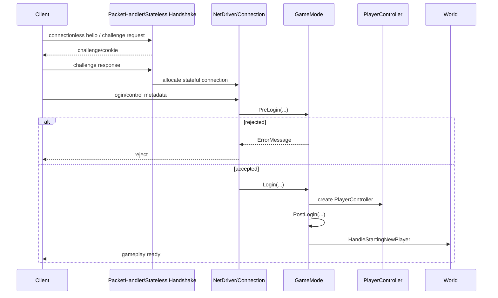
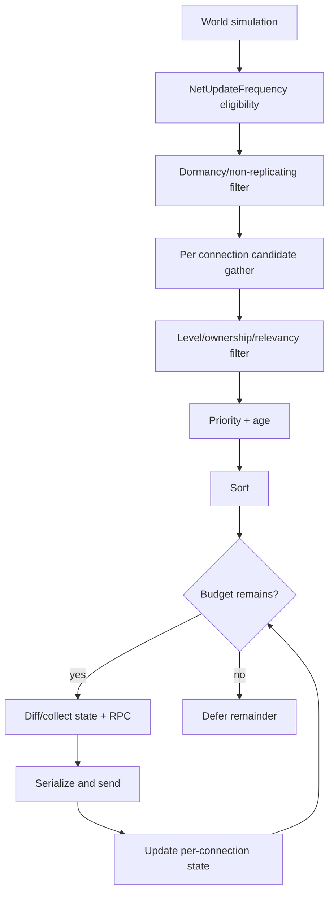

# Diagram sources

## 连接建立时序图

```mermaid
sequenceDiagram
    participant C as Client
    participant PH as PacketHandler/Stateless Handshake
    participant ND as NetDriver/Connection
    participant GM as GameMode
    participant PC as PlayerController
    participant W as World
    C->>PH: connectionless hello / challenge request
    PH-->>C: challenge/cookie
    C->>PH: challenge response
    PH->>ND: allocate stateful connection
    C->>ND: login/control metadata
    ND->>GM: PreLogin(...)
    alt rejected
      GM-->>ND: ErrorMessage
      ND-->>C: reject
    else accepted
      ND->>GM: Login(...)
      GM->>PC: create PlayerController
      GM->>GM: PostLogin(...)
      GM->>W: HandleStartingNewPlayer
      ND-->>C: gameplay ready
    end
```

## 服务器复制循环

```mermaid
flowchart TD
    A[World simulation] --> B[NetUpdateFrequency eligibility]
    B --> C[Dormancy/non-replicating filter]
    C --> D[Per connection candidate gather]
    D --> E[Level/ownership/relevancy filter]
    E --> F[Priority + age]
    F --> G[Sort]
    G --> H{Budget remains?}
    H -- yes --> I[Diff/collect state + RPC]
    I --> J[Serialize and send]
    J --> K[Update per-connection state]
    K --> H
    H -- no --> L[Defer remainder]
```
