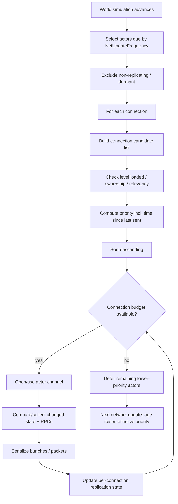

# Unreal Engine Dedicated Server 架构深度调研
**交付日期：2026-08-29**

## 调研基线与可达性声明

- **目标基线：UE 5.6 系列语义**。本次指定源码镜像 `Go1c/UnrealEngine` 在当前网页检索环境中无法可靠打开或代码搜索，直接打开返回不可用结果；因此本报告**没有把任何“记忆中的 UE 源码路径/行号”冒充为源码级 Verified**。
- **官方文档可达**：Epic Developer Community 官方文档/API 可访问。当前站点默认展示 5.8 文档；本报告对跨 5.6–5.8 未见官方明确变更的基础网络机制，以“官方文档级 Verified”使用；对 Iris、ReplicationGraph、WebSocketNetworking、Network Prediction 等成熟度敏感项，明确标注当前官方页面成熟度，并避免将 5.8 新状态倒灌为 5.6 的事实。
- **官方样例工程源码**：未从指定镜像核到；未把 Lyra/ ShooterGame 的内部实现当成已核实证据。
- **源码级结论状态**：由于 R1 指定仓库不可达，所有“本应通过源码精确定位”的结论统一降为 `Reported` 或“官方 API/文档 Verified”，不提供伪造 permalink。

## 置信度图例

- `Verified`：亲自读到 Epic 官方文档/API，或 Web 标准原文。本报告中**不含**经指定镜像源码行号验证的 `Verified`。
- `Reported`：机制在 Epic 旧版文档、API 描述或多处公开实践中一致，但当前未通过指定源码镜像逐行核实。
- `Estimated`：架构推断、成本模型、对目标环境的迁移判断。会写明推断依据。

## 执行摘要

1. **UE DS 的本质不是“一个特殊服务器框架”，而是一套把同一 Gameplay 对象模型在 Server/Client/Listen/Standalone 四种 NetMode 下复用的网络执行环境。** Dedicated Server 只是无本地玩家的 authority 进程；真正的复杂度集中在 `UNetDriver → UNetConnection → Channel/Bunch → Actor replication` 的状态复制路径与连接级预算调度。[S01][S02][S03]
2. **UE 的传统复制哲学是“状态为主、事件为辅”**：属性复制负责最终状态收敛，RPC 负责时序敏感事件。官方明确说明属性更新不保证中间值，也不与 RPC 建立全局总序；可靠 RPC 仅在有限作用域内有顺序保证。[S07][S08]
3. **传统 Actor replication 的结构性成本是对象数 × 连接数。** UE 的 relevancy、dormancy、NetUpdateFrequency、priority 都是在减少“要不要考虑、什么时候考虑、预算满了先发谁”；ReplicationGraph 则进一步把“每连接重新算候选集”改成持久化、共享的候选列表。[S05][S09][S10][S12]
4. **复制必须被理解为“带字节预算的调度器”，不是“状态变化就立刻发”。** UE 明确按更新频率筛选、按连接相关性过滤、按优先级排序，然后在连接饱和时推迟低优先级 Actor；玩家感知到的是远端对象更新频率下降、延迟增加，而不是服务器阻塞等它们全部发完。[S05][S09]
5. **Iris 本质上是 Epic 对旧模型结构性成本的一次承认。** 官方设计目标包括：维护独立量化状态副本、把昂贵工作从“每对象×每连接重复”变成可共享工作、分离 filtering/prioritization、降低 gameplay 与 replication 耦合、为并行化创造条件。[S14][S15][S16]
6. **UE 的网络可靠性/顺序语义不是一个“全连接可靠消息队列”。** 它在 Actor/RPC/属性/通道等语义层提供不同保证；可靠 RPC 会造成后续可靠通信受阻，官方反复要求慎用。把“可靠”当默认业务消息类型会形成 HOL 与队列膨胀。[S07][S08]
7. **角色移动之所以成为 UE 最成熟的预测/和解特例，是因为它把输入、可重放状态、SavedMoves、服务器重演、修正、客户端 replay 全部局部封装在同一个组件里。** 通用 Actor 并没有这种可重放状态机契约，因此无法自动拥有同等级别的预测。[S19][S20]
8. **UE 主体并不是确定性固定步长服务器。** 但 Network Prediction 插件明确提供 `Fixed` ticking policy，并写明 fixed mode 支持 group rollback；这说明一旦系统要求通用回滚，就必须显式建立统一时间离散化。[S21][S22][S23]
9. **UE 的世界流送与网络相关性是两套不同概念。** World Partition 解决“服务器/客户端是否加载空间单元”，Actor relevancy 解决“已存在网络对象是否该发给连接”；把“没加载”简化成“不相关”会抹掉不可用/未驻留语义，这一点对体素 Chunk 尤其危险。[S35][S36]
10. **UE 对生产在线服务边界非常克制。** 连接、复制、Travel、Beacon、Replay、Profiler 是引擎能力；匹配、账号、持久化、编排、自动扩缩容、版本共存、会话排空、断线恢复令牌等不是 DS 的完整内置方案。生产项目必须在引擎之外再加一层 session/orchestration/service plane。

### 最重要的五条可借鉴原则

1. **复制前先做候选集缩减，再做优先级与字节预算调度。**
2. **把“最新状态”与“必须逐次执行的事件”分成不同语义通道。**
3. **连接级流控、对象级相关性、对象生命周期三者必须解耦。**
4. **预测系统必须显式定义输入、步长、可重放状态、确认点与回滚边界。**
5. **大规模复制要把可共享工作从“每连接重复计算”中抽出来。**

## Known gaps（开头版）

- 指定 `Go1c/UnrealEngine` 镜像不可达，无法给出符合 R1 的源码 commit+line permalink。
- 未核到 UE 5.6 指定镜像中 `ServerReplicateActors`、`UActorChannel`、`FOutBunch`、连接控制消息枚举的精确行号。
- Push Model 在官方公开文档中的完整机制说明不足；本报告只做保守结论，不把内部 CVar/宏名写成 Verified。
- 未找到可信的一手公开资料证明“某 UE 体素项目以 Actor replication 原生同步每秒数万 voxel mutation”；因此 I 章对此明确写为“未覆盖到一手实例”。
- 版本共存、会话排空、重连恢复等主要是 UE 外服务层问题，官方 DS 文档没有完整生产参考架构；相关生产形态只在 M 章作为通用架构判断提出。


# A. 进程形态与构建模型

**结论先行**
1. UE 的 Dedicated Server 是同一引擎运行时的 `NM_DedicatedServer` 形态，不是另一套 gameplay runtime。[S03]
2. 最大收益是 Server/Client 共享 Gameplay Framework；最大代价是 authority、ownership、net role 条件渗入业务对象模型。[S04]
3. DS 构建裁剪能移除图形/本地玩家需求，但“服务器能否安全运行”仍取决于业务代码是否错误依赖渲染、音频、客户端资产和本地 PlayerController。

## A.1 四种运行形态

**[Verified]** `ENetMode` 明确包含 `NM_Standalone / NM_DedicatedServer / NM_ListenServer / NM_Client`。Dedicated Server 的定义是“server with no local players”；Listen Server 同时是 server 和本地玩家宿主。[S03]

**设计意图。** 同一 gameplay framework 不因部署形态彻底分叉。`GameMode`、`GameState`、`PlayerController`、`Pawn`、Actor replication 等复用相同对象关系，差异主要通过 NetMode、LocalRole/RemoteRole、ownership 判定进入。

**代价。** 共享对象模型会促使 gameplay 代码不断问：
- 当前实例是不是 authority？
- 当前 Actor 是 AutonomousProxy 还是 SimulatedProxy？
- 当前对象有没有 owning connection？
- 当前路径是否运行在 Dedicated Server，不能访问本地 UI/渲染/输入？

这不是“坏代码习惯”本身，而是“一套对象代码运行在多角色进程”必然形成的条件分支压力。

## A.2 权威判定到底是什么

**[Verified]** Epic 的角色文档把 replicated Actor 的 server 端描述为 `ROLE_Authority`，客户端副本则通常为 `ROLE_AutonomousProxy` 或 `ROLE_SimulatedProxy`；`AActor::GetLocalRole()` 用于判断本实例上的网络角色。[S04]

**[Estimated]** 对目标环境，不应复制 UE 的“每个 gameplay 对象都带网络角色”的设计。目标已经有 `Authority / Replica` 两套独立 world storage，更适合把 authority 作为**世界实例级不变量**，只有局部预测对象再携带 prediction ownership。这样能避免把 UE 的 Actor role 包袱扩散进 ECS 每个组件。

## A.3 一套代码三/四形态的收益与坑

**收益**
- gameplay 规则只维护一套；
- DS 与 listen server 共享绝大多数行为；
- 网络测试可以从 PIE/多进程本地场景逐步过渡到真正 DS。

**结构性坑**
1. **客户端专属依赖泄漏到 server 路径。** 例如构造时无条件访问渲染对象、viewport、本地 player、输入设备。
2. **“本地测试可用”不等于 DS 可用。** Listen Server 有本地 PlayerController、本地 UI 和渲染上下文； Dedicated Server 没有。
3. **authority 分支与 presentation 分支混杂。** 结果是 Server-only bug 直到打包才暴露。
4. **Server-only 资源裁剪与 runtime 假设冲突。** 某 gameplay 类可能被 server 逻辑引用，但资产或组件被错误标为客户端专属。

## A.4 单进程多世界/多房间

**[Reported]** UE 运行时内部存在多个 `UWorld` 的概念（编辑器、PIE、travel 过渡等），但标准 Dedicated Server gameplay 架构、GameMode 生命周期、NetDriver 绑定与运维工具链主要围绕“一个游戏进程承载一个当前会话世界”组织。官方 Dedicated Server 指南也按单实例 server 启动与地图加载来描述。[S02]

**判定。** 不能把“引擎技术上能出现多个 World”推导为“UE 原生支持一个 DS 进程内多房间高密度托管”。生产上更常见的架构是进程/容器级隔离会话，尤其当崩溃域、版本、地图资产和资源预算都需要独立控制时。

## A.5 对目标环境的迁移意义

- **可直接借鉴**：把进程形态、世界 authority 角色、客户端副本角色明确建模。
- **需改造**：不要把 `HasAuthority()` 风格判断扩散到 ECS 组件；应以 runtime/world role 作为上层不变量。
- **不适用**：UE 的 UObject/Actor 同构运行时和反射裁剪策略不能直接迁移到 Rust host + C# gameplay ABI。


# B. 引擎循环与时间模型

**结论先行**
1. UE 通用 gameplay tick 并不以确定性固定步长为网络架构前提。
2. 复制频率与 simulation tick 分离：Actor 可通过 `NetUpdateFrequency` 降低网络更新频率。[S04][S41]
3. 一旦进入通用 rollback/prediction，Epic 自己又引入 fixed ticking policy；这说明“可回滚预测”与“任意可变 delta”天然冲突。[S21][S22]

## B.1 Tick 与网络更新是两层节拍

**[Verified]** 官方 Actor role 文档明确指出服务器不会每次 update 都复制所有 Actor，而是按 `AActor::NetUpdateFrequency` 控制复制频率。[S04] Performance and Bandwidth Tips 进一步把“降低 NetUpdateFrequency”列为最重要的复制优化之一。[S41]

因此：
- Simulation Tick 决定世界推进；
- Replication scheduling 决定“何时考虑把某对象的网络状态发送给某连接”；
- Connection bandwidth 决定“这一轮即使考虑了，能不能塞进预算”。

这三者不能混成一个“server tick rate”。

## B.2 可变 delta 的架构后果

**[Estimated，依据：S19/S21]**
可变 delta 对以下问题不友好：
- 跨平台精确重放；
- “同输入串 → 同状态”的 hash 校验；
- rollback 时按帧寻址；
- 命中判定回溯窗口的整数帧表达；
- Rust/C# 两套实现差分测试。

UE 传统 Character Movement 并没有试图让整个 Actor 世界确定性重放，而是让移动组件在它自己的数据结构中记录输入/结果并局部 replay。[S19]

## B.3 Epic 在哪里补回了固定步长

**[Verified]** `ENetworkPredictionTickingPolicy` 明确有 `Independent` 与 `Fixed`。官方备注：`Fixed` 模式“Everyone ticks at same fixed rate. Supports group rollback.”[S21]

**[Verified]** `FNetworkPredictionSettings` 暴露 `FixedTickFrameRate`、fixed tick smoothing、输入冗余发送等配置。[S22]

这形成一个非常重要的反证：
> UE 主体世界可以接受可变帧，但只要系统目标升级到“多个对象作为组一起 rollback”，固定离散时间就成为明确设计元素。

## B.4 服务器 tick 与复制频率的解耦

传统复制可抽象为：
`Simulation frames` → `Actor eligibility by NetUpdateFrequency` → `Relevancy/Dormancy` → `Priority` → `Connection budget`.

因此玩家可能在 60Hz simulation 上看到 10Hz 或更低的远端状态更新，再由客户端插值/外推掩盖。

## B.5 对目标环境的结论

**[Estimated]**
目标环境已经冻结固定步长、唯一提交点、提交前不可见、提交后幂等。这比 UE 传统世界 Tick 更适合确定性、WAL、状态哈希。

应借鉴 UE 的是：
- simulation 与 replication 调度节拍解耦；
- 网络不应强迫 gameplay 每帧都序列化；
- 连接拥塞不能反向改变权威 simulation 步长。

不应借鉴的是：
- 让网络预测系统依赖 wall-clock delta 的自由变化；
- 把网络状态的“可见时刻”散落到 Actor 每次属性写入，而不是集中到 commit point。


# C. 传输栈与线协议

**结论先行**
1. UE 把 gameplay replication 放在 `UNetDriver / UNetConnection / Channel` 之上的消息与状态层；PacketHandler 是包级可插拔处理链。[S24][S25]
2. 无状态握手专门用于“在真正分配连接状态前先验证对端”，其核心价值是抗资源耗尽，而非完成账号认证。[S26]
3. 浏览器是对 UE 原生 UDP 假设的根本挑战：UE 有 Experimental WebSocket NetDriver，但这不是“浏览器版原生 UE 网络栈已经等价成熟”。[S28][S29]

## C.1 分层

**[Reported]**
- `UNetDriver`：网络驱动/连接集合/世界网络入口。
- `UNetConnection`：单个远端连接状态、包序列、速率、通道集合。
- `Channel`：在连接内对不同逻辑数据流做组织，典型包括 control 与 actor channel。
- `Bunch`：通道上的序列化数据单元，可携带 RPC、属性数据等。

由于指定源码镜像不可达，本报告不声称已逐行核验这些类在 UE 5.6 的私有实现。

## C.2 PacketHandler 链

**[Verified]** 官方 API 把 `PacketHandler` 描述为维护 HandlerComponent 数组，并把入站/出站 packet 依次交给组件处理；`HandlerComponent` 可追加或修改包。[S24][S25]

官方列出的派生组件包括：
- encryption；
- Oodle network；
- stateless connect；
- reliability handler。[S25]

这说明“握手/加密/压缩/包级附加协议”是可插拔链条，不应塞进 gameplay serializer。

## C.3 无状态握手

**[Verified]** `StatelessConnectHandlerComponent` 官方描述就是“implementing a stateless (non-memory-consuming) connection handshake”，并包含 server-side secret/cookie 相关字段。[S26]

它解决的坑：
- UDP 上收到一个伪造源地址包时，如果立即创建完整 `UNetConnection`，攻击者可以用廉价流量换取服务器昂贵状态。
- cookie/challenge 让客户端先证明“能收到服务器对该地址的返回”，服务器再进入有状态连接。

它**不解决**：
- 账号身份；
- 游戏权限；
- 作弊客户端；
- application-level replay；
- 已建立连接后的资源滥用。

## C.4 为什么“可靠性建在语义/bunch/channel 层”有价值

**[Reported + Verified order semantics by S07]**
UE 的关键收益不是简单“UDP 上自己做 TCP”，而是允许不同语义具有不同可靠/顺序要求：
- 最新状态：旧值丢了无所谓，后来的新值覆盖；
- 关键 RPC：需要重传与顺序；
- 不可靠事件：允许丢；
- 不同 Actor/对象之间：通常没有全局总序。

这比“整个连接只有一条可靠有序字节流”更适合实时游戏，因为一个低价值丢包不应阻塞所有后续状态。

## C.5 可靠 RPC 的 HOL

**[Verified]** 官方文档明确：Reliable RPC 会持续重发直到确认，并且“subsequent RPC executions are suspended until this RPC is acknowledged”；官方要求 sparingly 使用。[S08]

注意：这并不意味着“UE 的所有网络数据都被一个可靠 RPC 队列全局阻塞”。官方执行顺序页同时指出 Actor 间 RPC 没有全局顺序。[S07]

## C.6 浏览器传输：哪些 UE 分层还能保留

### WebSocket
**[Verified]** RFC 6455 的 WebSocket 建在 TCP 上。[S42]
因此：
- 自带可靠、有序；
- 单连接存在 TCP 级 head-of-line；
- 若在其上再复制 UE 的 UDP ack/retransmit 机制，会形成重复可靠性和错误的拥塞语义。

### WebTransport
**[Verified]** MDN 当前说明 WebTransport 基于 HTTP/3，提供可靠 streams 和 unreliable datagrams；datagram 不保证到达或顺序。[S43][S44]
这与 UE “可靠/不可靠多语义”更接近，但浏览器要求 secure context，且兼容性需按目标浏览器矩阵评估。

### WebRTC DataChannel
**[Verified]** `RTCDataChannel` 可配置 ordered，并可通过 max retransmits / lifetime 控制部分可靠性。[S45]
但 client-server 用法会带入 ICE/STUN/TURN/peer connection 复杂度。

## C.7 UE 自带 WebSocket 支持意味着什么

**[Verified]** Epic 有 `UWebSocketNetDriver : UNetDriver`，但插件路径明确位于 `Engine/Plugins/Experimental/WebSocketNetworking`。[S28][S29]

这证明：
- UE 的上层 NetDriver 抽象**确实允许**非 UDP backend；
- 但 WebSocket 路径官方仍标 Experimental，不能据此推导“所有 UDP PacketHandler、拥塞、可靠 bunch 语义在浏览器中完全无缝”。

## C.8 对目标环境的迁移判定

**可直接借鉴**
- Transport / Connection / Message semantics / Replication scheduler 分层；
- handshake 前的无状态/低状态资源保护思想；
- gameplay 语义不要绑死 socket API。

**需改造**
- 可靠性必须由 transport capability negotiation 决定：WebSocket 下不要重复做 UDP-style retransmission；WebTransport datagram 下才需要应用层可靠语义。
- 统一抽象应是“capability-based transport”：`ReliableOrderedStream`、`UnreliableDatagram`、可选 `PartiallyReliableMessage`，而不是“UDP socket”。

**不适用**
- 任何假设客户端能直接控制 raw UDP socket 的设计。


# D. 连接与会话生命周期

**结论先行**
1. UE 把“连接建立”和“进入 gameplay 世界”分成多个阶段：底层握手之后才进入 GameMode 的准入链。[S26][S30][S31]
2. `PreLogin / Login / PostLogin / Logout` 是项目插入认证、版本、资格判断的主要 gameplay 钩子。[S30][S31]
3. UE 有 seamless travel，但没有提供一个通用的“断线后恢复原会话状态”的完整协议。

## D.1 一次连接建立的消息序列（架构级）

由于指定源码镜像不可达，下图不声称是 UE5.6 控制消息枚举逐字节顺序；它是依据官方 GameMode/Stateless handshake 文档整理的**架构级序列**：

```mermaid
sequenceDiagram
    participant C as Client
    participant PH as PacketHandler/Stateless Handshake
    participant ND as NetDriver/Connection
    participant GM as GameMode
    participant PC as PlayerController
    participant W as World

    C->>PH: connectionless hello / challenge request
    PH-->>C: challenge/cookie
    C->>PH: challenge response
    PH->>ND: handshake accepted; allocate stateful connection
    C->>ND: control/login data + URL/options + version/content metadata
    ND->>GM: PreLogin(...)
    alt rejected
        GM-->>ND: ErrorMessage
        ND-->>C: reject / close
    else accepted
        ND->>GM: Login(...)
        GM->>PC: create PlayerController
        GM->>GM: PostLogin(NewPlayer)
        GM->>W: HandleStartingNewPlayer / spawn pawn
        ND-->>C: welcome / gameplay channel becomes usable
    end
```

**[Verified]** `PreLogin` 可以通过 `ErrorMessage` 拒绝玩家；`PostLogin` 是成功登录后，第一次安全调用 PlayerController replicated functions 的位置。[S30][S31]

## D.2 Release/内容版本校验应该放在哪

UE 没有强迫你使用某个“产品 Release 精确匹配”抽象。**[Estimated]**
最佳挂点是：
1. 低成本 transport/protocol version 在有状态连接前或 control handshake 早期拒绝；
2. 账号/entitlement/content release 在 `PreLogin` 或其异步变体完成；
3. 进入世界后不再尝试“兼容运行”。

目标环境明确“一进程只装一个 Release、客户端与服务端精确匹配”，因此比 UE 常见 Build/Network version 判定更严格，应把 ReleaseId 作为握手硬门槛。

## D.3 PlayerController / PlayerState 与连接所有权

**[Verified]** UE ownership 机制影响 client RPC 路由、owner-only replication、autonomous proxy 等。[S04][S06]

架构意义：网络连接需要一个“会话所有者对象”来承载：
- 权限；
- 输入来源；
- 私有复制；
- 断开清理；
- 进入/退出世界。

目标环境不需要照抄 PlayerController，但需要一个明确的 `Session/Peer` 聚合根。

## D.4 Online Beacon

**[Verified]** Online Beacon 用自己的 `UNetDriver`，允许客户端在不进入普通 game connection 的情况下与服务器用 RPC 交互；官方举例包括 QoS、slot reservation、玩家列表、比赛信息。[S34]

这是“pre-session/control plane”和“gameplay data plane”分离的好例子。

## D.5 Seamless Travel

**[Verified]** `UWorld::SeamlessTravel` 的目标是过渡地图期间不破坏网络连接，并允许通过 `GetSeamlessTravelActorList` 选择跨图保留对象。[S32][S33]

它复杂的根源不是“加载地图 API 很难”，而是：
- 旧 world 与新 world 的对象身份跨越；
- 哪些对象保留、哪些重建；
- GameMode 重新建立而连接仍存活；
- 玩家在两阶段过渡期间仍可能加入/离开；
- 引用、ownership、replication state 要重新挂接。

## D.6 UE 有没有完整断线重连

**[Reported]** UE 有网络失败回调、travel、PlayerState 生命周期、OnlineSubsystem 等基础设施，但**没有一个通用内置“resume token + authoritative session snapshot + reconnect baseline + input acknowledgement continuity”协议**。

这说明 UE 的核心设计假设更接近：
> 连接是一次 gameplay session 的主要载体；连接断开后，项目自己决定是当作离开、短期保留 PlayerState，还是走业务层重连。

对目标环境，这一缺口必须补成一等公民，因为 WAL/状态哈希/Release 精确匹配已经为会话恢复提供了更强基础。


# E. 复制模型（最高优先级）

**结论先行**
1. UE 传统复制是“Server authoritative state + per-connection delivery”，Actor 是复制生命周期和 RPC 路由的中心。
2. 属性复制是最终状态收敛，不是事件日志；RPC 才承载时序敏感语义。[S07][S08]
3. 旧系统最贵的不是“序列化几个字段”，而是不断发现谁变了、对谁相关、每个连接之前看过什么；Iris 正面重构了这些成本。[S14][S15]

## E.1 Authority / Autonomous / Simulated 三态

**[Verified]** `ROLE_Authority / ROLE_AutonomousProxy / ROLE_SimulatedProxy` 是 UE 网络角色核心。[S04]

三态解决三个不同问题：
- Authority：谁拥有真状态；
- AutonomousProxy：谁可以基于本地输入先预测；
- SimulatedProxy：谁只是远端副本，需要插值/外推。

**本质**不是 enum 名，而是“远端副本并不全等价”：本地玩家控制的副本拥有输入知识，所以可采用比旁观副本更激进的预测策略。

## E.2 Actor 生命周期与网络生命周期不是同一件事

Actor 是否存在于 server world、是否有打开的 actor channel、是否当前 relevant、是否 dormant、是否 tear-off，是不同维度。

**架构教训**
- “暂时不发” ≠ “对象死亡”；
- “当前不相关” ≠ “客户端必须删掉全部身份”；
- “不再由服务器复制” ≠ “客户端对象立刻不存在”。

这一区分直接对应目标环境的 Chunk/Entity：
- Unloaded
- Loading
- Present-but-out-of-interest
- Destroyed
- Detached from authoritative replication
不能压成一个 bool。

## E.3 属性复制条件

**[Verified]** 官方 5.8 文档列出：
`COND_None`,
`COND_InitialOnly`,
`COND_OwnerOnly`,
`COND_SkipOwner`,
`COND_SimulatedOnly`,
`COND_AutonomousOnly`,
`COND_SimulatedOrPhysics`,
`COND_InitialOrOwner`,
`COND_Custom`,
`COND_ReplayOrOwner`,
`COND_ReplayOnly`,
`COND_SimulatedOnlyNoReplay`,
`COND_SimulatedOrPhysicsNoReplay`,
`COND_SkipReplay`,
`COND_Dynamic`,
`COND_Never`。[S06]

这些条件体现的本质是**同一个权威字段对不同观察者有不同可见性策略**。

对目标环境，Schema 生成并不会失去这种表达力；应把它变成 contract 层的 visibility policy，而不是 C++ 宏。

## E.4 Poll-and-diff 的成本模型

传统模型可近似写成：

`CPU ≈ Σ_connection Σ_candidate_object (eligibility + relevancy + shadow-compare + serialize-changed)`

当对象多、连接多时，即使变化字节很少，**发现“没有变化”本身也会贵**。

**[Estimated]**
若：
- N = replicated objects
- C = connections
- p = 经空间/休眠过滤后被考虑的比例
- f = 每对象平均被检查字段数
则 shadow comparison 的量级可近似：
`O(N × C × p × f)`

ReplicationGraph 主要降低 `N × C × p` 中的候选发现成本；
Push/dirty marking 主要降低 `f` 与“无变化对象仍被 poll”的成本；
Iris 进一步共享 quantization / filtering / prioritization 等工作。

## E.5 Push Model：它解决什么

**[Reported]** UE 的 Push Model 方向是 gameplay 侧显式标记 dirty，避免反复 polling 未变化属性。当前指定源码镜像不可达，且官方公开文档对 5.6 Push Model 全链条解释不足，因此本报告不列未经核实的宏/CVar 名。

它的代价是经典的“从自动侦测变成正确性契约”：
- 改字段却忘记 mark dirty → 静默不同步；
- 需要统一写入口或生成代码；
- 动态容器/子对象更复杂。

这与目标环境非常相关：目标的 ECS 若已经有唯一提交点与变更集，则天然拥有比 UE Push Model 更可靠的 dirty source，不需要让 gameplay 手工记脏。

## E.6 Fast Array：显式身份 + 变更键

**[Verified]** `FFastArraySerializer` 维护 replication ID/key；Fast TArray 需要 `MarkItemDirty`、删除时 `MarkArrayDirty`，并且官方明确警告 client/server 数组顺序并不总能保证一致。[S17][S18]

**架构意义**
- 容器同步不能只按数组下标做 diff；
- 元素需要稳定网络身份；
- 增删改是独立语义；
- “顺序”必须显式决定是否属于协议状态。

对 ECS 目标，这几乎直接对应：
`EntityId + ComponentVersion + change-set`，而不是 Actor property reflection。

## E.7 属性复制的语义边界

**[Verified]** 官方执行顺序文档明确：
- Actor property updates 是 unreliable；
- 同一更新内可作为一块发送；
- 不同 RepNotify 的执行顺序不确定；
- RPC 与 property update 有特定局部排列，但网络丢包可让观察顺序发生变化。[S07]

因此属性复制表达的是：
> “让客户端最终知道现在是什么”，不是“告诉客户端每次发生了什么”。

### 不能用纯属性复制表达的例子
1. **扣血事件日志**：100→90→80，如果客户端只收到 80，不知道中间发生了两次伤害。
2. **一次性音效/特效触发**：状态没有持久值，必须事件化。
3. **交易提交序列**：必须逐条、幂等、可审计，不可 latest-value-wins。
4. **体素编辑操作日志**：若要做确认、撤销、哈希链，不能只发“chunk 最终长这样”。

### 适合属性复制的例子
- 当前姿态；
- 当前装备槽；
- 当前生命值；
- 当前门是否打开；
前提是中间值不重要。

## E.8 RPC 方向与可靠性

**[Verified]** UE RPC 有 Server / Client / NetMulticast 方向，可靠性为 Reliable/Unreliable；默认并非所有 RPC 都可靠。[S08]

**可靠 RPC 泛滥的后果**
- 重传；
- 后续可靠调用等待；
- 带宽被历史事件占用；
- 实时状态延迟扩大。

## E.9 顺序保证清单

| 关系 | 保证 | 依据 |
|---|---|---|
| 同一 Actor 上多个 Reliable RPC | 保序 | [Verified][S07] |
| 不同 Actor 之间 RPC | 无全局顺序 | [Verified][S07] |
| Reliable 与 Unreliable RPC | 无一般顺序保证 | [Verified][S07] |
| 同一 Actor + Subobject RPC | 官方文档描述可保持调用顺序 | [Verified][S07] |
| 不同 replicated property 的 OnRep | 无确定顺序 | [Verified][S07] |
| Property 中间状态 | 不保证送达 | [Verified][S07] |
| RPC 与 property | 只有文档描述的局部序列化规则，不能当业务事务总序 | [Verified][S07] |
| 不可靠 RPC | 可丢 | [Verified][S08] |
| Reliable RPC | 重发直到确认，代价是阻塞后续相关通信 | [Verified][S08] |

**结论**：UE 没有给 gameplay 一个“所有网络动作的单一全序日志”。

## E.10 Iris 改了什么

**[Verified]** Iris 官方设计说明：
- Replication System 维护 replicated state 的副本；
- 以 quantized form 保存；
- 追踪 per-connection state；
- Filtering 与 Prioritization 是独立组件；
- Net Serializers 与 Data Streams 解耦；
- Bridge 把 gameplay instance 与 replication system 分开。[S14][S15]

Iris 官方还明确把目标描述为：
- 移除限制扩展性的 antipatterns；
- 通过 gameplay/thread data 分离提高并行能力；
- 多对象、多连接共享工作。[S14]

### Iris 实际承认的旧系统问题
1. gameplay object 与 replication 内部耦合过深；
2. 相同量化/序列化工作重复做；
3. per-connection 工作难共享；
4. filtering/prioritization 以前混在更大的 Actor replication 流程里；
5. 并行化受 UObject/game thread 数据约束。

### 成熟度
**[Verified]** 当前 Epic 文档仍对 Iris 页面显示“Experimental feature, use caution when shipping”。[S14][S15]
因此不能把“方向先进”误写成“在所有生产项目里已默认替代 legacy replication”。

## E.11 对目标环境：Schema 封闭会丢表达力吗

**[Estimated]** 不会丢掉 UE 复制最核心的表达力，反而更适合目标：
- Replicated property → schema field/state fragment；
- replication condition → visibility/filter policy；
- RPC → typed command/event；
- Fast Array → stable-id delta collection；
- Iris quantized state → canonical network snapshot representation。

会丢的是 UE 的**运行时反射便利性**：任意 UObject 属性通过宏就能加入复制。这是开发体验，不是网络架构本质。

目标环境还多了 UE 不保证的能力：
- canonical bytes；
- state hash；
- Release exact match；
- commit boundary；
这些对确定性与恢复更重要。

## E.12 一句话总结 UE 复制哲学

> **权威服务器维持真状态；持久事实优先以状态复制收敛，时序敏感动作以 RPC 传递；在每个连接的相关性与带宽预算下，只发送“此刻最值得发送的那部分变化”。**


# F. 兴趣管理与带宽调度（最高优先级）

**结论先行**
1. Relevancy、Dormancy、Priority 解决三个不同问题：该不该看、是否值得继续扫描、预算满时先发谁。
2. UE 传统复制循环的核心是 connection-local scheduling：候选 → 过滤 → 排序 → 发送到预算耗尽。[S05][S09]
3. ReplicationGraph 的革命点不是“有个空间树”，而是把候选集构建变成可跨帧、跨连接复用的持久结构。[S12]

## F.1 一次服务器复制循环



该图的高价值在于：**“变化检测”只是调度循环中间的一步，绝不是复制系统全部。**

## F.2 Relevancy

**[Verified]** 官方详细复制流程描述：对某连接，会检查 level loaded、调用 `AActor::IsNetRelevantFor`，然后对 relevant actor 排优先级。[S05]

传统 relevancy 常见维度：
- always relevant；
- owner relevant；
- viewer/pawn；
- distance / cull；
- 自定义 `IsNetRelevantFor`。[S09 亦描述 viewer/distance 对 priority 的影响]

### 相关性不是安全边界的全部
“不给某连接复制”可以减少信息暴露，但：
- server 仍必须校验所有 client command；
- owner-only 不是加密；
- 任何被客户端收到的数据都视为可被逆向读取。

## F.3 Priority 与饥饿避免

**[Verified]** `AActor::GetNetPriority` 会考虑 `NetPriority` 与“自上次复制以来的时间”；官方明确说 time factor 用于避免 starvation。[S09]

这是一条非常可迁移的调度原则：
> 低优先级对象不能永远饿死；优先级要随等待时间增长。

## F.4 Connection budget：为什么复制是调度问题

**[Verified]** 官方 Actor Priority 文档开篇直接以“connection bandwidth is limited, connection can become saturated”为前提，并说明饱和时用 priority 分配公平带宽。[S09]

**因此 UE 的复制不变量不是“每个变化最终在本帧发出”，而是：**
1. 每个连接有有限发送能力；
2. 发送候选多于能力时必须排序；
3. 未发送对象延后；
4. 延后会通过 age 提升优先级；
5. 客户端靠预测/插值承受更新稀疏。

### 玩家眼中的超预算
- 远处/低价值对象“卡”“慢半拍”；
- 位置更新变稀；
- 一些状态要到后续网络更新才收敛；
- 关键角色若 priority 高，仍保持较好频率。

这比“服务器 tick 降速直到所有网络消息发完”更健康。

## F.5 Dormancy

**[Verified]** Dormant actor 不进入 connection gathered actors list，从而省掉后续考虑与属性比较；变更前必须 `FlushNetDormancy`、`ForceNetUpdate` 或唤醒。[S10]

经典失败模式：
> gameplay 改了 dormant Actor 的 replicated property，却忘了先唤醒/flush → 服务器状态正确，客户端永久停留旧值。

**代价**：Dormancy 把性能优化转换成 gameplay 正确性责任。

目标环境如果使用 commit-generated change set，可以通过系统自动唤醒 interest item，避免手工 flush 风格 bug。

## F.6 ReplicationGraph

**[Verified]** Epic 官方说明它针对大量 Actor/连接的 CPU 瓶颈；节点是 persistent objects，能跨帧存数据并在连接之间共享，从而降低每 Actor、每 client 的重复工作。[S12]

官方用 Fortnite 100 players、约 50,000 replicated Actors 作为动机示例，但这是产品背景，不应外推成任何项目都能达到的容量数字。[S12]

### 它把成本挪到了哪里
- 节点设计；
- actor 分类；
- 空间网格；
- always relevant / per-connection lists；
- 项目特定规则；
- 失效与更新策略。

也就是说：
> 自动暴力扫描的 CPU 成本，换成了工程团队显式维护 interest data structure 的复杂度。

这是一个正确的交换，但不是免费午餐。

## F.7 Iris 的 filtering/prioritization 分离

**[Verified]** Iris 将 Filtering 与 Prioritization 分成一级组件。[S15]
这比 legacy Actor flow 更接近通用网络架构：
- Filtering：资格（eligible?）
- Prioritization：价值（how valuable now?）
- Serialization：成本（how many bytes?）
- Data Stream：运输（which stream/channel?）

目标环境应直接按这四层建模。

## F.8 Relevancy vs AOI 进入/离开生命周期事件

**不是同一件事。**

UE relevancy 更像：
> “在这次 connection replication evaluation 中，这个 Actor 是否应被考虑/保持可见？”

AOI 生命周期事件则是：
> “实体跨越兴趣边界时，产生离散 Enter/Leave，并驱动本地实体创建/销毁或激活/休眠。”

### 差异一：连续判定 vs 离散状态机
UE 可以每次重新判定 relevant；AOI event 要维护前一状态，才能知道“刚进入”。

### 差异二：网络不可见 ≠ 实体生命周期结束
如果把 LeaveAOI 直接绑定 DestroyReplica：
- 边界抖动会反复 destroy/create；
- 大型 entity 初始化成本高；
- 缓存、预测、引用关系丢失；
- 重入时需要 full snapshot。

### 差异三：需要 hysteresis
**[Estimated]** 成熟 AOI 通常要：
- enter radius < leave radius 的滞回；
- 最小驻留时间；
- preload band；
- 对关键关系（owner/party/combat target）做非空间 pin。

UE 的 relevancy + dormancy + priority 经验恰好说明：**兴趣管理至少需要“资格、活跃度、发送价值”三个维度，而不是一个 Enter/Leave bool。**

## F.9 对体素 Chunk 的直接启示

Chunk interest 不应表示成“每个 voxel 是否 relevant”。
应该：
1. Chunk 级进入候选；
2. Chunk 内 delta 聚合；
3. 连接级 budget 排队；
4. 高优先级近场 chunk 先发；
5. 超预算 chunk 明确保持 `Loading/Partial/Outdated` 状态；
6. 绝不能把“暂未发到”解释为“空气”。

这与目标画像“缺失 chunk 永远不等于空世界”完全一致。


# G. 预测、和解与延迟补偿

**结论先行**
1. Character Movement 是 UE 预测最成熟的经典路径，因为它拥有完整的 input/state/replay 局部闭环。[S19][S20]
2. 预测不是“客户端先改值”；它要求保存输入、服务器重演、确认/修正、客户端重放未确认输入。
3. 通用 Actor 无法自动预测，根因是没有统一的纯输入模型、可重放状态边界与固定步长语义。

## G.1 Character Movement 完整链路

**[Verified]** 官方文档给出：
1. owning client 本地 `PerformMovement`；
2. 构造 `FSavedMove_Character`；
3. 相似 move 合并，ServerMove RPC 上送；
4. server 重新执行 movement；
5. 对比 server/client end position；
6. 正确则 ACK，不正确发 `ClientAdjustPosition`；
7. server 向 simulated proxies 复制 `ReplicatedMovement`；
8. owning client 收 correction 后用 SavedMoves 重放；
9. 其他客户端直接应用 server movement，并做 smoothing。[S19]

这就是标准 prediction/reconciliation 的完整闭环。

## G.2 为什么它能做成

因为移动组件内部明确拥有：
- 输入表示；
- 起止状态；
- 时间戳；
- saved move 队列；
- ACK；
- correction；
- deterministic-enough local movement function（至少在允许误差阈值的意义上）；
- replay 入口；
- smoothing 与 simulation 分离。

普通 Actor 属性没有这些契约。

## G.3 通用预测框架为什么需要固定 tick

**[Verified]** Network Prediction 插件 Fixed policy 明确支持 group rollback。[S21]

Rollback 需要回答：
- 回到哪一帧？
- 哪些对象一起回？
- 从哪条输入重跑？
- 重跑多少次？
- 同一帧的执行顺序是什么？

如果只有连续 wall-clock delta，就必须携带和重现每次 delta，复杂度和跨平台误差显著上升。

## G.4 UE 通用 Actor 为什么做不到自动预测

**[Estimated，依据 S19/S21]**
Actor 层缺少统一约束：
- Tick 函数可以读任意世界状态；
- 可以有副作用；
- 可以创建/销毁 UObject；
- 可以依赖非确定物理；
- 可以读真实时间；
- 可以访问网络/随机数；
- 没有统一“输入 command”类型；
- 没有统一 rollback snapshot。

因此引擎无法说“所有 Actor 都回到 frame N 然后重跑”。

## G.5 Server-side lag compensation

**[Reported]** UE 核心 Character Movement 提供客户端移动验证/时间戳校验，但通用 shooter 式“服务器保存历史碰撞体并按客户端 shot time rewind world”不是一个自动覆盖所有 gameplay 的引擎级能力。项目通常自己维护历史姿态、命中回溯和作弊边界。

## G.6 客户端权威边界

角色移动看似“client authoritative”，更准确说是：
- 客户端先预测并上报 move；
- server 重演、验证并保留最终 authority；
- server 有误差阈值和 correction rate；
- server 可能容忍小误差以换流畅性。[S19]

风险是：如果 server 对 client timestamp、速度、碰撞、加速度、root motion 输入验证不足，移动会成为主要作弊面。

## G.7 对目标环境

目标环境的“固定步长 + 单提交点 + ECS/Ability/Voxel 同一确认回滚单元”比 UE Character Movement 的局部闭环更强。

**应借鉴**
- saved input queue；
- ack/correction；
- replay unacked inputs；
- visual smoothing 不污染 authority state。

**应改造**
- rollback 单元从 Character 扩展为 commit frame；
- state hash 作为 correction 证据；
- Rust authority 与 C# reference differential test 作为持续验证。

**不应借鉴**
- 让每个系统自己发明一套 timestamp/delta semantics。


# H. 录像与回放

**结论先行**
1. UE Replay 的核心价值是复用 NetDriver/复制序列化心智模型，而不是另做一套“录像对象格式”。[S39][S40]
2. 这带来极高复用，但录像只能忠实记录“网络可见语义”，不是服务器内部完整世界真相。
3. 对已有确定性 tick + WAL + state hash 的目标引擎，UE replay 更适合借鉴为“客户端观察回放”，不应替代权威恢复日志。

## H.1 DemoNetDriver

**[Verified]** `UDemoNetDriver` 官方定义为“Simulated network driver for recording and playing back game sessions”。[S39]

UE4 官方文档还描述多种 Streamer：
- Local File；
- Save Game；
- Memory；
- HTTP。[S40]

架构优点：
- 网络 serializer、RPC/replication semantics 可直接用于 replay；
- “录制连接”与真实连接共享大量逻辑；
- 观察者视角与实际客户端更一致。

## H.2 限制

如果某状态从不复制：
- replay 未必包含；
- server-only AI 内部状态未必可恢复；
- 数据库写入、matchmaking 状态、后台任务不会自然进入 demo；
- 非确定性 world tick 使“从输入重算”与“播放网络输出”成为两种不同 replay 定义。

## H.3 对目标环境的判定

目标已有 WAL + snapshot + hash，职责是**权威恢复与审计**。

建议分两条：
1. **Authoritative replay/recovery**：继续使用 WAL + deterministic simulation。
2. **Spectator/client replay**：可借鉴 UE，记录经过 interest/serialization 后的“网络观察流”。

不要把两者合并，因为“为了客户端回放省带宽的网络数据”不一定足以恢复服务器真状态。


# I. 服务器侧世界流送与大世界

**结论先行**
1. World Partition 是空间数据驻留系统，基本粒度是 grid cell/Actor，不是 voxel mutation log。[S35]
2. UE5 公开 API 已存在 dedicated server streaming 相关开关/状态，说明服务器端流送是显式能力，而非“server 永远全世界常驻”。[S36]
3. 对体素引擎，可迁移的是“空间分区、流送源、优先级、驻留预算”；不可迁移的是 Actor-level property replication 作为 voxel delta 主通道。

## I.1 World Partition 机制

**[Verified]** 官方说明：
- persistent level 被分成 grid cells；
- streaming source 决定附近 cell 的 loaded/activated；
- PlayerController 默认可作为 streaming source；
- Actor 按 `Is Spatially Loaded` 参与空间装载。[S35]

## I.2 Server streaming

**[Verified]** `UWorldPartition` API 暴露 `CVarEnableServerStreaming`、`CVarEnableServerStreamingOut`、`DebugDedicatedServerStreaming` 等符号。[S36]
因为没有指定源码镜像行号，本报告只确认“API 面存在 server streaming 控制”，不杜撰默认值和精确版本行为。

## I.3 “没加载”与“不相关”不是同一件事

- Not loaded：服务器/客户端对象与资源可能根本不驻留；
- Not relevant：对象存在，但本连接当前不值得接收。

如果协议把二者都编码成“没有对象”，客户端无法区分：
- 该区域是真空；
- 该区域还没加载；
- 该区域因权限不可见；
- 该区域暂时不在 AOI；
- 数据已过期等待刷新。

目标环境已经明确禁止这种歧义，这是正确的。

## I.4 Actor/Level 粒度对 voxel 的不适配

每秒几万 voxel mutation 若映射为 Actor property：
- 对象数量爆炸；
- per-object metadata 比 payload 还大；
- relevancy 颗粒过细；
- shadow state / channel / lifetime 失控。

### 可迁移机制
- grid/chunk 作为流送单位；
- streaming source；
- residency budget；
- spatial priority；
- preload/activate 两阶段；
- server streaming-out fence。

### 不可直接迁移
- 一个 voxel 一个 Actor；
- 每 voxel 一条 RPC；
- 用 Actor relevancy 直接表示 chunk availability。

## I.5 公开体素大规模同步实践

**未覆盖。** 本轮没有找到足够可信的一手公开资料证明某 UE 项目用“原生 Actor replication”高效解决“每秒数万方块变化”这一规模。为了遵守禁止编造规则，本报告不列项目名做佐证。

**下一轮核法**：
- 搜 Voxel Plugin/相关商业项目公开技术演讲；
- 只采信明确给出 replication architecture 的作者文章或仓库；
- 重点看是否采用 chunk snapshot + delta、custom NetSerialize、RPC batching 或独立后端。


# J. 可观测性与运维接口面

**结论先行**
1. UE 对“包里到底是什么、Actor/RPC/property 各占多少”有较强 profiling 能力。[S37][S38]
2. UE 的 DS 可观测性强项是引擎内部网络流量；弱项是完整服务编排与 SLO。
3. 进程编排、扩缩容、数据库、账户、版本排空不是 NetDriver 的职责。

## J.1 Networking Insights

**[Verified]** Networking Insights 提供：
- Packet Overview；
- Packet Content；
- Connection Selection；
- Net Stats；
- Net Stats Counters。[S37]

它甚至可以看到 packet 中 replicated objects、properties、remote functions，这对定位“谁吃带宽”非常直接。

## J.2 Network Profiler

**[Verified]** Network Profiler 可分析 actor、RPC、property 对总带宽的贡献。[S38]

## J.3 一个网络服务器最低应观测的量

建议至少分六类：

1. **Transport**
   - RTT；
   - packet/datagram loss；
   - retransmit；
   - bytes in/out；
   - congestion/backpressure。
2. **Connection**
   - state；
   - handshake time；
   - auth time；
   - timeout reason；
   - queue depth。
3. **Replication scheduling**
   - candidate count；
   - filtered count；
   - scheduled count；
   - actually fit count；
   - deferred count；
   - per-priority-class bytes。
4. **Object/state**
   - top replicated types；
   - serialization CPU；
   - bytes per object/chunk；
   - full snapshot vs delta ratio。
5. **Simulation**
   - tick duration；
   - overrun；
   - rollback count；
   - correction count；
   - hash mismatch。
6. **World streaming**
   - resident chunks；
   - load latency；
   - eviction；
   - pending bytes；
   - missing/not-ready responses。

UE 官方 Network Insights 对 1–4 覆盖明显较强；目标环境必须补 5–6。

## J.4 UE 不负责的能力

**[Estimated / boundary analysis]**
以下不是“Dedicated Server 网络引擎完整内置方案”：
- fleet scheduler；
- autoscaling；
- service discovery；
- durable persistence；
- account system；
- matchmaking product logic；
- rolling drain；
- resume token store；
- multi-release router；
- zero-downtime session migration。

UE 可以提供 OnlineSubsystem/Beacon/Travel/command line 等挂点，但生产控制面仍需项目/平台服务。

## J.5 多版本共存与滚动更新

目标环境要求：
`ProductId + ReleaseId → process`，一进程一个 Release，精确匹配。

这比 UE 默认 server travel/connection model 更适合滚动更新，因为：
- 老会话可继续跑旧进程；
- 新玩家路由到新 Release；
- drain 可以在进程外做；
- 不需要同一进程热替换 gameplay assembly。

应把 UE 的“seamless travel”理解为**同一次网络会话的世界迁移机制**，不是 release hot-swap。


# K. 安全与信任边界

**结论先行**
1. Server authority 是 gameplay 信任根，但 client 仍可发送 RPC/input，因此每个入口都要被视为不可信。
2. Stateless handshake 解决的是连接状态资源攻击，不是 gameplay 鉴权。[S26]
3. owner-only/conditional replication 是信息最小化手段，不是机密性边界。[S06]

## K.1 RPC 参数校验

**[Verified]** UE RPC 的 direction/ownership 决定它是否执行，可靠性决定重传语义。[S08]

安全原则：
- client 发来的 target id 不可信；
- position/velocity/timestamp 不可信；
- inventory slot/amount 不可信；
- 所有 server RPC 必须重新检查 authority state。

“服务器权威”不等于“服务器可以直接信客户端说自己做了什么”。

## K.2 连接层

**[Verified]**
- Stateless handshake 有 server secret/cookie 概念。[S26]
- PacketHandler 允许加密组件。[S24][S27]

这构成分层防护：
1. connectionless resource protection；
2. transport encryption/integrity；
3. protocol bounds checking；
4. gameplay authorization。

## K.3 客户端能看到什么

**[Verified]** property replication conditions 包含 owner-only、skip-owner、replay-only 等。[S06]

这表明 UE 能在**字段级**控制“哪些连接收到某属性”。

但只要发到客户端：
- 数据应视作可被读取；
- 蓝图/打包混淆不是保密；
- client 不能成为隐藏 server secret 的存储位置。

## K.4 结构性风险

1. Reliable RPC flood → queue/bandwidth pressure；
2. 大 payload/容器 delta → allocation/serialization pressure；
3. client timestamps → speedhack/time manipulation；
4. 高频进入/退出 relevancy → spawn/destroy churn；
5. handshake 后但 login 前的昂贵 auth → application DoS；
6. 反射式协议过宽 → 攻击面大于封闭 schema。

目标环境的封闭 schema、规范化字节、Release exact match 在攻击面控制上优于“运行时反射兼容”。


# L. 反向教训

**结论先行**
1. UE 网络系统最值得研究的不是“它能做什么”，而是它为了兼容 Actor/UObject 与历史 gameplay API 被迫承受什么。
2. ReplicationGraph、Push 思路、Iris、Network Prediction 都是在给旧系统的成本与语义边界打补丁或重构。
3. 这些教训对新引擎的价值高于照抄类名。

## L.1 对象数 × 连接数

**成因**：传统 Actor replication 以“每连接决定哪些 Actor 要发”为中心。[S05][S12]

**后果**
- CPU 随玩家和 replicated object 双向放大；
- 很多时间花在“证明不需要发送”。

**规避**
- ReplicationGraph 持久化共享候选；
- 空间节点；
- per-connection lists；
- aggressive dormancy。

**代价**
- 手工分类和节点维护；
- interest 逻辑变成基础设施代码。

## L.2 Polling property diff

**成因**：反射式 replicated property 允许 gameplay 直接改字段，系统必须事后发现变化。

**后果**
- 未变化字段也可能产生扫描成本；
- per-connection shadow state 内存/CPU；
- 大量细粒度 UObject 变化很贵。

**规避**
- dirty marking / Push；
- Fast Array；
- Iris quantized replicated state；
- 减少 replicated properties。[S14][S18][S41]

**新引擎规避方向**
- commit 时天然产出 change set，不靠事后扫描。

## L.3 Reliable 队列脆弱性

**成因**：开发者把“重要”误等于“所有 RPC 都 Reliable”。

**后果**
- 丢包时历史可靠消息持续重发；
- 后续可靠语义延迟；
- 实时性变差。[S08]

**规避**
- 最新状态用 state replication；
- 可丢 FX 用 unreliable；
- 事务事件做幂等、小消息、限流。

## L.4 非固定步长的不可复现性

**成因**：UE 主体以实时 interactive engine 为首要目标，不以跨机器 bit-identical deterministic simulation 为基础。

**后果**
- replay 更适合记录网络结果，而不是从输入精确重算；
- 通用 rollback 困难；
- 物理和时间相关逻辑难哈希对账。

**规避**
- Character Movement 做局部 saved-move replay；
- Network Prediction 增加 fixed ticking policy。[S19][S21]

## L.5 Seamless Travel 复杂

**成因**：要求“不断连接”同时更换 World/GameMode/Object graph。[S32][S33]

**后果**
- persistence list；
- object reference；
- new/old world overlap；
- join/leave race；
- gameplay initialization 顺序复杂。

**规避**
- 只让最小必要会话对象跨越；
- 长期账户/会话状态放在 world 外；
- 不把 travel 当通用热更新。

## L.6 Relevancy 与 world streaming 耦合

**成因**：Actor 同时是 gameplay 对象、网络对象、world partition occupant。

**后果**
- “不在内存”和“当前不该发”容易在项目代码中混淆；
- 大世界边界 churn；
- 客户端重建成本。

**规避**
- load-state 与 interest-state 分开；
- 分层 snapshot/delta；
- hysteresis。

## L.7 版本共存 / 不停服更新弱

**成因**：UE 核心 DS 解决“一个运行中的 game server session”，不是 fleet release orchestration。

**后果**
- rolling update；
- session draining；
- release routing；
- protocol migration
都需要外部服务层。

**规避**
- process-per-release；
- immutable deployment；
- gateway/session directory；
- drain signal；
- reconnect/migration token。

## L.8 断线恢复不是一等公民

**成因**：连接对象强绑定 gameplay participation，断开通常进入 Logout/清理路径。

**后果**
- 项目必须自己决定短暂保留状态、身份绑定、输入 ack continuity。
- 复杂游戏容易把“reconnect”做成“重新登录 + 全量重建”，体验差且成本高。

**规避**
- session identity 与 transport connection 分离；
- resume token；
- last-acked frame；
- baseline/version；
- timeout lease。

## L.9 蓝图/反射便利性的网络代价

**成因**：UE 追求“声明 replicated 属性 / RPC 即可联网”。

**后果**
- 很容易把过多业务字段放进复制；
- 开发体验隐藏带宽与 CPU 成本；
- runtime reflection contract 不天然具备 canonical encoding。

**规避**
- schema review；
- bandwidth budget；
- generated serializers；
- Network Insights/Profiler 持续审计。

## L.10 生产项目必须补的“引擎外一层”

完整清单：
- identity/account；
- auth/entitlement；
- matchmaking；
- session directory；
- release router；
- fleet orchestration；
- health/readiness；
- drain lifecycle；
- reconnect/resume；
- persistence/database；
- durable event/WAL；
- telemetry backend；
- anti-cheat service；
- moderation；
- secrets/key rotation；
- incident controls。

这就是 UE DS 的责任边界：**它是 game runtime/network replication engine，不是完整在线游戏后端平台。**


# M. 精髓提炼与可迁移性评估

## M.1 13 条可迁移设计原则

### P1. 先缩小候选集，再分配发送预算
1. **原则**：网络同步必须先做资格过滤，再做价值排序，最后受发送预算约束。
2. **UE 体现**：relevancy → priority → bandwidth saturation 调度。[S05][S09]
3. **根本问题**：对象与连接增长后，不可能每帧把所有状态都发完。
4. **隐含前提**：连接是稀缺带宽资源。
5. **前提不成立时**：即使局域网带宽很大，CPU/序列化仍有限，因此仍成立。
**判定：可直接借鉴，P0。代价：需要明确 starvation、aging、可观测性。**

### P2. 最新状态与事件日志分开
1. 原则：可覆盖状态与必须逐次执行事件使用不同传输语义。
2. UE：property replication vs RPC。[S07][S08]
3. 根本问题：把所有变化都做可靠事件会积压；把事件做 latest-state 会丢中间语义。
4. 前提：业务能区分“现在是什么”与“发生了什么”。
5. 不成立：如果全部业务都是审计事务，则 state replication 只作派生缓存。
**判定：可直接借鉴，P0。**

### P3. 连接与会话身份分离
1. 原则：transport connection 不是 player/session identity。
2. UE：Beacon/GameMode hooks 证明存在 pre-game/control-plane，但 UE 未完整解决 reconnect。[S30][S34]
3. 根本问题：断线、切换网络、滚动更新都需要会话越过连接寿命。
4. 前提：服务端有独立 session store。
5. 不成立：纯短局无重连游戏也可简化。
**判定：需改造后借鉴，P0。改造点：resume token + session lease + last ack。**

### P4. 预测必须拥有可重放输入与状态边界
1. 原则：没有 replayable input/state，就不要声称“通用预测”。
2. UE：Character Movement SavedMoves + server replay + correction。[S19]
3. 根本问题：延迟下既要本地即时，又要服务器最终权威。
4. 前提：simulation 可从状态+输入重算。
5. 不成立：有不可逆副作用的系统只能做视觉预测。
**判定：可直接借鉴，P0。**

### P5. 回滚系统需要离散时间
1. 原则：group rollback 必须有可寻址的离散 simulation frame。
2. UE：Network Prediction Fixed policy supports group rollback。[S21]
3. 根本问题：否则无法定义回到“哪里”。
4. 前提：各系统接受统一 tick contract。
5. 不成立：只做插值不做 rollback 时可放宽。
**判定：可直接借鉴，P0。目标环境已满足。**

### P6. 大规模同步应共享跨连接计算
1. 原则：相同对象的量化、空间分类、候选生成不应每连接重复。
2. UE：ReplicationGraph persistent lists；Iris shared work/quantized state。[S12][S14]
3. 根本问题：N×C 重复成本。
4. 前提：存在可复用的公共中间表示。
5. 不成立：连接极少时收益有限。
**判定：可直接借鉴，P0。代价：缓存失效复杂。**

### P7. “没加载”与“没兴趣”必须正交
1. 原则：资源驻留状态和网络可见性是不同状态机。
2. UE：World Partition 与 relevancy 分属不同机制。[S35][S05]
3. 根本问题：否则缺数据会被误解释为空世界。
4. 前提：世界能部分驻留。
5. 不成立：全世界永驻内存的小地图可简化。
**判定：可直接借鉴，P0。**

### P8. 休眠是性能优化，不应依赖 gameplay 手工正确性
1. 原则：静态对象应自动离开高频扫描，但写入时必须可靠唤醒。
2. UE：Dormancy 显著省 CPU，但忘记 wake/flush 会不同步。[S10]
3. 根本问题：大量静态对象浪费扫描。
4. 前提：系统能知道何时发生权威变更。
5. 不成立：如果没有统一变更入口，必须手工标记。
**判定：需改造后借鉴，P1。目标用 commit change set 自动唤醒。**

### P9. 数组/集合同步要以稳定身份而非下标
1. 原则：集合元素需要稳定网络 ID 与版本。
2. UE：Fast Array Replication ID/Key。[S17][S18]
3. 根本问题：插入删除会让下标 diff 崩坏。
4. 前提：元素可以分配稳定身份。
5. 不成立：超小、总是全量发送的列表可省略。
**判定：可直接借鉴，P1。**

### P10. 网络序列化应与 gameplay 内存布局解耦
1. 原则：网络状态需要独立、稳定的中间表示。
2. UE：Iris quantized replicated state copy + Net Serializer。[S14][S15]
3. 根本问题：直接序列化 gameplay object 会耦合线程、版本和内存布局。
4. 前提：可承担一份网络状态副本。
5. 不成立：极小项目可直接序列化，但扩展性差。
**判定：可直接借鉴，P0。与 canonical bytes 强一致。**

### P11. Transport 抽象应以能力而非协议名设计
1. 原则：上层依赖可靠流/不可靠报文等能力，而不是 UDP/TCP 类型。
2. UE：NetDriver 可替换到 WebSocket；WebTransport 同时有 stream/datagram。[S28][S43]
3. 根本问题：浏览器与 native transport 能力不同。
4. 前提：protocol layer 能做 capability negotiation。
5. 不成立：单平台永远固定 transport 时可简化。
**判定：可直接借鉴，P0。**

### P12. Profiling 必须能从 packet 追到业务对象
1. 原则：网络成本必须可归因到对象、字段、事件与调度阶段。
2. UE：Networking Insights/Network Profiler。[S37][S38]
3. 根本问题：只看总 Mbps 无法优化。
4. 前提：serializer/scheduler 支持埋点。
5. 不成立：无。
**判定：可直接借鉴，P1。代价：trace 开销与工具建设。**

### P13. 引擎网络层与在线服务控制面分离
1. 原则：game runtime 不承担 fleet/account/database 全部职责。
2. UE：NetDriver/GameMode/Beacon/Replay 是 runtime；外部服务能力需另建。
3. 根本问题：把在线平台塞进 gameplay 进程会让生命周期、扩容、持久化耦合。
4. 前提：存在外部 service plane。
5. 不成立：单机/局域网产品可省略。
**判定：可直接借鉴，P0。**

## M.2 本质 vs 历史包袱

### 本质
- authoritative server；
- connection-local budget；
- interest filtering；
- priority aging；
- state/event semantic split；
- prediction/reconciliation；
- stable network identity；
- transport capability abstraction；
- replayable input；
- world residency 与 visibility 分离；
- observability attribution；
- session/control plane 与 gameplay data plane 分离。

### 历史包袱 / 偶然实现
- Actor 是复制生命周期中心；
- UObject reflection 驱动 property replication；
- role enum 渗透 gameplay object；
- per-Actor channel；
- RepNotify 回调语义；
- gameplay 侧手工 dormancy flush；
- seamless travel 的 Actor carry list；
- Blueprint/RPC 宏作为网络契约；
- legacy poll-and-diff shadow state 的具体组织方式。

## M.3 可迁移性判定表

| # | 原则 | 判定 | 理由 | 改造点/冲突 | 优先级 |
|---|---|---|---|---|---|
| 1 | 候选→优先级→预算 | 可直接借鉴 | 连接资源永远有限 | 增加 starvation metrics | P0 |
| 2 | 状态/事件分离 | 可直接借鉴 | 与 canonical schema 完全兼容 | 事件要幂等编号 | P0 |
| 3 | 连接/会话分离 | 需改造后借鉴 | UE 本身不完整 | resume token/lease | P0 |
| 4 | replayable prediction | 可直接借鉴 | 目标已有 fixed tick | 扩展为整帧回滚 | P0 |
| 5 | 离散 rollback time | 可直接借鉴 | 目标已冻结 fixed step | 无 | P0 |
| 6 | 跨连接共享工作 | 可直接借鉴 | 体素大世界更需要 | cache invalidation | P0 |
| 7 | residency vs interest | 可直接借鉴 | “missing != empty”铁律 | 显式状态机 | P0 |
| 8 | dormancy | 需改造后借鉴 | 手工 wake 易错 | commit 自动 dirty/wake | P1 |
| 9 | 稳定集合身份 | 可直接借鉴 | ECS/Chunk delta 需要 | ID/version 规范 | P1 |
|10| 网络中间表示 | 可直接借鉴 | canonical bytes天然需要 | 网络快照内存 | P0 |
|11| capability transport | 可直接借鉴 | 浏览器硬约束 | WebSocket/WT/WebRTC适配 | P0 |
|12| 可归因 profiling | 可直接借鉴 | 大规模调优必要 | trace成本 | P1 |
|13| runtime/control plane分离 | 可直接借鉴 | Release/drain 必须外置 | session directory/router | P0 |

## M.4 完整性缺口清单

| 缺口 | 谁有/常见成熟形态 | 怎么做 | 不补会怎么炸 | 级别 |
|---|---|---|---|---|
| Session resume | 大型在线游戏后端 | token + lease + last ack | 网络抖动即重登/丢状态 | P0 |
| Release router | 多版本在线服务 | ProductId+ReleaseId路由 | 滚更时新旧客户端串服 | P0 |
| Drain protocol | fleet/orchestrator | stop-admit + finish/migrate | 更新直接踢人 | P0 |
| Transport capability negotiation | Web/native跨端 | 协商 stream/datagram | WebSocket重复可靠/WT用错语义 | P0 |
| Backpressure contract | 高吞吐服务 | bounded queue + drop policy | 内存无限涨 | P0 |
| Baseline/ack protocol | replication systems | snapshot id + delta seq | 丢 delta 后永久错乱 | P0 |
| Chunk availability state | streaming engines | Missing/Loading/Ready/Error | 缺块被当空气 | P0 |
| Schema evolution rules | contract-first systems | field ids + release gate | canonical hash不稳定 | P0 |
| Idempotency keys | distributed systems | command/event sequence | 重传导致重复提交 | P0 |
| Time sync model | real-time netcode | RTT/offset + monotonic clock | prediction window漂移 | P1 |
| Security rate limits | production gateway | per-IP/session quotas | RPC/handshake DoS | P0 |
| Telemetry cardinality budget | observability platforms | tag policy/sampling | 监控反噬服务器 | P1 |
| Replay format distinction | deterministic engines | authority WAL vs view replay | 恢复日志与观战语义混乱 | P1 |
| Hot shard/session migration | 大型长期世界 | checkpoint + handoff token | 单进程故障只能全断 | P2 |
| Compatibility test corpus | protocol teams | golden vectors | Rust/C#编码漂移 | P0 |

## M.5 UE 没解决、目标必须自己解决

1. **跨 Rust/C# 的 deterministic canonical state hash**：UE 传统复制目标不是字节级确定性。
2. **浏览器 transport**：UE 原生网络假设与浏览器能力不一致，WebSocket 插件仍是 Experimental。[S28]
3. **精确 Release 共存路由**：不是 NetDriver 内置职责。
4. **会话 resume**：没有统一 token/ack/baseline 协议。
5. **体素级大规模 mutation**：Actor replication 不是合适粒度。
6. **WAL 驱动崩溃恢复**：UE replay 不是 authoritative WAL。
7. **跨系统原子 rollback**：UE Character Movement 是局部预测，不覆盖 ECS/Ability/Voxel 统一事务。
8. **Schema 封闭与 canonical encoding**：UE 反射复制不提供目标所要求的跨实现逐字节一致保证。

## M.6 最该提前规避的五条坑

1. **不要让复制器靠扫描整个 ECS 才知道什么变了。** 用 commit change set。
2. **不要把可靠消息当默认。** 先按 state/event/transaction 分类。
3. **不要让 AOI Leave 直接等价 Destroy。** 加 hysteresis 与 cached replica。
4. **不要让 transport connection 成为 session identity。** 为重连/排空留独立 session。
5. **不要把 Chunk 未到达解释成空数据。** protocol 明确 Missing/Loading/Ready/Error。

## M.7 术语对照表

| UE 术语 | 通用表述 | 备注 |
|---|---|---|
| Actor | 网络可识别 gameplay object | 目标环境更可能是 Entity/Chunk/Object |
| ActorChannel | 对象生命周期+状态消息流 | 不必真的“一对象一通道” |
| NetDriver | transport/connection adapter + network runtime入口 | 可拆成更细端口 |
| NetConnection | peer transport connection state | 不等于 session identity |
| Bunch | 通道级序列化消息片段/批次 | 具体 framing 可替换 |
| Replicated Property | latest-state field | 不等于事件 |
| RPC | remote event/command invocation | 要区分幂等与可靠性 |
| Relevancy | per-connection eligibility | 不等于 AOI Enter/Leave |
| Dormancy | 跳过高频复制扫描的静态优化 | 不等于 unload |
| NetPriority | bandwidth scheduling weight | 应叠加 aging |
| ReplicationGraph | persistent interest candidate index | 可映射空间索引/分类索引 |
| Iris Replication State | 网络中间状态副本 | 与 canonical network snapshot 类似 |
| AutonomousProxy | 本地输入驱动预测副本 | 不是 authority |
| SimulatedProxy | 远端插值/外推副本 | 只消费权威更新 |
| SeamlessTravel | 保持连接的 world transition | 不是 release hot update |
| DemoNetDriver | 复用网络管线的观察回放 | 不等于 authoritative WAL |

# 最终判定

**最该抄的不是 Actor replication，而是 UE 经过二十多年演化后暴露出的五个“不变量”：**
1. interest 先于 serialization；
2. budget 先于 completeness；
3. state 与 event 语义分裂；
4. prediction 必须有 replay contract；
5. 大规模系统必须共享跨连接计算。

**最不该抄的是：**
- UObject/Actor 作为网络协议边界；
- poll-and-diff 作为变化发现主机制；
- raw UDP 能力假设；
- 把 connection 当 session；
- 把 world streaming 与 network visibility 混成一个“有没有对象”。

对目标的 Rust host + C# gameplay + deterministic ECS + browser client 架构，UE 最有价值的是**调度哲学与失败教训**，不是它的对象模型。


# 引用说明
正文中的 `[Sxx]` 均回指包根目录 `sources.md`。由于指定源码镜像不可达，本报告没有伪造任何源码行号 permalink；这符合任务书 R1 的降级规则。
