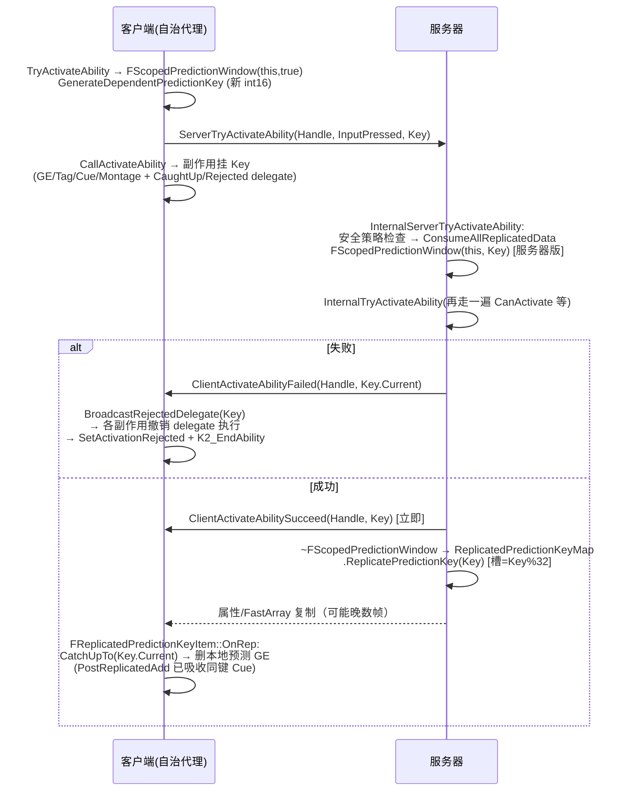

# S8 · 预测键与收敛（重章）

> 结论先行
> 1. **GAS 的预测是「乐观应用 + 权威覆盖收敛」，不是回滚重放**——客户端把预测副作用挂在 `FPredictionKey` 上，服务器确认后由 FastArray 复制权威版本覆盖，客户端再删掉自己的预测副本；被拒绝时才走 `FPredictionKeyDelegates::BroadcastRejectedDelegate` 主动撤销（GameplayPrediction.cpp:299-338 · FPredictionKeyDelegates::Reject）。没有任何「恢复快照 + 重放」的代码路径。
> 2. 预测键是 **int16 进程级全局计数器**（客户端 `GKey` 与服务器 `GServerKey` 各一个，都从 1 起、溢出回绕到 1），确认通道是 **32 槽 ring buffer 的 FastArray**（`KeyRingBufferSize = 32`，槽位 = `Key.Current % 32`），窗口边界由 **RPC 往返 + 属性复制追平（catch-up）** 界定，不是帧也不是时间。
> 3. Epic 在 `GameplayPrediction.h` 头注释里自己承认的硬限制：链式激活无法回滚、执行计算（Execution）与周期效果不预测、乘法类 Effect 的客户端预测基数错误（拿已修饰的 final value 当 base）、meta 属性不可预测。

---

## 8.0 证据基线（版本钉死）

- 引擎：UE 5.8.2（`Engine/Build/Build.version`：MajorVersion 5 / MinorVersion 8 / PatchVersion 2 / CompatibleChangelist 55116800 / BranchName "UE5"）
- git：`ff8421f2b8cb4feb76fff57965a1effc53a6eb7b`（分支 `5.8`，2026-08-25 "Localization Automation using CL 57313377"）
- 本章所有行号相对上述版本。

## 8.1 待证清单裁决表

| # | 待证项 | 裁决 | 关键坐标 |
|---|---|---|---|
| 8.1 | FPredictionKey 生命周期 | **证实+细化**：客户端生成 = 进程级 `static KeyType GKey = 1`（int16）单调递增、溢出回绕；服务器密钥独立计数器 `GServerKey`；上行靠 RPC 参数携带；服务器在 `FScopedPredictionWindow` 析构时把 key 写进 `ReplicatedPredictionKeyMap`（FastArray）复制回客户端；拒绝 = `ClientActivateAbilityFailed` RPC 立即广播 Rejected delegate | Engine/Plugins/Runtime/GameplayAbilities/Source/GameplayAbilities/Private/GameplayPrediction.cpp:189-252 · FPredictionKey::GenerateNewPredictionKey / CreateNewPredictionKey / CreateNewServerInitiatedKey；GameplayPrediction.cpp:512-540 · FScopedPredictionWindow::~FScopedPredictionWindow；AbilitySystemComponent_Abilities.cpp:2279-2285 · UAbilitySystemComponent::ClientActivateAbilityFailed_Implementation |
| 8.2 | 依赖键链式关系 | **证实**：`GenerateDependentPredictionKey()` 把首个 Current 记为 Base，新 key 与旧 key 之间用 `FPredictionKeyDelegates::AddDependency` 挂 delegate（Reject 基键 → Reject 依赖键 恒成立；CatchUp 传播方向受 `AbilitySystem.PredictionKey.DepChainBehavior` 位掩码控制，默认 1，Epic 注释说 3 才是"长期正确值"） | GameplayPrediction.cpp:199-221 · FPredictionKey::GenerateDependentPredictionKey；GameplayPrediction.cpp:357-379 · FPredictionKeyDelegates::AddDependency；GameplayPrediction.cpp:31-35 · CVarDependentChainBehavior 注册 |
| 8.3 | FScopedPredictionWindow 语义 | **证实**：两个构造函数——服务器版（接收客户端 key，存 `RestoreKey`，覆盖 `ASC::ScopedPredictionKey`）与客户端版（`GenerateDependentPredictionKey` 生成新 key）；析构时若 `SetReplicatedPredictionKey` 且 key 有效 → `ReplicatedPredictionKeyMap.ReplicatePredictionKey()`（= 服务器对这批副作用的**确认**），然后恢复 ScopedPredictionKey | GameplayPrediction.cpp:387-406（服务器构造）；408-482（客户端构造，含 !UE_BUILD_SHIPPING 的 RPC 拦截调试）；484-541（析构）· FScopedPredictionWindow |
| 8.4 | 撤销的数据结构 | **证实**：撤销没有 diff/日志/快照，只有一个 **进程级静态单例 `TMap<int16, FDelegates>`**（`FPredictionKeyDelegates::Get()`）；Reject/CatchUpTo 都先 `MoveTemp` 出 delegate 数组再执行（防重入），执行的就是各副作用注册的回滚 lambda/UObject 绑定（如 `RemoveActiveGameplayEffect_AllowClientRemoval`）。撤不掉的东西 = 没注册 delegate 的表现（已播放的 montage 段、已触发的连锁 RPC）——Epic 注释明说链式激活"目前无法开箱即用地回滚" | GameplayPrediction.h:435-467 · FPredictionKeyDelegates 声明；GameplayPrediction.cpp:272-355 · Reject/CatchUpTo；GameplayPrediction.h:218-226 · Epic 自述"Rollback of any chained activations ... is currently not possible out of the box"；GameplayEffect.cpp:4519-4544 · 预测 GE 注册的撤销 delegate |
| 8.5 | 不预测清单的早退证据 | **证实（源码穷举）**：见 8.5 节表 | 见表 |
| 8.6 | 预测 Effect 的存储与合并 | **证实：替换（remove-then-authoritative），不是数值累加**。客户端预测的 Instant GE 被改造成 INFINITE_DURATION 的 ActiveGE 存进同一容器（`bTreatAsInfiniteDuration`）；服务器版本经 FastArray 到达（`PostReplicatedAdd`）后，`FReplicatedPredictionKeyItem::OnRep` → CatchUpTo → 删除本地预测副本。数值层面：属性是 **delta 预测**（预测 mod 叠在服务器 base 上，ReverseEvaluate 反推 base） | AbilitySystemComponent.cpp:1066/1112-1117 · bTreatAsInfiniteDuration 与 SetDuration(INFINITE)；GameplayEffect.cpp:4510-4545 · 预测注册 catch-up 移除；GameplayEffect.cpp:3743-3772 · SetBaseAttributeValueFromReplication（回绕重算）；GameplayPrediction.h:114-129 · Epic 的 delta 预测说明 |
| 8.7 | 消耗与冷却的预测 | **证实**：消耗/冷却就是普通 GE（`ApplyCooldown`/`ApplyCost` → `ApplyGameplayEffectToOwner`），客户端在预测窗口内本地应用（冷却 GE 有 tag、有 duration，走正常预测路径）；Instant 消耗 GE 走 `bTreatAsInfiniteDuration`；收敛 = 服务器权威 GE 复制 + REPNOTIFY_Always 的属性 OnRep 重算 base；不一致时**服务器赢**（客户端 ReverseEvaluate 反推出的 base 被服务器复制值直接覆盖，OnAttributeAggregatorDirty 用 NetUpdateID 保证每次网络更新只反推一次） | GameplayAbility.cpp:1106-1145 · ApplyCooldown/ApplyCost；GameplayEffect.cpp:3452-3511 · OnAttributeAggregatorDirty（含「exactly one time」注释）；GameplayPrediction.h:126-128 · REPNOTIFY_Always 要求 |
| 8.8 | ring buffer 32 | **证实**：`const int32 FReplicatedPredictionKeyMap::KeyRingBufferSize = 32`；槽位 `Key.Current % 32`；为什么是 FastArray 而非"最大 key 号"——Epic 注释给了丢包反例（Pkt1 带状态+key1 丢失、Pkt2 只有 key2 到达 → 客户端误以为追平、提前删掉预测 Tag）。溢出处理 = `OnRep` 里的 stale-key 清扫（默认 `StaleKeyBehavior=2`=Drop，"最安全……可能让 Ability 永远等在异步 task 里"） | GameplayPrediction.cpp:686 · KeyRingBufferSize=32；702-707 · ReplicatePredictionKey（取模入槽）；594-684 · FReplicatedPredictionKeyItem::OnRep（stale 清扫全逻辑）；GameplayPrediction.h:552-565 · 丢包反例注释；GameplayPrediction.cpp:26-29 · StaleKeyBehavior CVar（默认 2；UE5.5 之前恒为 CatchUp） |

## 8.2 机制正文

### 8.2.1 FPredictionKey 的内存布局与生成

```
struct FPredictionKey {            // GameplayPrediction.h:296-414
    int16  Current;                // 键值，>0 有效（IsValidKey）
    int16  Base;                   // 依赖链基键；UPROPERTY(NotReplicated) —— 不上网
    bool   bIsServerInitiated;     // 服务器发起的键，对所有连接有效
    FObjectKey PredictiveConnectionObjectKey;  // 服务器侧记录"哪个连接给我的"
                                    //（客户端回程时只序列化给该连接）
};
```

- `operator==` 与 `GetTypeHash` **都忽略 Base**（GameplayPrediction.h:370-390）——键身份只由 `(Current, bIsServerInitiated)` 决定。
- 客户端计数器：`static KeyType GKey = 1; Current = GKey++; if (GKey <= 0) GKey = 1;`（GameplayPrediction.cpp:189-197）。int16，进程内所有 ASC 共享，**回绕无告警**。生成前提：`CreateNewPredictionKey` 仅当 `GetOwnerRole() != ROLE_Authority` 才发号（GameplayPrediction.cpp:223-233）。
- 服务器发起键独立计数（GameplayPrediction.cpp:235-252），注释明言"故意不同步两个计数器，否则会掩盖 bug"。

### 8.2.2 网络序列化（只回给来源客户端）

`FPredictionKey::NetSerialize`（GameplayPrediction.cpp:115-187）位布局：

```
[1 bit]  ValidKeyForConnection   // 保存侧：Current>0 且 (bIsServerInitiated
                                 //  || 无来源连接(客户端上行) || 来源==当前连接)
[1 bit]  HasBaseKey              // 仅旧版本 demo 回放（PredictionKeyBaseNotReplicated
                                 //  之前的引擎网版本）；现版本不再复制 Base
[1 bit]  bIsServerInitiated
[条件]   int16 Current           // 仅 ValidKeyForConnection 时
[条件]   int16 Base              // 仅旧 demo
读取侧：PredictiveConnectionObjectKey = FObjectKey(Map)  // 记住来源连接
```

- **关键不变量**：其它客户端收到的是 0（无效键），`IsValidKey()==false`。这是"预测副作用对其它客户端不可见"的序列化级实现。
- `UE_WITH_REMOTE_OBJECT_HANDLE` 下对 proxy 连接特殊放行（GameplayPrediction.cpp:131-146）。

### 8.2.3 确认/拒绝/追平的控制流



坐标：客户端窗口（AbilitySystemComponent_Abilities.cpp:1925-1945）；服务器入口（同文件 2054-2125）；失败路径（2279-2333）；OnRep（GameplayPrediction.cpp:594-684）。

### 8.2.4 「预测窗口」的等价物

UE 里最接近"预测窗口"的就是 `FScopedPredictionWindow`（一个 C++ 栈对象）：

- **进入**：客户端构造函数生成依赖键并设为 `ASC::ScopedPredictionKey`（GameplayPrediction.cpp:431-437）；此后所有 `ASC::CanPredict()`（= `ScopedPredictionKey.IsValidForMorePrediction()`，AbilitySystemComponent.h:286-289）在该栈帧内为真。
- **退出**：析构恢复旧 key（GameplayPrediction.cpp:536-539）。Epic 头注释明说：**"we do not predict over multiple frames"**（GameplayPrediction.h:78）——窗口 = ActivateAbility 的初始调用栈，任何 timer/latent 节点结束后 key 已失效。
- 需要在 Ability 中段再开窗口：`UAbilityTask_WaitInputRelease::OnReleaseCallback` 模式（客户端 `ServerInputRelease` 带新 key 上行，服务器在同一逻辑作用域里用它，GameplayPrediction.h:202-213）。
- 窗口边界由 **RPC 往返 + 复制追平** 界定：`ClientActivateAbilitySucceed`（可靠 RPC，立即）只把实例标记 Confirmed；预测副作用的删除要等 `ReplicatedPredictionKeyMap`（属性复制通道）追上——Epic 注释明确这个两阶段（GameplayPrediction.h:83-92）。`OnClientActivateAbilityCaughtUp` 若发现 caught up 时还在 Predicting 态，只打一条 Display 日志、**不杀 Ability**（AbilitySystemComponent_Abilities.cpp:2335-2360，注释：可靠 RPC 丢失但属性 bunch 先到的网络条件）。

### 8.2.5 撤销到底撤了什么（数据结构层面）

- 全部撤销逻辑挂在 `FPredictionKeyDelegates`（进程级单例 `TMap<KeyType, FDelegates>`，GameplayPrediction.h:440-451）。三种注册口：`NewRejectedDelegate` / `NewCaughtUpDelegate` / `NewRejectOrCaughtUpDelegate`（后者的同一个 delegate 同时挂进两个列表，GameplayPrediction.cpp:292-297）。
- 预测 GE 的注册点在 `ApplyGameplayEffectSpec` 尾部：非堆叠预测 GE 默认（`AbilitySystem.Fix.PredictedTagApplication=true`）挂 `RemoveActiveGameplayEffect_AllowClientRemoval` 的 RejectOrCaughtUp；堆叠 GE 挂 `OnPredictiveGameplayEffectStackCaughtUp`（按 stack 差值回退，GameplayEffect.cpp:4510-4544；3593-3614）。
- **替换 vs 累加**：容器里预测 GE 与服务器 GE 是两个数组元素，靠 `PredictionKey` 相等识别（`HasPredictedEffectWithPredictedKey` / `HasReceivedEffectWithPredictedKey`，GameplayEffect.cpp:5744-5768）；cue 的去重在 `FActiveGameplayEffect::PostReplicatedAdd`（同键则不再播 OnActive，GameplayEffect.cpp:2825-2835）。数值不累加——属性走 delta 预测 + ReverseEvaluate 反推 base（GameplayEffect.cpp:3487-3495）。
- **撤不掉的**：没有注册 delegate 的表现副作用（已经发出去的 multicast cue、montage 已播段）。montage 有专用补偿：`OnPredictiveMontageRejected`（AbilitySystemComponent_Abilities.cpp:3257-3272）。

### 8.2.6 「不预测清单」的源码早退点（比文档更权威）

| 操作 | 早退/限制 | 坐标 |
|---|---|---|
| GameplayEffect 应用 | `!HasNetworkAuthorityToApplyGameplayEffect(PredictionKey)` → 无效 handle（= 权威 或 键仍可预测，二者其一） | AbilitySystemComponent.cpp:455-458 · UAbilitySystemComponent::HasNetworkAuthorityToApplyGameplayEffect；1016-1019 · 应用点检查 |
| 周期 GE | 客户端带预测键 + Period>0 → 直接 return；服务器则作废键继续 | AbilitySystemComponent.cpp:1021-1034 |
| Execution 计算 | `PredictivelyExecuteEffectSpec` 其实会跑 Executions（见 8.4 意外发现），但主应用路径 `ApplyGameplayEffectSpecToSelf` 对 Instant 只在**非预测**时走 `ExecuteGameplayEffect`；头注释仍宣称"Executions do not currently predict"（文档与实现的偏差） | GameplayPrediction.h:39；AbilitySystemComponent.cpp:1148-1162；GameplayEffect.cpp:3138-3172 |
| GE 移除 | `RemoveActiveGameplayEffect` 非权威默认拒绝（警告日志），需 `AbilitySystem.Fix.AllowPredictiveGEFlags` 位掩码放行 | AbilitySystemComponent.cpp:1249-1263；AbilitySystemPrivate.h:22（CVar 默认 0） |
| 堆叠 GE 预测 | `bAllowPredictiveApplicationOfStackingGEs=false` 时客户端直接 nullptr；默认 true | GameplayEffect.cpp:4213-4225；GameplayEffect.cpp:95（CVar 默认 true） |
| InstancedPerExecution 实例 | 预测激活要求 ReplicationPolicy==ReplicateNo，否则 **Error 日志 + 不本地激活**（"we lack the code to predict spawning an instance ... and merge"） | AbilitySystemComponent_Abilities.cpp:1947-1962 |
| Meta 属性 | 头注释：无法预测（Pre/PostModifyAttribute 只在 instant 后端调用） | GameplayPrediction.h:228-235 |
| 乘法类 GE | 头注释：客户端拿 final value 当 base，基数错误（+10% 叠 +10% 得 605 而非 600 的例子） | GameplayPrediction.h:237-247 |
| 链式/触发激活回滚 | 头注释：不可能（每个 ServerTryActivateAbility 独立应答；依赖只存客户端） | GameplayPrediction.h:218-226；187-189（服务器不知道依赖，建议用 tag 设计绕开） |
| Attribute OnRep | 必须 REPNOTIFY_Always，否则预测先行导致 OnRep 不触发 | GameplayPrediction.h:126-128 |

### 8.2.7 两个判断题的裁决

**Q1：回滚+确定性重放，还是乐观应用+权威覆盖收敛？**
**答：后者，证据链**：
1. 全代码库不存在任何「保存状态 → 恢复状态 → 重放输入」路径；唯一的撤销原语是 delegate 广播（GameplayPrediction.cpp:299-355）。
2. 收敛靠三条权威覆盖：属性 OnRep 重算（GameplayEffect.cpp:3452-3511）、AGE FastArray 的 PostReplicatedAdd/Change（GameplayEffect.cpp:2804-2940）、`SetBaseAttributeValueFromReplication` 的回绕-求值-再设置三步（GameplayEffect.cpp:3743-3772）。
3. 服务器对每批副作用只回一个**确认信号**（ReplicatedPredictionKeyMap 槽位），客户端据此删除预测副本——这是"覆盖收敛"的教科书形态。

**Q2：GAS 语境下"回滚"的准确含义？**
答：仅指 **`FPredictionKeyDelegates::Reject(Key)` 触发的、各副作用在注册时自带的清理回调**（删预测 GE、退预测 tag 计数、停预测 montage）。它是逐副作用的撤销，不是状态机回滚；且只在「激活被显式拒绝」这一条路径上发生（`ClientActivateAbilityFailed` 是唯一 reject 源，GameplayPrediction.h:88-89 自述）。

**Q3（对目标引擎）：与「整帧单一确认/回滚单元」的距离？**
- GAS 的确认粒度是**每个副作用批次（每个 ScopedPredictionWindow/每个 key）**，不是帧；回滚粒度是**每个注册了 delegate 的副作用**，不是帧。
- 窗口是调用栈级的（不跨帧），目标引擎是固定步长帧级的——GAS 没有「提交点」概念：`MarkItemDirty`/`MarkArrayDirty` 在应用当刻发生（GameplayEffect.cpp:4510-4517），复制可见性由 NetDriver 的更新节奏决定。
- GAS 的撤销不覆盖 ECS 类外部状态（目标引擎要求 Ability/ECS/体素同一回滚单元）——GAS 里这些根本不在同一个系统里。

### 8.2.8 横向对比（坐标为准，内部实现归 DS 篇）

| 机制 | 模型 | 关键差异 |
|---|---|---|
| GAS FPredictionKey | 乐观应用 + 权威覆盖收敛 | 撤销=注册式 delegate；无重放；窗口=调用栈 |
| UCharacterMovementComponent SavedMoves | 回滚 + 确定性重放（服务器权威模拟，客户端存 move、被纠正时重放未确认 moves） | 有真正的状态保存与重放；GAS 完全没有 |
| Network Prediction 插件 | Fixed ticking + group rollback（帧级回滚组） | Engine/Plugins/Runtime/NetworkPrediction 存在于本源码树；内部实现见 DS 篇 |
| Chaos 网络物理 | 回滚（物理 rewind） | 同上 |

GAS 与后三者的本质差异：GAS 同步的是**慢速游戏逻辑状态**（属性、tag、效果列表），对错 100ms 无感知；后三者同步**高频模拟**，必须重放。目标引擎把 Ability/ECS/体素放进**同一个确认/回滚单元**，等于要求 GAS 型慢速逻辑也接受 CMC 型严格性——这是架构选择，不是 GAS 代码能直接借用的。

## 8.3 源码里的意外发现（本章）

1. **预测键 CVar 全家桶都在私有命名空间**（GameplayPrediction.cpp:15-41）：`AbilitySystem.PredictionKey.MaxStaleKeysBeforeAck`（默认 32×4=128，注释直言"科学依据不精确，按 4 个本地玩家估算"）、`StaleKeyBehavior`（默认 2=Drop；注释"UE5.5 之前我们总是 CaughtUp，我认为 Drop 其实更安全"）、`DepChainBehavior`（默认 1，注释"逻辑上 3 才对，我们默认 1 是为了逐步过渡到长期修复"）、`RepServerKeysAsAcknowledged`（默认 0；UE5.4.2 之前是 true 且会造成键哈希碰撞）。
2. **`FScopedDiscardPredictions`**（GameplayPrediction.h:527-547；GameplayPrediction.cpp:545-590）：可把窗口内产生的键直接丢弃/或显式 Accept/Reject 整链——用在"本地播 montage、不可靠通知服务器"的场景（EGasPredictionKeyResult 枚举：SilentlyDrop/Accept/Reject）。这是对"弱预测"构想（头注释 250-261 行）的落地。
3. **非 Shipping 构建的 RPC 拦截调试**：客户端首个 ScopedPredictionWindow 会 `NetDriver->SendRPCDel.BindWeakLambda` 拦截所有出站 RPC，检查本链的 BaseKey 是否真的被发出；没发出就在析构时 Warning"leaked delegates can never be called"（GameplayPrediction.cpp:439-481、486-509）。Epic 自己在防"创建了键却忘了发给服务器"这类 bug。
4. **`OnRep` 的 stale-key 清扫是环形区间判断**（GameplayPrediction.cpp:621-634）：以当前 key 为中心、`Max(MaxStaleKeysBeforeAck, 32)` 为半径，处理 int16 回绕后的环形 [Min,Max] 安全区/非安全区互换——这段代码存在本身就是"计数器会回绕、且 delegate map 里的孤儿键需要兜底"的自供状。
5. **服务器键回传曾被当成确认**：`OnRep` 现在对 `bIsServerInitiated` 的键直接 Warning + return（"likely stomped a local key due to keymap hash collisions"，GameplayPrediction.cpp:607-611）。
6. **`ReplicatedPredictionKeyMap` 必须是 ASC 最后一个复制属性**（AbilitySystemComponent.h:1951-1953 注释："has to come *last* ... to ensure OnRep/callback order"）——GAS 的收敛正确性依赖属性复制回调顺序，这是目标引擎线协议绝不能继承的隐含约束。
7. **预测激活前先 FlushServerMoves**（AbilitySystemComponent_Abilities.cpp:1996-2014 · PrePredictionActivation；GameplayAbility.cpp:944-961 · PreActivate 再冲一次）：为了让移动 RPC 与能力 RPC 保持顺序，防止根移动类能力触发网络纠正。GAS 与 CMC 的顺序耦合点。

## 8.4 与预研/社区认知的对照（勘误候选）

- 「Executions 完全不预测」——头注释这么说（GameplayPrediction.h:39），但 `FActiveGameplayEffectsContainer::PredictivelyExecuteEffectSpec`（GameplayEffect.cpp:3069-3207）在客户端预测路径里**会**跑 `ExecCDO->Execute`（3138-3172）。需要标注：主 RPC 应用路径不预测 Execution（`ApplyGameplayEffectSpecToSelf` 只对非预测 instant 调 `ExecuteGameplayEffect`），但存在一条预测执行路径（调用方为 cue/直接执行类 API）。文档的一刀切说法与实现存在偏差。
- 「KeyRingBufferSize=32」——证实（GameplayPrediction.cpp:686），且 32 的语义是 **FastArray 固定槽数**（构造时 `SetNum(32)` 且全部 MarkItemDirty，GameplayPrediction.cpp:688-695），键按 `Current % 32` 入槽；语义是"每 ASC 保留最近 32 个已确认键"，配合进程级全局计数器与 stale 清扫构成有界确认窗口。

## 8.5 对目标环境的迁移含义

目标引擎要求「客户端只能在**有界预测窗口**内预测；Ability/ECS/体素同一确认/回滚单元；fail-stop 整帧作废」。GAS 给出的可迁移资产与不可迁移资产：

- **可迁移**：确认键与副作用绑定的**思想**（副作用在产生处注册自己的清理回调）；"只回给来源客户端"的序列化技巧（对私有预测通道的建模）；delta 预测 + ReverseEvaluate 反推 base 的属性收敛（若保留 float 属性，这是必抄的）；32 槽有界确认窗口 + stale 清扫（有界性证明的现成参考）。
- **不可迁移**：delegate 注册式撤销（依赖 UObject 生命周期与全局单例，目标引擎要求的是帧级快照回滚，语义不同）；调用栈级窗口（目标引擎是固定步长帧级提交点，窗口边界应改为「帧内提交点」）；int16 全局计数器（目标引擎要求可计算状态哈希与确定性，计数器必须纳入快照且回绕策略显式化）。
- **距离评估**：GAS 的确认单元 = 键（一个逻辑作用域），目标引擎的确认单元 = 帧。把 GAS 语义平移到帧模型，等价于把「每个 ScopedPredictionWindow」变成「每帧末尾的批量确认」——`FScopedAggregatorOnDirtyBatch`（GameplayEffectAggregator.h:397-413）已经是"延迟到作用域末尾统一广播"的形状，是 GAS 内部最接近「帧提交点」的既有结构。
