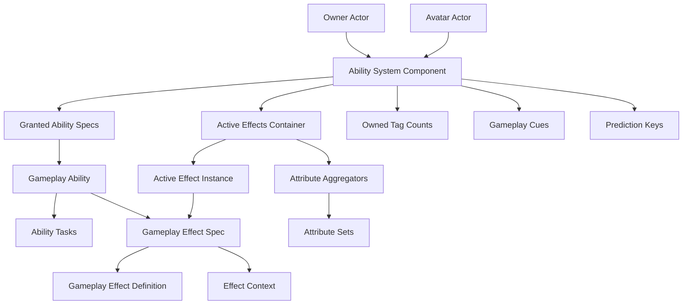
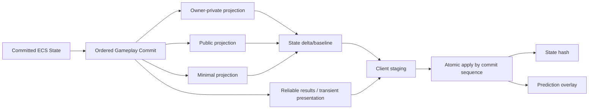

# Mermaid 图表源码

> 主报告中的图在此集中收录，便于文档系统单独渲染。

## GAS 对象图



## 预测成功收敛

```mermaid
sequenceDiagram
  participant C as Client
  participant S as Server
  C->>C: Generate key K; optimistic Ability/Effect/Cue
  C->>S: Activation/TargetData + K
  S->>S: Revalidate and commit authority state
  S-->>C: State delta + catch-up K
  C->>C: Dedupe predicted effects; keep authority result
```

## 目标引擎分层


