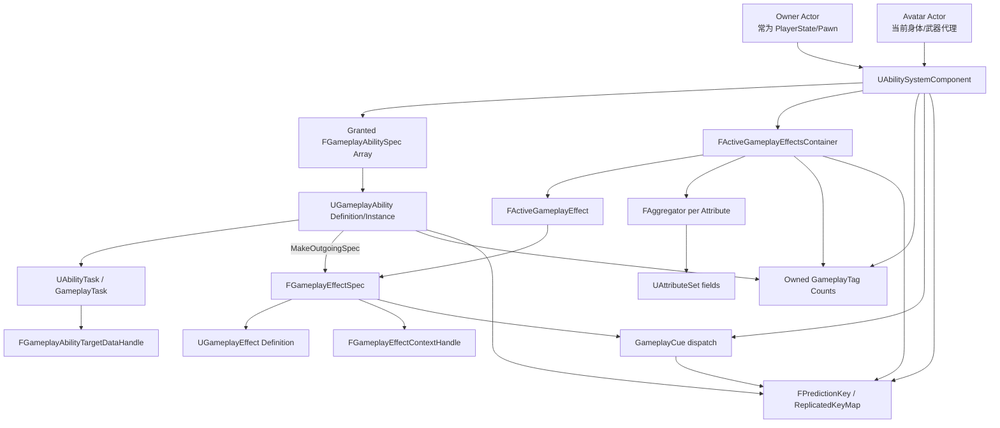
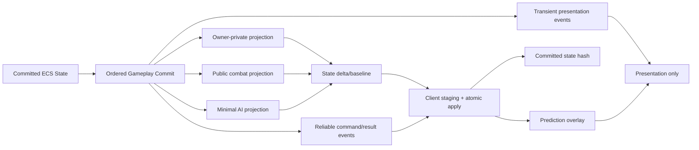
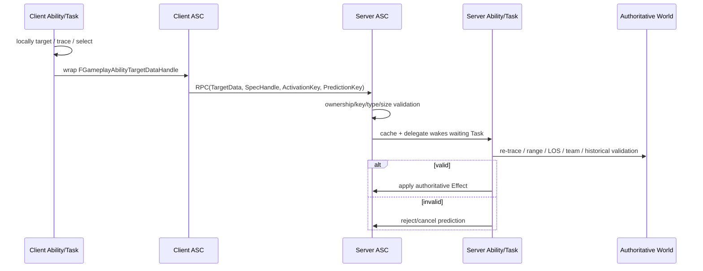

# Unreal Engine Gameplay Ability System（GAS）技术调研与可迁移性评估

- **交付日期**：2026-08-29
- **调研基线**：Unreal Engine 5.6 官方文档与 API Reference；跨版本章节另核 UE 5.5 Release Notes 与旧版 ActionRPG 资料。
- **调研对象**：Epic Gameplay Ability System（`GameplayAbilities`、`GameplayTags`、`GameplayTasks` 相关公开机制）。
- **迁移参照**：Rust 原生内核 + C# Gameplay、ECS 唯一权威状态、确定性分相 Tick、单提交点、整帧 fail-stop、统一确认/回滚单元与状态哈希。

## 信息源可达性声明

1. **指定源码镜像 `Go1c/UnrealEngine`：不可达。** [Verified] 2026-08-29 实际尝试仓库根页、`GameplayAbilities` 目录以及仓内代码搜索，抓取均返回 cache miss，无法确认分支、commit、文件内容或行号。[S001][S002][S003]
2. **Epic 官方文档与 API Reference：可达。** [Verified] 已读取 UE 5.6 GAS 总览、Ability、Attribute、Effect、GameplayTag、Lyra、FastArray、PredictionKey、CharacterMovement、Mass 等主题页或 API 索引。[S004]–[S050]
3. **官方样例工程：文档可达，工程源码/二进制未取得。** [Verified] Lyra 与 ActionRPG 的公开文档可访问；本次没有下载 Marketplace/Sample 工程，也没有从第三方仓库冒充官方样例源码。[S010][S011][S014]
4. **社区资料：可达但单独标注。** [Verified] 重点使用 tranek/GASDocumentation、GASShooter 与公开 Unreal Fest/项目演讲。社区资料不升级为官方事实，且其版本基线常早于 UE 5.6。[S051]–[S064]

**证据后果**：本报告不存在“读到 `Go1c/UnrealEngine` 函数体后得出的源码级 Verified 断言”。官方文档/API 明文可以标 `Verified`；凡涉及未公开函数体的精确控制流、同优先级定序、容器内部时序、ABI/位布局，统一降为 `Reported` 或 `Estimated`。这不是资料完整性的装饰性说明，而是所有架构结论的置信度上限。

## 置信度图例

- **`Verified`**：亲自读到 Epic 官方文档/API 原文，或实际验证到来源可达性。
- **`Reported`**：一个或多个可信社区来源一致，或官方 API 暴露了符号但指定源码镜像不可读，因而没有函数体证据。
- **`Estimated`**：基于已验证机制的工程推断、迁移判断或规模估算；会写明依据与不确定性。

## 执行摘要

1. **GAS 不是“技能库”，而是以 ASC 为中心的局部 Gameplay 状态与副作用协调器。** [Verified] `UAbilitySystemComponent` 统一承载已授予 Ability、活跃 GameplayEffect、Attribute、GameplayTag、GameplayCue、蒙太奇复制与 PredictionKey 协议。它的野心是让“规则、持续状态、表现、网络”共享同一套语义，而不是让每个技能自己发 RPC、扣资源、挂 Timer、管理 Buff。[S004][S005][S016]
2. **最值得继承的设计世界观是“定义、实例、上下文、聚合、表现分离”。** [Verified] `GameplayEffect` 定义与 `GameplayEffectSpec` 运行时规格分开，Effect 与 Context 分开，Attribute 拆 Base/Current，Owner 与 Avatar 分开，逻辑状态与 Cue 分开。每层都对应一个具体坑：共享资产被运行时污染、来源/目标混淆、Buff 移除后无法重算、复活换 Pawn 后状态丢失、逻辑依赖特效对象等。[S005][S007][S008]
3. **GAS 的网络同步是“耐久状态 + 瞬时事件 + 本地推导”的混合模型。** [Verified/Reported] Attribute、ActiveEffect、AbilitySpec 等走属性/FastArray 状态复制；激活、TargetData、通用事件和结束走 RPC；当前数值、Cue 与部分显示由本地 Effect/Tag 状态重建或预测。Full/Mixed/Minimal 不是三种算法，而是同一权威状态向不同观察者投影的三种带宽策略。[S005][S035]–[S038][S052]
4. **FastArray 的核心价值是“数组项级脏标记与增删改回调”，不是自动字段级补丁。** [Verified] `FFastArraySerializer` / `Item` 提供 item identity、replication key、add/change/remove 回调与增量发送；某项被标脏后，该项的 NetSerialize 负载仍可能整体重发。迁移到 ECS 时应继承“稳定元素 ID + 版本 + tombstone/变更回调”，不应照搬 UObject 容器。[S035]–[S038]
5. **GAS Prediction 不是确定性 rollback/resimulation。** [Verified/Reported] 客户端在 Prediction Window 内乐观激活并注册可撤销副作用；服务器接收同一个 PredictionKey 后接受、catch-up 或拒绝。系统不保留完整世界帧，也不把历史输入重放到当前帧，因此它属于“乐观应用 + 权威覆盖收敛”，不是 CharacterMovement/Network Prediction/Chaos 意义上的回滚重演。[S027]–[S030][S043]–[S046][S059]
6. **GAS 语境中的“rollback”是选择性撤销，不是事务回滚。** [Reported] 可绑定到 PredictionKey 的预测 Effect、Tag/Attribute 变化、Cue 等可以在拒绝时移除或补偿；已经触发的外部世界写入、任意 Blueprint 副作用、一次性音画、非 GAS 连锁逻辑，通常没有统一逆操作。目标引擎要求 Ability/ECS/体素覆盖层整帧同进退，必须另建帧日志、快照、确定性重演与提交协议。[S028][S059]
7. **Prediction Window 是逻辑作用域，不是 N 毫秒或 N 帧历史。** [Verified/Reported] Key 在能力激活/RPC 作用域产生，并由服务器复制回客户端触发 catch-up；依赖 Key 表达子动作因果。`KeyRingBufferSize = 32` 是复制确认环形槽容量，不等于“能回滚 32 帧”。[S027]–[S030][S059]
8. **Lyra 的附加层精确暴露了裸 GAS 的产品化缺口。** [Verified] AbilitySet 解决批量授予与撤销；PlayerState ASC 初始化封装解决 Owner/Avatar 时序；InputTag 解决 Enhanced Input 到 Ability 的映射；Tag Relationship Mapping 解决分散互斥规则；ActivationPolicy/Group 解决被动、自发与并发组；AdditionalCost 解决多重成本；GamePhase Ability 解决全局阶段生命周期。[S010]–[S012]
9. **对 ECS + 确定性 Tick，引进概念而不是对象图。** [Estimated] 应保留 Definition/Spec/Instance、Effect 句柄、Tag 计数、捕获规则、聚合通道、受众投影、PredictionKey 因果标识和 Cue 边界；应删除 UObject/GC、Actor Owner 链、Blueprint latent task、WorldTimer 与“ASC 再存一份权威状态”。所有 Effect/Attribute/Tag 实例状态必须投影到 ECS，并由一个提交序列产生复制、快照和哈希。
10. **最关键的不可迁移部分，是 GAS 对“非确定性但可收敛”的接受。** [Estimated] 浮点聚合、Timer/World Time、回调驱动重算、资产类对象与网络到达顺序，适合 UE 的服务器权威实时游戏，却天然不提供 canonical state hash。目标引擎可以继承它的因果和可逆副作用标注，但必须自己定义稳定排序、定点/受控浮点、帧号时间、全域事务日志与 resimulation。

## 已知缺口

- **指定 UE 源码镜像不可读**：无法给出任何 `Go1c/UnrealEngine@commit:path#Lx-Ly` permalink，源码级断言全部降级。
- **历史来源链证据不足**：GAS 与 UE3/Gears、Paragon、Fortnite 的口述演进可见于社区与演讲，但未找到一份 Epic 官方、逐版本可核的完整谱系。
- **Fortnite 内部实现不可见**：只能引用 Epic 对 GAS 定位、Lyra 公开实践与社区对 Fortnite batching/replication proxy 的记述，不能声称掌握生产分支细节。
- **官方样例工程本体未取得**：Lyra/ActionRPG 以公开文档为证；具体项目路径只写官方文档明示或社区明确列出的部分。
- **缺少公开可复现实测**：没有可信、同硬件同场景的“每 ASC/每 ActiveEffect 字节数”“N 玩家+M AI TPS/带宽”基准，不编造数字。
- **完整存档/快照缺口**：未找到 Epic 官方定义的“活跃 AbilityTask + Timer + PredictionKey + ActiveEffect 全量可恢复快照格式”。
- **Mass ↔ GAS 一等集成缺口**：找到 Mass Gameplay 的 ECS 定位，但未找到 Epic 官方把 Mass Fragment 设为 GAS Attribute/Effect 唯一权威存储的方案。

---

# A. 起源、野心与设计哲学

**结论先行 1/3**：[Verified] Epic 将 GAS 定位为构建 RPG、动作与多人游戏 Ability/Attribute/Effect 机制的框架，并把网络复制与客户端预测列为核心能力，而非附加插件。[S004][S005]

**结论先行 2/3**：[Reported] 可公开验证的主线是 Paragon、Fortnite 及后续 Epic 样例；“UE3/Gears 直接演进到当前 GAS”的精确谱系缺少一手版本证据，不能写成确定历史。

**结论先行 3/3**：[Estimated] 它的世界观可概括为：**把 Gameplay 变化建模为可查询、可组合、可复制、尽可能可预测的声明式状态；把一次性表现建模为由这些状态驱动的副作用。**

## A.1 可验证的历史边界

- [Verified] 当前官方 5.6 文档把 GAS 描述为围绕 Ability、Attribute、Effect、Task、Cue 组织 Gameplay 的框架，并明确支持网络复制与客户端预测。[S004][S005]
- [Reported] 社区长期把 Paragon 视为现代 GAS 的公开遗产，把 Fortnite 视为超大规模生产验证场；tranek 文档与 Epic 公开演讲都以“商业项目中使用 GAS”为事实背景，但没有提供 UE3 到 UE5 的逐提交谱系。[S051][S062]
- [Reported] ActionRPG 是较早的 Epic 教学样例，展示 Ability/Effect/Attribute/Cue 的组合，但它是 legacy 示例；Lyra 才是 UE5 时代更接近 Epic 当代产品化习惯的公开范本。[S010][S011][S014]
- [Estimated] “Gears → Paragon → Fortnite”可以作为工程文化线索，不能作为 API 起源证据。架构决策只应依赖当前可验证语义，而不是传奇式沿革。

## A.2 官方定位与成熟度

[Verified] 5.6 GAS 主题入口没有把整套系统描述为“仅供实验”；官方以正式功能文档维护 Ability、Effect、Attribute 与样例用法。[S004] [Reported] 社区记录称 GameplayAbilities 插件在 UE 4.26 前后移除 Beta 标记，但本次不能读取指定镜像的 `.uplugin`，所以**“UE 5.6 descriptor 中具体 `BetaVersion/IsBetaVersion` 字段值”未验证**。[S051]

因此本报告采用双层结论：

1. [Verified] **文档产品定位**：成熟、正式、可用于网络 Gameplay。
2. [Reported] **插件 descriptor 标志**：社区称早已非 Beta；当前源码字段待核，不能伪造。

## A.3 它试图一次解决的问题

| 问题 | 没有 GAS 时的典型一次性实现 | GAS 的统一抽象 | 解决的坑 | 代价 |
|---|---|---|---|---|
| 技能授予与激活 | Pawn 上手写函数、输入直接调用 | AbilitySpec + ASC 激活 | 所有技能有统一准入、取消和网络入口 | 需要理解授予态、实例化策略和网络策略 |
| 资源消耗 | 技能函数直接减 Mana | Cost GameplayEffect + Commit | 预测和服务器校验共享语义 | Cost 何时检查/应用成为额外阶段 |
| 冷却 | Timer + bool | Cooldown Effect/Tag | UI、互斥、复制可从同一状态派生 | 冷却预测与高延迟抖动仍复杂 |
| Buff/Debuff | 手工改值并记旧值 | Duration/Infinite Effect + Aggregator | 移除时可重算，不必猜恢复值 | 聚合器、捕获规则和堆叠政策复杂 |
| 伤害/治疗 | 直接写 Health | Instant Effect + Execution/Meta Attribute | 来源、抗性、护盾、死亡处理可分层 | 即时结果较难预测撤销 |
| 状态标记 | 多个 bool/enum | GameplayTag + Count | 多来源叠加不会被一次移除误清空 | 需要全局词典治理与网络版本一致性 |
| 互斥与免疫 | 每技能 if/else | Required/Blocked/Cancel/Immunity Tag Query | 规则可声明、可查验 | 规则分散在资产时难调试 |
| 堆叠与刷新 | 每种 Buff 自写容器 | Stacking policy | 来源聚合、目标聚合、刷新/溢出统一 | 边缘组合仍需明确时序 |
| 异步等待 | 状态机、Delegate、Timer | AbilityTask | 动画、目标、事件用统一 latent 模式 | UObject/GC/Blueprint 生命周期负担 |
| 表现解耦 | Gameplay 代码直接播粒子声音 | GameplayCue | 逻辑与表现可独立复制/预测 | 不是类型系统强隔离，团队仍可越界 |
| 网络同步 | 每技能自写 RPC 与属性复制 | ASC replication + PredictionKey | 统一权威、预测和观察者投影 | 强耦合 Actor/NetDriver/owner chain |
| 设计师配置 | 大量代码分支 | Blueprint/DataAsset/GE/Curve/DataTable | 内容组合速度高 | 二进制资产 diff/merge/review 困难 |

## A.4 通用化的抽象税

[Estimated] GAS 的“重”不是单一类庞大，而是每次简单操作都会穿过多层：Definition → Spec → Context → Handle → Container → Aggregator → Tag Requirement → Cue/Task → Replication/Prediction。以下概念对少数场景至关重要，却要求多数使用者至少知道它们存在：

- Source/Target × Snapshot/Live 的四象限捕获；
- NonInstanced / InstancedPerActor / InstancedPerExecution；
- OwnerActor / AvatarActor；
- Full / Mixed / Minimal replication；
- PredictionKey、dependent key、scoped window；
- ActiveEffect 的 inhibited 状态；
- Meta Attribute、ExecutionCalculation、MagnitudeCalculation；
- Cue 的事件类型与可靠性差异。

这些层解决的是“规则重用、移除可逆、网络权威、跨 Pawn 持久化”等真问题，但对仅有十几个单机技能的项目，学习与调试成本可能超过收益。

## A.5 Lyra 补丁暴露的裸 GAS 缺口

| Lyra 层 | 裸 GAS 缺口 | 缺口性质 |
|---|---|---|
| Ability Set | 没有面向 Pawn/装备/Experience 的批量授予/撤销产品单元 | 内容装配与生命周期 |
| PlayerState ASC 初始化封装 | `InitAbilityActorInfo` 调用点和重生时序容易错 | 初始化协议 |
| InputTag → AbilitySpec | 原生 InputID 不能自然表达 Enhanced Input 与可重绑语义 | 输入适配 |
| Tag Relationship Mapping | Required/Blocked/Cancel 规则散落在 Ability 资产 | 规则集中治理 |
| Activation Policy | 被动/出生即激活/输入触发不是统一产品语义 | 激活策略 |
| Activation Group | “独占、可替换、并发”缺少高层并发模型 | 调度/互斥 |
| Additional Cost | 单个 Ability 的多个条件化成本组合不够顺手 | 成本扩展点 |
| Global Ability System | 对所有活跃 ASC 批量授予 Ability/Effect 缺少全局服务 | 世界级编排 |
| Game Phase Ability | 比赛阶段没有与 Ability 生命周期融合的标准层 | 模式/阶段编排 |

[Verified] 这些不是“GAS 不可用”的证据，而是 GAS 刻意停在通用原语层，产品仍需一层 orchestration。[S010]–[S012]

## A.6 一句话世界观

> **[Estimated] GAS 把 Gameplay 视为“带上下文的声明式效果在一个可复制的状态宿主上聚合”，Ability 只是产生、等待、提交和撤销这些效果的事务脚本。**

证据链：ASC 是统一宿主；GE/Spec/Context 分离定义与实例；Attribute/Aggregator 管可逆数值；Tag 管条件与状态；Cue 管表现；PredictionKey 管乐观副作用因果。[S005]–[S008][S016][S027]

### A 章来源

[S004][S005][S010][S011][S014][S015][S051][S062]

---

# B. 整体架构与对象图

**结论先行 1/3**：[Verified] ASC 是对象图中心：AbilitySpec 与 ActiveGameplayEffect 不是两个独立系统，而是通过 Tag、Attribute、Cue、Task 与 PredictionKey 在 ASC 上汇合。[S016][S017][S025]

**结论先行 2/3**：[Verified/Reported] OwnerActor 与 AvatarActor 的分离允许“状态随 PlayerState 存活、身体随 Pawn 更换”，但同时引入 owner chain、初始化时序、复制受众和重生清理的复杂度。[S052]

**结论先行 3/3**：[Estimated] 对目标引擎，最应复制的是依赖方向与数据流，不是 UObject 对象图；ASC 的“统一视图”应变成 ECS 查询/索引服务，而非第二份权威容器。

## B.1 核心对象图



### 依赖方向的实质

- [Verified] `UGameplayAbility` 通过 ASC 查询 Owner/Avatar、Tag、Attribute、AbilitySpec，并生成/应用 Effect。[S006][S016]
- [Verified] `UGameplayEffect` 是定义；`FGameplayEffectSpec` 是带等级、Context、捕获和动态 Tag/幅值的运行时规格；`FActiveGameplayEffect` 是挂在目标 ASC 上的活跃实例。[S008][S020][S026]
- [Verified] `UAttributeSet` 提供被 ASC 管理和复制的属性字段；Aggregator 保存基础值及 Modifier 通道，CurrentValue 是求值结果。[S007][S024]
- [Verified] GameplayCue 从 Effect/ASC 触发，不应承担权威 Gameplay 规则。[S005][S066][S067]
- [Reported] AbilityTask 是 Ability 内跨 Tick 的 UObject 状态节点；它靠 Ability/GameplayTask 生命周期结束，网络语义由具体 Task 与 ASC RPC 协作。[S033][S034][S056]

## B.2 ASC 挂 Pawn 还是 PlayerState

| 位置 | 动机 | 后果 | 适合 |
|---|---|---|---|
| Pawn | 生命周期简单；AI/临时实体自然；Owner=Avatar | 死亡换 Pawn 时 Ability/Effect/Tag 随 Pawn 销毁；需重授予；玩家跨 Pawn 状态难保留 | AI、一次性单位、无重生角色 |
| PlayerState | 能力、资源、长时 Effect 跨 Pawn/复活保持；Owner 与 Avatar 明确分离 | PlayerState 复制频率/owner chain/初始化顺序敏感；Avatar 切换要重新 `InitAbilityActorInfo`；非 owner 观察者投影更复杂 | 玩家、英雄、多形态/载具/重生 |

[Reported] 社区实践普遍把玩家 ASC 放在 PlayerState、AI ASC 放 Pawn，但这不是强制规则。[S052] [Verified] Lyra 采用 PlayerState 持有 ASC 的模式，并围绕 Pawn Extension/初始化状态补齐时序。[S010]

### Mixed 模式的隐含陷阱

[Reported] Mixed replication 通常要求 ASC 的 OwnerActor 能沿 ownership 链解析到 Controller/NetConnection；若 ASC 放 PlayerState，这通常天然成立，若放 Pawn 则必须确保 Pawn owner 正确设置。否则 owner-only ActiveEffect 细节可能发错受众或不发。[S052]

## B.3 Owner Actor 与 Avatar Actor 为什么分开

- [Verified] **OwnerActor** 是 ASC 的持久宿主和网络所有权锚点；**AvatarActor** 是 Ability 实际作用/动画/位置/碰撞的当前表现实体。[S006][S016]
- [Estimated] 分离解决“账号/玩家状态”和“当前身体”生命周期不同：死亡重生、附身、英雄换形、载具、分身，都不应迫使长期冷却/资源/授予列表重建。
- [Reported] 代价是每个 Ability 都必须区分“谁拥有状态、谁执行动作”；初始化太早会拿不到 Controller/AnimInstance，重生后不更新 Avatar 会让 Task/Targeting 指向旧 Pawn。[S052]

对目标 ECS：应保留 `StateOwnerEntity` 与 `ExecutionAvatarEntity` 两个显式 EntityId，而不要隐式遍历 Actor owner chain。二者变化必须在提交点成为一个可哈希事件。

## B.4 UE 耦合点清单：不可照搬的证据索引

| 耦合对象 | GAS 中的具体位置/能力 | 实际作用 | 对目标引擎的结论 |
|---|---|---|---|
| UObject/GC | Ability、Effect 定义、AttributeSet、AbilityTask、Cue Notify | 反射、资产、生命周期、Blueprint 暴露 | 不可照搬；换为静态定义表、ECS 实例行、显式 arena/handle |
| Actor/Component | ASC 是 ActorComponent；Owner/Avatar 为 Actor | 网络所有权、世界访问、复制宿主 | 不可照搬；换 EntityId + Session/Connection projection |
| Actor replication | ASC 属性、FastArray、RepNotify、owner relevancy | 状态传播和受众过滤 | 思想可迁移；传输层和受众计算重写 |
| Blueprint VM | Ability/EventGraph、Task latent pins、GE/Cue 资产 | 设计师脚本和异步编排 | 不可照搬；用 C#/受限 DSL/静态任务图，且需确定性约束 |
| Animation Montage | AbilityTask_PlayMontageAndWait、RepAnimMontage | 动画驱动等待、section、root motion | 只迁移“表现 token + completion event”；动画不进入权威状态 |
| World Timer/World Time | Duration/Period、Delay Task、cooldown remaining | 时间到期与周期执行 | 不可直接用；换逻辑帧/固定 tick deadline |
| AssetManager/DataAsset | Lyra AbilitySet、Ability/GE/Cue 类引用 | 批量配置与异步加载 | 迁移成版本化 Definition Artifact；加载不改变运行时顺序 |
| DataTable/CurveTable | Attribute 初始化、ScalableFloat | 数值随等级/曲线配置 | 可迁移，但要编译成稳定定点/排序数据 |
| GameplayTagsManager | 全局 Tag 字典、层级、网络索引 | 条件查询与压缩 | 可迁移；必须加入 Release 字典哈希/握手 |
| Enhanced Input | Lyra InputTag 映射 AbilitySpec | 输入动作到 Ability | 仅迁移语义映射；平台输入留 Adapter |
| NetDriver/RPC | ServerTryActivateAbility、TargetData、GenericEvent | 上行请求、可靠/不可靠消息 | 不迁移 API；保留命令/确认/拒绝协议 |
| GameplayCueManager | Cue 资产查找、池化、网络事件 | 表现分发 | 保留表现事件边界，重写资源与可靠性策略 |
| Delegate/RepNotify | Attribute/Tag/Effect 变化回调 | UI、Task 唤醒、重算 | 换提交后变更流；禁止回调中直接写权威 ECS |

## B.5 一次技能从输入到表现的完整数据流

```mermaid
sequenceDiagram
    participant Input as Enhanced Input / Client
    participant ASCc as Client ASC
    participant GA as GameplayAbility
    participant Net as RPC / Actor Replication
    participant ASCs as Server ASC
    participant Target as Target ASC
    participant View as Cue/Animation/UI

    Input->>ASCc: InputTag / AbilitySpecHandle pressed
    ASCc->>GA: CanActivate + local predicted activation
    GA->>ASCc: Open prediction window; optional Commit
    ASCc->>View: predicted montage/cue/attribute display
    ASCc->>Net: activation request + PredictionKey
    opt client-generated target data
      ASCc->>Net: TargetData + app tag/key
    end
    Net->>ASCs: validate spec, ownership, tags, cost, cooldown
    ASCs->>Target: apply authoritative GameplayEffectSpec
    Target->>View: server/observer cue and replicated state
    alt accepted
      ASCs-->>ASCc: replicated key catch-up + state delta
      ASCc->>ASCc: suppress duplicate predicted effect/cue
    else rejected
      ASCs-->>ASCc: reject/cancel
      ASCc->>ASCc: undo registered predictive side effects
      ASCc->>View: stop/correct what remains reversible
    end
```

关键失败出口：本地 `CanActivate` 失败不发请求；服务器重新校验失败则拒绝；TargetData 不能只因由客户端产生就可信；Commit 失败应结束/取消 Ability；动画和 Cue 的可见副作用不保证完全反演。

### B 章来源

[S005]–[S008][S010][S016]–[S034][S052][S056]

---

# C. 标识、句柄与实例模型

**结论先行 1/3**：[Verified/Reported] GAS 有“定义对象—授予规格/活跃实例—本地句柄”的分层，但没有一个统一、跨进程、可持久化的三层 ID 协议。[S017]–[S021]

**结论先行 2/3**：[Reported] AbilitySpecHandle、ActiveEffectHandle 与 PredictionKey 的唯一性主要服务当前进程/ASC/连接会话；不能未经协议包装就当跨服或存档 ID。

**结论先行 3/3**：[Verified] Ability 实例化策略直接决定状态能否留在 Ability UObject、是否允许网络复制和并发；UE 5.5 已对 NonInstanced 方向发出弃用信号，并明确 PerExecution 实例复制不受支持。[S013]

## C.1 Handle 全景

| 标识 | 生成与宿主 | 唯一性范围 | 生命周期/失效 | 跨端比较 | 存档 |
|---|---|---|---|---|---|
| Ability class / asset | 资产与类系统 | 内容版本内 | 资产存在期 | 需稳定资产路径/ID | 可保存 Definition ID，不保存 UObject 指针 |
| `FGameplayAbilitySpecHandle` | 授予 Ability 时生成；存在 AbilitySpec | [Reported] 进程内生成，网络复制后可在对应 ASC 语境引用 | ClearAbility/ASC 销毁后无效 | 仅同一复制会话和对应 ASC 有意义 | 不应直接作为长期 ID |
| `FActiveGameplayEffectHandle` | Effect 应用成功后返回 | [Reported] 进程内句柄，并有 owning ASC 查询映射 | Effect Removed/Expired 后失效 | 不能假定客户端数值等于服务器 | 不适合作持久 ID |
| `FGameplayEffectSpecHandle` | 指向/包装运行时 Spec | 当前执行上下文 | Spec 释放后失效 | 只通过 NetSerialize 语义传值，不比较裸地址 | 应序列化字段投影而非 handle |
| `FGameplayEffectContextHandle` | 包装 Context | Spec/Effect 生命周期 | Context 释放或替换 | 网络上传的是 Context 内容子集 | 自定义存档需版本化投影 |
| `FGameplayAbilityTargetDataHandle` | Task/Ability 产生 | 一次激活/事件 | 消费后可释放 | NetSerialize 后按数据语义比较 | 可保存必要 Target Entity/Hit 数据，不保存多态指针 |
| `FPredictionKey` | 客户端预测作用域产生，服务器回传确认 | [Verified/Reported] 某连接会话内短期因果 ID | catch-up/reject 后委托清理；环形 map 复用槽 | 只在同一连接预测协议内有意义 | 不应跨重连持久化 |

## C.2 类型 ID / 实例 ID / 句柄到底有几层

[Estimated] GAS 的实际层次是“不统一的多套两层或三层”：

1. **Definition identity**：UClass、Blueprint asset、GameplayTag、SoftObjectPath。
2. **Runtime record identity**：AbilitySpec、ActiveGameplayEffect、Ability UObject instance。
3. **Ephemeral reference**：SpecHandle、ActiveEffectHandle、PredictionKey。

问题在于这三层没有统一的版本域和持久化规则。一个 GameplayEffect 的“类型”可能由类/资产表示；一个堆栈可能只有一个 ActiveEffect record；其 handle 是本地容器引用；网络客户端收到的对应项并不意味着 handle 数值可全局比较。对目标引擎，应明确：

- `AbilityTypeId / EffectTypeId`：由 Release Artifact 分配并参与版本哈希；
- `AbilityInstanceId / EffectInstanceId`：服务器时间线内稳定、可复制/快照；
- `Handle`：进程局部 slot+generation 的快速引用，不进入协议；
- `PredictionId`：连接/epoch/sequence 的因果键，与权威 InstanceId 可建立映射。

## C.3 句柄复用与 ABA

[Verified] `FGameplayAbilitySpecHandle` 暴露生成新 handle 的 API；`FReplicatedPredictionKeyMap` 使用固定 ring buffer，官方 API 给出 `KeyRingBufferSize = 32`。[S018][S030] [Reported] ActiveEffect/Spec handle 的具体计数器、回绕与回收实现需要源码函数体，本次不可核。

因此不能声称 UE “完整防住 ABA”。即使整数计数器在常规运行期不易回绕，以下情形仍要求上层语境：ASC 销毁重建、断线重连、PIE 世界重启、存档加载、预测环形槽复用。目标引擎应使用 `(index, generation)` 或 64/128 位 `(epoch, sequence)`，并把 epoch 随重连/快照恢复显式推进。

## C.4 Ability 实例化策略

| 策略 | 状态放哪 | 并发/重入 | 预测/网络 | 优点 | 禁忌 |
|---|---|---|---|---|---|
| NonInstanced | CDO/外部 Spec，Ability 本体不保存每次状态 | 不能安全存 per-activation mutable state | 受限；5.5 进入弃用方向 | 分配少 | 不在 Ability 字段写运行态；很多 Task/Delegate 模式不适用 |
| InstancedPerActor | 每 ASC/Actor 一个 Ability 实例，多次激活复用 | 需自己管理是否并发与激活记录 | 最常用，状态可跨激活保留 | 平衡性能和可编程性 | 不把一次激活临时状态当唯一字段覆盖并发激活 |
| InstancedPerExecution | 每次执行一个实例 | 天然隔离并发 | [Verified] 5.5 文档称 Ability instance replication 不支持此策略 | 心智模型清晰 | 高频技能分配/GC；不能依赖复制 Ability UObject 实例 |

[Verified] UE 5.5 Release Notes 对 NonInstanced Ability 作弃用迁移，并指出 InstancedPerExecution 下复制 Ability instance 不受支持。[S013] [Estimated] 对确定性 ECS，最合理的替代不是三个 UObject 策略，而是：Definition 无状态；每次激活必有显式 `AbilityExecution` ECS record；“per actor 持久状态”另存组件。这样避免策略改变时状态所有权漂移。

### C 章来源

[S006][S013][S017]–[S021][S027]–[S030]

---

# D. Ability 生命周期

**结论先行 1/3**：[Verified/Reported] UE 没有与目标模型同构的单一 Ability enum 状态机；“已授予、可激活、激活中、等待 Task、结束、取消、预测拒绝”分散在 AbilitySpec、Ability instance、Task、Tag 与 PredictionKey 中。[S006][S017][S033]

**结论先行 2/3**：[Verified] Commit 被独立出来，是为了允许“先完成瞄准/启动等可失败步骤，再原子语义地确认成本与冷却”；但默认 API 不能证明成本与冷却对任意外部状态真正数据库式原子。[S006]

**结论先行 3/3**：[Estimated] 目标状态 `Requested → Activated → Executing → Completed` 可以容纳 UE 的多数路径，但必须把 blocked/inhibited/waiting 作为原因码或 Executing 子状态；并为“Granted but inactive”另建资源态，而不是硬塞进执行状态机。

## D.1 典型调用链与失败出口

1. **授予**：服务器把 Ability class/level/input metadata 等包装成 AbilitySpec 加入 ASC。
   - 失败：无权授予、类无效、重复策略由产品层决定。
2. **触发请求**：输入、Gameplay Event、Tag trigger、Effect grant 或产品层被动策略找到 SpecHandle。
   - 失败：找不到 Spec、Spec pending remove、输入映射失效。
3. **`CanActivateAbility` / ASC 检查**：检查网络角色、Required/Blocked Tags、成本、冷却、并发和自定义条件。
   - 本地失败：不发送预测请求或立即反馈 failure tags。
   - 服务器失败：拒绝预测激活，客户端做选择性收敛。
4. **实例选择/创建**：按 instancing policy 选择 CDO、per actor 或 per execution 实例。
   - 失败：实例策略与 replication/task 需求不兼容。
5. **激活**：调用 `ActivateAbility`，可能打开 prediction window、启动 montage、创建 Task、申请 TargetData。
   - 失败：Ability 必须显式 End/Cancel；忘记结束会长期占用激活态。
6. **Commit**：再次检查并应用 cost/cooldown；可使用整体 Commit 或分开 CommitCost/CommitCooldown。
   - 失败：通常应结束 Ability；已经播出的表现需补偿。
7. **Executing/Waiting**：Task 等目标数据、事件、动画、时间或属性变化。
   - 失败：Task 被取消、Avatar 更换、网络数据超时、事件永不到达。
8. **Apply Effect / Cue / external action**：服务器权威应用，客户端可预测子集。
   - 失败：免疫、Stack overflow、Target invalid、Prediction reject。
9. **End/Cancel**：停止 Task、蒙太奇和注册的 delegate，清理激活计数/Tag/Block。
   - 失败：双 End、漏清 delegate、外部副作用不可逆。

[Reported] 精确函数调用先后依赖 Ability 与 ASC 实现，本次没有指定源码函数体证据；上述是官方 API 语义与社区一致实践的控制流抽象，而非伪造调用栈。[S006][S051]

## D.2 为什么 Commit 独立

一个典型蓄力/瞄准技能可能先通过 CanActivate，随后等待 TargetData，最后才决定真正施放。若激活瞬间就扣 Mana 和上冷却：

- 玩家取消瞄准需要手工退费/退冷却；
- 客户端预测启动后服务器拒绝，反演路径复杂；
- 动画前摇/目标验证失败也已经产生不可逆消耗；
- 多段技能难以选择“哪一段算付款点”。

[Verified] 官方 Ability 文档明确把 Commit 作为开发者在 Ability 内选择调用的步骤，并允许成本/冷却检查与应用。[S006] [Estimated] 它解决的是**业务提交点**，不是跨 ASC、世界和外部服务的 ACID 事务。目标引擎应把 Commit 映射到唯一帧提交：所有 Ability/Effect/ECS/体素写集一次验证、一次提交；Commit 前只产生 staging intent。

## D.3 Net Execution Policy 与 Security Policy

| Net Execution Policy | 客户端流程 | 服务器流程 | 适用 | 风险 |
|---|---|---|---|---|
| Local Only | 仅本地执行，不请求服务器 | 无 | UI/纯本地表现 | 不能改权威 Gameplay |
| Local Predicted | 客户端立即执行可预测部分并上行 key | 服务器重跑校验和权威执行 | 玩家主动技能 | 预测副作用必须可收敛 |
| Server Only | 客户端请求，不本地执行 | 服务器决定并复制结果 | 不宜预测的强权威技能 | 手感受 RTT 影响 |
| Server Initiated | 服务器发起，客户端接收表现/实例 | 权威主动激活 | AI、全局事件、服务器触发 | 客户端不能先验预测 |

[Verified] 官方文档列出 Ability 网络执行策略，并指出客户端预测用于降低延迟感知。[S006] [Reported] `NetSecurityPolicy` 等安全选项的精确枚举与分支因源码不可达不在此逐项伪列；安全边界仍是服务器验证 Spec 所属、激活条件、成本、冷却与 TargetData。

## D.4 Tag 驱动的互斥、阻塞和取消

需要区分至少五类语义：

- **Ability Tags**：给 Ability 自身分类；
- **Activation Required Tags**：Owner 必须拥有；
- **Activation Blocked Tags**：Owner 拥有即不可激活；
- **Block Abilities With Tags**：该 Ability 激活时阻止匹配 Ability 启动；
- **Cancel Abilities With Tags**：该 Ability 激活时取消已运行匹配 Ability；
- 另有 Source/Target Tag Requirements、Effect Application/Ongoing/Removal Query。

[Reported] “取消 vs 阻塞 vs Commit 的确切内部函数顺序”需要源码级跟踪，本次不把社区经验冒充保证。可确定的语义是：**blocked 不等于 ungranted**；Spec 仍在 Granted 列表，只是当前激活检查失败。Lyra 的 Tag Relationship Mapping 把这些散落关系集中映射，正说明裸字段组合难以统一治理。[S010]

## D.5 触发方式

- [Verified] 直接通过 SpecHandle/类尝试激活；
- [Verified] 输入绑定/Enhanced Input，经产品层映射到 AbilitySpec；
- [Verified] Gameplay Event 携带 Tag 与 Payload 激活；
- [Verified] Ability trigger 可基于 GameplayEvent/OwnedTag 变化；
- [Verified] GameplayEffect 可授予 Ability；
- [Verified] Lyra 用 ActivationPolicy 实现 `OnInputTriggered`、`WhileInputActive`、`OnSpawn` 一类产品语义。[S006][S008][S010]

“被动 Ability 自动激活”并非裸 GAS 唯一固定协议；常见做法是 OnAvatarSet、OnSpawn policy、Tag/Event trigger 或授予后产品代码激活。目标引擎应把触发源记录为 canonical `AbilityRequest`，而不是允许任意回调直接启动。

## D.6 UE 实际状态与目标状态映射

| UE 状态/事实 | UE 表达位置 | 目标状态映射 | 需补充的原因/子状态 |
|---|---|---|---|
| Ability 已授予未激活 | AbilitySpec 在 ASC | **不属于执行实例** | 应是 `GrantedAbility` 资源态；不要映射 Requested |
| 收到输入/事件准备尝试 | TryActivate 请求、PredictionKey | `Requested` | 记录 request id、source、frame |
| CanActivate 通过、进入 Activate | Spec active count / instance activation | `Activated` | 可非常短暂 |
| 已调用 Commit并运行 | Ability active + tasks/effects | `Executing` | `Committed=true` 作为事实，不必新状态 |
| 已授予但 Tag blocked | Spec 仍存在；CanActivate failure tags | 无执行实例 | 资源态上的 `BlockedReason`；不是 Rejected，除非有请求 |
| 正等待 TargetData | AbilityTask 活跃 | `Executing` 子状态 | `WaitingTargetData` |
| 正等待 Montage | AbilityTask 活跃 | `Executing` 子状态 | `WaitingPresentationAck`；权威逻辑不应依赖动画帧 |
| 正等待 GameplayEvent | AbilityTask 活跃 | `Executing` 子状态 | `WaitingEvent(tag/filter)` |
| 正常 EndAbility | Ability/Spec 不再 active | `Completed` | 终态并使 execution handle 失效 |
| 激活检查失败 | failure tags / server reject | `Rejected` | 区分本地预检、服务器拒绝 |
| CancelAbility | cancel path | `Cancelled` | 保存 cancel source/reason |
| 超时 | 通常由 Task/Timer/产品代码 Cancel/End | `Expired` | UE 无统一 Ability Expired 核心态；目标可保留 |
| 预测被服务器拒绝 | PredictionKey reject + cancel/undo | `RolledBack` | UE 没有全局 execution enum；目标明确化是有价值的 |
| Ability UObject 等待销毁/GC | 对象生命周期 | 不映射 Gameplay 状态 | 实现细节 |

**目标模型够不够？** [Estimated] 足够，前提是：

1. `GrantedAbility` 与 `AbilityExecution` 分表；
2. Executing 有声明式 wait record，而不是新增长期顶层状态；
3. `Rejected` 是 request 终态，`RolledBack` 是已产生预测写集后被拒的终态；
4. `Expired` 的期限用逻辑 frame deadline；
5. handle 失效与状态终结在同一提交点原子发生。

### D 章来源

[S006][S008][S010][S013][S017][S033][S051][S058][S059]

---

# E. GameplayEffect：数值系统的核心

**结论先行 1/3**：[Verified] GameplayEffect 的关键不是“加一个 Buff”，而是把持续期、周期、Modifier、捕获、堆叠、免疫、Tag、Cue 与 Ability grant 统一成可应用的 Spec 和可移除的 Active record。[S008][S020][S025]

**结论先行 2/3**：[Reported] Aggregator 通常使同一组可交换 Modifier 的结果不依赖应用顺序，但 Override、通道、qualifier、动态捕获、周期执行与同帧移除/刷新仍可能引入顺序依赖；UE 没有公开承诺全局 canonical ordering。[S024][S054]

**结论先行 3/3**：[Estimated] 迁移时应保留“捕获矩阵、可移除聚合、显式堆叠政策和抑制态”，但必须给所有 Modifier/Effect 事件定义稳定排序键，且把时间换成逻辑帧。

## E.1 Duration Policy 与周期执行

| Policy | 核心语义 | Base/Current 典型影响 | 复制/晚加入 | 迁移提示 |
|---|---|---|---|---|
| Instant | 立即执行并结束，不保留 ActiveEffect | 常改变 BaseValue 或通过 Meta Attribute 落地 | 结果属性复制；一次性 Cue/事件可能单独发 | 必须作为提交日志中的不可逆事实或可逆写集 |
| Has Duration | Active 至到期；移除后 Modifier 消失 | 通常只改变 CurrentValue 聚合 | ActiveEffect 状态可补晚加入 | 存 `start_frame/end_frame` |
| Infinite | 持续到显式移除 | 同上 | ActiveEffect 状态持续复制 | 必须有稳定 InstanceId 与 removal reason |

[Verified] 官方 Effect 文档区分 Instant、Duration、Infinite，并支持 Period 周期性执行。[S008][S071]

### Period 的时间基准、漂移与对齐

[Reported] 在 UE 中 Duration/Period 依赖 World/Server World Time、Timer 与 ActiveEffect 容器执行。官方 API 暴露 period、server time availability 等接口，但指定源码不可读，不能给出每种 hitch/时间膨胀条件下的逐分支结论。[S025][S071]

实际风险：

- 帧 hitch 时，Timer 可能一次补触发、延后或按实现限制执行；
- 客户端显示依赖服务器起始时间和本地估计，不是逻辑帧锁步；
- 新堆栈是否重置 period、是否立即执行 first tick 由 Stack Period Reset/Execute on Application 配置决定；
- 多个 Effect 同时到期的处理顺序未公开定义为跨平台 canonical。

目标引擎应把周期建模为 `next_execute_frame`，按 `(frame, target_entity, effect_instance_id, periodic_ordinal)` 排序；hitch 只改变一帧处理多少到期事件，不改变逻辑发生次序。

## E.2 Modifier 运算与 Magnitude 来源

[Verified] 常用运算包括 Add、Multiply、Divide、Override；Magnitude 可来自 Scalable Float/Curve、Attribute Based、SetByCaller、Custom Calculation Class。[S008]

### 这些抽象分别解决什么坑

- **Scalable Float / Curve**：同一 Effect 按等级成长，避免每等级建一份资产；代价是 CurveTable 版本与浮点求值进入运行时。
- **Attribute Based**：伤害或 Buff 依赖来源/目标属性；代价是必须定义捕获对象和时机。
- **SetByCaller**：Ability/命中结果在运行时传具体幅值；解决“定义可复用但数值动态”，代价是 Tag/Name key 缺失会产生默认值或警告，需要强验证。
- **GameplayModMagnitudeCalculation**：复杂但仍返回单个 magnitude；代价是代码/Blueprint 执行可引入不可控依赖。
- **GameplayEffectExecutionCalculation**：一次计算可读多个捕获并输出多个 Modifier，适合伤害管线；代价是更难预测、排序和持久化。

## E.3 Attribute Capture 四象限：可复现性的核心

`Source/Target × Snapshot/NonSnapshot` 是两条独立轴：

| 捕获对象 | Snapshot=true | Snapshot=false（live） | 典型场景 | 可复现性影响 |
|---|---|---|---|---|
| Source | Spec 创建/应用阶段冻结来源数值 | Effect 求值时跟随来源属性 | 攻击发出时锁攻击力 vs 光环随施法者强度变 | live 需要保持来源实体与依赖图 |
| Target | 应用到目标时冻结目标数值 | 求值时跟随目标属性 | 命中时锁护甲 vs Debuff 随目标抗性变 | live 会因后续 Effect 到达触发重算 |

[Verified] Capture Definition 明确包含 Attribute、Source/Target 与 Snapshot 标志；Custom Execution Parameters 提供捕获幅值读取。[S022][S023]

### 四种组合的业务含义

1. **Source + Snapshot**：投射物发射时锁定攻击力；换武器后空中弹不变。好处是事件自包含，坏处是不能实时跟随增益。
2. **Source + Live**：持续光环每次重算都看施法者当前能力。好处是动态，坏处是来源移除/跨服迁移/存档必须保留引用或快照替代。
3. **Target + Snapshot**：命中时锁定护甲，之后破甲不回溯改变已有 DoT 的每跳基准。好处是可解释，坏处是玩家可能直觉认为 DoT 应受后续变化。
4. **Target + Live**：持续减速随目标抗性变化。好处是组合自然，坏处是依赖图扩大，重算时序影响确定性和性能。

对目标引擎：每次 Spec 构建必须把 snapshot 捕获值写进实例；live capture 只保存 `(entity, attribute_id)` 依赖，并在提交后按稳定顺序重算。禁止闭包或对象指针隐式捕获。

## E.4 Modifier 求值顺序

[Reported] 社区根据 Aggregator 实现描述的典型公式为：先对各 modifier group 汇总，再以基础值组合 Additive、Multiplicitive、Division，最后处理 Override/qualifier；并非简单“按 Effect 应用顺序逐个执行”。[S054] [Verified] 官方 API 确认 `FAggregator` 是属性聚合结构，并暴露 evaluate、mod channel、dirty 等能力。[S024]

可以安全作出的结论：

1. **BaseValue 是聚合起点**；Duration/Infinite Modifier 通常不直接覆盖 Base，而参与 Current 计算。
2. **同一可交换组的 Add 求和、Multiply 因采用组内聚合公式而通常不依赖插入顺序**，但浮点累加仍可能因容器顺序产生末位差异。
3. **Override 是非交换的**：多个合格 Override 必须有选择规则。社区资料表明 Aggregator 维护 qualifier/evaluation metadata，但本次未核到 5.6 函数体，不能保证“最后应用者必胜”或给出所有通道精确顺序。
4. **Evaluation Channel** 可把 modifier 分层求值，改变最终结果；通道顺序属于配置语义。
5. **MagnitudeCalculation/Execution** 可以读取动态属性、Tag 与 Context；它们的调用时点和外部依赖可能使结果不再只由 modifier multiset 决定。
6. **Periodic Instant execution** 是按时间生成新的基础写入，应用次序会实质改变后续计算。

### 判断题：同一组 Effect 不同顺序应用，最终是否相同？

**答案：不能一概而论。**

- [Reported] 若只含同通道、同 qualifier、纯 Add 或满足聚合器交换条件的标准 Mod，数学结果通常相同；浮点末位仍不保证 bit-identical。
- [Reported] 有 Override、Stack overflow、Application Requirement、Ongoing Requirement、Tag grant、live capture、periodic tick、execution side effect 时，应用顺序可能改变“谁被接受、谁被抑制、哪个值被捕获、何时触发重算”。
- [Estimated] UE 的目标是服务器权威收敛，不是跨平台 deterministic multiset evaluation。目标引擎必须显式排序，不应推断 GAS 已替它解决确定性。

## E.5 Stacking：聚合、刷新、周期、到期、溢出

[Verified/Reported] GameplayEffect 支持按 Source 或 Target 聚合，配置 StackLimit、Duration Refresh Policy、Period Reset Policy、Expiration Policy 与 Overflow Effect/deny behavior。[S008][S055]

| 维度 | 选项含义 | 典型用法 |
|---|---|---|
| Aggregation | Aggregate by Source：每来源独立栈；by Target：所有来源合一 | 多玩家毒各自计算 vs 同类护甲破坏共用上限 |
| Limit | 最大 stack count | 5 层中毒 |
| Duration refresh | 新栈是否刷新总持续时间 | 每次命中续时 / 固定窗口 |
| Period reset | 新栈是否重置下一次周期 | 防止或允许“续栈推迟 tick” |
| Expiration | 清全部、减一层并刷新、或策略化 | 每次到期掉一层 |
| Overflow | 达上限后触发额外 Effect；可拒绝新应用 | 满层爆炸/眩晕 |

### 堆叠、刷新、取消同时发生的先后

[Reported] 精确到同一帧/同一函数的顺序需要 `ApplyGameplayEffectSpec`、stack update 和 remove path 的源码行号，本次不能验证。可对架构决策给出的最低保证是：

- 新应用先经过 Application Requirement/Immunity；
- 若命中现有 stack record，容器执行 stack update 而非必然新增 ActiveEffect；
- overflow/deny 决定新栈是否生效；
- duration/period refresh 是 Active record 内事件；
- cancellation/removal 可能由 Tag、Ability、overflow effect 或同帧其他 Effect 触发。

目标引擎应冻结如下 canonical 顺序，避免照搬模糊处：`validate → immunity → find stack key → overflow decision → increment/refresh → apply granted tags/mods → process queued removals at ordered barrier`。若产品需要“取消先于叠层”，必须作为规则版本的一部分，不依赖容器调用偶然顺序。

### 堆叠被拒时返回什么

[Verified] AbilitySystem 的 Effect 应用 API 以 `FActiveGameplayEffectHandle` 表达成功的活跃实例；Instant Effect 或失败路径可能没有有效 active handle。[S019] [Reported] 特定 overflow deny/immune 分支的返回和 delegate 细节需源码核实。迁移协议应返回显式 `ApplyEffectResult {accepted, reason, instance_id?, stack_before, stack_after}`，不能只靠 invalid handle 猜原因。

## E.6 Removal、Immunity 与 Ongoing Requirement 的抑制态

### Removal / Immunity

- [Verified] Effect 可依据 GameplayTag/Query 进行应用要求、免疫和移除；ASC 容器 API 暴露 `HasApplicationImmunityToSpec`。[S008][S070]
- [Reported] 被免疫时可通过相关 delegate/结果路径通知应用者，但裸 invalid handle 不足以携带完整原因。目标引擎应标准化拒绝原因码。

### Inhibition：Effect 还活着但当前不生效

[Verified] `FActiveGameplayEffect` API 暴露 `bIsInhibited` 语义；Ongoing Tag Requirements 不满足时，ActiveEffect 可以保留计时/实例身份，但其 Modifier/Tag/Cue 贡献受抑制，条件重新满足可恢复。[S026]

这不是 `Pending`、`Expired`、`Removed`、`Rejected` 或 `RolledBack`：

- **进入**：Active Effect 的 ongoing requirement 从满足变为不满足；
- **期间**：实例仍在容器，duration 仍可能推进，stack/handle 仍存在，但 Gameplay 贡献被撤下；
- **退出**：要求重新满足则恢复贡献；若 duration 到期则直接 Expired；显式移除则 Removed；
- **网络**：[Reported] 客户端可由复制的 ActiveEffect/Tag 状态重建抑制结果，具体 inhibit flag/回调如何增量复制需源码验证；
- **快照**：必须保存 active instance、期限、stack、inhibited flag 或足以重算它的 Tag 基线，否则恢复时会错误地再次应用 Modifier/Cue。

对目标六态模型：不要添加顶层状态。将 `inhibited: bool` 与 `inhibition_reason/query_result_version` 作为 `Active` 内正交状态，进入/退出都是排序事件。

## E.7 Effect 授予 Ability 与 Tag

[Verified] 持续 GameplayEffect 可授予 Ability，Effect 移除时按策略移除/取消授予能力；Effect 还可授予 Owned Tags，并由 Tag Count 容器叠加。[S008] 这解决“装备/变身/区域状态临时给技能”的生命周期绑定，但引入级联：Effect remove → Ability revoke/cancel → Task cleanup → Cue/Effect removal。目标引擎必须把级联展开为同一提交批次内的确定性事件队列，不能让 delegate 随机递归执行。

## E.8 Meta Attribute：伤害/治疗中转

[Reported] 常见模式把 `Damage`、`Healing` 定义为 Meta Attribute：Execution 先算出临时值，Target 的 AttributeSet 在 post execute 阶段把它分配到 Shield/Health、触发死亡，再清零；Meta 不作为长期复制资源。[S053]

它解决：

- 伤害公式与生命分配分离；
- 护盾、格挡、吸血、死亡等目标侧规则集中；
- 多个伤害来源复用同一落地管线；
- UI 只订阅 Health/Shield，不把 Damage 当资源。

不用它时，每个 Ability/Execution 都要知道目标的护盾顺序、无敌、过量伤害与死亡触发，形成横向耦合。代价是 Meta Attribute 是瞬时管道，若同帧多个 Execution 没有严格顺序，就不利于状态哈希。目标引擎可用 `DamageIntent` 事件/临时 command buffer 替代，在唯一提交点排序消费，而不是在 ECS 中长期存一个 Damage 字段。

## E.9 Effect Spec 与 Context 的信息和网络成本

[Verified] `FGameplayEffectSpec` 可携带 Definition、level、duration/period、modifier magnitude、captured tags/attributes、dynamic granted/asset tags、SetByCaller、stack 等运行态；Context 可携带 instigator、effect causer、source object、ability、actors、hit result、world origin 等可选信息。[S020][S021]

[Reported] 默认 Context 并不提供“通用随机种子 = 必然存在”的承诺；若游戏需要确定性随机，应自定义 Context/协议字段并明确序列化。网络成本取决于 NetSerialize 是否只发送必要字段、Tag/对象引用如何压缩以及 TargetData/HitResult 大小。目标引擎应把 Context 拆成固定核心头 + schema-versioned optional payload，并禁止任意对象图进入复制。

### E 章来源

[S008][S019]–[S026][S053]–[S055][S070][S071]

---

# F. Attribute 系统

**结论先行 1/3**：[Verified/Reported] BaseValue/CurrentValue 二分是“永久变化”和“可移除聚合”的边界；没有这条边界，Buff 移除只能记旧值，遇到叠加和并发就会错。[S007][S053]

**结论先行 2/3**：[Reported] Aggregator 通过依赖脏标记与重算传播当前值；它适合服务器权威实时系统，但回调触发次序不等于确定性提交次序。[S024]

**结论先行 3/3**：[Estimated] 在 ECS 中聚合器模型仍成立，但 Attribute 数据、Modifier 索引和脏队列必须成为 ECS/side-index 的单一投影，不能在 ASC 再保存一份 CurrentValue 真相。

## F.1 BaseValue / CurrentValue

- **BaseValue**：没有临时 Modifier 时的长期基线；Instant Effect 常改变它。
- **CurrentValue**：Base 经活跃 Modifier 聚合后的可观察值。

示例：Base MoveSpeed=600，减速 Effect 贡献 -100，Current=500；移除减速后 Current 回 600，而不是从“当前 500”加回某个旧值。若同时存在加速和减速，聚合器重算比每个 Effect 记 old value 更安全。

[Verified] 官方 Attribute 文档说明 GameplayAttributeData 的 Base/Current 概念及 AttributeSet 组织。[S007] [Reported] 对 Meta Attribute，常见做法不把它作为持久 Base/Current 资源，而在执行后消费。[S053]

## F.2 Aggregator 的重算触发

[Verified] `FAggregator` 管理 mods、evaluate、dirty 与依赖通知接口。[S024] [Reported] 常见触发包括：

- ActiveEffect 添加、移除、stack 变化；
- Modifier magnitude 因 live captured source/target attribute 变化；
- Effect inhibition 进入/退出；
- Tag requirement 改变导致 qualifier 变化；
- BaseValue 改变；
- Evaluation channel/config 改变。

它通常采用“标脏—求值—广播”的增量模型，而非每 Tick 全量扫所有 Effect。性能风险是依赖链和回调风暴：A 变脏触发 B magnitude，B 触发 C UI/Task。目标引擎应在提交阶段收集 dirty attributes，拓扑/稳定排序求值，检测循环，并在全部完成后统一发布 change set。

## F.3 AttributeSet 注册、初始化和访问器

[Verified] AttributeSet 是 UObject 子对象，ASC 可拥有多个 Set；属性通常是可复制的 `FGameplayAttributeData` 字段。[S007]

常见初始化路径：

- 构造/default values；
- 通过初始化 GameplayEffect；
- 旧式 AttributeMetaData/DataTable 初始化；
- Lyra/产品通过 PawnData、AbilitySet、Experience 等装配。

[Reported] 社区普遍推荐把 Gameplay 初始值通过 GameplayEffect 应用，而不是把 DataTable 初始化当复杂生产数值系统；表初始化对派生规则、热重载和多 Set 生命周期不够表达。[S053]

访问器宏通常生成 Attribute getter、value getter/setter/init 等 boilerplate。因源码不可读，本报告不逐字列宏展开，避免编造。迁移时不需要宏；用 codegen 生成 `AttributeId`、typed accessor、schema 和 hash projection 即可。

## F.4 Clamp 应写在哪个钩子

| 位置 | 能拦截什么 | 适用 | 常见错误 |
|---|---|---|---|
| `PreAttributeChange` | CurrentValue 即将改变 | Current clamp、依赖 Max 的即时约束 | 只改查询值可能不会永久改变 Modifier magnitude；重算时还会再次触发 |
| `PreAttributeBaseChange` | BaseValue 即将改变 | Base clamp | 只钳 Base 不代表 Current 在临时 mod 后合法 |
| `PostGameplayEffectExecute` | Instant/Periodic execution 已落到属性后 | Health/Shield/Meta Damage 分配、死亡逻辑 | Duration Modifier 的每次 Current 重算不一定走此钩子 |
| 自定义 AttributeSet/钳制元数据 | 每次求值边界 | 通用 min/max | 版本/插件实现差异需核实 |
| MMC/Execution 内 | 公式输出 | 特定 Effect 的局部限制 | 无法保证别的写入路径 |

[Reported] 社区高频 bug 是只在 `PostGameplayEffectExecute` clamp Health，却期待 Duration Modifier 的 CurrentValue 永远受限；或只在 `PreAttributeChange` clamp MaxHealth 变化，却没有按比例调整 Health。目标引擎应把 clamp 声明为 Attribute schema 的确定性后处理，区分 `base_clamp`、`current_clamp` 与跨属性 invariant，并在提交时统一执行。

## F.5 变化通知、RepNotify 与 UI

典型链路：服务器 Effect/属性写入 → Attribute 值复制 → 客户端 `RepNotify` 调用 AbilitySystem 辅助处理 → Aggregator/预测基线更新 → Attribute change delegate → UI/Task 订阅者。

[Reported] GAS 项目需要 RepNotify 使用正确的宏/辅助函数，尤其为了让预测值与服务器值收敛；直接普通 OnRep 容易破坏内部聚合器基线。源码不可达，故不写具体宏调用序列为 Verified。[S007][S053]

UI 绑定应订阅 Attribute change delegate，而不是 Tick polling。对目标引擎，UI 只消费提交后的 `AttributeChanged {entity,id,old,new,reason}`；预测层可以发布带 `prediction_id` 的临时视图，但不能回写 ECS。

## F.6 ECS 迁移性：聚合器还成立吗

**成立，但所有权和调度必须改。**

| UE 模型 | ECS 替代 | 必须改变的地方 |
|---|---|---|
| AttributeSet UObject 字段 | SoA `AttributeBase` / `AttributeCurrent` component 或稀疏表 | 由 Entity+AttributeId 定位，不靠反射 property |
| ASC ActiveEffect 容器 | `EffectInstance` ECS table + target/source index | 这是唯一权威，不复制到服务对象 |
| FAggregator per property | 编译后的 Modifier adjacency/index | stable ordering、批量 SIMD/SoA 求值 |
| Delegate dirty propagation | commit-phase dirty queue | 禁止重入，统一发布变更 |
| GameplayTagContainer | `TagCount` 稀疏组件/bitset+count | 字典版本参与 Release hash |
| RepNotify | replication projection from committed ECS delta | 网络层不拥有值 |

[Estimated] 目标引擎最危险的错误是“ECS 存 Attribute，又在 AbilityService 内维护 UE 风格 Aggregator CurrentValue”。这会形成双真相。正确做法是 Aggregator 只保存**索引、编译计划和瞬态工作区**；可哈希的 Base、Modifier instance、stack、inhibited、deadline、Current 均从 ECS canonical projection 产生。

### F 章来源

[S007][S024][S047][S053][S054]

---

# G. GameplayTag 系统

**结论先行 1/3**：[Verified] GameplayTag 是集中注册的层级名称，不是自由字符串；Container 支持 exact/parent matching，TagQuery 提供 AND/OR/NOT 的结构化表达。[S009][S039]–[S041]

**结论先行 2/3**：[Verified/Reported] 网络压缩依赖双方共享 Tag 字典/NetIndex；表不一致会让索引解释错误或退化，因此 Release 必须绑定 Tag dictionary hash。[S041]

**结论先行 3/3**：[Verified] Tag Count 而不是 bool，解决多个 Effect/Ability/来源同时授予同一状态时的引用计数问题；Loose Tag 与 replicated/Effect-granted Tag 的权威边界必须显式治理。[S042]

## G.1 内部表示与层级匹配

[Verified] `FGameplayTag` 对外表现为层级名称（如 `State.CrowdControl.Stunned`），由 `UGameplayTagsManager` 管理注册和查找；不是在每次比较时任意解析业务字符串。[S039][S041]

- **Exact match**：只匹配完全相同 Tag。
- **Hierarchical match**：子 Tag 可匹配父级语义，例如持有 `Damage.Fire.Burning` 可被查询 `Damage.Fire` 命中；反方向是否命中取决于调用 API。
- **Container**：集合式持有 Tag，但 ASC 的 Owned Tag 语义还带 count。
- **TagQuery**：序列化的表达式树，可组合 any/all/none 和嵌套表达式。[S040]

能力边界：TagQuery 擅长布尔分类，不擅长数值比较、时序、来源数量、距离、任意脚本。把“Health<30% 且最近 3 秒被两种火伤命中”硬编码成 Tag 会造成 Tag 爆炸，应交给公式/查询系统。

## G.2 注册来源与构建时机

[Verified] Tag 可来自配置、DataTable、原生声明/API 注册；Manager 在引擎启动/模块加载过程中构建字典。[S009][S041] 生产治理需要：

- 唯一命名空间 owner；
- redirect/rename 规则；
- cook 时冻结字典；
- 禁止运行中随客户端内容任意新增网络 Tag；
- 生成 Definition Artifact 中的 `TagId ↔ canonical name` 清单。

Lyra 还采用 native tag 与项目命名约定，说明大项目需要把 Tag 当 schema，而不是策划自由输入文本。[S010]

## G.3 网络序列化与版本风险

[Verified] GameplayTagsManager/API 提供 fast replication/NetIndex 相关能力；核心思想是把常用 Tag 压成共享字典索引而非重复发送完整字符串。[S041]

**一致性要求**：

1. 客户端与服务器必须对索引到 Tag 的映射一致；
2. 常用 Tag 可使用更短编码，具体位宽/排序由设置与字典决定；
3. 动态新增、删改、重排都可能改变索引；
4. 若双方表不一致，最坏不是“一个 Tag 匹配失败”，而是索引被解释成另一个 Tag，直接污染权限、免疫、技能准入。

[Reported] UE 在连接/包版本与 GameplayTag 网络序列化中有校验和 fallback 机制，但指定源码不可达，本次不能承诺所有不一致都会优雅断开，而不会语义误读。架构上应采用更强约束：

- Release manifest 固化 `TagDictionaryHash`；
- handshake 必须相等，否则拒绝 Gameplay；
- 网络只发整数 TagId；
- 热更新只允许增加到保留空间或发布新 Release epoch，禁止在活动会话重排；
- 存档保存 dictionary version，并有显式 migration。

## G.4 为什么 Tag 是 count 而不是 bool

假设两个 Effect 都授予 `State.Silenced`：

- Effect A 到期，Effect B 仍在；
- 若 bool，A 移除时写 false 会错误解除沉默；
- 若 count，2→1，Tag 仍存在；只有 1→0 才发 removed。

[Verified] ASC 提供 Tag count changed 事件，能区分 any count change 与 zero/non-zero 边界。[S042] Count 还允许 UI 显示层数、Task 等待第一次出现/最后一次消失，并支持 Ability/LooseTag/Effect 等多个授予渠道合成。

## G.5 Loose Tag、复制 Tag 与 Effect-granted Tag

| 类型 | 谁维护 | 是否自动复制 | 生命周期 | 适用 |
|---|---|---|---|---|
| Effect-granted | ActiveEffect 容器 | 随 Effect/ASC 投影 | 与 Effect/inhibition/stack 绑定 | Buff、Debuff、冷却、状态 |
| Ability activation/block tags | Ability activation bookkeeping | 依 Ability/Spec 状态 | Ability active 期间 | 互斥/取消 |
| Loose GameplayTag | 代码直接增减 ASC count | [Reported] 普通 loose 操作本身不等于自动网络权威复制；另有 replicated loose tag 路径 | 调用者负责配对 | 外部状态桥、临时状态 |
| Replicated loose tag | ASC 专用复制容器/接口 | 是，依 ASC 复制 | 调用者负责权威维护 | 非 Effect 但需网络的状态 |

核心风险是“同一业务 Tag 从多个渠道授予，却由不同代码不配对移除”。目标引擎应把每个 Tag contribution 记录为 `(tag_id, source_kind, source_instance_id, count_delta)`，总 count 是投影，不能只保存一个整数而丢来源。

## G.6 性能与滥用

[Estimated] 单次 exact TagId 比较很便宜；成本主要来自：Container 扫描、层级 parent expansion、复杂 TagQuery、频繁 count delegate、Tag 作为 Effect qualifier 触发 Aggregator 重算。常见滥用：

- 每个实体/物品实例生成动态 Tag；
- 把数值枚举成上千 Tag；
- 每 Tick 构造 Query/字符串请求 Tag；
- 在所有 AI 上维护巨大稀疏容器；
- 用 Tag 替代强类型状态机，但没有互斥 invariant；
- 让内容资产自由拼写，靠 redirect 维持历史包袱。

目标 ECS 可把热路径 Tag 编译成 dense bitset，count 存小整数稀疏表；复杂 Query 在加载时编译；层级 closure 在 dictionary build 时预计算。状态哈希应使用稳定 TagId 和 count，不使用字符串或运行时 NetIndex 排序。

### G 章来源

[S009][S039]–[S042][S052]

---

# H. 数据同步 / 网络复制

**结论先行 1/3**：[Verified/Reported] GAS 不是把一个“Ability 状态机快照”整体发送，而是把长期状态拆成 Attribute、ActiveEffect、AbilitySpec、Tag/Cue/蒙太奇等多个复制面，再用 activation/TargetData/generic event RPC 串联一次执行。[S005][S016][S025][S031][S032]

**结论先行 2/3**：[Verified] ActiveEffect/AbilitySpec 一类动态集合建立在 FastArray 的项级增量协议上；Full/Mixed/Minimal 决定哪些观察者收到多少 ActiveEffect 细节，而不是改变服务器权威语义。[S035]–[S038]

**结论先行 3/3**：[Estimated] GAS 的同步哲学是：**同步足以恢复的权威状态；为低延迟发送少量有因果键的事件；把可重建的表现和 CurrentValue 尽量留在本地。** 它适合“服务器最终覆盖”，不提供跨 Ability/ECS/世界的统一帧事务。

## H.1 复制全景图

下表把“它是什么”“方向”“粒度”“可靠性语义”“观察者”分开。可靠性不是简单的 reliable/unreliable：属性复制和 FastArray 是**最终状态可靠收敛**，并非每个中间变化都作为可靠事件重放。

| 状态/消息 | 典型承载 | 方向 | 粒度 | 可靠性语义 | 主要受众 |
|---|---|---|---|---|---|
| Attribute Base/Current | UPROPERTY replication + RepNotify | Server→Client | 属性字段 | 最终状态收敛；中间变化可合并 | owner及相关观察者，依属性条件 |
| Active GameplayEffects | `FActiveGameplayEffectsContainer` FastArray | Server→Client | ActiveEffect 项增删改 | 最终集合收敛，丢包由复制系统后续 delta/baseline 修复 | Full/Mixed/Minimal 决定细节 |
| Granted AbilitySpecs | AbilitySpec FastArray/ASC | Server→Owning Client 为主 | Spec 项增删改、输入/level/active 信息子集 | 最终列表收敛 | 通常 owner；不应向所有人泄露完整技能表 |
| Ability instance UObject | 旧/受限 member replication | Server→Client，策略受限 | 对象/字段 | UE 5.5 起弱化/弃用方向；PerExecution 不支持实例复制 | owner，具体依策略 |
| Owned Tag count | 由 ActiveEffect、replicated loose tags、Spec/属性状态派生或复制 | Server→Client | TagId/count 或 Effect 推导 | 最终状态 | 依 ASC 复制模式/容器 |
| GameplayCue persistent state | 通常由 ActiveEffect 的 cue tags/active state驱动 | Server→Client | add/while active/remove 状态与事件 | 持续状态可补 late join | 所有需看到表现的相关客户端 |
| GameplayCue one-shot | Multicast/RPC/replicated cue path | Server→Clients；预测时本地先执行 | CueTag + params | 可不可靠；允许丢个别表现 | 相关客户端 |
| Replicated montage | ASC replicated montage struct | Server→Clients | 当前 montage/position/rate/section | 状态化纠偏 | 需要看动画的客户端 |
| Activation request | ASC Server RPC | Owning Client→Server | SpecHandle + input/prediction metadata | 通常 reliable 语义，具体 RPC 待源码 | 服务器 |
| Ability target data | TargetData RPC / replicated data cache | Owning Client→Server | 多态 TargetData handle + activation/prediction key | 通常可靠地供 server task 消费；仍需验证 | 服务器 |
| Generic replicated event | ASC RPC/cache | 双向，常 Client→Server | event enum/tag + key | 事件语义；Task 等待 | 对端 ASC |
| PredictionKey confirmation | ReplicatedPredictionKeyMap | Server→Owning Client | ring-buffer key item | 最终 catch-up；短期因果确认 | 预测客户端 |
| Prediction rejection | Client RPC/delegate path | Server→Owning Client | key/ability failure | 需要触发拒绝；具体可靠性待源码 | 预测客户端 |
| Input pressed/released | AbilitySpec input state + replicated event/RPC | Client→Server | SpecHandle/key/event | 仅需要服务器执行的阶段上传 | 服务器 |
| Cooldown remaining | ActiveEffect start/end time + world time估计 | Server→Client + local derived | Effect state，不逐 Tick 发秒数 | 本地推导 | UI/owner |

### 哪些不是 GAS 自己造的

[Verified/Reported] GAS 复用了 UE 通用网络能力：Actor/ActorComponent ownership、NetConnection、属性复制、RPC、对象引用序列化、FastArray delta、relevancy/dormancy、server world time。GAS 自己增加的是 Ability/Effect/Tag 的语义分层、PredictionKey 协议、TargetData 缓存、Cue/蒙太奇封装和 replication mode。[S016][S035][S043]

因此，离开 UE 后不能只移植 ASC 类：必须先提供等价的连接所有权、受众 projection、可靠命令流、状态 delta/baseline、对象/实体引用编码、时间同步和 late-join baseline。

## H.2 Full / Mixed / Minimal 三种复制模式

[Reported] 社区文档对三种模式的总结被广泛采用，且与 ASC API/官方 GAS 定位一致：[S052]

| 模式 | Owner 客户端 | 其他相关客户端/模拟代理 | GameplayCue/Tag | 典型场景 |
|---|---|---|---|---|
| Full | 复制全部 GameplayEffect 细节 | 也复制全部 ActiveEffect 细节 | 正常 | 单机、低规模、需要所有观察者完整效果信息 |
| Mixed | owner 收完整 GameplayEffect | 非 owner 不收完整 ActiveEffect，仅收必要 Cue/Tag/属性表现 | Cue/Tag 面向观察者 | 玩家角色；owner UI需要完整 cooldown/buff，别人只需看结果 |
| Minimal | 不向普通客户端复制完整 GameplayEffect | 不复制完整 ActiveEffect | 仍复制/触发必要 Cue 与 Tag | AI、大量非玩家实体；客户端只需看状态和表现 |

### “发给谁”比“发什么”更重要

- **Full**：调试最直观，但旁观者会获知来源、duration、stack、modifier 等更多信息，带宽和信息泄露都高。
- **Mixed**：owner 获取用于 UI/预测收敛的完整状态；他人通过 Attribute、Tag、Cue 和动画理解可见结果。
- **Minimal**：将 Effect 容器视为服务器内部实现；观察者只收足够显示/交互的投影。

### 带宽差异量级

[Estimated] 没有公开、可复现的统一数字。差异随 ActiveEffect 数量、Spec Context、Tag/Modifier/SetByCaller 数量、相关观察者数和更新率变化，不能写“节省 X%”。定性上，当一个玩家有几十个 ActiveEffect、周围数十观察者时，Mixed/Minimal 把“每个 Effect 的结构体状态 × 观察者”降为“少量属性/Tag/Cue 投影”，可从乘法项上消掉大量数据；实际字节应由项目 NetTrace/packet capture 测量。

### Mixed 模式的 owner-chain 陷阱

[Reported] Mixed 模式依赖 OwnerActor 的网络 owner 能解析到正确 owning connection；ASC 放 Pawn 时必须确保 Pawn owner 设置为 Controller，放 PlayerState 通常更自然。[S052] 这不是纯 Gameplay 规则，而是 UE Actor ownership 耦合。目标引擎应明确记录 `private_audience_connection_id`，不通过实体父子/owner 链推断。

## H.3 ActiveEffect 的 FastArray 增量复制

[Verified] `FFastArraySerializer`/`FFastArraySerializerItem` 是 UE 为动态结构数组提供的 delta serialization：元素有 replication identity/key，容器可标记 item 或 array dirty，并在接收端获得 add/change/remove 回调。[S035]–[S037]

### 增量粒度到底是什么

- [Verified] **集合层面是项级**：新增/修改/删除哪个 item 被识别，不必每次重发整个数组。
- [Reported] **项内部不是自动字段 patch**：当 item 被标记 dirty，通常按该 item 的 NetSerialize/属性布局发送必要负载；FastArray 不自动为每个普通字段生成数据库式列差分。
- [Verified] 删除通过“此前已复制 identity 不再存在/tombstone 信息”通知接收端，接收端可执行 pre-remove/post-receive 回调。
- [Reported] 若开发者修改 item 字段却忘记 `MarkItemDirty`，变化不会及时复制；结构性改变需要 `MarkArrayDirty`。这是使用 FastArray 的关键工程约束。

### 接收端回调时机

FastArrayItem/API 提供概念上的：

1. `PreReplicatedRemove`：删除前可清表现/索引；
2. `PostReplicatedAdd`：新项写入后初始化本地派生状态；
3. `PostReplicatedChange`：已有项变化后更新；
4. 容器级 `PostReplicatedReceive`：批次接收完成后的统一处理。

[Reported] GAS ActiveEffect 容器如何把这些回调进一步映射到 Tag、Aggregator、Cue 的精确先后，需指定源码函数体，本文不伪造。目标引擎应明确“两阶段接收”：先应用全部 item delta 到 staging，验证引用/版本，再在唯一提交点触发聚合和表现事件。

### 丢包、乱序与旧 delta

[Verified/Reported] FastArray 架在 UE 属性复制/NetDriver（或 Iris adapter）之上，发送端基于每连接已知 replication state 生成 delta；丢包不会要求 Gameplay 层自己逐事件重发，后续 ack/baseline 会让集合最终收敛。[S035][S038] 但这意味着：

- 客户端不保证观察到服务器每一次中间 stack 变化；
- add 和 remove 在两个快照之间发生，可能只看到“从未存在”；
- GameplayCue one-shot 若独立走不可靠事件，不能靠最终集合重演；
- 相关性恢复/late join 需要当前 baseline，而不是历史所有操作。

### 迁移 FastArray 的最小协议

建议 ECS 网络层为 `EffectInstance` 定义：

```text
EffectDeltaBatch {
  baseline_id,
  commit_seq,
  dictionary_hash,
  adds:    [{instance_id, version, full_projection}],
  updates: [{instance_id, expected_version, new_version, changed_mask, values}],
  removes: [{instance_id, final_version, reason}],
  batch_hash
}
```

关键不是照搬字段，而是：稳定 instance ID、每项 version、每连接 baseline、批次 commit_seq、删除原因和幂等应用。目标引擎有单提交点，因此一个 batch 不应让客户端先看到 Attribute 再晚一帧看到 Effect；二者应共享 transaction/commit seq。

## H.4 Attribute 到底复制 Base 还是 Current

[Verified] `FGameplayAttributeData` 公开包含 BaseValue 和 CurrentValue；AttributeSet 属性按项目配置复制并通过 RepNotify 进入 ASC 处理。[S007]

**结论**：不能简单说“GAS 只复制 Base，然后客户端从 Effect 重建 Current”。实际项目通常复制 Attribute 的当前可观察值；`FGameplayAttributeData` 的网络表示/RepNotify 需要同时维护 GAS 对 Base/Current 和预测的认知。具体哪些字段在某版本 NetSerialize 中发送，需要源码行号，本次降为 Reported。

### 为什么会有 Attribute 与 Effect 到达顺序坑

在 Mixed/Full 中，owner 可能同时收到：

- Attribute 的服务器权威值；
- ActiveEffect add/change/remove；
- PredictionKey catch-up；
- Cue/Tag 变化。

若这些在不同 property/RPC channel 回调中即时触发 UI/聚合，可能出现：

1. 先收到 Attribute 新值，客户端旧预测 Effect 尚未移除 → 短暂双算；
2. 先移除预测 Effect，权威 Attribute 尚未到 → 数值弹回旧 baseline；
3. 非 owner 不收完整 Effect，只能接受属性/Tag/Cue 投影，本来就无法重建完整 Current；
4. RepNotify 若不通过 GAS 的专用处理更新 aggregator，预测基线不正确。

[Reported] 这是社区持续强调 RepNotify 宏与预测属性处理的原因。[S053][S059]

目标引擎有条件做得更强：同一 `commit_seq` 的 Attribute、Effect、Tag、Ability 状态在 staging 全部到齐/可验证后一次提交；若分包，使用 transaction fragments + completeness bitmap，不允许逐字段可见。

## H.5 Granted Ability 的复制

[Verified/Reported] AbilitySpec 保存 handle、ability definition、level、input metadata、active/input 状态等，并由 ASC 管理；授予和撤销是服务器权威，拥有者需要收到可用 Ability 列表以进行输入和 UI。[S017]

- **已授予列表**：主要发给 owning client，通常不需要让所有旁观者知道完整 loadout。
- **Ability UObject instance**：不是“每次执行状态自动完整复制”。UE 5.5 明确弱化成员复制并指出 InstancedPerExecution 不支持 instance replication。[S013]
- **输入状态**：Spec 可记录 InputPressed，但真正跨网络的 pressed/released 事件常通过 ASC RPC/generic event；不能把一个 bool 当可靠输入日志。
- **活跃计数/状态**：用于本地管理和复制，但不是目标模型那种可枚举的完整顶层状态机。

目标引擎应复制 `GrantedAbilityRecord`（type, level, source, slot, grant_instance_id, revision），执行实例另有 `AbilityExecution`。输入是带 sequence 的命令流，不能依赖 granted record 的瞬时 bool。

## H.6 客户端上行：真正信任边界

### 激活请求

客户端上行至少需要：AbilitySpecHandle/稳定 grant ID、PredictionKey、输入/事件上下文，必要时 trigger payload。服务器必须验证：

- 该连接拥有对应 Owner entity；
- Ability 确实已授予且未 pending remove；
- 当前 Tag、cooldown、cost、activation group 允许；
- 请求序号/PredictionKey 未重放或越窗；
- Avatar/目标世界仍有效；
- 服务器时间线没有更早的 cancel/death/phase change。

### TargetData

[Verified] `FGameplayAbilityTargetDataHandle` 是多态 TargetData 集合，GAS 提供网络序列化和 target filter 等辅助。[S031][S068] **它是传输容器，不是防作弊证明。** 服务器不能因为 TargetData 由官方 Task 传来就相信命中：

- 重新检查距离、视线、team、collision/channel；
- 检查客户端射击时间是否在允许 lag compensation 窗口；
- 对 hitscan 可服务器重射线或查历史 hitbox；
- 对 projectile 应由服务器生成/模拟权威 projectile；
- 限制 TargetData 类型与数量，防止多态 payload 放大攻击面。

[Reported] 社区样例经常演示 client produces target data → server consumes，但实际验证强度完全由游戏实现，GAS 不会自动理解“这个命中在世界几何上是否可能”。[S061]

### PredictionKey 与通用事件

服务器用 Key 关联客户端先行副作用和权威执行，generic replicated event/target data cache 允许 AbilityTask 在两端以同一个 activation key 等待。Key 防重复/关联因果，不等同于签名、权限或输入真实性。

## H.7 RPC batching

[Reported] ASC 有能力把一次非常短的本地预测 Ability 的“激活请求 + TargetData + EndAbility”合并到一次 server RPC；社区文档称 Fortnite 使用过相关 batching，并给出 `FScopedServerAbilityRPCBatcher` 线索。[S060]

**解决的问题**：传统路径可能需要三次调用/包调度，短技能（hitscan shot）在一帧内已获得目标并结束；合并减少 RPC header、调度和 RTT 分散。

**限制**：

- 只对同一 AbilitySpec/activation scope 的可合并操作有效；
- 跨帧等待 TargetData/动画的 Ability 不能在开始时把未来消息都批掉；
- batching 不减少 TargetData 本身大小；
- 服务器仍必须逐步骤验证，不能因为是一个 RPC 就原子信任；
- 精确 API 名与 5.6 可见性需源码复核，本文不把社区示例升级为官方保证。

**省多少**：[Estimated] 没有公开统一字节数。理论上从多个 RPC header/packet scheduling 降到一条 payload；实际受 packet coalescing、reliable queue、MTU 和 TargetData 大小影响，应通过 Unreal Insights/NetTrace 实测。

## H.8 带宽优化手段清单

1. **Replication Mode**：玩家 Mixed、AI Minimal，避免完整 Effect × 所有观察者。
2. **Owner-only projection**：AbilitySpec、精确 cooldown/stack/source 等只给 owner；他人收公开 Tag/属性/Cue。
3. **FastArray delta**：只发送变更 item，不全量数组。
4. **Tag NetIndex/Fast Replication**：发送字典索引而非字符串；以 Release hash 保证一致。
5. **GameplayCue 事件化**：一次性 VFX/SFX 可用不可靠事件，持续 Cue 由状态补齐。
6. **本地推导**：cooldown remaining 由 start/end + server time 计算；CurrentValue/UI 文本不逐 Tick复制。
7. **RPC batching**：短激活合并 activation/target/end。
8. **Relevancy/Replication Graph/Iris filtering**：通用引擎只向相关连接投影 ASC/Actor。
9. **Minimal Context/TargetData**：自定义 NetSerialize 只发稳定 EntityId、量化位置/法线、必要 seed，不发完整 HitResult/Object graph。
10. **条件复制/频率**：低频 AI 属性、非关键数据降低更新；但不能破坏 Ability 的时序契约。
11. **Replication Proxy**：[Reported] 大规模项目可把 ASC 的 Cue/蒙太奇等通过角色代理结构更紧凑地复制；这是产品优化，不是开箱即用保证。[S060]
12. **语义去重**：PredictionKey 防止本地预测与权威到达重复播放/重复应用。

## H.9 GAS 与 Actor 复制/Iris 的关系

### 传统假设

GAS 假设：

- ASC 所在 Actor/Component 能复制并找到 owning connection；
- UPROPERTY/RPC 有服务器权威与 owner/relevancy 语义；
- UObject/Actor 引用能由 PackageMap/NetGUID 或等价层编码；
- FastArray 能维护 per-connection baseline；
- server world time 可供客户端估计；
- late join/relevancy gain 会发送当前 replicated state。

这些都属于 UE 通用网络栈，GAS 不自行实现 Channel/Bunch/拥塞调度。

### Iris 现状

[Verified] UE 官方 API 提供 Iris 与 FastArray 的 replication fragment/helper，说明 FastArray 语义可适配 Iris。[S038] [Verified] Lyra 升级文档提供 Iris 相关启用/升级路径，说明 Lyra/GAS 可在 Iris 项目中运行，而不是 GAS 被一套全新 Ability 网络模型替代。[S012]

**可核结论**：Iris 是复制后端/框架演进；GAS 的 Ability/Effect/PredictionKey 语义仍存在。不能声称“UE5.6 GAS 已全面原生 Iris 化且旧路径删除”，也不能声称“GAS 不支持 Iris”。更准确地说：**GAS 的复制容器通过 UE replication abstraction 与 Iris adapters 接轨，迁移程度按引擎版本和项目配置而定。**

## H.10 时间同步与冷却显示

[Reported] ActiveEffect 保存服务器开始时间/持续时间，客户端使用服务器世界时间估计剩余；ASC/World 提供 server time 可用性检查。UI 不需要服务器每 0.1 秒发送剩余时间。[S025][S026]

误差来源：

- RTT 和 server time offset 估计；
- 属性/Effect delta 到达晚；
- server hitch/时间膨胀；
- 客户端预测 cooldown 比服务器更早开始；
- 预测被拒或服务器 duration 与客户端计算不同。

标准处理是显示层平滑、用权威 end time 校正，并把“可再次激活”的最终判定留给服务器。目标引擎应使用 `start_commit_seq/end_tick`，握手同步 `server_tick`，UI 只把 tick 换成秒；确认时按 authoritative tick 替换预测 deadline。

## H.11 失败模式

| 失败模式 | GAS/UE 的一般行为 | 可见后果 | 迁移时要求 |
|---|---|---|---|
| 属性/Effect delta 丢包 | 复制层后续 baseline/delta 最终补齐 | 短暂显示旧值 | 每项 version + baseline recovery |
| 可靠 RPC 丢包 | 可靠队列重传但可能阻塞后续 | activation/target 延迟 | 独立有界 command stream，超时/取消 |
| 不可靠 Cue 丢包 | 不重传 one-shot | 少一次粒子/声音 | 逻辑不得依赖 Cue；关键提示用可靠或状态化 |
| RPC 与属性乱序 | 各复制面回调先后不同 | 数值弹跳、Task 等待 race | commit_seq 分片聚合后可见 |
| 相关性丢失 | Actor/ASC 停止更新，恢复时发当前状态 | 中间事件消失 | 重获相关性发完整 projection baseline |
| late join | 当前属性/ActiveEffect/持久 Cue 可补 | 过去 one-shot 不补 | 定义 persistent presentation state |
| Actor dormancy | 变化需唤醒/flush | Buff 延迟出现 | 权威状态变更必须触发 replication wake |
| 重连 | 新连接没有旧 PredictionKey 语境 | 本地预测/handle 全失效 | 新 connection epoch，发全量 committed snapshot |
| Owner/Avatar 切换 | 需重新初始化 actor info | Ability 指向旧 Pawn/动画失败 | 显式 avatar generation，提交点切换 |
| Tag 字典不一致 | 压缩索引风险 | 条件/权限灾难性错读 | handshake 强制 hash 相等 |
| Effect 先到、资产未加载 | Cue/Definition 解析延迟 | 表现缺失或异步加载 | Release 预加载关键 definition；无运行时 schema漂移 |
| PredictionKey 环槽复用 | 旧 key 委托需清理 | 错误 catch-up/reject | epoch+sequence，不仅小整数 ring slot |
| 服务器拒绝 TargetData | Ability 取消/收敛 | 动画/准星已播放 | 可逆表现 token +明确 reject reason |

## H.12 Late join 如何补持续效果

[Reported] Duration/Infinite ActiveEffect 的权威状态、Granted Tags、Attribute 结果会在新连接建立相关性时作为当前 state 复制；持续 GameplayCue 的 OnActive/WhileActive 可由现有状态补建。已经发生的 Executed one-shot Cue 不构成当前状态，不应历史重放。[S057]

这正是“状态与事件”分治：燃烧环绕特效是 persistent state，必须补；一声命中爆炸是 historical event，可丢。目标引擎应在 Cue schema 中标 `Persistent | Transient`，persistent cue 由 EffectInstance projection 重建，不把所有过去 Cue 写入无界日志。

## H.13 可据此重实现的分层蓝图

对 ECS 权威引擎，建议把 GAS 同步思想重构为五层：

1. **Canonical State**：ECS 中 GrantedAbility、AbilityExecution、EffectInstance、AttributeBase/Current、TagContribution、Deadline；唯一可哈希真相。
2. **Commit Log**：每帧一次有序 `GameplayCommit`，含 adds/updates/removes、accepted/rejected prediction、presentation intents。
3. **Audience Projection**：按连接生成 OwnerPrivate / PublicCombat / MinimalAI 投影，等价于比 Full/Mixed/Minimal 更明确的 schema。
4. **Transport**：可靠命令流、状态 delta/baseline、不可靠瞬时表现流；都带 release hash、connection epoch、commit seq。
5. **Client Reconciliation View**：把预测 overlay 与 committed ECS snapshot 合成 UI/表现；不产生第二份服务器权威状态。



## H.14 一句话总结

> **[Estimated] GAS 同步的是“足够让每类观察者恢复正确 Gameplay 视图的状态”，并用 PredictionKey/RPC 发送不能等状态复制的因果事件；它既不是纯状态同步，也不是纯事件溯源，而是面向实时手感的分层混合。**

## H.15 重新实现时必须钉死的协议细节与验收矩阵

本节把前述机制收束成“若不写进协议，就会由实现偶然决定”的项目。它不是 UE API 逐字翻译，而是从 GAS 已暴露的同步坑位推导出的最低实现规格。[Estimated]

### H.15.1 四类 ID 不能混用

| ID | 作用域 | 创建者 | 网络可见 | 重连后 | 典型错误 |
|---|---|---|---|---|---|
| DefinitionId | Release | 内容构建系统 | 是 | 稳定，除非Release变化 | 用资产路径临时hash，跨平台大小写不同 |
| InstanceId | 权威时间线/世界epoch | 服务器提交器 | 是 | 由snapshot恢复或重新映射 | 用容器slot，删除复用后ABA |
| LocalHandle | 单进程/arena generation | 各运行时 | 否 | 全失效 | 将UE风格handle直接写协议/存档 |
| PredictionId | 连接epoch+sequence | owning client | 是，短期 | 新epoch全部失效 | 把ring slot当全局ID或帧号 |

所有上行命令应同时带 `grant_instance_id` 与 `prediction_id`；所有权威新增 Effect 返回 `effect_instance_id`。接受预测时可建立 `(prediction_id, local_temp_id) → authority_instance_id` 映射，但不要求两个数值相同。

### H.15.2 状态 delta 与事件必须共享因果坐标

GAS 在 UE 中依靠 PredictionKey 与复制系统内部时序实现最终收敛；目标引擎有更强的单提交点，因此每个可观察结果至少带：

- `release_hash`：Definition/Tag/Schema版本；
- `world_epoch`：存档恢复/迁服后推进；
- `commit_seq`：服务器唯一提交序；
- `authority_frame`：逻辑发生帧；
- `projection_id`：owner/public/minimal schema；
- `baseline_id`：该连接delta基线；
- `prediction_id?`：若结果回应客户端预测；
- `payload_hash`：检测分片或实现差异。

否则会出现“reject事件已经到达，相关Effect delta属于前一commit还是后一commit”无法判定的问题。`commit_seq`是状态与事件之间的join key，而不是只用于日志。

### H.15.3 Add / Update / Remove 的幂等语义

**Add**：若同InstanceId同version已存在且payload hash一致，视为重复；若同ID不同payload，报告desync并请求baseline，不能静默覆盖。

**Update**：必须携带expected previous version。客户端缺前一版本时不得猜应用字段patch；缓存后续fragment或请求该projection baseline。

**Remove**：必须带final version和reason。对已删除实例重复remove幂等；若本地版本低于final version，仍应按commit事务判断是否缺失中间状态，并记录diagnostic。

**Stack update**：是Update而非remove+add，以保留InstanceId、persistent Cue和来源语义。若产品策略决定满层后新建另一个Effect，才产生新InstanceId。

**Inhibition**：是Active Effect字段/贡献变化，不是remove。网络projection可以只发`inhibited`和受影响公开Tag/Cue，但owner-private需保留完整原因以支持UI/调试。

### H.15.4 受众投影必须是白名单

不要从“完整内部结构”开始再删敏感字段；应为每个受众定义独立白名单：

- `OwnerPrivate`：精确cost/cooldown、Effect source、stack、remaining、granted abilities、prediction结果；
- `PartyPrivate`（若有）：队友可见Buff/资源子集；
- `PublicCombat`：公开Attribute、控制Tag、persistent Cue、动画/姿态；
- `MinimalEntity`：位置外只给可交互/死亡/关键状态；
- `Spectator/Admin`：按权限生成，不复用owner通道。

这比UE Full/Mixed/Minimal更显式，也避免未来新增内部字段被默认外泄。每个projection都有schema version和golden serialization test。

### H.15.5 Baseline、late join、relevancy regain统一

三种场景都应走同一个“当前投影快照”机制：

1. 新连接首次进入；
2. 实体重新进入interest范围；
3. delta链断裂/版本不匹配后的hard resync。

Baseline包含当前GrantedAbility（按权限）、ActiveEffect、公开/私有Tag count、Attribute、persistent Presentation、Avatar generation以及最近confirmed prediction watermark。它**不包含**过去的transient Cue、已经完成的AbilityExecution或历史TargetData，除非审计/回放是另一个通道。

客户端应用baseline前先建立新`baseline_id` staging，完成hash验证后一次切换；不能逐实体边收边对Gameplay可见，否则晚加入会观察到“不完整世界”。

### H.15.6 可靠性与背压不能只分“可靠/不可靠”

建议至少四个语义队列：

1. **Authority command/result**：可靠、有序、有界；activation、TargetData、accept/reject。队列满时拒绝新预测并显式Backpressure，不无限堆内存。
2. **State baseline/delta**：可靠最终收敛，可合并中间update；优先发最新状态，过旧delta可丢并换baseline。
3. **Persistent presentation state**：随state projection可靠收敛；可以由Effect/Tag重建。
4. **Transient presentation**：best-effort、有TTL、可按优先级丢弃；不得阻塞权威命令。

UE的RPC/property/Cue路径提供了类似语义分层，但目标引擎应在协议层显式化。尤其不能让大量粒子Cue挤占activation reject，导致客户端长期保留错误预测。

### H.15.7 安全验证必须位于应用前

服务器对每个上行请求的最低检查顺序建议固定为：

`decode/schema → release/epoch → connection ownership → command sequence/replay → grant existence/revision → predicted frame window → ability requirements → cost/cooldown reservation → target payload bounds → world validation → stage writes → commit`。

任何失败都返回结构化reason并且不产生部分权威写入。TargetData中的EntityId必须含generation；数组长度、HitResult数量、字符串/Tag payload都设上限。PredictionId只用于关联，绝不跳过验证。

### H.15.8 网络测试矩阵

| 用例 | 注入条件 | 必须观察 |
|---|---|---|
| ActiveEffect add重复包 | 同一add重放2次 | 单一实例、单一persistent Cue |
| update缺前序 | 丢version N，收到N+1 | 不错误patch；请求baseline/等待 |
| remove早于add fragment | 分包乱序 | staging按commit原子，不短暂出现幽灵Effect |
| 属性先于Effect | 人工改变fragment顺序 | 同commit一次可见，无双算 |
| accept key先于state | accept先到 | prediction保持到完整commit或安全映射 |
| reject与late authority delta交叉 | reject后到旧delta | 依据commit_seq丢弃旧结果 |
| client重复activation | 同command_seq重发 | 幂等同一结果，不重复cost |
| PredictionId跨重连重放 | 新connection epoch发送旧id | 明确拒绝，不关联新会话 |
| Tag dictionary mismatch | 改一条TagId | handshake拒绝，不进入Gameplay |
| Mixed/owner变更 | possession/Avatar切换 | 私有投影只给新owner，旧owner清理 |
| relevancy regain | 离开后Effect多次stack/expire | 只收当前baseline，persistent表现正确 |
| transient Cue 100%丢失 | 丢best-effort通道 | Gameplay hash不变，持续状态仍正确 |
| reliable queue背压 | 队列满 | 有界失败/断开策略，无内存无界增长 |
| server hitch多period到期 | 一帧处理多个tick | 按canonical ordinal执行并hash稳定 |
| packet corruption/hash错 | payload hash不符 | 不提交，触发诊断/resync |

### H.15.9 可观测性字段

每条Ability网络事务至少记录：connection epoch、command seq、prediction id、grant id、local request frame、server receive frame、authority frame、commit seq、outcome/reason、state bytes、event bytes、queue delay、baseline id。每个Effect delta记录instance id、old/new version、stack、inhibit transition和projection。这样才能回答“网络慢、服务器拒绝、Tag阻塞还是资产错配”，而不是只看到UI弹回。

### H.15.10 最低验收结论

重实现完成不应以“两个客户端看起来都能放技能”为标准，而应满足：任意允许的包重发/分片乱序不会重复提交；断链能由baseline恢复；owner/public投影无敏感泄露；Prediction结果与状态使用同一commit坐标；late join只补当前持久状态；Tag/Definition版本不一致在握手失败；所有已提交客户端最终得到相同canonical hash。

### H 章来源

[S005][S007][S013][S016]–[S021][S025]–[S032][S035]–[S042][S052][S053][S057][S059][S060][S068][S069]

---

# I. 客户端预测与状态回滚 / 收敛

**结论先行 1/3**：[Verified/Reported] GAS 的 PredictionKey 是短期因果令牌：把客户端先行执行的 Effect、Cue、Ability 与服务器同一激活关联，并在服务器 catch-up 或 reject 时触发去重/撤销。[S027]–[S030][S059]

**结论先行 2/3**：[Verified/Reported] 关键判断题的答案是：**GAS 主要是乐观应用 + 权威覆盖收敛，不是保存完整帧、回滚到历史点并确定性重放。** 它的“rollback”仅覆盖注册在 key 下、系统知道如何逆转的预测副作用。

**结论先行 3/3**：[Estimated] 目标引擎可继承 PredictionId、dependent causality、accept/reject、表现去重和有界窗口；但统一帧回滚、跨 ECS/体素写集、状态哈希、resimulation 必须自己实现，不能靠 GAS 式 key 自动获得。

## I.1 为什么 GAS 不直接复用 CharacterMovement 的回滚重放

[Verified] CharacterMovement 网络模型围绕高频输入、位置/速度/移动模式状态、客户端 SavedMove、服务器校正和客户端重演未确认移动构建。[S043] Gameplay Ability 的问题域不同：

- 技能是稀疏离散动作，不是每 Tick 同构积分；
- 可能跨秒等待 TargetData、动画、事件；
- 影响多个实体、资源、Tag、Effect、Cue 和外部系统；
- 很多副作用是非确定性的资产脚本或视觉/音频；
- 一个技能的“正确状态”无法只用角色位置/速度 snapshot 表示；
- 服务器不一定能用客户端同一 world snapshot 重演碰撞/目标选择。

[Estimated] 若强行套 SavedMove，需要快照所有受影响 ASC/世界对象、记录每个外部依赖并保证公式/容器/Blueprint 确定性，这远超 GAS 初始目标。Epic 选择更局部的策略：只对常见低延迟副作用打 PredictionKey，服务器最终状态覆盖。

## I.2 PredictionKey 全貌

### 生成

[Verified/Reported] Autonomous client 在预测 Ability/Scoped Prediction Window 中生成 key；key 通过 activation/TargetData/generic event RPC 上行。官方 API `FPredictionKey` 暴露 current/base key、server-initiated 标志、valid for more prediction 等语义。[S027]

不能把“客户端递增整数”当完整安全协议：具体计数器、符号位/字段布局和 wrap 行为需源码。架构意义是：key 在连接会话内唯一到足以关联短期操作，服务器不会把它当全局实例 ID。

### 服务器确认/catch-up

[Verified] `FReplicatedPredictionKeyMap` 把服务器已处理的 key 复制回 owning client；官方 API 给出 32 槽 ring buffer，并有 catch-up delegate 机制。[S028]–[S030]

“Catch-up”不是简单“技能成功布尔值”：它告诉客户端服务器已经追上这个预测因果点，客户端可清理等待确认的预测记录，并让权威复制项取代本地预测项而不重复播放。

### 拒绝

[Reported] 服务器 activation/validation 失败时触发 client failure/reject path，`FPredictionKeyDelegates` 执行绑定到该 key 的 reject delegate。每类预测副作用负责注册自己的撤销/补偿动作。[S028][S059]

### Dependent Key

[Reported] 在一个预测动作内派生另一个预测动作时，child/dependent key 可表达“若父被拒，子也不能成立；父 catch-up 后子仍等待自己的结果”。这解决连锁预测的因果，不等于事务图的任意回滚依赖求解。[S059]

### 作用域和窗口

- 初始 Ability activation 打开 prediction scope；
- 某些跨 RPC/Task 的后续预测必须显式开新的 scoped prediction window；
- key 可标记不再用于更多 prediction；
- 服务器复制 key 回来后窗口意义结束；
- 不以固定帧数/毫秒定义，但受 RTT、RPC 生命周期和 ring map 容量约束。

[Reported] 社区文档特别指出，在延迟 Ability 内，初始 activation prediction key 不能无限用于后续事件，需 Scoped Prediction Window。[S059]

## I.3 “预测应用”到底做了什么

GAS 不会自动预测 Ability 里的任意代码。可预测的内容是通过 GAS 认识的路径产生、并绑定 PredictionKey 的副作用：

| 内容 | 本地可先做 | 服务器到达后的收敛 | 边界 |
|---|---|---|---|
| Ability activation | 创建/标记本地 activation、运行 Ability 代码 | 服务器接受则继续，拒绝则 cancel/undo | 代码中的任意外部写入不自动可逆 |
| Cost | 预测应用 Cost Effect，UI资源立即下降 | 权威 Attribute/Effect 到达，key 去重或纠正 | 服务器可因资源变化拒绝 |
| Cooldown | 预测添加 cooldown GE/Tag | 权威 cooldown 替换/校正 | 高延迟下开始/结束显示抖动 |
| Duration/Infinite Effect | 预测 ActiveEffect/Modifier/Tag | 权威 Effect 与预测项对齐；拒绝移除 | 周期/stack/复杂 execution 受限 |
| Attribute Current | 由预测 Effect 聚合变化 | RepNotify/aggregator 以服务器值重建 | Instant base changes 不易反演 |
| GameplayCue | 本地 immediate cue | 权威 cue 到达应避免双播；拒绝可 remove持续 cue | one-shot 音画无法“没发生过” |
| Montage | 本地播放以隐藏延迟 | 服务器 montage state 校正/中断 | 动画时间线可能跳变 |
| TargetData | 客户端即时选取并上传 | 服务器验证、接受或拒绝 | TargetData 本身不是可信命中 |
| Spawn/世界改动 | 只有项目自建预测 actor/ghost | 服务器实体替换/拒绝 | 裸 GAS 无全局撤销 |
| Damage/Instant GE | [Reported] 通常不做通用客户端预测 | 等服务器权威结果 | 无法安全回滚跨目标即时基线写入 |

[Verified] 官方“Understanding GAS”把本地预测列为 GAS 核心能力；官方 Ability/Effect 文档说明预测 Ability 与 Effect 的关系。[S005][S006][S008] [Reported] “哪些具体 Effect 路径可预测”的边界由社区资料补全，见非预测清单。[S058]

## I.4 服务器接受时如何收敛

典型成功路径：

```mermaid
sequenceDiagram
    participant C as Client ASC
    participant S as Server ASC
    participant R as Replication

    C->>C: Generate PredictionKey K
    C->>C: Activate + predicted GE/Cue/Cost(K)
    C->>S: ServerTryActivate(..., K)
    S->>S: Revalidate + authoritative execution(K)
    S->>R: ActiveEffect/Attribute state delta
    S->>R: ReplicatedPredictionKeyMap catch-up K
    R-->>C: authority state and K (relative order not assumed)
    C->>C: Match/suppress duplicate predicted side effects
    C->>C: Remove prediction bookkeeping for K
    C->>C: Keep authoritative result; correct any difference
```

[Reported] PredictionKey 的价值之一是让客户端识别“这个服务器 Effect/Cue 是我已经预测的同一件事”，而不是再叠加一份。若权威值不同，服务器状态获胜；客户端不是回到预测前完整 frame 再跑一次 Ability。

### 到达顺序问题

Authority Effect delta 与 catch-up key 可能由不同复制面到达。GAS 的内部 key/delegate/replicated containers努力避免重复与过早删除，但没有给应用层一个“全 Ability 事务批次一次可见”的保证。目标引擎应在协议上把 authoritative transaction 和 `PredictionAccepted{prediction_id}` 绑定到同一个 commit_seq，分片到齐后原子应用。

## I.5 服务器拒绝时究竟撤销什么

[Reported] 每个预测副作用可在 `FPredictionKeyDelegates` 下注册 reject/caught-up handler。拒绝时，系统可以：

- 移除本地预测 ActiveGameplayEffect；
- 撤销其聚合器贡献，Attribute Current 回到权威基线；
- 移除预测授予的 Tag/持续 Cue；
- 取消 Ability/Task；
- 停止或校正 montage；
- 清除 TargetData/replicated event cache；
- 向 UI 发布资源/冷却纠正。

### 哪些撤不掉

1. **已经播放的一次性声音、粒子、震屏**：最多停止后续或播失败反馈，用户已经看见/听见。
2. **任意 Blueprint/C++ 外部写入**：若 Ability 直接改 Inventory、Quest、Voxel、AI Blackboard，PredictionKey 不会自动记录逆操作。
3. **跨系统连锁**：预测 Tag 触发另一个非预测系统发事件，后者未绑定 dependent key 时不可自动撤销。
4. **网络外副作用**：日志、Telemetry、平台成就、支付/持久化绝不能在预测阶段提交。
5. **不可逆 Instant baseline 变化**：特别是对其他实体的伤害，GAS 没有通用“恢复所有目标旧 BaseValue”事务。
6. **随机/物理结果**：若没有保存种子和相同 world snapshot，重建不可能 bit-identical。

因此，“reject delegate 能撤销已知 Effect”与“世界状态回滚”是两个数量级不同的承诺。

## I.6 核心判断题：rollback/resimulate 还是 reconciliation

### 明确结论

> **GAS 是 ② 乐观应用 + 权威覆盖收敛（reconciliation），不是 ① 回滚到历史快照 + 确定性重放（rollback/resimulation）。**

### 证据

- [Verified] `FPredictionKey`/delegates/map 的公开语义是 key 依赖、catch-up、reject 回调和环形确认；没有 frame snapshot、input history 或 resimulate API。[S027]–[S030]
- [Verified] CharacterMovement 文档明确描述客户端保存 moves、服务器 correction 后 replay unacknowledged moves；这是不同的机制。[S043]
- [Verified] Network Prediction 插件模型显式定义 simulation state/input/aux state 与 finalize frame；Chaos networked physics 也有 resimulation settings。[S044]–[S046]
- [Reported] GAS 社区文档把 prediction 描述为在 key window 内预测 GE/Cue/Ability，并在 reject/catch-up delegate 上撤销/确认，而非帧重演。[S058][S059]

### “Rollback”在 GAS 语境中的准确含义

**选择性反演/移除由某 PredictionKey 标记的局部预测副作用，使本地视图重新靠拢服务器权威。** 它可能表现为资源值弹回、cooldown tag 消失、cue remove、ability cancel，因此常被口语称 rollback；但它不保证：

- 所有受影响实体同一时刻恢复；
- 回到某个历史帧；
- 重演后得到当前正确世界；
- 随机和浮点 bit-identical；
- 外部系统写入被撤销；
- 产生统一状态哈希。

### 与目标引擎差多远

| 能力 | GAS | 目标要求 | 差距 |
|---|---|---|---|
| 预测标识 | PredictionKey | PredictionId/command seq | 可继承思想 |
| 预测范围 | 绑定 GAS 可识别副作用 | Ability+ECS+体素同一单元 | GAS 覆盖面远小 |
| 窗口 | 逻辑 RPC/key scope | 有界帧窗口 | 需增加帧号、历史保留策略 |
| 拒绝处理 | delegate 选择性撤销 | 整帧作废、快照+日志重建 | 核心模型不同 |
| 重演 | 无通用 resimulation | 确定性重演 | 必须新造 |
| 提交原子性 | 多复制面最终收敛 | 一提交点原子可见 | 必须新造 |
| 状态哈希 | 无统一 canonical hash | 每帧可计算 | 必须新造 |
| 外部副作用 | 团队约定避免/补偿 | commit 后才可见，幂等 | 必须协议化 |

## I.7 GAS 有没有预测窗口等价物

**有逻辑等价物，没有固定帧窗口。**

- `FScopedPredictionWindow`/activation scope 界定哪些操作绑定某 key；
- Key 经 RPC 到服务器，并由 replicated key map catch-up；
- 依赖 key 管链式操作；
- Key 不再 valid for more prediction 后不能无限扩展；
- 32-slot map 是确认传输结构，不是历史帧容量。[S027]–[S030][S059]

边界由**调用作用域 + 网络往返 + key 生命周期**界定，不直接由时间或帧数界定。高 RTT 会让待确认副作用活得更久，可能占用更多本地记录、放大视觉纠正；系统不能仅凭“32”推导最大 RTT 或帧历史。

目标引擎应明确：`prediction_frame_begin <= authoritative_frame <= prediction_frame_end`，保留最近 W 帧 snapshot/log；超窗结果触发 hard resync，而不是继续注册 dependent delegate。

## I.8 官方/可信资料明确的“不预测”边界

[Reported] 社区对 GAS 预测限制的长期总结包括：[S058]

- GameplayEffect removal 的通用预测支持有限；
- Effect periodic execution 通常不预测；
- 对其他角色的 damage/Instant Effect 不做通用预测；
- cooldown 的“第一次预测可用”，但连续低冷却/高延迟会因服务器权威结束时间影响射速；
- server-initiated Ability 不能由客户端预知；
- 复杂 TargetData/世界生成物需项目自建验证与 ghost/reconcile。

[Verified] 官方文档只承诺 GAS“支持客户端预测”，并不承诺 Ability 任意逻辑全部可预测。[S005][S006] 因指定源码不可达，本文把具体不预测清单标 Reported，而不是伪称官方逐项原话。

### 做不到还是不值得

两者兼有：

- **做不到通用化**：任意 Blueprint/世界副作用没有逆操作；跨多个目标的执行没有快照；Timer/随机/物理不确定。
- **不值得**：AI 服务器发起、长 cooldown、非手感关键 Buff，无需承担纠正复杂度。
- **安全不允许**：客户端不能权威决定伤害、掉落、库存、目标命中。
- **可采用替代预测**：只预测 muzzle flash/animation/reticle，不预测真正伤害；或生成 client ghost，权威实体到达后替换。

## I.9 Cost 与 Cooldown 预测

### Cost

客户端预测激活时可应用 Cost GE，使 Mana/Ammo UI 立即下降；服务器再次检查并权威扣除。若服务器上已有更早消耗导致不足，Ability 拒绝，客户端移除预测 cost，属性弹回。

问题：玩家在 RTT 内连续按多个技能，客户端基于预测资源可以阻止超支；但如果多个请求在服务器排序不同，仍可能部分拒绝。目标引擎应给每个 command seq 在同一预测分支上依序应用，服务器按 canonical command order处理。

### Cooldown

客户端预测添加 Cooldown GE/Tag，按钮立刻变灰；服务器权威 cooldown 到达后替换。高 RTT时常见两种体验：

- 客户端预测开始早于服务器，权威 end time 可能比本地显示更晚，进度条回弹；
- 对非常短 cooldown 的连续射击，客户端虽显示结束，服务器仍未允许下一次，实际 fire rate 受 latency。

[Reported] 社区把“高延迟玩家无法充分利用短 cooldown”列为 GAS 预测限制，并采用本地 rate-of-fire presentation、服务器节拍/弹药验证等产品 workaround。[S058]

目标引擎可把 `predicted_start_tick` 与 `authoritative_start_tick` 分开：手感用本地节拍，权威 command 按服务器 tick 验证；若要 latency-independent fire rate，必须设计服务器接受历史输入/lag compensation，而不是靠 Effect 复制。

## I.10 失败的用户可见后果与规避

| 后果 | 原因 | 常见规避 |
|---|---|---|
| Mana/Ammo 弹回 | 服务器拒绝 cost | UI 显示 pending/预测层；减少高冲突资源；明确失败反馈 |
| Cooldown 进度跳动 | server start/end 与 client 估计不同 | 进度条平滑；预测层与权威层分色/阈值吸收 |
| Cue 播了又消失 | 持续 cue 被 reject | 前置 cue轻量、确认后再播重特效 |
| 一次性音效无法撤 | transient side effect | 容忍；降低音量/使用 anticipatory sound；拒绝时补失败音 |
| Montage 突停/跳 section | activation reject或server state纠正 | 短 startup；允许 cancel blend；不要用动画帧作为权威提交 |
| 目标命中“假反馈” | 客户端命中服务器不认 | 区分 predicted hit marker 和 confirmed hit marker |
| 连锁技能幻影 | dependent effects未绑定同一因果链 | dependent PredictionKey/显式 prediction transaction |
| 物体生成后消失 | client ghost被拒 | Ghost ID→Authority ID 映射、平滑替换、不可碰撞 |

原则：预测只承诺“快速反馈”，不承诺“不被纠正”。强对抗游戏必须把被纠正的视觉语法设计成产品体验，而不是把所有纠正当 bug。

## I.11 横向对比：四种网络预测答案

| 模型 | 历史数据 | 纠错方式 | 确定性要求 | 适合对象 | 与目标引擎关系 |
|---|---|---|---|---|---|
| GAS PredictionKey | 局部预测副作用记录、key delegate | 选择性撤销 + 权威覆盖 | 低，不要求全局重演 | 离散技能、cost/cooldown/cue | 可借因果层，不够做统一回滚 |
| CharacterMovement | SavedMove 输入/状态历史 | 回到 server correction 后重放未确认 moves | 移动函数需足够可重演 | 单角色连续移动 | 可借输入历史和 ack 模式 |
| Network Prediction Plugin | 明确 InputCmd/Sync/Aux state、固定 simulation frame | rollback/resimulate、finalize | 高，模型需可序列化/确定 | 通用小型网络仿真 | 最接近目标的框架思想 |
| Chaos Networked Physics | 物理 state history，配置 resimulation | 物理回滚重演/预测插值 | 取决于物理 determinism与设置 | 刚体/物理 | 可借统一 frame/历史缓冲，但成本高 |

[Verified] CMC 文档明确 SavedMove/correction/replay；NetworkPrediction API 明确模型状态和 frame finalization；Chaos 暴露 resimulation settings。[S043]–[S046]

### 为什么不能直接把四者混成一个

它们的状态闭包不同。移动只需角色运动状态；Chaos需物理岛；GAS Ability 可能触发任意世界逻辑；目标引擎要求 Ability/ECS/voxel 覆盖层同一闭包。要统一，必须先规定“预测允许访问的状态集合”和“所有写入必须进入事务 command buffer”，否则历史缓冲无边界。

## I.12 规模与适用边界

[Estimated] 无公开统一阈值，以下是机制推导而非数字基准。

### 成立得好的场景

- 30–100ms 常见 RTT，短前摇技能；
- 预测内容局限于自身 cost/cooldown/montage/cue；
- 服务器拒绝率低；
- 大部分权威结果可由 Attribute/Effect 最终覆盖；
- 玩家接受偶发视觉纠正；
- 并发连锁深度有限。

### 开始崩的场景

- 200ms+ RTT，多个 dependent actions 同时 pending；
- 高频短 cooldown，真实吞吐被服务器确认节拍限制；
- 强对抗精准命中，客户端世界与服务器历史差异大；
- 技能跨大量实体/体素/库存产生不可逆写入；
- Effect/Tag 连锁触发复杂、reject cascading；
- AbilityTask 长时间挂起，Avatar/phase/connection 在期间变化；
- 重连/迁服需要恢复未确认预测；
- 产品要求 bit-identical replay 和法务级审计。

### 玩家规模的影响

PredictionKey 主要是每 owning connection 的问题，玩家总数更多影响服务器 ASC/Effect 计算和向观察者的复制。大规模 MMO 的难点不是 key 本身，而是海量实体 ActiveEffect、跨服持久化、Interest Management 和长时 Effect 恢复；这超出 GAS 默认对象生命周期。

## I.13 对目标引擎可继承与必须新造

### 可继承

1. `PredictionId = (connection_epoch, sequence)`；
2. prediction scope：只有 scope 内 staging write 能乐观可见；
3. dependent prediction DAG 的父子拒绝传播；
4. 每个副作用标注 `Reversible / PresentationOnly / CommitOnly`；
5. server accept/reject reason 与 client dedupe；
6. persistent cue 与 transient cue 分开；
7. owner-private prediction projection；
8. 超窗 hard resync。

### 必须新造

1. 每帧 committed ECS snapshot 或增量 checkpoint；
2. 输入/命令日志和 canonical order；
3. Ability、Effect、Attribute、Tag、voxel write 的统一 transaction；
4. rollback 到 authoritative frame 并 resimulate 到 current frame；
5. 逻辑帧时间和 deterministic RNG stream；
6. 状态 hash projection 与 divergence diagnostics；
7. commit-only side effect outbox（网络外、存档、成就、音画确认）；
8. crash/reconnect restoration of pending windows。

## I.14 建议的统一预测协议

```text
ClientCommand {
  release_hash,
  connection_epoch,
  command_seq,
  predicted_frame,
  ability_grant_id,
  target_payload,
  input_hash
}

PredictionRecord {
  prediction_id,
  parent_prediction_id?,
  begin_frame,
  max_frame,
  staged_write_set_hash,
  presentation_tokens[],
  status: Pending|Accepted|Rejected|RolledBack
}

AuthorityResult {
  prediction_id,
  authority_frame,
  commit_seq,
  outcome,
  reject_reason?,
  committed_delta_hash,
  snapshot_hash
}
```

客户端流程：

1. 从最近 confirmed snapshot 分支预测；
2. 所有写入进 frame transaction，不直接发布；
3. commit 本地预测 overlay并记录写集/hash；
4. 收到结果：若 hash/结果一致，确认并丢弃历史；若不同，回到 authority frame；
5. 应用权威 delta；
6. 按 command_seq 重演仍有效命令；
7. 表现 token 按 accepted/rejected/replace 处理；
8. 超出窗口则请求 snapshot，清空 prediction epoch。

这才是目标语境中的“RolledBack”。GAS PredictionKey 可以对应 prediction_id 与表现 token，但不能替代步骤 1–6。

## I.15 精髓提炼

GAS 的取舍是：**不要求任意 Gameplay 代码确定性，也不保存全世界历史；只把最能改善手感、最容易反演的副作用纳入预测。** 它以较低内存和改造成本换来广泛适用，并接受偶发弹回、Cue 纠正和不可预测清单。

对 UE 产品，这笔交易很实用：服务器保持权威，客户端大多数时候立即反馈，内容团队仍能用 Blueprint/UObject/Timer。对要求状态哈希与整帧同进退的引擎，这笔交易不够：非确定性不是“实现细节”，而是模型允许的自由度。正确借鉴不是复制 PredictionKey 类，而是把它降级为统一回滚系统中的**因果标识与表现去重层**。

### I 章来源

[S005][S006][S008][S027]–[S034][S043]–[S046][S058][S059][S061][S065]

---

# J. GameplayCue：表现层解耦

**结论先行 1/3**：[Verified] GameplayCue 用 GameplayTag 把 Gameplay 状态/事件映射到一次性或持续表现，主要实现形态是 Static notify 与 Actor notify。[S005][S066][S067]

**结论先行 2/3**：[Reported] Cue 网络语义有意混合：持续 Cue 可从 ActiveEffect 当前状态补建；`Executed` 一类一次性 Cue 可走不可靠路径并容忍丢失，以节省带宽。[S057]

**结论先行 3/3**：[Estimated] Cue 的边界值得迁移，但必须增强为 schema：逻辑只产生 PresentationIntent；表现失败不影响 Gameplay；persistent/transient、可靠性、去重和回滚策略都要显式字段化。

## J.1 类型与事件种类

### 实现类型

- [Verified] `UGameplayCueNotify_Static`：无长期 Actor 实例，适合一次性或可由参数直接执行的表现；不能保存每个目标的持续运行态。[S066]
- [Verified] `AGameplayCueNotify_Actor`：有 Actor 生命周期，可在 OnActive/WhileActive/Removed 之间保存 Niagara、Audio、Decal 等实例状态；需要生成、池化和销毁管理。[S067]

### 事件种类

| Cue Event | 语义 | 典型使用 |
|---|---|---|
| `Executed` | 一次性执行 | 命中爆点、短声音、镜头震动 |
| `OnActive` | 状态开始时一次 | 燃烧开始、护盾出现 |
| `WhileActive` | 状态已经/仍然活跃 | late join 或 relevancy 恢复时重建持续表现 |
| `Removed` | 状态结束 | 停粒子、淡出声音、销毁 Actor cue |

[Reported] 精确枚举名称和调用条件在不同 Cue API 包装中有细节，本表采用官方/社区一致的四类语义，不把某个具体 RPC 名写成稳定 ABI。

## J.2 网络路径与可靠性

Cue 可能来自：

1. GameplayEffect 自带 Cue，随 Effect 应用/抑制/移除触发；
2. Ability/ASC 显式 Execute/Add/Remove GameplayCue；
3. 客户端本地预测 Cue，随后由 PredictionKey 去重或撤销；
4. 服务器向相关客户端复制/广播 Cue 事件或持久 Cue 状态。

[Reported] 社区资料指出 one-shot Cue RPC 为降低带宽可采用不可靠语义，持续 Cue 则依靠 ActiveEffect/Active Cue 状态在 late join 时重建。[S057]

这是一项明确取舍：

- 丢一次火花通常可接受；
- 丢“持续中毒环绕状态”不可接受，因此必须状态化；
- Gameplay 规则绝不能等待 Cue 成功播放；
- 非 owner 客户端在 Minimal/Mixed 下即使没有完整 Effect，仍需得到足够 Cue/Tag 投影。

对目标引擎，建议：

```text
PresentationIntent {
  intent_id,
  source_commit_seq,
  prediction_id?,
  cue_id,
  target_entity,
  mode: Transient | PersistentAdd | PersistentUpdate | PersistentRemove,
  delivery: BestEffort | Reliable,
  rollback: Ignore | Stop | Replace | Compensate,
  payload_schema,
  payload
}
```

`BestEffort` 只能用于不影响逻辑的瞬时表现；Persistent 状态通过 snapshot/delta 恢复，不能只靠 reliable event 无限重放。

## J.3 逻辑与表现是否被类型系统强制分离

**不是完全强制。**

[Verified/Reported] Cue Notify 是 UObject/Actor/Blueprint 扩展点，理论上仍可访问世界、组件甚至调用 Gameplay API。GAS 的设计意图与团队规范要求 Cue 只做表现，但 UE 类型系统没有把它限制成纯渲染沙盒。若在 Cue 中扣血、加库存或发权威 RPC：

- Minimal 模式下某些端根本不执行同样 Cue；
- one-shot Cue 丢包会丢 Gameplay；
- late join只重建持续状态，不会重放历史逻辑；
- 预测 reject 无法反演任意 Cue 代码；
- Dedicated Server 可能不加载/运行表现资产。

目标引擎应把 PresentationIntent 发往单向 Adapter，Adapter 没有 ECS write capability；若需要表现反馈，只能发送非权威 telemetry/finished token，不能改变 Gameplay。

## J.4 Late join 的补建

[Reported] 新客户端收到现有 ActiveEffect/Tag/active cue 状态后，触发 WhileActive/OnActive 语义建立持续表现；过去的 Executed 不重放。[S057] 由此得出一个通用规则：**是否补给晚加入者，应由“这个事实在当前是否仍成立”决定，而不是由事件是否曾可靠发送决定。**

目标引擎的 snapshot 应包含 persistent cue projection，或能从 EffectInstance/Tag 状态纯函数推导；不需要保存无限 Cue 日志。重获 relevancy 时也走同一 baseline。

## J.5 边界的迁移价值

值得抄：

- 以稳定 CueId/Tag 对接逻辑和表现；
- Effect/Ability 只产生意图，不持有具体粒子 Actor；
- transient 与 persistent 分开；
- prediction-aware 去重/撤销；
- Dedicated Server 可无表现层。

不能照抄：

- Cue Blueprint 可以任意写世界；
- CueManager 的 UObject 资产查找/GC/Actor pool；
- 依赖 Actor relevancy 的受众；
- “不可靠即可”作为唯一分类。目标需要再加关键 UI/无障碍提示的可靠通道。

### J 章来源

[S005][S008][S057][S066][S067]

---

# K. AbilityTask 与异步执行

**结论先行 1/3**：[Verified/Reported] AbilityTask 是 Ability 内的异步等待节点，统一动画、目标数据、事件、延迟、属性变化等 latent 流程；其生命周期依附 Ability/GameplayTask，并由 EndTask/Ability 结束清理。[S033][S034][S056]

**结论先行 2/3**：[Estimated] 它提升内容表达力，但把运行态藏进 UObject、Delegate、Timer 与 Blueprint latent graph，导致快照、确定性排序、取消完整性和 GC 调试变难。

**结论先行 3/3**：[Estimated] ECS 引擎不应迁移 Task UObject；应把每个 wait 编译成可序列化 `WaitRecord`，以事件索引唤醒，并把取消/超时/恢复纳入 AbilityExecution 状态。

## K.1 生命周期、内存与常见泄漏

典型 Task 生命周期：Ability 创建 Task → `ReadyForActivation`/绑定 delegate → Task 注册到 GameplayTasks/Ability → 接收 tick/event/RPC → 广播 completion/cancel → `EndTask` → 清理 delegate/资源 → GC。

[Verified] `UGameplayTask::EndTask` 是标准结束入口；`UAbilityTask_PlayMontageAndWait` 等任务封装动画等待。[S033][S034] [Reported] Ability 结束通常结束其 Task，Task instance name/数量可能受限制；具体内部所有权链需源码核实。[S056]

常见误用：

- 成功/失败分支有一条忘记 EndAbility，Task 永远等待；
- Task delegate 绑定外部对象但取消时不解绑；
- Montage 被其他系统中断，某个回调组合未覆盖；
- 同一 Ability per actor 并发激活，共享字段指向后创建 Task；
- 在 Task Tick 中做重计算，成千 AI 产生 UObject/Tick 开销；
- 把 Task 当通用 async/await，却忽略只有 owning Ability/ASC 的网络语境；
- Avatar 更换后 Task 仍持旧 AnimInstance/Actor 引用。

## K.2 典型任务与网络语义

| Task 家族 | 本地/服务器行为 | 网络数据 | 权威边界 |
|---|---|---|---|
| WaitTargetData | 客户端可打开 targeting/生成数据；服务器 Task 等对应 activation key | TargetDataHandle + PredictionKey | 服务器必须重新验证目标 |
| PlayMontageAndWait | 预测客户端立即播放；服务器/观察者通过 montage replication 同步 | Montage asset ref、position/section/rate | 动画完成不是跨端绝对确定时刻 |
| WaitGameplayEvent | 本地等待 Tag event；事件可通过 ASC replicated event/RPC | EventTag + payload + key | 发送方与 payload 必须校验 |
| WaitDelay | World Timer 到时广播 | 通常不直接网络复制 | 两端 timer 可能漂移，服务器结果权威 |
| WaitAttributeChange | 订阅 ASC Attribute delegate | Attribute 复制触发客户端 | 可错过中间值，只保证当前状态 |
| WaitGameplayTagAdded/Removed | 订阅 Tag count 边界 | Tag/Effect复制触发 | Count 而非 bool |
| WaitInputPress/Release | 监听本地输入或 replicated generic event | pressed/released + activation key | 输入序号/重放需项目约束 |
| ServerWaitForClientTargetData | 服务器挂起等 client RPC | TargetData cache | 需 timeout/cancel/ownership验证 |

[Estimated] Task 的“同一 Blueprint 节点两端都跑”很容易制造错误假设：客户端回调早于服务器，不代表它是权威；服务器等待的 TargetData 不是经过 GAS 自动反作弊。

## K.3 TargetData 完整链路



[Verified] TargetDataHandle 和 FilterHandle 提供数据容器/过滤能力。[S031][S068] [Reported] RPC cache/delegate 允许数据先到或 Task 先等待的 race 被统一消费，但具体 cache key 与清理函数需源码证据。

### 服务器验证到底有多强

**GAS 只提供管道和基础过滤，不提供游戏语义证明。** 它不知道墙体是否可穿、武器最大射程、客户端瞄准时间、敌我规则、历史 hitbox 或一个 AoE 最多可命中几人。生产级验证至少要有：payload schema allowlist、实体 generation、距离/LOS、team/faction、服务器 cooldown/resource、历史帧窗口、命中数量上限和 rate limit。

## K.4 跨 Tick 挂起与快照

一个等待中的 Ability 可能隐藏状态：

- 当前 Task 类和实例字段；
- 已绑定 Delegate；
- Timer 剩余；
- Montage position/section；
- TargetData cache；
- PredictionKey 和 dependent delegates；
- Blueprint graph execution pointer/latent node；
- 捕获的 UObject/Actor 引用。

[Estimated] GAS 没有公开“把任意 Blueprint Ability 的 latent instruction pointer 完整序列化并恢复”的通用承诺。Replay 可记录网络世界，SaveGame 可由项目保存选定属性/Effect，但这不等于任意 Task snapshot。

因此 UE 项目通常回避：存档时不允许战斗中保存；加载后取消/重启 Ability；只保存长期 ActiveEffect 的剩余时间；把关键阶段重新建模为显式状态。

目标引擎必须把等待变成数据：

```text
WaitRecord {
  execution_id,
  kind: TargetData|Event|FrameDeadline|AttributePredicate|PresentationToken,
  key/filter,
  deadline_frame?,
  resume_pc_or_phase,
  registered_at_commit,
  prediction_id?
}
```

所有 WaitRecord 都进入 snapshot/hash；唤醒按 `(event_commit_seq, wait_kind_priority, execution_id)` 排序；取消删除记录；恢复无需重建语言运行时 continuation。

### K 章来源

[S031][S033][S034][S056][S059][S061][S068][S069]

---

# L. 确定性、快照与存档

**结论先行 1/3**：[Estimated] GAS 运行时可以“项目定制地保存一部分状态”，但没有官方证明可把任意 ActiveEffect、AbilityTask、Blueprint continuation、Timer、PredictionKey 和外部对象图完整快照后 bit-identical 恢复。

**结论先行 2/3**：[Reported] World Time、Timer、浮点聚合、回调驱动脏传播、容器/网络到达顺序和任意 Blueprint/C++ 计算，使 GAS 的设计目标更接近服务器权威最终收敛，而非确定性回放。[S024][S050][S054]

**结论先行 3/3**：[Estimated] 要产出稳定状态哈希，必须重新定义 canonical state projection、排序、时间、数值、随机和任务 continuation；单纯遍历 ASC 序列化不会可靠。

## L.1 能否完整序列化/快照

可相对容易保存：

- Attribute Base（以及必要 Current/Modifier投影）；
- Granted Ability definition/level/source；
- Duration/Infinite Effect type、source、stack、remaining deadline；
- Tag contributions 或可重建的 Effect/Ability 状态；
- 产品定义的 cooldown/资源；
- 显式 Ability phase/WaitRecord（若项目自己建模）。

难以通用保存：

- UAbilityTask 任意实例与 Delegate 捕获；
- Blueprint latent graph instruction pointer；
- WorldTimer handle 与回调闭包；
- Effect Context 中任意 UObject/Actor/HitResult 指针语义；
- PredictionKey reject/catch-up delegate；
- 正在播放的 Montage 精确跨版本状态；
- 自定义 MMC/Execution 的非数据外部依赖；
- 已发生但不可逆的 Cue/世界副作用。

[Estimated] 因此“ActiveEffect 能保存”不等于“Ability 系统能完整快照”。即使保存 ActiveEffect，加载时还需决定 source entity 不存在、definition version 变化、Tag dictionary迁移、周期 tick 是否补算、absolute server time 如何转换。

## L.2 活跃 Effect 存档的实际策略

常见项目策略（Reported/Estimated）：

1. 保存 `EffectTypeId + level + stack + remaining duration + source persistent id + SetByCaller`；
2. 加载时重新构造 Spec 并应用，而不是反序列化内部 ActiveEffect 内存；
3. 对 offline time：暂停、按现实时间衰减或登录时结算，产品明确选择；
4. Infinite 装备/天赋效果不直接存 ActiveEffect，而由装备/天赋真相重新授予；
5. 周期 DoT 不保存“Timer handle”，保存 next tick deadline/phase；
6. 一次性伤害不作为 Effect 存档，已落地 Attribute 即事实。

缺口：重新应用可能再次触发 OnApply、Cue、stack overflow、grant ability；必须有 `RestoreMode` 或无副作用 restore pipeline。目标引擎的 snapshot 直接保存 canonical EffectInstance，比“加载时重放 apply”更适合状态哈希。

## L.3 时间驱动与可复现性

UE GAS 的时间来源与引擎 World 紧密耦合：duration、period、WaitDelay、montage、server world time。影响：

- 浮点秒转换和累计误差；
- 帧 hitch/Timer manager dispatch 数量；
- time dilation/paused world；
- server/client clock offset；
- effect refresh 相对当前 WorldTime；
- restore/replay 时 WorldTime 起点不同。

[Verified] EffectSpec 暴露 Period，Replay 是引擎网络/世界记录能力；它们不构成 GAS deterministic tick 规范。[S050][S071]

目标引擎应只在权威层存整数 `frame/tick`；表现层可插值秒。所有 deadline 计算使用饱和整数和明确 rounding。离线时间是外部事件，在新会话首个 commit 生成，不改变历史 tick。

## L.4 求值顺序能否稳定复现

阻碍来源：

1. Modifier 浮点求和/乘除的非结合性；
2. Override/qualifier/channel 的选择顺序；
3. ActiveEffect 添加/移除回调的容器迭代顺序；
4. live capture dirty dependency 的传播顺序；
5. 多个网络 property/RPC 同帧到达但回调先后；
6. Timer 同时到期的 dispatch 顺序；
7. Blueprint/C++ 自定义计算遍历 Actor/Component/Set；
8. 随机数流未显式保存；
9. UObject identity/asset load顺序；
10. Cue/Task delegate 重入写 Gameplay。

[Reported] 标准 Aggregator 对纯 modifier set 能提供稳定数学语义，但本次没有源码证据证明所有同优先级项按跨平台稳定 key 排序。[S024][S054] [Estimated] 即使同一服务器进程通常可重复，跨版本/平台/编译器 bit hash 仍不能据此保证。

## L.5 GAS 能不能产出稳定状态哈希

**裸 GAS 不能直接给出目标所需的稳定全域状态哈希。** 不是说“完全无法写一个 hash”，而是以下设计没有定义 canonical projection：

- Handle/对象引用是进程/会话局部；
- Definition identity 依赖 UObject/资产路径和加载；
- ActiveEffect/AbilityTask 内部字段并非全部稳定序列化；
- float 值与聚合顺序未规范为 bit canonical；
- WorldTime/Timer 是浮点时间；
- Delegate、latent continuation、prediction callbacks 不可直接哈希；
- Owner/Avatar Actor 引用跨运行改变；
- Cue/蒙太奇是表现状态，是否入 hash 未定义；
- ASC 只覆盖局部 Gameplay，不覆盖 voxel/world/inventory 外部状态；
- 网络复制值是观察者投影，不是全量 canonical state。

### 可哈希改造

目标应定义：

```text
HashProjection(frame) = Hash(
  release_hash,
  sorted entities,
  GrantedAbility records,
  AbilityExecution records,
  EffectInstance records,
  AttributeBase + canonical Current,
  TagContribution counts,
  WaitRecords,
  RNG stream positions,
  voxel/world authoritative deltas
)
```

所有表按稳定 ID 排序；排除 presentation cache、local handle、connection-specific projection；数值用定点或规范化 float；每个 commit 记录 pre/post hash。

## L.6 Replay 与 GAS

[Verified] UE Replay System 记录网络化游戏会话以供回放；GAS 的 replicated Actor/ASC 状态和 RPC 因在网络世界中可被记录而能随 replay 呈现。[S050]

这不等于确定性 simulation replay：

- 网络 replay 可记录结果状态/事件，而非只用输入重算；
- 丢失/不复制的本地 Cue 或 UI 未必重现；
- Blueprint/外部服务状态未必记录；
- 版本升级后资产/类行为变化；
- replay correctness 不要求每帧 hash 与原运行一致。

目标引擎可同时支持两种：`authoritative state/event replay` 用于观看；`deterministic input/log resimulation` 用于对账和崩溃恢复。不要混称。

### L 章来源

[S020][S021][S024]–[S030][S034][S050][S054][S056][S071]

---

# M. 数据驱动、工具链与工程化

**结论先行 1/3**：[Verified] GAS 通过 Blueprint Ability/Effect、DataAsset、DataTable、CurveTable、ScalableFloat、GameplayTag 与 Lyra AbilitySet 提供强内容驱动，但复杂公式、网络验证与生命周期仍需要 C++/项目层。[S008][S010]

**结论先行 2/3**：[Reported] 几千个二进制 Blueprint/GameplayEffect 资产会把 diff、review、批量迁移、引用追踪和合并冲突变成主要工程成本；一线项目通常补审计工具、命名规范、数据导出和 C++ 基类。[S062]–[S064]

**结论先行 3/3**：[Estimated] 目标引擎应把内容资产编译为可 diff 的版本化 Definition Artifact；编辑器可友好，但运行时只消费规范化、可验证、可哈希的产物。

## M.1 Ability/Effect 资产与 C++ 类的边界

| 形态 | 优点 | 痛点 | 建议用途 |
|---|---|---|---|
| Blueprint Ability | 设计师可编排 Task/Cue；迭代快 | 二进制 diff/merge弱；latent graph难静态分析；网络/结束路径易漏 | 内容组合、表现编排，核心验证下沉 C++ |
| C++ Ability | 可 review/test/profile；类型与版本控制强 | 内容改动需编译；设计师门槛 | 预测、网络、安全、复杂状态机基类 |
| GameplayEffect asset | 声明 duration/mod/tag/stack/cue，复用好 | 大量小资产、引用链、重命名和批量改字段困难 | 标准 buff/debuff/cost/cooldown |
| C++ Effect/Execution/MMC | 复杂公式与复用 | 公式散落代码、数据热调困难 | 安全/高复杂计算、统一伤害管线 |
| Data/Curve Table | 大批数字可表格化 | 行名/软引用、曲线浮点、schema 演进和 review | 等级成长、平衡参数 |
| Lyra AbilitySet DataAsset | 批量授予能力/Effect/AttributeSet | 仍是 UE 资产，需 source handle 正确撤销 | Pawn/装备/Experience装配 |

## M.2 “几千个 Effect”真实工程体验

[Reported] Outriders/Slitterhead 等公开分享表明大项目确实用 GAS 承载大量动作/效果，同时需要项目自定义层、可视化、调试和性能治理，而不是只靠裸编辑器字段。[S062]–[S064]

规模化痛点的技术原因：

- Blueprint/uasset 是二进制，代码 review 看不到字段语义差异；
- 父子 Blueprint 改默认值产生隐式继承变化；
- GameplayTag 重命名需 redirect，旧资产/存档/网络字典联动；
- SetByCaller key、CueTag、AbilityTag 只是数据关联，拼错可能运行时才暴露；
- 多个 GE 组合后的最终 Attribute 不直观；
- 资产引用图与 cook/load 边界影响启动/内存；
- 设计师可在 Ability graph 中绕过 Commit/End/安全检查；
- 大批资产跨分支合并冲突只能人工重做。

工程补救：生成只读文本审计报告、Data Validation、命名/Tag schema lint、Reference Viewer、自动加载/激活 smoke test、Blueprint Audit、将公式和网络关键路径放 C++、将 balance 导出 CSV/JSON 供 review。

## M.3 数据驱动天花板

ScalableFloat/DataTable/CurveTable 能很好表达：`level → scalar`、基础 cost/duration、标准 modifier、stack limit。它们不自然表达：

- 多属性非线性公式与条件分支；
- source/target/world 查询；
- 复杂 target selection；
- 时序组合与连锁触发图；
- 确定性随机；
- 跨 Effect dependency solver；
- 版本化 migration；
- 安全验证策略。

GAS 通过 MMC/Execution/Ability Blueprint 越过天花板，但一旦进入任意代码，就失去“纯数据可静态验证”的优势。目标引擎推迟 Formula VM 是现实可行的，但第一阶段至少需要受限表达式/函数注册表和 deterministic contract，否则公式散落 C# 后仍难 hash/replay。

## M.4 调试设施

以下按置信度区分；名称不确定处不伪造：

| 工具/入口 | 用途 | 置信度 |
|---|---|---|
| Gameplay Debugger | 运行时叠加查看 AI/Gameplay 信息；项目可扩展 GAS category | Verified（通用工具）[S049] |
| `showdebug abilitysystem` | 显示 ASC Ability/Effect/Attribute/Tag 等调试页 | Reported（社区常用，5.6精确输出待核） |
| `AbilitySystem.Debug.*` cvar/commands | 预测、Cue、Effect 等调试 | 名称族 Reported；具体 cvar 不逐项列，避免版本误导 |
| `FGameplayEffectSpec::PrintAll` 等 API | 输出 Spec 调试信息 | Reported/API 可见，函数输出待源码 |
| Visual Logger (`UE_VLOG`) | 记录 Actor/Ability 行为时间线 | Verified（UE通用），GAS集成程度项目化 |
| Unreal Insights / NetTrace | CPU、对象、网络复制与 RPC 分析 | Verified（UE通用） |
| Network Profiler | Actor/RPC/属性带宽 | Verified（UE通用） |
| Blueprint Audit（5.5） | 审计 Ability Blueprint/弃用路径 | Verified Release Notes [S013] |
| GameplayTag editor/search/reference viewer | Tag/资产依赖治理 | Verified/Reported |

硬规则要求“逐个准确名称”；因源码不可达，本次只把官方可核名称标 Verified。更多 cvar 未覆盖，原因是不同版本名称变化且不能在线检索指定源码；列一个“像真的”命令比缺失更危险。

## M.5 自动化测试

### 能否脱离 World 单测

[Estimated] 纯 TagQuery、公式函数、Definition validation 可以无 World；但完整 ASC、AbilityTask、Timer、ActorInfo、replication/prediction 通常需要 Test World/Actor/NetDriver fixture。GAS 没有把所有逻辑设计成纯函数库。

推荐测试分层：

1. **纯函数**：TagQuery、capture formula、stack key、modifier ordering；
2. **ASC fixture**：spawn owner/avatar、grant ability、apply/remove GE、assert Attribute/Tag；
3. **Network PIE/automation**：listen/dedicated server + clients，验证 prediction accept/reject、Mixed/Minimal受众；
4. **Packet simulation**：lag/loss/reorder，观察 Cue/TargetData/属性收敛；
5. **Golden state**：同一 effect multiset不同应用顺序，记录差异；
6. **Asset audit**：所有 Ability 都能走 success/cancel/failure并 End；所有 SetByCaller key 存在；
7. **Save/restore**：仅对项目承诺可恢复的 Effect/WaitRecord 测 round trip。

目标引擎应把上述提升为 deterministic fixture：同输入多次/跨线程调度生成同 hash。

## M.6 团队协作面

- **策划**：AbilitySet、GE、Tag、Curve、cost/cooldown/stack、Cue mapping；需要数据校验与只读最终公式视图。
- **Gameplay 程序**：Ability 基类、Execution/MMC、TargetData、服务器验证、预测边界、状态迁移。
- **网络/基础设施**：ASC 挂载、复制模式、受众、PredictionKey、RPC batching、NetTrace。
- **技术美术/美术**：Cue、动画 montage、Niagara/Audio、persistent/transient策略；不得写权威逻辑。
- **QA**：Tag/Effect debug、延迟/丢包矩阵、stack/refresh边界、重生/重连/late join。

交接点必须是稳定 schema：AbilityTag、CueTag、AttributeId、Effect definition、failure reason、presentation payload。口头约定会在大规模资产下失效。

### M 章来源

[S008][S010][S013][S049][S062]–[S064]

---

# N. 性能与规模

**结论先行 1/3**：[Estimated] GAS 的主要成本不是 ASC 每帧固定 Tick，而是 ActiveEffect/Tag/Attribute 变更触发的聚合、依赖重算、对象/Task 分配、Cue/资产以及按观察者复制投影。

**结论先行 2/3**：[Verified/Reported] Minimal/Mixed replication、FastArray、非 Tick Ability、Cue/对象池和项目级 replication proxy 是官方/社区常见优化方向。[S035][S052][S060]

**结论先行 3/3**：[Estimated] 没有公开可信的“每 ASC/Effect 字节”和统一 N 玩家+M AI 基准；本章只给成本模型与测量方法，不编造数量级。

## N.1 热点清单

### GameplayTag 匹配

- exact TagId 比较廉价；
- 大 Container + hierarchical match/TagQuery 会扫描/构建 parent关系；
- Tag count 每次变化可能唤醒 AbilityTask、重算 ongoing requirement、触发 Ability blocking；
- 滥用动态 Tag/每 Tick Query 会放大成本。

### Aggregator 重算

- Effect add/remove/stack/inhibit、BaseValue和live captured依赖都可标脏；
- 一次属性变化可能沿 capture dependency graph扩散；
- MMC/Execution 自定义逻辑成本不可预测；
- UI/Delegate 在每次中间变化立即响应会产生回调风暴。

### Effect 应用/移除

- 构造 Spec、capture tags/attributes、Application/Immunity/Ongoing Query；
- 查找 stack key；
- 更新 FastArray和Tag count；
- 建/删 Aggregator Mod；
- 触发 Cue、grant/revoke Ability、Delegate；
- 复制 item dirty。

### AbilityTask/UObject/GC

- PerExecution Ability 和大量 Task 产生 UObject 分配与 GC tracking；
- Tick Task/TargetActor 对大量 AI昂贵；
- Actor Cue/TargetActor 若不池化会有生成销毁成本。

### ASC Tick

[Reported] ASC 本身不必为每个静态 Effect做重逻辑 Tick，但周期 Effect、montage、Task和项目扩展可让它/相关组件进入 Tick。优化重点是“没有活跃工作就不 Tick”和事件驱动。

### 网络

- Full ActiveEffect 细节 × 观察者数；
- Context/TargetData/HitResult 多态序列化；
- 高频短 Ability 多 RPC；
- Attribute 过高更新频率；
- Cue 不区分 persistent/transient；
- Owner/Avatar错误导致条件复制失效。

## N.2 内存成本模型（不编数字）

每个 ASC 至少涉及：ActorComponent/UObject 基础、AbilitySpec数组、ActiveEffect容器、spawned AttributeSets、Tag count maps、delegates、prediction key map、replicated montage/cue状态。每个 ActiveEffect 至少涉及：handle/replication keys、Spec（definition/context/capture/magnitude/tag/stack/time）、Aggregator mods/dependencies、Cue/Timer/links。

真正字节数受以下强烈影响：

- 引擎编译配置、指针宽度、UObject overhead；
- Spec 动态数组/TagContainer/SetByCaller map；
- Context 是否含 HitResult/Actor list；
- 每 Effect modifier/capture数量；
- 是否复制/预测；
- allocator slack；
- Blueprint class和资产常驻成本。

因此本次标记 **未覆盖：可信统一字节量级**。下一轮应在目标 UE 5.6 commit 上用 `sizeof`、MemReport、LLM tags、Unreal Insights，分别测空 ASC、每增一个 Spec/Effect/Task 的边际成本。

## N.3 N 玩家 + M AI

没有公开、可复现、同场景的统一数据。Fortnite/Outriders/Slitterhead证明 GAS 可用于商业多人/动作项目，但不能从“用了 GAS”推导服务器可承载某个 N/M。[S062]–[S064]

性能近似：

```text
ServerCost ≈
  active_ability_work
+ effect_mutations × (requirements + stack_lookup + aggregation + callbacks)
+ periodic_ticks × execution_cost
+ dirty_attributes × dependency_fanout
+ connections × relevant_entities × projection_delta_cost
+ allocation/GC + cue/animation/targeting overhead
```

AI 采用 Minimal replication只能降网络，不能降低服务器对其 Effect/Attribute求值。海量“仅有数值、无 Actor 表现”的单位更适合 Mass/ECS；把每个小兵都做完整 Actor+ASC+AttributeSet+Task，结构性 overhead 会先于公式成本出现。

## N.4 官方/社区优化实践

1. 玩家 Mixed、AI Minimal；单机/调试才 Full。[S052]
2. Ability 默认不 Tick；用 event/task，Task也避免无条件 Tick。
3. 高频 hitscan 使用 RPC batching；避免 activation/target/end 三条。[S060]
4. 对非 owner 做 compact replication proxy，减少 ASC内部结构外发。[S060]
5. TargetActor/Cue Actor pool；一次性 Cue 用 Static。
6. 常用 Ability 用 InstancedPerActor，慎用 PerExecution 高频分配；NonInstanced遵循5.5迁移方向。[S013]
7. 减少 Effect Context/TargetData payload，量化向量并限制 Actor list。
8. 预编译/缓存 GameplayTagQuery，避免每 Tick字符串/tag request。
9. 合并可以合并的被动 Modifier，避免几百个微 Effect；但保持移除/来源语义。
10. UI delegate批处理，提交后只发最终值。
11. 不复制可推导 remaining time/格式化数值。
12. 用 NetTrace/Insights 按真实观察者和战斗场景测，不只测空地图。

## N.5 ECS 目标的性能机会

[Estimated] ECS 可以把 GAS 高层语义编译成数据导向执行：

- EffectInstance SoA；
- Modifier 按 target attribute 分桶；
- Tag hot set 用 bitset，count另表；
- 捕获依赖用稀疏 adjacency；
- 同 frame变更 command buffer排序批处理；
- Attribute重算向量化；
- 网络 projection直接从 commit delta生成；
- AbilityTask改 WaitRecord，零 UObject/GC；
- Definition加载时编译 TagQuery/公式；
- 只给高 LOD/玩家实体创建完整执行上下文。

代价是失去 Blueprint任意灵活性，并必须自己实现编辑器、调试和内容迁移。不能同时要求“任意托管脚本能在任何回调改世界”与“完全确定、批量、可哈希”。

### N 章来源

[S013][S024][S035]–[S041][S047][S052][S056][S060][S062]–[S064]

---

# O. 跨品类的实际应用形态

**结论先行 1/3**：[Verified/Reported] GAS 的核心抽象能横跨 ARPG、射击和复杂动作项目，但各品类不会“全开”：它们围绕目标选择、预测边界、复制受众、持久化和内容装配增加不同产品层。[S010][S014][S062]–[S064]

**结论先行 2/3**：[Estimated] 品类差异主要不在 Ability 类名，而在三个轴：Effect 生命周期是否短/长、命中是否需要强对抗验证、实体数量是否允许每个实体一个完整 ASC。

**结论先行 3/3**：[Verified] Lyra 是最有价值的公开当代范本，因为它展示的不只是技能实现，而是如何把裸 GAS 封装成 AbilitySet、InputTag、ActivationGroup、全局系统和阶段系统。[S010]–[S012]

## O.1 ARPG / 动作游戏：ActionRPG 样例

### 典型用法

[Verified/Reported] 官方 legacy ActionRPG 样例用 GAS 表达玩家/敌人 Ability、Attribute、GameplayEffect、Tag、Cue 与近战/技能流程。[S014]

- Health/Mana/Damage 等 Attribute；
- Instant damage + Meta Attribute/Execution；
- Duration Buff/Debuff；
- Cost/Cooldown；
- GameplayCue 表现；
- AbilityTask 等动画/事件；
- AI 与玩家都可有 ASC。

### 常裁剪

- 纯 PvE/单机可关闭本地预测和复杂复制模式；
- 目标选择可以服务器本地完成，不用 TargetData 上行；
- 小规模敌人可 Full/Mixed，调试优先于带宽；
- 不需要跨服持久化和大规模 interest management。

### 额外补层

- Combo/window、hit stop、animation notify、武器 hitbox；
- 伤害管线、韧性/霸体、处决；
- 装备/技能树批量授予；
- 存档和关卡切换恢复。

[Estimated] 动作游戏最常见的“绕过”是让动画系统直接产生 hit event，再由 Ability/Effect 结算；若动画帧成为权威时间，网络和回放会脆弱。目标引擎应让动画只提交“请求命中窗口”，权威逻辑按 tick和碰撞数据判断。

## O.2 竞技 FPS / 大逃杀：Fortnite 线索与 Lyra

### 典型用法

- Local Predicted Ability 隐藏射击/冲刺/投掷延迟；
- TargetData 或自定义命中 payload上行；
- Attribute/Tag 管生命、护盾、状态、cooldown；
- GameplayCue 与 montage/weapon presentation；
- 玩家 ASC 用 Mixed，非 owner只收公开投影；
- 短技能 RPC batching；
- 服务器重验命中、弹药、射速。

[Reported] 社区文档把 Fortnite 与 Ability RPC batching、replication proxy 实践联系起来；本次没有 Fortnite 生产源码，不能展开内部类/带宽数字。[S060]

### 常裁剪

- 对其他玩家的瞬时 damage不在客户端真正预测；
- 高频武器射击可能只把开火外壳做 Ability，弹道/命中采用专用系统；
- 大量环境物件不创建完整 ASC；
- 一次性 Cue 允许 best-effort。

### 额外补层

- Lag compensation/history rewind；
- 武器实例/弹药与库存权威；
- anti-cheat、rate limit、目标验证；
- prediction hit marker 与 confirmed hit marker；
- Experience/PawnData/AbilitySet装配。

[Estimated] FPS 不会因为使用 GAS 就自动获得“射击可信”。GAS 解决激活、cost/cooldown/tag/cue的因果，历史命中验证仍是 Dedicated Server/射击系统职责。

## O.3 MOBA / 高复杂技能：Paragon 遗产

### 典型用法

[Reported] Paragon 被社区视为现代 GAS 复杂技能用法的重要来源：大量 Hero Ability、Buff/Debuff、免疫、控制、Tag互斥、TargetData和预测。[S051]

- 每英雄多 Ability + 被动；
- 等级成长/ScalableFloat；
- 多来源 stack、aura、DoT/HoT；
- Crowd Control与免疫 Tag；
- GameplayEvent触发连锁；
- Owner/Avatar和复活持久化。

### 常裁剪/绕过

- 小兵可能使用简化 ASC/Minimal replication，或只给英雄完整 GAS；
- Projectile/vision/fog/AI仍由专用系统；
- 极复杂技能可能在 C++ Ability/Execution中写专用逻辑，而不是只靠 GE 数据。

### 额外补层

- Ability draft/loadout、升级树；
- 全局规则（禁选、阶段、地图目标）；
- deterministic combat log或 spectator projection；
- 对 TargetData 与视野的严格服务器验证。

[Estimated] MOBA 很适合 GAS 的“Tag + Effect + Ability”组合，但也最容易出现规则图分散：一个技能的可激活性由自身 Tag、目标免疫、全局阶段、装备、控制状态共同决定。Lyra 的 Relationship Mapping/Global System只解决一部分，复杂依赖可视化仍需产品工具。

## O.4 生存建造 / 沙盒

### 典型用法

- 饥饿、口渴、温度、耐久、负重作为 Attribute；
- 环境区域施加 Infinite/Duration Effect；
- 装备授予 Ability/Effect；
- Buff、疾病、食物、天气用 Stack/Period；
- Tag 表达 Wet/Cold/Sheltered/Poisoned 等状态。

### 常裁剪

[Estimated] 对离线/大量世界对象，不会给每个体素或作物完整 ASC；环境状态由 ECS/体素系统批量计算，再对玩家/高价值实体施加少量 Effect。建筑放置、地形修改不应藏进 GameplayCue/AbilityTask。

### 额外补层

- Offline progression与持久化；
- 世界分区/relevancy；
- 环境场到角色 Effect 的桥；
- 大量 passive modifier 的批处理；
- Ability/ECS/voxel事务一致性。

这类品类正暴露 GAS 回滚边界：预测“放置建筑”涉及库存扣除、碰撞、体素覆盖和持久化，不能只撤一个 Cost GE。目标引擎的统一回滚单元优于裸 GAS，但实现成本也明显更高。

## O.5 MMO

### 典型用法

- 玩家/重要 NPC Ability、Effect、Attribute、Tag；
- owner-private完整状态 + 旁观者最小投影；
- 长时 Buff、Aura、装备授予；
- Ability/Effect definition数据驱动；
- 服务器权威 TargetData/命令。

### GAS 默认不足

[Estimated] MMO 的难点在 GAS 对象图之外：海量实体、Interest Management、跨进程迁移、数据库持久化、离线时间、跨服 InstanceId、反重放、schema migration。`FActiveGameplayEffectHandle` 和 PredictionKey 都不是跨服 ID；UObject/World Timer 也不是持久化格式。

### 常见裁剪/补层

- 只给玩家与战斗活跃实体 ASC；背景 NPC用数据导向模拟；
- Minimal/public projection；
- 长时 Effect重新建模为数据库 buff record；
- 跨服转移时由 DefinitionId/remaining ticks重建；
- 全局 cooldown、交易、库存不依赖 GAS prediction；
- 服务器集群另有 canonical command log。

结论：GAS 可作 MMO 战斗域框架，但不能承担 MMO 账户/世界状态主存储。

## O.6 单机 / 无网络项目

### 使用收益

- 标准化 Ability/Effect/Attribute/Tag/Cue；
- 设计师资产与异步 Task；
- Buff stack/免疫/成本/冷却不重复造轮子；
- 将来可能加联机时保留概念空间。

### 过重判据

[Estimated] 以下条件同时满足时，GAS 可能过重：技能少、无动态 Buff/stack、无设计师资产团队、无联机计划、逻辑更适合普通组件/状态机、项目不愿承担 Tag/Effect/Task学习与调试。单机并不意味着“绝对不该用”；关键是是否真的需要统一数值与生命周期系统。

### 裁剪方式

- 关闭 prediction/RPC思维；
- ASC挂 Pawn，生命周期简单；
- 只用 Ability+GE+Attribute+Tag，不用复杂 TargetData；
- Cue作为表现解耦仍有价值；
- 禁止为了“未来可能联网”过度设计所有内容。

## O.7 Lyra 专章：每一层补什么

[Verified] Lyra 官方 Ability 文档列出围绕 GAS 的产品化类型与模式。[S010]

### `ULyraAbilitySystemComponent`

补充：输入处理、ActivationGroup、Tag关系、Avatar初始化等项目语义。裸 ASC 提供原语，但不知道“独占 Ability 是否可被替换”“一帧内如何处理 InputTag”。

### `ULyraGameplayAbility`

在基础 Ability 上加入 ActivationPolicy、ActivationGroup、AdditionalCost、failure messaging/相机/角色相关扩展。它把项目不变量放基类，避免每个 Blueprint重复实现。

### `ULyraAbilitySet` 与 Granted Handles

把 Ability、GameplayEffect、AttributeSet按产品单元批量授予 ASC，并返回可统一撤销的 source handles。它解决 PawnData/装备/Experience切换时“谁授予、如何对称撤销”的缺口。

### InputTag + Enhanced Input

Lyra 不把平台键值直接当 Ability ID；Input Action经 InputConfig映射到 GameplayTag，再匹配 AbilitySpec上的动态 Tag。好处是可重绑、多设备、同一动作语义和 Ability装配解耦。[S010][S048]

### `ULyraAbilityTagRelationshipMapping`

把 AbilityTag → 额外 Required/Blocked/Cancel/Block关系集中在数据资产，避免每个 Ability资产重复维护互斥矩阵。它仍不是任意 Trigger Graph，只是规则关系表。

### Activation Policy

常见语义包括：输入触发、输入保持、OnSpawn。它补“授予后何时激活”的产品协议，特别适合被动 Ability。

### Activation Group

以 Independent、Exclusive Replaceable、Exclusive Blocking一类组表达并发。它补裸 Tag cancellation之外更明确的调度语义，并能统计当前独占活动。

### Additional Cost

允许一个 Ability组合弹药、物品、条件化成本，而不把所有 cost硬塞一个 Cooldown/Cost GE。服务器仍需权威检查。

### Global Ability System

跟踪所有注册 ASC，对全部活跃 ASC批量 Apply Ability/Effect，之后新注册者也可获得。适合比赛规则、全局 mutator、阶段 Buff。它暴露裸 GAS 没有 world-level orchestration。

### Game Phase Ability/Subsystem

把 Warmup/Playing/PostGame等阶段建模为具有生命周期和 Tag层级的 Ability；阶段开始/结束可取消同层冲突阶段并通知观察者。它用 GAS 原语构建模式层，而非把比赛阶段硬编码在每个角色。

### Pawn Extension / 初始化链

PlayerState ASC 与 Pawn Avatar的 `InitAbilityActorInfo` 必须在 Controller、PlayerState、PawnData、组件 readiness都满足后发生。Lyra 的 init-state pattern解决 UE Actor生命周期回调分散造成的竞态。

### Lyra 映射总表

| Lyra 补层 | 裸 GAS 原语 | 缺省缺口 | 对目标引擎的启发 |
|---|---|---|---|
| AbilitySet | GiveAbility/ApplyEffect/AddAttributeSet | 无批量来源生命周期 | `GrantBundleId` + 可撤销 manifest |
| InputTag | AbilitySpec DynamicTag | 输入与技能耦合 | 平台 InputSample→semantic command |
| Relationship Mapping | Ability tag fields | 互斥规则分散 | 编译后的关系矩阵，Release hash |
| ActivationPolicy | Trigger/手工激活 | 被动/OnSpawn不统一 | 明确 RequestSource/Policy |
| ActivationGroup | block/cancel tags | 并发调度不直观 | 框架级 execution group |
| AdditionalCost | Cost GE | 多成本组合 | 预提交 validators/write intents |
| GlobalAbilitySystem | per-ASC API | 无全局编排 | ECS query批量 grant/apply |
| GamePhase | Ability/Tag | 模式生命周期外置 | 全局阶段也是 canonical state |
| Init-state | InitAbilityActorInfo | Owner/Avatar时序脆弱 | entity readiness barrier |

### 官方样例路径限制

本次能核的是官方文档中的类型与架构说明；没有取得 Lyra 工程源码，因此没有把记忆中的目录路径写成 Verified。需要下一轮在合法取得的 Lyra 5.6 sample上，对每个类型给具体 `Source/LyraGame/...` permalink/行号。

### O 章来源

[S010]–[S014][S048][S051][S052][S058][S060]–[S064]

---

# P. 版本演进

**结论先行 1/3**：[Verified] 本报告正文以 UE 5.6 文档为基线；UE 5.5 对 Ability instancing/member replication、Blueprint audit和多项 GAS 修复有明确变化，升级时不能只看资产是否能编译。[S013]

**结论先行 2/3**：[Reported] UE4→UE5 的 Input、Tag声明、Lyra初始化和 replication backend逐步演进，但 GAS 的核心 ASC/Ability/Effect/Attribute/Tag/PredictionKey模型没有被整体替换。

**结论先行 3/3**：[Estimated] 升级风险集中在“默认行为与扩展点”而非概念名：初始化时序、instancing、复制条件、Prediction/Cue边界、Blueprint资产和Tag字典都要按版本做回归矩阵。

## P.1 版本基线纪律

- 正文官方结论默认 UE 5.6；
- UE 5.5 release notes的变化单独标注；
- ActionRPG 是 UE4-era legacy sample，不作为5.6最佳实践；
- tranek 主文档自述约 UE5.3附近，社区细节需与5.6源码复核；
- GASShooter版本更旧，只用于模式示例；
- Lyra随引擎版本独立升级，工程内容并非固定 API规范。

## P.2 UE4 时代到 UE5：能确认与不能确认

### 核心模型稳定

[Verified/Reported] ASC、GameplayAbility、GameplayEffect/Spec、AttributeSet、GameplayTag、GameplayCue、AbilityTask和PredictionKey在UE4后期到UE5仍是核心。API细节和推荐封装变化，但不是更换范式。[S004]–[S009]

### 插件成熟度

[Reported] 社区称GameplayAbilities在UE4.26附近去除Beta标识。[S051] 本次无法读取指定5.6 `.uplugin`，因此不提供当前字段值。官方5.6将其作为正式系统文档维护，可确认“产品文档成熟”，不能把descriptor猜测写成源码事实。

### 输入绑定演进

- 早期 GAS常用 `BindAbilityActivationToInputComponent` + enum/InputID；
- UE5项目普遍采用 Enhanced Input；
- [Verified] Lyra通过 InputTag和InputConfig将 Enhanced Input映射到AbilitySpec，而不是依赖裸InputID。[S010][S048]

这属于项目架构演进，不是 GAS核心自动改成Enhanced Input。升级旧项目时要迁移输入适配层，而不是替换Ability定义。

### GameplayTag声明

[Reported] UE5项目更常使用 native gameplay tag声明宏/命名空间，Lyra示范了集中原生Tag；具体宏在版本间有新增，必须按5.6 headers核准，本文不列未核宏清单。

### 初始化推荐路径

早期样例常在 PossessedBy/OnRep_PlayerState直接调用 `InitAbilityActorInfo`；Lyra通过组件init-state、PawnExtension与PlayerState ASC把多回调合并为 readiness协议。[S010] 变化的原因是网络Spawn/重生/Controller/PlayerState顺序复杂，而不是函数被取消。

## P.3 UE 5.5 明确变化

[Verified] UE 5.5 Release Notes中与 GAS架构决策相关的要点包括：[S013]

- NonInstanced Gameplay Ability向弃用/迁移方向发展；
- Ability member replication相关能力被弃用或收紧；
- InstancedPerExecution Ability不支持 replicated instances；
- 增加/改进 Gameplay Ability Blueprint auditing；
- 对 GameplayEffect、AbilityTask、prediction、GameplayCue等有修复与改进（具体每项应按项目依赖筛选）。

迁移影响：

1. 依赖 CDO mutable state的NonInstanced Ability必须改；
2. 依赖 Ability UObject字段跨端复制的设计应迁到Spec/ASC/显式状态；
3. PerExecution并发设计不能假设实例对象自动复制；
4. Blueprint audit应纳入CI，不只是编辑器提示；
5. 网络回归要覆盖预测accept/reject，而非只看单机功能。

## P.4 Iris 与 GAS

[Verified] Iris提供 FastArray replication adapter/helper；Lyra升级文档包含Iris路径。[S012][S038] 可得：

- Iris替换/扩展底层复制系统，不删除FastArray语义；
- GAS仍通过ASC replicated properties、RPC、PredictionKey运行；
- 项目可逐步启用，具体支持面取决于引擎版本和对象类型；
- 不应假设启用Iris会自动优化GameplayEffect payload或修复owner-chain；
- 自定义NetSerialize、replication proxy和条件复制都需重新测试。

**未验证**：UE5.6所有 GAS类型在Iris下与legacy完全行为等价。需要指定源码和网络自动化矩阵。

## P.5 属性系统与数据驱动演进

[Reported] AttributeSet、Base/Current、Aggregator核心长期稳定；版本变化更多在初始化助手、replication macro、clamp扩展、Blueprint支持和bug修复。旧项目依赖 `AttributeMetaData` DataTable、旧RepNotify宏或插件化clamp类时，升级应核查。

Lyra的趋势是用GameplayEffect/AbilitySet/PawnData管理初始Attribute和授予，而不是把复杂初始化压在单一表加载函数。目标引擎可直接采用“编译Definition + 初始Effect bundle”，无需兼容UE历史API。

## P.6 常见破坏性升级面

| 面 | 破坏方式 | 回归测试 |
|---|---|---|
| Ability instancing | NonInstanced状态、PerExecution复制假设失效 | 并发激活、取消、对象生命周期 |
| Input | 旧InputID到Enhanced Input/InputTag | rebinding、按住/释放、UI focus |
| ASC初始化 | Actor回调顺序变化 | dedicated server、listen、late PlayerState、重生 |
| Prediction | key/Task/Cue bug修复改变时序 | 0/100/250ms、loss/reorder、accept/reject |
| FastArray/Iris | custom serializer/dirty回调 | add/change/remove、late join、relevancy regain |
| Tag | native tag、redirect、dictionary索引 | client/server release mismatch、旧存档 |
| Blueprint assets | parent默认值/节点弃用 | asset audit、commandlet load、cook |
| Cue | manager扫描/async load/notify生命周期 | persistent late join、one-shot duplicate |
| Effect aggregation | qualifier/stack bug修复 | effect order permutation golden tests |
| Save/replay |类路径/schema变化 |旧存档迁移、旧replay兼容策略 |

## P.7 官方未来方向/弃用计划

[Verified] 可明确的方向是5.5对NonInstanced/Ability member replication的弃用信号，以及UE持续发展Iris、Enhanced Input、Lyra样例。[S012][S013] **未找到**Epic承诺用Mass替代GAS、用Network Prediction Plugin全面替换PredictionKey，或弃用GameplayEffect/ASC的官方计划。不能把“新系统存在”误写成“GAS将被废弃”。

### P 章来源

[S004]–[S015][S038][S048][S051][S061]

---

# Q. 批评、限制与替代方案

**结论先行 1/3**：[Estimated] GAS 的学习曲线不是“API 太多”这么简单，而是状态所有权、时间、网络、资产、Tag规则和异步 Task 同时交叉；局部正确不代表全链路正确。

**结论先行 2/3**：[Verified/Estimated] Mass 与 GAS 可以在同一 UE 项目共存，但公开资料没有提供“Mass Fragment 是 Attribute/Effect 唯一权威，ASC只保留索引”的一等桥；两者的对象/数据所有权天然冲突。[S047]

**结论先行 3/3**：[Estimated] 不该用 GAS 的可操作判据是：项目不需要其生命周期/网络/内容组合收益，或项目的核心约束（确定性、海量无Actor实体、完整快照）要求重写其大多数内部假设。

## Q.1 社区公认痛点及技术原因

### 1. 学习曲线陡

不是单一概念难，而是以下耦合同时出现：

- AbilitySpec授予态与Ability实例执行态；
- Owner/Avatar初始化与Actor网络生命周期；
- Base/Current、Instant/Duration/Infinite；
- Source/Target × Snapshot/Live捕获；
- Tag Required/Blocked/Cancel/Immunity/Ongoing；
- Full/Mixed/Minimal与owner chain；
- PredictionKey、TargetData、Task、Cue；
- Blueprint资产与C++扩展。

一个新手可能写出“单机能放技能”的代码，却在Dedicated Server、重生、预测拒绝或Effect移除时失败。学习材料若只教 API 顺序而不教状态所有权，反而掩盖风险。

### 2. 调试困难

同一个“技能放不出来”可能来自：未授予、ASC未初始化、Avatar旧、Required Tag缺失、Blocked Tag存在、cost不足、cooldown tag、ActivationGroup、网络角色、server reject、PredictionKey过期。错误原因分布在Spec、Ability、Effect、Tag、产品层关系映射和网络两端。

改进需要：结构化 failure reason、Ability execution timeline、Effect contribution graph、Tag source list、prediction transaction view，而不仅是日志字符串。

### 3. 蓝图与C++割裂

Blueprint适合组合Task/Cue，C++掌握底层网络、安全和复杂公式。问题是：

- 策划看不到C++隐含规则；
- 程序review不到二进制Blueprint变更；
- Blueprint可绕过Commit/End或直接写世界；
- C++修改基类默认行为可能影响大量资产；
- 版本升级节点弃用需要批量迁移。

GAS提供能力，不提供组织边界。Lyra通过基类/AbilitySet/关系映射缓解，但团队仍需lint和资产审计。

### 4. 预测边界硬

PredictionKey只覆盖GAS知道的副作用，无法通用回滚任意游戏代码。低延迟、高拒绝率、跨实体/世界连锁会使弹回明显；短cooldown真实吞吐仍受服务器。问题是模型选择，不是简单“再加一个RPC”。

### 5. Tag规则分散

Tag是一把统一语言，但Ability、Effect、Immunity、Ongoing、Cue、Input都可用Tag。缺少命名/所有权/关系可视化时，规则变成分布式逻辑。Tag重命名还影响资产、存档和网络字典。

### 6. 资产规模与可审计性

GE/GA/Cue/DataAsset大量增长后，二进制diff、引用图、父类默认值和软引用加载成为维护瓶颈。运行时灵活与静态可验证存在直接张力。

### 7. 对象/GC与大量实体

每个ASC、AttributeSet、Ability instance、Task、Cue Actor都在UObject/Actor生态里。对于数万无表现实体，单实体对象开销和非连续内存不符合数据导向批处理。Minimal replication只减少网络，不移除服务器对象/聚合成本。

### 8. 存档与确定性非一等目标

WorldTimer、Blueprint latent task、UObject Context、float aggregator和网络最终收敛适合实时UE项目，但没有完整快照/状态hash协议。需要这些能力的项目必须约束内容或外置canonical state。

## Q.2 GAS 与 ECS / Mass Entity

### 官方公开现状

[Verified] Mass Gameplay是UE的数据导向Gameplay框架，围绕Entity、Fragment、Tag、Processor、Subsystem组织大量实体。[S047] [Verified] GAS官方文档仍围绕Actor/ASC/UObject AttributeSet与Ability/Effect对象。[S004]–[S008]

**本次未找到**Epic官方提供的标准适配器，使：

- Mass Fragment成为GAS Attribute唯一权威；
- ActiveGameplayEffect以Mass Entity/Fragment存储；
- PredictionKey与Mass processing frame形成统一回滚；
- ASC只保留索引且不复制第二份状态。

因此不能声称“官方已解决GAS+Mass融合”。

### 技术本质的冲突

| 维度 | GAS | Mass/ECS | 冲突 |
|---|---|---|---|
| 状态宿主 | ActorComponent/UObject字段 | Entity Fragment/Chunk | 双真相或同步桥 |
| 执行 | 回调/Task/Timer/对象方法 | Processor批量phase | 时序和重入模型不同 |
| 引用 | UObject/Actor pointer/NetGUID | EntityHandle/generation | 生命周期和序列化不同 |
| 数值 | per-ASC Aggregator | chunk/SoA批量 | 缓存与依赖布局不同 |
| 网络 | Actor replication/RPC | 项目自建Mass replication | 受众与baseline不同 |
| 预测 | PredictionKey局部副作用 | 可设计frame simulation | 回滚闭包不同 |
| 内容 | Blueprint/UClass/DataAsset | fragment schema/processor | 资产实例化路径不同 |

### 可共存模式

1. **Actor façade**：重要/近距离实体有Actor+ASC；Mass保存背景模拟。LOD promotion时创建ASC、demotion时投影回Mass。
   - 优点：复用GAS；缺点：promotion/demotion状态映射复杂，不能同时权威。
2. **Mirror attributes**：Mass是真相，ASC镜像给UI/Ability。
   - 风险极高：GAS Effect写ASC后如何回Mass？预测/replication哪边权威？若无严格单向桥会分叉。
3. **Event bridge**：Mass Processor检测事件，给少量Actor ASC Apply Effect；结果回写Mass。
   - 适合低频边界，不适合每帧大规模数值。
4. **GAS for heroes only**：玩家/精英用GAS，小兵用Mass专用Ability/Effect数据。
   - 生产上最现实，但产生两套规则，需要共享Definition/公式。
5. **重写storage adapter**：保留GAS内容/语义，替换ActiveEffect/Attribute底层为ECS。
   - 实际接近重写GAS内核；UE扩展点未承诺支持。

### 对目标引擎的结论

目标画像已冻结“ECS是唯一权威存储”。因此不应采用Mirror。框架Service只可持有：Definition cache、Entity/Instance索引、dirty work queue、执行栈和网络projection cache；这些都可由ECS重建，不进入状态hash。所有Granted/Execution/Effect/Attribute/Tag/Wait状态必须落ECS。

## Q.3 横向替代：只比较取舍

### 传统“数据表 + 事件驱动”技能系统

- 优点：简单、可定制、容易针对品类优化；可从一开始按确定性和ECS设计。
- 缺点：常重复造cost/cooldown/stack/immunity/tag/prediction；规则散落；缺少成熟工具和网络语义。
- 网络：可做服务器事件或状态快照，质量取决于项目；没有天然PredictionKey。

### ECS原生Ability/Effect系统

- 优点：SoA、批处理、单一状态、稳定ID、快照/hash容易；适合海量实体。
- 缺点：异步/内容表达和工具链成本高；复杂依赖/触发图很快重造GAS抽象。
- 网络：可按commit log和snapshot实现真正frame rollback，但要求内容受限、确定性严格。

### 网络仿真框架 + 领域Ability

- 用Network Prediction/自研rollback承载frame/input/history，Ability只产确定性command。
- 优点：统一纠错；缺点：所有Ability副作用必须进入可序列化闭包，设计自由度低。

### 第三方/开源Ability框架

本次边界要求点到为止，不对Unity/其他开源库做全面比较。选择时应审查：状态所有权、Effect可移除性、Tag计数、预测模型、快照、公式确定性、工具链和版本治理，而不是功能列表长度。

## Q.4 什么情况下不该用 GAS：可操作判据

满足任一强条件，应认真考虑不用或只用子集：

1. **核心要求bit-identical deterministic rollback/hash**，且不愿对Blueprint/UObject/Timer/float做大幅约束；
2. **绝大多数Gameplay实体是海量ECS无Actor实体**，每实体ASC成本不可接受；
3. **技能系统很小**：无复杂Buff/stack/immunity/network prediction，团队规模小；
4. **权威状态必须跨服长期持久化**，且不能接受把GAS只当战斗投影；
5. **内容必须文本化diff/review/自动合并**，不接受大量uasset；
6. **项目有成熟专用战斗系统**，替换成本高于统一收益；
7. **技能逻辑依赖大规模物理/体素事务**，GAS选择性撤销明显不够；
8. **服务器必须在无UObject/无World环境运行**；
9. **团队无法投入GAS基础设施owner**，只想让每个Gameplay程序员各自摸索；
10. **只因“Fortnite用了”而选型**，却没有自己的Replication/Content/Scale需求。

适合使用的反向判据：需要统一Ability/Effect/Attribute/Tag/Cue、多人服务器权威、设计师资产、复杂Buff与可预测手感，并接受UE对象/网络生态。不是越复杂越好，而是收益能否覆盖抽象税。

### Q 章来源

[S004]–[S010][S013][S024][S027]–[S030][S043]–[S047][S051]–[S064]

---

# R. 精髓提炼与可迁移性评估

**结论先行 1/3**：[Estimated] GAS最值得继承的是“生命周期和因果的显式化”：Definition/Spec/Instance、Base/Current、Tag Count、Effect Handle、Capture、Commit、PredictionKey、Cue边界和受众投影。

**结论先行 2/3**：[Estimated] 最不能照搬的是UE实现闭包：UObject/GC、Actor ownership replication、Blueprint latent Task、WorldTime/Timer、浮点/回调求值和局部PredictionKey撤销。

**结论先行 3/3**：[Estimated] 在ECS+确定性Tick上重写，应让Ability成为“生成有序事务意图与WaitRecord的程序”，Effect/Attribute/Tag为ECS canonical state，网络/快照/hash都从同一commit log派生。

## R.1 十条核心设计洞察

### 洞察 1：Definition、Spec、Active Instance 必须分层

[Verified/Estimated] GameplayEffect资产是不可变定义，Spec把等级、Context、捕获与SetByCaller具体化，ActiveEffect才是目标上的运行实例。[S008][S020][S026] 它解决共享资产被一次执行污染，以及“同一技能定义由不同来源、等级和目标应用”的坑。若只用一个Effect对象，运行时字段会串线，网络和存档也无法区分定义与实例。代价是多一层构造、复制和句柄管理，调试时必须沿三层追踪。

### 洞察 2：BaseValue 与 CurrentValue 分离是可移除数值的前提

[Verified/Reported] Base表示长期基线，Current是活跃Modifier聚合结果。[S007][S053] 它解决Buff移除时“恢复哪个旧值”的经典错误，允许多个来源按集合重算。没有二分，A加10、B乘2、A先移除会迫使系统保存脆弱的逆操作顺序。代价是所有写入必须明确改Base还是贡献Current，初始化、复制和钳制都更复杂。

### 洞察 3：Meta Attribute 是“计算结果”和“资源状态”的隔离层

[Reported/Estimated] Damage/Healing作为瞬时中转，让Execution只计算意图，目标侧统一处理护盾、生命、死亡。[S053] 它避免每个技能了解所有目标资源层级和死亡规则。没有中转层，伤害公式与状态落地耦合，护盾/免疫/吸血难复用。代价是同帧消费顺序必须严格，Meta不应被误当持久属性；在ECS中更适合command buffer。

### 洞察 4：GameplayTag 必须是计数的全局schema，而不是布尔字符串

[Verified] Tag Count允许多个Effect/Ability共同授予同一状态，只有最后一个来源移除时状态才消失。[S009][S042] 它解决bool被先到期来源误清零和自由字符串拼写/网络冗余。没有集中Tag字典，互斥、免疫、Cue和输入无法共享语言，网络也难压缩。代价是命名治理、版本hash、redirect、查询性能和规则可视化成为长期工程。

### 洞察 5：持续变化要存“原因”，不能只存结果

[Verified/Estimated] Duration/Infinite Effect作为Active record保留来源、期限、stack和Modifier，Attribute Current只是投影。[S008][S025] 这样才能移除、抑制、刷新、晚加入补齐和解释“为什么是这个值”。若只同步最终数值，客户端/UI无法显示Buff来源，服务器也无法正确撤销一个贡献。代价是ActiveEffect容器、FastArray和上下文内存；大量实体需更紧凑的ECS表示。

### 洞察 6：Commit 是业务语义的显式提交点

[Verified] Ability可以先激活、瞄准、等待，再调用Commit检查并应用cost/cooldown。[S006] 它解决取消瞄准、目标无效或服务器拒绝时过早付款。没有Commit，所有失败路径都需手工退款并容易重复扣除。代价是开发者必须保证每条路径正确Commit/End；目标引擎应把它升级成全帧事务提交，而非局部函数约定。

### 洞察 7：Capture必须同时说明“谁”和“何时”

[Verified] Source/Target与Snapshot/Live是独立维度。[S022][S023] 它解决“投射物应该锁定发射时攻击力还是命中时攻击力”“DoT是否跟随目标抗性”的语义歧义。若不显式，设计师和程序会对同一公式得到不同结果，存档/回放也无法重建。代价是依赖图、重算和文档复杂度；确定性引擎必须把capture值/引用写入canonical实例。

### 洞察 8：同步要按受众投影，而不是全员复制内部状态

[Reported/Estimated] Full/Mixed/Minimal把owner需要的完整Effect、旁观者需要的公开Cue/Tag/Attribute和AI最小状态分开。[S052] 它解决“内部战斗状态 × 所有观察者”的带宽乘法，并降低信息泄露。若全量复制，规模上不去；若只发结果，owner UI/预测无法解释cooldown/stack。代价是同一权威状态有多种网络projection，测试矩阵和late join更复杂。

### 洞察 9：PredictionKey的精髓是因果与去重，不是回滚魔法

[Verified/Reported] Key把客户端先行Ability/Effect/Cue与服务器权威同一动作关联，支持catch-up、reject和dependent chain。[S027]–[S030][S059] 它解决延迟反馈和权威结果重复应用。若没有因果键，客户端只能等待服务器或冒着双扣/双播风险乐观执行。代价是只覆盖注册的副作用，无法自动撤销任意世界写入；确定性引擎仍需snapshot/resimulation。

### 洞察 10：表现必须既解耦又区分“当前状态”和“历史瞬时事件”

[Reported/Estimated] GameplayCue把Executed与OnActive/WhileActive/Removed分开；持续状态可补late join，一次性表现可best-effort。[S057] 它解决逻辑依赖粒子Actor、Dedicated Server加载表现和所有特效都可靠重传的浪费。没有这条边界，Cue丢失会改变Gameplay，或晚加入者缺持续表现。代价是团队必须禁止Cue写权威逻辑，并设计预测拒绝时的Stop/Replace/Compensate。

## R.2 数据同步精髓

### 本质

GAS的同步不是“复制ASC内存”，而是为不同消费者维护可收敛视图：

1. **状态同步**：Attribute、ActiveEffect、AbilitySpec、persistent Tag/Cue、montage state；
2. **事件同步**：activation request、TargetData、input/generic event、one-shot Cue、reject；
3. **本地推导**：Current/remaining time/UI、预测表现、从Effect重建Tag/Cue；
4. **因果关联**：PredictionKey避免本地预测与权威结果重复；
5. **受众投影**：owner完整、旁观者公开、AI/远端最小。

FastArray提供项级增量和late-join current state，RPC承载不能等状态复制的时序事件。可靠性按语义选择：权威状态最终收敛；一次性表现允许丢；命令/TargetData需要可靠和验证。

### ECS权威引擎可继承哪几层

**可继承全部五个思想层，但必须换实现：**

- 状态源改为committed ECS，不是ASC容器；
- Effect/Ability/Tag每项用稳定InstanceId+version；
- Full/Mixed/Minimal改为schema化Audience Projection；
- Attribute/Effect/Tag共享commit_seq，客户端原子应用；
- reliable command与state delta分通道，但都绑定release hash/connection epoch；
- persistent presentation从snapshot恢复，transient event可best-effort；
- PredictionId只做因果/去重，接受/拒绝进入统一authority result。

### 不应继承

- 依赖Actor owner chain推断私有受众；
- 按多个RepNotify回调逐字段可见；
- 用本地handle作网络实例ID；
- 让Tag NetIndex随运行配置漂移；
- 以WorldTime浮点秒作为cooldown真相；
- 以Cue/动画回调驱动权威状态。

## R.3 状态回滚精髓

### GAS的真实模型

它允许客户端先行产生一组**已知、局部、可注册逆操作的副作用**。服务器处理同一PredictionKey：成功则权威状态赶上并清理预测记录；失败则调用reject delegate移除/补偿。客户端不会恢复完整历史世界，也不会重演全部未确认Ability。

所以“它不是回滚重放”意味着：

- 无全局snapshot；
- 无统一历史input log；
- 无跨系统写集；
- 无canonical replay order；
- 无bit hash；
- 非GAS副作用靠团队约束；
- 纠正是局部视图跳转，不是重新计算当前世界。

### 目标引擎能继承什么

- PredictionId、parent/child causality；
- prediction scope；
- accept/reject reason；
- side effect分类；
- presentation token去重/停止；
- bounded window和超窗resync；
- owner-private预测视图。

### 必须自造什么

- frame snapshot/checkpoint；
- command/event log；
- rollback unit closure（Ability+ECS+voxel）；
- deterministic scheduler、RNG、fixed time；
- resimulation；
- commit outbox与幂等外部副作用；
- state hash和差异定位；
- crash/reconnect恢复。

**推荐定位**：把GAS式PredictionKey置于统一rollback内层：它标识哪条用户意图和哪些presentation token属于某预测分支；真正状态由frame transaction控制。

## R.4 状态机对照表

### UE实际状态 → 目标状态

| UE实际/隐式状态 | 目标映射 | 缺口/处理 |
|---|---|---|
| AbilitySpec Granted, inactive | 不映射execution；另为Granted record | 目标执行状态机前缺资源态，必须分表 |
| 输入/GameplayEvent触发TryActivate | Requested | 保存command/prediction id |
| CanActivate通过、Activate开始 | Activated | 短暂，尚未必Commit |
| Commit后运行或执行逻辑 | Executing | `committed`事实字段 |
| 已授予但Required Tag缺失/Blocked Tag存在 | 无实例时只记availability/BlockedReason | 不是Rejected；有请求时才Rejected |
| 等TargetData | Executing.WaitingTargetData | WaitRecord |
| 等GameplayEvent | Executing.WaitingEvent | WaitRecord |
| 等Montage结束 | Executing.WaitingPresentation | 权威不得依赖不可确定动画时间；可用deadline/marker token |
| 正常EndAbility | Completed | execution handle终结 |
| CanActivate/服务器校验失败 | Rejected | 区分local precheck/server reject |
| CancelAbility/被Tag取消 | Cancelled | reason/source必须保存 |
| 产品Timer超时 | Expired | UE无统一核心Ability Expired，目标更明确 |
| PredictionKey拒绝并撤预测 | RolledBack | UE无统一enum；目标把整个预测execution终结 |
| Ability UObject等待GC | 无映射 | 实现生命周期 |

### Effect实际状态 → 目标状态

| UE实际/隐式状态 | 目标映射 | 缺口/处理 |
|---|---|---|
| Spec已构造未应用 | Pending | staging，不对复制/hash可见直到提交 |
| 应用要求/免疫失败 | Rejected | 保存reason，不产生Active实例或产生拒绝记录 |
| Duration/Infinite已应用 | Active | canonical EffectInstance |
| Stack增加/刷新duration/reset period | Active内部事件 | 与目标冻结语义一致 |
| Ongoing Requirement不满足、bIsInhibited | Active + `inhibited=true` | 目标顶层状态没有但可正交表达 |
| Duration到期 | Expired | 终态，handle失效 |
| 显式/Tag/Ability取消移除 | Removed | reason/source/commit seq |
| 预测Effect被拒并撤 | RolledBack | 区分权威Removed |
| Instant Effect执行 | Pending→（提交事实，无长期Active） | 可记录短命execution event；不伪造Active |
| Periodic tick | Active内部事件，产生Instant-like写入 | ordinal和frame必须排序 |

### 目标有、UE没有的一等状态

- `RolledBack` 作为Ability/Effect明确终态：UE通常由key delegate、cancel和remove组合表达；
- `Expired` 作为Ability核心终态：UE多由项目Timer/End/Cancel表达；
- 整帧统一rollback status：UE没有；
- 提交前`Pending`对所有Effect统一不可见：UE Spec可在代码中流动，但没有目标式帧事务屏障。

### UE有、目标顶层没有的隐式态

- Granted but inactive/blocked（应在grant/availability面表达）；
- ActiveEffect inhibited（Active正交字段）；
- AbilityTask多种waiting（Executing子状态/WaitRecord）；
- PredictionKey caught-up但Authority Effect尚在复制途中（目标应通过原子commit消掉该中间态）；
- Avatar not ready（activation precondition/readiness，而非execution状态）。

## R.5 不可照搬清单

| 不可照搬部分 | B章耦合点 | 为什么不能迁移 | 替代 |
|---|---|---|---|
| Ability/Effect/Task作为UObject运行实例 | UObject/GC | 目标无GC对象图；不可稳定hash | Definition artifact + ECS records + arena handle |
| ASC作为ActorComponent权威容器 | Actor/Component | ECS已是唯一真相，会双存储 | Stateless index/query service |
| OwnerActor ownership chain | Actor replication | 无Actor/Controller/NetConnection链 | 显式OwnerEntity/AvatarEntity/AudienceId |
| UPROPERTY/RepNotify多面回调 | Actor replication/Delegate | 无统一提交可见；乱序中间态 | commit delta staging + atomic apply |
| Blueprint latent AbilityTask | Blueprint VM/GC | continuation不可通用快照/确定重演 | typed WaitRecord + deterministic resume phase |
| Montage完成驱动权威流程 | Animation | 客户端动画时间不确定、资源可缺 | logical marker/deadline，动画仅表现 |
| WorldTimer/WorldTime duration | Timer/World | 浮点时间/hitch/重放不稳定 | integer tick/frame deadline |
| CurveTable运行时float求值 | DataTable/Curve | 跨平台末位/资产版本 | cook时编译定点/规范化lookup |
| UObject Context任意对象引用 | Asset/Object graph | 无法跨进程/存档/哈希 | schema payload + EntityId + version |
| Tag NetIndex隐式配置 | Tags/Network | Release不一致可能错义 | frozen TagId dictionary hash |
| GameplayCue Blueprint可写世界 | Cue/Blueprint | best-effort表现不能权威 | capability-separated presentation adapter |
| PredictionKey delegate即“回滚” | Prediction/RPC | 只反演局部副作用 | frame snapshot/log/resimulation |
| FastArray item identity作为全局ID | Replication | per-connection/container语境 | authoritative InstanceId + per-item version |
| Ability UObject member replication | UObject replication | 5.5方向收紧且PerExecution不支持 | explicit Execution component projection |
| Immediate callback重入 | Delegate/Aggregator | 顺序依赖、难hash | phase command buffers, no reentrant writes |

## R.6 推迟能力风险评估

目标明确推迟Trigger Graph、Formula VM、复杂依赖求解器。推迟是合理的，但必须知道UE中对应机制和风险。

### 1. Trigger Graph

**UE对应**：Ability Triggers（GameplayEvent/OwnedTag）、Tag count delegate、Effect granted Ability、GameplayCue、AbilityTask WaitEvent、Lyra ActivationPolicy/Global/GamePhase，组合后事实上形成分布式触发图。

**复杂度**：节点跨Ability/Effect/Tag/Task；可能循环、重入、级联取消；网络两端触发时序不同；可视化不完整。

**Epic踩坑信号**：[Verified/Estimated] Lyra增加ActivationPolicy、RelationshipMapping、GlobalAbilitySystem、GamePhase，说明裸触发字段不足以管理产品级生命周期。[S010]

**推迟风险**：中。第一阶段若只允许Input/Command、GameplayEvent、Tag transition三类触发，并要求所有触发进入下帧/本帧有序队列，可以覆盖多数垂直切片。风险是内容团队会在C#回调里私造触发图。必须用能力边界禁止任意重入，并记录`trigger_source`。

### 2. Formula VM

**UE对应**：ScalableFloat、AttributeBased、SetByCaller、MMC、ExecutionCalculation、Blueprint/C++任意公式。

**复杂度**：capture时机、Tag qualifier、随机、曲线、source/target/world读取、预测/服务器一致、版本迁移和性能。

**Epic踩坑信号**：[Estimated] GAS既提供简单数据幅值又保留MMC/Execution，是因为表格无法覆盖所有公式；但一进入任意代码，静态审计与预测能力下降。

**推迟风险**：中高。没有VM仍可用注册的纯函数/生成代码实现首期公式；但必须定义deterministic function ABI、允许读取的输入、固定数值类型、版本ID和无副作用。否则C#任意代码会成为不可哈希“隐形VM”。

### 3. 复杂依赖求解器

**UE对应**：Aggregator capture dependency、dirty propagation、Ongoing Tag Requirements、stack/qualifier/evaluation channels；并不是一个统一通用solver。

**复杂度**：live source/target依赖、循环、增量dirty、同帧稳定排序、跨实体fan-out、移除/抑制。

**Epic踩坑信号**：[Reported/Estimated] Aggregator/Tag回调模型能解决常规属性依赖，但没有提供用户可见的全局确定性依赖图；复杂项目调试贡献来源困难。[S024][S054]

**推迟风险**：低到中，前提是首期限制：只允许snapshot capture或有限live依赖；禁止Attribute间任意循环；每个Modifier只写一个目标Attribute；dirty queue按稳定ID排序。未来加入solver时，Definition schema要预留dependency declaration，避免从任意C#代码反推。

### 风险总表

| 推迟项 | 短期可替代 | 第一阶段硬限制 | 不限制的后果 |
|---|---|---|---|
| Trigger Graph | 三类触发+有序事件队列 | 禁止回调重入、每触发有source/id | 分散隐式图，循环/顺序不可控 |
| Formula VM | codegen纯函数注册表 | 无I/O、无对象遍历、固定数值/RNG | C#任意逻辑破坏预测/hash |
| Dependency Solver | snapshot capture+有限live edge | DAG、稳定dirty order、fanout限额 | 回调风暴、循环、结果顺序依赖 |

## R.7 如果从零重写：明确取舍

### 保留

1. `AbilityDefinition / EffectDefinition`不可变、版本化；
2. `GrantedAbility / AbilityExecution / EffectInstance`分层；
3. Base/Current与Meta intent；
4. Duration policy、period、stack、overflow、inhibition；
5. Source/Target×Snapshot/Live capture；
6. GameplayTag层级、Query和count contribution；
7. Commit、cost、cooldown；
8. PredictionId/dependent causality；
9. persistent/transient PresentationIntent；
10. audience projection、item delta/baseline；
11. OwnerEntity/AvatarEntity分离；
12. AbilitySet/GrantBundle和source handles。

### 删除

1. NonInstanced/PerActor/PerExecution UObject策略——每次执行都有显式record；
2. Ability/Task UObject与GC生命周期；
3. Actor ownership链推断；
4. Blueprint latent continuation；
5. WorldTimer/float world time；
6. Ability instance字段复制；
7. Cue可访问权威世界；
8. 本地handle进入协议；
9. 回调中立即重入写状态；
10. “无明确schema的Context/TargetData多态对象图”。

### 改造

#### Ability

从“可任意执行的对象”改为受限程序：读取只读snapshot，产生`WriteIntent`、`WaitRecord`、`PresentationIntent`；只能在phase API内运行。生命周期完全由ECS `AbilityExecution`记录。

#### Effect

Definition在构建时编译为规范化Modifier/Requirement/Stack计划。实例是ECS行，所有stack/refresh/inhibit事件进入同一有序队列。Instant也生成短期execution event供审计，而非无痕调用。

#### Attribute/Aggregator

Base、Modifier contribution、Current都在canonical projection。Current可以缓存，但必须从Base+sorted contributions重算验证。数值采用定点或平台规范浮点；Override明确按`priority, source_id, effect_instance_id, modifier_ordinal`选择。

#### Tag

TagId由Release编译，dictionary hash握手。总count从contribution表投影；hot tags有bitset缓存。Query预编译，无运行时字符串。

#### Task

改为`WaitRecord`：TargetData、Event、FrameDeadline、AttributePredicate、PresentationAck。恢复点是Ability定义内的稳定phase id，不是语言栈。所有wait可snapshot/hash。

#### Prediction

客户端在W帧历史上运行同一deterministic simulation。PredictionId仍用于因果、UI和网络去重；AuthorityResult给frame/commit/hash。拒绝回到authority frame并resimulate，不调用任意undo delegate作为主机制。

#### 网络

网络只投影committed ECS。状态delta按commit原子，命令可靠有序，transient cue可best-effort。Owner/private/public/minimal是schema，不是运行时对象过滤偶然结果。

#### 外部副作用

存档、日志、成就、支付、非幂等网络、确认型音画进入commit outbox；只有frame确认后执行。重复执行携带idempotency key。回滚只丢弃未确认outbox。

### 推荐的最小首期范围

- Ability：Request/Activate/Execute/Complete/Reject/Cancel/Expire/Rollback；
- Effect：Instant/Duration/Infinite、Add/Multiply/Override，简单stack与inhibit；
- Capture：Source/Target snapshot，有限live；
- Tag：层级、count、all/any/none query；
- Wait：frame deadline、gameplay event、target command；
- Network：owner/public projection、baseline+delta、prediction accept/reject；
- Determinism：fixed tick、stable ordering、state hash；
- 工具：definition validator、state inspector、transaction trace；
- 明确不做：任意trigger graph、通用formula VM、动态dependency solver。

这比复刻全部GAS更小，却保留了最有价值的坑位；同时从第一天满足目标引擎的单一真相与整帧回滚，而不是后补。

## R.8 最终判断

[Estimated] GAS最伟大的地方不是某个类，而是它把技能开发从“每个技能一组特殊代码”提升为一组共享语义：授予、准入、提交、效果、聚合、标签、表现、复制和预测。它的代价同样来自这种统一：对象图重、概念多、时序分散，并接受最终收敛而不是全域确定性。

对目标引擎，**可继承的是语义分解、因果ID、可移除贡献、状态/事件分层和受众投影；不可继承的是UObject/Actor实现与选择性rollback的能力边界。** 若把GAS PredictionKey误当统一回滚，就会在体素、库存和ECS写入上形成无法撤销的洞。若把它正确放在确定性事务系统之上，它仍然是非常好的设计导师。

### R 章来源

[S000][S004]–[S010][S013][S016]–[S030][S035]–[S047][S052]–[S060]
