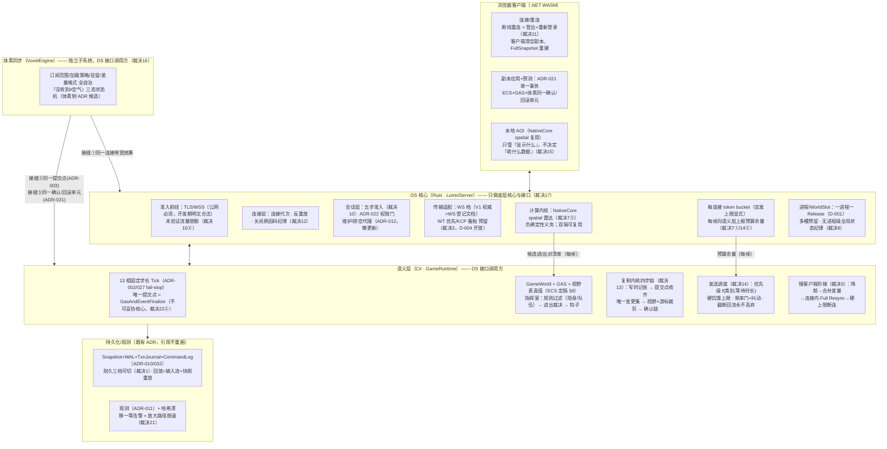
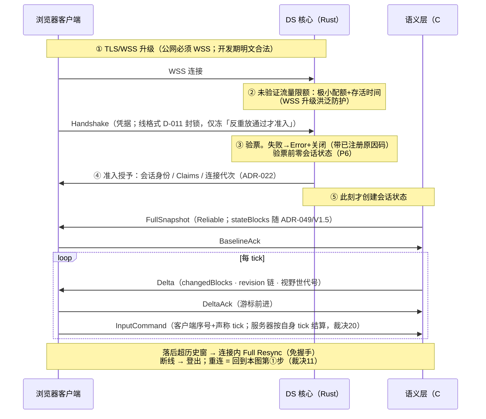
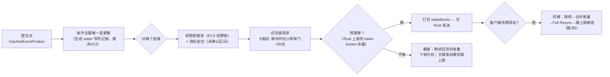

# LumioGameEngine 自研 Dedicated Server 框架架构（定稿）

> **状态**：2026-08-29 定稿。Owner 与服务器引擎总监双方认账；会中逐板裁决流水见 [`2026-08-29-ds-server-architecture-decisions.md`](2026-08-29-ds-server-architecture-decisions.md)（引用记作「裁决 N」）。
> **弹药**：第二波源码级调研 [`docs/research/2026-08-29-ue-dedicated-server-source-analysis/`](../research/2026-08-29-ue-dedicated-server-source-analysis/)（UE 5.8.2，权威）；第一波仅背景。对账基线：ADR-001–049、D-001–016、ECS 架构定稿（2026-08-29）、Architecture v1.4、WS 传输登记。**无任何 Accepted ADR 被推翻；今日零 BaselineId 变更。**
> **裁决规则**：R1 UE 优先+前提检查；R2 性能优先、精简、框架完整、不重要功能后置；R3 DS 边界着色（DS 只做底层核心与接口，上层业务是调用方）。
> **快速模式豁免声明**：本次交付为纯文档（架构定稿 + 会中流水），按 AGENTS.md 快速模式白名单收口（lint + 测试），不派 reviewer。

---

## 1. 分层总图（定稿）

一句话主轴（老王挖方块）：浏览器发一条带序号的 InputCommand → Rust 门卫验票入筐 → C# 固定步长 tick 在**唯一提交点**结算并顺手记下「哪儿变了」（全服只算一次）→ 按每人视野表与游标各自打包 → Rust 按每人 token bucket 发出；发不完的不丢、回流下帧升权。

## 2. 一次连接建立（时序图定稿）

## 3. 一次发送循环（流程图定稿）

## 4. 模块职责与对外契约表

| 模块 | 归属 | 拥有 | 对外契约 | V1 档位 |
|---|---|---|---|---|
| 准入前线/连接层 | DS(Rust) | TLS 终结点、未验证限额、连接代次、关闭原因码 | 五步准入时序；「验票前零会话状态」；关闭必带已注册原因码、单一路径 | V1 必须 |
| 会话层 | DS(Rust) | 准入门执行（ADR-022）、维护/排空代理（ADR-012） | 准入授予（身份/Claims/代次）；MaintenanceKick；懒更新 | V1 必须 |
| 传输适配 | DS(Rust) | WS 档实现；档位登记 | envelope+transportPolicy（尺寸全参数化）；交付语义按 mapping 声明兑现 | V1=WS；WT/KCP 预留 |
| 预算与发送 | DS(Rust) | token bucket（突发上限显式）、发送执行 | 每帧预算余量上报（Rust→C#） | V1 必须 |
| 计算内核 | DS(NativeCore) | spatial 雷达（粗筛候选对） | 候选进/出对清单（每帧，确定性义务）；双端可复用 | V1 必须 |
| 进程/WorldSlot | DS(Rust) | 一进程一 Release、单槽运行、多槽预留 | 无进程级全局状态纪律 | 多槽=预留 |
| Tick 与提交点 | GameRuntime | 13 相、fail-stop、唯一提交点 | 既有 ADR-002/027（不可妥协核心） | V1 必须 |
| 复制内核 | GameRuntime | 四步链、变更集、游标、历史窗口 | ADR-005/028/045/049；stateBlocks | V1 必须（依赖 V1.5 批次） |
| 发送调度 | GameRuntime | 优先级/饥饿上限/回流队列/慢客户端阶梯 | 三处回流队列统一纪律 | V1 必须 |
| 视野真值 | GameRuntime | 视野表、进出裁决、钩子（ECS 定稿件） | ECS ADR 候选 5；客户端 AOI 不得决定数据可见性 | V1 必须 |
| 体素同步 | VoxelEngine | 订阅/加载/驻留/差量/三态状态机（自治） | 三接缝：同连接带宽统筹、同提交点（ADR-003）、同确认单元（ADR-021） | V1 必须（MVP 关键路径） |
| 持久化/回放 | Runtime+Host | Snapshot/WAL/CommandLog、耐久三档 | ADR-010/032；回放=输入流+快照 | 机制 V1；工具后加；观战 P2 |
| 观测 | 全层 | 哈希漂移告警、放大路径限速 | ADR-011；免带宽调试通道预留 | V1 最小面 |

## 5. 冻结语义清单

每条落点见括号；全部对应裁决流水（详见流水文件）。

1. 回放 = 输入流 + 快照重放，不录网络流量；耐久三档运行时可切（D-005 域 + ADR 候选「耐久档」；裁决 1）。
2. 不自研密码学，加密归传输档；公网必须 WSS（设计文档；裁决 2）。
3. diff 一次、分发多次；每连接只有游标；写时记账由生成 setter 承担（设计文档写死；裁决 4/13）。
4. 慢客户端阶梯：降频→合并差量→连接内 Full Resync→硬上限断连；硬上限兼任 DoS 保护；事件类消息独立设界（ADR 候选「发送调度」；裁决 5）。
5. 复制字段值不得依赖观察者；身份归准入上下文、可见性归 mapping 声明（设计文档写死；裁决 6）。
6. Rust=连接与字节+计算内核，C#=语义与真值；AOI 粗筛入 Rust（NativeCore spatial）、真值留 C#；预算余量与候选对清单为每帧接缝（裁决 7/15）。
7. 一进程一 Release；多槽预留；无进程级全局状态；懒更新=ADR-012 既有（裁决 8）。
8. 交付语义按 mapping 声明、传输档兑现；尺寸上限全参数化（裁决 9）。
9. 准入五步；验票前零会话状态；未验证流量限额（ADR 候选「会话与准入」；裁决 10）。
10. 断线重连 = 双端登出+重新登录；会话保留窗口为预留位（裁决 11）。
11. 关闭必带已注册原因码、禁止裸断连、单一关闭路径；两端策略可不同（裁决 12）。
12. 优先级 f(类别,等待时长) + 硬饥饿上限 + 频率门/抖动 + 突发上限显式 + 回流纪律（裁决 14）。
13. 体素同步独立自治 + 三接缝（同连接/同提交点/同确认单元）；「没收到≠空气」三态状态机（VoxelEngine 域 ADR 候选；裁决 16）。
14. 对表扣 RTT/2 + 丢离群样本（ADR 候选「时间同步」；裁决 18）。
15. 服务器绝不用客户端的钟；异常行为记账升级；信任边界集中策略表（裁决 20）。
16. 哈希漂移一等告警；放大输出路径限速（ADR-011 域；裁决 21）。

## 6. P1–P12 逐条过账表

| # | 原则（第二波 T18.1） | 裁决 | 落点 |
|---|---|---|---|
| P1 | diff 一次、分发多次 | **采纳** | E（裁决 4/13） |
| P2 | token bucket + 截断回流，永不丢弃 | **采纳**（突发上限显式化） | F（裁决 14） |
| P3 | 可靠性属消息层且必须有降级 | **改造后采纳**：V1 全可靠传输下降级形态改为「慢客户端阶梯」；自建 ack 窗口推迟到 WT 档 | F/I（裁决 5/9） |
| P4 | AOI 是带滞回的连续判定，事件是派生物 | **采纳**（与 ECS 视野表天然同构；雷达/指挥室分离） | G（裁决 15） |
| P5 | 单校验和+精确匹配，多版本交给会话/网关层 | **采纳**（D-007 既有；多版本=Pool 层 ADR-012） | D/A（裁决 8） |
| P6 | 无状态准入，状态分配推迟到验证后 | **改造后采纳**：cookie 本体不需要（TLS+限额替代），原则保留 | D（裁决 10） |
| P7 | 预测三条件（输入可重放/步长一致/差量可量化） | **采纳**（三条件全备，预测结构成立） | J（裁决 20） |
| P8 | 时间同步至少 RTT/2 校正+离群剔除 | **采纳**（UE 纯反面教材） | B（裁决 18） |
| P9 | 复制节拍与模拟节拍解耦（频率门+抖动） | **采纳** | F（裁决 14④） |
| P10 | 录像=输入流+状态快照 | **采纳** | K（裁决 1） |
| P11 | 连接与会话身份分离、会话可恢复 | **改造后采纳**：分离已既有（连接代次/会话概念）；「恢复」按 Owner 裁定降为预留位 | D（裁决 11） |
| P12 | 畸形输入显式分层，两端策略可不同 | **采纳** | D（裁决 12） |

**无处安放的原则：0——图无洞。**

## 7. 「UE 没解决、我们必须自己解决」清单处置（T18.5）

| 项 | 我们的答案 |
|---|---|
| 断线重连/恢复令牌 | V1 登出+重登（裁决 11）；保留窗口预留位；token 触发条件明确 |
| 会话排空/多版本共存 | ADR-012 既有（懒更新+维护窗口）；无缝迁移未决带触发条件（裁决 8） |
| 确定性（tick/哈希/重放） | 我们的地基而非缺口（ADR-002/027 + ECS 三义务） |
| 未同步区域存在性元数据 | 体素侧三态状态机 ADR 候选（裁决 16） |
| 应用层拥塞→降频联动 | 预算余量每帧上报接缝 + 慢客户端阶梯（裁决 7/5） |
| 大规模离散体素差量 | 体素专线自治：块级差量/整块流送/退化开关 + 三接缝（裁决 16） |

五条坑逐条落点：①截断=丢弃错觉→裁决 14 回流纪律；②每连接影子状态→裁决 4；③可靠队列无降级→裁决 5；④客户端拒收纠正洞→ADR-021 结构性堵死+裁决 20 记账；⑤日志/调试是攻击面→裁决 21 限速。

## 8. 与 ECS 定稿的接缝对账

| 接缝 | 对账结果 |
|---|---|
| 一帧四步「发货」 | = E 四步链：变更集在提交点后取样、预算截断、回流点即待发集（裁决 13/14）✓ |
| 唯一结构提交点 | E 取样点、K 快照切点、J 确认边界、H 体素提交全部锚在 GasAndEventFinalize（互检通过，裁决 22①）✓ |
| 状态哈希降级 | DS 侧以「哈希漂移一等告警」部分对冲（裁决 21）；ECS 定稿保留意见与收敛证据照旧有效 |
| 视野关系契约 | DS 不画第二套 AOI，直接消费视野表；与 P4 同构确认（裁决 15）✓ |
| 确认/回滚单元 | 网络确认边界与 ECS+GAS+体素单元同边界（ADR-021；H 接缝③）✓ |
| 引用与欠条 | 沿用 ECS §7.1（欠条/墓碑/降级）；跨 AOI 进出补发由视野世代号+全量条目集覆盖（ECS §6.3 第 4 条），DS 侧零新增 ✓ |
| Kill criteria | 见 §10，DS 自有证伪出口 ✓ |
| 计数器 | 五个（tick 号/revision 链/视野世代号/句柄世代号/连接代次），今日零新增（裁决 22①）✓ |

## 9. 分歧、保留意见与委托记录

1. **总监保留意见（裁决 11）**：浏览器刷新=断线高频发生；若「重登全量」体感差，会话保留窗口是第一顺位优化（协议零改动）。收敛证据 = MVP 实测重连耗时/流量。
2. **警惕记录（Owner 要求，裁决 5）**：合并反压只对状态成立；事件面与 UE 同处境——解封 D-009 时必须独立设界。
3. **Owner 委托项**：F 调度细节（裁决 14）、B 参数（裁决 18 数值）由总监裁量；人话版结论已回读确认。
4. **不可妥协核心 = 提交点+确定性 tick**：总监裁定（Owner 定稿授权下采用推荐项），Owner 可随时改指，翻案零成本（裁决 22②）。
5. ECS 定稿两条既有保留意见（哈希降级、可见性泄露面）不因本定稿改变，收敛证据照旧。

## 10. 路线证伪出口

**垂直切片（MVP，跑通=路线成立）**：两个浏览器客户端 WSS 登录同一体素世界 → 挖/放方块实时互见（依赖 ADR-049/V1.5 批次落地）→ 断线重连（登出+重登全量）→ 视野边界抖动不炸（双半径）→ 切后台标签页触发慢客户端阶梯而不误踢 → 崩溃恢复（MVP 耐久档）→ 双端状态哈希对账通过。

**Kill criteria（信号出现 = 承认失败、走退路，不硬扛）**：

1. C# 打包热路径过不了 ADR-016 性能关 → 下沉 native，边界不动（裁决 7⑤）。
2. WSS 可靠流延迟实测不达标（位置流卡顿明显）→ 启 WebTransport 档（裁决 3）。
3. 重连「登出+重登全量」体感/流量超标 → 启会话保留窗口；仍不够再评估 resume token（裁决 11，逐级带触发）。
4. 日志开销实测超 1% tick 预算 → 降耐久档（裁决 1）。
5. 双端哈希频繁不一致且单次定位超一天 → 触发 ECS 定稿保留意见①的对账工具升级回图。

**回图触发条件总表**（非日期，全部是信号）：多局小世界产品形态→开 WorldSlot 多槽；原生客户端立项+延迟不达标→WT/KCP 档；第一个状态表达不了的需求→解封 D-009；对外网测/安全审计→冻 D-011；产品要求不停服→无缝迁移 ADR；PvP 掉线逃逸/角色留场需求→会话保留窗口；重进视野流量超标→缓存补差；首次线上排障→免带宽调试通道；插值/预测体感问题→时间同步 ADR 提前。

## 11. ADR 候选清单与 D 表变更建议

**ADR 候选（按优先级；一律不占号，落笔时重核最高号）**：

1. **DS 会话与准入契约**：五步准入、未验证限额语义、连接代次、关闭原因码纪律与重量级码增列（ConnectionTimeout / ProtocolViolation / InputRateExceeded / SendBufferOverflow / NormalLogout）。refine ADR-001/022 域。
2. **复制发送调度契约**：变更集历史窗口、慢客户端阶梯、优先级形状、突发上限显式、三处回流队列纪律、信任边界集中策略表。refine ADR-005/016 域。
3. **体素客户端 chunk 状态机**（VoxelEngine 域）：没要/在路上/到了、渲染判定禁令、差量-整块退化开关。refine ADR-024/035。
4. **耐久档位 profile**（D-005 域确认件）：完整/异步/仅快照三档 + 丢失边界声明。
5. **时间同步语义**：RTT/2 校正 + 离群剔除 + 报文捎带方式。
6. **预留位登记**（不占号，写入本定稿即可）：会话保留窗口、WT 传输档、免带宽调试通道、WorldSlot 多槽、chunk 缓存补差。

**D 表变更建议**：D-002/D-007/D-009/D-011/D-012 **全部维持零改动**（各带触发条件，见 §10）；D-004 维持开放并记录「WT 优先/KCP 备胎」倾向；D-005 建议按耐久三档走 Confirmation Record。**今日零 BaselineId 变更**；唯一在途基线事件仍是既有 ADR-049 的 V1.5 批次。

## 12. 对第二波报告的反向意见（下轮调研提示词据此修）

1. **P3 的「自建 ack 窗口」在 V1 无工作项**——报告默认不可靠传输必然存在；我们 V1 全可靠，该项推迟到 WT 档。下轮传输类调研提示词应写明「V1 传输=全可靠 WSS」。
2. **18.4「必须重造：包层交付抽象/连接句柄接口」在本仓成本≈0**——Envelope/mapping/transportPolicy 已先在。教训与 ECS 定稿附录 B 相同：**下轮外部调研提示词必须附既有 ADR 索引摘要**，避免分析员重复设计已冻结面。
3. **T18.7「多 ReplicationSystem 预留应早规划」降级**——我们的多世界=宿主层 WorldSlot 多槽，复制系统天然 per-World，无需 Iris 式引擎内多实例预留。
4. **免带宽调试流（DebugData）**接受为预留位而非 V1 项——分析员不知我们的 MVP 阶段约束；建议正确、优先级判断由本仓修正。
5. 报告十大发现与五条坑**全部被采纳或有落点**，无被推翻条目；CW-01（影子状态勘误）直接改写了本图 E 模块的成本模型——本轮调研对架构决策的贡献成立。
