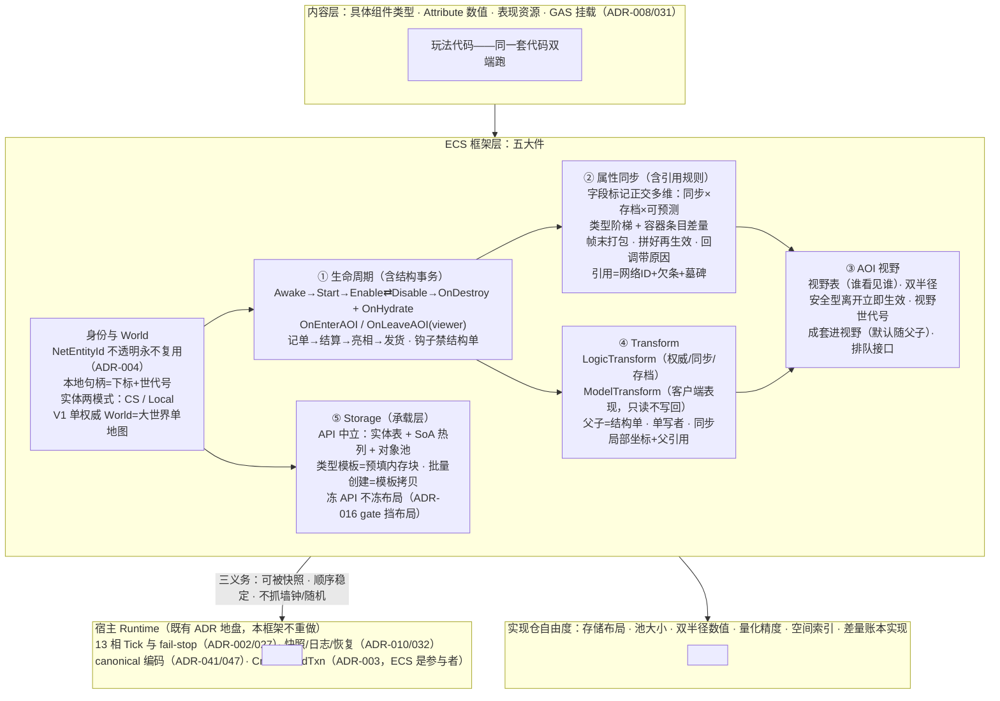
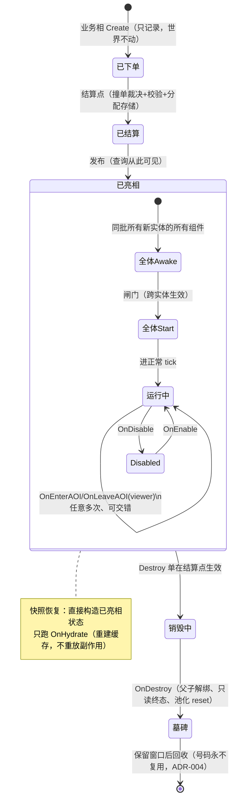
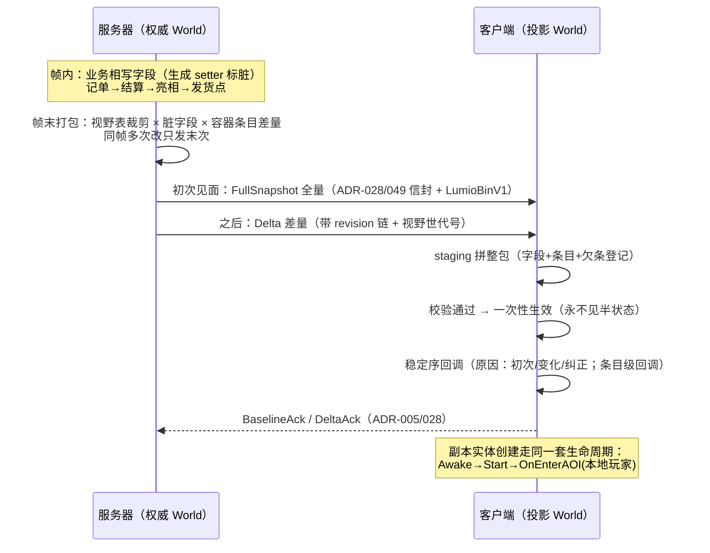

# LumioGameEngine ECS 架构设计（定稿）

> **状态**：2026-08-29 定稿，Owner 与架构总监双方认账。本文档是自研 ECS 的唯一架构框架源；实现细节（存储布局、参数数值）归实现仓自由度；机器化契约按「ADR 候选清单」逐条落 ADR（本文档不占号）。
> **调研依据**：`docs/research/2026-08-29-ecs-framework/`；对账基线：ADR-001–049 与 D-001–016，无任何 Accepted ADR 被推翻。

---

## 1. 定位与设计原则

- **学名**：**Active-Component ECS Hybrid**——对象组合、组件可带逻辑，ECS 机制（身份、存储、查询、结构事务、同步）做底座。
- **设计原则**：清晰易懂、简单、第一性原理——概念数量压到需求下限、不越过；目标是**简单、稳定、可用、性能好、生命周期完善**。
- **承诺**：稳定身份、World 隔离、查询、结构事务、声明同步、有界预测、可回放可对账（对账能力由技术栈整体提供，ECS 出 §3.4 三条义务的份）。
- **明确不承诺**：任意组件对象图自动获得 DOD 性能（性能承诺由 ADR-016 benchmark gate 承载，不由名字承载）；运行时反射式同步（编辑器反射除外）；字段级 undo（沿用整帧快照+日志，ADR-027）；跨 World 裸对象引用。

**框架范围 = 五大件 + 实体两模式 + 对宿主三义务，其他不管。五大件整体是最低标准，一件不可砍；任何裁剪必须重开架构会议。**

五大件：① 一套代码双端跑；② 完整生命周期（结构事务是它的内脏）；③ 完整属性同步（引用规则是它的内脏）；④ AOI 视野；⑤ Transform 组件。

## 2. 核心概念与词表

**全框架规范词汇只有 10 个；新增词汇必须先回答「能不能不加」：**

| 词 | 一句话定义 |
|---|---|
| **World** | 实体的容器与边界。服务器一个（权威），客户端一个（投影），各存各的 |
| **Entity** | 一个身份。网络身份不透明、永不复用；本地句柄只在本 World 有效 |
| **EntityType** | 实体类型：创建时按类型一次绑定整组组件 |
| **Component** | 能力单元，可带数据与逻辑 |
| **System** | 批处理与跨实体规则的容器 |
| **Tick** | 固定步长逻辑帧，13 相推进（ADR-002），出错整帧作废（ADR-027） |
| **结构事务** | 创建/销毁/增删组件：业务逻辑只「下单」，帧内固定位置统一「上菜」，之后新实体才「亮相」 |
| **复制** | 服务器状态自动同步到客户端——声明即同步 |
| **视野 (AOI)** | 服务器上「哪个玩家看得见哪个实体」的关系表；视野范围与规则（半径/遮挡/队伍）是算出它的输入 |
| **表现 (Presentation)** | 客户端的模型/特效/音频资源，不进模拟、不进哈希 |

- `Scene`、`Space`、「兴趣」不是规范词。术语采 **AOI**（行业通用），不采 ROI。
- **地图实例由 World 承载**：V1 大世界单地图 = 单权威 World；客户端单投影 World，两边经网络身份映射。服务器地图数据加载 = 已冻结的 voxel chunk streaming（ADR-024/035/036），不存在「整图加载」。
- **实体两模式**：**CS 实体**（双端都有，默认，占网络身份）/ **Local 实体**（纯本端：斧头上的特效载体、UI 假人——无网络身份、不同步、不进视野表、不存档）。

## 3. 分层总图

### 3.1 三线分界

**框架层**拥有机制契约；**内容层**拥有组件类型/数值/表现；**实现仓**拥有布局与参数（双半径数值、mask 位宽、池大小、量化精度等一律是实现仓自由度）。依赖单向；Storage 只对结构事务暴露，对外全走句柄。

### 3.2 与宿主的关系

- ECS 结构事务是 ADR-003 CrossWorldTxn 的**参与者**（固定次序 VoxelCommit → EcsCommandBufferCommit），框架不自设协调者。
- 13 相 Tick、fail-stop、快照/日志/恢复、canonical 编码全是 Runtime 既有 Accepted ADR 的地盘，ECS 引用不重做。

### 3.3 版本与兼容

在线兼容按 D-007：精确 Release 匹配 + 强制更新，无 N/N-1 窗口——因此未来加概念（如 Space）是干净的 baseline 事件；离线存档迁移归 Runtime 存档域（ADR-010）。

### 3.4 ECS 对宿主的三条义务

不是三个机制，是三条推论，砍掉任何一条都会砸到某个大件：

1. **可被快照**：字段存档维标记即答案（§6.1 四种组合）。砍了它 → 服务器重启全服丢档。
2. **顺序稳定**：结算按（系统 ID + 相位 + 单号，照抄 ADR-002）、遍历按创建序；**查询只有一种模式**（按创建序，天然稳定）。砍了它 → 同一场战斗重算两遍结果不同，预测纠正永远对不上。
3. **不抓墙钟不自建随机**：时间用 Tick 号、随机从框架领；禁 `DateTime.Now`、禁自建 `Random`（编码纪律）。砍了它 → 恢复后 AI 骰子换点数，线上 bug 无法复现。

## 4. 实体、身份与类型

- **网络身份**：128-bit 不透明值，永不复用（ADR-004 照用）；只有 CS 实体持有。
- **本地句柄 = 下标 + 世代号**：`World.Get(id)` 是数组直访不是字典（唯一一张字典：网络 ID → 本地句柄）。世代号防「旧引用指到坑位复用后的新实体」。
- **EntityType 声明**：组件集合、组件间依赖/互斥约束、**出生自带的逻辑子实体**（武器有耐久、宠物有 AI——创建时一单全建）、实体模式（CS/Local）。类型编译期校验：缺必需组件、依赖成环、阶梯外同步类型——全部**创建/编译时报错，不留到运行时**。
- **判断口诀：服务器需要知道它吗？** 需要 → 实体；不需要（刀光特效、模型、音效）→ 不是实体，是表现资源，客户端 Start 后异步加载。

## 5. 生命周期与结构事务

### 5.1 一帧四步：记单 → 结算 → 亮相 → 发货

一帧内所有逻辑（移动、战斗、AI）改世界只「**下单**」——世界暂时不动。帧内固定位置「**结算**」：所有订单先归一化再一口气生效。生效后新实体「**亮相**」：别人才查得到它，它的钩子才跑。全部完成后这一帧的结果才「**发货**」——对快照/复制可见（发货可见点沿用 ADR-027 的 GasAndEventFinalize；四步映射到 13 相哪一格，落 ADR 时对照 Architecture v1.0 §4 定名）。

**同帧撞单裁决表（冻结）**：同帧加又删同一组件 = 抵消（钩子不跑）；创建又销毁 = 从没亮相、不占网络身份；同帧两次换爹 = 后单赢 + 查环拒绝；先后顺序按 ADR-002 已冻结的（系统 ID + 相位 + 单号），不新造。

**亮相屏障**：没亮相的实体，查询查不到、组件读不到——任何人拿不到「建了一半的怪」。

### 5.2 生命周期状态机

### 5.3 八回调契约（钩子长在 Component 上，两端跑同一套）

| 回调 | 时机 | 准做 | 禁做 |
|---|---|---|---|
| `Awake` | 亮相后、同批全体先跑完 | 初始化自己（Attribute 初值、内部缓存） | 创建/销毁实体、访问其他实体 |
| `Start` | 全体 Awake 后，按声明序+依赖序 | 连接他人、存引用、订阅（数据已就位；客户端=服务器数值已应用） | 下结构单；指望别的实体 Start 已跑完 |
| `OnEnable` / `OnDisable` | Enable 轴切换 | 清 tick 订阅等 | 与视野/网络无关，互不牵扯 |
| `OnDestroy` | 销毁结算后 | 清非状态资源；读只读终态 | 下结构单（掉落由击杀系统同帧下单，不写在尸体上） |
| `OnHydrate` | 快照恢复 | 重建缓存（可重跑、纯） | 任何副作用（发奖励、播表现） |
| `OnEnterAOI(viewer)` / `OnLeaveAOI(viewer, reason)` | 视野表变更；服务器 per-viewer、客户端 viewer=本地玩家 | 按观察者做业务 | 当作全局状态用 |

**配套规矩（全部冻结）**：

1. **所有钩子一律不得创建/销毁实体、增删组件。** 出生自带的逻辑子实体写进 EntityType 声明；运行中途才出现的附属物在 tick 业务逻辑里下单（晚一帧出现，接受）；表现（刀光/模型）不是实体，Start 后异步加载。
2. **两道闸门跨实体生效**：同一帧一起亮相的所有新实体，所有组件先全部 Awake，再开始 Start——骑手的 Start 找马时，马的所有组件至少 Awake 完了。跨实体只保证 Awake 闸门；要等对方 Start 完，放自己第一次 tick。
3. **Start 顺序 = 声明顺序 + 可选依赖声明**：默认按 EntityType 声明序；组件可声明「我的 Start 在某组件之后」（同一份声明兼做必需组件校验：挂移动没挂 Transform → 创建时报错）；依赖成环 → 创建时报错。Awake 顺序按声明序排死（Awake 只动自己，顺序语义无关，排死只为回放一致）。
4. **钩子异常 = 整帧作废**（ADR-027 照用：回上一帧快照重建）。推论：钩子内禁止发网络消息/写文件/播特效等不可回滚动作——记 outbox，帧成功收尾后统一执行（outbox 水位线机制归 Runtime，见 ADR 候选 10）。
5. **旧画像的 `OnEnterScene/OnLeaveScene` 由视野钩子取代**；六钩子直线顺序取消——进出视野可发生任意多次，与 Enable/Disable 互不牵扯。客户端副本创建 = 进入本地玩家视野（走同一套生命周期：Awake→Start→OnEnterAOI(本地玩家)）；V1 副本离开视野即销毁（OnLeaveAOI→OnDestroy 连发），「出视野缓存不销毁」留预留位——将来加上时 OnLeaveAOI 照常触发而 OnDestroy 不触发，内容层代码不用改。

## 6. 属性同步

### 6.1 声明：字段标记，正交多维

程序员在组件字段上打标记，**编译期**代码生成器产出同步代码 + 协议清单（每组件/字段一个**永久编号**，删除即退役封存、永不复用；编号登记进 ADR-007 的 ID registry）。标记是三个互不相干的维度，各带默认值，90% 字段零声明：

| 维度 | 取值 | 默认 |
|---|---|---|
| **同步** | Server 专属（不上网）/ 双端同步（可见范围参数：全体｜仅自己｜仅队友…）/ 客户端本地（Local） | `[同步]` = 双端、看得见实体的人都收到；**未打标记绝不上网** |
| **存档** | 进快照存档 / 不存档（=可重建，OnHydrate 义务，lint 可查） | 权威字段默认进（快照与存档是同一套序列化的两个用途） |
| **可预测** | 开 / 关 | 关；开了才有权威/预测双份值 |

四种同步×存档组合都合法：同步+存档（背包）、只存档（AI 仇恨表）、只同步（装备算出的移速终值，恢复时重算）、都不标（受击闪白，崩了就崩了）。敏感字段泄露面由 lint 扫敏感词兜底。同步枚举全集见 ADR 候选 2。

### 6.2 类型阶梯

| 类型 | 同步方式 |
|---|---|
| int / float / bool / 枚举 / 向量 | 变了发新值（字节格式 LumioBinV1，ADR-047） |
| string | 当标量：变了整个重发；**长文本（聊天）不走属性同步，走消息通道** |
| List / Dictionary | 必须用框架容器 `SyncList<T>` / `SyncDict<K,V>`——**裸容器编译报错**；按条目差量同步（§6.3） |
| 嵌套结构体 | 允许，整体当一个值；嵌套超两层编译警告（提示重新建模） |
| 实体引用 | 网络 ID（§7） |
| 阶梯外类型 | **编译报错**——边界必须编译期拒绝，不留运行时静默错数据 |

### 6.3 容器条目差量（六条契约）

1. **写时记账、同帧折叠**：`bag[5]=剑` 记「第 5 格变了」；同帧再改成盾只记末次；加了又删 = 抵消（复用撞单裁决思想）。
2. **帧末只发变更条目**：`改(5格,盾)`、`删(3格)`——没动的 95 格一个字节不发。条目的 value 整体重发，value 内部不再往深处 diff。
3. **与标量同一事务生效 + 条目级回调**：背包 UI 只刷新变的那格。
4. **初次/重进视野/重连发当前全量条目集，不回放历史流水**——离线倒腾 100 次，回来只收最终状态一次。
5. **没人看不记账**：实体对所有人不可见期间条目变更不积流水（防内存涨）；有人来了走第 4 条。
6. **每容器声明尺寸上限**（超限编译报警）。差量的线上字节格式走 ADR（候选 1）。

### 6.4 发送与接收

- **写权限**：只有服务器权威侧写才标脏；客户端应用服务器数据**不回声**；客户端预测写走可预测维的独立通道。
- **发送是帧末统一打包**（不是「变一个发一个」）：三道闸控量——只发变化字段 × 只发视野内 × 同帧多次改只发末次。帧末发送不增加延迟（结果本帧结束才确定）；遮延迟靠预表现（§7.3）。
- **信封直接采用已冻结的 ADR-028/045/049**（FullSnapshot/Delta + stateBlocks 分块 + LumioBinV1 编码），不发明字节。
- **接收拼好再生效**：`血量=0` 和 `状态=死亡` 同一权威帧产生，UI 回调绝不会看到「血量 0 但人还活着」。回调带原因三种：**初次见面 / 普通变化 / 权威纠正**——进视野收到全量不该播受伤动画。
- **Attribute**：同步**权威结果**（当前值+修订号），不同步计算过程；Modifier 内部表默认不同步（GAS 边界，ADR-008/031）；必须同帧到达的字段（血量+死亡态）声明成一致性组。

## 7. 跨实体引用与预测

### 7.1 引用三件套

1. **存身份证号**：组件里的「目标/主人/爹」存网络 ID，不存 C# 对象引用（对象会被销毁、坑位会被池化复用——旧引用悄悄指到新怪，没有任何报错）。用时经 World 解析。
2. **欠条表**：引用的目标还没进视野 → 框架记欠条「宠物欠一个主人，号码 1001」；到货自动接上并通知「宠物，你主人到了」。业务三选一策略：等待 / 默认值 / 不关心。
3. **墓碑**：引用的目标已死 → 查询返回「**他死了**」而不是「查无此人」（对尸体可以放复活术；查无此人才是真错误）。ADR-004 照用。

### 7.2 可预测字段

标了「可预测」的字段（基本是位置、朝向）在客户端有权威/预测双份：服务器纠正时从确认值重算，抢跑的数不许覆盖确认的数。渲染平滑走 ModelTransform（§9），普通字段只有一份。

### 7.3 预表现（最小化，不做改号）

客户端预表现 = 创建 **Local 实体**（纯本端）做特效载体；服务器确认的正式实体走**正常进视野流程**到达（零特例）；GAS 把特效搬到正式实体、销毁本地实体——「对上号」由 gameplay 按上下文自认（「我最近一次开枪」），框架不管。ADR-004/029 的临时号改号协议**保持冻结但 V1 闲置**（它管「联网的预测实体」，V1 不创建此类实体——不冲突、不推翻）。启用触发条件见 §11。

## 8. AOI 视野

视野表 = 服务器上「哪个玩家看得见哪个实体」的关系表；同步、RPC、客户端加载全由这张表驱动。六条契约：

1. **三层各管各**：服务器视野表管「发不发数据」；客户端副本管「实体在不在」；表现管「模型加载没」。可共用距离信号、各自换挡；**模型可以晚于数据（怪先有血条后有模型），不能早于数据（有模型没数据是幽灵）**。
2. **进/出圈双半径**：出圈半径必须大于进圈半径（防边界抖动风暴：站在 30 米整的怪每帧进-出-进-出，每次进都发全量）；数值归实现仓。
3. **两种离开**：性能型（走远）可走缓冲防反复横跳；**安全型（隐身/进迷雾）立即从视野表删除、不走任何缓冲**——服务器多发一帧，透视挂多看一帧。每条离开带原因。
4. **视野世代号**：同一玩家对同一实体每次重新进视野世代 +1；迟到的旧世代包直接丢弃（防重进视野的新副本被旧数据污染）。重连同理（D-012：重连 = 新连接世代、全新握手）。
5. **成套进视野**：默认随 Transform 父子——发骑手前保证马已发（不能看到骑空气的人）；无挂接的跟随（宠物随主人）走显式声明例外通道。
6. **进视野排队**：传送落地 500 个实体不一帧全发；按重要度排队分帧（玩家和攻击你的怪先发、路边箱子后发），**关键实体有饥饿上限**。接口进图；预算数值与调度算法归 DS 专项。

## 9. Transform

**双 Transform 组件都在框架内：**

- **LogicTransform**：逻辑坐标——服务器权威、同步、存档、固定步长推进。
- **ModelTransform**：表现坐标——客户端 Local 域、V1 不同步不存档、表现帧率自由（在两个逻辑帧之间插值、跑动画曲线）。
- 数据流**单向**：插值/动画系统读 Logic 写 Model，永不写回。**任何逻辑判定（碰撞/射程/AOI）只准看 LogicTransform。**

配套契约：

1. **父子记账归 LogicTransform**（父指针+子列表）；解绑在结构事务结算时统一做、顺序排死（不许析构函数里各干各的——遍历中改列表是崩溃根源）。
2. **SetParent 带「随父销毁」选项，默认不随**：父销毁子解绑、保留世界坐标站在原地，不陪葬、不瞬移回原点。
3. **同帧单写者**：一个实体的逻辑坐标同帧只有一只手写（物理接管归物理相，其余归逻辑相）；同帧双写者 = 启动时报错，不是运行时看运气。
4. **换爹不跳位**：SetParent 框架自动重算局部坐标，世界位置不变；瞬移必须显式 `Teleport`——本质是逻辑层喊给表现层的「这次别插值，直接闪」。
5. **网络同步局部坐标 + 父引用**：马跑，马背上的人零流量。父不可见时兜底发世界坐标；量化精度归实现仓。客户端「父」字段就是 §7.1 的网络引用（欠条/墓碑/降级世界坐标）。

## 10. Storage

1. **API 手感不变、永不泄漏布局**：`entity.Get<Transform>().Position`；句柄 = 下标 + 世代号。
2. **参考布局**：实体表（创建序）+ 热数据 SoA 大数组（LogicTransform/Attribute——内存友好、缓存命中）+ 带逻辑组件对象池 + EntityType 预编译模板。
3. **类型模板 = 预填好默认值的内存块；批量创建 = 模板拷贝，一等公民 API**：实例化 1000 只怪 = 整块内存拷贝 + 发 1000 个身份证号，拷完改个体差异、各跑 Awake（Awake 只做自身初始化所以便宜）。海量创建的主干道。
4. **冻 API 不冻布局**：实现仓可换布局不动内容层代码；布局上生产前过 ADR-016 性能关（该关挡**布局冻结**，不挡本架构）。

## 11. 未决、预留与回图触发条件

| 项 | 状态 | 触发条件与路径 |
|---|---|---|
| **U-1 副本/多地图（箱庭）** | 未决 | 产品确认要副本的那一刻回图；路径 = 新 ADR 加 Space 概念（SpaceId + AOI 分域 + 进出事件）；D-007 无兼容窗口使其为干净 baseline 事件 |
| 预测改号协议（ADR-004/029） | 冻结但闲置 | 战斗手感实测不达标（近战/射击反馈「粘滞」）→ 启用，协议现成不返工 |
| 容器深层差量 | 未做 | 条目级差量带宽实测超标 → 深层差量 ADR |
| 副本离开视野缓存（不销毁） | 预留位 | 重进视野全量成本实测超标 → 加缓存策略，视野钩子语义不变 |
| 休眠/LOD 复制、全链路 trace 工具 | 预留不实现（V1） | 规模测试前补 |
| Storage 布局冻结 | 未冻 | ADR-016 性能关数据出来 → 回图定布局 |

**保留意见（架构总监，带收敛证据）**：① 状态哈希从「每帧可算」降级为「按需快照哈希 + 顺序稳定义务」——保留「双端漂移排查会更痛」预警；收敛证据 = 垂直切片首次双端不一致的排查耗时，超一天回图升级对账工具。② 可见性默认「看得见就收到」的泄露面（该仅自己未标）——lint 兜底；收敛证据 = 首次安全审计。

## 12. ADR 候选清单（按优先级，不占号——落笔时重核最高号）

1. **容器条目差量的线上编码**：SyncList/SyncDict 差量在 stateBlocks 内的 LumioBinV1 布局。
2. **ECS 字段标记规范**：同步枚举全集 × 存档 × 可预测 × 类型阶梯 × 可见范围 × 一致性组 × 容器上限。
3. **ECS 组件/字段 ID Namespace**：扩展 ADR-007 registry，含永久编号退役封存规则。
4. **生命周期与结构事务契约**：八回调语义、两道闸门、钩子禁结构单、撞单裁决表、四步与 13 相映射表（对照 Architecture v1.0 §4 定相名）。
5. **视野关系契约**：视野表键、世代号、双半径、安全/性能离开、成套进视野、排队接口（refine ADR-005 的 AOI 声明）。
6. **引用与欠条契约**：网络引用解析状态机、欠条表、墓碑查询语义（refine ADR-004）。
7. **双 Transform 契约**：LogicTransform 网络表示/父子结构单/单写者；ModelTransform 客户端域。
8. **Storage 中立 API 契约**：句柄、单模式查询（创建序）、模板拷贝批量创建 API（布局不冻）。
9. **EntityType 声明契约**：组件集、逻辑子实体、依赖/互斥校验、CS/Local 模式。
10. **Runtime 侧：外发 outbox 水位线**（防崩溃恢复后重发奖励，挂 ADR-010/032 域）。

## 13. 验证路线：垂直切片与 kill criteria

**垂直切片**（跑通 = 路线成立）：服务器模板拷贝创建 1000 实体 → 客户端进视野收全量 → 属性增量 + 容器条目差量同步 → 血量+死亡同帧回调 → 视野边界反复抖动不炸 → 马驮人（父子 + 成套视野）→ 崩溃恢复（Runtime 配合）→ 双端同段逻辑同结果。

**Kill criteria 与退路**（任一信号出现 = 承认该维度失败、按退路回图，不硬扛）：

1. 模板拷贝创建路径过不了 ADR-016 性能关且无实现层修复方向 → **热路径下沉 native/纯 DOD lane，API 不动**（冻 API 不冻布局正是为此留的门）。
2. 「组件带逻辑 + 一套代码双端跑」导致双端结果收敛不了（顺序义务做不到）→ **逻辑收拢进 System、组件退化为数据 + 局部方法**（Friflo 双轨先例）。
3. 目标并发下带宽/CPU 超预算数量级 → **降同步粒度、砍视野特性（排队/成套降级），不动架构**。

---

## 附录 A：调研 52 项缺口全数过账（验收 checklist）

| 缺口 | 处置 | 缺口 | 处置 |
|---|---|---|---|
| 1 生命周期正交轴 | §5 视野钩子带 viewer 与 Enable 分离 | 27 RNG/时间协议 | §3.4 义务三 |
| 2 半实体可见 | §5.1 亮相屏障 | 28 hash 编码 | Runtime（ADR-041/047；快照哈希按需） |
| 3 Awake 范围 | §5.3 只动自己 | 29 快照切点+outbox | Runtime（ADR-027/032）+ 候选 10 |
| 4 Start 依赖 DAG | §5.3 声明序+依赖+环报错 | 30 Transform 写者 | §9 单写者 |
| 5 钩子重入 | §5.3 钩子禁结构单 | 31 父变更/循环/父不可见 | §9 |
| 6 钩子失败 | §5.3 整帧作废（ADR-027） | 32 双端视野分离 | §8 三层 |
| 7 OnHydrate | §5.3 | 33 双阈值抖动 | §8 双半径（数值实现仓） |
| 8 组件约束 | §4 依赖校验；互斥→候选 9 | 34 依赖闭包 | §8 成套进视野 |
| 9/10 稳定 ID | §6.1 永久编号（ADR-007） | 35 进视野预算 | §8 排队接口（调度归 DS） |
| 11 Schema 兼容门 | §6.1+D-007；存档迁移归 Runtime | 36 休眠/LOD | 预留不实现（V1） |
| 12 类型版本迁移 | Runtime 存档域（ADR-010） | 37 查询迭代失效 | §5.1 业务相只下单 |
| 13 复制事务原子 | §6.4 拼好再生效 | 38 双查询模式 | 明确不做（单模式创建序） |
| 14 BaselineId/世代号 | §8 视野世代号 | 39 池化重置合同 | §5.3+§10（细则实现仓） |
| 15 连接世代去重 | D-012 已冻结 | 40 managed/native 边界 | §10 SoA 批量+ADR-006 域 |
| 16 脏粒度/mask | §6.4（位宽实现仓） | 41 全链路 trace | 预留不实现（V1） |
| 17 集合操作日志 | §6.3 条目差量（V1 机制）；编码=候选 1 | 42 Schema diff CI | ADR-007 机制已有 |
| 18 回声抑制 | §6.4 应用不标脏 | 43 迁移语料 | Runtime 存档域（可推迟） |
| 19 回调原因区分 | §6.4 初次/变化/纠正 | 44 组件目录 Owner | 团队治理，V1 不做 |
| 20 可见性默认 | §6.1 同步枚举 | 45 多 World 引用 | §2 单 World/端+§7 经 World 解析 |
| 21 跨实体引用 | §7.1 网络 ID | 46 异步注入 | Runtime（ADR-002 已冻结） |
| 22 欠条表 | §7.1 | 47 安全/性能离开 | §8 |
| 23 墓碑 | §7.1（ADR-004） | 48 表现重建合同 | §8 三层+§9 Model 域 |
| 24 预测改号全图 | V1 明确不做（§7.3；触发见 §11） | 49 热更版本切点 | Runtime（ADR-034） |
| 25 权威/预测/渲染分层 | §7.2+§9 双 Transform | 50 反射同步 | 明确不做 |
| 26 canonical 顺序 | §3.4 义务二（ADR-002） | 51 字段级 undo / 52 跨 World 裸引用 | 明确不做 |

**无处安放的缺口：0。** 契约互检结论：四个计数各司其职不混用——Tick（帧号）/ revision（复制链）/ 视野世代号（每次重进视野）/ 句柄世代号（防张冠李戴）；六处模块接缝已核，无互相打架的契约。

## 附录 B：对外部调研报告的修正结论（下轮调研提示词据此修）

1. 报告 P.4.3 信封提案**弃用**——ADR-028/045/049 已冻结且更完整；报告 42 项「必须现在补」约 1/3 在本仓已有落点。**下轮外部调研提示词必须附既有 ADR 索引摘要。**
2. P.3 八状态轴不采纳为 API 形态——语义吸收进「一套端对称生命周期 + OnEnterAOI(viewer) + 视野关系表」。
3. P.3.4 新钩子族命名不采纳——收敛为一对视野钩子，表现事件归 Model 域。
4. 缺口 24「必须现在补」降级为 V1 不做——报告按竞技射击手感假设，本项目是大世界 MMO。
5. 缺口 38 双查询模式不采纳——单模式（创建序）更简，性能由 ADR-016 gate 验证。
6. P.6.4「benchmark gate 挡定稿」修正为「挡布局冻结」——语义冻结与布局选型解耦。
