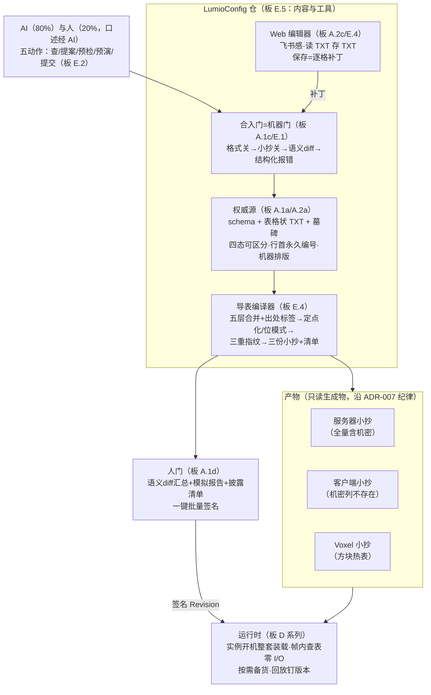
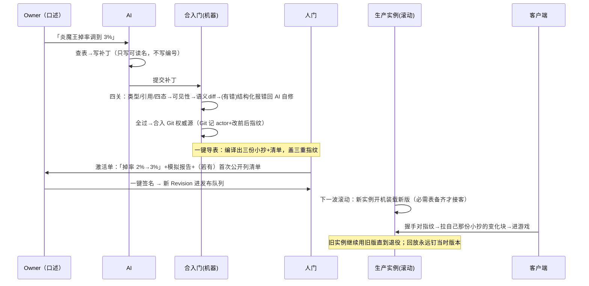
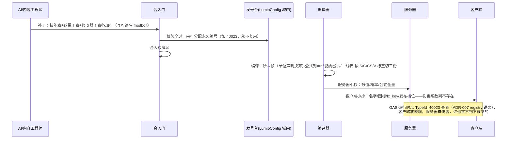

# LumioGameEngine 配表管线架构（定稿）

> **状态**：2026-08-30 定稿。Owner 与引擎架构总监双方认账；会中逐板裁决流水见 [`2026-08-30-config-table-architecture-decisions.md`](2026-08-30-config-table-architecture-decisions.md)（引用记作「板 X」）。本文档是策划配表全链路（权威源→编译→三端读取→版本生效→AI 接口）的唯一架构框架源；参数数值（chunk 大小、压缩算法、缓存容量）归实测/实现仓自由度；机器化契约按「ADR 候选清单」逐条落 ADR（本文档不占号，落笔时重核最高号）。
> **弹药**：配表管线外部调研包 [`docs/research/2026-08-29-config-table-pipeline/`](../research/2026-08-29-config-table-pipeline/)（A–R 18 章、146 条来源，本次唯一外部权威）；Owner 口述运维/协作画像（AI-native、滚动更新、LumioConfig 独立仓，本次第二权威输入）。
> **对账基线**：ADR-001–049、GAS 定稿（2026-08-30）、ECS 架构定稿（2026-08-29）、DS 架构定稿（2026-08-29）、存档定稿（2026-08-30）。**无任何 Accepted ADR 被推翻；ADR-007/010/033/034 骨架寸土未动；ADR-041/047/048（Draft）零修改——配表域浮点规则按 ADR-047 明文授权「由域自开 ADR」落配表 ADR 候选；今日零 BaselineId 变更。**
> **会议原则（Owner 定，沿用 GAS 会）**：①第一性原理，不加需求；②奥卡姆剃刀，如无必要勿增实体；③每条结论配游戏示例与大白话。
> **快速模式豁免声明**：本次交付为纯文档（架构定稿 + 会中流水），按 AGENTS.md 快速模式白名单收口（lint + 测试），不派 reviewer。

---

## 1. 一句话定位与设计轴心

**表是货，管线是物流**：文本权威（Git 里的表格状 TXT）、格式无关内容指纹（换包装不换指纹）、一实例一版本整套装载（滚动更新，无生产热切换）、AI 无激活权（人门签名）。这四条是本管线**不可妥协核心**（收尾三问②，板 Z.2）——护住它们，AI-native、三端防作弊、回放对账全是推论；丢一条，都要单独造机器还债。

大白话主轴：AI 改一格掉率 → 机器门四关自动过、自动合入 Git 权威源 → 你在激活单上看到「炎魔王掉率 2%→3%」和模拟报告，一键签名 → 下一波滚动更新的服务器实例开机装载新版，客户端握手对指纹拿自己那份小抄——**全程没有 Excel、没有人肉核表、没有运行中换表，泄密列压根不印进客户端**。

## 2. 分层总图（定稿）

架构仓管规矩（信封 Schema、指纹与 canonical 规则、ID 命名空间授权、契约校验器，经 ADR 冻结）；LumioConfig 管内容与工具（含授权命名空间内自治发号）；七实现仓只收只读产物（板 E.5）。

## 3. 两条完整时序（定稿）

### 3.1 AI 改一格掉率 → 玩家看到生效

### 3.2 GAS 加一个新技能 → 三端各拿各的

## 4. 阶段 A 定稿：权威源与写路径

| 条目 | 定稿 | 板 |
|---|---|---|
| 权威源 | Git 仓（LumioConfig）内表格状规范化 TXT：schema + 每表数据文件 + 墓碑文件；**无 Excel 源** | A.1a |
| 文本形态 | 类 Markdown 表格（Owner 定）；三纪律：①missing/empty/null/default 四态拼法可区分 ②行首永久编号 ③机器格式化器统一排版（CI 强制） | A.2a |
| 唯一写路径 | AI 与人同走结构化补丁；人不直接改文件（人口述→AI 查→人确认→AI 提补丁） | A.1b/A.1e |
| 合入门 | 机器门：校验全过自动合入，人不逐条审（80/20 画像） | A.1c |
| 生产激活门 | **人门**：语义 diff 汇总+模拟报告+披露清单，一键批量签名；AI 无激活权；开发/测试无门 | A.1d |
| Excel | 回环整体砍掉；触发条件=出现真实 Excel 协作需求 | A.2c |
| 复杂系统表达 | 逻辑归 C# 代码（GAS 定稿 11c），数据归表，**表里无 if**（脚本列/分支列=打回）；一个技能=主表一行+子表若干行经 ref 连接 | A.2b |
| 行身份三层 | 可读名（可改）/永久编号（合入门串行分配、永不复用、墓碑随葬；存档/网络/Replay/GAS TypeId 认它）/版内序号（每版重排、**禁止持久化**）；补丁只写名不写号 | A.3 |
| 字段身份 | 列名之外有字段 ordinal（改名/重排不换号），归 Schema 演进规则，落 ADR 候选 1/3 | A.3 备注 |

## 5. 阶段 B 定稿：编译器与产物

| 条目 | 定稿 | 板 |
|---|---|---|
| 三重指纹 | 内容指纹（逻辑值，格式/压缩无关；热更对账/回放/握手认它；规范形式复用 ADR-041 CanonicalJsonV1）· 包裹指纹（文件字节；下载校验/内容寻址）· 底稿指纹（源+schema；审计，区分明填与默认）。构造规则今天钉死，实现=按规则算 SHA-256 | B.1a |
| 浮点拆弹 | 权威数值列（进权威模拟判定）**禁 f32/f64，一律定点整数**——schema 声明类型+单位/精度，作者照写「5%」「2.5 秒」，编译期换算；纯表现列允许 f32/f64，内容指纹盖 IEEE-754 位模式（按 u32/u64 进 hash），编译期钉死解析、拒 NaN/Inf、负零归一。ADR-041/047 零修改（047 明文授权域自定规则） | B.1b |
| 五层合并 | ADR-010 顺序照抄（Engine→Platform→Server→Product→Environment→User/Session），编译期合并为不可变生效值+每值出处标签；运行时只见合并结果 | B.1c |
| 格式路线 | 第一阶段规范文本产物（每表一块，非全包大文件），且为**永久对账基准**（洞察 10）；二进制决赛名单封闭三家：FlatBuffers+外置索引 / 自研 typed binary 以 LumioBinV1 为原语层 / SQLite 只读（降格特殊表族备选）；Protobuf/Parquet/rkyv 淘汰；今天不选赢家，实测（E.3）定 | B.2 |
| 产物目录 | 采纳调研附录草图为骨架：发布清单→三端投影清单→表描述→块描述 + 安全读取八步；字段细节实现期修，转正走 ADR 候选 4 | B.3 |
| 压缩/内存 | 全部推迟（R.4 可推迟清单）；目录预留 codec 字段与块指纹字段；触发=E.3 实测数据 | B.4 |

## 6. 阶段 C 定稿：三端小抄与作弊面

| 条目 | 定稿 | 板 |
|---|---|---|
| 可见性标签 | 每列「发给谁」标签，S/C/V 任意组合（C、S、CS、CSV…）；**不写默认 S**；表级默认+列级覆盖 | C.1 |
| 作弊面 | 客户端小抄里机密列**根本不存在**（非加密）；泄密不可逆是第一天上机制的理由 | C.1 |
| 披露门禁 | 列首次标 C 必须出现在生产激活单上，人签字前过眼 | C.1 |
| 跨端引用 | 默认编译错误+完整引用路径报错；确需时显式降级为**不可解引用的编号**（API 只传不查） | C.1 |
| 握手 | 各端只核自己小抄根+公共根的指纹；不要求任何端计算它不持有的数据 | C.1 |
| Voxel 边界 | BlockType 表（碰撞/材质引用/光照常量）进公共 Schema/三小抄体系（V 标签）；Voxel 内部物理打包布局维持 adapter-internal，**D-013/014 不重开**——表进体系，摆法自理 | C.1v |
| 双语言读表 | 编译器生成 Rust/C# 只读 TryGet 视图，落 ADR-048 生成面（双目标/声明序）；业务只许用生成 API，禁止直接拆文件；包体进 E.3 必测 | C.2 |

## 7. 阶段 D 定稿：版本生命周期与装载

| 条目 | 定稿 | 板 |
|---|---|---|
| 生产激活 | **滚动更新，无停机内热更**：一份 Revision 绑定服务器实例一生，开机装载、退役不变；Tick 边界切换自动满足（首帧前完成），ADR-010 零冲突；生产换幕机从 V1 砍掉 | D.3 |
| 两条不动的纪律 | ①一实例一版本、整套 Revision 原子（混版本雷拆弹时机挪到开机；滚动窗口新旧并存靠握手指纹配对，连错拒入）②签名人门不动（签的就是下一波滚动的版本） | D.3 |
| 开发 reload | 走同一「原子换版本」原语（攒好新版→帧间隙整套换），跳过签名/人门；语义模板抄 ADR-034 阶段与失败规则；生产不用；升级触发=不能重启的长会话运营或紧急热修 | D.3d |
| 按需下载 | 清单先行，默认表级、超大表切片级；浏览器进游戏下开局包、进副本前备副本包；同一 Revision 内按需，不跨版本混拿 | D.1 |
| 回放 | Replay 记录当时 Revision 指纹并钉住；旧版产物按保留政策留存（防回放 404） | D.2 |
| 查表 API | 帧内 TryGet 同步、零 I/O、绑定当前 Revision；I/O 只在显式「声明+备货」；必需集备齐才放行开机/进场景 | D.4 |

## 8. 阶段 E 定稿：工具链与 AI 接口

| 条目 | 定稿 | 板 |
|---|---|---|
| 机器门四关 | 格式关（类型/引用/四态）→小抄关（可见性/机密引用）→语义 diff（人话，供人门）→结构化报错（哪表哪行哪列/什么错/怎么修；**第一读者是 AI**，自修重提） | E.1 |
| AI 五动作 | 查/提案/预检/预演/提交，封闭集，**无第六动作（激活）**；审计走 Git（actor+改前后指纹+理由）；R.7「现在就能做」全进 V1、「先建基建」排垂直切片后、「观望」明确不做 | E.2 |
| 实测计划 | 二进制决赛入场券四项：百万行内存/浏览器冷启动/双语言同字节点查/生成代码包体；AI 跑、报告落仓；时点=垂直切片后、选型前 | E.3 |
| 工具双件套 | 编辑器（Web/HTML，飞书感，读 TXT 存 TXT，保存=逐格补丁）+ 导表工具（一键编译/导表，产物分发各仓）；导出产物只读不得手改；**一键导表≠激活** | E.4 |
| LumioConfig 仓 | 独立仓库：权威源+编辑器+编译器；架构仓管规矩、LumioConfig 管内容与工具（域内自治发号）、实现仓只收只读产物 | E.5 |

## 9. 冻结语义清单（落点见括号）

1. 权威源=文本、唯一写路径=补丁、Excel 非权威（ADR 候选 1）。
2. 四态 missing/empty/null/default 拼法可区分；默认值编译期应用，运行时只见生效值（ADR 候选 1/3；ADR-033 既有）。
3. 行身份三层；永久编号永不复用+墓碑；版内序号禁持久化；补丁只写名（ADR 候选 2）。
4. 字段 ordinal 稳定，改名/重排不换号（ADR 候选 3）。
5. 内容/包裹/底稿三指纹三分；内容指纹格式无关，复用 CanonicalJsonV1（ADR 候选 3）。
6. 权威数值列定点+单位声明；表现列浮点盖位模式、拒特殊值（ADR 候选 3——即 ADR-047 授权的配表域浮点规则）。
7. 五层合并编译期完成+出处标签（ADR 候选 3；ADR-010 既有顺序）。
8. 可见性标签 S/C/V 组合、默认 S、披露门禁挂人门；跨端引用默认编译错误（ADR 候选 4）。
9. 握手各端只核自己小抄根+公共根（ADR 候选 4）。
10. 一实例一版本整套装载；签名人门；开发 reload 原语按 ADR-034 语义模板（ADR 候选 5）。
11. 帧内查表零 I/O；备货显式；必需集备齐才放行（ADR 候选 5+生成 API 形状）。
12. 回放钉 Revision；旧版按政策保留（ADR 候选 5）。
13. 结构化错误格式、补丁格式、AI 五动作封闭集（ADR 候选 6）。
14. 生成 API 与后端隔离，业务禁触物理格式（ADR 候选 6；ADR-048 生成面）。
15. 暂不冻结：文本方言细节、二进制赢家、chunk/压缩/缓存数字、Unicode 归一化具体形式（全部有落点或触发条件，见 §11/§13）。

## 10. 明确不做 / 推迟清单（收尾三问③，板 Z.3）

| 条目 | 裁决 | 触发条件（无则为「不做」的检验记录） |
|---|---|---|
| AI 自主大范围经济平衡并直接发布 | 不做 | 报告 R.7 标观望；出错无法从万级自动改动中定位事故源——删掉它无任何需求塌 |
| 任意 SQL/条件查询运行时 | 不做 | trace 证明真实查询需求集中出现（报告 R.2「明确可以不做」） |
| 全局列存运行时 | 不做 | Gameplay 点查模式错位（报告 R.2）；分析导出可用列存，另立工具 |
| Excel 双向回环 | 砍 | 出现真实 Excel 协作需求（板 A.2c） |
| 生产不停机热更（换幕机） | 砍 | 不能重启的长会话运营 / 紧急热修需求（板 D.3d） |
| 公共 Schema 容器类型（list/map/nested） | 推迟 | 正规化子表挡不住的真实结构需求出现→按 ADR 流程重开 ADR-033（板 A.2b） |
| Luban 整套采用 | 不采 | AI-native+无 Excel 前提下其「进货」价值段无买家；「出货」段其本来没有（板 B.2 预） |
| 表内逻辑 / 蓝图式 DSL | 禁 | 表里无 if 红线（板 A.2b）；逻辑归 C# 内容代码 |
| 内容寻址块共享实现 | 推迟 | E.3 实测出双版本内存压力；块指纹字段今天已预留（板 B.4） |
| provenance 查询 UI | 推迟 | 元数据今天已留；UI 待运营排查需求（板 B.1c） |

## 11. 调研报告 R.1 十条洞察过账表

| # | 洞察 | 裁决 | 落点 |
|---|---|---|---|
| 1 | 编辑器与权威源拆开 | 采纳并更激进（无 Excel，编辑器只是补丁客户端） | 板 A.1/A.2c |
| 2 | Hash 逻辑值不 Hash 序列化器 | 采纳 | 板 B.1a |
| 3 | 快照=不可变命名空间非对象全集 | 采纳；生产形态因滚动更新进一步简化为实例绑定 | 板 B.3/D.1/D.3 |
| 4 | 表级 lazy、超大表分片 | 采纳 | 板 D.1 |
| 5 | 内容寻址共享是双快照内存关键 | 改造后采纳：身份（块指纹）今天留，共享机制推迟 | 板 B.4 |
| 6 | I/O 赶出 getter | 采纳 | 板 D.4 |
| 7 | 字符串/对象图优先于 codec 优化 | 采纳为实测指标与实现指引，不进今日冻结面 | 板 E.3 |
| 8 | 三端对账比投影不比全量 | 采纳 | 板 C.1 |
| 9 | AI 生产基础=validator+审计 | 采纳（Git 天然承担审计） | 板 E.1/E.2 |
| 10 | JSON 第一期=长期 oracle | 采纳（文本产物为永久对账基准） | 板 B.2 |

## 12. 报告 R.4「第一天定死」不变量清单过账表

| 不变量 | 今日状态 | 落点 |
|---|---|---|
| 独立 schema 权威与字段 ordinal | 已定原则；ordinal 细则落 ADR | 板 A.1a/A.3 备注；ADR 候选 1/3 |
| stable row ID、命名空间、永不复用 | 已定 | 板 A.3；ADR 候选 2 |
| source ID / stable numeric ID / revision ordinal 三分 | 已定（可读名/永久编号/版内序号） | 板 A.3 |
| 四态语义 | 已定原则；拼法细则落 ADR | 板 A.2a；ADR 候选 1/3 |
| 默认值编译期 vs 运行时 | 已定：编译期（五层合并时），运行时只见生效值 | 板 B.1c；ADR-033 既有 |
| 行/列 canonical 顺序 | 已定原则（机器排版+canonical 规则）；排序键细则落 ADR | 板 A.2a/B.1a；ADR 候选 3 |
| UTF-8 与 Unicode normalization | **原则采纳、具体归一化形式今日未钉**——列 ADR 候选 3 必含项 | ADR 候选 3 |
| 整数精确解析与范围拒绝 | 已定（ADR-033 min/max + LumioBinV1 越界拒绝，均既有） | 既有契约 |
| f32/f64 舍入/特殊值/定点分类 | 已定 | 板 B.1b |
| ref 编译期解析与投影规则 | 已定 | 板 C.1 |
| 三 Hash 三分 | 已定 | 板 B.1a |
| projection root 与 shared root | 已定 | 板 C.1 |
| Revision-bound handle | 已定（实例绑定+reload 原语带代际+缓存钥匙含版本） | 板 D.3/D.3d |
| TryGet 不 I/O、Prepare 显式 | 已定 | 板 D.4 |
| 机器可读错误格式 | 已定（格式细则落 ADR 候选 6，参照调研附录示例） | 板 E.1 |
| generated API 与 backend 隔离 | 已定 | 板 C.2 |
| golden corpus 与逻辑 query oracle | 已定原则（文本产物=永久 oracle；双语言 golden corpus 落 ADR 候选 3） | 板 B.2 |
| visibility 元数据与 disclosure 门禁 | 已定 | 板 C.1 |

## 13. 报告 R.8 冻结项摩擦逐条应答

| 冻结项摩擦 | 今日应答 |
|---|---|
| 仅标量+enum+ref vs 复合结构需求 | 正规化子表+ref 堵住（掉落列表/条件数组/公式全是子表实例）；ADR-033 不重开；容器类型进推迟表带触发条件（板 A.2b） |
| Staged/Active 双快照 vs 大表内存 | 生产滚动更新后双快照仅存于开发 reload；快照=清单根非对象全集；块指纹字段预留共享升级位（板 D.3/B.4） |
| Tick Barrier 原子激活 vs async lazy | 生产=开机装载（首帧前天然满足）；开发 reload=必需集备齐才切；帧内查表零 I/O（板 D.3/D.3d/D.4） |
| f32/f64 存在 vs 跨端确定性 | 权威列定点化（进指纹、进模拟）；表现列浮点盖位模式（进指纹、不进权威模拟）；与 GAS 确定性四纪律同向（板 B.1b） |
| Canonical 序列化定义 | 内容指纹=格式无关逻辑值（CanonicalJsonV1 形式）；物理产物另盖包裹指纹，两者永不混同（板 B.1a） |
| 生产未签名拒绝的缺口（回滚/过期/混包） | 人门+滚动+握手根绑定已覆盖主面；防回滚计数/过期/信任链轮换细则列 ADR 候选 4 必含项（借鉴 TUF） |
| 层级覆盖运行时复杂度 | 编译期合并+出处标签，运行时零层级查询（板 B.1c） |
| 默认只能补可选 / 空单元格歧义 | ADR-033 既有规则不动；四态拼法由权威文本形态统一，不由解析库自行判断（板 A.2a） |

## 14. GAS/ECS/DS 接缝对账（白条兑现记录）

| 接缝 | 兑现 |
|---|---|
| GAS 永久编号 TypeId | A.3 三层身份直接覆盖，GAS 零调整（板 S.1） |
| GAS 公式声明/fx_key/覆盖优先级/发布档位/打断策略/存档档位 | enum+ref+正规化子表全覆盖；不为公式开专门类型——公式=ref 指向公式/曲线表（板 S.1） |
| GAS 决议 3c「策划配秒、管线换帧」 | 泛化为 Schema 单位声明通用能力：列声明单位，编译期换算（板 B.1b/S.1） |
| GAS 决议 0.1「Excel 配表直接继承」 | 改写为「配表管线继承」——GAS 消费的是编号与字段能力，非 Excel 本身，零影响（板 S.1） |
| ECS ADR 候选 9「EntityType 声明」 | **边界判断：不是配表**（编译期类型声明，非每 Revision 生成的只读数据，F.7 判据）；ECS 自行开 ADR，不依赖本定稿（板 S.2） |
| DS/Voxel BlockType vs D-013/014 | BlockType 表进公共体系（V 标签）；Voxel 内部物理布局 adapter-internal 不重开（板 C.1v） |
| ADR-010 五层合并 | 顺序照抄，编译期合并+出处标签（板 B.1c） |
| ADR-034 状态机 | 生产不复用（滚动更新无换幕）；开发 reload 原语复用其阶段与失败语义；「一幕」=整套 Revision 非单表（板 D.3/D.3d） |

## 15. ADR 候选清单（按优先级；一律不占号，落笔时重核最高号）

1. **配表权威源与补丁通道**：文本形态三纪律（四态拼法/行首编号/机器排版）、唯一补丁写路径、机器门/人门双门、编辑器保存=逐格补丁。
2. **配表 ID 命名空间与发号**：扩展 ADR-007——配表域命名空间授权、LumioConfig 域内自治串行发号、永不复用与墓碑、版内序号禁持久化。
3. **配表 canonical 语义与三重指纹**：CanonicalJsonV1 复用、行/列排序键、四态拼法、Unicode 归一化政策（今日未钉，此 ADR 必含）、**配表域浮点规则**（权威列定点+单位声明；表现列 IEEE-754 位模式、拒特殊值、负零归一——即 ADR-047 明文授权的域内规则）、双语言 golden corpus。
4. **配表产物容器与投影**：四层目录+安全读取八步、S/C/V 标签与默认 S、跨端引用规则、披露门禁、握手根、签名信任链细则（防回滚计数/过期/混包，借鉴 TUF）。
5. **配表 Revision 生命周期**：实例绑定装载、开发 reload 原语（ADR-034 语义模板）、必需集备齐纪律、回放钉版、旧版保留政策位。
6. **配表工具面契约**：结构化补丁格式、结构化错误格式（参照调研附录示例）、AI 五动作封闭集、导表产物只读纪律。

## 16. 分歧、保留意见与改判记录

- **总监原方案被 Owner 改判（已采纳，无分歧遗留）**：D.3 原提案为「生产 Tick 边界热切换、复用 ADR-034 换幕机」；Owner 给出滚动更新运维画像后改判为「实例绑定整套装载」，总监认可——ADR-010 骨架未动，语义更简（板 D.3）。
- **Owner 主动补设计、总监加护栏采纳**：TXT/类 Markdown 表格权威（护栏：四态/编号/机器排版）；Web 编辑器（护栏：保存=逐格补丁非覆盖）；C/S/CS/V 导出标签（护栏：默认 S+披露门禁）；LumioConfig 独立仓（护栏：架构仓管规矩/域内发号规则由 ADR 冻结）。
- **暂收转正**：A.2b（逻辑/数据分界、表里无 if）、C.2（生成 API 隔离）会中标暂收，本定稿发布即转正；Owner 复核时仍可翻案。
- **保留意见**：A.2a 若标准 Markdown 表格无法表达四态/转义，允许定制方言（「看起来像 Markdown」即可）；D.2 旧版保留时长=运营策略不入契约。

## 17. 路线证伪出口

**垂直切片（三条链全过才算立住）：**

1. **新表链**：AI 新增一张表（含 S/C/V 混合标签列）→ 机器门过 → 编译出三份小抄 → Rust/C#/浏览器各自读到该读的字段，读不到不该读的。
2. **改值链**：AI 改一行数值 → 人门签名 → 开发环境 reload 原子生效 / 模拟滚动：新实例新版、旧实例旧版并存，握手配对正确，回放钉旧版可复现。
3. **AI 链**：AI 走五动作全流程提一个补丁（含一次故意的类型错误被结构化报错打回自修），全程无激活权，Git 审计链完整。

**Kill criteria（触发即回图重议）：**

- Rust/C# 对同一份产物点查结果或内容指纹不一致，且修复需改 canonical 规则 → ADR 候选 3 返工，暂停二进制选型。
- 文本产物在目标浏览器冷启动/内存超预算，且三家决赛候选实测均救不回 → 重开 B.2 格式选型（含重新考虑被淘汰者）。
- 合入门串行发号在 AI 并发提案下冲突率/时延不可用 → ADR 候选 2 发号机制返工。
- 机器门单补丁校验时延达到分钟级、AI 自修循环失速 → 增量编译（R.2 可推迟项）提前启动。

## 18. 收尾三问记录（Owner 确认，板 Z.1–Z.3）

1. **互检**：五阶段契约无打架——浮点规则未动 ADR-033 类型清单；滚动更新与三小抄靠握手指纹咬合；四态拼法进内容指纹规则；补丁写名/门房发号闭环；开发 reload 同受备齐纪律约束。
2. **不可妥协核心**：文本权威 · 格式无关内容指纹 · 一实例一版本整套装载 · AI 无激活权（人门）。任务书预测的「Tick 边界原子激活」在滚动形态下由「整套原子装载」同义实现，ADR-010 未动。
3. **砍单**：见 §10，每条有「删掉它无需求塌」检验或触发条件，无一条是「懒得做」。

## 19. 术语对照表（黑话→大白话）

| 黑话 | 大白话 |
|---|---|
| 投影 / Projection | 小抄——同一张原表按需印出的端专属版本（服务器/客户端/Voxel 各一份） |
| Revision | 一套货——某次发布的全部小抄+清单，整体有一个版本号和指纹 |
| Manifest | 清单——这套货里有哪些表、哪些块、各自指纹 |
| SemanticRootHash（内容指纹） | 菜的味道——数值没变，换什么包装指纹都不变 |
| ArtifactHash（包裹指纹） | 外卖封条——验这个文件在路上没被咬一口 |
| SourceRootHash（底稿指纹） | 厨房小票——当时源上写的啥、哪个值是吃了默认 |
| Canonical | 规范化拼法——同一份数据只有一种合法写法，指纹才稳 |
| IR | 编译器肚子里的统一中间格式，源和产物都从它走 |
| 四态 | 一个格子的四种状态：没这列 / 填了空串 / 明确写「无」 / 没填等默认——拼法必须分得清 |
| 正规化子表 | 列表塞不进一个格子，就拆成子表多行，用编号连回来 |
| TryGet | 帧内查表——只翻已备好的货，绝不现场下载 |
| PrepareAsync / 备货 | 进场景前把要用的表下载解压好 |
| 墓碑 | 删掉的行进坟，编号陪葬，永不复用——三年前的存档才不会认错人 |
| 机器门 / 人门 | 合入自动审（机器）；上生产人签字（唯一人类按钮） |
| 披露清单 | 激活单上「本次哪些列第一次对玩家公开」那一栏 |
| 滚动更新 | 服务器一批批换新版重启，新旧实例短暂并存，玩家按指纹配对连接 |
| 出处标签 / provenance | 这个生效值来自五层里的哪一层（引擎默认？渠道包？活动服？） |
