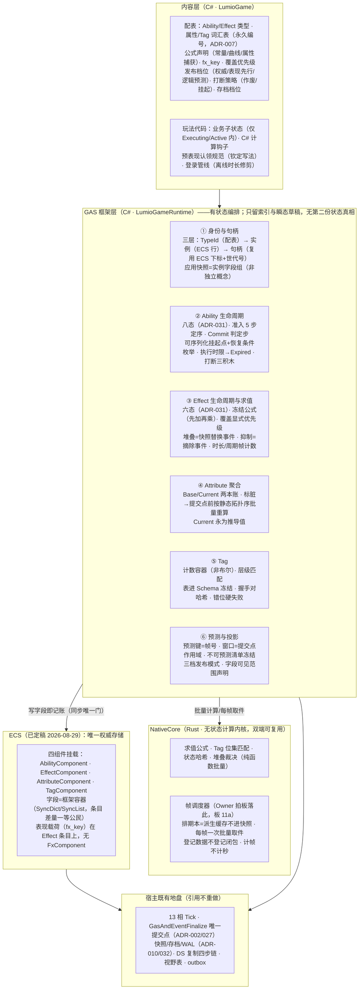
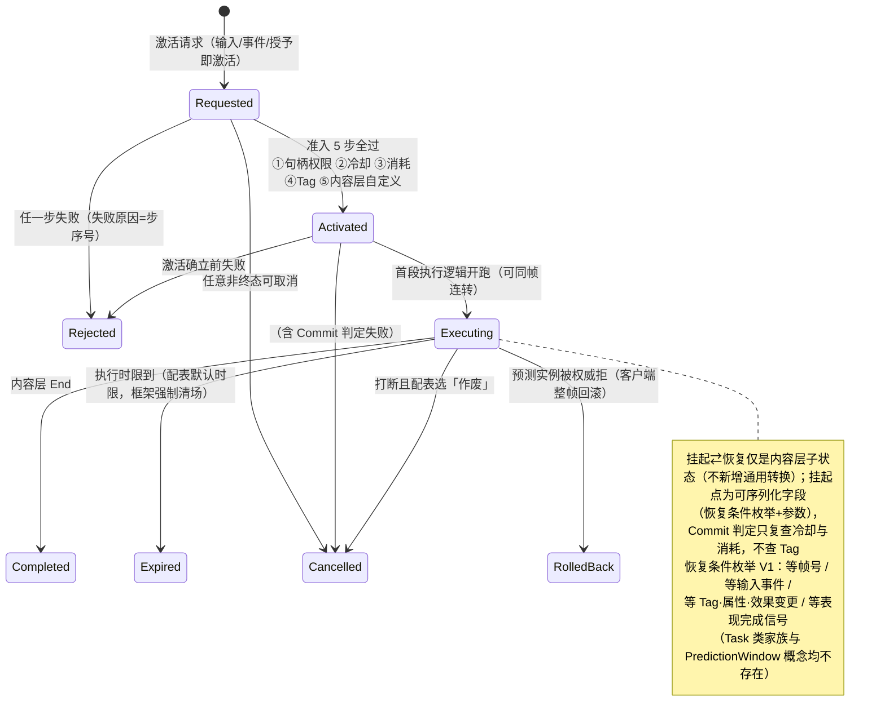
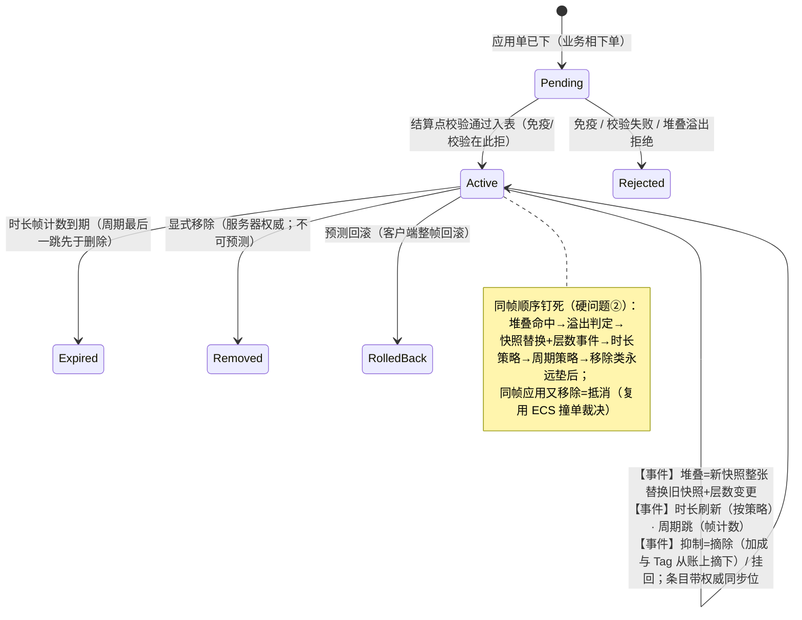
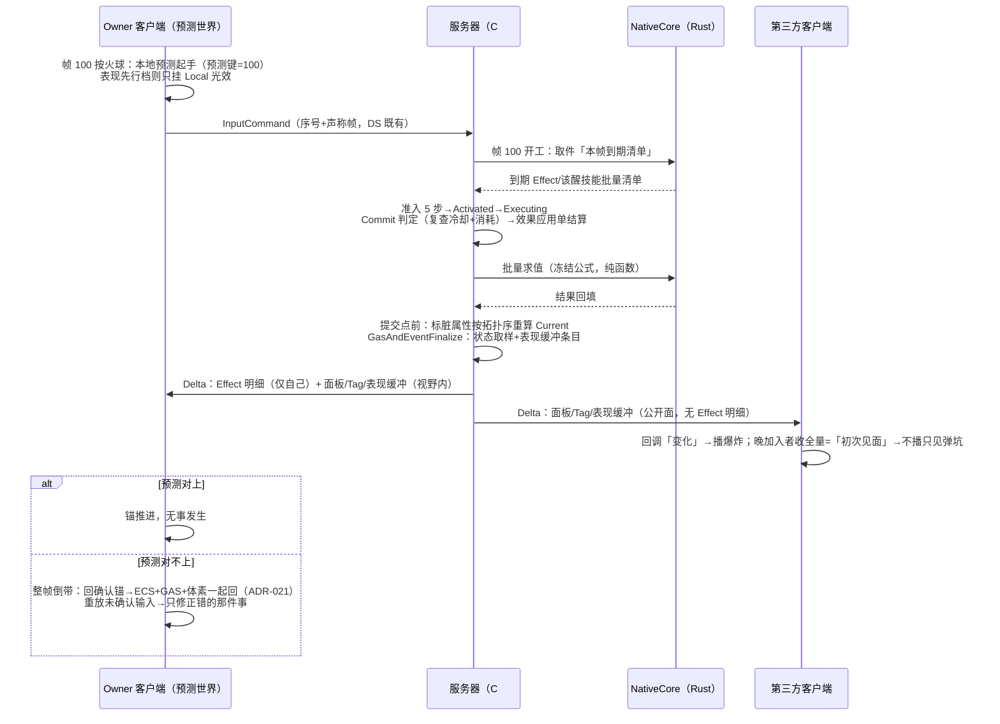

# LumioGameEngine 自研 GAS 框架架构（定稿）

> **状态**：2026-08-30 定稿。Owner 与 Gameplay 架构总监双方认账；会中逐板裁决流水见 [`2026-08-30-gas-architecture-decisions.md`](2026-08-30-gas-architecture-decisions.md)（引用记作「板 N」）。本文档是自研 Gameplay Ability 框架（Ability/Effect/Attribute/Tag/表现）的唯一架构框架源；参数数值归配表/实现仓自由度；机器化契约按「ADR 候选清单」逐条落 ADR（本文档不占号）。
> **弹药**：第二波源码级调研 [`docs/research/2026-08-29-ue-gas-source-analysis/`](../research/2026-08-29-ue-gas-source-analysis/)（UE 5.8.2，124 条坐标级证据，权威）；第一波仅取野心/跨品类/Lyra 补丁；**GAS 2.0 概要设计**（[`docs/plans/2026-08-30-gas-prior-design-reference.md`](../plans/2026-08-30-gas-prior-design-reference.md)，Owner 上一项目实战迭代，本次第二权威输入）。
> **对账基线**：ADR-001–049、ECS 架构定稿（2026-08-29）、DS 架构定稿（2026-08-29）。**无任何 Accepted ADR 被推翻；ADR-008/031 冻结骨架寸土未动（板 0）；今日零 BaselineId 变更。**
> **会议原则（Owner 定）**：①第一性原理，不加需求；②奥卡姆剃刀，如无必要勿增实体；③每条结论配游戏示例与大白话。
> **快速模式豁免声明**：本次交付为纯文档（架构定稿 + 会中流水），按 AGENTS.md 快速模式白名单收口（lint + 测试），不派 reviewer。

---

## 1. 一句话定位与设计轴心

**GAS 是会计，不是仓库**：状态住 ECS（唯一权威存储），账本即条目（Modifier 账本 = Effect 条目的推导视图，不独立存在），求值纯函数（冻结公式 + 静态拓扑序 + 帧计数时间）。这根轴是本框架**不可妥协核心**（收尾三问②，Owner 确认）——护住它，预测、重连、存档、哈希全是推论；丢了它，每条都要单独造机器。

老王打怪一句话主轴：按键即起手（预测）→ 服务器帧内准入五查、效果结算、账本重算 → 唯一提交点 GasAndEventFinalize 取样 → 帧末按视野与可见范围打包下发 → 客户端拼好生效、按「原因」播表现；猜错了整帧倒带重放，掉线了全量快照重建——**全程 GAS 没有一行自己的同步、存档、RPC 代码**。

## 2. 分层总图（定稿）

**语言分界（板 1d，Owner 认账）**：不按「框架/内容」切，按「**无状态计算（Rust）/ 有状态编排与真值（C#）**」切——维持 DS 定稿裁决 7「真值留 C#」。大白话：Rust 当计算器，C# 当账房，账本（ECS）在账房手里。性能退路=ECS kill criteria 1（热路径下沉 native、API 不动）。

## 3. 状态机定稿（ADR-031 冻结态之上标注子结构与触发条件）

### 3.1 Ability 八态（状态名冻结不动；标注为本次新增语义）

### 3.2 Effect 六态（堆叠/时长刷新/抑制全是 Active 内事件）

## 4. 一次技能从激活到复制（时序定稿）

## 5. 模块职责与对外契约表

| 模块 | 归属 | 拥有 | 对外契约 | V1 档位 |
|---|---|---|---|---|
| 身份与句柄 | GAS(C#) | TypeId registry 接入、实例行、句柄校验 | 三层身份；句柄复用 ECS 下标+世代；应用快照=实例字段组 | V1 必须 |
| Ability 生命周期 | GAS(C#) | 八态机、准入 5 步、Commit、挂起点、执行时限、打断三积木 | ADR-031 + ADR 候选 1 | V1 必须 |
| Effect 生命周期与求值 | GAS(C#)+NC(Rust) | 六态机、冻结公式、堆叠序、抑制摘除、帧计数时长 | ADR-031 + ADR 候选 2/5 | V1 必须 |
| Attribute 聚合 | GAS(C#)+NC(Rust) | Base/Current、标脏、拓扑重算 | Current 永为推导值；重算只在提交点前一次 | V1 必须 |
| Tag | GAS(C#)+NC(Rust) | 计数容器、层级匹配、表哈希 | 表进 Schema；握手对哈希；错位硬失败 | V1 必须 |
| 预测与投影 | GAS(C#) | 不可预测清单、三档发布模式、可见范围声明 | 预测键=帧号；回滚单元=ADR-021 | V1 必须 |
| 帧调度器 | NativeCore(Rust) | 排期本（派生缓存） | 每帧批量取件；登记数据 schema；恢复重建义务 | V1 必须 |
| 四组件与 Schema | ECS 挂载 | 组件容器、字段标记 | ADR 候选 3；同步/存档/可见范围逐字段表 | V1 必须 |
| 表现 | 内容层+表现域 | fx_key→控制器、缓存补播策略、预表现认领 | 表现缓冲语义（框架）；认领写法（内容层规范） | V1 必须 |

## 6. 冻结语义清单（本次定稿；落点见括号）

1. 三层身份：TypeId（配表永久编号）→实例（ECS 行）→句柄（ECS 下标+世代）；应用快照=实例字段组（ADR 候选 1/3）。
2. ECS 四组件：Ability/Effect/Attribute/Tag；无 FxComponent，表现载荷在 Effect 条目（ADR 候选 3）。
3. 语言分界：Rust=无状态计算内核，C#=编排与真值（本定稿冻结；维持 DS 裁决 7）。
4. 准入 5 步定序：句柄权限→冷却→消耗→Tag→内容层自定义；顺序=失败提示优先级（ADR 候选 1）。
5. Commit 判定步：只复查冷却+消耗、不查 Tag；失败走 Cancelled，Rejected 只属准入段（ADR 候选 1）。
6. 挂起点=可序列化字段；恢复条件枚举 V1 四种；Task/PredictionWindow 概念不存在（ADR 候选 1）。
7. 执行时限：配表默认时限，超时强制 Expired（ADR 候选 1）。
8. 打断三积木：打断事件/挂起/恢复 API；作废 or 挂起按配表；打断栈不进框架（ADR 候选 1；推迟表）。
9. Interrupt/Block 进框架：先 Block 后 Cancel、激活计数在其后自增；Provide/Source/Target Required 降为配表字段+持续条件重评单一机制（ADR 候选 1）。
10. 求值公式冻结：`(Base+Σ加法)×(1+Σ百分比)`+覆盖；百分比加性聚合（+10%+10%=+20%，Owner 拍板）；V1 三操作符、单通道，扩展 additive（ADR 候选 2）。
11. 覆盖=配表显式优先级、同级后写赢；禁隐式重排（ADR 候选 2）。
12. 时长/周期一律帧计数；策划配秒、管线换帧；周期×抑制补跳=配表策略位（ADR 候选 2/5）。
13. 堆叠同帧序：命中→溢出→快照替换+层数事件→时长→周期；移除垫后；应用+移除同帧=抵消（ADR 候选 5）。
14. 抑制=Active 内摘除事件+条目权威同步位；不新增状态（硬冲突③；ADR 候选 5）。
15. Base/Current 两本账：瞬间改 Base、限时经账本影响 Current；Current 永不落盘、永为推导（ADR 候选 2/3）。
16. 重算唯一时机：提交点前按静态拓扑序批量一次；公式输入声明→编译期拓扑、成环报错；动态求解器维持推迟（ADR 候选 2）。
17. 同步边界字段级：Current+修订号上网；Base 默认不上网；Modifier 账本无独立存在故永不上网；Effect 明细仅自己；表现缓冲/Tag/面板视野内全体（ADR 候选 3）。
18. Meta Attribute 不进框架词表（内容层模式，框架不认识）。
19. Tag 计数容器+层级匹配；表进 Schema、握手对哈希、错位硬失败；压缩=实现仓（ADR 候选 4）。
20. GAS 零自有同步：写字段即记账是唯一门；瞬时表现走「表现缓冲」容器（帧号+fx_key+参数，N 帧自清；回调原因防重播）；不解封 D-009（ADR 候选 3）。
21. 预测键=帧号；窗口=提交点作用域；回滚=整帧快照+确定性重放（ADR-021 单元）；服务器永不回退（ADR 候选 7）。
22. 不可预测清单：Effect 移除、周期跳动、出模拟域动作（outbox）；预测面：激活/挂起推进/属性/Tag/表现（ADR 候选 7）。
23. 三档发布模式=既有机制上的声明档位：纯权威/表现先行（Local 实体）/逻辑预测；防重入义务由框架重放吸收（ADR 候选 7）。
24. 确定性四纪律：禁墙钟、禁全局变量（求值上下文显式传参）、定序求和、随机从框架领；战斗公式禁超越函数（进曲线表）（ADR 候选 2）。
25. 哈希双域：服务器快照哈希盖全量权威；双端对账哈希只盖同步域；客户端预测值不进哈希；表现缓冲不进哈希不存档（硬冲突①；ADR 候选 3）。
26. 存档口诀：存源头不存推导、存凭证不存面板；装备效果不落盘（存穿戴栏重应用）；限时 buff 三档：下线即清/下线暂停（剩余帧）/离线倒计时（登录管线墙钟修剪，墙钟不进模拟）（ADR 候选 3）。
27. 帧调度器落 NativeCore（Owner 拍板）：批量取件接缝、派生缓存不进快照、登记数据不登记闭包（ADR 候选 6）。
28. 崩溃恢复 V1 只承诺回最近快照点（耐久档位既有）；重连走网络同步域与持久化无关；存档归 ECS/Runtime，GAS 字段只打标记（板 10a/10d）。

## 7. 明确不做（UE 深耦合清场，S16.4/S16.6 坐标齐全）

① delegate 注册式撤销（帧快照+提交点替代）② UObject 属性宿主+OnRep 重算 ③ FTimerManager 墙钟时间源 ④ 进程级全局计数器句柄 ⑤ RPC 事件层（状态投影替代）。

## 8. 七项已知待解硬问题——逐条答案

| # | 硬问题 | 答案 | 板 |
|---|---|---|---|
| ① | 类型ID/实例ID/句柄三层 | 三层成立：TypeId（配表）/实例（ECS 行）/句柄（下标+世代）；UE 的 Spec 降为实例字段组 | 1a/1b |
| ② | 堆叠/时长/取消先后 | 命中→溢出→快照替换→时长→周期；移除垫后；同帧撞单抵消 | 3d |
| ③ | Modifier 求值顺序 | 冻结公式先加再乘、加性聚合、覆盖显式优先级；单通道三操作符 | 3a/3b |
| ④ | 预测键机制 | 不发小票，帧号即键；确认/拒绝随权威帧状态到达（DS 既有链） | 8a |
| ⑤ | 确认/拒绝/回滚窗口边界 | 窗口=提交点作用域；回滚=整帧快照+重放；ECS+GAS+体素同单元；服务器永不回退 | 8b |
| ⑥ | Ability 状态与 ECS 单一真相 | 状态全住四组件容器；账本=条目推导视图；GAS 只留可丢草稿；「GAS 发起同步」不存在 | 10c/10e |
| ⑦ | 快照与状态哈希投影 | 哈希双域；存档跟字段标记走；派生缓存（排期本/求值计划）不进快照、恢复重建 | 10b/10d/11a |

## 9. S16.1 十条源码级洞察过账表

| # | 洞察 | 裁决 | 去向 |
|---|---|---|---|
| 1 | 通道内公式先于通道间顺序 | **改造后采纳** | 公式冻结进 Schema+浮点规范；V1 收敛单通道（语义 10） |
| 2 | 乘法修饰是加性聚合 | **采纳**（Owner 拍板） | 语义 10 |
| 3 | 句柄是进程级身份（反面） | **采纳教训，改造形态** | 未用（世界,实体,代数）三元组字面形态——复用 ECS 句柄+World 隔离（反向意见 1） |
| 4 | 撤销注册制 vs 日志制、中间形态更近 | **采纳分析，拒绝中间形态** | 直接整帧快照（ADR-021 成本已付；反向意见 2） |
| 5 | 两阶段确认依赖复制声明顺序（暗契约） | **采纳教训** | 显式阶段=帧号+修订号，无任何声明顺序暗契约 |
| 6 | Epic 预测四洞=乐观收敛结构边界 | **采纳** | 四洞在整帧模型结构性关闭；Effect 移除仍冻结不可预测（语义 22） |
| 7 | 摘除式抑制 | **采纳** | 语义 14 |
| 8 | 客户端缓存对账、不信事件序只信状态 diff | **采纳** | ECS「拼好再生效+回调原因」即其结构化形态（语义 20） |
| 9 | Iris 序列化器清单=线协议结构清单 | **部分采纳** | Schema 设计输入参考，无直接机器 |
| 10 | 纯数据机制/世界机制切测试 | **采纳** | Rust 内核+C# 纯函数层天然可单测 |

## 10. S16.4 不可照搬清单过账表

| 项 | 处置 |
|---|---|
| delegate 注册式撤销 / UObject 属性宿主 / FTimerManager / 进程计数器 / RPC 事件层 | **清场①–⑤处理**（第 7 节） |
| FastArray+复制回调 | 架构已吸收：ECS 容器条目差量替代 |
| PredictionKey 定向序列化（报告评「可直接借鉴」） | **不借**——预测值根本不上网（反向意见 4） |
| Tag NetIndex 两段压缩 | 语义可抄，压缩=实现仓（板 6c，Owner 委托） |
| CanActivate 九步+失败 tag | 改造采纳为 5 步，相对顺序保留（语义 4） |
| 通道求值算式 | 采纳（语义 10） |

## 11. GAS 2.0 十四条决策终裁表

| # | GAS 2.0 决策 | 终裁 | 理由/去向 |
|---|---|---|---|
| 1 | Effect 与 Cue 合并 | **改造后继承** | 一个概念、两种投影：持续=状态可补，瞬时=表现缓冲不补（语义 20） |
| 2 | Effect 仅同步 owner，Tag/Attribute 广播 | **架构已吸收** | 降为字段可见范围声明（语义 17） |
| 3 | 第三方客户端不跑 Ability | **直接继承** | 与 S16.2 状态/事件二分同向 |
| 4 | 实例化默认按 Entity | **改造后继承，砍到一种** | 纯数据+模板默认值自动 reset，三策略并一 |
| 5 | 移除 ACTIVE_PREDICT_ONLY | **直接继承** | 精简同向 |
| 6 | Effect 移除不可预测 | **直接继承，冻结** | 与 S16.6 双料独立同向（语义 22） |
| 7 | Task 与 PredictionWindow 合并 | **采纳且更狠** | 两个概念双双消灭：帧即窗口、挂起点+条件枚举即 Task（语义 6/21） |
| 8 | 三种发布模式 | **三档全留** | 钉到既有机制的声明档位；防重入义务框架吸收（语义 23） |
| 9 | 引入 CommitAbility 判定帧 | **继承为框架 API** | 只复查冷却+消耗（UE 伤疤照收）（语义 5） |
| 10 | RPC 合批（帧末） | **架构已吸收** | 无逐条 RPC 可合；帧末打包是 DS 默认 |
| 11 | 四组件拆分 | **改造后继承：留三加一砍一** | Ability/Attribute/Tag 照搬+新增 Effect 组件；FxComponent 砍、数据驱动思想继承（语义 2） |
| 12 | 阻塞/打断回退机制 | **积木进框架、栈归内容层** | 打断三积木+触发条件（语义 8） |
| 13 | 断线重连判为 bug | **架构结构性满足，D-012 不动** | 状态住 ECS→重连全量重建免费；硬冲突④处置 |
| 14 | Excel 配表 | **直接继承** | 配表管线专项对齐 |

## 12. 分歧、保留意见与裁决过程记录

**已收敛的四场真交锋**（过程记录，防止将来误读为无争议）：

1. **语言分界**：Owner 初始倾向「GAS 框架整体进 Rust」→ 对账 DS 裁决 7 与 ADR-008 后，收敛为「无状态计算/有状态编排」切分（板 1d）。
2. **确定性承诺价值**：Owner 质疑「崩了重建一字不差没必要」→ 第一性拆四买家：预测重放（退不掉）/重连（走同步域，Owner 修正被采纳）/崩溃恢复（降档，Owner 的刀）/哈希（报警器按需）（板 10a）。
3. **Timer 归属**：总监初判 C# Runtime 件，Owner 改判 NativeCore；批量取件接缝+派生缓存两条件下总监认可（板 11a）。
4. **覆盖语义**：总监主张偏离 UE（显式优先级），Owner 采纳（板 3b）。

**带收敛证据的保留意见（总监）**：

1. Timer 落 NativeCore 的接缝复杂度——收敛证据=垂直切片实测；超预期则回退 C# 实现、接口不变（kill criteria 5）。
2. 预表现「靠规范不靠机制」——收敛证据=垂直切片中出现第二份重复认领代码即升级框架 helper（板 9c 触发条件）。
3. ECS/DS 既有保留意见（哈希降级、可见性泄露面、重连体感）不因本定稿改变，收敛证据照旧。

## 13. ADR 候选清单（按优先级；一律不占号，落笔时重核最高号）

1. **GAS 生命周期细化契约**（refine ADR-031）：准入 5 步、Commit、挂起点+恢复条件枚举、执行时限、打断三积木、Rejected/Cancelled 分工、Interrupt/Block 顺序。
2. **GAS 求值契约**（refine ADR-008）：冻结公式、三操作符、覆盖显式优先级、静态拓扑序、数值规范（禁超越函数/定序求和/随机领号）、帧计数时长。
3. **GAS 组件与 Schema 契约**：四组件、字段同步/存档/可见范围表、表现缓冲语义、哈希双域、存档三档、词汇表 registry（挂 ADR-007）。
4. **Tag 表握手契约**：表进 Schema、握手哈希、错位硬失败。
5. **Effect 堆叠与抑制契约**（refine ADR-031）：堆叠同帧序、快照替换事件载荷、抑制摘除事件+同步位、周期×抑制策略位。
6. **帧调度器契约**（NativeCore 域）：批量取件接口、登记数据 schema、派生缓存重建义务。
7. **预测面契约**（refine ADR-005/021）：不可预测清单、三档发布模式声明、预测键=帧号映射。

## 14. 路线证伪出口

**垂直切片（跑通=路线成立）**：一个 Ability 激活（准入 5 步）→ Commit 判定 → Effect 应用（堆叠一次）→ Attribute 拓扑重算 → Tag 联动（持续条件打断一个技能）→ 跨端复制（owner 明细+第三方公开面）→ 表现缓冲（晚加入不重播爆炸）→ 客户端预测被拒整帧回滚重放 → 断线重连全量重建（buff 还在）→ 挂起技能存档重启恢复（接着读条）→ 双端对账哈希通过。

**Kill criteria（信号出现=承认失败走退路，不硬扛）**：

1. C# 聚合重算热路径过不了 ADR-016 性能关 → 求值批下沉 Rust 内核（1d 已留门，API 不动）。
2. 客户端整帧回滚重放帧预算超标 → 收窄③档技能数量、表现先行档兜底，不改回滚模型。
3. 「账本即条目」重算成本在海量实体下超标 → 聚合缓存增量化（实现仓自由度），语义不变。
4. 挂起点恢复条件枚举写不出某个真实技能 → additive 扩枚举，不回闭包。
5. Timer NativeCore 接缝复杂度超预期 → 回退 C# 实现，接口不变。

**回图触发条件总表（非日期，全部是信号）**：跨技能恢复链需求+内容层第二份重复实现→打断栈进框架；预表现第二份重复认领代码→框架 helper；第一个复杂条件组合需求→触发图+查询语言；策划要不发版热更公式→公式虚拟机；运行时改依赖关系需求→动态求解器；第一个状态表达不了的事件需求→解封 D-009（DS 既有）。

## 15. 对两份材料的反向意见（下轮调研/迭代参考文档据此修）

**对第二波 UE 源码报告**：

1. S16.1 洞察 3 建议句柄换（世界ID,实体ID,代数）三元组——**未采纳字面形态**：复用 ECS 句柄（下标+世代）+World 隔离，世界维不进句柄。
2. S16.1 洞察 4 暗示「帧内 undo 栈」中间形态更接近目标——**拒绝**：整帧快照成本已由 ADR-021/027 买单，中间形态反而是第二套机制。
3. S16.6「ReplicatedPredictionKeyMap→帧确认表」——**不需要**：确认随 DS revision/ack 链天然有界，无独立确认表。
4. S16.4 评 PredictionKey 定向序列化「可直接借鉴」——**不借**：预测值不上网，无「只回源客户端」问题。

**对 GAS 2.0 概要设计**：

1. 「Effect 只同步 owner」从机制降为字段声明——机制消失、语义保留。
2. 三种发布模式保留，但第二档重定义为 Local 实体机制（非「不预测流程内表现」的 UE 语义）。
3. Task/PredictionWindow 从「拟合并」升级为「双双消灭」。
4. FxComponent 组件取消，「服务端只存数据、客户端按 fx_key 建控制器」的思想满血继承进 Effect 载荷。
5. 「断线重连=bug 必须支持」——架构结构性满足，无需 GAS 专门特性；D-012 零改动。
6. 「全预测要求接口防重入」——义务被框架整帧重放吸收，内容层无此负担。
7. 实例化策略从二选一默认改为单一模型（UE 需要三种是 UObject 状态宿主所迫）。

## 16. 收尾三问记录（Owner 确认）

1. **契约互检**：全部锚收在 GasAndEventFinalize 一个点（重算在前、取样在点、预测窗口以点为界、排期本帧首取件）；GAS 零新增计数器（复用 revision 链+句柄世代）。
2. **不可妥协核心**：「状态住 ECS、账本即条目、求值纯函数」。
3. **砍单**：第 7/9/10/11 节全数在案，每条有「删掉它哪条需求也不塌」记录；推迟项全部带触发条件（第 14 节总表）。
