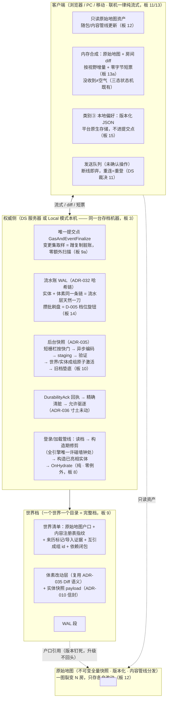
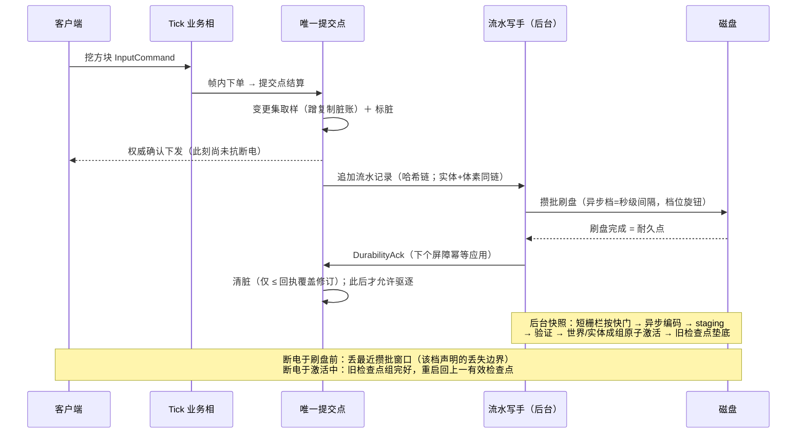
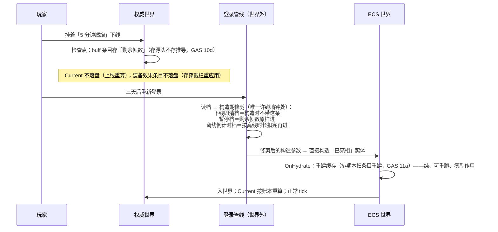

# LumioGameEngine 游戏存档机制设计概要（定稿）

> **状态**：2026-08-30 定稿。Owner 与 Gameplay 架构总监双方认账；会中逐板裁决流水见 [`2026-08-30-save-load-architecture-decisions.md`](2026-08-30-save-load-architecture-decisions.md)（引用记作「板 N」）。本文档是存档框架三类别（① 场景/体素 ② 动态实体与游戏事件 ③ 玩家本地偏好）的唯一架构框架源；参数数值（攒批间隔、快照周期、缓存容量）归实现仓自由度；机器化契约按「ADR 候选清单」逐条落 ADR（本文档不占号）。
> **弹药**：体素大世界存档外部调研 [`docs/research/2026-08-29-map-save-load/`](../research/2026-08-29-map-save-load/)（文档级、十系统交叉验证，权威）；配表管线调研（仅用于类别③划界）；ECS/DS/GAS 三份定稿。
> **对账基线**：ADR-001–049、D-001–016。**无任何 Accepted ADR 被推翻；ADR-010/032/033/035/036/024/004 寸土未动；今日零 BaselineId 变更。**
> **会议原则（Owner 定）**：底层框架不管业务；第一性原理、能砍就砍；性能优先；每条结论配真实游戏例子与大白话。
> **快速模式豁免声明**：本次交付为纯文档（架构定稿＋会中流水），按 AGENTS.md 快速模式白名单收口（lint＋测试），不派 reviewer。

---

## 1. 一句话定位与设计轴心

**存档不是第二份状态真相，是权威状态在某个切点上的序列化投影**（ADR-008 原则延伸到存档域；GAS「账本即条目」同源）。

老王挖方块一句话主轴：提交点生效（全服看得见）→ 蹭复制系统脏账记一行流水（零额外扫描）→ 攒批刷盘（性能/安全唯一旋钮）→ 回执清脏 → 后台快照短栅栏按快门、异步洗照片、成组原子换档。

**不可妥协核心（收尾三问②，Owner 确认）**：**唯一提交点取样 ＋ 世界/实体一刀切成组换档 ＋ 落盘的档永远完整可开**。它是 Accepted ADR 打底（ADR-002/010/035/036）、GAS/DS 已消费的骨架；将来砍功能先护它，其余全是旋钮。

三条全局公理（板 1/3/14）：

1. **存档跟角色走，不跟机器走**：谁是权威，完整存档机器就在谁那儿；投影端永远只有缓存。一份能力多平台，平台差异只允许出现在存储介质适配器与耐久档位两处。
2. **多平台支持 ≠ 多平台同保证**：每个宿主开档必须显式声明耐久档位与丢失边界，不声明不许开档。
3. **性能优先的精确含义**：丢失窗口可交易（三档取值一律往性能侧拧）；**档完整性不可交易**（草稿区写→验证→原子交接→旧档垫底，ADR-010 红线，全在后台零 tick 成本）。

## 2. 分层总图（定稿）

**平台矩阵（板 3/3b/11/13）**：

| 平台/形态 | 世界数据 | 本地偏好 | 默认耐久档 |
|---|---|---|---|
| DS 服务器 | 权威档（检查点＋WAL） | — | 异步档（丢秒级，运行时可切） |
| PC Local 模式 | 权威档，同一机器＋文件适配器 | 本地文件 | 仅快照档（丢到上个快照点） |
| 移动 Local 模式 | 机制同 PC；内存/启动预算待 D-006 实测，V1 不承诺档期 | 本地文件 | 仅快照档 |
| PC/移动联机 | 纯流式不落盘＋只读原始地图资产 | 本地文件 | —（权威在服务器） |
| 浏览器 | **无 Local 模式、不做本地存档**（板 3b）；联机纯流式；原始地图走网络资源加载 | IndexedDB | — |

## 3. 模块职责与对外契约表

| 模块 | 归属 | 拥有 | 对外契约 | 板 |
|---|---|---|---|---|
| 实体快照 payload | Runtime 存档域 | canonical 实体列表（类型指纹＋组件字段组＋引用存网络 ID）、Full/Partial 范围 | ADR-010 信封＋ADR 候选 1；字段取舍由 ECS §6.1 存档标记决定 | 4 |
| 版本迁移（实体＋体素） | Runtime 存档域＋转档工具 | 类型指纹核对；小改自动（加字段默认值/删字段丢弃记账）；大改拒开档＋转档工具 | ADR 候选 5；写档只写当前版本；读时兼容永不写回旧档 | 5/16 |
| 构造期修剪 | 登录/加载管线 | 读档后、入世界前的唯一墙钟窗口；只出构造参数不写档（幂等）；仅权威侧 | ADR 候选 1；OnHydrate 纯度零例外 | 8 |
| 跨域一刀切 | Runtime 协调者（ADR-035 既有切点主人） | ①②同切点同修订向量；快照互引成组原子激活；恢复固定顺序（注册表→世界→实体→玩家落位）；缺块挂起 | ADR 候选 1/2 互引字段 | 10 |
| 世界清单与原始地图 | Runtime 存档域 | 户口（base id/版本/哈希）、指纹、来历、导入证据、依赖闭包、整目录完整档 | ADR 候选 2 | 9/12/16 |
| 体素改动层 | VoxelEngine | 房间档＝单层持久化 Diff（复用 ADR-035 语义）；按视野增量派发＋零字节短票 | ADR 候选 4（与 DS 体素 chunk 状态机候选合并） | 12/13a |
| 耐久档位 | Host 持久化编排 | 三档语义＋丢失边界＋默认档＋正常退出必落盘＋运行时可切 | ADR 候选 3＝D-005 Confirmation 件 | 14 |
| 本地偏好 | 客户端各平台 | 版本化 JSON、缺省填充、平台原生存储 | 设计文档级（四个不要：不进提交点/不进快照/无确定性哈希/无转档工具） | 15 |
| 事件历史 | **框架不提供** | — | 恢复日志禁挪用（ADR-032 红线）；回放归录像域（DS 既有） | 7 |

## 4. 两张端到端时序图

### 4.1 挖一个方块 → 断电后还在

### 4.2 Buff 挂起 → 下线 → 重新登录（GAS 三档各走一次）

## 5. 冻结语义清单（落点见括号）

1. 触发方式：①②在权威侧同一检查点节奏自动落盘，无「保存按钮」；③改动即存、独立生命周期（板 1）。
2. 存档跟角色走；宿主必须显式声明耐久档位与丢失边界，不声明不许开档（板 3；ADR 候选 3）。
3. 网页无 Local 模式、不做本地存档；网页玩家的一切在服务器（板 3b）。
4. 类别②载体＝ADR-010 信封＋实体快照 payload（Full/Partial）；恢复＝构造已亮相＋只跑 OnHydrate（板 4；ADR 候选 1）。
5. 迁移两条路：免工具小改仅「加字段默认值填／删字段丢弃记账」两种，机器按类型指纹判；其余一切＝大改，拒开档＋转档工具（staging→验证→原子切换→旧档保留）；读时兼容永不写回旧档；写档永远只写当前版本（板 5；ADR 候选 5）。
6. 存档框架唯一数据形态＝快照；不提供事件历史原语（翻旧账业务将来立项独立旁路服务，不碰存档骨架）；恢复日志禁止对业务开放当数据源（ADR-032 红线）；回放＝输入流＋快照重放，归录像域（板 7）。
7. 「构造期修剪」契约点：读档后、入世界前，唯一允许读墙钟的门；只出构造参数不写档（幂等）；仅权威侧；OnHydrate 纯度零例外；GAS buff 三档＝内容层拼法非框架概念（板 8；ADR 候选 1）。
8. 一个世界一份存档；无槽、无回档功能；备份＝用户整目录拷走（备份闭包进契约）；换档瞬间磁盘短存两份是安全动作非回档；存档名等元数据＝宿主清单不进规范字节（板 9）。
9. 存档写路径开销 ≤ tick 预算固定百分比，进垂直切片与 ADR-016 性能关口径；超标退路＝D-005 降档，动旋钮不动架构（板 9a）。
10. ①②同一逻辑切点、同一修订向量；体素/实体快照互引成组、成组原子激活（一边失败＝整组作废回旧组）；恢复固定顺序＝注册表→世界→实体→玩家落位；实体引用的方块未就位＝挂起等待不当空气（板 10；ADR 候选 1/2）。
11. 联机＝纯流式：客户端不落盘世界数据；动态实体永远服务器全量；内存「脏」三分类（已确认可丢重拉／发送队列断线即弃／派生重算）；磁盘只读缓存＝预留位，触发＝实测首屏/带宽超标（板 11）。
12. 原始地图裂变模型：原始地图＝不可变全量快照资产（格式复用规范快照，零新格式）；房间档＝户口＋单层持久化改动层（复用 ADR-035 Diff 四条语义）＋流水账；原始地图版本开房即钉死、升级不回头改已有房间；老房搬新图＝显式工具预留；依赖闭包缺失拒开（板 12；ADR 候选 2/4）。
13. CS 客户端＝内存合成：硬盘上只有只读原始地图资产，无落盘变体、无变体同步机器；diff 按视野增量派发，未改动块发零字节短票；每块 diff 全服一份可缓存；短票也是票，「没改动」≠「还没收到」；原始地图永不当权威（板 13/13a；ADR 候选 4）。
14. 耐久三档（完整/异步/仅快照）＋每档丢失边界白纸黑字；默认 DS＝异步、Local＝仅快照；完整档 V1 不默认；正常退出必落盘；运行时可切＝D-005 Confirmation 建议（板 14；ADR 候选 3）。
15. 类别③改名「本地偏好」，与 ADR-010「Config」（策划调优表）永久分家；平台原生存储；版本化 JSON 缺省填充；四个不要；只存玩家本地、云同步先不说（触发＝产品提「换设备带设置」，届时走账号服务）（板 15）。
16. 体素迁移继承第 5 条两条路；「改 chunk 尺寸/坐标语义类＝永远大改」无例外（板 16）。
17. MC 导入＝离线工具产出普通原始地图，不碰存档骨架；世界档预留三字段（内容注册表指纹/来历标记/导入证据）；B/C 决策清单推迟，触发＝工具立项（板 16）。

## 6. 体素调研 S.1 十条洞察逐条过账

| # | 洞察 | 裁决 | 去向 |
|---|---|---|---|
| 1 | 规范逻辑字节与物理压缩拆层 | **采纳原则** | V1 默认 codec＝None（D-013 已确认）天然满足；开启压缩的解锁条件已在 D-013/D-014 框架内，届时按 ADR-041/047 canonical profile 闭合哈希域 |
| 2 | Authority 与 Replica 不共物理容器 | **采纳且更狠** | V1 Replica 干脆无容器（纯流式，板 11/13）；全场只剩权威一族容器 |
| 3 | 异步加载候选批次过唯一提交点 | **采纳＝既有** | ADR-024 generation/迟到结果拒绝＋DS 裁决 16 体素自治；E 章细化归 VoxelEngine 实现 |
| 4 | Replica dirty 拆三类 | **改造后采纳** | 磁盘维度因纯流式消失；三分类保留为内存驻留规则防 OOM（板 11） |
| 5 | MC 导入走 adapter→IR→mapping→canonical | **采纳原则、推迟执行** | 板 16；触发＝工具立项 |
| 6 | u32 只能是局部句柄，需语义注册表 | **改造后采纳** | 指纹先行（世界档记内容注册表指纹，D-007 强制更新＋转档工具兜底）；完整 registry artifact 带触发条件（内容包/模组生态或转档工具立项，先到先触发） |
| 7 | base lineage＋三态 overlay | **改造后采纳** | lineage 采纳（户口＋版本钉死）；三态 whiteout/三方合并因「升级不回头」整章出图（板 12），触发＝官方地图更新须进已有房间 |
| 8 | 迁移双路径（读时修复 vs 离线重分区） | **采纳** | 板 5/16；且比调研更狠——读时修复只留「加/删字段」两种 |
| 9 | 冷启动目标是 SpawnSafe 不是 AllLoaded | **采纳＝既有** | 恢复固定顺序（板 10）＋缺块≠空气（ADR-024）＋玩家准入=脚下就位（体素自治域） |
| 10 | 格式与 inspector/repair/corpus/benchmark 一起冻结 | **部分采纳，记 known gap** | golden fixture 纪律既有（ADR-010/035 Verification）；修复工具/坏档语料/观测面未进 V1 冻结面——见 §11 保留意见 3 |

## 7. 体素调研 S.9「如果从零重做」四张清单过账

- **保留画像中的决定（8 条）**：全部已由 Accepted ADR 覆盖——显式 presence/缺失≠空气、修订绑定不重绑（ADR-024）；规范序规范字节与 Full/Partial/Diff（ADR-035）；短栅栏＋pin 所有权（ADR-035）；修订级回执与脏块禁驱逐（ADR-036）；WAL 哈希链＋只重放认证记录（ADR-032）；staging/fsync/原子激活/保留上一检查点＋迁移 DAG（ADR-010/013）；不可变硬预算（ADR-024）。✓ 零重开。
- **会修改/澄清的决定（5 条）**：① logical/physical 字节拆分→同 S.1-1 处置；② Dirty 拆三类→板 11 内存级采纳；③ 客户端服务器不同物理格式→更狠，客户端无格式（板 13）；④ page 为最小持久化/diff 单位→D-014 已判 adapter-internal，不重开；⑤ 加载驻留不推进内容修订→ADR-035 读图结论既有，确认。
- **会立即补上的模块（9 条）**：StorageContainerProfile→权威一族容器（实现仓；框架级契约只有「整目录＝完整档」板 9）；WorldManifest→板 12/16（ADR 候选 2）；BlockRegistryArtifact→指纹先行＋触发条件（板 16）；LoadScheduler→VoxelEngine 自治（DS 裁决 16）；MinecraftImport→推迟（板 16）；ContentOverlay→单层改动层（板 12），三方合并出图；MigrationRuntime→转档工具（板 5/16；断点 journal 等属工具实现自由度）；StorageTooling→known gap 带触发（§11）；CrossDomainFence→板 10 ✓。
- **首个可开工 Gate**：改造后采纳进 §12 垂直切片——去掉 MC fixtures 前置（MC 已推迟），保留断电注入、双端一致、有损报告等验收项。

## 8. GAS 已消费承诺的兑现记录

| GAS 决议 | 承诺 | 今日兑现 |
|---|---|---|
| 10d 存源头不存推导、存凭证不存面板 | 存档能表达源头/推导区分；登录管线可在世界外碰墙钟 | ECS §6.1 存档标记（源头进快照、推导标不存档）＋「构造期修剪」契约点（板 8）——两积木拼出三档，框架不认识「三档」 |
| 11a 排期本＝派生缓存不进快照，恢复后扫条目重建 | OnHydrate 义务成立 | OnHydrate 纯度零例外维持（板 8）；恢复＝构造已亮相＋只跑 OnHydrate（板 4） |
| 10b 表现缓冲不进哈希不存档 | 「不存档」标记存在 | ECS §6.1「不存档」维照用；快照哈希域按 GAS 哈希双域不动 |

**结论：GAS 定稿零重开。**

## 9. ADR 候选清单（按优先级；一律不占号，落笔时重核最高号）

1. **实体快照 payload 契约**（refine ADR-010 域）：canonical 实体列表编码、类型指纹、Full/Partial 范围、跨域互引成组字段、恢复顺序、构造期修剪契约点。
2. **世界清单与原始地图依赖契约**（refine ADR-010/035）：户口（base id/版本/哈希）、内容注册表指纹、来历标记、导入证据、依赖闭包、整目录备份闭包。
3. **耐久档位 profile（D-005 Confirmation 件）**：三档语义＋丢失边界＋默认档＋正常退出必落盘＋运行时可切——与 DS 定稿 ADR 候选 4 同件合并，勿开两号。
4. **体素改动层持久化契约**（refine ADR-035/036，与 DS「体素客户端 chunk 状态机」候选合并）：房间档单层 Diff 语义、零字节短票、按视野增量派发。
5. **转档工具契约**（refine ADR-010/013）：指纹判定小改/大改边界、staging/原子激活/旧档保留、迁移证据。
6. **本地偏好**：设计文档级即可，暂不占 ADR；若将来跨仓需要契约再升级。

**D 表处置建议**：D-005 按 ADR 候选 3 走 Confirmation Record；D-007 维持零改动（本定稿消费其简化：写档只写当前版本）；D-012/D-013/D-014 零改动。**今日零 BaselineId 变更。**

## 10. 今天砍掉的东西（每条有「删掉它哪条需求也不塌」记录）

| 砍掉 | 处置 | 触发条件 |
|---|---|---|
| 客户端磁盘缓存/落盘变体同步 | 预留位（只读哈希缓存，缓存非变体） | 实测首屏/带宽超标 |
| 事件历史存储原语 | 明确不做（独立旁路服务） | 第一个「翻旧账」业务立项 |
| 存档槽/回档功能 | 明确不做 | 产品提出回档需求 |
| 原始地图热更进已有房间（whiteout/三方合并） | 明确不做（版本钉死） | 产品要求官方地图更新进已有房间 |
| MC 导入 B/C 决策清单 | 推迟（三预留字段已埋） | 转档工具立项 |
| 云同步本地偏好 | 明确不做 | 产品提「换设备带设置」 |
| 浏览器本地存档/Local 模式 | 明确不做（Owner 终裁，无预留） | —（重开须新裁决） |
| GAS buff 三档框架化 | 不进框架（内容层拼法） | — |
| 完整耐久档默认 | 不默认 | 交易/结算类场景出现时按档启用 |

## 11. 分歧与保留意见

1. **措辞边界记录（板 14）**：Owner「性能优先、其次正确性」经双方确认限定于**丢失窗口**；档完整性（staging/验证/原子激活/旧档垫底）为 ADR-010 红线不参与交易。无实质分歧，记录防将来误读。
2. **总监保留（板 11/13）**：纯流式的进房流量与首屏耗时未实测；收敛证据＝垂直切片实测，超标启只读缓存预留位（协议无损，晚加不欠债）。
3. **总监保留（工程面 known gaps，调研摘要 10/S.1-10）**：修复工具（verify/rebuild-index/salvage）、坏档历史语料、存档观测面（脏龄/WAL 尾长/快照滞后指标）未进 V1 冻结面。收敛证据＝垂直切片含断电注入兜底；**首次线上事故复盘前必须补齐工具面**，届时回图。
4. ECS/DS/GAS 三份定稿的既有保留意见（哈希降级、可见性泄露面、重连体感、Timer 接缝）不因本定稿改变，收敛证据照旧。

## 12. 路线证伪出口

**垂直切片（跑通＝路线成立）**：挖方块→异步档断电→重启还在（丢失窗口符合声明）→ 实体属性变化→重启后 OnHydrate 正确重建缓存 → buff 三档各走一遍（含离线倒计时的构造期修剪）→ EntityType 加字段后老档默认值填充可读 → 大改跑转档工具、中途断电重跑、旧档完好 → 两房间共享一张原始地图各自 diff、进房按视野增量拿 diff＋短票 → 世界/实体一刀切：断电恢复后箱子与背包无复制无丢失 → 本地偏好缺字段默认值重建 → 写路径开销实测 ≤ tick 预算比例。

**Kill criteria（信号出现＝承认失败走退路，不硬扛）**：

1. 写路径开销超 tick 预算比例且降档无效 → 回图重审「蹭复制脏账」设计（先查实现，后疑架构）。
2. 进房流量/首屏实测超标 → 启只读缓存预留位（板 11），协议零改动。
3. 改动层「一跳查找」读放大实测不可接受 → 实现仓先审合并策略；仍不行回图重审单层模型。
4. 一刀切成组激活的失败率/延迟超标 → 回图重审组粒度（世界/实体分组边界），红线（不许半组生效）不动。
5. 转档工具在目标规模跑不完 → 工具侧分区断点先行（实现自由度）；仍不行回图。

**回图触发条件总表（非日期，全部是信号）**：见 §10 各行触发条件列。

## 13. 收尾三问记录（Owner 确认）

1. **契约互检**：三类别取样点/恢复钩子/耐久档位三口径一致——①②锚唯一提交点＋同刀（板 10），③明确豁免（不进模拟/快照/复制）；OnHydrate 一个口径（零例外，重建缓存义务覆盖 GAS 排期本与体素派生缓存）；D-005 三档管①②、③无档位。全场新增概念仅 2 个（构造期修剪、原始地图＋改动层——后者复用 ADR-035 Diff 语义），零新计数器、零新同步机制、零新格式。
2. **不可妥协核心**：唯一提交点取样＋世界/实体一刀切成组换档＋落盘档永远完整可开。
3. **砍单**：§10 九条全数在案，各有触发条件或明确不做记录。
